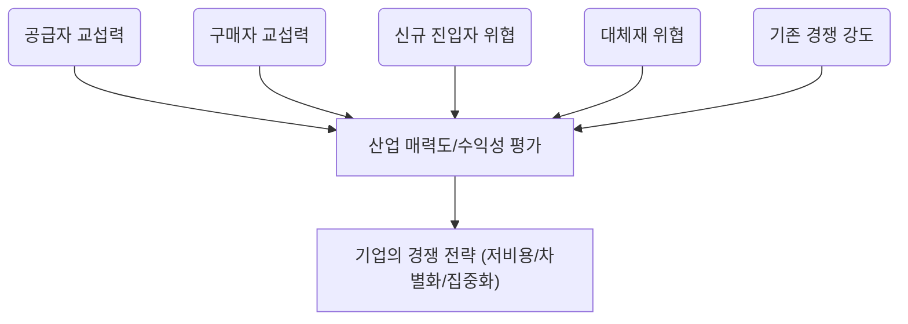

# 포터의 다섯 가지 힘 (Porter's Five Forces) 분석 방법론

## 1. 포터의 5가지 힘: 비즈니스의 '주변 환경' 탐색

- 이 분석은 단순히 우리 회사 내부만 보는 게 아니라, 우리가 속한 산업 전체의 매력을 평가하는 도구예요.
- 마치 부동산을 살 때 집의 내부뿐만 아니라 동네의 치안, 교통, 학군을 모두 살펴보는 것과 비슷하죠.
- 핵심은 산업 자체가 얼마나 돈이 잘 되는 구조인지를 다섯 가지 관점으로 쪼개보는 것입니다.
- 이 분석을 통해 기업은 어떤 시장에서 싸워야 할지, 그리고 어떻게 자리를 잡아야 할지 전략적 판단을 내릴 수 있게 됩니다.

## 2. 경쟁의 5가지 근원: 이들을 파악해야 성공한다

- 포터 교수는 산업 내 경쟁이 일어나는 근본적인 이유가 딱 다섯 가지라고 정리했어요.
- 이 다섯 가지 힘이 강할수록 그 산업은 돈 벌기가 어렵고, 약할수록 수익성이 높다는 뜻입니다.
- 이 다섯 가지 힘을 이해하면 기업은 시장의 경쟁 강도와 매력도를 한눈에 파악할 수 있어요.
- 다섯 가지 힘은 공급자의 힘, 구매자의 힘, 신규 진입자의 위협, 대체재의 위협, 그리고 기존 경쟁자 간의 싸움입니다.

### 1) 공급자의 힘: 재료 수급 물목의 보유자들

- 공급자(원재료나 부품을 주는 사람)가 우리에게 콧대를 세울 수 있는지를 보는 힘이에요.
- 만약 우리 제품 원가의 대부분을 그들의 재료가 차지한다면 그들은 갑이 될 수밖에 없죠.
- 또, 그들이 파는 물건을 다른 회사에서 구하기 너무 어렵거나 바꿀 때마다 큰 추가 비용이 든다면 힘이 세집니다.
- 이들은 우리 회사를 건너뛰고 우리 고객에게 직접 팔 수도(전방 통합) 있어서 더 무섭죠.

### 2) 구매자의 힘: 가격 흥정의 달인들

- 구매자(우리가 만든 물건을 사주는 고객)가 가격을 마구 깎아내리거나 품질을 높이 요구할 수 있는지 분석하는 거예요.
- 만약 우리 회사 제품을 사는 큰 손님이 소수라면, 그들은 가격 협상에서 우위를 점하기 쉽습니다.
- 우리가 만든 제품이 너무 흔해서 (표준화되어 있어서) 고객이 다른 곳에서 쉽게 사 올 수 있다면 힘이 강해지죠.
- 반대로, 고객이 우리 회사를 **바꾸는 데 드는 노력(전환 비용)**이 크다면 그들의 힘은 약해집니다.

### 3) 신규 진입자의 위협: 시장을 노리는 잠재적 경쟁자들

- 아직 우리 시장에 들어오지 않았지만, 언제든 문 부수고 들어와서 시장 파이를 뺏어갈 수 있는 잠재적 경쟁자에 대한 경계심입니다.
- 이들의 위협 수준은 **진입 장벽(Barrier to Entry)**이 얼마나 높은가에 달려 있어요.
  - 규모의 경제: 회사가 커질수록 물건 하나 만드는 단가가 싸지면, 작은 신규 업체는 따라오기 힘들어요.
  - 기술적 우위나 특허: 독점 기술이 있으면 남들이 따라 하기 어렵습니다.
  - 채널 확보: 이미 좋은 유통망이나 브랜드 평판을 선점했다면 신규 업체가 비집고 들어오기 어렵습니다.

### 4) 대체재의 위협: '완전히 다른 것'의 습격

- 대체재는 우리 제품과 완전히 다른 종류이지만, 고객의 같은 욕구를 채워줄 수 있는 것을 말해요.
- 예를 들어, KTX의 대체재는 비행기일 수도 있지만, '빨리 이동하고 싶다'는 욕구 충족에서는 자동차도 넓은 의미의 대체재가 될 수 있어요.
- 대체재가 너무 좋거나 싸게 등장하면, 우리 제품 가격을 올리기 힘들어지거나 품질 개선 압박을 받게 됩니다.
- 고객이 쉽게 대체재로 갈아탈 수 있다면 (전환 비용이 낮다면) 이 위협은 더욱 커집니다.

### 5) 산업 내 경쟁 강도: 치열한 내부 싸움

- 같은 시장에서 이미 활동 중인 경쟁사들끼리 피 튀기는 싸움을 하는 정도를 의미해요.
- 이 경쟁은 주로 가격 인하, 광고, 신제품 출시 등으로 나타나며 서로의 이익을 깎아내리죠.
- 경쟁이 심해지는 주된 이유는 시장이 성장 정체기에 접어들었거나, 경쟁사들이 너무 많을 때 발생합니다.
- 결국 이 내부 경쟁이 치열하면, 산업 전체의 평균 수익률은 낮아지게 됩니다.

## 3. 5가지 힘의 관계 - 전체 구조도로 파악하기

- 이 다섯 가지 힘은 서로 분리된 것이 아니라, 복잡하게 얽혀 산업의 수익성을 결정해요.
- 이 모델은 **"우리가 어느 산업에서 싸울지"**를 결정하는 데 최적화된 도구입니다.
- 분석 후에는 우리 회사의 자원과 산업의 매력도를 비교하여 전략을 짜야 해요.
- 전략은 고정된 것이 아니라 시장 변화에 따라 유연하게 조정되어야 하므로, 이 분석은 주기적인 피드백 과정이 필요합니다.

---

## 4. 출력 포맷 (재현성을 위한 지시문)

> 이 방법론으로 분석을 수행할 때 산출물은 아래 구조를 그대로 따른다. 목적은 **분석 대상(산업)이 바뀌어도 항상 같은 깊이와 형식의 결과물**이 나오도록 하는 것이다. 1·2절이 "무엇을 물을 것인가"를 정한다면, 이 절은 "그 답을 어떤 문서 구조에 담을 것인가"를 정한다.

### 4-1. 개별 산업 분석 파일 구조

1. **머리말**: `# 산업 분석: {분석 대상}` 제목, `## 포터의 다섯 가지 힘(Five Forces) 분석` 부제, blockquote로 분석 대상 범위·기준일·`분석-방법론.md` 링크(및 존재한다면 다른 챕터의 관련 분석 링크)를 명시한다.
2. **종합 판단 표 (필수, 본문 최상단)**: 5가지 힘 전체를 담은 표를 반드시 넣는다. 열은 `힘 | 강도 | 한 줄 요약` 3열로 고정하고, "강도"에는 매우 강함/강함/중간/약함/매우 약함, 또는 낮음/매우 낮음/치열함 등 그 힘의 성격에 맞는 정성적 등급을 쓴다.
3. **산업 매력도 판단 (필수)**: 종합 판단 표 바로 아래, `**산업 매력도**: {등급}.` 로 시작하는 2~4문장 문단을 둔다. 다섯 힘을 하나씩 되풀이하지 말고 **"왜 이 등급인가"를 하나의 논리로 압축**해 제시한다.
4. **본문 서술**: `## 1) 공급자의 힘: {강도}` ~ `## 5) 산업 내 경쟁 강도: {강도}` 형태로 소제목에 강도를 함께 적고, 5개 힘을 순서대로 서술한다.
   - 질문표의 질문에 하나씩 순서대로 답하지 말고, 질문을 참고삼아 **그 산업의 구체적 사실(수치·기업명·규제·사례)**로 bullet를 채운다. 추상적 질문 문장을 그대로 복사하지 않는다.
   - 확인되지 않아 업계 관행으로 추정한 내용은 문장 안에서 "~로 추정된다/추론"처럼 즉시 표시한다.
   - 가능하면 힘마다 마지막 bullet로 다른 챕터(예: 가치사슬 분석)의 관련 분석과 상호 링크한다.
5. **(선택) 규제·제도 변수 표**: 산업의 매력도가 향후 규제·정책 변화에 크게 좌우되는 경우, `시점 | 이벤트 | 산업에 미치는 영향` 표를 본문 뒤에 추가한다. 규제 변수가 크지 않은 산업이라면 생략한다.
6. **참고 출처**: 파일 하단에 마크다운 링크 목록으로 정리한다.
7. **자료 신뢰도 참고**: 마지막 인용구(`>`)로, 공개 자료로 확인되지 않아 추정한 항목이나 자료 간 편차가 큰 수치(시장 규모 전망치 등)를 명시한다.

### 4-2. 비교 분석 파일 구조

두 개 이상의 산업을 분석했다면 비교 파일을 별도 문서로 작성하며, 아래 구조를 따른다.

1. **힘의 강도 비교표**: 5가지 힘 × 대상별 요약 × "어느 쪽이 더 유리한가" 판정을 한 표에 담는다. 필요하면 "현재 수익성/실적 검증 여부"처럼 산업 고유의 비교 행을 추가한다.
2. **핵심 차이**: 각 대상에서 "무엇이 산업을 짓누르는가/지키는가"를 소제목으로 나눠 서술형으로 대비하고, 두 산업이 공유하는 공통 패턴이나 시간축(성숙 산업 vs 초기 산업 등)의 차이를 별도로 짚는다.
3. **산업 매력도 최종 비교표**: 현재 시점 매력도, 향후 전망, 신규 진입 난이도 등을 항목별로 비교한다.
4. **전략적 시사점**: 번호가 매겨진 목록으로 실행 가능한 판단을 제시하고, 마지막 항목에는 다른 챕터(다른 프레임워크)의 비교 분석과의 연결점을 넣는다.
5. **구조도 (mermaid)**: 각 대상의 다섯 힘과 매력도 판단을 하나의 다이어그램으로 시각화한다.

### 4-3. 파일·폴더 네이밍

- 챕터 폴더: `{순번 2자리}-{프레임워크 영문 슬러그}` (예: `01-porters-five-forces`)
- 방법론 파일: `분석-방법론.md`
- 개별 분석 파일: `분석-{순번 2자리}-{분석대상 kebab-case}.md`
- 비교 파일: `비교-{순번1}-vs-{순번2}.md`
