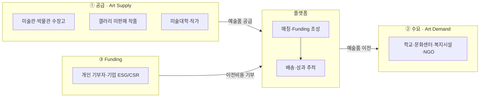
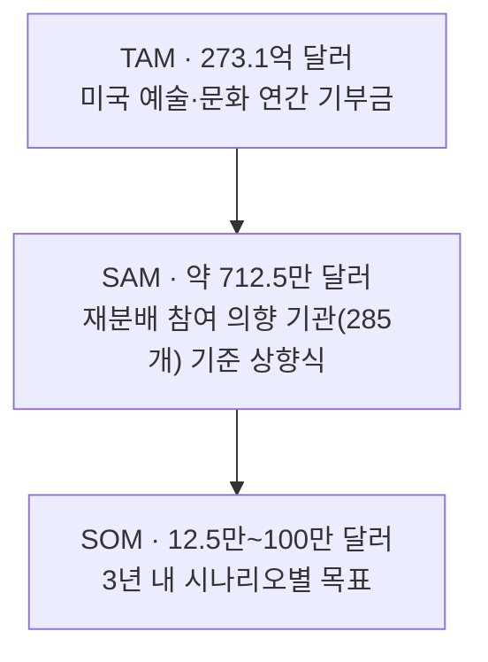
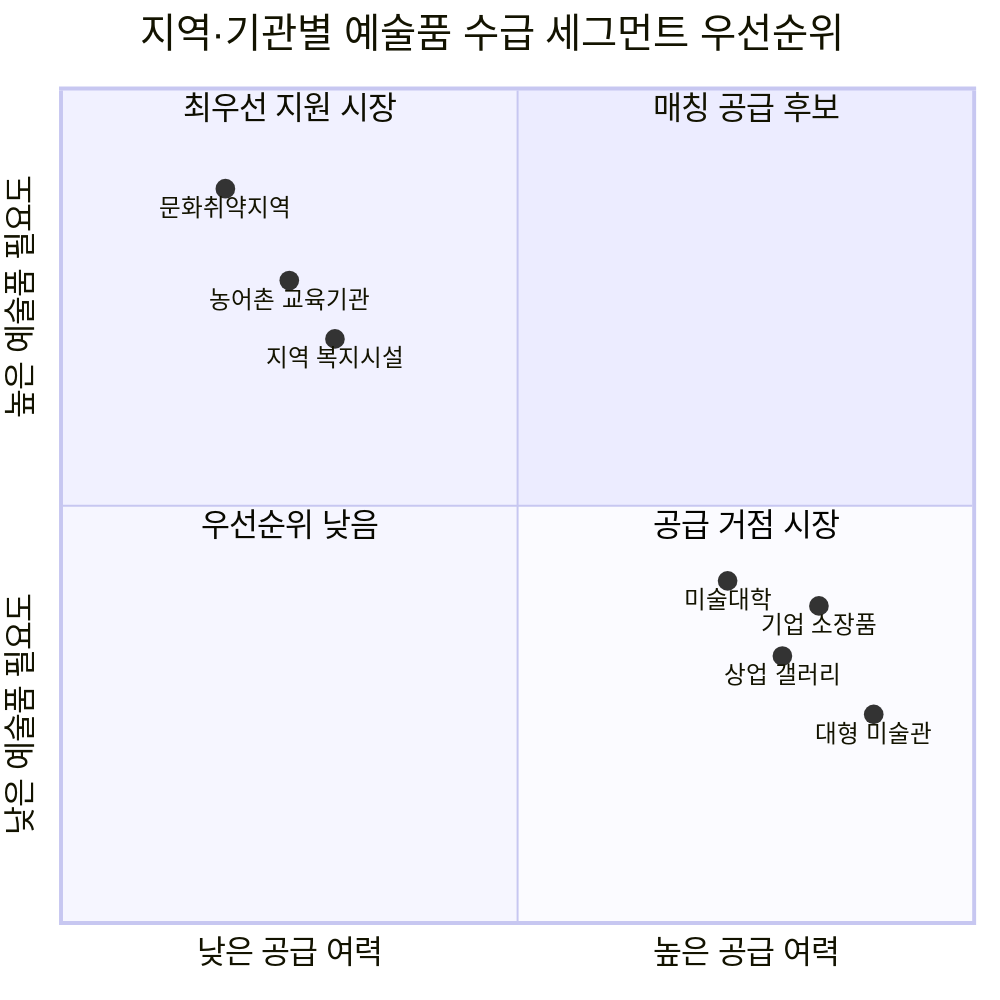

# 6. TAM-SAM-SOM & Market Segment — 예술품 재분배 × 미술품 토큰증권 가치순환 플랫폼

> **원본:** [챕터 04 분석-방법론](../04-tam-sam-som/분석-방법론.md) · [분석-03](../04-tam-sam-som/분석-03-예술품-재분배-플랫폼.md)을 이 자리의 형식에 맞춰 압축. 전체 계산 과정·수치검증 메모·사후 기록은 원본 참조.
> **기준일:** 2026-08-07

## 시장 구조 — 3면 시장

## TAM → SAM → SOM

| 단계 | 수치 | 표기 | 산출 방식 |
|---|---|:---:|---|
| **TAM** | **273.1억 달러**(미국 예술·문화 연간 기부금, 2025, +7.5%) / 596억 달러(글로벌 미술시장 거래액, 맥락 앵커) | (확인) | 하향식 — Giving USA 2026, Art Basel & UBS 2026 |
| **SAM** | **약 712.5만 달러/년** = 285개 참여 가능 기관(확인) × 1건(가정) × $25,000/건(가정) | (추정) | 상향식 — Art Bridges Foundation Partner Loan Network 참여기관 수를 proxy로 사용. TAM의 약 0.026% |
| **SOM** | **12.5만~100만 달러/년**(3년 목표, 보수적/기본/낙관 시나리오) | (가정) | 한국 정부미술은행(연 약 130만 달러 구입예산) 벤치마크 대비 5.3~29% |

> ⚠️ **TAM과 SAM은 같은 측정 대상이 아니다.** TAM은 하향식(미국 전체 기부금 총량), SAM은 상향식(참여 의향 기관 합산)으로 별도 산정했다 — Giving USA가 목적별 비중을 공개하지 않아 하향식 필터링 자체가 불가능했기 때문이다.

## Market Segment — 어느 사분면을 먼저 공략하는가

**우선순위:** ①(2사분면) 문화취약지역·농어촌 교육기관·지역 복지시설을 초기 파일럿 수요처로 ②(4사분면) 대형 미술관·기업 소장품을 우선 공급 파트너로 ③(1사분면) 미술대학·상업 갤러리는 매칭 로직 검증 후 확장.

## 근거 등급 및 다음 질문

| 답한 것 | 답하지 못한 것 |
|---|---|
| 3면 시장 구조와 각 축의 상대적 규모 | 실제 재분배 참여 동기 — 공급기관이 기존 대안(수장고 보관) 대신 이 플랫폼을 택할 이유 |
| 1차 공략 세그먼트(2사분면 수요, 4사분면 공급) | 이전비용을 실제로 누가 지불하는가 — 기부자 확보 난이도 |

전문·수치검증 메모·사후 기록은 [챕터 04 분석-03](../04-tam-sam-som/분석-03-예술품-재분배-플랫폼.md) 참조. → [7_persona-spectrum-map.md](./7_persona-spectrum-map.md)로 이어진다.
