# 7. 페르소나 스펙트럼 맵 — 예술품 재분배 × 미술품 토큰증권 가치순환 플랫폼

> **원본:** [챕터 05 페르소나 스펙트럼](../05-persona-journey/분석-03-예술품-재분배-플랫폼-페르소나-스펙트럼-.md)을 이 자리의 형식에 맞춰 압축. 각 인물의 첫 접점·전환/이탈 조건·검증 우선순위 등 상세는 원본 참조.
>
> ⚠️ **이름 표기 안내.** 챕터 05 원본은 강사 형식에 맞춰 "직무명+슬로건"으로 인물을 표기한다(예: "독립 작가 「팔리지 않아도 쓰임은 끝나지 않았다」"). 그러나 챕터 06(AOS·DOS)·07(JTBD)은 그 이전 판본의 **가상 실명**(김서윤·박소연 등)을 그대로 쓴다. 이 파일과 [9_aos-dos-analysis.md](./9_aos-dos-analysis.md)·[10_jtbd-interview-report.md](./10_jtbd-interview-report.md) 간 수치 연결을 위해, 아래 표는 **실명 표기를 기준**으로 직무명을 병기한다.

## 스펙트럼 배치 (12종)

```mermaid
graph LR
    subgraph CORE["Core 핵심 5"]
        A["독립 작가 김서윤"]
        B["미술관 컬렉션 박소연"]
        C["학교 문화예술 이지현"]
        D["개인 기부자 정민준"]
        E["기업 CSR 최은영"]
    end
    subgraph ADJ["Adjacent 확장 3"]
        F["미술대학 한유진"]
        G["갤러리 윤태호"]
        H["지역문화시설 오수진"]
    end
    subgraph EXT["Extreme 극단 2"]
        I["신진 작가 임하늘"]
        J["NGO 김도현"]
    end
    subgraph NON["Non-user 비활성 2"]
        K["기관자산 서재원"]
        L["학생 박하린"]
    end
    CORE --> ADJ --> EXT --> NON
```

## 12종 요약

| 유형 | 인물(직무명) | 역할 | 핵심 문제 | 대체 솔루션(가설) |
|---|---|---|---|---|
| 핵심 | 독립 작가 김서윤 | 공급 | 미판매 작품이 새 쓰임 없이 누적 | 계속 보관·저가 판매·지인 기증·폐기 |
| 핵심 | 미술관 컬렉션 박소연 | 공급(기관) | 유휴 소장품, 보존 책임 때문에 처분 어려움 | 수장고 장기 보관·기관 간 대여 |
| 핵심 | 학교 문화예술 이지현 | 수요 | 학생이 실제 작품을 접할 기회 부족 | 미술관 견학·온라인 이미지·단기 예술교육 |
| 핵심 | 개인 기부자 정민준 | Funding | 기부 결과를 구체적으로 체감하기 어려움 | 일반 NGO 기부·문화재단 후원 |
| 핵심 | 기업 CSR 최은영 | Funding | 사회공헌 성과를 수치로 설명하기 어려움 | 일반 현금기부·기존 CSR 프로그램 |
| 확장 | 미술대학 한유진 | 공급(교육기관) | 졸업작품의 반환·보관·권리 처리 필요 | 학생 반환·교내 보관·폐기 |
| 확장 | 갤러리 윤태호 | 공급 | 작가 계약·권리 때문에 임의 재분배 어려움 | 재전시·할인 판매·작가 반환 |
| 확장 | 지역문화시설 오수진 | 수요(공공시설) | 공간은 있으나 지속 작품 확보 예산·콘텐츠 부족 | 지역작가 섭외·단기 기획전 |
| 극단 | 신진 작가 임하늘 | 공급(보관한계) | 보관이 작업공간 자체를 압박 | 외부 창고·저가 판매·폐기 |
| 극단 | NGO 김도현 | 수요(자원 의존) | 작품·운송비를 자체 조달하기 어려움 | 단기 문화사업·현지 조달 |
| 비활성(제약형) | 기관자산 서재원 | 잠재 공급 | 권리·보존·책임 불명확으로 진입 못함 | 기존 보관 유지·원소유자 반환 |
| 비활성(비접근형) | 학생 박하린 | 최종 향유자 | 실제 작품을 일상적으로 접할 기회 제한적 | 온라인 이미지·교과서·미술관 견학 |

> 🔍 **JTBD 예행연습(챕터 07)이 13번째 표본을 발견했다** — 재분배 참여를 포기한 독립 작가(R8). 12종 어디에도 없던 인물로, "폐기"보다 "낙인"이 더 큰 이탈 장벽일 수 있음을 드러냈다. 상세는 [10_jtbd-interview-report.md](./10_jtbd-interview-report.md) 참조.

## 사전 설득 대상 (스펙트럼 밖 운영 이해관계자)

작가·저작권자, 기관 자산·법무 담당, 작품 상태·보존 검토자, 운송·보험 파트너, 수령기관 시설 책임자, 가치평가·토큰증권 전문가 — 이들은 고객이 아니라 **작품 한 점이 실제로 이동하기 위해 승인·계약·검토가 필요한 운영 이해관계자**다. 상세는 [챕터 05 §4](../05-persona-journey/분석-03-예술품-재분배-플랫폼-페르소나-스펙트럼-.md#4-사전-설득-대상-명부--스펙트럼-밖) 참조.

## 검증 우선순위 — 페르소나보다 먼저 확인할 것

1. 실제로 재분배 가능한 유휴·폐기 가능 작품이 존재하는가
2. 작품 보유자는 어떤 조건에서 외부 재분배에 동의하는가
3. 수요기관이 실제 작품을 원하고 설치·관리할 수 있는가
4. 개인·기업이 이전비용을 지원할 의향이 있는가
5. 재분배 이후의 활용 이력이 가치평가에 의미가 있는가

→ [8_customer-journey-map.md](./8_customer-journey-map.md)로 이어진다.
