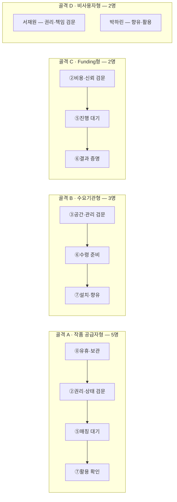

# 8. 고객 여정지도(CJM) — 예술품 재분배 × 미술품 토큰증권 가치순환 플랫폼

> **원본:** [챕터 05 고객여정지도](../05-persona-journey/분석-03-예술품-재분배-플랫폼-고객여정지도.md)를 이 자리의 형식에 맞춰 압축. 12명 개별 여정지도 전문은 원본 참조.

## 12명은 하나의 여정을 공유하지 않는다 — 4개 골격

일반형 5단계(문제인식→탐색→결정→사용→유지)를 그대로 쓰지 않고, 실제 관문에서 단계를 다시 도출했다.

| 골격 | 인물(5·3·2·2 = 12명) | 결정적 차이 |
|---|---|---|
| **A. 작품 공급자형** | 김서윤·박소연·한유진·윤태호·임하늘 | 작품을 내놓을 수 있는가가 먼저 — 권리·상태·책임 확인과 매칭 대기가 병목 |
| **B. 수요기관형** | 이지현·오수진·김도현 | 공간·관리·수령 조건을 통과해야 함 — 설치 이후 활용까지 가야 가치 전달 |
| **C. Funding형** | 정민준·최은영 | 작품이 아니라 이동비용에 자금을 댐 — 비용 근거와 결과 증명이 병목 |
| **D. 비사용자형** | 서재원(제약형)·박하린(수혜형) | 둘 다 결제 없음이지만 이유가 반대 — 서재원은 참여 전 막히고, 박하린은 플랫폼 없이 결과만 경험 |

## 병목 대조표 (12명 전체)

| 골격 | 인물 | 최대 병목 | 성격 |
|---|---|---|---|
| A | 김서윤 | ⑤ 매칭 대기 | 대기·가시성 |
| A | 박소연 | ② 권리·상태 검문 | 권리·기관 책임 |
| A | 한유진 | ② 동의 수집/④ 일괄등록 | 대량 처리 |
| A | 윤태호 | ② 권리·계약 검문 | 계약·작가 승인 |
| A | 임하늘 | ⑤ 매칭 대기 | 시간 압박 |
| B | 이지현 | ③ 공간·관리 검문/⑥ 수령 준비 | 설치·관리 |
| B | 오수진 | ③ 공간·관리 검문 | 공간 적합성 |
| B | 김도현 | ⑤ 매칭/⑥ 수령 준비 | Funding·현장 실행 |
| C | 정민준 | ② 비용·신뢰/⑤ 진행 대기 | 투명성·공백 |
| C | 최은영 | ④ 내부 승인 | 조직·증빙 |
| D | 서재원 | ② 권리·책임 검문 | 진입 장벽 |
| D | 박하린 | ③ 향유·활용 | 최종 가치 전달 |

## 골격을 넘어 반복되는 공통 Pain 5개

| 공통 Pain | 겪는 인물 | 해소하는 것 |
|---|---|---|
| 작품을 외부로 보내도 되는지 불명확 | 공급자 5명 + 서재원 | 권리·상태 체크 + 표준 동의·계약 |
| 작품과 공간이 실제로 맞는지 판단 어려움 | 공급자 5명 + 수요기관 3명 | 작품-공간 적합성 정보·매칭 기준 |
| 매칭·배송·설치 진행 상태가 안 보임 | 공급자·수요기관·Funding 10명 | 상태 타임라인과 중간 신호 |
| 기부금·후원금이 무엇을 바꾸는지 연결 안 됨 | 정민준·최은영 | 비용 구조 + 작품·기관·지역 단위 Impact |
| **설치 후 실제 활용이 증명되지 않음** | **11명** | **수령·설치·향유·활용 기록** |

> ⚠️ **가장 근본적인 급소는 다섯 번째다.** 작품이 도착했다는 사실만으로 "문화예술 향유가 늘었다"고 말할 수 없다 — 이것이 [VPS §Ⅷ 북극성 지표(Closed-Loop Count)](../04_VPS-final/value-proposition-sheet_art-redistribution-platform_rooted-fin.md#ⅷ-mvp-제품-비전-및-포지셔닝)가 "배송 건수"가 아니라 "활용 확인까지 닫힌 건수"를 세는 이유다.

## 개선 우선순위 Top 3 (12명 중 영향받는 인물 수 기준)

| 순위 | 개선 항목 | 영향 인물 수 |
|:---:|---|:---:|
| 1 | 수령·설치·활용 확인 입력 경로 확보 | 11명 |
| 2 | 작품·매칭·배송 진행 상태 신호 | 10명 |
| 3 | 권리·상태·책임 체크와 표준 문서 | 6명 |

## 12개를 겹쳐야 보이는 것 (요약)

1. **고객마다 시계가 다르다** — 임하늘은 즉시성, 박소연은 기관 실사 주기, 최은영은 예산 보고 주기. 실제 작품 이동 소요시간은 아직 실측 없음.
2. **사회적 성과와 고객 신뢰가 같은 기록에서 나온다** — 박하린의 최종 가치, 정민준의 신뢰, 최은영의 기업 성과, 공급자의 만족이 전부 "설치·향유 기록" 하나로 수렴한다.
3. **작품이 있어도 권리의 '그릇'이 없으면 공급으로 못 들어온다** — 미술관·미술대학·갤러리·기업 잠재 공급자 모두 표준 동의·계약·자산처리 프로세스가 선행 조건.

전문은 [챕터 05 고객여정지도](../05-persona-journey/분석-03-예술품-재분배-플랫폼-고객여정지도.md) 참조. → [9_aos-dos-analysis.md](./9_aos-dos-analysis.md)로 이어진다.
