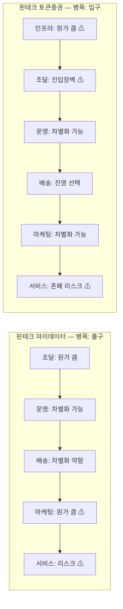

# 비교 분석: 핀테크 마이데이터 vs 핀테크 토큰증권
## 가치사슬(Value Chain) 기준 내부 활동 비교

> **비교 대상**: [분석-01-핀테크-마이데이터.md](분석-01-핀테크-마이데이터.md) · [분석-02-핀테크-토큰증권.md](분석-02-핀테크-토큰증권.md)
> **함께 보기**: [../01-porters-five-forces/비교-01-vs-02.md](../01-porters-five-forces/비교-01-vs-02.md) (동일 두 산업의 포터의 5가지 힘 비교)
> **기준일**: 2026-08-07

---

## 1. 활동별 비교표

| 활동 | 마이데이터 | 토큰증권(STO) | 병목이 더 심한 쪽 |
|---|---|---|---|
| 투입·조달 물류 | 법정 의무이행(협상 불가) + 건별 과금 | 자산 매입 자본 + 신탁 계약 능력 | 대등 — 성격이 다른 두 종류의 조달 장벽 |
| 운영·생산 | 데이터 정제·ML 추천엔진 | 증권성 검토·분산원장 등록 | 토큰증권 (전문성 요구가 더 높음) |
| 산출·배송 물류 | 앱 대시보드, 업계 전반이 유사 | NXT·KDX 진영 선택이 결정적 | 토큰증권 (선택 자체가 병목) |
| 마케팅 및 영업 | 무료+리워드, 차별화 어려움 | 팬덤·IP 스토리텔링, 차별화 여지 큼 | **마이데이터** (구조적으로 저마진) |
| 서비스 | 정보유출 사고 리스크 | 신탁 공백 → 폐업 리스크 | **토큰증권** (실패 시 사업 자체 종료) |
| 기업 인프라 | CISO·준법감시인 등 유지비용 | 자기자본 10억원 + 이해상충방지체계 | 토큰증권 (더 높은 정량적 장벽) |
| 인적자원 관리 | 데이터사이언티스트·정보보호 인력 | 블록체인 엔지니어·구조화 전문가 | 대등 — 둘 다 산업 전체가 인력난 |
| 기술 개발 | 클라우드 네이티브 전환(자체 개발 중심) | 메인넷 진영 선택(제휴 중심) | 성격이 다름 — 마이데이터는 "만드는" 경쟁, 토큰증권은 "고르는" 경쟁 |
| 조달·구매 | 단일 표준 API 이용료(단순) | 신탁사·회계법인·감정평가법인 등 다중 계약(복잡) | 토큰증권 (고정비·복잡도 더 큼) |

---

## 2. 핵심 차이: "가치사슬의 어느 지점에서 병목이 걸리는가"

### 마이데이터 — 출구(마케팅·서비스)에서 새는 구조
마이데이터의 가치사슬은 입구(조달)의 비용 부담도 크지만, 결정적 병목은 **가치사슬의 뒷단, 즉 마케팅과 서비스**에 있다. 무료 서비스로 고객을 모아야 하니 마케팅 비용(리워드·CAC)이 크고, 정작 그 고객은 지불의사가 없어 LTV로 전환되지 않는다. 서비스 활동에서는 정보 유출 사고 한 건이 그동안 쌓은 신뢰를 순식간에 무너뜨린다. 즉 **"고객에게 가치를 전달하고 관계를 유지하는 단계"에서 구조적으로 수익이 새는 산업**이다.

### 토큰증권 — 입구(조달·인프라)에서 이미 걸러지는 구조
반대로 토큰증권은 **가치사슬의 앞단, 즉 조달과 기업 인프라**에서 이미 승부가 갈린다. 자산을 매입할 자본, 신탁 계약을 체결할 신용, 자기자본 10억원 이상의 등록 요건을 통과하지 못하면 애초에 가치사슬 자체가 시작되지 않는다. 일단 이 관문을 통과하고 나면(대형 증권사 8곳 + 기초자산 소싱 전문업체), 뒷단(마케팅·서비스)에서는 오히려 팬덤·IP 스토리텔링처럼 차별화 여지가 더 크다. 단, 서비스 활동에서 신탁 공백 같은 제도적 실패가 발생하면 사업 자체가 폐업(카사·펀블)으로 직결된다는 점에서 **"입구를 통과한 소수에게는 유리하지만, 실패의 대가가 훨씬 치명적인 산업"**이다.

### 두 산업이 공유하는 패턴
9개 활동 전체를 관통하는 공통점은 **"규제가 만드는 활동"(기업 인프라·조달)이 "가치를 만드는 활동"(운영·생산·기술 개발)보다 더 큰 원가 비중을 차지한다**는 것이다. 두 산업 모두 순수한 상품·서비스 경쟁이 아니라 **규제 대응 역량 자체가 가치사슬의 병목**이 되는 한국 핀테크 라이선스 산업의 전형을 보여준다.

---

## 3. 원가 비중·차별화 지도

---

## 4. 전략적 시사점

1. **어느 활동에 자원을 집중해야 하는가**가 두 산업에서 정반대다. 마이데이터에 진입한다면 '운영·생산'(데이터·추천 엔진 고도화)과 '기술 개발'에 자원을 집중해 차별화를 시도해야 한다 — 마케팅에 아무리 돈을 써도 구조적으로 저마진이기 때문이다. 토큰증권에 진입한다면 '기업 인프라'와 '조달'(자본금, 신탁 파트너십, 거래소 진영 선택)을 먼저 통과하는 것이 관건이며, 일단 통과하면 마케팅·산출물 단계에서 상대적으로 더 큰 차별화 여지를 누릴 수 있다.
2. **직접 사업자가 아니라 파트너/공급자로 참여하는 전략**을 고려한다면, 두 산업 모두 "규제 장벽이 낮은 활동"에 좁게 진입하는 것이 합리적이다 — 마이데이터에서는 은행·마이데이터 사업자에게 데이터 분석·추천엔진 기술을 공급하는 B2B(기술 개발 활동에 해당), 토큰증권에서는 증권사에 기초자산·감정평가·AI 밸류에이션을 공급하는 역할([K콘텐츠IP토큰증권_사업기획서_초안.md](https://github.com/ahalenin12-art/business_research/blob/main/K콘텐츠IP토큰증권_사업기획서_초안.md)의 옵션 C·D 경로)이 이에 해당한다.
3. **리스크의 성격이 다르므로 대응 우선순위도 다르다.** 마이데이터 사업자는 '서비스' 활동의 정보보호 체계에 최우선 투자해야 한다(사고 1건 = 브랜드 손상). 토큰증권 사업자는 '기업 인프라'와 '서비스'의 결합 지점, 즉 신탁 구조의 법적 안정성 확보에 최우선 투자해야 한다(제도 공백 = 사업 종료).
4. **포터의 5가지 힘 분석과의 연결**: [산업 비교](../01-porters-five-forces/비교-01-vs-02.md)에서 "마이데이터는 이미 결말이 실증된 산업, 토큰증권은 아직 결말이 쓰이는 산업"이라고 진단했다. 가치사슬 분석은 이 진단에 내부 활동 차원의 근거를 더한다 — 마이데이터는 가치사슬 뒷단(고객 관계)이 이미 실패로 검증됐고, 토큰증권은 가치사슬 앞단(진입장벽)을 통과하는 소수에게 아직 기회가 열려 있다.
