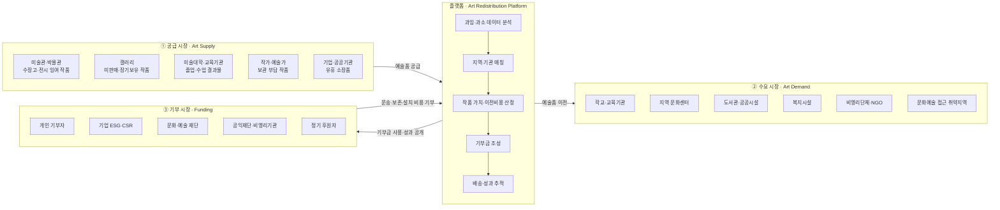
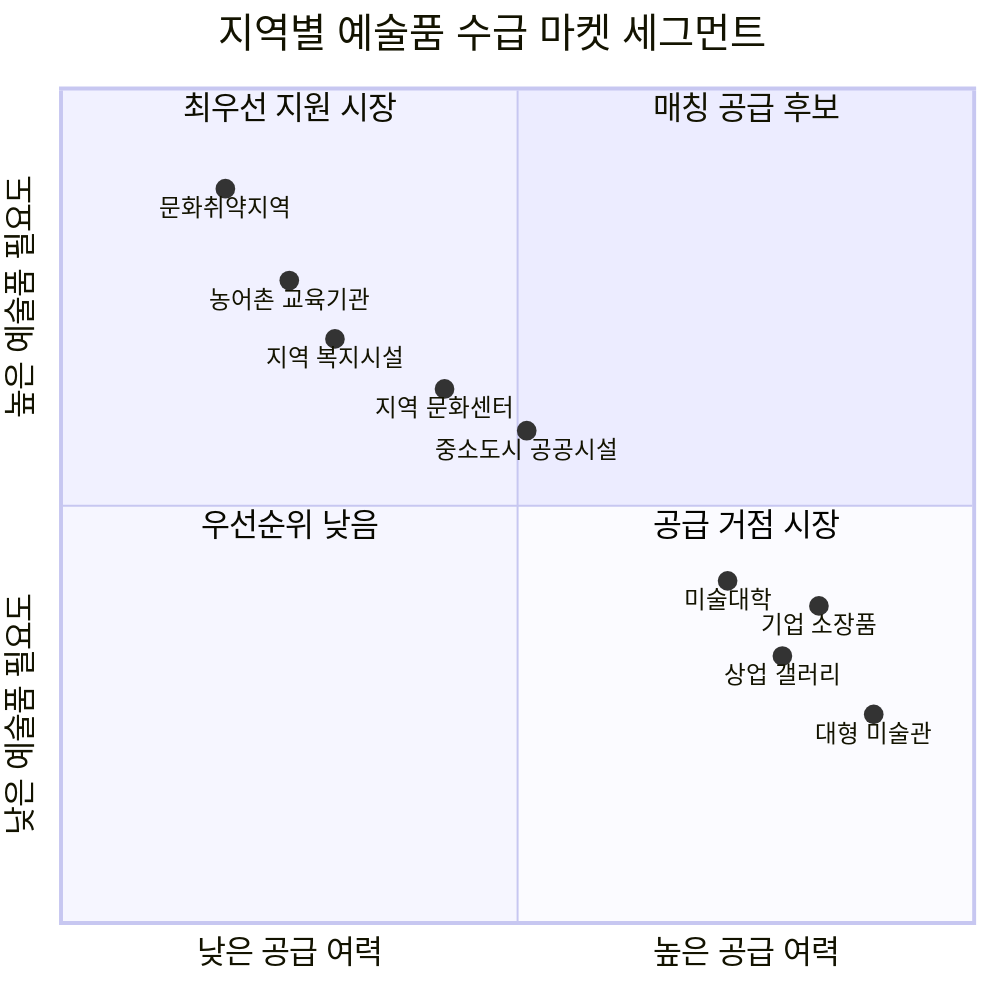

# 리서치 원본: 시민사회 기반 예술품 순환·기부 플랫폼 SRS

> **원본 출처**: ChatGPT 공유 대화 — [식품 유통 손실 분석](https://chatgpt.com/share/6a785e80-39cc-83ee-8f01-4bf9421922f2) (페이지 제목은 "미술품 폐기 통계 분석"으로 표시됨)
> **성격**: Software Requirements Specification(SRS) 원문을 분석에 필요한 범위로 정리한 리서치 원본 자료
> **정리 기준일**: 2026-08-07

---

## 1. 문서 목적 (원문)

> 본 문서는 전 세계 지역별 예술품의 과잉 생산 및 공급 부족 현황을 분석하고, 과잉 지역과 과소 지역을 연결하여 예술품의 재분배와 시민사회의 기부 참여를 촉진하는 웹 플랫폼의 기능 및 비기능 요구사항을 정의한다.

플랫폼은 예술품이 특정 지역에서는 과잉 생산되어 폐기·보관되거나 활용되지 못하는 반면, 다른 지역에서는 문화·예술 자원의 부족으로 인해 시민의 예술 향유 기회가 제한되는 문제를 해결하는 것을 목적으로 한다.

## 2. 서비스 개요

- **가칭**: Art Bridge Fund
- **비전**: 남는 예술품이 필요한 지역으로 이동할 수 있도록 시민의 기부를 연결한다. 예술품을 단순한 거래 대상이 아니라 지역 간 문화 접근성의 격차를 줄이는 사회적 자원으로 정의하며, 데이터 기반의 예술품 순환 구조를 구축한다.
- **핵심 메시지**: *"Art should not disappear where it is abundant, while communities elsewhere have no access to it."*
- **운영 구조**: Data → Matching → Donation → Delivery → Impact의 순환형 구조.

## 3. 핵심 사용자 (3면 시장의 원형)

| 사용자 유형 | 역할 |
|---|---|
| 일반 시민 | 플랫폼을 방문해 전 세계 예술품 공급 현황을 확인하고, 특정 예술품 이전 프로젝트 또는 상시 기금에 기부 |
| 예술품 제공 기관 | 미술관, 갤러리, 공공기관, 기업, 작가, 재단 등 — 활용되지 않는 예술품 또는 이전 가능한 예술품을 등록 |
| 예술품 수요 기관 | 학교, 도서관, 지역 문화센터, 복지기관, 공공기관, 비영리기관 등 — 예술품 지원을 요청 |
| 운영 관리자 | 등록된 예술품과 기관을 검증하고 매칭, 기부금 집행, 배송, 프로젝트 종료 등을 관리 |
| 데이터 관리자 | 지역별 예술품 수급 데이터와 예측 데이터를 관리 |

## 4. 시스템 범위 (6개 서비스 영역)

1. 글로벌 예술품 공급 현황(과잉) 대시보드
2. 글로벌 예술품 공급 부족 대시보드
3. 과잉·과소 지역 매칭 시스템
4. 기부 및 상시 기금 시스템
5. 예술품 배송·이전 추적 시스템
6. 사회적 영향 및 성과 홍보 페이지

## 5. 핵심 기능 요구사항 (분석에 필요한 범위로 요약)

- **FR-01 과잉 현황 대시보드**: 지역별 추정 예술품 보유량, 미활용 예술품 수, 신규 유입량, 연간 폐기·장기보관 추정량, "예술품 과잉지수", 전년 대비 변화율을 지도 기반으로 제공. 예술품 유형(회화·조각·사진·공예·설치미술·디지털아트 등) 필터와 1·3·5년 후 예측 포함.
- **FR-02 공급 부족 대시보드**: 인구 대비 공공 예술품 수, 미술관·문화공간 수, 학교 예술품 보유량 등을 종합한 **"Art Supply Risk Score"**(0~20 안정 ~ 81~100 매우 심각)로 지역별 공급위기를 지수화.
- **FR-03 자동 매칭**: 공급 가능 수량, 수요 지역 필요량, 예술품 유형·크기·보존상태, 운송 가능여부·거리·비용, 관세/통관, 수용 시설 여부를 고려해 매칭. 매칭 스코어 가중치는 수요적합도 30%, 운송거리 20%, 예술품종류적합도 20%, 운송비용 15%, 지역공급위기수준 10%, 보존상태 5%.
- **FR-04 이전 비용 산정**: 예술품의 **시장가격이 아니라 실제 이전에 필요한 사회적 비용**(포장·운송·보험·통관·상태점검·보존복원·현지설치·운영비)을 기준으로 기부 목표액을 산정 — 예시 구성비: 운송비 40% / 포장비 15% / 보험비 10% / 통관비 10% / 설치비 15% / 운영비 10%.
- **FR-05·06 기부·상시기금**: 프로젝트 단위 기부(추천금액 선택 또는 직접입력) + 플랫폼 상시 기금(일회성/월정기/연정기).
- **FR-07 배송 추적**: 매칭완료 → 기부금모집 → 모집완료 → 작품준비 → 포장완료 → 배송시작 → 통관 → 현지도착 → 설치완료 → 프로젝트완료의 10단계 상태 추적.
- **FR-08~11 성과 대시보드**: 누적 이전 예술품 수·지원 국가/도시 수·참여 기관 수·누적 기부금·완료 프로젝트 수를 KPI로 표시. **"Art Access Improvement Rate"**(예술품 공급 부족 해소율) = 플랫폼 공급 예술품 수 ÷ 지원 대상 지역 추정 부족 수 × 100. (예시: 부족량 100,000점 중 18,000점 이전 시 해소율 18% — 이는 SRS의 예시 수치이며 실측값이 아님)
- **FR-13·14 기관 등록/지원 요청**: 제공기관·수요기관이 각각 예술품·수요 정보를 등록/신청.

## 6. 데이터 구조 (요약)

`Region`(공급/수요 지수 포함) · `Artwork`(유형·크기·상태·운송가능여부) · `Institution`(기관유형·검증상태) · `Matching`(매칭스코어·필요기금·상태) · `Donation`(금액·유형) · `Shipment`(출발/도착·상태)

## 7. 핵심 KPI 체계

| 구분 | 지표 |
|---|---|
| Impact KPI | 누적 이전 예술품 수, 지원 지역/기관 수, 예술품 공급 부족 해소율, 완료 프로젝트 수 |
| Donation KPI | 누적 기부금, 월간·정기 기부자 수, 평균 기부금, 프로젝트 모금 성공률 |
| Platform KPI | MAU, 기부 전환율, 프로젝트 페이지 조회수, 재기부율, 기관 참여율 |

> **참고**: 화면 목업(Screen 05. Impact)에 예시로 제시된 "46,582 Artworks Reallocated" 등의 수치는 **UI 목업용 예시값**이며 실제 관측 데이터가 아니다. TAM-SAM-SOM 분석에서 실측치로 사용하지 않는다.

## 8. 시장 구조에 대한 원 대화의 결론

원본 대화에서 ChatGPT는 이 서비스가 "일반적인 단일 고객 시장이 아니라 ① 예술품 공급자 ② 예술품 수요자 ③ 비용을 부담하는 기부자가 동시에 존재하는 **3면 시장(Three-sided market)**"이라고 규정했다. 이 구조는 [분석-03-예술품-재분배-플랫폼.md](../분석-03-예술품-재분배-플랫폼.md)의 시장 세그먼트 분석에서 그대로 채택했다.

---

## 원본에서 이미 제시된 두 개의 Mermaid 차트 (원문 그대로)

### (A) 3면 마켓 세그먼트 구조

### (B) 지역별 예술품 수급 세그먼트 우선순위 (2×2 매트릭스)

> 이 두 차트는 원본 대화에서 이미 제시된 것을 그대로 보존한 것이다. [분석-03-예술품-재분배-플랫폼.md](../분석-03-예술품-재분배-플랫폼.md)에서는 이를 근거자료([02-글로벌-미술시장-데이터.md](02-글로벌-미술시장-데이터.md))와 결합해 TAM/SAM/SOM 수치와 함께 재해석한다.
