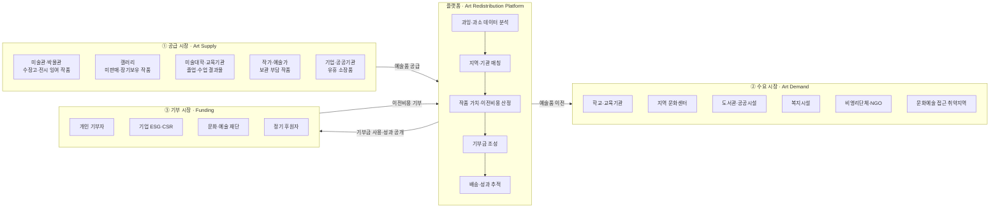
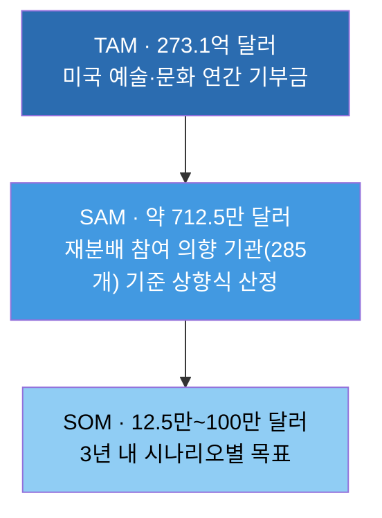
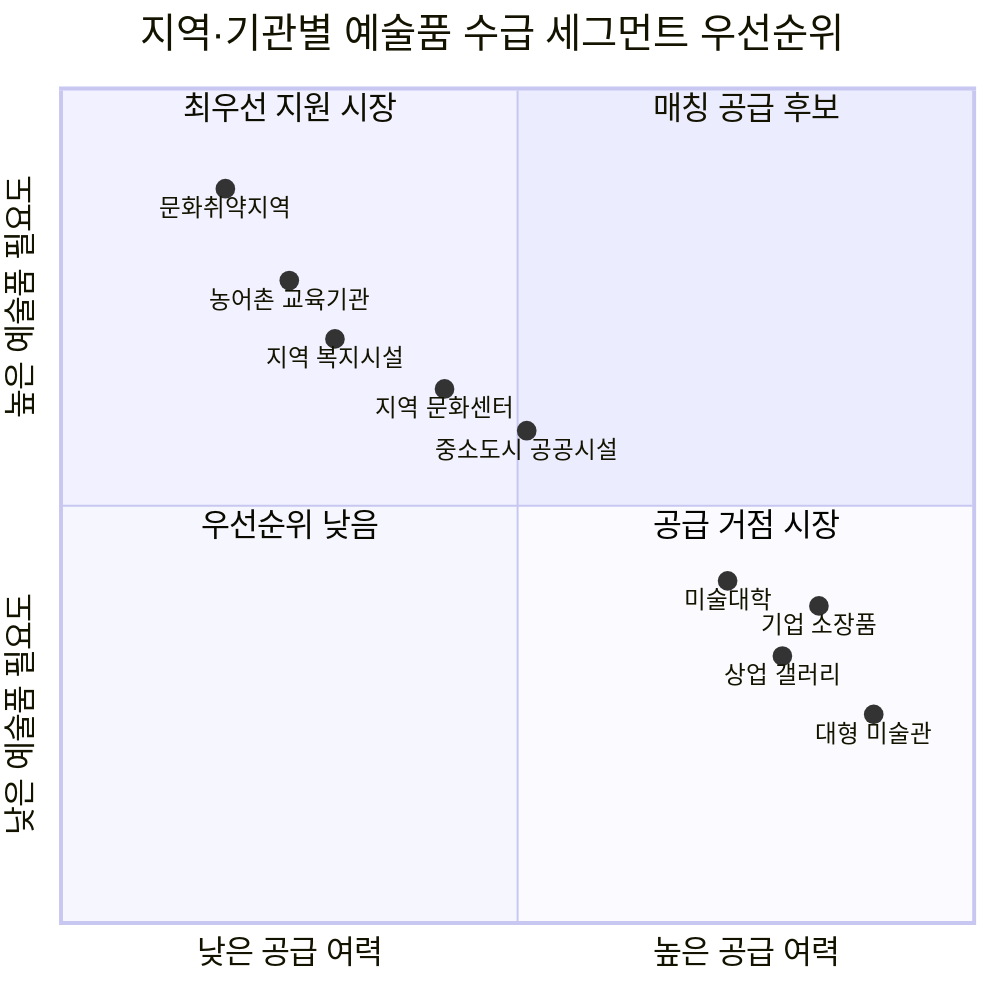

# TAM-SAM-SOM & Market Segment 분석: 예술품 재분배 플랫폼(Art Bridge Fund)

> **분석 대상**: 과잉·유휴 보유 예술품을 문화예술 접근성이 부족한 지역/기관으로 이전시키고, 시민·기업의 기부로 이전비용(물류·보험·통관·설치)을 조달하는 3면 시장형 플랫폼
> **기준일**: 2026-08-07
> **근거 자료**: [리서치-원본/01-예술품-재분배-플랫폼-SRS.md](리서치-원본/01-예술품-재분배-플랫폼-SRS.md) · [리서치-원본/02-글로벌-미술시장-데이터.md](리서치-원본/02-글로벌-미술시장-데이터.md)
> **방법론**: [분석-방법론.md](분석-방법론.md)

---

## 0단계 — 시장 구조 확인: 이것은 단일 시장이 아니라 3면 시장이다

이 플랫폼은 ① 예술품을 내놓는 **공급 시장**, ② 예술품을 필요로 하는 **수요 시장**, ③ 이전비용을 대는 **기부(자금) 시장**이 동시에 존재해야 거래가 성립하는 3면 시장(Three-sided market)이다. TAM/SAM/SOM을 계산하기 전에 이 구조를 먼저 고정한다.

**함의**: TAM은 하나의 숫자가 아니라 세 개의 서로 다른 성격의 시장(자산의 유휴 규모, 접근성 결핍의 크기, 기부 가능 자금의 규모)이 동시에 충분히 커야 성립한다. 아래 1~3단계는 이 세 축을 모두 짚는다.

---

## 1단계 — TAM (Total Addressable Market)

| 앵커 | 수치 | 표기 | 성격 | 출처 |
|---|---|:---:|---|---|
| 글로벌 미술시장 연간 거래액 | **약 596억 달러**(2025년) | (확인) | 맥락 앵커 — 이 플랫폼이 다루는 "예술품"이라는 자산 전체의 생태계 규모 | Art Basel & UBS Global Art Market Report 2026 |
| 미국 예술·문화·인문 분야 연간 기부금 | **273.1억 달러**(2025년, +7.5%) | (확인) | **사업직결 앵커** — 이 플랫폼의 수익모델(시민·기업 기부로 이전비용 조달)과 가장 직접적으로 연결되는 자금 풀 | Giving USA 2026 |
| 공급측 잠재량(정성 지표) | 박물관 소장품의 **95% 이상이 상시 비전시**(수장고 보관), 영국 조사 기준 60%는 수장고 이미 포화 | (확인) | 물리적 재고 규모를 보여주는 정성 지표(달러 환산 안 됨) | ICCROM-UNESCO, UK Heritage Fund |

**해석**: 이 사업은 "미술품 매매 시장"($596억)에 속하는 것이 아니라 "미술품 기부·이전 활동을 지원하는 자금 시장"에 속한다. 따라서 TAM의 1차 앵커는 매매액이 아니라 **예술·문화 기부금 273.1억 달러**로 잡는다. 매매액 596억 달러는 "이만큼의 자산이 유통되는 생태계 안에서, 그중 일부가 유휴화된다"는 배경 맥락으로만 인용한다.

> **확인되지 않음**: 전 세계 유휴·수장고 보관 미술품의 자산가치를 달러로 환산한 공식 통계는 없다. TAM을 이 수치로 직접 계산하지 않고, 정성 지표(95%+ 비전시)로만 병기한다.

---

## 2단계 — SAM (Serviceable Available Market)

TAM(예술 기부금 273.1억 달러, 미국 기준)에서 아래 필터를 순서대로 적용한다.

| 필터 | 내용 | 근거 |
|---|---|---|
| ① 목적 필터 | "운영지원·상시후원" 성격 기부(미술관 연간 운영비 후원 등)는 제외 — 신규 이니셔티브·프로젝트성 기부만 대상 | Giving USA는 목적별 세부 비중을 공개하지 않아 **정확한 %는 확인되지 않음** → 하향식 계산 대신 아래 상향식(bottom-up) 계산으로 전환 |
| ② 상향식 재계산 | 실제 참여 가능한 "공급기관 수 × 연간 프로젝트당 평균 이전비용"으로 역산 | Art Bridges Foundation Partner Loan Network(미국, 유사 모델의 실제 사례) 참여 기관 285개 이상을 "재분배 참여 의향 기관 수"의 현실적 상한 proxy로 사용 |
| ③ 단위 경제 | 프로젝트당 평균 이전비용(포장·운송·보험·통관·설치·운영비) — SRS 예시 기준 **$25,000/건, 작품 약 120점** ($208/점) | 이 수치는 SRS의 **목업 예시값**이며 실측 평균이 아니다. 상향식 계산의 가정값으로만 사용 |

**SAM 계산(상향식, 가정 명시)**:
`285개 참여 가능 기관(확인) × 연 1건 프로젝트(가정) × $25,000/건(가정) = 약 712.5만 달러/년(추정)`

이 712.5만 달러는 "미국 내에서, Art Bridges급 참여 의향을 가진 기관이 모두 연 1회씩 재분배 프로젝트를 진행할 때"의 이론적 상한이며, TAM(273.1억 달러)의 **약 0.026%**에 해당한다. 신생 니치 카테고리의 SAM이 TAM 대비 극히 작게 나오는 것은 이 방법론에서 정상적인 결과이며, 왜곡이 아니라 "아직 시장이 만들어지지 않았다"는 사실을 보여준다.

> **한계**: 이 SAM은 미국·박물관 중심으로만 계산됐다. 실제 서비스는 갤러리·미술대학·기업 소장품(공급)과 학교·복지시설·NGO(수요)까지 포함하므로, 초기 SAM은 이보다 클 수 있으나 이를 정량화할 공개 데이터가 없어 **보수적으로 좁게 산정**했다.

---

## 3단계 — SOM (Serviceable Obtainable Market)

신생 플랫폼이 초기 3년 내 실제로 확보 가능한 목표를 두 개의 실제 선행사례에 벤치마킹한다.

| 벤치마크 | 실제 규모 | 표기 | 시사점 |
|---|---|:---:|---|
| 한국 정부미술은행(아트뱅크) | 연간 구입예산 약 18억원(약 130만 달러), 연 350~400점 매입, 2,439개 대여기관 누적 | (확인) | **정부 주도·매입 방식**으로 단일 국가 규모의 재분배 시스템이 연간 100만 달러대에서 실제 운영 가능함을 보여주는 하한 벤치마크 |
| Art Bridges Foundation | 285개+ 박물관 네트워크, 예산 미확인 | (확인) | **재단 주도·기부 방식**의 최대 성숙 사례. 신생 플랫폼이 곧바로 도달할 수 없는 상한 벤치마크 |

**SOM 범위(3년 목표, 시나리오별)** — 세 시나리오 모두 **(가정)**: 리서치에서 도출된 값이 아니라 벤치마크 두 개(위 표)의 규모 사이에 3년차 목표를 설정한 것이다.

| 시나리오 | 참여 공급기관 | 연간 프로젝트 수 | 연간 조성 기부금 |
|---|---|---|---|
| 보수적 | 10개 | 5건 | 약 12.5만 달러 |
| 기본 | 30개 | 15건 | 약 37.5만 달러 |
| 낙관적 | 80개 | 40건 | 약 100만 달러 |

기본 시나리오(연 37.5만 달러)는 SAM(712.5만 달러)의 약 5.3%에 해당하며, 한국 아트뱅크의 연간 예산(약 130만 달러)의 약 29% 수준이다 — 즉 "정부 단일기관 프로그램의 1/3 규모를 시민기부 플랫폼으로 3년 내 만든다"는 목표로 해석할 수 있다.

---

## TAM → SAM → SOM 퍼널

---

## 4단계 — Market Segment: 어느 사분면을 먼저 공략할 것인가

**우선순위 결론**:
1. **1차 공략(2사분면·좌상단) — 최우선 지원 시장**: 문화취약지역, 농어촌 교육기관, 지역 복지시설. SOM 시나리오의 초기 파일럿 수요처로 지정한다 — 필요도가 명확하고 검증 가능해 임팩트 스토리텔링(기부 유치)에 가장 유리하다.
2. **1차 공급 확보(4사분면·우하단) — 공급 거점 시장**: 대형 미술관, 기업 소장품. Art Bridges Foundation형 파트너십을 우선 체결할 대상이며, SAM 계산의 "285개 기관" 가정과 직접 연결된다.
3. **2차 확장(1사분면) — 매칭 공급 후보**: 미술대학·상업 갤러리는 공급 여력은 있으나 매칭 로직 검증 후 확장한다(작품 보존상태·저작권 확인 절차가 상대적으로 복잡하기 때문).
4. **후순위(3사분면)**: 중소도시 공공시설처럼 필요도·공급여력이 모두 중간인 세그먼트는 1·2차 확장이 안정화된 뒤 진입한다.

---

## 수치 검증 메모

### 대조표

| 수치 | 표기 | 산출·출처 근거 | 판정 |
|---|:---:|---|---|
| 글로벌 미술시장 596억 달러 | (확인) | Art Basel & UBS 2026 직접 진술 | ✅ 직접 진술 |
| 미국 예술기부금 273.1억 달러 | (확인) | Giving USA 2026 직접 진술 | ✅ 직접 진술 |
| 박물관 소장품 95%+ 비전시 | (확인) | ICCROM-UNESCO·UK Heritage Fund 직접 진술 | ✅ 직접 진술(달러 환산은 안 됨) |
| SAM 712.5만 달러 | (추정) | 285개(확인) × 1건(가정) × $25,000(가정) | ⚠️ 가정 2개를 곱한 추정치 |
| SOM 12.5만~100만 달러 | (가정) | 벤치마크 2건 사이에 설정한 3년 목표 | ⚠️ 목표치, 리서치에 없는 값 |

### ⚠️ TAM과 SAM·SOM이 같은 측정 대상을 재고 있는가

방법론 §6의 원칙(TAM·SAM·SOM은 같은 단위·같은 측정 대상이어야 한다)에 비춰 이 분석을 스스로 점검한다.

| 층 | 측정하는 것 |
|---|---|
| TAM 273.1억 달러 | **미국 전체의 예술·문화 기부 자금 총량**(이 사업과 무관한 기부까지 포함) |
| SAM 712.5만 달러 | **이 사업 모델에 실제로 참여할 의향이 있는 기관의 이전비용 조성액**(하향식이 아니라 상향식으로 별도 산정) |

**두 숫자는 엄밀히는 포함 관계(TAM ⊇ SAM)가 아니라, 서로 다른 산정 방식(하향식 총량 vs 상향식 참여자 합산)으로 구한 값을 나란히 놓은 것이다.** TAM에서 SAM으로 필터를 적용해 "몇 %가 남는지" 계산한 것이 아니라(Giving USA가 목적별 비중을 공개하지 않아 하향식 필터링 자체가 불가능했다 — 2단계 참조), SAM을 처음부터 상향식으로 새로 쌓아 올렸다. 이 방법론이 요구하는 "좁히는 기준을 명시"라는 원칙은 지켰지만, "TAM ⊇ SAM ⊇ SOM이 눈으로 확인되는 포함 관계"라는 원칙은 **완전히 충족되지 않는다.** 이 사실을 숨기지 않고 명시한다 — SAM 712.5만 달러를 "TAM의 0.026%"라고 표현한 것은 상대적 크기 감각을 전달하기 위한 것이지, 실제로 TAM에서 필터링해 나온 부분집합이라는 뜻은 아니다.

---

## 다음 단계로 넘기는 질문

이 분석이 답한 것과 답하지 못한 것을 구분한다.

| 답한 것 | 답하지 못한 것 |
|---|---|
| 시장의 물리적 성격 (3면 시장, 각 축의 상대적 규모) | **TAM을 상향식으로도 교차 검증한 값** — 현재는 하향식(Giving USA) 앵커만 있다 |
| 공급·수요·자금이 어디에 있는가 (세그먼트 매트릭스) | **세그먼트 안의 실제 인물** — 대형 미술관의 의사결정자는 컬렉션 담당자인가 자산관리 담당자인가 |
| 1차 공략 세그먼트 (2사분면 수요, 4사분면 공급) | **그들이 왜 우리를 통해 재분배해야 하는가** — 공급기관이 기존 대안(수장고 보관, 개별 기증) 대신 이 플랫폼을 택할 동기 |
| 재분배 가능 규모의 상한(SAM) | **이전비용을 실제로 누가 지불하는가** — 기부자 확보 자체의 난이도는 검증되지 않았다 |

→ 챕터 05 **페르소나·고객 여정지도**로 이어진다. 특히 *"세그먼트 매트릭스에 등장하는 각 자리에는 누가 있으며 무엇을 두려워하는가"*가 다음 분석의 출발점이다.

---

## 종합 요약

| 단계 | 결론 | 핵심 근거 |
|---|---|---|
| 0. 시장 구조 | 3면 시장(공급·수요·기부) | SRS 원문의 3면 시장 정의 |
| 1. TAM | 273.1억 달러(미국 예술기부금 기준) / 596억 달러(글로벌 미술시장, 맥락) | Giving USA 2026 · Art Basel·UBS 2026 |
| 2. SAM | 약 712.5만 달러(TAM의 0.026%) | Art Bridges 참여기관 285개 × 프로젝트당 $25,000(상향식) |
| 3. SOM | 12.5만~100만 달러(3년 목표, 시나리오별) | 한국 아트뱅크(연 130만 달러) 벤치마크 대비 29%(기본안) |
| 4. Segment | 문화취약지역·농어촌교육기관(수요) + 대형미술관·기업소장품(공급) 우선 공략 | 2×2 매트릭스 |

## 참고 출처

리서치 원본 문서의 출처를 그대로 인용한다 — [리서치-원본/02-글로벌-미술시장-데이터.md](리서치-원본/02-글로벌-미술시장-데이터.md)의 참고 출처 목록 참조.

> **자료 신뢰도 참고**: SAM·SOM 계산에 사용한 "$25,000/프로젝트", "285개 기관 전원 연 1회 참여" 등은 검증된 실측 평균이 아니라 **SRS 목업 예시값과 선행사례 규모를 조합한 가정**이다. 실제 사업 검토 시 파일럿 단계에서 실측 데이터로 반드시 재보정해야 한다. TAM의 "미국 예술기부금"도 미국 한정 수치이며, 글로벌 확장 시 국가별 재계산이 필요하다.

---

### ✅ 사후 기록 — 이 사업의 출발점은 미술품 토큰증권 기획이다

위 TAM/SAM/SOM 분석과 세그먼트 매트릭스는 "Art Bridge Fund"라는 재분배·기부 플랫폼만 놓고 독립적으로 계산한 것이다. 그러나 챕터 05 이후 진행된 후속 분석에서, 이 플랫폼이 **미술품 토큰증권(STO) 사업을 검토하는 과정에서 발견된 문제의식**(시장에서 충분히 가치를 인정받지 못한 채 유휴화된 작품들을 어떻게 다룰 것인가)에서 출발한 사업이라는 사실이 확정됐다. **본문은 수정하지 않고 그대로 둔다** — 어떤 전제 위에서 무엇을 계산했는지가 남아 있어야 검증이 가능하기 때문이다.

이 확정이 위 분석에 미치는 영향은 다음과 같다.

| 위 분석의 결론 | 확정 후의 지위 |
|---|---|
| TAM 273.1억 달러 · SAM 712.5만 달러 · SOM 12.5만~100만 달러 | **유효.** 재분배·기부 활동 자체의 시장 규모로는 그대로 쓴다. 토큰증권 전환 이후의 시장 규모는 이 문서의 계산 범위 밖이며 별도 검증이 필요하다 |
| 3면 시장 구조(공급·수요·기부) | **유효하되 확장된다.** 재분배로 쌓인 활용·향유·교육 이력이 향후 가치 재평가 데이터 후보가 될 수 있는지, 적격 작품에 한해 토큰증권 연계를 검토하는 4번째 층위가 챕터 06 이후에 추가된다 |
| Market Segment Map (공급·수요 세그먼트) | **유효.** 재분배 가능한 작품이 어디서 나오고 어디로 가는지 보여주는 지도로 그대로 쓰인다 |
| "다음 단계로 넘기는 질문"의 미결 항목 | **질문은 살아 있으나 범위가 넓어진다.** "왜 우리를 통해 재분배해야 하는가"라는 질문에 "재분배 이력이 향후 가치평가에 의미가 있는가"라는 질문이 더해진다 |

> **"재분배 → 가격상승 → 토큰화"가 자동으로 성립한다고 전제하지 않는다.** 이 연결고리 자체가 핵심 가설로서 후속 챕터(05 페르소나·고객여정, 06 기회점수, 07 JTBD, 08 경쟁·가치제안)에서 반복적으로 검증 대상으로 다뤄진다.

→ 정정된 전제에 따른 페르소나는 [챕터 05 페르소나 스펙트럼](../05-persona-journey/분석-03-예술품-재분배-플랫폼-페르소나-스펙트럼.md)에 있다. **경위는 이 사후 기록이 유일한 보관처다** — 챕터 05 문서는 최종 결과만 담도록 정리되어 있다.
