# 페르소나 스펙트럼 분석 ③ — 미술품 폐기 통계 기반 예술품 재분배 플랫폼

> **분석 방법론 §2** · 입력 **챕터 04 TAM-SAM-SOM + Market Segment 분석** · 기존 리서치 **미술품 폐기 통계 분석 / 예술품 재분배 플랫폼 일반 페르소나**
>
> ⚙️ **현재 진행 상태 — 워크플로우 ①단계까지 수행.** 이 문서는 방법론 §2의 AI 기반 다중 페르소나 생성 및 평가 워크플로우 5단계 중 **①단계 1차 생성(Divergent Thinking)**의 산출물이다. **12종 페르소나 원본**이며, 아직 선별되지 않았다. ②평가 · ③보정 · ④검증 · ⑤통합은 미수행.
>
> 📌 이 문서는 기존 일반 페르소나 분석을 대체하는 Persona Spectrum ①단계 문서다. 기존 페르소나는 아래 12종에 흡수·분화했고 계보는 §4에 표로 남겼다.

---

## 0. 이 단계의 규칙과 두 가지 편차

### 무엇을 하는 단계인가

①단계는 좁히는 단계가 아니라 **넓히는 단계**다. 방법론이 요구하는 배분(**핵심 5 · 확장 3 · 극단 2 · 비활성 2 = 12종**)을 그대로 채웠다. 현실성이 의심스러운 후보도 지우지 않고 남겼다 — 걸러내는 일은 ②단계의 몫이다.

각 페르소나는 방법론이 지정한 6개 항목(**이름 · 직무 · 문제 · 목표 · 감정 · 대체 솔루션**)을 모두 채운다.

### 편차 ① — '이름'을 코드네임으로 대체했다

방법론 원문의 `이름` 항목은 식별용 코드네임(`C1 「수장고가 찬다」` 형태)으로 채웠다. 나이·성별·가족관계 같은 신상은 만들지 않았다.

> 📌 지어낸 신상은 어떤 설계 판단도 바꾸지 못하면서 문서 전체를 사실처럼 읽히게 만든다. 12종을 구분하는 호칭 기능은 코드네임으로 충분하다.

### 편차 ② — 비활성(Non-user)을 두 갈래로 나눴다

| 방법론의 관점 | 정의 | 해당 인물 |
|---|---|---|
| 아직 사용하지 않거나 회피하는 집단 | **회피형** — 필요성을 알아도 위험 때문에 거부 | N1 법무·리스크 승인 담당 |
| 제품/서비스를 사용할 수 없는 사람 | **비접근형** — 필요해도 조건 때문에 이용 불가 | N2 설치·관리 불가 기관 담당 |

둘은 대응도 다르다. N1은 **책임·권리·보험 조건 충족**, N2는 **설치·관리 가능성 확보**가 핵심이다.

---

## 1. 스펙트럼 배치

```mermaid
graph LR
    subgraph CORE["Core 핵심 5 — 주력 타깃"]
        direction TB
        C1["C1 「수장고가 찬다」<br>미술관 컬렉션·수장고 담당<br>보관 대신 안전한 이전 경로가 필요하다"]
        C2["C2 「버리기엔 자산이다」<br>기업 미술품 자산관리 담당<br>유휴자산을 절차에 맞게 정리해야 한다"]
        C3["C3 「작품을 살 예산이 없다」<br>학교·복지·공공문화시설 담당<br>구매 없이 실제 작품을 확보하고 싶다"]
        C4["C4 「이동비용을 만들어야 한다」<br>기부·CSR 프로젝트 담당<br>운송·보험·설치비를 조달해야 한다"]
        C5["C5 「작품은 택배가 아니다」<br>미술품 전문운송·설치 담당<br>조건이 맞아야 실제로 움직일 수 있다"]
    end
    subgraph ADJ["Adjacent 확장 3 — 유사 문제 · 다른 맥락"]
        direction TB
        A1["A1 「창고에 작품이 쌓인다」<br>갤러리 작품관리 담당<br>장기재고의 활용처가 필요하다"]
        A2["A2 「졸업전시가 끝나면」<br>미술대학 작품관리 담당<br>반복 발생 작품을 순환시키고 싶다"]
        A3["A3 「지역 전체가 부족하다」<br>문화재단·지자체 문화사업 담당<br>지역 단위 문화격차를 줄이고 싶다"]
    end
    subgraph EXT["Extreme 극단 2 — 제약 상황 · 실패 중심"]
        direction TB
        X1["X1 「문을 통과하지 못한다」<br>대형·취약 작품 이전 담당<br>물리·보존 조건 때문에 매칭 후에도 실패한다"]
        X2["X2 「무료여도 못 받는다」<br>초저예산·원거리 수요기관 담당<br>이전비 때문에 수령을 포기한다"]
    end
    subgraph NON["Non-user 비활성 2 — 진입 장벽"]
        direction TB
        N1["N1 「사고 나면 누가 책임지나」<br>법무·자산관리 리스크 승인 담당<br>회피형 — 책임이 불명확하면 반출을 막는다"]
        N2["N2 「받고 싶어도 관리할 수 없다」<br>설치·관리 불가 기관 담당<br>비접근형 — 필요하지만 수령 조건이 안 된다"]
    end
    CORE --> ADJ
    CORE --> EXT
    ADJ --> NON
    classDef core fill:#33BBFF,stroke:#333,stroke-width:2px,color:#111;
    classDef adj fill:#33FFBB,stroke:#333,stroke-width:2px,color:#111;
    classDef ext fill:#FF3322,stroke:#333,stroke-width:2px,color:#fff;
    classDef non fill:#DDDDDD,stroke:#333,stroke-width:2px,color:#111;
    class C1,C2,C3,C4,C5 core;
    class A1,A2,A3 adj;
    class X1,X2 ext;
    class N1,N2 non;
```

> 방법론 §2의 4유형 배치와 색상 체계를 유지했다. 위 그림은 인원 배치까지만 보여준다. 실제 관계 Spectrum Map은 ⑤단계 산출물이다.

---

## 2. 페르소나 원본 12종

`연결` 열은 기존 Market Segment/일반 Persona에서 이어졌는지, 스펙트럼 질문에서 신규 도출됐는지를 표시한다. 실제 사분면 Q코드는 확인되지 않아 임의로 만들지 않았다.

### 🔵 핵심(Core) 5종 — 주력 타깃 / 서비스 작동성 중심

| 코드·이름 | 직무 | 연결 | 문제 | 목표 | 감정 | 대체 솔루션 (현재 쓰는 것) |
|---|---|---|---|---|---|---|
| C1 「수장고가 찬다」 | 미술관·박물관 컬렉션/수장고 담당 | 공급시장 | 장기간 미전시 작품이 누적되지만 소유·보존·처분 절차 때문에 쉽게 외부 이전하지 못한다. | 이전 가능한 작품을 적합한 기관에 보내고 결과까지 기록 | 책임 부담 + 아까움 | 계속 보관 · 기관 간 대여 · 개별 기증 · 내부 재배치 |
| C2 「버리기엔 자산이다」 | 기업 총무·자산관리·사내 미술품 담당 | 공급시장 | 유휴 미술품이 생겨도 장부상 자산·소유권·반출 승인을 처리해야 한다. | 절차에 맞게 정리하고 폐기 대신 사회적 활용 | 실무 부담 + 손실 회피 | 창고 보관 · 사내 재배치 · 매각 · 폐기 |
| C3 「작품을 살 예산이 없다」 | 학교·복지시설·도서관·공공문화시설 작품 도입 담당 | 수요시장 | 작품 구매·전시 예산이 부족하고 공간에 맞는 작품 선정도 어렵다. | 공간·이용자 조건에 맞는 작품을 지원받아 설치 | 기대 + 관리 걱정 | 복제물·포스터 · 일회성 프로그램 · 구매 포기 |
| C4 「이동비용을 만들어야 한다」 | 시민기부 프로젝트 운영자 / 기업 CSR 담당 | 기부시장 | 매칭돼도 운송·보험·설치비가 없으면 프로젝트가 멈춘다. | 이전비 기금을 조성하고 사용 결과를 증명 | 성과 압박 + 투명성 부담 | 일반 현금기부 · 일회성 CSR · 재단 공모 |
| C5 「작품은 택배가 아니다」 | 미술품 전문 포장·운송·설치 담당 | — 신규 | 크기·무게·재질·보험·출입구·벽체 조건이 달라 일반 배송처럼 처리할 수 없다. | 실행 가능한 매칭만 확정하고 비용·일정을 예측 | 실무적 경계 | 전화·사진·현장실사 수기 견적 · 기존 거래처 |

> 📌 C5는 기존 3면 시장에서 잘 보이지 않던 **실제 이동 매개자**다. 공급자와 수요자만으로는 ‘매칭’은 설명할 수 있지만 ‘실제 설치 완료’는 설명하기 어렵다.

### 🟢 확장(Adjacent) 3종 — 유사 문제 / 다른 맥락

| 코드·이름 | 직무 | 연결 | 문제 | 목표 | 감정 | 대체 솔루션 |
|---|---|---|---|---|---|---|
| A1 「창고에 작품이 쌓인다」 | 상업 갤러리 작품관리 담당 | 공급 인접 | 미판매 작품이 누적되지만 소유권·작가 계약 때문에 임의 처리가 어렵다. | 동의된 작품의 새로운 활용처 확보 | 아까움 + 재고 압박 | 작가 반환 · 장기보관 · 할인판매 |
| A2 「졸업전시가 끝나면」 | 미술대학 작품보관 담당 | 공급 인접 | 학기말 작품이 집중 발생하고 미회수 작품의 보관·정리를 학교가 떠안는다. | 학생 동의를 받아 재분배 가능한 작품을 일괄 처리 | 반복 업무 피로 + 폐기 아쉬움 | 회수 공지 · 임시보관 · 폐기 · 교내 재사용 |
| A3 「지역 전체가 부족하다」 | 지역문화재단·지자체 문화사업 담당 | 수요 인접 | 지역 단위 문화격차를 줄여야 하지만 구매·배치 예산과 선정 근거가 필요하다. | 데이터를 근거로 우선지역을 선정해 복수 프로젝트 운영 | 정책 성과 압박 + 객관성 요구 | 공공미술 구매 · 문화행사 · 공모사업 |

> 📌 A1·A2는 같은 유휴작품 문제를 다른 소유·발생 맥락에서 겪고, A3는 개별기관 수요를 지역 정책 단위로 확장한다.

### 🔴 극단(Extreme) 2종 — 제약 상황 / 실패·대안 사용 중심

| 코드·이름 | 직무 | 연결 | 문제 | 목표 | 감정 | 대체 솔루션 |
|---|---|---|---|---|---|---|
| X1 「문을 통과하지 못한다」 | 대형·취약·특수설치 작품 이전 담당 | 공급↔물류 극단 | 매칭·비용이 완료돼도 출입구·엘리베이터·벽 하중·온습도·포장 조건 때문에 이전이 취소될 수 있다. | 매칭 전에 물리조건을 검증 | 실패 비용에 대한 긴장 | 전문업체 현장실사 · 맞춤 포장 · 매칭 포기 |
| X2 「무료여도 못 받는다」 | 초저예산·원거리 학교/복지/문화시설 담당 | 수요 극단 | 작품 가격이 0원이어도 운송·보험·설치·관리비가 예산을 넘는다. | 이전비까지 지원되고 관리 가능한 작품만 수령 | 기대 + 체념 | 복제물 · 지역작가 무상대여 · 설치 포기 |

> 📌 X1은 **물리적으로 못 움직이는 경우**, X2는 **경제적으로 못 받는 경우**다. 매칭 성공과 설치 완료는 다르다.

### ⬜ 비활성(Non-user) 2종 — 진입 장벽 / 거부 요인

| 코드·이름 | 직무 | 연결 | 문제 | 목표 | 감정 | 대체 솔루션 |
|---|---|---|---|---|---|---|
| N1 「사고 나면 누가 책임지나」 (회피형) | 미술관·기업 법무·자산관리 리스크 승인 담당 | — 신규 | 파손·분실·소유권 분쟁·무단 재판매 등의 책임이 기관에 돌아올 수 있다고 본다. | 권리·보험·인수증·책임범위가 명확하지 않으면 승인하지 않음 | 보수적 경계 | 계속 보관 · 공식 매각 · 외부 기증 금지 |
| N2 「받고 싶어도 관리할 수 없다」 (비접근형) | 설치·관리 역량이 부족한 소규모 기관 담당 | 수요 비접근 | 설치 공간·벽체·보안·보험·보존 인력 조건을 충족하지 못한다. | 관리지원 또는 안전하게 운영 가능한 작품 확보 | 아쉬움 + 부담 회피 | 복제물 · 디지털 콘텐츠 · 신청하지 않음 |

> 📌 N1은 C1·C2를 실제로 막을 수 있는 승인·차단자다. N2는 관심이 없는 사람이 아니라 필요하지만 현재 조건으로는 접근할 수 없는 사람이다.

---

## 3. 12종 요약 대조

| 코드 | 유형 | 한 줄 정체 | 시장/위치 | 돈의 위치 | 화면을 쓰는가 |
|---|---|---|---|---|---|
| C1 | 핵심 | 미술관 컬렉션·수장고 담당 | 공급 | 보관·이전비 이해관계 | 예 |
| C2 | 핵심 | 기업 미술품 자산관리 담당 | 공급 | 자산·보관비 이해관계 | 예 |
| C3 | 핵심 | 학교·복지·공공문화시설 담당 | 수요 | 구매예산 부족 | 예 |
| C4 | 핵심 | 기부·CSR 프로젝트 담당 | 기부 | 기부/예산 집행 | 예 |
| C5 | 핵심 | 미술품 전문운송·설치 담당 | — 신규 | 운송·설치비 수취 | 예 |
| A1 | 확장 | 갤러리 작품관리 담당 | 공급 인접 | 재고·보관비 | 예 |
| A2 | 확장 | 미술대학 작품관리 담당 | 공급 인접 | 폐기·보관비 | 예 |
| A3 | 확장 | 문화재단·지자체 담당 | 수요 인접 | 사업예산 집행 | 예 |
| X1 | 극단 | 대형·취약 작품 이전 담당 | 공급↔물류 극단 | 특수운송 비용 | 예 |
| X2 | 극단 | 초저예산·원거리 수요기관 | 수요 극단 | 이전비 지원 필요 | 예 |
| N1 | 비활성·회피 | 법무·리스크 승인 담당 | — 신규 | 손실 회피 | 제한적/아니오 |
| N2 | 비활성·비접근 | 설치·관리 불가 기관 | 수요 비접근 | 관리비 부담 | 제한적/아니오 |

---

## 4. 기존 일반 페르소나와의 계보

이전 일반 페르소나는 버리지 않고 유지·통합·분화·재배치했다.

| 이전 판본 | 12종에서의 위치 | 변화 |
|---|---|---|
| 미술관 컬렉션 담당자 | C1 | 유지 |
| 기업 ESG·자산관리 담당자 | C2 + C4 | 자산처리와 기부예산 집행으로 분리 |
| 농어촌 학교 담당자 | C3 | 유지 |
| 복지시설 담당자 | C3 · X2 · N2 | 일반 수요 / 비용 극단 / 관리 비접근으로 분화 |
| 지역 문화시설 담당자 | C3 | 시설 수요군으로 통합 |
| 개인 기부자 | C4 | 시민기부 축으로 통합 |
| 기업 CSR 담당자 | C4 | 기업 예산 집행형 기부 주체 |
| 갤러리 운영자 | A1 | 확장 사용자 |
| 미술대학 관리자 | A2 | 확장 사용자 |
| 문화재단 담당자 | A3 | 지역 단위 수요·배분으로 확장 |
| 정기 후원자 | C4 | 반복 기부 방식으로 통합 |
| 학생·지역주민·복지시설 이용자 | 최종 수혜자 지표로 별도 보존 | Non-user로 분류하지 않음 |
| — | C5 · X1 · N1 · N2 | Spectrum 질문에서 신규/분화 |

### 신규·분화 Persona가 나온 곳

| 신규·분화 | 어디서 나왔는가 |
|---|---|
| C5 미술품 전문운송·설치 담당 | 공급·수요 축만 보느라 실제 이동 매개자를 놓쳤다는 가치사슬 질문 |
| X1 대형·취약 작품 이전 담당 | Extreme 질문 — “매칭됐는데도 가장 자주 실패하는 조건은?” |
| X2 초저예산·원거리 수요기관 | 수요 Persona를 비용 제약의 극단까지 확장 |
| N1 법무·리스크 승인 담당 | Non-user 질문 — “필요성을 알아도 누가 참여를 막는가?” |
| N2 설치·관리 불가 기관 | Non-user 질문 — “필요하지만 누가 실제로 사용할 수 없는가?” |

> 📌 Spectrum의 첫 번째 소득은 Persona 수가 늘어난 것이 아니다. 기존 **작품 공급자 × 작품 수요자 × 기부자** 구조만으로는 잘 보이지 않던 **옮기는 사람(C5), 막는 사람(N1), 매칭 후 실패 조건(X1·X2), 필요하지만 받을 수 없는 사람(N2)**이 드러난 것이다.

---

## 5. ①단계에서 이미 보이는 것

선별 전이지만 12종을 나란히 놓았을 때 드러나는 관찰 네 가지를 기록한다. ②단계 평가의 입력으로 쓴다.

1. **경쟁자는 다른 플랫폼만이 아니다.** 계속 보관 · 내부 재배치 · 매각 · 폐기 · 복제물 · 신청 포기가 반복된다. 가장 강한 대체재 중 하나는 **현재 방식 유지**다.
2. **매칭 성공률만으로 성과를 설명하기 어렵다.** C5·X1·X2 때문에 매칭 후에도 운송·설치가 실패한다. 따라서 **실제 설치 완료율**이 중요한 KPI 후보가 된다.
3. **기부금은 작품 구매보다 ‘이전 실행’에 가깝다.** C4의 기금이 C5의 운송·보험·설치 비용과 연결되어야 X2가 실제로 작품을 받을 수 있다. `무료 작품 = 무료 수령`이 아니다.
4. **중요한 장벽이 화면 밖에 있다.** N1의 권리·책임 승인과 X1의 물리적 설치 가능성 때문에 작품 정보 외에도 소유·이전 권한, 보험·책임, 크기·무게·재질, 출입구·벽체·설치 조건이 필요하다는 가설이 생긴다.

---

## 6. 근거 등급

| 구성 요소 | 등급 | 비고 |
|---|---|---|
| 기존 분석의 공급자·수요자·기부자 3면 구조 | (확인: 선행 분석 입력) | 기존 TAM-SAM-SOM / Market Segment / 일반 Persona |
| 미술관·기업·학교·복지·갤러리·미술대학·문화재단 역할군 | (추정) | 선행 세그먼트와 기존 Persona를 구체화 |
| C5·N1의 핵심성 | (가정) | 가치사슬에서 신규 도출, ④단계 검증 대상 |
| X1·X2·N2의 제약 조건과 중요도 | (가정) | Extreme/Non-user 질문에서 생성 |
| 12종의 문제·목표·감정·대체 솔루션 | (가정) | 인터뷰 없음. 생성·재구성물 |

> ⚠️ ①단계 산출물은 **가설의 목록이지 발견의 목록이 아니다.** 특히 `감정` 열은 근거가 가장 얇다. ②·④단계를 거치기 전에는 최종 고객 정의로 확정하지 않는다.

---

## 7. 다음 단계

| 단계 | 할 일 | 이 문서에서 넘기는 것 |
|---|---|---|
| ② 2차 평가 | 문제·행동·맥락 현실성으로 12종을 평가해 유형별 1명씩 4명으로 압축 | 12종 원본 + §5 관찰. 실제 재분배 완료에 미치는 영향을 선별 축으로 사용 |
| ③ 3차 보정 | 재분배 플랫폼 맥락에 맞춰 언어·상황 재기술 | 소유권 이전/장기대여, 기부금 부담 범위 등 사업 규칙 확정 필요 |
| ④ 4차 검증 | 실재 확률과 근거 교차검증 | 우선 검증 C5 · X1 · N1 · N2 |
| ⑤ 5차 통합 | Spectrum Map 시각화 | N1 → C1/C2 차단 · C4 → X2 비용 장벽 완화 · C5가 공급↔수요 연결 |
