# 고객 여정지도 ③ — 예술품 재분배 플랫폼

> 입력 **페르소나 스펙트럼 분석 ③ — 예술품 재분배 플랫폼** · 상위 TAM-SAM-SOM + Market Segment 분석
>
> 🗺️ **범위.** 스펙트럼에서 도출한 **12종 전원**의 여정을 개별로 그린다. 대표 4종만이 아니라 Core·Adjacent·Extreme·Non-user 전부를 포함한다. 각 여정은 **서비스를 접하기 전부터 작품 등록·지원 신청·기부·수령·향유 등 각 Persona의 결정적 행위 이후까지**를 다룬다.
>
> ⚠️ **전제.** 기존 Persona Spectrum에서 확인된 역할·문제·목표를 입력값으로 사용한다. 아래 행동·생각·감정·Pain Point의 구체 문장은 아직 인터뷰로 검증되지 않은 **가설**이며, 근거 없는 나이·소득·작품 수·금액·기간은 새로 만들지 않는다.

---

## 0. 등장 인물 12종

| # | 스펙트럼 유형 | 인물 | 여정 골격 | 이 사람의 '결제'에 해당하는 행위 |
|---|---|---|---|---|
| 1 | 🔵 핵심 | **독립 작가 김서윤** 「팔리지 않아도 쓰임은 끝나지 않았다」 | A 작품 공급자형 | 작품 등록 + 이전 동의 |
| 2 | 🔵 핵심 | **미술관 컬렉션 담당 박소연** 「전시되지 않는 작품의 다음 공간」 | A 작품 공급자형 | 기관 승인 후 작품 이전 승인 |
| 3 | 🔵 핵심 | **문화취약지역 학교 담당 이지현** 「학교에서 실제 작품을 보여주고 싶다」 | B 수요기관형 | 작품 지원 신청 |
| 4 | 🔵 핵심 | **개인 기부자 정민준** 「내 3만원이 어떤 작품을 움직였나」 | C Funding형 | 1회·정기 기부 결제 |
| 5 | 🔵 핵심 | **기업 CSR·ESG 담당 최은영** 「사회공헌 결과를 숫자로 보여줘야 한다」 | C Funding형 | 내부 승인 후 기업 후원 집행 |
| 6 | 🟢 확장 | **미술대학 작품관리 담당 한유진** 「졸업작품의 다음 쓰임이 필요하다」 | A 작품 공급자형 | 동의 확보 후 작품 일괄 등록 |
| 7 | 🟢 확장 | **갤러리 작품관리 담당 윤태호** 「미판매 작품을 마음대로 보낼 수는 없다」 | A 작품 공급자형 | 작가·권리 조건 확인 후 이전 승인 |
| 8 | 🟢 확장 | **지역 문화시설 담당 오수진** 「공간은 있는데 보여줄 작품이 부족하다」 | B 수요기관형 | 작품 지원 신청 |
| 9 | 🔴 극단 | **신진 작가 임하늘** 「작업실이 작품으로 꽉 찼다」 | A 작품 공급자형 | 작품 등록 + 픽업·이전 승인 |
| 10 | 🔴 극단 | **문화취약지역 NGO 담당 김도현** 「외부 지원 없이는 작품을 확보하기 어렵다」 | B 수요기관형 | 지역·시설 수요 등록 + 수령 확인 |
| 11 | ⬜ 비활성 | **작품 보유기관 담당 서재원** 「작품은 있어도 바로 내놓을 수 없다」 | D 비사용자형 — 제약형 | **없음 — 권리·책임 검문에서 중단될 수 있다** |
| 12 | ⬜ 비활성 | **최종 향유 학생 박하린** 「플랫폼은 모르지만 작품은 경험한다」 | D 비사용자형 — 수혜형 | **없음 — 지불도 작품 신청도 화면도 없다** |

> 표기 규칙 — 본문에서는 **역할·이름을 앞에, 슬로건을 뒤에** 둔다(`독립 작가 김서윤 「팔리지 않아도 쓰임은 끝나지 않았다」`). 표와 다이어그램에서 자리가 좁을 때는 이름 또는 역할만 쓴다.

---

## 1. 단계를 새로 정의한 근거

일반형 5단계(`문제 인식 → 탐색 → 의사결정 → 사용 → 유지`)를 그대로 채우지 않고 **예술품 재분배 서비스의 실제 관문에서 단계를 도출**한다.

| # | 질문 | 이 서비스의 답 |
|---|---|---|
| **1** | 실제로 통과하는 관문은? | 공급자에게는 **권리·상태 검문**, 수요자에게는 **공간·관리 적합성 검문**, 기부자에게는 **비용·성과 검문**이 있다. |
| **2** | 가장 많이 이탈할 가능성이 있는 곳은? | 공급자는 **권리·책임 확인**, 수요자는 **설치·관리 조건**, 기부자는 **기부금 사용처와 결과 불확실성**에서 멈출 가능성이 높다. *(가설)* |
| **3** | 결정적 행위 이후에 더 큰 관문이 있는가? | **있다.** 등록·신청·기부가 끝이 아니다. **매칭 → 운송·보험 → 수령·설치 → 활용 확인**이 완료되어야 실제 가치가 전달된다. |
| **4** | 페르소나마다 여정이 갈라지는가? | **12명이 하나의 단계 집합을 공유하지 않는다.** 작품 공급자·수요기관·Funding·비사용자의 네 골격으로 갈라진다. |

### 12명이 네 개의 여정 골격으로 갈라진다

같은 플랫폼 안에서도 사람에 따라 **결정적 행위와 실패 지점 자체가 다르다.** 억지로 하나의 여정에 밀어 넣으면 공급자의 `권리 확인`, 기관 수요자의 `설치·관리`, 기업 후원자의 `내부 승인`, 최종 향유자의 `작품 경험`이 사라진다.

| 골격 | 해당 인물 | 결정적 차이 |
|---|---|---|
| **A. 작품 공급자형** (8단계) | 김서윤 · 박소연 · 한유진 · 윤태호 · 임하늘 | 작품을 **내놓을 수 있는가**가 먼저다. 권리·상태·책임 확인과 매칭 대기가 병목 |
| **B. 수요기관형** (9단계) | 이지현 · 오수진 · 김도현 | 작품이 필요해도 **공간·관리·수령 조건**을 통과해야 한다. 설치 이후 활용까지 가야 가치가 전달 |
| **C. Funding형** (8단계) | 정민준 · 최은영 | 작품 자체를 구매하는 것이 아니라 **이동비용에 자금을 댄다.** 비용 근거와 결과 증명이 병목 |
| **D. 비사용자형** (두 갈래) | 서재원 · 박하린 | 둘 다 결제하지 않지만 이유가 반대다. 서재원은 **참여 전 막히고**, 박하린은 **플랫폼 없이 결과만 경험**한다 |

```mermaid
graph LR
    subgraph SUP["골격 A · 작품 공급자형 — 5명"]
        SUP0["⓪ 유휴·보관 지속"] --> SUP1["① 정리 계기"] --> SUP2["② 권리·상태 검문"] --> SUP3["③ 재분배 판단"] --> SUP4["④ 등록·승인"] --> SUP5["⑤ 매칭 대기"] --> SUP6["⑥ 이전·배송"] --> SUP7["⑦ 활용 확인"]
    end

    subgraph DEM["골격 B · 수요기관형 — 3명"]
        DEM0["⓪ 문화자원 부족"] --> DEM1["① 필요 계기"] --> DEM2["② 작품 탐색"] --> DEM3["③ 공간·관리 검문"] --> DEM4["④ 신청·내부 승인"] --> DEM5["⑤ 매칭"] --> DEM6["⑥ 수령 준비"] --> DEM7["⑦ 설치·향유"] --> DEM8["⑧ 결과 기록·재신청"]
    end

    subgraph FUND["골격 C · Funding형 — 2명"]
        FUND0["⓪ 무관심·예산 대기"] --> FUND1["① 문제·프로젝트 발견"] --> FUND2["② 비용·신뢰 검문"] --> FUND3["③ 지원 규모 판단"] --> FUND4["④ 기부·내부 승인"] --> FUND5["⑤ 진행 대기"] --> FUND6["⑥ 결과 증명"] --> FUND7["⑦ 재참여 판단"]
    end

    subgraph NON["골격 D · 비사용자형 — 2명"]
        N10["서재원<br/>유휴작품 인식"] --> N11["권리·책임 검문"] --> N12["참여 또는 중단"]
        N20["박하린<br/>예술 접점 부족"] --> N21["작품 발견"] --> N22["향유·활용"] --> N23["지속 경험"]
    end

    classDef gate fill:#FF3322,stroke:#333,stroke-width:2px,color:#fff;
    classDef val fill:#FFF2B2,stroke:#B8860B,stroke-width:2px,color:#111;

    class SUP2,SUP5,DEM3,DEM6,FUND2,FUND5,N11 gate;
    class SUP7,DEM7,FUND6,N22 val;
```

| 표기 | 의미 |
|---|---|
| 🔴 빨강 | 그 골격의 **최대 병목 후보** |
| 🟡 노랑 | **가치가 실제로 전달되는 지점** — 등록·신청·결제가 아니라 여기까지 가야 목적이 성립 |

---

# 골격 A — 작품 공급자형 (5명)

## 2. 🔵 독립 작가 김서윤 「팔리지 않아도 쓰임은 끝나지 않았다」

> 판매·전시되지 않은 작품이 작업실에 누적된다. 작품에 대한 애착은 있지만, 계속 보관하기에는 공간·관리 부담이 생긴다.

| 단계 | 고객 행동 | 고객 생각 | 감정 | **Pain Point** | 개선 기회 |
|---|---|---|---|---|---|
| **⓪ 유휴·보관 지속** | 판매·전시되지 않은 작품을 계속 보관한다 | *"아직 버릴 작품은 아닌데"* | 애착 · 부담 | **작품이 남아 있어도 다음 활용 경로가 보이지 않는다** | `보관 / 판매 / 기증 / 재분배` 선택지를 비교할 수 있는 안내 |
| **① 정리 계기** | 작업실 정리·새 작품 제작을 계기로 기존 작품을 다시 본다 | *"이걸 계속 두는 게 맞나?"* | 고민 | **문제는 누적되지만 행동 계기가 늦다** | 작업실 정리·재고 관리 시점에 맞춘 재분배 안내 |
| **② 권리·상태 검문** | 본인 소유·작품 상태·이동 가능 여부를 확인한다 | *"보내도 되는 상태인가?"* | 신중 | **작품 상태와 이전 조건을 스스로 판단하기 어렵다** | 작품 상태 체크리스트·사진 기반 사전 확인 |
| **③ 재분배 판단** | 판매·기증·폐기와 비교해 재분배를 검토한다 | *"어디에서 어떻게 쓰이는지가 중요해"* | 기대 · 경계 | **재분배 후 활용처가 불명확하면 작품을 내놓기 어렵다** | 수요기관·설치 공간·활용 목적을 등록 전에 보여주기 |
| **④ 등록·승인** | 작품 정보·크기·상태·권리조건을 등록한다 | *"입력이 너무 많으면 못 하겠다"* | 피로 | **한 작품을 등록하는 행정 부담이 높을 수 있다** | 사진 중심 간편 등록·반복 항목 자동완성 |
| **⑤ 매칭 대기** ⛔ | 적합한 수요처가 나타나기를 기다린다 | *"언제까지 기다려야 하지?"* | 불안 | **수요가 있는지, 언제 연결될지 보이지 않는다** | 매칭 상태·예상 조건·대기 사유 표시 |
| **⑥ 이전·배송** | 포장·픽업·운송 상태를 확인한다 | *"작품이 안전하게 가고 있나?"* | 긴장 | **작품을 넘긴 뒤 물리적 상태를 확인하기 어렵다** | 포장·픽업·배송·수령 상태 타임라인 |
| **⑦ 활용 확인** | 설치 사진·공간·활용 결과를 확인한다 | *"버리지 않고 다시 쓰이게 됐네"* | 안도 · 만족 | **이전 뒤 정보가 끊기면 재분배의 의미를 체감하지 못한다** | 설치·관람·활용 이력을 작품별로 누적 |

> 📌 **이 여정은 ⑤에서 길어질 수 있다.** 김서윤에게 등록은 끝이 아니라 기다림의 시작이다. **매칭이 안 되는 이유와 다음 상태가 보이지 않는 시간**이 길어질수록 폐기·저가처분 같은 기존 대안으로 돌아갈 가능성이 커진다. *(가설)*

---

## 3. 🔵 미술관 컬렉션 담당 박소연 「전시되지 않는 작품의 다음 공간」

> 장기간 활용되지 않는 작품이 있어도 개인 작가와 달리 **기관의 보존·관리 책임과 내부 승인**이 먼저 작동한다.

| 단계 | 고객 행동 | 고객 생각 | 감정 | **Pain Point** | 개선 기회 |
|---|---|---|---|---|---|
| **⓪ 유휴·보관 지속** | 수장고에서 장기간 활용되지 않는 작품을 관리한다 | *"보관만 계속하는 게 최선일까?"* | 책임감 | **활용 빈도와 보관 부담을 한 화면에서 판단하기 어렵다** | 유휴 작품 분류·상태·활용 이력 관리 |
| **① 정리 계기** | 소장품 실사·수장고 정리·활용 검토가 발생한다 | *"이번에 일부를 재검토할 수 있겠다"* | 신중 | **재분배를 검토할 공식 계기가 제한적이다** | 기관 업무 주기에 맞춘 재분배 검토 프로세스 |
| **② 권리·상태 검문** ⛔ | 소유권·저작권·작가 동의·작품 상태·자산처리를 확인한다 | *"외부로 보낼 권한이 있는가?"* | 방어적 | **권리·책임이 하나라도 불명확하면 진행이 멈춘다** | 기관용 권리 체크리스트·표준 동의서·책임 범위 문서 |
| **③ 재분배 판단** | 대여·기증·장기보관과 재분배를 비교한다 | *"필요한 곳에 간다는 근거가 충분한가?"* | 검토 | **재분배가 기관 목적에 맞는지 증명할 자료가 부족하다** | 수요기관 목적·공간·관리조건·사회적 활용 정보 |
| **④ 등록·승인** | 내부 결재 후 작품을 등록한다 | *"기록이 남아야 한다"* | 사무적 | **등록과 내부 승인 문서가 이중으로 발생할 수 있다** | 기관용 일괄등록 + 결재 첨부용 요약 문서 |
| **⑤ 매칭 대기** | 추천된 수요기관을 검토한다 | *"작품을 제대로 관리할 수 있는가?"* | 경계 | **수요기관의 관리 역량을 확인하기 어렵다** | 수요기관 인증·설치환경·관리책임 표시 |
| **⑥ 이전·배송** | 운송·보험·수령 조건을 승인한다 | *"사고가 나면 누가 책임지나?"* | 긴장 | **훼손·분실 시 책임과 보험 범위가 불명확할 수 있다** | 보험·운송 책임 범위를 작품별로 명시 |
| **⑦ 활용 확인** | 설치·활용 결과를 기관 기록으로 남긴다 | *"이전 이후에도 관리 가능한가?"* | 안도 | **재분배 이후 기록이 기관 소장 이력과 단절될 수 있다** | 작품 이력에 `재분배·설치·활용` 기록 연결 |

> 📌 **이 사람의 병목은 등록 화면이 아니라 ② 권리·상태 검문이다.** 작품이 많아도 이 단계가 해결되지 않으면 플랫폼의 공급으로 전환되지 않는다.

---

## 4. 🟢 미술대학 작품관리 담당 한유진 「졸업작품의 다음 쓰임이 필요하다」

> 졸업전시·수업 종료처럼 **작품이 한 시점에 몰려 나오는 구조**다. 개별 작품보다 동의·일괄 처리의 효율이 중요하다.

| 단계 | 고객 행동 | 고객 생각 | 감정 | **Pain Point** | 개선 기회 |
|---|---|---|---|---|---|
| **⓪ 유휴·보관 지속** | 학생 작품을 일정 기간 보관한다 | *"언제까지 보관해야 하지?"* | 부담 | **작품의 소유·반환·보관 상태가 섞여 있다** | 학생·작품별 상태 구분 |
| **① 정리 계기** | 졸업전시 종료·학기 종료 후 작품을 정리한다 | *"이번에도 작품이 한꺼번에 남았네"* | 압박 | **특정 시점에 업무가 집중된다** | 졸업전시·학기 종료용 일괄 처리 모드 |
| **② 권리·상태 검문** | 학생에게 반환·기증·재분배 동의를 확인한다 | *"학교가 마음대로 결정하면 안 된다"* | 신중 | **학생별 동의 수집이 반복 업무가 된다** | 모바일 동의 링크·전자 동의 일괄 수집 |
| **③ 재분배 판단** | 재분배 가능한 작품을 선별한다 | *"어떤 작품이 이동에 적합하지?"* | 판단 피로 | **크기·재료·보존상태 기준이 없으면 선별이 어렵다** | 재분배 적합성 체크리스트 |
| **④ 등록·승인** | 여러 작품을 한꺼번에 등록한다 | *"한 점씩 입력할 수는 없다"* | 피로 | **대량 등록이 불가능하면 사용 자체가 어렵다** | CSV·일괄 사진 업로드·공통 정보 복사 |
| **⑤ 매칭 대기** | 학교·문화시설 등 수요처를 확인한다 | *"학생 작품을 원하는 곳이 있나?"* | 기대 | **교육 작품의 수요 규모가 불확실하다** | 작품군 단위 매칭·세트 추천 |
| **⑥ 이전·배송** | 학생·학교에 인계·운송 결과를 공유한다 | *"누가 어디까지 책임지지?"* | 긴장 | **학교·학생·수령기관 사이 책임이 분산된다** | 인계 주체·운송 책임·수령확인 명시 |
| **⑦ 활용 확인** | 학생에게 설치·활용 결과를 공유한다 | *"버려지는 대신 실제로 쓰였네"* | 보람 | **결과가 개별 학생에게 돌아가지 않으면 참여 동기가 약해진다** | 학생별 작품 결과 카드 |

> 📌 **이 Persona의 핵심 기능은 ‘작품 등록’이 아니라 ‘동의 수집 + 일괄 처리’다.** 한 작품씩 잘 등록하는 UX보다 **여러 작품을 빠르게 합법적으로 분류하는 UX**가 먼저다.

---

## 5. 🟢 갤러리 작품관리 담당 윤태호 「미판매 작품을 마음대로 보낼 수는 없다」

> 미판매 작품이 있어도 **작가 계약·위탁 조건·시장 이미지**가 끼어 있다. 물리적으로 남아 있다는 이유만으로 공급 가능 작품이 되지 않는다.

| 단계 | 고객 행동 | 고객 생각 | 감정 | **Pain Point** | 개선 기회 |
|---|---|---|---|---|---|
| **⓪ 유휴·보관 지속** | 전시 후 미판매 작품을 보관한다 | *"다시 팔릴 수도 있는데"* | 유보 | **재고와 잠재 판매작을 구분하기 어렵다** | 작품 상태·판매계획·재분배 가능 여부 분리 |
| **① 정리 계기** | 전시 교체·창고 정리·작가 협의가 발생한다 | *"이번에 일부는 방향을 다시 봐야겠다"* | 검토 | **재분배를 논의할 공식 시점이 제한된다** | 전시 종료 후 후속 옵션에 재분배 추가 |
| **② 권리·상태 검문** ⛔ | 작가 계약·소유권·위탁조건을 확인한다 | *"갤러리가 결정할 수 있는 작품인가?"* | 경계 | **권리관계가 복잡하면 바로 중단된다** | 작가 승인 워크플로우·권리 상태 표시 |
| **③ 재분배 판단** | 작가와 재분배 장소·방식을 협의한다 | *"어디에 가는지가 작가 이미지와 맞나?"* | 신중 | **좋은 취지라도 설치 맥락이 불명확하면 동의를 받기 어렵다** | 수요처·공간·활용방식 상세 공개 |
| **④ 등록·승인** | 작가 동의가 끝난 작품만 등록한다 | *"조건을 작품마다 다르게 걸고 싶다"* | 실무적 | **작품별 공개·전시·이미지 사용 조건이 다를 수 있다** | 작품별 권리·노출 조건 설정 |
| **⑤ 매칭 대기** | 매칭 후보를 작가와 재검토한다 | *"이 장소라면 괜찮겠다"* | 기대 | **승인 주체가 둘 이상이면 의사결정이 느려진다** | 작가·갤러리 공동 승인 |
| **⑥ 이전·배송** | 전문 운송·보험 여부를 확인한다 | *"작품 상태가 유지돼야 한다"* | 긴장 | **재분배 비용이 작품 가치와 맞지 않을 수 있다** | 운송·보험 견적과 대안 비교 |
| **⑦ 활용 확인** | 설치·전시 이력을 확인한다 | *"새로운 노출이 실제로 생겼나?"* | 기대 | **활용 이력이 작가·갤러리 기록에 연결되지 않는다** | 작가·작품별 설치·전시 이력 제공 |

> 📌 **윤태호는 ‘안 팔린 작품 = 남는 작품’이라는 단순 전제를 깨는 Persona다.** 재분배 가능 여부는 재고가 아니라 **계약과 맥락**에서 결정된다.

---

## 6. 🔴 신진 작가 임하늘 「작업실이 작품으로 꽉 찼다」

> 김서윤과 문제 구조는 같지만 **시간 압박과 공간 한계가 훨씬 강한 Extreme Persona**다.

| 단계 | 고객 행동 | 고객 생각 | 감정 | **Pain Point** | 개선 기회 |
|---|---|---|---|---|---|
| **⓪ 유휴·보관 지속** | 작품 사이에서 작업공간을 줄여가며 버틴다 | *"다음 작품을 만들 자리가 없다"* | 압박 | **보관 문제가 곧 창작 공간 문제로 번진다** | 공간 압박이 큰 작품을 우선 표시하는 긴급 재분배 옵션 |
| **① 정리 계기** | 새 작품 제작·이사·작업실 정리를 계기로 즉시 처분 방법을 찾는다 | *"이번에는 빨리 정해야 한다"* | 조급 | **탐색할 시간이 짧다** | 빠른 진입·간단한 비교 |
| **② 권리·상태 검문** | 작품 이동 가능 여부를 빠르게 확인한다 | *"보낼 수만 있으면 보내고 싶다"* | 조급 | **복잡한 검문은 바로 이탈로 이어질 수 있다** | 필수/선택 항목 분리·사후 보완 허용 |
| **③ 재분배 판단** | 창고·저가판매·기증·폐기와 비교한다 | *"언제 가져갈 수 있지?"* | 현실적 | **가치보다 처리 속도가 중요해질 수 있다** | 예상 매칭·픽업 가능 조건 표시 |
| **④ 등록·승인** | 사진 중심으로 작품을 등록한다 | *"입력이 길면 그냥 다른 방법을 찾겠다"* | 피로 | **등록 마찰이 높은 순간 대체수단으로 이동한다** | 최소 필드 등록 |
| **⑤ 매칭 대기** ⛔ | 매칭 상태를 반복 확인한다 | *"아직도 안 정해졌나?"* | 초조 | **대기 기한을 모르면 폐기로 전환할 수 있다** | 매칭 상태·미매칭 시 대안 제시 |
| **⑥ 이전·배송** | 픽업·포장을 처리한다 | *"내가 포장까지 해야 하나?"* | 부담 | **포장·픽업 노동이 추가되면 마지막에 포기할 수 있다** | 픽업·포장 옵션 명확화 |
| **⑦ 활용 확인** | 설치 결과를 확인한다 | *"버리지 않고 해결했다"* | 안도 | **결과가 안 오면 ‘무료 처분’과 차이를 느끼기 어렵다** | 작품의 새 장소·활용 결과 알림 |

> 📌 **Extreme Persona가 드러내는 핵심 변수는 시간이다.** 일반 공급자에게 편의 기능인 `매칭 상태·예상 처리 흐름`이 임하늘에게는 **폐기를 막는 핵심 기능**이 될 수 있다. *(가설)*

---

# 골격 B — 수요기관형 (3명)

공급자형과 결정적으로 다른 점은 **작품이 있느냐가 아니라 ‘우리 공간이 받을 수 있느냐’**다. 신청 이후에도 수령·설치·관리·활용이 남아 있다.

## 7. 🔵 문화취약지역 학교 담당 이지현 「학교에서 실제 작품을 보여주고 싶다」

> 학생들이 실제 작품을 접할 기회가 적고, 학교 예산만으로 작품을 구매하기 어렵다.

| 단계 | 고객 행동 | 고객 생각 | 감정 | **Pain Point** | 개선 기회 |
|---|---|---|---|---|---|
| **⓪ 문화자원 부족** | 기존 수업·학교 공간을 운영한다 | *"실제 작품을 보여줄 기회가 적다"* | 아쉬움 | **문화예술 접근성 부족이 일상화되어 있다** | 실제 작품 지원 사례를 문제 인식 콘텐츠로 |
| **① 필요 계기** | 수업·공간 개선·학교 프로그램을 준비한다 | *"학교 안에서 보여줄 수 없을까?"* | 기대 | **작품 확보가 가능한 선택지인지 모른다** | 학교용 지원 절차 한눈에 보기 |
| **② 작품 탐색** | 지원 가능한 작품을 살펴본다 | *"학생과 공간에 맞는 작품은?"* | 호기심 | **전문지식 없이 작품을 고르기 어렵다** | 연령·공간·교육 목적별 추천 |
| **③ 공간·관리 검문** ⛔ | 설치 공간·안전·관리 가능 여부를 확인한다 | *"우리 학교에 실제로 설치할 수 있나?"* | 걱정 | **공간 적합성과 관리조건을 판단하기 어렵다** | 공간 체크리스트·작품별 설치 난이도 |
| **④ 신청·내부 승인** | 교내 결재·지원 신청을 진행한다 | *"학교 안에서 설명할 자료가 필요하다"* | 사무적 | **학교 내부 승인에 필요한 자료가 흩어져 있다** | 신청서·작품정보·관리조건 패키지 |
| **⑤ 매칭** | 매칭 결과와 작품 조건을 확인한다 | *"정말 받을 수 있나?"* | 기대·불안 | **선정·매칭 기준과 일정이 불명확할 수 있다** | 매칭 기준·상태·예상 일정 |
| **⑥ 수령 준비** ⛔ | 배송일·설치 위치·관리 담당자를 정한다 | *"학교가 어디까지 해야 하지?"* | 부담 | **수령·설치 역할이 불명확하면 마지막에 지연된다** | 역할별 체크리스트·일정 조율 |
| **⑦ 설치·향유** | 작품을 설치하고 학생이 보게 한다 | *"아이들이 실제로 관심을 보이네"* | 만족 | **작품만 걸어두면 교육적 활용이 제한될 수 있다** | 쉬운 작품 설명·교사용 활동 자료 |
| **⑧ 결과 기록·재신청** | 설치 사진·활용 사례를 남기고 재신청을 검토한다 | *"다음에도 활용할 수 있겠다"* | 보람 | **성과 기록이 번거로우면 후원자·공급자에게 증명이 남지 않는다** | 사진·활용 기록 간편 입력 |

> 📌 **이지현의 가치 전달 지점은 ‘작품 수령’이 아니라 ⑦ 설치·향유다.** 학교에 도착했어도 설치되지 않거나 교육에 전혀 쓰이지 않으면 서비스 목적이 완성되지 않는다.

---

## 8. 🟢 지역 문화시설 담당 오수진 「공간은 있는데 보여줄 작품이 부족하다」

> 공간은 있지만 지속적으로 새로운 작품을 확보할 예산과 콘텐츠가 부족하다. 학교보다 **공간 운영과 관람 경험**이 중심이다.

| 단계 | 고객 행동 | 고객 생각 | 감정 | **Pain Point** | 개선 기회 |
|---|---|---|---|---|---|
| **⓪ 문화자원 부족** | 비어 있거나 반복되는 전시공간을 운영한다 | *"공간은 있는데 콘텐츠가 부족하다"* | 아쉬움 | **공간이 있어도 작품 확보 루트가 제한적이다** | 지역별 지원 가능 작품 알림 |
| **① 필요 계기** | 전시 교체·시설 개편·프로그램 기획이 생긴다 | *"이번에는 다른 콘텐츠가 필요하다"* | 기대 | **기획 때마다 공급처를 다시 찾는다** | 상시 작품 풀·재분배 큐레이션 |
| **② 작품 탐색** | 작품 크기·장르·이미지를 비교한다 | *"이 공간과 어울릴까?"* | 탐색 | **공간과 작품을 머릿속으로만 맞춰야 한다** | 공간 크기·벽면·환경 기반 추천 |
| **③ 공간·관리 검문** ⛔ | 조도·안전·설치·관리 조건을 확인한다 | *"우리가 감당할 수 있는 작품인가?"* | 신중 | **관리 난이도가 보이지 않으면 신청하기 어렵다** | 작품별 설치·관리 요구사항 표시 |
| **④ 신청·내부 승인** | 시설 내부에서 신청을 승인받는다 | *"비용과 책임을 설명해야 한다"* | 사무적 | **작품은 무료여도 운송·설치 책임이 불명확할 수 있다** | 기관 부담 비용·지원 범위 명시 |
| **⑤ 매칭** | 최종 작품과 공급기관을 확인한다 | *"이 조합이면 괜찮겠다"* | 기대 | **매칭 후 조건 변경이 생기면 재작업이 크다** | 매칭 전 조건 확인 단계 |
| **⑥ 수령 준비** | 설치 일정·공간·담당자를 조율한다 | *"운영 일정과 맞춰야 한다"* | 긴장 | **시설 운영 일정과 배송 일정이 충돌할 수 있다** | 일정 조율·변경 알림 |
| **⑦ 설치·향유** | 작품을 설치하고 주민 대상 프로그램과 연결한다 | *"공간이 실제로 살아났네"* | 만족 | **설명·프로그램 자료가 없으면 관람이 수동적으로 끝난다** | 작품 해설·프로그램 템플릿 |
| **⑧ 결과 기록·재신청** | 관람·행사·활용 내용을 기록한다 | *"다음 기획에도 쓸 수 있겠다"* | 만족 | **활용 데이터가 흩어져 누적되지 않는다** | 시설별 전시·활용 이력 |

> 📌 **오수진은 ‘작품 부족’보다 ‘운영 가능한 콘텐츠 부족’에 가깝다.** 재분배 플랫폼이 작품만 넘기고 끝나면 기존 기획 업무를 충분히 줄이지 못한다.

---

## 9. 🔴 문화취약지역 NGO 담당 김도현 「외부 지원 없이는 작품을 확보하기 어렵다」

> 작품 수요뿐 아니라 **구매·운송·설치 예산과 현장 운영 여력**까지 제한될 가능성이 있는 Extreme 수요자다.

| 단계 | 고객 행동 | 고객 생각 | 감정 | **Pain Point** | 개선 기회 |
|---|---|---|---|---|---|
| **⓪ 문화자원 부족** | 지원지역의 문화예술 자원 부족을 확인한다 | *"지역 안에서 자체적으로 확보하기 어렵다"* | 책임감 | **수요가 있어도 공급망이 없다** | 외부 유휴 작품 공급 현황 공개 |
| **① 필요 계기** | 교육·지역개발 프로젝트에 문화예술 요소를 넣으려 한다 | *"일회성 체험 말고 실제 자원이 필요하다"* | 기대 | **사업기간 안에 공급 가능성을 예측하기 어렵다** | 지원 가능 작품·예상 절차 사전 확인 |
| **② 작품 탐색** | 지역·시설 조건에 맞는 작품을 찾는다 | *"운송 가능한 작품인가?"* | 검토 | **거리·운송 조건이 작품 선택을 제한할 수 있다** | 지역·운송 난이도 포함 추천 |
| **③ 공간·관리 검문** | 현지 설치·보관·관리 가능성을 확인한다 | *"받은 뒤 관리할 수 있나?"* | 걱정 | **현장 인력·공간·환경이 부족하면 수령 자체가 어렵다** | 최소 관리조건·현장 체크리스트 |
| **④ 신청·내부 승인** | 수요량·시설·목적을 등록한다 | *"우리 상황을 충분히 설명해야 한다"* | 신중 | **현장 맥락을 정형 입력으로 설명하기 어렵다** | 수요기관 서술 + 사진 + 조건 입력 |
| **⑤ 매칭** | 공급작품과 Funding 가능성을 함께 확인한다 | *"작품이 있어도 운송비가 없으면 못 받는다"* | 기대·불안 | **작품 매칭과 비용조성이 따로 놀면 프로젝트가 멈춘다** | 작품 매칭과 Funding 프로젝트를 한 흐름으로 연결 |
| **⑥ 수령 준비** ⛔ | 운송·수령·설치 일정을 준비한다 | *"현장 여건이 바뀌면 어떡하지?"* | 긴장 | **현장 상황 변화가 최종 배송을 막을 수 있다** | 수령 가능 상태 재확인·일정 변경 경로 |
| **⑦ 설치·향유** | 작품을 설치하고 지역 주민·이용자와 활용한다 | *"실제로 지역에 남는 자원이 됐다"* | 보람 | **일회성 설치 후 활용이 끊길 수 있다** | 현지 프로그램·관리 가이드 |
| **⑧ 결과 기록·재신청** | 공급자·후원자에게 결과를 보고한다 | *"증명은 해야 하는데 현장이 바쁘다"* | 부담 | **현장 실무자가 별도 보고를 작성하기 어렵다** | 최소 입력으로 인수·설치·활용 증명 생성 |

> 📌 **김도현의 병목은 작품이 아니라 ⑤~⑥의 실행 가능성이다.** 작품이 매칭되어도 **이전비용과 현장 수령조건이 동시에 충족되지 않으면 가치가 0**이 된다.

---

# 골격 C — Funding형 (2명)

두 Persona 모두 작품 이동에 자금을 대지만 의사결정 구조는 다르다. 정민준은 개인 판단이 빠르고, 최은영은 **조직 내부 승인과 성과보고**가 추가된다.

## 10. 🔵 개인 기부자 정민준 「내 3만원이 어떤 작품을 움직였나」

> 문화예술·사회공헌에 관심이 있고, **기부금이 구체적으로 무엇을 움직였는지** 확인하고 싶어 한다.

| 단계 | 고객 행동 | 고객 생각 | 감정 | **Pain Point** | 개선 기회 |
|---|---|---|---|---|---|
| **⓪ 무관심·대기** | 평소에는 프로젝트를 찾지 않는다 | — | 무관심 | **예술품 재분배와 기부가 연결된다는 개념 자체가 낯설다** | `남는 작품 ↔ 필요한 공간 ↔ 이동비용`을 한 문장으로 설명 |
| **① 문제·프로젝트 발견** | 대시보드·프로젝트 페이지를 본다 | *"작품은 있는데 이동비가 문제라고?"* | 호기심 | **문제와 내가 할 행동의 연결이 바로 보이지 않을 수 있다** | 첫 화면에서 `내 기부 → 운송·설치 → 실제 공간` 연결 |
| **② 비용·신뢰 검문** ⛔ | 운송·보험·설치비 구성과 기관 정보를 확인한다 | *"내 돈이 정확히 어디에 쓰이지?"* | 경계 | **총 모금액만 보이고 비용 구성이 없으면 신뢰하기 어렵다** | 프로젝트별 비용 항목·수수료·집행 원칙 공개 |
| **③ 지원 규모 판단** | 금액을 선택하며 어느 정도 기여인지 본다 | *"3만원이면 이 이동의 어느 부분을 돕는 거지?"* | 계산적 관심 | **금액과 결과의 관계가 없으면 얼마를 낼지 정하기 어렵다** | `내 금액 → 프로젝트 달성률·이동비용 분담` 표시 |
| **④ 기부** | 1회 또는 정기 기부를 완료한다 | *"일단 이 프로젝트부터"* | 가벼운 만족 | **결제 자체보다 기부 직후 무엇이 일어나는지 알 수 없는 것이 문제** | 즉시 다음 단계·예상 진행 흐름 안내 |
| **⑤ 진행 대기** ⛔ | 매칭·포장·배송·설치를 기다린다 | *"돈은 냈는데 지금 어디까지 됐지?"* | 관심 저하 | **실물 이동은 시간이 걸리는데 중간 신호가 없으면 관계가 끊긴다** | 포장 → 출발 → 도착 → 설치 상태 알림 |
| **⑥ 결과 증명** | 설치 장소·작품·활용 결과를 확인한다 | *"진짜 이 작품을 움직이는 데 쓰였구나"* | 안도 · 만족 | **전체 성과만 보이면 내 기부와 결과가 연결되지 않는다** | 개인 기부 프로젝트·누적 Impact 분리 표시 |
| **⑦ 재참여 판단** | 다음 프로젝트·정기기부를 검토한다 | *"이번처럼 보인다면 다시 할 수 있겠다"* | 신뢰 | **결과가 한 번성 콘텐츠로 끝나면 재참여 근거가 약하다** | 누적 기부·지원 작품·지역 기록 |

> 📌 **정민준의 여정은 ⑤에서 끊길 가능성이 있다.** 기부 순간보다 **결과가 오기까지의 공백을 어떻게 채우는가**가 재참여를 좌우한다. *(가설)*

---

## 11. 🔵 기업 CSR·ESG 담당 최은영 「사회공헌 결과를 숫자로 보여줘야 한다」

> 개인 기부자와 달리 **내부 검토·품의·정산·보고**를 통과해야 한다. 본인이 공감해도 조직이 승인하지 않으면 집행되지 않는다.

| 단계 | 고객 행동 | 고객 생각 | 감정 | **Pain Point** | 개선 기회 |
|---|---|---|---|---|---|
| **⓪ 무관심·예산 대기** | 사회공헌 예산과 프로젝트 테마를 검토한다 | *"이번에는 어떤 사업을 넣지?"* | 소재 압박 | **사업 필요 시점에 맞는 제안이 없으면 후보에 오르지 못한다** | 기업용 프로젝트 제안서 상시 제공 |
| **① 문제·프로젝트 발견** | 지역·기관·작품 프로젝트를 비교한다 | *"우리 회사의 방향과 맞나?"* | 탐색 | **예술품 순환과 기업 사회공헌의 연결 논리를 스스로 만들어야 한다** | ESG·문화격차·순환 관점의 설명 템플릿 |
| **② 비용·신뢰 검문** | 운영주체·비용·권리·리스크·성과지표를 확인한다 | *"법무·재무에서 뭐라고 할까?"* | 방어적 | **한 번에 검토할 실사 자료가 없으면 부서별 재요청이 생긴다** | 법인·회계·권리·보험·성과 구조 문서 패키지 |
| **③ 지원 규모 판단** | 후원액·지역·기관·프로젝트 범위를 설계한다 | *"얼마를 지원하면 어떤 결과가 남지?"* | 계산 | **후원액과 지원 작품·기관·지역의 관계가 불명확하다** | 후원액별 예상 지원 범위 *(예상치임을 명시)* |
| **④ 기부·내부 승인** ⛔ | 품의·계약·송금을 진행한다 | *"이걸 승인받을 근거가 충분한가?"* | 긴장 | **감동보다 리스크·정산·성과 근거가 필요하다** | 품의 첨부용 1페이지 요약·표준 계약·증빙 |
| **⑤ 진행 대기** | 프로젝트 진행 상황을 사내에 공유한다 | *"중간에 보고할 게 있나?"* | 초조 | **작품 이동이 길어지면 내부 공유 소재가 사라진다** | 기업용 진행 대시보드·중간 공유 카드 |
| **⑥ 결과 증명** | 작품 수·기관·지역·설치 결과를 보고받는다 | *"보고서에 어떤 숫자를 넣지?"* | 마감 압박 | **성과 단위가 정리되지 않으면 내부 보고에 쓰기 어렵다** | 기업명 기준 지원 작품·기관·지역·집행내역 리포트 |
| **⑦ 재참여 판단** | 다음 예산·확대 여부를 결정한다 | *"반복 가능한 모델인가?"* | 평가 | **연도·프로젝트 간 비교가 안 되면 지속 예산 근거가 약하다** | 누적·기간별 Impact 비교 |

> 📌 **최은영의 병목은 결제 폼이 아니라 ④ 내부 승인이다.** 따라서 초기에는 별도 기업용 화면보다 **실사·품의·계약·성과 문서 패키지**가 더 중요할 수 있다.

---

# 골격 D — 비사용자형 (2명)

둘 다 플랫폼의 일반 구매·기부 Funnel을 따르지 않는다.  
**서재원은 참여 가능성이 있지만 제약 때문에 멈추고, 박하린은 플랫폼을 전혀 쓰지 않아도 결과를 경험한다.**

## 12. ⬜ 작품 보유기관 담당 서재원 「작품은 있어도 바로 내놓을 수 없다」

> 이 지도는 **전환 지도이면서 동시에 이탈 지도**다. 어디에서 참여가 멈추는지를 확인하는 것이 목적이다.

| 단계 | 고객 행동 | 고객 생각 | 감정 | **Pain Point** | 개선 기회 |
|---|---|---|---|---|---|
| **⓪ 유휴 작품 인식** | 기관에 사용하지 않는 작품이 있다는 사실을 안다 | *"활용하지 않는 작품은 있다"* | 중립 | **유휴 상태 자체가 행동으로 이어지지 않는다** | 유휴작품 활용 대안 비교 |
| **① 재분배 가능성 확인** | 외부 이전·기증 가능성을 찾아본다 | *"우리 기관도 할 수 있나?"* | 관심 | **참여 조건이 복잡하면 검토 자체를 미룬다** | 기관 유형별 참여 자가진단 |
| **② 권리·책임 검문** ⛔ | 소유권·저작권·작가 동의·자산처리·보험을 확인한다 | *"문제가 생기면 누가 책임지지?"* | 경계 | **권리와 책임이 불명확하면 여기서 여정이 끝난다** | 권리 체크리스트·표준 동의·책임 구조 |
| **③ 내부 검토** | 법무·자산·작품관리 부서와 협의한다 | *"승인 근거가 충분한가?"* | 방어적 | **부서별 요구자료가 다르면 검토비용이 커진다** | 기관 검토 패키지 |
| **④ 참여 또는 중단** | 조건이 충족되면 등록하고, 아니면 기존 보관을 유지한다 | *"안전하지 않으면 그냥 보관하자"* | 안도 또는 포기 | **기존 보관이 가장 쉬운 대안이라 재분배가 밀린다** | 미충족 조건과 해결방법을 구체적으로 표시 |

### ③ 이후로 넘어가기 위한 최소 조건

| 조건 | 이유 |
|---|---|
| **이 작품을 외부로 이전할 권한이 확인된다** | 권한이 불명확하면 어떤 UX도 의미가 없다 |
| **훼손·운송·설치 책임 주체가 명시된다** | 책임 불확실성은 기관 참여를 중단시키는 직접 장벽이다 |
| **수령기관과 최종 인수 기록이 남는다** | 기관 내부 감사·자산처리의 근거가 필요하다 |

> 📌 **서재원에게 광고를 더 보여주는 것이 해결책이 아니다.** ②를 통과할 문서·책임 구조가 없으면 유휴 작품이 아무리 많아도 공급으로 전환되지 않는다.

---

## 13. ⬜ 최종 향유 학생 박하린 「플랫폼은 모르지만 작품은 경험한다」

> **결제도 등록도 신청도 화면도 없다.** 이 여정은 플랫폼 사용 여정이 아니라 **재분배 결과가 실제로 가치가 되었는지 확인하는 향유 여정**이다.

| 단계 | 행동 | 생각 | 감정 | **Pain Point** | 개선 기회 |
|---|---|---|---|---|---|
| **⓪ 예술 접점 부족** | 학교·생활공간에서 평소처럼 생활한다 | *"실제 작품을 볼 일이 많지 않다"* *(가설)* | 무관심·아쉬움 *(가설)* | **예술작품을 일상적으로 접할 기회가 제한적이다** | 작품 접근 기회 확대 |
| **① 작품 발견** | 학교·시설에 새로 설치된 작품을 본다 | *"이건 뭐지?"* *(가설)* | 호기심 *(가설)* | **작품이 있어도 설명·맥락이 없으면 그냥 지나칠 수 있다** | 쉬운 작품 설명·QR/오프라인 안내 |
| **② 반복 접촉** | 같은 공간을 오가며 작품을 반복해서 본다 | *"계속 보이니까 익숙해진다"* *(가설)* | 친숙함 *(가설)* | **설치만으로 적극적 향유가 생긴다는 보장은 없다** | 교사·시설 담당자용 활용 가이드 |
| **③ 향유·활용** 🟡 | 수업·프로그램·대화에서 작품을 경험한다 | *"이 작품을 더 알아보고 싶다"* *(가설)* | 흥미 *(가설)* | **활동과 연결되지 않으면 경험이 수동적 관람으로 끝난다** | 교육·참여 콘텐츠 |
| **④ 지속 경험** | 다른 작품·프로그램을 다시 경험한다 | *"이런 작품이 또 오면 좋겠다"* *(가설)* | 기대 *(가설)* | **후속 콘텐츠가 없으면 일회성 설치로 끝난다** | 순환 전시·후속 프로그램 |

> 📌 **박하린은 마케팅 대상이 아니라 성과 판정 기준이다.** 이 사람이 실제로 작품을 보고 활용하는지 확인되지 않으면 `작품 배송 완료`만으로 문화예술 접근성 개선을 주장할 수 없다.
>
> 📌 **이 여정은 수요기관의 ‘설치·활용 기록’과 연결된다.** 그 기록이 공급자에게는 새로운 쓰임의 증거, 기부자에게는 기부 성과의 증거가 된다.

---

## 14. 12개 여정 대조

### 병목이 어디에 있는가

| 골격 | 인물 | 최대 병목 후보 | 병목의 성격 |
|---|---|---|---|
| A | 김서윤 | ⑤ 매칭 대기 | 대기·가시성 |
| A | 박소연 | ② 권리·상태 검문 | 권리·기관 책임 |
| A | 한유진 | ② 동의 수집 / ④ 일괄등록 | 대량 처리 |
| A | 윤태호 | ② 권리·계약 검문 | 계약·작가 승인 |
| A | 임하늘 | ⑤ 매칭 대기 | 시간 압박 |
| B | 이지현 | ③ 공간·관리 검문 / ⑥ 수령 준비 | 설치·관리 |
| B | 오수진 | ③ 공간·관리 검문 | 공간 적합성 |
| B | 김도현 | ⑤ 매칭 / ⑥ 수령 준비 | Funding·현장 실행 |
| C | 정민준 | ② 비용·신뢰 / ⑤ 진행 대기 | 투명성·공백 |
| C | 최은영 | ④ 내부 승인 | 조직·증빙 |
| D | 서재원 | ② 권리·책임 검문 | 진입 장벽 |
| D | 박하린 | ③ 향유·활용 | 최종 가치 전달 |

### 세로로 읽어서 나오는 것

1. **공급자는 ‘권리’와 ‘대기’에서 막히고, 수요기관은 ‘설치 가능성’에서 막힌다.** 작품이 많고 공간이 많아도 둘의 조건이 맞지 않으면 매칭 숫자는 실제 이전으로 이어지지 않는다.
2. **기부자의 결제는 전체 Journey의 중간 지점일 뿐이다.** 정민준과 최은영 모두 결제·집행 뒤에 `진행 대기 → 결과 증명`이 남는다. **기부 UX만 최적화해도 재참여 문제는 해결되지 않는다.**
3. **12개 여정에서 반복되는 문제는 ‘보이지 않음’이다.** 권리 상태가 안 보이고, 매칭 이유가 안 보이고, 배송 상태가 안 보이고, 기부금 사용처가 안 보이고, 설치 이후 활용이 안 보인다.
4. **가치 전달은 대부분 여정의 뒤쪽에 있다.** 공급자는 활용 확인, 수요자는 설치·향유, Funding은 결과 증명, 최종 향유자는 실제 경험에서 가치가 생긴다.
5. **작품 자체의 ‘가치 상승’은 이 여정에서 직접 관찰되지 않는다.** 관찰 가능한 것은 `재분배 여부 · 설치 · 향유 · 활용 이력`이며, 경제적 가치 재평가는 별도 검증 영역이다.

### 골격을 넘어 반복되는 Pain Point 5개

| 공통 Pain Point | 겪는 인물 | 해소하는 것 |
|---|---|---|
| 작품을 외부로 보내도 되는지 불명확하다 | 김서윤 · 박소연 · 한유진 · 윤태호 · 임하늘 · 서재원 | **권리·상태 체크 + 표준 동의·계약** |
| 작품과 공간이 실제로 맞는지 판단하기 어렵다 | 공급자 5명 + 수요기관 3명 | **작품-공간 적합성 정보·매칭 기준** |
| 매칭·배송·설치 진행 상태가 보이지 않는다 | 공급자 5명 + 수요기관 3명 + Funding 2명 | **상태 타임라인과 중간 신호** |
| 기부금·후원금이 무엇을 바꾸는지 연결되지 않는다 | 정민준 · 최은영 | **비용 구조 + 작품·기관·지역 단위 Impact** |
| 설치 후 실제 활용이 증명되지 않는다 | 공급자 5명 + 수요기관 3명 + Funding 2명 + 박하린 | **수령·설치·향유·활용 기록** |

> ⚠️ **네 번째보다 더 근본적인 급소는 다섯 번째다.** 작품이 도착했다는 사실만으로 `문화예술 향유가 늘었다`고 말할 수 없다. **수령·설치·활용 기록을 누가 어떻게 남길지**가 서비스의 성과 증명과 직결된다.

---

## 15. 개선 우선순위

> `영향 받는 인물 수`는 외부 시장 규모가 아니라 **본 문서의 12 Persona 중 구조적으로 영향을 받는 인물 수를 센 값**이다.

| 순위 | 개선 항목 | 해소하는 단계 | 영향 받는 인물 수 | 선행 조건 |
|---|---|---|---:|---|
| **1** | **수령·설치·활용 확인 입력 경로 확보** | A-⑦ · B-⑦⑧ · C-⑥ · D-향유 | **11명** | 수요기관 운영 협의 |
| **2** | **작품·매칭·배송 진행 상태 신호** | A-⑤⑥ · B-⑤⑥ · C-⑤ | **10명** | 매칭·운송 상태 데이터 |
| **3** | **권리·상태·책임 체크와 표준 문서** | A-②④ · D-②③ | **6명** | 법률·운영 기준 정리 |
| **4** | **작품-공간 적합성 기준과 매칭 정보** | A-③⑤ · B-②③⑤ | **8명** | 작품·공간 메타데이터 정의 |
| **5** | **기부금 비용 항목·집행 내역 공개** | C-②③⑥ | **2명** | 회계·정산 구조 |
| **6** | **기관 실사·품의·내부승인 문서 패키지** | A-②④ · B-④ · C-④ · D-③ | **6명** | 표준 서식 정비 |
| **7** | **다중 작품 일괄 등록·동의 수집** | A-②④ | **3명 중심** | 기관·대학 공급 흐름 검증 |
| **8** | **수요기관 설치·관리 체크리스트** | B-③⑥ | **3명** | 작품별 관리조건 정의 |
| **9** | **개인·기업·공급기관별 Impact 리포트** | A-⑦ · C-⑥⑦ | **7명** | 1·2 완료 후 |
| **10** | **활용 이력 데이터 규격** | A-⑦ · B-⑧ · C-⑥ · D-③ | **11명** | 어떤 기록이 실제로 필요한지 사용자 검증 |

> 📌 **1·2위는 화면만 만들어서는 해결되지 않는다.** 수령기관과 운송 파트너가 데이터를 입력·제공하지 않으면 아무리 좋은 대시보드도 비어 있다. **개발과 파트너 운영 설계가 동시에 필요하다.**

---

## 16. 추가 인사이트 — 12개를 겹쳐야 보이는 것

§14가 여정을 **세로로 읽은** 결과라면, 이 절은 여정 **밖으로 한 발 물러났을 때** 나타나는 것들이다. 개별 지도 어디에도 직접 적혀 있지 않고, 12개를 포개야만 드러난다.

### 16-1. 고객마다 시계가 다르고, 작품 이동은 그 시계에 자동으로 맞지 않는다

| 인물 | 이 사람의 시간 단위 | 기다림이 문제가 되는 순간 |
|---|---|---|
| 임하늘 | **즉시성** | 작업공간 압박이 커져 다른 처분 방법을 택할 때 |
| 김서윤 | **작업·정리 주기** | 등록 후 매칭이 언제 될지 모를 때 |
| 박소연 | **기관 실사·승인 주기** | 다음 내부 검토 시점까지 결정을 못 할 때 |
| 한유진 | **학기·졸업전시 주기** | 작품이 한꺼번에 발생한 직후 |
| 이지현 | **학사·프로그램 일정** | 수업·공간 일정과 배송이 어긋날 때 |
| 오수진 | **전시·시설 운영 일정** | 설치 일정이 프로그램과 충돌할 때 |
| 정민준 | **기부 후 관심 주기** | 중간 진행이 보이지 않아 관심이 식을 때 |
| 최은영 | **예산·보고 주기** | 보고 시점 전에 성과를 확정하지 못할 때 |
| — 실제 작품 이동 | **작품·거리·보험·설치 조건별로 달라짐** | **현재 실측 없음** |

**모든 사용자가 같은 속도로 움직이지 않는다.**

> 📌 **이 사업의 근본 마찰 중 하나는 시간이다.** 해결 방법은 모든 작품을 즉시 옮기는 것이 아니라, **현재 단계·다음 단계·지연 이유를 중간 신호로 채우는 것**이다.

### 16-2. 사회적 성과와 고객 신뢰가 같은 기록에서 나온다

| 누구의 문제 | 무엇을 요구하는가 | 필요한 역량 |
|---|---|---|
| 박하린의 최종 가치 | 실제 작품을 보고 경험했는가 | **설치·향유 기록** |
| 정민준의 신뢰 | 내 기부가 무엇을 만들었는가 | **설치·향유 기록** |
| 최은영의 기업 성과 | 몇 점·몇 기관·어디에 지원했는가 | **설치·향유 기록** |
| 김서윤·박소연의 공급 만족 | 작품이 실제로 새로운 쓰임을 얻었는가 | **설치·향유 기록** |

서로 다른 네 문제는 **같은 데이터 구조**로 수렴한다.

> 📌 **수혜자 경험 기록과 기부자·공급자 성과 증명은 경쟁 관계가 아니다.** 같은 `수령·설치·활용 기록`이 양쪽에 동시에 가치를 준다.

### 16-3. 작품이 있어도 권리의 ‘그릇’이 없으면 공급으로 못 들어온다

| 공급 유형 | 재분배 전에 필요한 것 | 현재 문서에서 확인된 상태 |
|---|---|---|
| 독립 작가 | 본인 소유·작품 상태·이전 동의 | 절차 미검증 |
| 미술관·기관 | 소유권·저작권·자산처리·책임 구조 | **핵심 장벽 가설** |
| 미술대학 | 학생 동의·작품 소유 관계 | **핵심 장벽 가설** |
| 갤러리 | 작가 계약·위탁조건·노출 조건 | **핵심 장벽 가설** |
| 기업·기관 잠재 공급자 | 내부 승인·법무·자산처리 | **핵심 장벽 가설** |

> 📌 **작품 수만 세어서는 공급시장 규모를 알 수 없다.** `재분배 가능한 권리 상태의 작품`이 실제 공급이다. 따라서 개발과 별개로 **표준 동의·계약·자산처리 프로세스**가 필요하다.

### 16-4. 한 명의 기관 담당자가 여러 작품과 여러 이용자를 움직인다

일부 Persona는 본인 한 명의 사용으로 끝나지 않는다.

| 매개자 | 한 번의 행동으로 움직이는 것 | 필요한 도구 | 이것의 정체 |
|---|---|---|---|
| 박소연 | 기관 소장품 여러 점 | 일괄등록·내부 승인·이력관리 | **공급 확대 도구** |
| 한유진 | 학생 작품 여러 점 | 동의 수집·일괄등록 | **공급 확대 도구** |
| 오수진 | 한 공간의 여러 관람자 | 작품 큐레이션·활용 프로그램 | **향유 확대 도구** |
| 김도현 | 지역·시설 단위 프로젝트 | 수요 묶음·Funding·결과 보고 | **수요 확대 도구** |

> 📌 **획득해야 할 것은 사람 수만이 아니다.** 기관 담당자 한 명을 잘 지원하면 **여러 작품·여러 공간·여러 향유자**가 동시에 연결될 수 있다.

### 16-5. 제품의 뒷절반을 플랫폼 혼자 소유하지 않는다

12개 Journey의 가치 전달 지점은 **운송·보험·수령·설치·현장 활용**에 의존한다.

통상적인 디지털 서비스는 결제 뒤 가치가 곧바로 전달되지만, 여기서는 **결제·등록·신청 뒤에 다른 조직의 실행이 남아 있다.**

> 📌 **따라서 방어 가능한 자산은 화면만이 아니다.** 안정적으로 운송하고, 수령·설치 확인을 받고, 활용 기록을 되돌려 받는 **파트너 운영망과 데이터 흐름**이 핵심 자산이 될 수 있다. *(추론)*

### 16-6. 우리가 만드는 핵심 산출물 중 하나는 ‘검증된 순환 기록’이다

작품은 공급자가 제공하고, 수령 공간은 수요기관이 제공하며, 운송은 외부 파트너가 수행할 수 있다. 플랫폼이 직접 축적할 수 있는 고유 산출물은 다음과 같다.

**어떤 작품이 → 누구의 동의로 → 어느 기관에 → 어떤 비용으로 → 언제 이동해 → 어디에 설치되고 → 어떻게 활용되었는가**

> 📌 이 관점에서는 플랫폼이 단순 매칭 게시판이 아니라 **작품 순환 기록·증명 시스템**에 가까워진다.
>
> ⚠️ **이것은 재정의 제안이지 확정이 아니다.** 현재 Journey 분석이 지지할 수 있는 범위는 *“공급자·기부자·수요자 모두 결과 기록을 필요로 한다”*까지다.

### 16-7. 실행 판단 — 지금부터 네 개의 완전히 다른 제품을 만들 필요는 없다

§1에서는 네 가지 Journey 골격이 필요하다고 판정했다. 그러나 **Journey가 다르다는 결론이 곧 네 개의 별도 서비스 화면을 만들라는 뜻은 아니다.**

| 시점 | 공급자형 | 수요기관형 | Funding형 | Non-user |
|---|---|---|---|---|
| **초기** | 공통 플랫폼 + 역할별 등록 흐름 | 공통 플랫폼 + 신청 흐름 | 공통 프로젝트·기부 흐름 | 체크리스트·성과 측정으로 대응 |
| **반복 사용 데이터가 쌓인 뒤** | 기관용 일괄관리 검토 | 기관용 공간관리 검토 | 기업용 리포트 화면 검토 | 별도 UX 필요성 재검토 |

> 📌 **초기에는 화면 분리보다 역할별 결정 관문을 해결하는 것이 먼저다.** 박소연·서재원에게 필요한 것은 권리·책임 문서이고, 최은영에게 필요한 것은 품의·성과 자료다. 이것들은 전용 대시보드보다 먼저 만들 수 있다.

### 인사이트가 바꾸는 결정

| 인사이트 | 바뀌는 결정 |
|---|---|
| 16-1 시계 불일치 | 전체 리드타임 단축만 보지 말고 **중간 상태 신호**에 먼저 투자 |
| 16-2 성과의 정렬 | **수령·설치·활용 기록**을 단일 핵심 데이터로 정의 |
| 16-3 권리의 그릇 | 개발과 **병행하는 권리·계약 트랙** 신설 |
| 16-4 기관 매개 효과 | 개인 사용자 수보다 **기관 1곳이 움직이는 작품·향유 범위**도 KPI 후보로 |
| 16-5 뒷절반의 소유권 | 방어 자산을 화면뿐 아니라 **운송·수령·설치 파트너 망**으로 정의 |
| 16-6 순환 기록 | 작품 메타데이터와 **이동·설치·활용 이력 데이터 모델** 우선 설계 |
| 16-7 화면 분리 시점 | 초기 개발 범위를 **공통 플랫폼 + 역할별 흐름**으로 제한 |

---

## 17. 근거 등급

| 구성 요소 | 등급 | 비고 |
|---|---|---|
| 네 개 여정 골격의 구분 | **(추정)** | 기존 Persona의 역할·의사결정 구조에서 도출 |
| 12명의 정체성·역할 | **(가정/기존 문서 승계)** | 기존 Persona Spectrum 기반, 실제 인터뷰 없음 |
| 공급자·수요자·기부자의 기본 구조 | **(기존 서비스 기획 기반)** | 기존 Persona·Market Segment에서 승계 |
| **행동·생각·감정 전체** | **(가정)** | CJM 작성을 위해 생성한 가설 |
| **Pain Point 및 병목 판정** | **(가정)** | 실제 퍼널·이탈 데이터 없음 |
| 권리·책임이 공급 장벽이라는 해석 | **(추론)** | 기관·갤러리·대학 Persona의 문제 구조에서 도출 |
| 수령·설치·활용 기록의 중요성 | **(추론)** | 공급자·수요자·Funding·최종 향유자 Journey를 겹쳐 도출 |
| 작품 이동 리드타임 | **(미확인)** | 작품·지역·운송 조건별 실측 필요 |
| 재분배 후 작품 경제적 가치 상승 | **근거 없음** | 현재 Journey에서 사실로 주장하지 않음 |
| 재분배 작품의 토큰증권 발행 | **근거 없음** | 자동 연결로 주장하지 않음 |
| 활용 이력의 가치평가 활용 가능성 | **사업 가설** | 가치평가·법률·금융 전문가 검증 필요 |
| §16 추가 인사이트 | **(추론)** | 12개 여정을 포개어 얻은 패턴. 기반 가설이 틀리면 함께 재검토 |

> ⚠️ **이 지도에는 실제 행동 로그·퍼널 데이터·사용자 인터뷰가 없다.** §14의 병목과 §15의 우선순위는 **현재 Persona 구조에서의 상대 비교**로 읽어야 한다.
>
> 최소 검증은 골격별 대표 Persona를 인터뷰해 *“실제로 어느 단계에서 멈추는가”*를 확인하는 것이다. 예: **박소연(공급기관) · 이지현/오수진(수요기관) · 정민준/최은영(Funding) · 서재원(진입 제약) · 최종 향유자 또는 수요기관을 통한 박하린의 경험 확인**.

---

## 18. 다음 챕터로

| 답한 것 | 답하지 못한 것 |
|---|---|
| 12명이 각각 어떤 단계와 병목을 가질 수 있는가 | **얼마나 자주 멈추는가** — 단계별 실제 이탈률 |
| 개선 항목 10개와 구조적 영향 인물 수 | **비용과 기간** — 각 개선항목의 구현 난도 |
| 공급·수요·Funding의 Journey가 서로 다르다는 것 | **초기 MVP에서 어느 골격을 먼저 검증할 것인가** |
| 권리·책임이 공급 전환 장벽일 가능성 | **실제 법적·기관 절차에서 무엇이 가장 큰 장벽인가** |
| 설치·활용 기록이 여러 Persona에게 동시에 가치가 된다는 것 | **어떤 지표가 실제 문화예술 향유를 가장 잘 증명하는가** |
| 작품의 활용 이력이 장기 사업 가설과 연결된다는 것 | **활용 이력이 작품 가치평가에 실제 영향을 주는가** |
| 토큰증권은 후속 검증 대상이라는 것 | **어떤 작품·조건에서 자산화 검토가 가능한가** |

**→ 다음 단계에서는 §15의 개선 항목을 `중요도 × 현재 만족도`로 조사해 기회 우선순위를 정한다.**

**→ JTBD에서는 각 골격의 결정적 관문을 파고든다.** 예를 들어 정민준은 단순히 *“3만원을 기부”*하려는 것이 아니라, **“내 돈이 실제 작품의 이동과 새로운 향유를 만들었다고 확신할 수 있는 상태”**를 고용하려는 것인지 검증한다.

**→ 토큰증권 연계는 별도 검증 트랙으로 둔다.** 재분배가 작품 가격 상승을 보장한다는 전제 없이, 먼저 **전시·설치·향유·활용 이력이 어떤 데이터로 축적되고 그것이 가치평가에 의미가 있는지**부터 확인한다.
