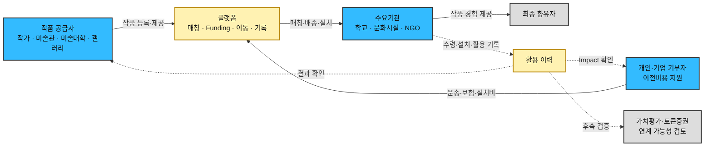
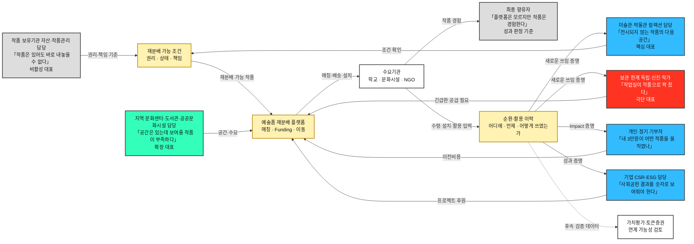

# 페르소나 스펙트럼 분석 ③ — 예술품 재분배 플랫폼

> [분석 방법론 §2](./분석-방법론.md) · 입력 [챕터 04 TAM-SAM-SOM 분석 ③](../04-tam-sam-som/분석-03-예술품-재분배-플랫폼.md) · 후속 [고객 여정지도 ③](./분석-03-예술품-재분배-플랫폼-고객여정지도.md)

> ⚙️ **진행 상태 — 워크플로우 ①~⑤단계 완료.**
> 방법론 §2의 5단계를 모두 수행했다. **①생성**(§3, 12종 원본) → **②평가**(§8, 4종 선별) → **③보정**(§9, 대표 카드) → **④검증**(§10) → **⑤통합**(§11, Spectrum Map).
>
> ⚠️ **두 가지를 못 채운 채 완료로 닫았다.** ④단계의 *'다중 AI 교차검증'* 은 실제 독립 검증을 수행하지 못했고, **사용자 인터뷰·설문도 아직 없다.** 근거 등급은 §7에 그대로 남겨둔다.
>
> 🔁 **재작성 이력.** 기존 예술품 Persona 문서는 작가·미술관·학교·기부자·기업·미술대학·갤러리·문화시설·NGO·최종 향유자 등 일반 역할을 중심으로 정리했다. 이번 문서는 **강사 문서의 Persona Spectrum 구조**에 맞춰 역할을 다시 배열하고, **작품 공급 × 수요기관 × 이전비용 Funding × 최종 향유**의 관계를 기준으로 ①~⑤단계를 다시 정리한 결과다.

---

## 0. 정정 — 무엇이 틀렸고 실제 모델은 무엇인가

### 틀린 전제

이 사업은 **미술품 토큰증권 기획에서 출발**했고, 거래·자산화되지 못한 작품을 다시 순환시켜 새로운 전시·설치·활용 이력을 만들 수 있는지 탐색하면서 예술품 재분배 플랫폼으로 확장됐다.

여기서 가장 쉽게 생기는 잘못된 전제는 다음 두 가지다.

1. **"재분배하면 작품의 경제적 가치가 오른다."**
2. **"재분배된 작품은 향후 토큰증권으로 바로 연결된다."**

둘 다 현재 단계에서 확정할 수 없다. 재분배가 먼저 만들어야 하는 것은 **새로운 쓰임·향유·활용 이력**이며, 경제적 가치 재평가와 토큰증권 연계는 그 뒤에 별도로 검증해야 한다.

> ⚠️ **재분배 자체가 작품의 가격 상승이나 토큰증권 발행을 보장하지 않는다.** 가치평가·법률·사업성 검토 없이 둘을 자동 연결하면 현재 사업 가설을 사실처럼 쓰게 된다.

### 실제 모델

| 층 | 실제 내용 |
|---|---|
| **온라인에서 하는 일** | ① 재분배 가능한 작품을 등록한다 ② 작품이 필요한 학교·문화시설·NGO 등 수요를 확인한다 ③ 개인·기업이 **운송·보험·설치 등 이전비용**을 지원한다 ④ 매칭·배송·설치·성과를 확인한다 |
| **오프라인에서 하는 일** | 작품의 소유권·저작권·작가 동의·보존상태를 확인하고, 포장·운송·보험·통관·설치 조건을 협의한다 |
| **실행** | **유휴·저평가·폐기 가능 작품 → 적합한 수요기관 매칭 → 이전비용 조성 → 배송·설치 → 실제 향유·활용 → 이력 축적** |
| **돈이 쓰이는 곳** | 작품 자체의 매입비가 아니라 **작품을 실제로 움직이기 위한 운송·보험·통관·설치 등의 비용**이 핵심 Funding 대상이다 |
| **장기 확장** | 재분배 이후 축적된 **전시·설치·활용 이력**이 작품 가치평가에 의미가 있는지 검증하고, 자산화 요건을 충족하는 경우에만 기존 미술품 토큰증권 사업과의 연계 가능성을 검토한다 |

### 이 정정이 바꾸는 것

| 항목 | 틀린 전제 | 실제 |
|---|---|---|
| **고객이 누구인가** | 작품을 가진 사람과 작품이 필요한 사람만 보면 된다 | **작품 공급자 + 수요기관 + 이전비용 기부자**가 서로 다른 고객군이고, 최종 향유자는 별도로 존재한다 |
| **무엇을 제공하는가** | 작품 매칭 또는 작품의 가치 상승 | **작품 순환 실행 + 실제 수령·설치·활용 결과의 기록** |
| **행위자를 어떻게 움직이는가** | 모두 같은 화면에서 같은 방식으로 참여한다 | 공급자는 작품·권리 정보를, 수요자는 공간·관리조건을, 기부자는 비용·성과 정보를 본다. 운영 파트너는 계약·협의로 움직인다 |
| **화면이 필요한 사람** | 모든 이해관계자 | 공급자·수요기관·기부자가 주 사용자다. 최종 향유자는 직접 사용하지 않을 수 있고, 일부 운영 이해관계자는 화면보다 계약·업무 프로세스가 중요하다 |
| **성과 단위** | 매칭 건수 또는 작품 가격 상승 | **실제 이전 작품 수 · 설치 기관/지역 · 이전비용 집행 · 수령·설치·활용 이력**. 가격 상승은 별도 검증 |

### 챕터 04는 폐기되지 않는다 — 다만 무엇의 지도인지가 바뀐다

| 챕터 04 산출물 | 정정 후의 지위 |
|---|---|
| 작가·미술관·미술대학·갤러리 등 공급 세그먼트 | **유효.** 재분배 가능한 작품이 어디에서 나올 수 있는지 보여주는 공급 후보 지도다 |
| 학교·문화시설·NGO·문화취약지역 등 수요 세그먼트 | **유효.** 작품이 실제로 설치·향유될 수 있는 수요 후보 지도다 |
| 개인·기업 Funding 세그먼트 | **유효.** 작품을 움직이는 운송·보험·설치 비용을 지원할 수 있는 자금 주체다 |
| 토큰증권 연계 가설 | **현재 고객 지도가 아니다.** 재분배 이후 활용 이력이 가치평가에 의미가 있는지 확인한 뒤 별도 사업 검토로 넘어간다 |

> 📌 **핵심은 이것이다. Market Segment에 등장하는 사람들이 모두 같은 종류의 고객은 아니다.** 작품을 내놓는 사람, 작품을 받는 사람, 이동비용을 대는 사람, 작품을 실제로 경험하는 사람의 **행동과 성공조건이 다르다.** 그래서 Persona Spectrum에서도 이 역할을 분리해야 한다.

---

## 1. 이 단계의 규칙과 두 가지 편차

**①단계는 좁히는 단계가 아니라 넓히는 단계다.** 방법론이 요구하는 배분(핵심 5 · 확장 3 · 극단 2 · 비활성 2 = **12종**)을 그대로 채운다. 현실성이 의심스러운 후보도 남긴다 — 걸러내는 일은 ②단계의 몫이다. 각 페르소나는 방법론이 지정한 **6개 항목**(이름 · 직무 · 문제 · 목표 · 감정 · 대체 솔루션)을 모두 채운다.

### 편차 ① — '이름'을 직무명 + 슬로건으로 대체했다

기존 예술품 Persona 문서에서는 `김서윤`, `박소연` 같은 **가상 실명**을 사용했다. 이번 문서는 강사 형식에 맞춰 `이름` 항목을 **직무명을 앞에, 그 사람의 한 문장짜리 문제를 딴 슬로건을 뒤에** 두는 형태로 바꾼다.

> **독립 작가 「팔리지 않아도 쓰임은 끝나지 않았다」**

나이·성별·가족관계 같은 신상은 만들지 않는다. **지어낸 신상은 설계 판단을 바꾸지 못하면서 문서를 실제 인터뷰 결과처럼 읽히게 만들 수 있다.** 반면 직무명은 어떤 의사결정을 하는 사람인지, 슬로건은 무엇 때문에 막혀 있는지를 바로 보여준다.

### 편차 ② — 비활성(Non-user)을 두 갈래로 나눴다

예술품 서비스의 Non-user는 이유가 서로 다르다.

| 구분 | 정의 | 해당 인물 |
|---|---|---|
| **제약형** | 작품을 보유하고 있고 참여 가능성도 있지만 **소유권·저작권·작가 동의·보존·책임 조건** 때문에 플랫폼에 들어오지 못한다 | **작품 보유기관 자산·작품관리 담당** 「작품은 있어도 바로 내놓을 수 없다」 |
| **비접근형** | 플랫폼을 직접 사용할 필요가 없거나 사용할 위치에 있지 않지만 **서비스 성과를 실제로 경험하는 사람**이다 | **문화예술 접근성이 낮은 지역의 학생** 「플랫폼은 모르지만 작품은 경험한다」 |

앞은 **진입 조건의 문제**이고 뒤는 **사용자와 수혜자가 분리된 구조의 문제**다. 비활성 2명 자리에 하나씩 배치한다.

### 스펙트럼에 넣지 않은 사람들

**작가·저작권자 승인 주체, 기관 자산·법무 담당, 작품 상태·보존 검토자, 운송·보험·통관·설치 실무자 등**은 중요하지만 현재 12종 Persona에는 넣지 않는다. 이들은 고객 유형이라기보다 **작품 한 점을 실제로 이동시키기 위해 승인·계약·검토가 필요한 운영 이해관계자**다. 별도 명부로 §4에 정리한다.

---

## 2. 스펙트럼 배치

```mermaid
graph LR
%% subgraph 안에 direction 을 넣지 말 것.
%% 내부 노드끼리 연결선이 없어 모두 같은 rank 이므로, 진행 방향의 직각으로 배치된다.
%% 부모의 LR 을 물려받아야 세로로 쌓이고, TB 를 주면 가로로 퍼진다.
    subgraph CORE["Core 핵심 5 — 재분배를 직접 성립시키는 주력 사용자"]
        ARTIST["독립 작가<br>「팔리지 않아도 쓰임은 끝나지 않았다」<br>미판매·미전시 작품의 다음 쓰임이 없다"]
        MUSEUM["미술관·박물관 컬렉션 담당<br>「전시되지 않는 작품의 다음 공간」<br>유휴 소장품을 쉽게 외부로 보낼 수 없다"]
        SCHOOL["문화취약지역 학교 문화예술 담당<br>「학교에서 실제 작품을 보여주고 싶다」<br>학생이 실제 작품을 접할 기회가 적다"]
        DONOR["개인·정기 기부자<br>「내 3만원이 어떤 작품을 움직였나」<br>기부 결과를 구체적으로 체감하기 어렵다"]
        CSR["기업 CSR·ESG 담당<br>「사회공헌 결과를 숫자로 보여줘야 한다」<br>성과를 구체적 수치로 설명하기 어렵다"]
    end

    subgraph ADJ["Adjacent 확장 3 — 유사 문제 · 다른 맥락"]
        UNIVERSITY["미술대학 작품관리·실기실 담당<br>「졸업작품의 다음 쓰임이 필요하다」<br>교육 작품의 반환·보관·권리 처리가 필요하다"]
        GALLERY["상업 갤러리 작품관리 담당<br>「미판매 작품을 마음대로 보낼 수는 없다」<br>작가 계약·권리 때문에 임의 재분배가 어렵다"]
        CULTURE["지역 문화센터·도서관·공공문화시설 담당<br>「공간은 있는데 보여줄 작품이 부족하다」<br>공간은 있으나 지속적인 작품 확보가 어렵다"]
    end

    subgraph EXT["Extreme 극단 2 — 제약 상황 · 실패 중심"]
        STORAGE["보관 한계 독립·신진 작가<br>「작업실이 작품으로 꽉 찼다」<br>작품 보관이 창작공간 자체를 압박한다"]
        NGO["문화취약지역 문화지원 NGO 담당<br>「외부 지원 없이는 작품을 확보하기 어렵다」<br>작품·콘텐츠·운송비를 자체 조달하기 어렵다"]
    end

    subgraph NON["Non-user 비활성 2 — 진입 장벽"]
        BLOCKED["작품 보유기관 자산·작품관리 담당<br>「작품은 있어도 바로 내놓을 수 없다」<br>제약형 — 권리·보존·책임이 막는다"]
        STUDENT["문화예술 접근성이 낮은 지역의 학생<br>「플랫폼은 모르지만 작품은 경험한다」<br>비접근형 — 성과 판정의 기준"]
    end

    CORE --> ADJ
    CORE --> EXT
    ADJ --> NON

    classDef core fill:#33BBFF,stroke:#333,stroke-width:2px,color:#111;
    classDef adj fill:#33FFBB,stroke:#333,stroke-width:2px,color:#111;
    classDef ext fill:#FF3322,stroke:#333,stroke-width:2px,color:#fff;
    classDef non fill:#DDDDDD,stroke:#333,stroke-width:2px,color:#111;
    class ARTIST,MUSEUM,SCHOOL,DONOR,CSR core;
    class UNIVERSITY,GALLERY,CULTURE adj;
    class STORAGE,NGO ext;
    class BLOCKED,STUDENT non;
```

> 이 그림은 **배치**만 보여준다. 페르소나 사이의 관계를 그린 **Spectrum Map은 §11**에 있다.

---

## 3. 페르소나 원본 12종

### 🔵 핵심(Core) 5종 — 주력 타깃 / 재분배 성립에 직접 필요한 사용자

| 인물 | 직무 | 문제 | 목표 | 감정 | 대체 솔루션 (현재 쓰는 것) |
|---|---|---|---|---|---|
| **독립 작가** 「팔리지 않아도 쓰임은 끝나지 않았다」 | 독립 작가 · 작품 공급자 | 판매·전시되지 않은 작품이 작업실에 누적되고 있지만, **폐기하지 않고 다시 활용할 수 있는 경로를 찾기 어렵다.** | 작품을 새로운 공간과 관람자에게 연결해 **작품의 쓰임을 이어가는 것** | **가설:** 작품에 대한 애착 + 보관 부담 | **가설:** 계속 보관 · 할인 판매 · 지인 기증 · 개별 전시처 탐색 · 폐기 |
| **미술관·박물관 컬렉션 담당** 「전시되지 않는 작품의 다음 공간」 | 미술관·박물관 컬렉션 담당자 · 작품 공급자 | 장기간 활용되지 않는 작품이 존재하지만 **보존·관리 책임 때문에 단순 처분하기 어렵고 적절한 활용처를 찾기도 어렵다.** | 재분배 가능한 작품을 필요한 기관에 연결해 **소장품의 새로운 활용 가능성**을 만드는 것 | **가설:** 작품 보존 책임 + 활용 필요성 사이의 신중함 | **가설:** 수장고 장기 보관 · 기관 간 대여 · 개별 기증 |
| **문화취약지역 학교 문화예술 담당** 「학교에서 실제 작품을 보여주고 싶다」 | 농어촌·문화취약지역 학교 문화예술 담당자 · 작품 수요자 | 학생들이 실제 예술작품을 접할 기회가 적고 **학교 예산만으로 작품을 구매하기 어렵다.** | 학생들이 학교 안에서 **지속적으로 실제 작품을 보고 경험**하게 하는 것 | **가설:** 지역에 따른 문화예술 경험 격차에 대한 아쉬움 | **가설:** 미술관 견학 · 온라인 이미지 · 복제물 · 단기 예술교육 |
| **개인·정기 기부자** 「내 3만원이 어떤 작품을 움직였나」 | 개인·정기 기부자 · 작품 이전비용 지원자 | 일반적인 기부는 **자신의 돈이 어디에 쓰였고 어떤 결과를 만들었는지 구체적으로 체감하기 어렵다.** | 자신의 기부금이 **어떤 작품을 어느 지역으로 이동시키고 어떤 문화 경험을 만들었는지** 확인하는 것 | **가설:** 공감 + 기부금 사용의 투명성을 중시 | **가설:** 일반 NGO 기부 · 문화재단 후원 · 일회성 모금 |
| **기업 CSR·ESG 담당** 「사회공헌 결과를 숫자로 보여줘야 한다」 | 기업 CSR·ESG 담당자 · 프로젝트 후원자 | 사회공헌 예산을 집행해도 **실제 효과를 구체적인 수치와 결과로 보여주기 어렵다.** | 작품 재분배와 문화예술 접근성 개선을 연결하고 **지원 작품 수·지역·기관 등의 성과**를 확보하는 것 | **가설:** 사업의 설명 가능성 + 성과 증빙 부담 | **가설:** 일반 현금기부 · 문화지원 사업 · 기존 CSR 프로그램 |

> 📌 **핵심 5인은 하나의 동일 고객군이 아니다.** 독립 작가와 미술관 컬렉션 담당은 **작품을 공급**하고, 학교 담당은 **작품을 필요로 하며**, 개인 기부자와 기업 CSR·ESG 담당은 **작품이 실제로 이동할 수 있도록 이전비용을 지원**한다. 같은 플랫폼에 들어오더라도 의사결정 구조가 **공급 승인 → 공간 수요 → 기부·후원**으로 벌어져 있다. ②단계 선별에서 이 차이를 그대로 남긴다.

### 🟢 확장(Adjacent) 3종 — 유사 문제 / 다른 맥락

| 인물 | 직무 | 문제 | 목표 | 감정 | 대체 솔루션 (현재 쓰는 것) |
|---|---|---|---|---|---|
| **미술대학 작품관리·실기실 담당** 「졸업작품의 다음 쓰임이 필요하다」 | 미술대학 작품관리·실기실 담당자 | 졸업전시와 수업 이후 작품이 남지만 **학생 반환·보관·권리 확인 등 처리 과정이 필요하다.** | 재분배 가능한 교육 작품에 **새로운 활용처**를 만드는 것 | **가설:** 폐기는 아깝지만 계속 보관하는 것도 부담 | **가설:** 학생 반환 · 교내 보관 · 교내 활용 · 폐기 |
| **상업 갤러리 작품관리 담당** 「미판매 작품을 마음대로 보낼 수는 없다」 | 상업 갤러리 작품관리 담당자 | 전시 이후 판매되지 않은 작품이 존재하지만 **작가와의 계약·권리관계 때문에 임의로 재분배하기 어렵다.** | 권리 조건이 충족되는 작품에 **새로운 전시·활용 기회**를 만드는 것 | **가설:** 작품의 시장가치와 작가 이미지 훼손 가능성에 대한 우려 | **가설:** 재전시 · 할인 판매 · 장기 보관 · 작가 반환 |
| **지역 문화센터·도서관·공공문화시설 담당** 「공간은 있는데 보여줄 작품이 부족하다」 | 지역 문화센터·도서관·공공문화시설 담당자 | 전시할 공간은 있지만 **지속적으로 새로운 작품을 확보할 예산과 콘텐츠가 부족하다.** | 재분배 작품을 활용해 주민들이 **가까운 곳에서 예술작품을 경험**하게 하는 것 | **가설:** 공간을 충분히 활용하지 못한다는 아쉬움 | **가설:** 지역작가 섭외 · 단기 기획전 · 복제물 전시 |

> 📌 **확장 3명은 Core와 완전히 다른 시장이 아니라 기존 공급·수요 구조의 인접 사용자다.** 미술대학과 갤러리는 작품 공급 가능성이 있지만 **동의·계약·권리 조건**이 추가되고, 지역 문화시설은 작품 수요가 있지만 학교와는 **공간 운영·주민 프로그램**이라는 맥락이 다르다.

### 🔴 극단(Extreme) 2종 — 제약 상황 / 실패 중심

| 인물 | 직무 | 문제 | 목표 | 감정 | 대체 솔루션 (현재 쓰는 것) |
|---|---|---|---|---|---|
| **보관 한계 독립·신진 작가** 「작업실이 작품으로 꽉 찼다」 | 보관 여력이 매우 작은 독립·신진 작가 | 판매되지 않은 작품이 누적되면서 **작품 보관이 작업공간 자체를 압박한다.** | 폐기하기 전에 작품을 필요로 하는 **새로운 공간을 찾는 것** | **가설:** 작품 애착 + 현실적인 공간·비용 부담의 강한 충돌 | **가설:** 외부 창고 · 저가 판매 · 지인 기증 · 폐기 |
| **문화취약지역 문화지원 NGO 담당** 「외부 지원 없이는 작품을 확보하기 어렵다」 | 문화취약지역 문화지원 NGO 담당자 | 지원 지역에서 작품과 문화콘텐츠를 자체적으로 확보하기 어렵고 **구매·운송 예산도 제한적이다.** | 외부의 유휴 작품과 기부금을 연결해 지역 주민에게 **지속 가능한 문화자원**을 제공하는 것 | **가설:** 일회성 지원이 아닌 지속적인 공급망 확보에 대한 고민 | **가설:** 단기 문화사업 · 현지 조달 · 개별 후원 |

> 📌 **극단 2명은 서비스의 제약을 가장 선명하게 보여준다.** 보관 한계 작가는 **폐기 직전까지 밀린 공급 문제**, 문화취약지역 NGO 담당은 **외부 공급과 이전비용 없이는 실행이 어려운 수요 문제**를 드러낸다. 한쪽은 시간이, 다른 한쪽은 외부 자원 의존도가 극단적으로 높다.

### ⬜ 비활성(Non-user) 2종 — 진입 장벽 / 직접 사용하지 않는 수혜자

| 인물 | 직무 | 문제 | 목표 | 감정 | 대체 솔루션 (현재 쓰는 것) |
|---|---|---|---|---|---|
| **작품 보유기관 자산·작품관리 담당** 「작품은 있어도 바로 내놓을 수 없다」 *(제약형)* | 작품 보유기관 자산·작품관리 담당자 | 유휴 작품이 있어도 **소유권·저작권·작가 동의·보존상태** 등이 명확하지 않으면 재분배를 결정할 수 없다. | 작품의 **재분배 가능 조건과 책임 범위**를 명확하게 확인하는 것 | **가설:** 작품 이전 후 발생할 수 있는 책임 문제 때문에 참여에 신중 | **가설:** 기존 보관 유지 · 원소유자 반환 · 매각 |
| **문화예술 접근성이 낮은 지역의 학생** 「플랫폼은 모르지만 작품은 경험한다」 *(비접근형)* | 문화예술 접근성이 낮은 지역의 학생 · 최종 향유자 | 실제 예술작품을 **일상적으로 접할 기회가 제한적이다.** | 학교나 생활공간에서 자연스럽게 **실제 작품을 보고 경험**하는 것 | **가설:** 작품에 관심을 가질 수도 있고 기존에는 예술 자체에 무관심할 수도 있음 | **가설:** 온라인 이미지 · 교과서 · 미술관 견학 · 학교 문화프로그램 |

> 📌 **두 Non-user는 이유가 서로 다르다.** 작품 보유기관 담당은 **작품을 보유하고 있어도 조건 때문에 진입하지 못하는 잠재 공급자**다. 반면 학생은 애초에 작품 등록·신청·기부를 수행하는 고객이 아니라 **재분배 결과를 경험하는 최종 수혜자**다. 사용자와 수혜자를 섞으면 서비스 성과가 화면 사용률로만 왜곡된다.

---

## 4. 사전 설득 대상 명부 — 스펙트럼 밖

아래 행위자들은 현재 12종 Persona와 구분한다. 이들은 고객 유형이라기보다 **작품 한 점이 실제로 이동하기 위해 승인·계약·검토가 필요한 이해관계자**다. 플랫폼 화면만으로 움직이지 않으며 운영 협의가 필요하다.

| 행위자 | 무엇을 설득하는가 | 설득이 실패하면 | 챕터 04 |
|---|---|---|---|
| 작가·저작권자 | 재분배·전시 동의, 작품 이미지 사용 범위 | 작품을 등록해도 **이전·전시를 실행할 수 없다** | 공급 |
| 기관 자산·법무 담당 | 소유권·자산처리·기증/이전 권한·책임 범위 | 기관 소장 작품이 **외부 이전 승인을 받지 못한다** | 공급 |
| 작품 상태·보존 검토자 | 작품 상태, 이동 가능 여부, 포장·보존 조건 | 훼손 위험이 큰 작품을 잘못 매칭하거나 **이동 자체가 중단된다** | 공급·운영 |
| 미술품 운송 파트너 | 포장 방식·이동 경로·운송 견적·상태 추적 | 이전비용을 산정하지 못하고 **작품을 실제로 움직일 수 없다** | 운영 |
| 보험 파트너 | 작품 상태·운송 과정에 따른 보험 조건 | 사고 책임과 비용 범위가 불명확해 **공급자가 승인을 보류할 수 있다** | 운영 |
| 통관 관련 주체 *(해외 재분배 시)* | 반출입·신고·통관 조건 | 국제 재분배가 **지연·중단될 수 있다** | 국제 확장 |
| 수령기관 내부 승인·시설 책임자 | 설치 공간·인수 가능 여부·관리 책임·수령 확인 | 작품이 도착해도 **설치·활용·성과 기록이 성립하지 않는다** | 수요 |
| 설치·보존 실무자 | 설치 방식·공간 안전성·환경 조건 | 작품 또는 이용공간에 **보존·안전 문제가 생길 수 있다** | 수요·운영 |
| 가치평가·토큰증권 관련 전문가 | 활용 이력이 실제 가치평가·자산화에 의미가 있는지 | 재분배와 경제적 가치 상승·토큰화를 **근거 없이 연결하게 된다** | 장기 확장 |

> 📌 **이 명부에서 가장 중요한 데이터 접점은 수령·설치·활용 확인이다.** 이 기록이 없으면 공급자는 *"작품이 어디에서 어떻게 쓰이는지"* 확인할 수 없고, 개인·기업 기부자는 *"내 돈이 무엇을 움직였는지"* 증명받기 어렵다. 작품 상태·운송 데이터 역시 실제 실행 단계에서 함께 연결되어야 한다.

---

## 5. 이전 판본과의 정정 매핑

| 기존 Persona / 역할 | 정정 후 | 사유 |
|---|---|---|
| 개인 작가 | **독립 작가 「팔리지 않아도 쓰임은 끝나지 않았다」** + **보관 한계 독립·신진 작가 「작업실이 작품으로 꽉 찼다」** 로 분화 | 일반적인 작품 순환 필요와 **폐기 압력이 큰 극단 상황**을 분리 |
| 미술관 컬렉션 담당자 | **미술관·박물관 컬렉션 담당 「전시되지 않는 작품의 다음 공간」** 으로 유지·구체화 | 단순 수장고 정리가 아니라 **보존 책임 아래 새로운 활용처를 찾는 의사결정**으로 재정의 |
| 농어촌 학교 담당자 | **문화취약지역 학교 문화예술 담당 「학교에서 실제 작품을 보여주고 싶다」** 로 유지·구체화 | 작품을 받는 행위보다 **학생의 실제 작품 접근성과 지속적 향유**를 목표로 둠 |
| 개인 기부자 | **개인·정기 기부자 「내 3만원이 어떤 작품을 움직였나」** 로 유지·구체화 | 기부금 자체보다 **어떤 작품의 이동과 문화경험을 만들었는지**가 핵심 |
| 기업 CSR·ESG 담당자 | **기업 CSR·ESG 담당 「사회공헌 결과를 숫자로 보여줘야 한다」** 로 유지 | 작품 공급자가 아니라 우선적으로 **이전비용과 사회공헌 프로젝트를 지원하는 Funding Persona**로 배치 |
| 미술대학 | **미술대학 작품관리·실기실 담당 「졸업작품의 다음 쓰임이 필요하다」** 로 구체화 | 졸업·교육 작품은 **학생 동의·반환·보관·권리 확인**이라는 추가 조건이 있음 |
| 갤러리 | **상업 갤러리 작품관리 담당 「미판매 작품을 마음대로 보낼 수는 없다」** 로 구체화 | 미판매 작품은 재고가 아니라 **작가 계약·권리·시장 맥락**의 영향을 받음 |
| 지역 문화시설 | **지역 문화센터·도서관·공공문화시설 담당 「공간은 있는데 보여줄 작품이 부족하다」** 로 유지·구체화 | 학교와 달리 **공간 운영·전시 콘텐츠 확보**가 핵심 문제 |
| NGO·문화취약지역 | **문화취약지역 문화지원 NGO 담당 「외부 지원 없이는 작품을 확보하기 어렵다」** 로 Extreme 이동 | 수요는 있으나 **외부 공급·구매·운송 자원 의존도가 큰 상황**을 강조 |
| 최종 향유자 | **문화예술 접근성이 낮은 지역의 학생 「플랫폼은 모르지만 작품은 경험한다」** 로 Non-user 유지 | 플랫폼 직접 사용자가 아니라 **성과 판정의 기준**이므로 사용자와 분리 |
| 권리·보존·책임이 불명확한 보유기관 | **작품 보유기관 자산·작품관리 담당 「작품은 있어도 바로 내놓을 수 없다」** 를 Non-user로 추가 | 작품이 있어도 **공급으로 전환되지 않는 진입 장벽**을 별도 Persona로 관찰 |

> 📌 **기존 역할이 사라진 것이 아니라 역할이 더 명확하게 분화됐다.** 특히 `개인 작가`는 Core와 Extreme으로 갈라졌고, `작품을 받는 사람`과 `작품을 경험하는 사람`은 분리됐다. 또 작품 수가 있어도 **권리·책임 조건 때문에 공급으로 들어오지 못하는 Non-user**가 새롭게 드러났다.

---

## 6. ①단계에서 이미 보이는 것

1. **문제의 중심은 단순 폐기가 아니다.** 실제 흐름은 *"작품이 충분히 활용되지 못함 → 보관·유휴 상태가 지속됨 → 일부 작품에 폐기 가능성이 생김 → 새로운 활용처와 향유자를 연결할 순환 경로가 필요함"* 에 가깝다. 경쟁 대안도 폐기만이 아니라 **장기 보관·저가 판매·반환·단기 전시·복제물·기존 기부**까지 넓다.
2. **12명이 반복해서 요구하는 것은 '실제로 무엇이 일어났는지 확인할 수 있는 기록'이다.** 공급자는 새 쓰임을, 수요기관은 수령·설치를, 기부자는 자금 집행 결과를, 최종 향유자는 실제 작품 경험을 통해 서비스 가치를 완성한다. **제품의 중심은 단순 매칭 폼이 아니라 순환·활용 이력이다.**
3. **증명의 원천은 플랫폼 혼자 만들 수 없다.** 수령·설치·활용 데이터는 학교·문화시설·NGO 같은 수요기관에서 나오고, 작품 상태·운송 과정은 운영 파트너의 기록에 의존한다. **고객에게 보여줄 성과의 원천을 파트너와 수요기관이 함께 쥐고 있는 구조**다.
4. **같은 플랫폼 안에서도 의사결정 구조가 크게 다르다.** 개인 작가는 작품 한 점을 스스로 판단할 수 있지만, 미술관·대학·갤러리는 권리·내부 승인이 필요하고, 학교·문화시설·NGO는 공간·관리 조건을 확인해야 하며, 개인 기부자와 기업 CSR 담당의 Funding 절차도 다르다. **③보정 단계에서 한 화면으로 처리할 수 있는 부분과 별도 문서·절차가 필요한 부분을 구분해야 한다.**

---

## 7. 근거 등급

| 구성 요소 | 등급 | 비고 |
|---|---|---|
| 사업 모델 정의 (예술품 재분배 → 이전비용 Funding → 설치·활용 이력) | **(확인)** | 사업 기획에서 직접 제시된 구조 |
| 작가·미술관·미술대학·갤러리 등 공급 세그먼트 | **(기존 분석 기반)** | Market Segment에서 승계 |
| 학교·문화시설·NGO·문화취약지역 수요 세그먼트 | **(기존 분석 기반)** | Market Segment에서 승계 |
| 개인·기업의 이전비용 지원 역할 | **(서비스 기획 기반)** | Funding Persona 구성에 사용 |
| 직무의 존재와 역할 분담 | **(추정)** | 기존 Market Segment와 업계 구조에서 도출. 실제 참여 의향은 미확인 |
| **12종의 문제·목표·감정·대체 솔루션 전체** | **(가정)** | **인터뷰 없음. 감정·대체 솔루션은 특히 검증 필요** |
| 사전 협의 대상이 실제로 재분배에 동의한다는 전제 | **(가정)** | 공급 작품·운송·수령·설치 조건이 실제로 성립하는지가 핵심 선행조건 |
| 재분배 후 작품 가격 상승 | **근거 없음** | 현재 서비스 효과로 주장하지 않음 |
| 재분배 작품의 토큰증권 발행 | **근거 없음** | 자동 연결로 주장하지 않음 |
| 활용 이력이 가치평가에 활용될 가능성 | **사업 가설** | 가치평가·법률·사업성 검증 필요 |

> ⚠️ **가장 먼저 검증해야 할 것은 페르소나보다 실제 재분배 조건이다.** 재분배 가능한 작품이 없거나, 작품 보유자가 외부 이전에 동의하지 않거나, 수요기관이 실제 작품을 설치·관리할 수 없으면 Persona가 정교해도 서비스는 성립하지 않는다. **④단계 검증에서 이 조건을 Persona보다 앞세운다.**

---

## 8. ②단계 — 2차 평가와 4종 선별

### 평가 기준

방법론이 지정한 **문제·행동·맥락의 현실성**을 세 축으로 풀어 3점 척도(●●● / ●●○ / ●○○)로 매겼다.

| 축 | 묻는 것 |
|---|---|
| **문제 현실성** | 이 문제가 실제로 존재하는가, 아니면 우리가 만들고 싶은 문제인가 |
| **행동 관찰성** | 작품 등록·신청·기부·승인·수령·설치 같은 행동이 실제로 관찰 가능한가 |
| **맥락 구체성** | 언제·어떤 상황에서 이 사람이 이 문제를 겪는지가 특정되는가 |

### 채점

| 인물 | 문제 | 행동 | 맥락 | 판정 |
|---|:---:|:---:|:---:|---|
| 독립 작가 「팔리지 않아도 쓰임은 끝나지 않았다」 | ●●● | ●●● | ●●● | 유보 — 공급 핵심 후보이나 기관 공급 대표와 역할이 겹친다 |
| 미술관·박물관 컬렉션 담당 「전시되지 않는 작품의 다음 공간」 | ●●● | ●●● | ●●● | ✅ **핵심 대표** |
| 문화취약지역 학교 문화예술 담당 「학교에서 실제 작품을 보여주고 싶다」 | ●●● | ●●● | ●●● | 유보 — 수요 핵심이지만 유형별 1명 선별 형식상 별도 관리 |
| 개인·정기 기부자 「내 3만원이 어떤 작품을 움직였나」 | ●●○ | ●●● | ●●○ | 유보 — Funding 의향 자체 검증 필요 |
| 기업 CSR·ESG 담당 「사회공헌 결과를 숫자로 보여줘야 한다」 | ●●● | ●●○ | ●●● | 유보 — 기관 내부 승인·예산 주기 검증 필요 |
| 미술대학 작품관리·실기실 담당 「졸업작품의 다음 쓰임이 필요하다」 | ●●○ | ●●● | ●●● | 유보 — 공급 시점은 구체적이나 권리·동의 구조 검증 필요 |
| 상업 갤러리 작품관리 담당 「미판매 작품을 마음대로 보낼 수는 없다」 | ●●○ | ●●○ | ●●● | 유보 — 계약·권리 조건에 따라 참여 가능성이 크게 달라짐 |
| 지역 문화센터·도서관·공공문화시설 담당 「공간은 있는데 보여줄 작품이 부족하다」 | ●●● | ●●● | ●●● | ✅ **확장 대표** |
| 보관 한계 독립·신진 작가 「작업실이 작품으로 꽉 찼다」 | ●●● | ●●● | ●●● | ✅ **극단 대표** |
| 문화취약지역 문화지원 NGO 담당 「외부 지원 없이는 작품을 확보하기 어렵다」 | ●●○ | ●●○ | ●●○ | 유보 — 작품 수요와 이전비용 의존 구조를 함께 검증해야 함 |
| 작품 보유기관 자산·작품관리 담당 「작품은 있어도 바로 내놓을 수 없다」 | ●●● | ●●○ | ●●● | ✅ **비활성 대표** |
| 문화예술 접근성이 낮은 지역의 학생 「플랫폼은 모르지만 작품은 경험한다」 | ●●● | ●○○ | ●●● | 별도 지위 — 직접 고객이 아니라 **성과 판정 기준** |

### 선별 결과 — 대표 4종

**미술관·박물관 컬렉션 담당 · 지역 문화센터·도서관·공공문화시설 담당 · 보관 한계 독립·신진 작가 · 작품 보유기관 자산·작품관리 담당**

> 📌 **대표 4종은 중요도 순위 1~4위가 아니다.** Core / Adjacent / Extreme / Non-user에서 각각 1명을 고르는 형식 때문에 선별한 것이다. **문화취약지역 학교 담당, 개인 기부자, 기업 CSR·ESG 담당이 중요하지 않다는 뜻이 아니다.** 실제 수요기관 UX와 Funding UX를 설계할 때는 이들을 다시 핵심으로 올려야 한다.
>
> 📌 **선별된 4명은 서로 다른 위치에 있지만 한 가지 질문으로 수렴한다.** *"작품이 있어도 실제로 순환할 조건이 갖춰졌는가?"* 미술관 담당은 기관 공급조건, 문화시설 담당은 수요공간 조건, 보관 한계 작가는 시간 압박, 작품 보유기관 담당은 권리·책임 장벽을 보여준다. **이 서비스는 작품 수보다 ‘재분배 가능 조건’을 먼저 검증해야 한다.**

---

## 9. ③단계 — 3차 보정: 대표 4종 페르소나 카드

①단계의 6항목에 **첫 접점 · 전환 조건 · 이탈 조건**을 더해 실제 화면·운영 설계에 쓸 수 있는 형태로 재기술했다.

### 🔵 핵심 — 미술관·박물관 컬렉션 담당 「전시되지 않는 작품의 다음 공간」

| 항목 | 내용 |
|---|---|
| **직무·상태** | 미술관·박물관 컬렉션 담당자 · 작품 공급자 |
| **문제** | 장기간 활용되지 않는 작품이 존재하지만 보존·관리 책임 때문에 단순 처분하기 어렵고 적절한 활용처를 찾기도 어렵다 |
| **목표** | 재분배 가능한 작품을 필요한 기관에 연결해 **소장품의 새로운 활용 가능성**을 만드는 것 |
| **감정** | **가설:** 작품 보존 책임과 활용 필요성 사이에서 신중함 |
| **대체 솔루션** | **가설:** 수장고 장기 보관 · 기관 간 대여 · 개별 기증 |
| **첫 접점** | **가설:** 소장품 실사·수장고 정리·유휴 소장품 활용 검토 과정에서 재분배 옵션을 탐색 |
| **전환 조건** | **가설:** 권리관계·작품 상태·수요처·운송·보험 조건과 기관 내부 승인에 필요한 기록이 명확할 것 |
| **이탈 조건** | **가설:** 작품 훼손·책임 범위가 불명확하거나 적합한 수요처와 운송 조건을 확인할 수 없을 때 |

### 🟢 확장 — 지역 문화센터·도서관·공공문화시설 담당 「공간은 있는데 보여줄 작품이 부족하다」

| 항목 | 내용 |
|---|---|
| **직무·상태** | 지역 문화센터·도서관·공공문화시설 담당자 · 작품 수요자 |
| **문제** | 전시할 공간은 있지만 지속적으로 새로운 작품을 확보할 예산과 콘텐츠가 부족하다 |
| **목표** | 재분배 작품을 활용해 주민들이 가까운 곳에서 **실제 예술작품을 경험**하게 하는 것 |
| **감정** | **가설:** 공간을 충분히 활용하지 못한다는 아쉬움 |
| **대체 솔루션** | **가설:** 지역작가 섭외 · 단기 기획전 · 복제물 전시 |
| **첫 접점** | **가설:** 전시 기획·공간 개편·문화프로그램 준비 과정에서 지원 가능한 작품을 탐색 |
| **전환 조건** | **가설:** 작품 크기·설치·관리 조건이 공간과 맞고 기관이 부담해야 할 비용과 책임이 명확할 것 |
| **이탈 조건** | **가설:** 설치·관리 부담이 크거나 작품 정보가 공간 목적과 맞지 않을 때 |

### 🔴 극단 — 보관 한계 독립·신진 작가 「작업실이 작품으로 꽉 찼다」

| 항목 | 내용 |
|---|---|
| **직무·상태** | 보관 여력이 매우 작은 독립·신진 작가 · 작품 공급자 |
| **문제** | 판매되지 않은 작품이 누적되면서 작품 보관이 **작업공간 자체를 압박**한다 |
| **목표** | 폐기하기 전에 작품을 필요로 하는 **새로운 공간을 찾는 것** |
| **감정** | **가설:** 작품 애착과 현실적인 공간·비용 부담의 강한 충돌 |
| **대체 솔루션** | **가설:** 외부 창고 · 저가 판매 · 지인 기증 · 폐기 |
| **첫 접점** | **가설:** 새 작품 제작을 위해 작업실을 정리하거나 보관 부담이 커지는 시점에 재분배 경로를 탐색 |
| **전환 조건** | **가설:** 작품 등록이 간단하고 어디로 이동하는지 확인할 수 있으며 작가가 권리·활용 조건을 선택할 수 있을 것 |
| **이탈 조건** | **가설:** 이전까지 너무 오래 걸리거나 등록·포장·운송 과정에서 추가 비용과 업무가 크게 발생할 때 |

> 📌 **이 사람은 일반 공급자의 문제를 가장 압축해서 보여준다.** 작품 정보 입력을 줄이고 매칭·픽업 흐름을 빠르게 만드는 것은 보관 한계 작가에게 특히 중요하지만, 실제로 `속도`가 폐기를 줄이는 핵심 요인인지는 인터뷰가 필요하다.

### ⬜ 비활성 — 작품 보유기관 자산·작품관리 담당 「작품은 있어도 바로 내놓을 수 없다」

| 항목 | 내용 |
|---|---|
| **직무·상태** | 작품 보유기관 자산·작품관리 담당자 · 잠재 공급자 |
| **문제** | 유휴 작품이 있어도 소유권·저작권·작가 동의·보존상태 등이 명확하지 않으면 재분배를 결정할 수 없다 |
| **목표** | 작품의 **재분배 가능 조건과 책임 범위**를 명확하게 확인하는 것 |
| **감정** | **가설:** 작품 이전 후 발생할 수 있는 책임 문제 때문에 참여에 신중함 |
| **대체 솔루션** | **가설:** 기존 보관 유지 · 원소유자 반환 · 매각 |
| **첫 접점** | **가설:** 기관의 유휴자산 정리 또는 외부 기증·이전 가능성을 검토할 때 플랫폼을 확인 |
| **전환 조건** | **가설:** 권리 확인 절차·표준 동의/계약·책임 범위·수령/설치 기록이 명확할 것 |
| **이탈 조건** | **가설:** 권리관계가 불명확하거나 사고·훼손 발생 시 책임 주체를 확인할 수 없을 때 |

> 📌 **이 사람은 마케팅 물량으로 뚫리지 않는다.** 작품이 있고 취지에 공감하더라도 **권리·책임 조건이 해결되지 않으면 참여하지 못한다.** 비활성 시장을 열기 위한 핵심 투자는 광고가 아니라 **표준 동의·계약·책임 구조**다.

---

## 10. ④단계 — 4차 검증: 실재 확률과 근거

> ⚠️ **방법론이 요구한 '다중 AI 교차검증'은 실제로 수행하지 못했다.** 아래는 현재 Persona 문서와 Market Segment 구조를 바탕으로 한 단일 모델 추론이다. **인터뷰·설문으로 대체되지 않는다.**

| 인물 | 실재 확률 | 근거 | 이 판단이 틀렸다면 보이는 신호 | 확인 방법 |
|---|---|---|---|---|
| **미술관·박물관 컬렉션 담당** 「전시되지 않는 작품의 다음 공간」 | **직무 존재 높음 / 재분배 의향 미확인** | 미술관·박물관은 기존 공급 세그먼트에 포함돼 있다. 다만 장기 미활용 작품을 외부 재분배하려는 의향과 승인 조건은 별도 명제다 | 유휴 작품이 있어도 외부 재분배 자체를 거의 검토하지 않는다 | 컬렉션·학예·작품관리 담당자 인터뷰 — **실제 외부 이전 경험과 중단 사유** |
| **지역 문화센터·도서관·공공문화시설 담당** 「공간은 있는데 보여줄 작품이 부족하다」 | **직무 존재 높음 / 실물 작품 수요 미확인** | 문화시설은 기존 수요 세그먼트다. 그러나 공간이 있다는 사실이 곧 재분배 실물작품 수요를 뜻하지 않는다 | 실물 작품보다 공연·프로그램·디지털 콘텐츠를 우선한다 | 문화시설 담당자 인터뷰 — **최근 작품 확보 방식과 설치·관리 제약** |
| **보관 한계 독립·신진 작가** 「작업실이 작품으로 꽉 찼다」 | **존재 높음 / 문제 강도·선택 의향 미확인** | 독립·신진 작가는 기존 공급 세그먼트다. 보관 부담이 있는 작가가 존재할 가능성은 높지만 그 해결책으로 재분배를 택하는지는 미확인 | 보관 부담이 있어도 판매·창고·지인기증·폐기를 압도적으로 선호한다 | 독립·신진 작가 인터뷰 — **보관 부담이 의사결정을 바꾼 실제 사례** |
| **작품 보유기관 자산·작품관리 담당** 「작품은 있어도 바로 내놓을 수 없다」 | **제약 구조 가능성 높음 / 실제 핵심 장벽 미확인** | 기관 공급에는 소유권·저작권·보존·책임 확인이 필요하다는 구조적 제약이 있다 | 표준 기증·이전 절차만으로 대부분 해결되어 큰 장벽이 아니다 | 기관 자산·법무·작품관리 담당자 인터뷰 — **실제 승인 체크리스트와 반려 사유** |

### 검증 우선순위 — 페르소나보다 먼저 확인할 것

| 순위 | 대상 | 이유 |
|---|---|---|
| **1** | **실제로 재분배 가능한 유휴·폐기 가능 작품이 존재하는가** | 공급 자체가 충분하지 않으면 재분배 플랫폼이 성립하지 않는다 |
| **2** | **작품 보유자는 어떤 조건에서 외부 재분배에 동의하는가** | 소유권·저작권·작가 동의·기관 승인이 실제 공급 전환을 결정한다 |
| **3** | **수요기관이 실제 작품을 원하고 설치·관리할 수 있는가** | 문화예술 접근성 부족과 **실물 작품 수요**는 같은 명제가 아니다 |
| **4** | **개인·기업이 운송·보험·설치 등 이전비용을 지원할 의향이 있는가** | 작품 구매가 아닌 **이전비용 Funding**이라는 가치제안을 검증해야 한다 |
| **5** | **재분배 이후의 활용 이력이 가치평가에 의미가 있는가** | 토큰증권 연계 가설의 선행 검증이다. 이 근거가 없으면 현재 서비스와 자산화를 자동 연결할 수 없다 |

---

## 11. ⑤단계 — Persona Spectrum Map

### 이 맵이 말하는 것

1. **중앙에 있는 것은 작품 목록이 아니라 '재분배 가능 조건 + 순환·활용 이력'이다.** 작품이 존재하는 것만으로는 공급이 아니고, 권리·상태·책임 조건을 통과해야 실제 재분배 가능 작품이 된다.
2. **활용 이력의 입력은 플랫폼 혼자 만들 수 없다.** 실제 수령·설치·활용 기록은 학교·문화시설·NGO 같은 수요기관과 운송·설치 파트너에서 나온다. **공급자와 기부자에게 보여줄 결과를 수요·운영 측이 함께 만든다.**
3. **공급·수요·Funding이 서로를 열어 준다.** 작품만 있어도 이동하지 않고, 수요만 있어도 작품이 오지 않으며, Funding만 있어도 재분배 대상과 수요처가 없으면 프로젝트가 성립하지 않는다. **세 집단이 동시에 연결돼야 한 건의 재분배가 완성된다.**
4. **최종 향유자는 루프의 목적지이지 성장 Funnel의 사용자가 아니다.** 학생이 작품을 실제로 경험했다는 사실은 성과 판정의 기준이지만, 플랫폼 가입·기부·등록으로 되돌아오는 것을 전제로 해서는 안 된다. 또한 **토큰증권은 이 루프 바깥의 후속 검증 영역**이다.

---

## 12. 남은 질문과 다음 단계

| 답한 것 | 답하지 못한 것 |
|---|---|
| 누가 작품을 공급·신청·Funding하고 누가 최종 향유하는가 | **각 Persona가 실제로 얼마나 존재하고 얼마나 자주 행동하는가** |
| 재분배 한 건이 성립하려면 공급·수요·Funding이 함께 필요하다는 것 | **실제로 재분배 가능한 작품의 수·상태·권리 조건이 어느 정도인가** |
| 무엇을 기록해야 하는가 (수령·설치·활용 이력) | **누가 어떤 방식으로 기록을 입력하고 얼마나 정확하게 유지하는가** |
| 권리·보존·책임이 공급 진입장벽이라는 가설 | **실제 기관 승인에서 가장 자주 막히는 조건이 무엇인가** |
| 기부가 작품의 이전비용을 지원한다는 구조 | **개인·기업이 실제로 운송·보험·설치비에 지불할 의사가 있는가** |
| 토큰증권은 후속 검증 영역이라는 것 | **활용 이력이 실제 작품 가치평가에 영향을 주는가** |

**→ [고객 여정지도 ③](./분석-03-예술품-재분배-플랫폼-고객여정지도.md) 로 이어진다.** 공급자·수요기관·Funding·Non-user의 여정은 서로 다르므로, 일반적인 `인지 → 고려 → 결정`을 일괄 적용하지 않고 **권리 확인 · 작품 탐색 · 신청/기부 · 매칭 · 이전비용 조성 · 배송 · 설치 · 향유 · 결과 확인**이라는 실제 관문에서 다시 그린다.

이후 기회점수 단계에서는 §8의 유보 Persona — **독립 작가 · 학교 문화예술 담당 · 개인 기부자 · 기업 CSR·ESG 담당 · 미술대학 작품관리 담당 · 갤러리 작품관리 담당 · 문화취약지역 NGO 담당** — 를 우선순위로 다시 세우고, JTBD에서는 *"개인 기부자가 3만원으로 고용하려는 진짜 일은 무엇인가"* 를 검증한다. 단순히 운송비를 내는 일인가, 아니면 **자신의 돈이 한 작품의 새로운 쓰임과 누군가의 문화예술 경험으로 연결됐다고 확인하는 일**인가.
