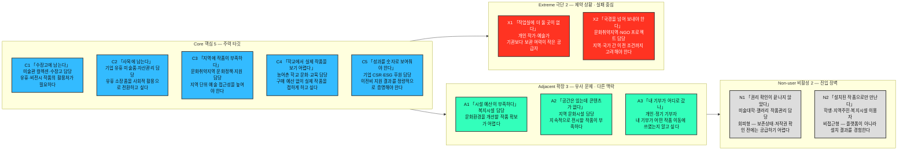

# 페르소나 스펙트럼 분석 ③ — 예술품 재분배 플랫폼

> [분석 방법론 §2](./분석-방법론.md) · 입력 [챕터 04 TAM-SAM-SOM 분석 ③](../04-tam-sam-som/분석-03-예술품-재분배-플랫폼.md)
>
> ⚙️ **현재 진행 상태 — 워크플로우 ①단계까지 수행.** 이 문서는 방법론 §2의 AI 기반 다중 페르소나 생성 및 평가 워크플로우 5단계 중 **①단계 1차 생성(Divergent Thinking)** 산출물이다. **12종 페르소나 원본**이며, 아직 선별되지 않았다. ②평가 · ③보정 · ④검증 · ⑤통합은 미수행.
>
> 📌 기존 일반 Persona에서 확인된 주요 사용자 역할을 버리지 않고 아래 12종에 유지·재배치·분화했다. 선행 분석에 없는 숫자·실명·확정 행동은 추가하지 않았고, 새로 확장한 문제·감정·대체 솔루션은 모두 §6에서 **가정**으로 구분한다.

---

## 0. 이 단계의 규칙과 두 가지 편차

### 무엇을 하는 단계인가

①단계는 좁히는 단계가 아니라 **넓히는 단계**다. 방법론이 요구하는 배분(**핵심 5 · 확장 3 · 극단 2 · 비활성 2 = 12종**)을 그대로 채웠다. 현실성이 낮을 수 있는 후보도 이 단계에서는 지우지 않는다 — 걸러내는 일은 ②단계의 몫이다.

각 페르소나는 방법론이 지정한 6개 항목(**이름 · 직무 · 문제 · 목표 · 감정 · 대체 솔루션**)을 모두 채운다.

### 편차 ① — ‘이름’을 코드네임으로 대체했다

`C1 「수장고에 남는다」`처럼 한 문장짜리 문제를 이름으로 사용한다. 실명·나이·성별·가족관계는 선행 분석에 없으므로 만들지 않는다.

> 📌 코드네임은 사람을 꾸며내기 위한 장치가 아니라 12종의 문제를 빠르게 구분하기 위한 식별자다.

### 편차 ② — 비활성(Non-user)을 두 갈래로 나눴다

방법론에는 ‘회피하는 집단’과 ‘사용할 수 없는 사람’이라는 두 관점이 함께 있다. 본 분석에서도 하나씩 배치한다.

| 유형 | 정의 | 해당 인물 |
|---|---|---|
| **회피형** | 재분배 가능성은 있지만 권리·절차 문제가 해결되지 않아 참여하지 못한다 | N1 「권리 확인이 끝나지 않았다」 |
| **비접근형** | 서비스의 결과를 경험하지만 플랫폼을 직접 사용하지 않는다 | N2 「설치된 작품으로만 만난다」 |

둘은 동일한 Non-user가 아니다. N1은 공급 참여 조건의 문제이고, N2는 플랫폼 직접 사용자가 아닌 **최종 향유자**다.

---

## 1. 스펙트럼 배치

> 방법론 §2의 4유형 배치와 색상을 그대로 두고 12명을 이름·직무·한 줄 특징으로 펼쳤다.
>
> 위 그림은 **인원 배치까지만** 보여준다. 실제 상호관계를 그리는 Spectrum Map은 ⑤단계 산출물이므로 여기서는 확정하지 않는다.

---

## 2. 페르소나 원본 12종

각 표의 `Q` 열은 챕터 04 Market Segment Map의 사분면을 뜻한다. `—`는 해당 2×2 좌표에 직접 배치되지 않은 기부시장·최종향유자·기타 세그먼트를 뜻한다.

### 🔵 핵심(Core) 5종 — 주력 타깃 / 매출·사용 빈도 중심

| 코드·이름 | 직무 | Q | 문제 | 목표 | 감정 | 대체 솔루션 (현재 쓰는 것) |
|---|---|---|---|---|---|---|
| **C1 「수장고에 남는다」** | 미술관·박물관 컬렉션/수장고 담당 | Q4 | 장기간 활용되지 않는 작품이 수장고에 남지만 적합한 수요처를 개별적으로 찾기 어렵다. | 재분배 가능한 작품을 필요한 기관과 연결하고 이전 결과를 확인한다. | **(가정)** 보관 부담과 작품 가치 보존 사이의 신중함 | **(가정)** 계속 보관 · 기관 간 개별 대여·기증 |
| **C2 「사옥에 남는다」** | 기업 총무·자산관리·유휴 미술품 담당 | Q4 | 사옥 이전·리모델링 뒤 사용하지 않는 소장품이 남고 자산처리도 필요하다. | 유휴 미술품을 폐기 대신 사회공헌·재분배 자산으로 전환한다. | **(가정)** 처리 책임과 활용 가능성 사이의 부담 | **(가정)** 사내 재배치 · 보관 · 매각 · 개별 기증 |
| **C3 「지역에 작품이 부족하다」** | 문화취약지역의 문화정책·지역문화사업 담당 | Q2 | 지역의 예술품 필요도는 높지만 자체 공급 여력은 낮다. | 지원 우선지역을 정하고 지역 내 기관에 작품 공급을 확대한다. | **(가정)** 지역 문화격차에 대한 문제의식과 성과 압박 | **(가정)** 공공문화사업 · 개별 예산사업 |
| **C4 「학교에서 실제 작품을 보기 어렵다」** | 농어촌 학교 문화·미술교육 담당 | Q2 | 학생이 실제 예술작품을 접할 기회가 적고 학교 예산으로 작품을 구매하기 어렵다. | 학교 안에서 학생이 지속적으로 실제 작품을 접할 환경을 만든다. | **(가정)** 교육환경의 아쉬움 + 지원에 대한 기대 | **(가정)** 미술관 방문 · 복제 이미지 · 일회성 프로그램 |
| **C5 「성과를 숫자로 보여줘야 한다」** | 기업 CSR·ESG·사회공헌 후원 담당 | — | 기부를 집행해도 어떤 작품이 어느 지역·기관에 전달됐는지 결과를 설명해야 한다. | 이전비 후원이 실제 작품 이동과 문화접근성 개선으로 이어졌다는 정량 결과를 확보한다. | **(가정)** 보고·성과 증빙에 대한 압박 | **(가정)** 일반 현금기부 · 기존 재단·사회공헌 사업 |

> 📌 C1·C2는 챕터 04의 **Q4 공급 거점**, C3·C4는 **Q2 최우선 수요**, C5는 2×2 수급 좌표 밖의 **기부시장**에서 가져왔다. 3면 시장이므로 공급·수요뿐 아니라 자금 제공자도 핵심 후보에 포함했다.

### 🟢 확장(Adjacent) 3종 — 유사 문제 / 다른 맥락

| 코드·이름 | 직무 | Q | 문제 | 목표 | 감정 | 대체 솔루션 (현재 쓰는 것) |
|---|---|---|---|---|---|---|
| **A1 「시설 예산이 부족하다」** | 지역 복지시설 운영·공간 담당 | Q2 | 이용자에게 문화예술 경험을 제공하고 싶지만 작품 구매·전시 예산이 제한적이다. | 이용자가 일상 공간에서 예술을 경험할 수 있도록 작품 지원을 받는다. | **(가정)** 필요성은 크지만 비용 부담을 느낌 | **(가정)** 포스터·복제물 · 단기 문화프로그램 |
| **A2 「공간은 있는데 콘텐츠가 없다」** | 지역 문화센터·문화시설 운영 담당 | Q2 | 전시 공간은 있지만 지속적으로 보여줄 작품과 콘텐츠가 부족하다. | 주민이 가까운 공간에서 다양한 작품을 경험할 수 있도록 한다. | **(가정)** 공간 활용에 대한 아쉬움 + 새로운 콘텐츠 기대 | **(가정)** 지역작가 섭외 · 단기 기획전 · 자체 프로그램 |
| **A3 「내 기부가 어디로 갔나」** | 개인 기부자·정기 후원자 | — | 일반 기부에서는 돈이 구체적으로 어디에 쓰였는지 체감하기 어렵다. | 자신의 기부가 어떤 작품의 이전·설치에 사용됐는지 확인한다. | **(가정)** 공감 + 투명성 요구 | **(가정)** 일반 NGO·문화재단 기부 · 다른 프로젝트 후원 |

> 📌 A1·A2는 C3·C4와 같은 ‘문화접근 부족’ 문제를 다른 기관 맥락에서 겪는다. A3는 C5와 같은 자금시장에 있지만 **기업 예산이 아닌 개인·정기 후원**이라는 다른 의사결정 맥락을 가진다.

### 🔴 극단(Extreme) 2종 — 제약 상황 / 실패·대안 사용 중심

| 코드·이름 | 직무 | Q | 문제 | 목표 | 감정 | 대체 솔루션 (현재 쓰는 것) |
|---|---|---|---|---|---|---|
| **X1 「작업실에 더 둘 곳이 없다」** | 개인 작가·독립 예술가 | — | 선행 3면 시장에서 작가·예술가는 ‘보관 부담 작품’ 공급자로 정의된다. 기관보다 개인이 직접 작품 보관 부담을 떠안는다는 점에서 공급 제약이 크다. | 폐기하지 않고 작품을 활용할 수 있는 수요처를 찾는다. | **(가정)** 작품 애착과 공간 부담이 동시에 존재 | **(가정)** 계속 보관 · 지인 기증 · 할인 판매 · 폐기 |
| **X2 「국경을 넘어 보내야 한다」** | 문화취약지역·NGO 문화지원 프로젝트 담당 | Q2 | 서비스가 전 세계 지역을 대상으로 하고 이전비용에 통관이 포함되므로, 지역·국가 간 이전이 필요한 경우 절차와 비용이 더 복잡해질 수 있다. | 작품·수요처·이전비용을 한 프로젝트로 묶어 실제 수령까지 완료한다. | **(가정)** 프로젝트 성사 가능성에 대한 불확실성 | **(가정)** 현지 조달 · 개별 후원처 확보 · 프로젝트 축소 |

> 📌 X1·X2에는 선행 분석에 없는 구체적 시간·비율·실패율을 넣지 않았다. **X1의 보관 부담**, **X2의 통관을 포함한 국제 이전비용**은 챕터 04의 서비스 정의와 시장 구조에서 직접 이어지는 제약만 사용했다.

### ⬜ 비활성(Non-user) 2종 — 진입 장벽 / 거부 요인

| 코드·이름 | 직무 | Q | 문제 | 목표 | 감정 | 대체 솔루션 (현재 쓰는 것) |
|---|---|---|---|---|---|---|
| **N1 「권리 확인이 끝나지 않았다」 (회피형)** | 미술대학·상업 갤러리 작품관리 담당 | Q1 | 챕터 04는 미술대학·상업 갤러리의 2차 확장 사유로 작품 보존상태·저작권 확인 절차의 복잡성을 명시한다. 확인이 끝나지 않으면 재분배에 바로 참여하기 어렵다. | 보존상태와 권리 조건을 확인한 작품만 공급한다. | **(가정)** 절차가 끝나기 전 외부 이전을 꺼림 | **(가정)** 보관 유지 · 작가/학생 반환 · 매각 또는 기존 방식 유지 |
| **N2 「설치된 작품으로만 만난다」 (비접근형)** | 학생·지역주민·복지시설 이용자 | Q2의 최종 수혜 | 기존 일반 Persona 문서에서 최종 수혜자로 분리된 집단으로, 작품을 신청·기부하는 플랫폼 사용자가 아니라 설치된 작품을 생활공간에서 경험한다. | 가까운 공간에서 실제 예술작품을 경험한다. | **(가정)** 경험 기회에 대한 기대 또는 무관심 | **(가정)** 미술관 방문 · 온라인 이미지 · 기존 공공문화 콘텐츠 |

> 📌 N1은 ‘재분배를 싫어하는 사람’으로 창작하지 않았다. 선행 분석에 실제로 적힌 **보존상태·저작권 확인 절차**를 Non-user 장벽으로 확장했다.
>
> 📌 N2는 화면을 쓰지 않지만 서비스가 해결하려는 문화예술 접근성의 **성과 판정 기준**이라는 점에서 비접근형으로 남겼다.

---

## 3. 12종 요약 대조

| 코드 | 유형 | 한 줄 정체 | 사분면 | 돈을 내는가 | 화면을 쓰는가 |
|---|---|---|---|---|---|
| C1 | 핵심 | 미술관 컬렉션·수장고 담당 | Q4 | 아니오 | 예 |
| C2 | 핵심 | 기업 유휴 미술품·자산관리 담당 | Q4 | 아니오 | 예 |
| C3 | 핵심 | 문화취약지역 문화정책·사업 담당 | Q2 | 예산 집행 가능 | 예 |
| C4 | 핵심 | 농어촌 학교 문화·교육 담당 | Q2 | 지원 받는 측 | 예 |
| C5 | 핵심 | 기업 CSR·ESG 후원 담당 | — | **예산 집행** | 예 |
| A1 | 확장 | 복지시설 담당 | Q2 | 지원 받는 측 | 예 |
| A2 | 확장 | 지역 문화시설 담당 | Q2 | 예산 집행 가능 | 예 |
| A3 | 확장 | 개인·정기 기부자 | — | **기부** | 예 |
| X1 | 극단 | 개인 작가·독립 예술가 | — | 아니오 | 예 |
| X2 | 극단 | 문화취약지역·NGO 프로젝트 담당 | Q2 | 지원 받는 측 | 예 |
| N1 | 비활성·회피 | 권리·보존 확인이 필요한 미술대학·갤러리 담당 | Q1 | 아니오 | 제한적 |
| N2 | 비활성·비접근 | 학생·주민·복지시설 이용자 | Q2 결과 | 아니오 | 아니오 (수혜자) |

---

## 4. 기존 일반 Persona와의 계보

기존 일반 Persona에서 확인된 사용자 유형을 하나도 버리지 않고 유지·통합·재배치했다.

| 이전 일반 Persona | 12종에서의 위치 | 변화 |
|---|---|---|
| 미술관 컬렉션 담당자 | **C1** | 유지 |
| 기업 ESG·자산관리 담당자 | **C2 + C5** | 유휴 작품 관리와 기부·성과 역할을 분리 |
| 농어촌 학교 담당자 | **C4** | 유지 |
| 복지시설 담당자 | **A1** | 핵심 수요와 유사한 인접 맥락으로 재배치 |
| 지역 문화시설 담당자 | **A2** | 확장 사용자로 재배치 |
| 개인 기부자 | **A3** | 기업 후원과 다른 자금시장 맥락으로 재배치 |
| 기업 CSR·ESG 담당자 | **C5** | 기부시장 핵심 후보로 유지 |
| 학생·지역주민·복지시설 이용자 | **N2** | 최종 수혜자 → 비접근형으로 위치 확정 |
| — | **C3 · X1 · X2 · N1** | 선행 Market Segment와 Spectrum 질문에서 분화·확장 |

### 신규·분화 4종이 나온 곳

| 신규·분화 | 어디서 나왔는가 |
|---|---|
| **C3 문화취약지역 문화정책·사업 담당** | 챕터 04 Q2 최우선 지원시장인 ‘문화취약지역’을 실제 업무 주체로 구체화 |
| **X1 개인 작가·독립 예술가** | 공급시장에 이미 정의된 `작가·예술가 / 보관 부담 작품`을 Extreme 질문으로 재배치 |
| **X2 문화취약지역·NGO 프로젝트 담당** | 수요시장 `NGO + 문화취약지역`과 서비스 정의의 국제 이전·통관 비용을 Extreme 맥락으로 결합 |
| **N1 미술대학·갤러리 작품관리 담당** | 챕터 04가 명시한 보존상태·저작권 확인 절차를 Non-user 장벽으로 확장 |

> 📌 강사 예시처럼 **신규 인원 수를 억지로 6명에 맞추지 않았다.** 본 프로젝트의 기존 일반 Persona 수와 선행 Market Segment가 다르기 때문이다. 인원 총수는 방법론대로 12종이지만, ‘기존 → 신규’의 수는 실제 입력에 맞춰 달라진다.

---

## 5. ①단계에서 이미 보이는 것

선별 전이지만 12종을 나란히 놓았을 때 드러나는 관찰 네 가지를 기록한다. ②단계 평가의 입력으로 쓴다.

1. **3면 시장이 Persona에서도 그대로 드러난다.** C1·C2·X1·N1은 작품 공급, C3·C4·A1·A2·X2·N2는 수요·향유, C5·A3는 기부 자금의 역할을 가진다.
2. **2×2 Market Segment만 보면 기부자가 좌표 밖에 남는다.** C5와 A3는 공급 여력 × 필요도 축에는 직접 놓이지 않지만, 챕터 04가 정의한 3면 시장에서는 실제 거래 성립에 필요한 제3시장이다.
3. **공급 확대의 다음 장벽은 작품 수보다 ‘재분배 가능 여부’다.** Q1의 미술대학·갤러리는 공급 여력이 있어도 보존상태·저작권 확인 절차 때문에 2차 확장으로 밀려 있다.
4. **최종 수혜자와 플랫폼 사용자는 다르다.** N2는 화면을 쓰지 않지만 학교·복지·문화시설에 작품이 실제 설치되어 문화예술 접근성이 개선됐는지를 판단하는 기준이 된다.

---

## 6. 근거 등급

챕터 04와 기존 일반 Persona에서 확인된 내용과 ①단계 생성 가설을 구분한다.

| 구성 요소 | 등급 | 비고 |
|---|---|---|
| 공급·수요·기부 3면 시장 | **(확인)** | 챕터 04 서비스 구조에 직접 명시 |
| Q2 최우선 수요: 문화취약지역·농어촌 교육기관·지역 복지시설 | **(확인)** | 챕터 04 Market Segment 우선순위 |
| Q4 공급 거점: 대형 미술관·기업 소장품 | **(확인)** | 챕터 04 Market Segment 우선순위 |
| Q1 2차 공급: 미술대학·상업 갤러리 / 보존상태·저작권 확인 절차 | **(확인)** | 챕터 04 Market Segment 우선순위 |
| 개인·기업·재단·정기후원자가 기부시장에 존재 | **(확인)** | 챕터 04 3면 시장 |
| 기존 일반 Persona의 역할·주요 문제·목표 | **(입력)** | 사용자가 작성한 일반 Persona 문서 |
| 코드네임·감정·대체 솔루션·세부 행동 | **(가정)** | ①단계 생성물. 인터뷰 없음 |
| X1·X2·N1의 Spectrum 위치와 우선도 | **(가정)** | ②·④단계에서 검증 필요 |

> ⚠️ ①단계 산출물은 **가설의 목록이지 발견의 목록이 아니다.** 특히 `감정`과 `대체 솔루션`은 방법론상 필요한 필드라 가설로 채웠으며, 검증 전에는 사실로 인용하지 않는다.

---

## 7. 다음 단계

| 단계 | 할 일 | 이 문서에서 넘기는 것 |
|---|---|---|
| ② 2차 평가 | 문제·행동·맥락의 현실성으로 12종을 평가해 유형별 1명씩 4명으로 압축 | 12종 원본 + §5 관찰. 각 시장면이 최소 한 번은 검토되도록 할 것 |
| ③ 3차 보정 | 예술품 재분배 플랫폼의 실제 업무 언어와 상황에 맞게 재작성 | 선별 4종 + 챕터 04의 서비스 흐름 |
| ④ 4차 검증 | 실재 가능성과 근거를 교차검증 | 우선 검증 X1 · X2 · N1 — Spectrum 질문으로 재배치·확장된 후보 |
| ⑤ 5차 통합 | Persona 간 관계를 Spectrum Map으로 시각화 | 공급 → 수요 → 기부 → 실제 향유의 연결관계 |
