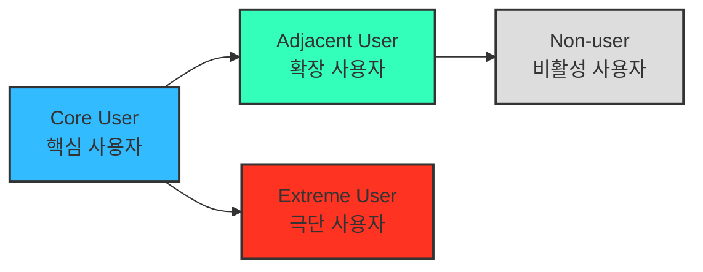

# 05 - 페르소나, 페르소나 스펙트럼, 고객 여정지도

> 본 챕터는 선행 분석인 **챕터 04 TAM-SAM-SOM 및 Market Segment Map**을 입력으로 사용한다. 시장 세그먼트가 정리되지 않은 상태에서 페르소나를 먼저 만들면 근거 없는 인물 설정이 될 수 있으므로, 선행 시장 구조를 먼저 고정한다.
>
> 📥 **원문 적용 상태.** 강의 자료의 절 번호와 흐름을 유지한다. 현재 본 프로젝트에서 직접 적용하는 원문은 **§2 페르소나 스펙트럼**이며, §1 페르소나와 §3 고객 여정지도는 별도 원문이 확보되면 같은 번호 자리에 추가한다.
>
> * §1 페르소나 — 본 프로젝트의 일반 페르소나는 챕터 04 Market Segment와 기존 일반 Persona 문서에서 도출한다.
> * §3 고객 여정지도 — Persona Spectrum의 대표 Persona가 확정된 뒤 작성한다.
>
> ⚠️ 강의 자료에 아직 없는 별도 `결과물 포맷 규격` 절은 임의로 추가하지 않는다.

---

## 2. 페르소나 스펙트럼 (Persona Spectrum)

> 서비스를 둘러싼 여러 사용자 유형과 그 차이를 넓게 탐색하고, 일반 사용자뿐 아니라 극단적·비전형적 사용자까지 포함해 사용 맥락의 다양성과 포용성을 확인하는 방법이다.

### 페르소나 스펙트럼 유형별 설명

| 구분 | 설명 | 목적 | 생성 포인트 |
|---|---|---|---|
| 핵심(Core) | 서비스와 가장 직접적으로 연결되는 주요 고객군 | 주력 타깃 설정 | 매출·사용 빈도 및 핵심 행동 중심 |
| 확장(Adjacent) | 핵심 사용자와 유사한 문제를 다른 환경에서 겪는 인접군 | 확장 기회 탐색 | 유사 니즈 / 다른 맥락 |
| 극단(Extreme) | 제약이나 실패 가능성이 특히 큰 사용자 | 제품 개선 및 포용적 설계 | 실패·불편·대안 사용 중심 |
| 비활성(Non-user) | 아직 사용하지 않거나, 사용 의향이 있어도 접근하기 어려운 집단 | 진입 장벽과 거부 요인 파악 | 인식·가치·신뢰·접근 제약 중심 |

### 페르소나 스펙트럼 도출 핵심 질문

* **확장(Adjacent)** — “핵심 사용자와 비슷한 문제를 다른 맥락에서 겪는 사람은 누구인가?”
* **비활성(Non-user)** — “이 제품·서비스를 사용하지 않거나 사용할 수 없는 사람은 누구인가?”
* **극단(Extreme)** — “가장 큰 제약이나 실패를 경험하는 사람은 누구인가?”

> 💡 **AI 활용 방향:** AI는 사용자 가능성을 빠르게 넓히는 발산 도구로 사용한다. 다만 생성된 세부 문제·감정·대체 솔루션은 인터뷰나 추가 리서치 전까지 **가설**로 취급하고, 선행 분석의 확인된 사실과 구분한다.

### ⚙️ AI 기반 다중 페르소나 생성 및 평가 워크플로우

| 단계 | 목적 | AI 프롬프트 예시 | 산출물 |
|---|---|---|---|
| ① 1차 생성 (Divergent Thinking) | 각 스펙트럼 유형의 후보를 넓게 생성 | “핵심 사용자 5명, 확장 사용자 3명, 극단 사용자 2명, 비활성 사용자 2명을 만들어줘. 각자는 이름, 직무, 문제, 목표, 감정, 대체 솔루션을 포함해.” | 총 10~12개 페르소나 원본 |
| ② 2차 평가 (Convergent Filtering) | 생성 후보를 평가하고 대표를 선별 | “각 페르소나를 문제·행동·맥락의 현실성 기준으로 평가해 유형별 상위 1명씩 추천해줘.” | Core·Adjacent·Extreme·Non-user 대표 4종 |
| ③ 3차 보정 (Contextual Rewriting) | 사업 주제에 맞게 언어와 상황을 정교화 | “우리 서비스 맥락에 맞춰 다시 기술해줘.” | 실제 적용 가능한 4종 페르소나 카드 |
| ④ 4차 검증 (AI Peer Review) | 다중 관점으로 현실성과 근거 검토 | “이 4명의 페르소나가 실제 시장에 존재할 가능성과 근거 수준을 설명해줘.” | 검증 코멘트 요약 리포트 |
| ⑤ 5차 통합 (Spectrum Map) | 페르소나 간 관계를 구조화 | Mermaid / Figma로 시각화 | Persona Spectrum Map 완성 |
