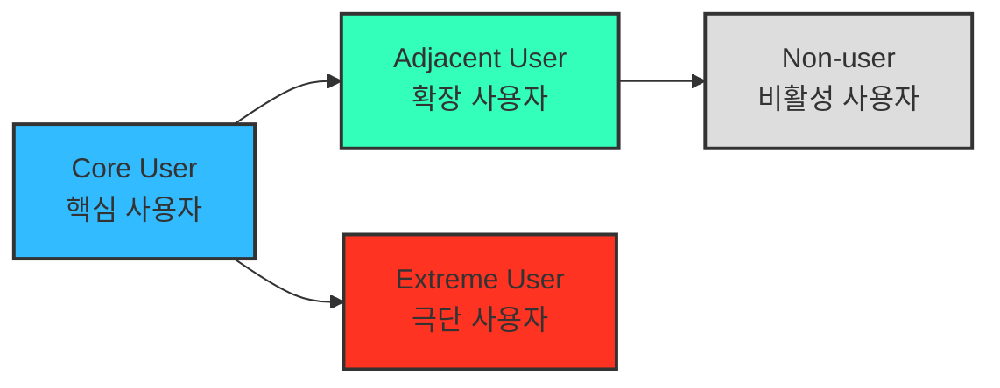

# 05 - 페르소나, 페르소나 스펙트럼, 고객 여정지도

> 본 챕터는 선행 분석인 **챕터 04 TAM-SAM-SOM 및 Market Segment Map**을 입력으로 사용한다. 시장 세그먼트가 정리되지 않은 상태에서 페르소나를 먼저 만들면 근거 없는 인물 설정이 될 수 있으므로, 선행 시장 구조를 먼저 고정한다.
>
> 📥 **원문 적용 상태.** 강의 자료의 절 번호와 흐름을 유지한다. **§2 페르소나 스펙트럼 · §3 고객 여정지도** 원문이 반입되었고, **§1 페르소나** 원문만 남았다.
>
> * **§1 페르소나** — 원문 미반입. 본 프로젝트의 일반 페르소나는 챕터 04 Market Segment와 기존 일반 Persona 문서에서 도출한다. 원문 반입 시 산출물과 대조해 어긋나는 부분을 조정한다.
> * **§3 고객 여정지도** — 원문 반입 완료(아래 절 참조).
>
> ⚠️ 강의 자료에 아직 없는 별도 `결과물 포맷 규격` 절은 임의로 추가하지 않는다. 세 절의 원문이 모두 갖춰진 뒤 붙인다.

---

## 2. 페르소나 스펙트럼 (Persona Spectrum)

> 서비스를 둘러싼 여러 사용자 유형과 그 차이를 넓게 탐색하고, 일반 사용자뿐 아니라 극단적·비전형적 사용자까지 포함해 사용 맥락의 다양성과 포용성을 확인하는 방법이다.

### 페르소나 스펙트럼 유형별 설명

| 구분 | 설명 | 목적 | 생성 포인트 |
|---|---|---|---|
| 핵심(Core) | 서비스와 가장 직접적으로 연결되는 주요 고객군 | 주력 타깃 설정 | 매출·사용 빈도 및 핵심 행동 중심 |
| 확장(Adjacent) | 핵심 사용자와 유사한 문제를 다른 환경에서 겪는 인접군 | 확장 기회 탐색 | 유사 니즈 / 다른 맥락 |
| 극단(Extreme) | 제약이나 실패 가능성이 특히 큰 사용자 | 제품 개선 및 포용적 설계 | 실패·불편·대안 사용 중심 |
| 비활성(Non-user) | 아직 사용하지 않거나, 사용 의향이 있어도 접근하기 어려운 집단 | 진입 장벽과 거부 요인 파악 | 인식·가치·신뢰·접근 제약 중심 |

### 페르소나 스펙트럼 도출 핵심 질문

* **확장(Adjacent)** — “핵심 사용자와 비슷한 문제를 다른 맥락에서 겪는 사람은 누구인가?”
* **비활성(Non-user)** — “이 제품·서비스를 사용하지 않거나 사용할 수 없는 사람은 누구인가?”
* **극단(Extreme)** — “가장 큰 제약이나 실패를 경험하는 사람은 누구인가?”

> 💡 **AI 활용 방향:** AI는 사용자 가능성을 빠르게 넓히는 발산 도구로 사용한다. 다만 생성된 세부 문제·감정·대체 솔루션은 인터뷰나 추가 리서치 전까지 **가설**로 취급하고, 선행 분석의 확인된 사실과 구분한다.

### ⚙️ AI 기반 다중 페르소나 생성 및 평가 워크플로우

| 단계 | 목적 | AI 프롬프트 예시 | 산출물 |
|---|---|---|---|
| ① 1차 생성 (Divergent Thinking) | 각 스펙트럼 유형의 후보를 넓게 생성 | “핵심 사용자 5명, 확장 사용자 3명, 극단 사용자 2명, 비활성 사용자 2명을 만들어줘. 각자는 이름, 직무, 문제, 목표, 감정, 대체 솔루션을 포함해.” | 총 10~12개 페르소나 원본 |
| ② 2차 평가 (Convergent Filtering) | 생성 후보를 평가하고 대표를 선별 | “각 페르소나를 문제·행동·맥락의 현실성 기준으로 평가해 유형별 상위 1명씩 추천해줘.” | Core·Adjacent·Extreme·Non-user 대표 4종 |
| ③ 3차 보정 (Contextual Rewriting) | 사업 주제에 맞게 언어와 상황을 정교화 | “우리 서비스 맥락에 맞춰 다시 기술해줘.” | 실제 적용 가능한 4종 페르소나 카드 |
| ④ 4차 검증 (AI Peer Review) | 다중 관점으로 현실성과 근거 검토 | “이 4명의 페르소나가 실제 시장에 존재할 가능성과 근거 수준을 설명해줘.” | 검증 코멘트 요약 리포트 |
| ⑤ 5차 통합 (Spectrum Map) | 페르소나 간 관계를 구조화 | Mermaid / Figma로 시각화 | Persona Spectrum Map 완성 |

---

## 3. 고객 여정지도 (Customer Journey Map, CJM)

> 고객이 "문제를 인식 → 해결을 탐색 → 구매/사용 → 평가/유지"와 같은 과정에서 겪는
> 경험, 감정, Pain Point를 시각화한 흐름도.

> ❓ **고객 여정의 단계를 정의하는 방법** → <https://www.ibm.com/kr-ko/think/topics/customer-journey-map>

> 💡 ***비즈니스 유형별로 `매우 다른` 맞춤형 고객 여정지도가 도출될 수 있음!***
>
> 잘 만들어진 고객 여정지도는 **내 서비스에 대해 고객의 생각과 행동 반경을 잘 담고 있는 체계적인 분석도구**다.
>
> - **가구 시장에 대한 CJM** → "`실측`" & "`조립/설치`"
> - **자동차 시장에 대한 CJM** → "`비교`" & "`시승`" & "`협상`"

> ***"예쁘면 다 좋은 게 아니라, 지식으로서 가치있는 부분을 가독성 높고 재사용하기 쉽게 추출하기"***

| **단계** | 고객 행동 | 고객 생각 | 감정 | Pain Point | 개선 기회 |
| --- | --- | --- | --- | --- | --- |
| **문제 인식** | 불편함을 느낌 | "이 문제 왜 생기는 거지?" | 불안 | 정보 부족 | 문제 원인 콘텐츠 제공 |
| **탐색** | 대안을 찾음 | "이건 괜찮아 보이는데?" | 기대 | 복잡한 비교 | 비교 툴 제공 |
| **의사결정** | 선택 고민 | "이걸 사도 될까?" | 불안 | 신뢰 부족 | 후기·데모 제공 |
| **사용** | 실제 사용 | "생각보다 어렵네" | 실망 | UX 미흡 | 온보딩 개선 |
| **유지** | 반복 사용 | "이제 익숙해졌네" | 안정 | 가치 감소 | 리텐션 캠페인 |

---

> ## ⚠️ 경고 — 위 5단계는 예시일 뿐, 단계는 매번 새로 정의한다
>
> **고객 여정지도는 항상 같은 단계로 찍어내는 산출물이 아니다.** 위 표의 `문제 인식 → 탐색 → 의사결정 → 사용 → 유지`는 **일반형 예시**이며, 이 다섯 칸을 그대로 가져다 채우는 순간 그 문서는 분석이 아니라 템플릿 작성이 된다.
>
> **단계는 서비스의 특성에서 도출한다.** 이 절이 가구와 자동차를 나란히 든 이유가 그것이다.
>
> | 시장 | 그 시장에서만 나타나는 결정적 단계 | 일반형 5단계에 없는 것 |
> |---|---|---|
> | 가구 | **실측** · **조립/설치** | 구매 후에 더 큰 관문이 있다 |
> | 자동차 | **비교** · **시승** · **협상** | 탐색과 결정 사이가 세 단계로 갈라진다 |
>
> **분석을 시작하기 전에 반드시 물어야 할 것.**
>
> 1. 이 서비스에서 고객이 **실제로 통과하는 관문**은 무엇인가 — 남들이 쓰는 단계 이름이 아니라, 이 서비스에서만 생기는 관문
> 2. 그 관문 중 **고객이 가장 많이 이탈하는 곳**은 어디인가
> 3. 구매·결제 **이후에** 더 큰 관문이 있는가 (가구의 조립·설치처럼)
> 4. **페르소나마다 여정이 갈라지는가** — 갈라진다면 지도를 나눠 그린다
>
> **단계 이름이 서비스와 무관하게 읽힌다면 그 CJM은 잘못 그려진 것이다.** *"탐색"*이라고만 쓰지 말고 그 서비스에서 탐색이 실제로 무엇인지를 단계 이름에 담는다.
