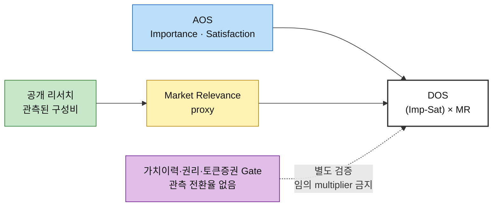
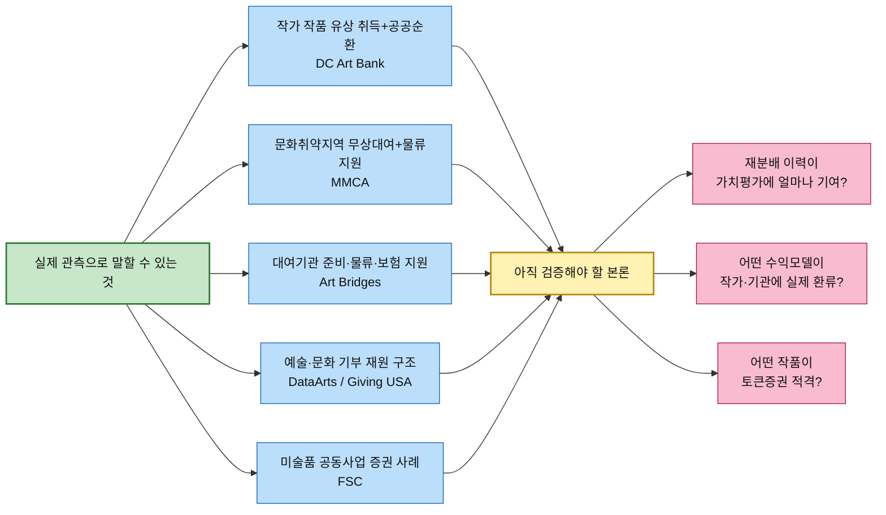

# 시장 가중형 기회점수(DOS) 분석 ③ — 예술품 재분배 플랫폼

> [분석 방법론 §4](./분석-방법론.md) · 입력 [AOS 분석 ③](./분석-03-예술품-재분배-플랫폼.md) · [평가 대상 36개](./평가대상-03-대표-페인포인트.md) · 모수 근거 [챕터 04 TAM-SAM-SOM](../04-tam-sam-som/분석-03-예술품-재분배-플랫폼.md)

> 📊 **산출 원칙.** **DOS = (Importance − Satisfaction) × Market Relevance** 를 사용하되, 이 파일은 **공개된 관측자료에서 실제 구성비를 계산할 수 있는 Persona에만 숫자를 준다.** 공개자료가 선행사례의 존재만 보여주고 시장 구성비를 주지 않으면 `미산출`로 남긴다.
>
> 🎯 **본론 고정.** 실제 리서치도 `토큰증권 ↔ 재분배` 선순환을 검증하는 방향으로 읽는다. 미술품을 공공·문화취약 공간으로 순환시키는 운영, 작가에게 경제적 대가를 주며 작품을 공공공간에 순환시키는 사례, 예술·문화 기부재원, 문화예술교육의 효과, 미술품 기반 투자계약증권 사례가 각각 실제로 존재하는지 확인한다. 단, 이것들이 **하나의 동일 시장비중 데이터셋**이라는 뜻은 아니다.
>
> ⚠️ **이 문서의 DOS는 ‘실측 시장점유율 DOS’가 아니라 `리서치 근거형 proxy DOS`다.** DataArts·DC Art Bank·국립현대미술관 나눔미술은행의 실제 관측 구성비를 쓰지만 **분모가 서로 다르다.** 따라서 공급 proxy 0.980과 수요 proxy 0.400, Funding proxy 0.195를 한 줄에서 절대적인 1~33위 시장점유율처럼 비교하면 안 된다.

---

## 0. Market Relevance 정의

### 모수를 SAM으로 잡고 SOM을 병기하는 이유

| 모수 | 판정 | 사유 |
|---|:---:|---|
| **TAM** — 미국 Arts, Culture & Humanities 기부 **273.1억 달러(2025)** | ❌ Pain별 MR 직접 계산에는 사용하지 않음 | Giving USA 2026의 상위 Funding 시장 앵커다. 공급자·수요기관·가치이력·토큰증권 적격 작품 비중으로 분해되지 않는다 |
| **SAM** — 챕터 04 **712.5만 달러/년** | ✅ **확장성 기준** | 서비스 가능 범위를 잡는 모델이지만 Persona별 구성비는 별도 관측자료가 필요하다 |
| **SOM** — 챕터 04 기본 **37.5만 달러/년** | ✅ **초기 실행 기준** | 초기 유사 프로그램에서 실제로 `누가 공급·수령·Funding하는지`에 가까운 proxy를 일부 확보할 수 있다 |

> 📌 Giving USA 2026은 미국의 2025년 Arts, Culture & Humanities 기부를 **$27.31B**로 추정한다. 이는 이 사업의 기부 가능성에 대한 상위 시장 근거이지, “예술품 재분배 산업 자체가 $27.31B”라는 뜻은 아니다.  
> 출처: [Giving USA 2026](https://givingusa.org/giving-usa-charitable-giving-rose-to-617-20-billion-in-2025-surpassing-the-600-billion-mark-for-the-first-time/)

### 시장 좌표가 아니라 관측 구성비로 환산한다

챕터 04의 `공급 여력 × 예술품 필요도` 0~1 좌표는 **우선순위 좌표**이지 실제 시장점유율이 아니다. 따라서 이번 리서치 근거형 DOS에서는 `미술관 x=0.89 → MR 0.89` 같은 변환을 하지 않는다.

이번에 MR 숫자로 직접 쓴 관측 proxy는 세 종류다.

1. **Funding 구성비** — SMU DataArts 2024 예술·문화 비영리조직의 contributed revenue source 평균
2. **초기 작가 공급 proxy** — DC Art Bank FY2025~FY2026 개인 작가 vs 조직 award-dollar 실제 배분
3. **초기 수요기관 proxy** — MMCA 2023 나눔미술은행 실제 선정 10개 기관의 기능별 구성

그리고 숫자로 MR을 만들지 않고 **사업 본론을 검증하는 방향 근거**로 네 종류를 추가 확인한다.

- DC Art Bank: 작가 작품을 **유상 취득**하고 공공기관에 대여 → `작가 경제적 대가 + 작품 순환`이 함께 존재 가능
- MMCA/Art Bridges: 무상대여와 운송·보험·설치/전시 지원 → 문화접근성과 실물 이동이 실제 운영문제
- UNESCO: 문화예술교육과 창의성·비판적 사고·문화적 이해의 연결
- 금융위원회: 미술품 전시·거래 공동사업 기반 투자계약증권 발행 사례와 토큰증권 제도화 → `미술품과 증권`의 연결 자체는 현실에 존재하나 재분배 작품의 자동 토큰화 근거는 없음

### MR 부여 규칙 세 가지

| # | 규칙 | 이유 |
|---|---|---|
| **1** | **관측된 구성비가 있을 때만 숫자를 준다** | “이런 사업이 실제 있다”와 “이 Persona가 시장의 몇 %다”는 전혀 다른 주장이다 |
| **2** | **서로 다른 시장 면의 합계를 하나의 100%로 합치지 않는다** | 한 프로젝트는 동시에 `작가 공급 + 학교/복지 수요 + 개인/기업 Funding`일 수 있다. 공급·수요·Funding의 원자료 분모도 다르다 |
| **3** | **proxy의 분모를 반드시 표기하고 토큰증권 전환율을 만들지 않는다** | DC 98.0%는 DC Art Bank award-dollar 중 개인작가 비중, MMCA 50%는 10개 선정기관 중 문화기반·전시기관 비중이다. `재분배 작품→토큰증권 적격률`은 관측값이 없어 미산출 |

### 자금원 구성비 — 층마다 다르다

**A. Funding — SMU DataArts 2024 실제 관측값**

SMU DataArts `National Trends 2025`는 미국 전역 **6,500개 이상** 예술·문화 조직 데이터를 사용하고, 2024년 unrestricted contributed revenue의 평균을 재원별로 공개한다.

| 재원 | 전체 예술·문화 조직 평균 | 5개 재원 내 비중 | 소규모 조직(<$250k) 평균 | 소규모 5개 재원 내 비중 |
|---|---:|:---:|---:|:---:|
| Trustee | $94,914 | 8.2% | $7,700 | 6.5% |
| **Individual** | **$227,322** | **19.6%** | **$23,207** | **19.5%** |
| **Corporate** | **$41,665** | **3.6%** | **$8,495** | **7.2%** |
| Foundation | $563,173 | 48.5% | $50,890 | 42.9% |
| Government | $233,689 | 20.1% | $28,451 | 24.0% |

**적용** — 정민준=Individual, 최은영=Corporate. 전체 조직 비중을 **SAM Funding proxy**, 소규모 조직 비중을 초기 단계에 가까운 **SOM Funding proxy**로 쓴다.  
출처: [SMU DataArts National Trends 2025](https://www.culturaldata.org/national-trends/national-trends-2025/) · [Data Tables](https://www.culturaldata.org/national-trends/national-trends-2025/data-tables/)

> ⚠️ DataArts는 **우리 플랫폼 기부금 구성비가 아니다.** 미국 비영리 예술·문화 조직 sector proxy다.

**B. 초기 공급 — DC Art Bank FY2025~FY2026**

DC Art Bank는 지역 시각예술가·갤러리·비영리 예술단체를 지원하고 작품을 취득해 DC 정부기관 공공공간에 대여한다. FY2026 공식 페이지는 컬렉션이 **약 3,000점**이라고 설명한다.

| 구분 | FY2025 | FY2026 | 2개년 합 | 2개년 비중 |
|---|---:|---:|---:|:---:|
| **개인 작가** | $373,667 | $373,530 | **$747,197** | **98.0%** |
| 조직 | $10,400 | $4,675 | **$15,075** | 2.0% |

**적용** — 이 98.0%를 김서윤·임하늘의 **SOM 공급 proxy**로만 쓴다.  
출처: [DC Art Bank FY2026](https://dcarts.dc.gov/public-art/fy-2026-grantees-art-bank-program-abp)

> ⚠️ **98.0%는 전체 예술품 재분배 공급시장의 작가 점유율이 아니다.** 해당 2개 연도 DC Art Bank award-dollar에서 개인 작가에게 지급된 몫이다.
>
> 📌 하지만 사용자 본론의 `작가도 경제적 가치를 얻으면서 작품이 사회에 순환할 수 있다`는 방향에는 실제 선행근거가 된다. CAH는 작가에게 작품 취득대금을 지급하고, 취득된 작품을 정부기관에 대여한다. 이것은 우리 플랫폼의 수익모델이 확정됐다는 뜻이 아니라 **경제적 대가와 공공 순환이 양립 가능한 실제 사례**라는 뜻이다.

**C. 초기 수요 — 국립현대미술관 2023 나눔미술은행**

MMCA는 2023년 최종 10개 지역기관에 작품을 무상대여하고 **작품운송료·보험료·전시해설·감상자료**를 지원했다. 공개 명단을 기능별로 재분류하면 `문화기반·전시기관 5`, `학교·특수교육 1`, `복지·사회서비스 4`로 볼 수 있다.

| 수요 유형 | 실제 선정기관 수 | 10개 중 비중 | Persona 매핑 |
|---|:---:|:---:|---|
| **문화기반·전시기관** | 5 | **50%** | 오수진 |
| **학교·특수교육** | 1 | **10%** | 이지현 |
| **복지·사회서비스** | 4 | **40%** | 김도현의 **광의 proxy** |

출처: [MMCA 2023 나눔미술은행](https://www.mmca.go.kr/pr/pressDetail.do?bdCId=202303200008739) · [2024 확대 운영](https://www.mmca.go.kr/pr/newsDetail.do?bdCId=202405310009367)

> ⚠️ 김도현은 문화취약지역 NGO Persona이고 40% 안에는 노인·아동복지·보호시설 등이 섞인다. 따라서 **정확한 NGO 점유율이 아니라 사회서비스/비영리 문화접근 채널의 광의 proxy**다.
>
> 📌 MMCA는 2024년에 지원기관을 **12개**로 확대했고 장애인·노인복지시설, 학교밖청소년센터, 특수학교, 전국문화기반시설·문화재단 등을 대상으로 했다. 이것은 “문화예술을 덜 접하는 지역/집단에 실제 작품을 연결한다”는 사용자 본론의 사회적 방향과 직접 맞닿는다.

**D. 가치평가와 토큰증권 — 방향 근거, MR 숫자로는 사용하지 않음**

정부미술은행 2024 작품 구입 공모는 `서류검토 → 작품가치심사 → 작품가격평가 → 작품구입심의`를 분리하고, 1천만원 이상 응모작에는 유사 거래내역·시가감정서 등 가격근거 자료 제출을 권장한다. 따라서 **활용이력이 생겼다고 자동 가격상승하는 구조는 아니다.**  
출처: [정부미술은행 2024 작품 구입 공모](https://www.artbank.go.kr/home/purchase/pcDetail.do?loc=g32&puId=240423000000422&typeCd=01)

금융위원회는 2026년 미술품 전시·거래 공동사업 기반 **투자계약증권 발행 사례가 존재**한다고 밝히고 있으며, 토큰증권은 분산원장을 이용하는 **증권의 형식**이라고 설명한다. 제도화 법은 **2027-02-04 시행 예정**이고, 기초자산 적격 요건·증권신고서 공시·유통·투자자보호 세부기준이 설계 중이다.  
출처: [금융위원회 2026-01-15](https://www.fsc.go.kr/no010101/86064) · [2026-02-13](https://www.fsc.go.kr/no010101/86295) · [2026-05-15](https://www.fsc.go.kr/no010101/86906)

**따라서 이 리서치 DOS에서의 결론은:**  
`재분배 → 새 활용·향유·교육·사회성과 이력 → 가치 재평가에 참고 가능한 데이터 후보 → 별도 가치평가·권리·증권 Gate → 적격 작품만 토큰증권 연계 검토`다.

### 인물별 Market Relevance

| 인물 | SAM MR | SOM MR | 근거 상태 |
|---|:---:|:---:|---|
| 독립 작가 김서윤 | 미산출 | **0.980** | DC Art Bank 2개년 개인작가 award-dollar — 초기 공급 proxy |
| 신진 작가 임하늘 | 미산출 | **0.980** | 동일 |
| 문화취약지역 학교 담당 이지현 | 미산출 | **0.100** | MMCA 2023 선정기관 구성 |
| 지역 문화시설 담당 오수진 | 미산출 | **0.500** | MMCA 2023 문화기반·전시기관 구성 |
| 문화취약지역 NGO 담당 김도현 | 미산출 | **0.400** | MMCA 2023 복지·사회서비스 구성의 광의 proxy |
| 개인 기부자 정민준 | **0.196** | **0.195** | DataArts 전체 / 소규모 조직 Individual |
| 기업 CSR·ESG 담당 최은영 | **0.036** | **0.072** | DataArts 전체 / 소규모 조직 Corporate |
| 미술관 컬렉션 담당 박소연 | 미산출 | 미산출 | 실제 기관 대여/순환 사례는 있으나 동일 분모 구성비 없음 |
| 미술대학 작품관리 담당 한유진 | 미산출 | 미산출 | 대학 작품 공급 구성비 없음 |
| 갤러리 작품관리 담당 윤태호 | 미산출 | 미산출 | DC의 조직 2%를 상업 갤러리 비중으로 등치할 수 없음 |
| 작품 보유기관 담당 서재원 | 미산출 | 미산출 | 포괄 기관 Gate에 대응하는 관측 비중 없음 |
| 최종 향유 학생 박하린 | *제외* | *제외* | 문화접근·창의교육 Outcome |

> 📌 **미산출은 0이 아니다.** `그 Persona가 시장에 중요하지 않다`가 아니라 **현재 공개자료로 같은 의미의 구성비를 방어할 수 없다**는 뜻이다.

---

## 1. DOS Table — SAM 기준 (확장성)

SAM에서는 동일한 분모로 관측 가능한 **Funding Persona 6개 Pain만 정량화**한다. 나머지는 미산출로 남긴다.

| 순위 | ID | 인물 | Pain Point (요약) | Imp−Sat | MR | **DOS** | 판정 |
|:---:|---|---|---|:---:|:---:|:---:|---|
| 1 | **P27** | 개인 기부자 정민준 | 기부→문화성과→작품 가치이력 연결 부족 | 4 | 0.196 | **0.784** | 관측 proxy 적용 |
| 2 | **P25** | 개인 기부자 정민준 | 기부 비용구성 불투명 | 3 | 0.196 | **0.588** | 관측 proxy 적용 |
| 2 | **P26** | 개인 기부자 정민준 | 이동 중간 신호 부족 | 3 | 0.196 | **0.588** | 관측 proxy 적용 |
| 4 | **P30** | 기업 CSR·ESG 담당 최은영 | CSR 성과·작품 가치이력 분리 | 3 | 0.036 | **0.108** | 관측 proxy 적용 |
| 5 | **P29** | 기업 CSR·ESG 담당 최은영 | 기업 승인용 정산·성과근거 부족 | 2 | 0.036 | **0.072** | 관측 proxy 적용 |
| 6 | **P28** | 기업 CSR·ESG 담당 최은영 | 기업 실사자료 분산 | 1 | 0.036 | **0.036** | 관측 proxy 적용 |
| — | **P01** | 독립 작가 김서윤 | 재분배 후 가치이력 부족 | 2 | 미산출 | 미산출 | 동일 분모의 관측 구성비 없음 |
| — | **P02** | 독립 작가 김서윤 | 매칭 시점 불명확 | 4 | 미산출 | 미산출 | 동일 분모의 관측 구성비 없음 |
| — | **P03** | 독립 작가 김서윤 | 활용·향유 데이터가 가치이력으로 안 남음 | 4 | 미산출 | 미산출 | 동일 분모의 관측 구성비 없음 |
| — | **P04** | 미술관 컬렉션 담당 박소연 | 재분배·후속활용 권리 불명확 | 3 | 미산출 | 미산출 | 동일 분모의 관측 구성비 없음 |
| — | **P05** | 미술관 컬렉션 담당 박소연 | 상태·출처·권리 이력 비표준 | 2 | 미산출 | 미산출 | 동일 분모의 관측 구성비 없음 |
| — | **P06** | 미술관 컬렉션 담당 박소연 | 운송·보험 책임 불명확 | 2 | 미산출 | 미산출 | 동일 분모의 관측 구성비 없음 |
| — | **P07** | 미술대학 작품관리 담당 한유진 | 학생 동의 반복 | 3 | 미산출 | 미산출 | 동일 분모의 관측 구성비 없음 |
| — | **P08** | 미술대학 작품관리 담당 한유진 | 대량 권리·상태 등록 어려움 | 2 | 미산출 | 미산출 | 동일 분모의 관측 구성비 없음 |
| — | **P09** | 미술대학 작품관리 담당 한유진 | 학생 작품 후속수익 권리 불명확 | 2 | 미산출 | 미산출 | 동일 분모의 관측 구성비 없음 |
| — | **P10** | 갤러리 작품관리 담당 윤태호 | 갤러리 재분배·토큰화 권한 불명확 | 2 | 미산출 | 미산출 | 동일 분모의 관측 구성비 없음 |
| — | **P11** | 갤러리 작품관리 담당 윤태호 | 설치 맥락·가치 훼손 우려 | 2 | 미산출 | 미산출 | 동일 분모의 관측 구성비 없음 |
| — | **P12** | 갤러리 작품관리 담당 윤태호 | 작가·갤러리 후속수익 배분 없음 | 2 | 미산출 | 미산출 | 동일 분모의 관측 구성비 없음 |
| — | **P13** | 신진 작가 임하늘 | 보관→창작공간 압박 | 3 | 미산출 | 미산출 | 동일 분모의 관측 구성비 없음 |
| — | **P14** | 신진 작가 임하늘 | 폐기 전 매칭기한 불명확 | 4 | 미산출 | 미산출 | 동일 분모의 관측 구성비 없음 |
| — | **P15** | 신진 작가 임하늘 | 포장·픽업 부담 대비 가치기회 불명확 | 2 | 미산출 | 미산출 | 동일 분모의 관측 구성비 없음 |
| — | **P16** | 문화취약지역 학교 담당 이지현 | 학교 공간·관리조건 판단 | 3 | 미산출 | 미산출 | 동일 분모의 관측 구성비 없음 |
| — | **P17** | 문화취약지역 학교 담당 이지현 | 수령·설치 역할 불명확 | 2 | 미산출 | 미산출 | 동일 분모의 관측 구성비 없음 |
| — | **P18** | 문화취약지역 학교 담당 이지현 | 실제 작품의 창의교육 연결 부족 | 3 | 미산출 | 미산출 | 동일 분모의 관측 구성비 없음 |
| — | **P19** | 지역 문화시설 담당 오수진 | 지속 작품 공급망 부족 | 3 | 미산출 | 미산출 | 동일 분모의 관측 구성비 없음 |
| — | **P20** | 지역 문화시설 담당 오수진 | 관리 난이도 판단 어려움 | 1 | 미산출 | 미산출 | 동일 분모의 관측 구성비 없음 |
| — | **P21** | 지역 문화시설 담당 오수진 | 지역성과·작품 활용이력 미기록 | 2 | 미산출 | 미산출 | 동일 분모의 관측 구성비 없음 |
| — | **P22** | 문화취약지역 NGO 담당 김도현 | 문화취약지역 공급망 부재 | 3 | 미산출 | 미산출 | 동일 분모의 관측 구성비 없음 |
| — | **P23** | 문화취약지역 NGO 담당 김도현 | 작품 매칭·비용조성 분리 | 4 | 미산출 | 미산출 | 동일 분모의 관측 구성비 없음 |
| — | **P24** | 문화취약지역 NGO 담당 김도현 | 현장 향유·가치이력 기록 단절 | 3 | 미산출 | 미산출 | 동일 분모의 관측 구성비 없음 |
| — | **P31** | 작품 보유기관 담당 서재원 | 복잡한 참여조건 때문에 기존보관 선택 | -1 | 미산출 | 미산출 | 동일 분모의 관측 구성비 없음 |
| — | **P32** | 작품 보유기관 담당 서재원 | 기관 권리·책임·상업활용 경계 불명확 | 2 | 미산출 | 미산출 | 동일 분모의 관측 구성비 없음 |
| — | **P33** | 작품 보유기관 담당 서재원 | 후속 수익 회계·배분 기준 없음 | 3 | 미산출 | 미산출 | 동일 분모의 관측 구성비 없음 |

**SAM Funding proxy 내부에서는** P27 `기부→문화성과→작품 가치이력 연결`이 **0.784**로 가장 높다. 이는 사용자 본론에서 개인 기부가 단순 비용기부로 끝나지 않고 **아이/기관의 문화경험과 작품의 새 가치이력에 동시에 연결돼야 한다**는 가설과 맞는다.

> ⚠️ 그러나 SAM 공급·수요 Persona가 미산출이므로 이 표를 “전체 33개 중 P27이 확정 1위”라고 부르면 안 된다.

---

## 2. DOS Table — SOM 기준 (1년차 실행)

SOM에서는 DC Art Bank 공급 proxy, MMCA 수요 proxy, DataArts 소규모 Funding proxy를 각각 적용한다.

| 순위 | ID | 인물 | Pain Point (요약) | Imp−Sat | MR | **DOS** | 판정 |
|:---:|---|---|---|:---:|:---:|:---:|---|
| 1 | **P02** | 독립 작가 김서윤 | 매칭 시점 불명확 | 4 | 0.980 | **3.920** | 관측 proxy 적용 |
| 1 | **P03** | 독립 작가 김서윤 | 활용·향유 데이터가 가치이력으로 안 남음 | 4 | 0.980 | **3.920** | 관측 proxy 적용 |
| 1 | **P14** | 신진 작가 임하늘 | 폐기 전 매칭기한 불명확 | 4 | 0.980 | **3.920** | 관측 proxy 적용 |
| 4 | **P13** | 신진 작가 임하늘 | 보관→창작공간 압박 | 3 | 0.980 | **2.940** | 관측 proxy 적용 |
| 5 | **P01** | 독립 작가 김서윤 | 재분배 후 가치이력 부족 | 2 | 0.980 | **1.960** | 관측 proxy 적용 |
| 5 | **P15** | 신진 작가 임하늘 | 포장·픽업 부담 대비 가치기회 불명확 | 2 | 0.980 | **1.960** | 관측 proxy 적용 |
| 7 | **P23** | 문화취약지역 NGO 담당 김도현 | 작품 매칭·비용조성 분리 | 4 | 0.400 | **1.600** | 관측 proxy 적용 |
| 8 | **P19** | 지역 문화시설 담당 오수진 | 지속 작품 공급망 부족 | 3 | 0.500 | **1.500** | 관측 proxy 적용 |
| 9 | **P22** | 문화취약지역 NGO 담당 김도현 | 문화취약지역 공급망 부재 | 3 | 0.400 | **1.200** | 관측 proxy 적용 |
| 9 | **P24** | 문화취약지역 NGO 담당 김도현 | 현장 향유·가치이력 기록 단절 | 3 | 0.400 | **1.200** | 관측 proxy 적용 |
| 11 | **P21** | 지역 문화시설 담당 오수진 | 지역성과·작품 활용이력 미기록 | 2 | 0.500 | **1.000** | 관측 proxy 적용 |
| 12 | **P27** | 개인 기부자 정민준 | 기부→문화성과→작품 가치이력 연결 부족 | 4 | 0.195 | **0.780** | 관측 proxy 적용 |
| 13 | **P25** | 개인 기부자 정민준 | 기부 비용구성 불투명 | 3 | 0.195 | **0.585** | 관측 proxy 적용 |
| 13 | **P26** | 개인 기부자 정민준 | 이동 중간 신호 부족 | 3 | 0.195 | **0.585** | 관측 proxy 적용 |
| 15 | **P20** | 지역 문화시설 담당 오수진 | 관리 난이도 판단 어려움 | 1 | 0.500 | **0.500** | 관측 proxy 적용 |
| 16 | **P16** | 문화취약지역 학교 담당 이지현 | 학교 공간·관리조건 판단 | 3 | 0.100 | **0.300** | 관측 proxy 적용 |
| 16 | **P18** | 문화취약지역 학교 담당 이지현 | 실제 작품의 창의교육 연결 부족 | 3 | 0.100 | **0.300** | 관측 proxy 적용 |
| 18 | **P30** | 기업 CSR·ESG 담당 최은영 | CSR 성과·작품 가치이력 분리 | 3 | 0.072 | **0.216** | 관측 proxy 적용 |
| 19 | **P17** | 문화취약지역 학교 담당 이지현 | 수령·설치 역할 불명확 | 2 | 0.100 | **0.200** | 관측 proxy 적용 |
| 20 | **P29** | 기업 CSR·ESG 담당 최은영 | 기업 승인용 정산·성과근거 부족 | 2 | 0.072 | **0.144** | 관측 proxy 적용 |
| 21 | **P28** | 기업 CSR·ESG 담당 최은영 | 기업 실사자료 분산 | 1 | 0.072 | **0.072** | 관측 proxy 적용 |
| — | **P04** | 미술관 컬렉션 담당 박소연 | 재분배·후속활용 권리 불명확 | 3 | 미산출 | 미산출 | 동일 분모의 관측 구성비 없음 |
| — | **P05** | 미술관 컬렉션 담당 박소연 | 상태·출처·권리 이력 비표준 | 2 | 미산출 | 미산출 | 동일 분모의 관측 구성비 없음 |
| — | **P06** | 미술관 컬렉션 담당 박소연 | 운송·보험 책임 불명확 | 2 | 미산출 | 미산출 | 동일 분모의 관측 구성비 없음 |
| — | **P07** | 미술대학 작품관리 담당 한유진 | 학생 동의 반복 | 3 | 미산출 | 미산출 | 동일 분모의 관측 구성비 없음 |
| — | **P08** | 미술대학 작품관리 담당 한유진 | 대량 권리·상태 등록 어려움 | 2 | 미산출 | 미산출 | 동일 분모의 관측 구성비 없음 |
| — | **P09** | 미술대학 작품관리 담당 한유진 | 학생 작품 후속수익 권리 불명확 | 2 | 미산출 | 미산출 | 동일 분모의 관측 구성비 없음 |
| — | **P10** | 갤러리 작품관리 담당 윤태호 | 갤러리 재분배·토큰화 권한 불명확 | 2 | 미산출 | 미산출 | 동일 분모의 관측 구성비 없음 |
| — | **P11** | 갤러리 작품관리 담당 윤태호 | 설치 맥락·가치 훼손 우려 | 2 | 미산출 | 미산출 | 동일 분모의 관측 구성비 없음 |
| — | **P12** | 갤러리 작품관리 담당 윤태호 | 작가·갤러리 후속수익 배분 없음 | 2 | 미산출 | 미산출 | 동일 분모의 관측 구성비 없음 |
| — | **P31** | 작품 보유기관 담당 서재원 | 복잡한 참여조건 때문에 기존보관 선택 | -1 | 미산출 | 미산출 | 동일 분모의 관측 구성비 없음 |
| — | **P32** | 작품 보유기관 담당 서재원 | 기관 권리·책임·상업활용 경계 불명확 | 2 | 미산출 | 미산출 | 동일 분모의 관측 구성비 없음 |
| — | **P33** | 작품 보유기관 담당 서재원 | 후속 수익 회계·배분 기준 없음 | 3 | 미산출 | 미산출 | 동일 분모의 관측 구성비 없음 |

**관측 proxy에서 보이는 방향**

- 작가 공급 proxy 안에서는 **P02·P03·P14 = 3.920**, P13=2.940이 높다. 즉 폐기 전 매칭과 **재분배 후 가치이력**이 작가측 핵심 가설로 남는다.
- MMCA 수요 proxy 안에서는 문화시설 오수진 P19=1.500, NGO 광의 proxy 김도현 P23=1.600, P22/P24=1.200이 눈에 띈다.
- Funding proxy 안에서는 정민준 P27=0.780, P25/P26=0.585가 높다.

> ⚠️ **3.920 > 1.600이라고 해서 작가 Pain이 NGO Pain보다 실제 시장에서 2.45배 중요하다는 뜻은 아니다.** 전자는 DC award-dollar, 후자는 MMCA 기관 수라는 다른 분모다. 이 파일은 **각 면에서 실제 관측된 방향을 확인하는 보조 DOS**다.

---

## 3. 두 순위 대조

### 상위 10 나란히 보기

| 순위 | **SAM — Funding proxy만 정량** | DOS | **SOM — 공급/수요/Funding proxy** | DOS |
|:---:|---|:---:|---|:---:|
| 1 | P27 기부→문화성과→작품 가치이력 연결 부족 | 0.784 | P02 매칭 시점 불명확 | 3.920 |
| 2 | P25 기부 비용구성 불투명 | 0.588 | P03 활용·향유 데이터가 가치이력으로 안 남음 | 3.920 |
| 3 | P26 이동 중간 신호 부족 | 0.588 | P14 폐기 전 매칭기한 불명확 | 3.920 |
| 4 | P30 CSR 성과·작품 가치이력 분리 | 0.108 | P13 보관→창작공간 압박 | 2.940 |
| 5 | P29 기업 승인용 정산·성과근거 부족 | 0.072 | P01 재분배 후 가치이력 부족 | 1.960 |
| 6 | P28 기업 실사자료 분산 | 0.036 | P15 포장·픽업 부담 대비 가치기회 불명확 | 1.960 |
| 7 | — | — | P23 작품 매칭·비용조성 분리 | 1.600 |
| 8 | — | — | P19 지속 작품 공급망 부족 | 1.500 |
| 9 | — | — | P22 문화취약지역 공급망 부재 | 1.200 |
| 10 | — | — | P24 현장 향유·가치이력 기록 단절 | 1.200 |

이 표에서 가장 먼저 읽어야 할 것은 **순위가 아니라 ‘정량 가능한 면이 달라졌다’는 사실**이다.

- SAM은 DataArts를 통해 Funding 면만 같은 방식으로 방어할 수 있다.
- SOM은 실제 유사프로그램을 통해 공급·수요·Funding의 초기 proxy를 일부 얻는다.
- 가치이력→가치평가→토큰증권 전환은 **전환율 데이터가 없어 MR로 정량화하지 않는다.**

### 이동 폭이 큰 항목

이 파일에서는 서로 다른 분모를 가진 값을 이용해 `SAM 18위 → SOM 3위` 같은 **통합 이동폭을 계산하지 않는다.** 대신 같은 Persona/시장 면 안에서 변화를 읽는다.

| 시장 면 | SAM 관측 | SOM 관측 | 해석 |
|---|---|---|---|
| **개인 Funding** | Individual 19.6% | 소규모 조직 Individual 19.5% | DataArts 안에서는 두 층이 거의 비슷해 P25~P27의 상대 구조가 안정적 |
| **기업 Funding** | Corporate 3.6% | 소규모 조직 Corporate 7.2% | 소규모 조직 표본에서는 기업 재원 비중이 상대적으로 높지만, 우리 플랫폼의 기업기부 포착률을 뜻하지 않음 |
| **작가 공급** | 미산출 | DC proxy 98.0% | 초기 작가 중심 순환 선행모델이 실제 존재한다는 방향 근거 |
| **문화취약 수요** | 미산출 | MMCA 학교 10% / 광의 사회서비스 40% / 문화시설 50% | 실제 무상대여·문화접근 프로그램에 다양한 수요기관이 존재 |
| **토큰증권 전환** | 미산출 | 미산출 | 재분배 작품의 적격률 데이터 없음. 별도 파일럿·법률/가치평가 검증 필요 |

---

## 4. AOS와 무엇이 달라졌나

AOS에서는 `P02·P03·P14·P23·P27`이 모두 **4.0 공동 1위**였다. 이는 고객 미충족 강도만 본 결과다.

리서치 DOS를 붙이면 두 가지가 달라진다.

1. **숫자를 붙일 수 없는 중요 Pain이 많다는 사실이 드러난다.** 예를 들어 P04 기관 권리 Gate와 P33 기관 후속수익 회계·배분은 본론상 중요하지만, 이를 시장구성비로 바꿀 공개자료가 없어 `미산출`이다.
2. **공개자료가 강한 곳에서는 방향을 확인할 수 있다.** 작가 초기 공급 proxy에서 P03 가치이력이 상위이고, Funding proxy에서 P27이 상위다.

> 📌 이 결과는 “토큰증권을 빼야 한다”는 뜻이 아니다. 오히려 **토큰증권까지 이어지는 핵심 구간의 시장 데이터가 부족하다는 검증과제**를 드러낸다. P03/P27은 가치이력 측면의 초기 데이터 문제, P04/P09/P10/P12/P32/P33은 권리·수익·증권화 Gate 문제다.

---

## 5. 음수·0 항목의 해석

### 음수 0개 — 정량화 구간에서는 없음

이 리서치 proxy에서 실제 숫자가 산출된 Pain은 모두 `Importance − Satisfaction > 0`이라 **음수 DOS가 없다.**

P31은 `Imp−Sat = −1`이지만 서재원 MR을 실제 관측 구성비로 산출하지 않았으므로 **DOS도 미산출**이다. 이를 임의로 0이나 음수 시장점수로 만들지 않는다.

### 0인 항목 — 0·미산출·제외를 분리한다

| 상태 | 의미 | 이번 문서 |
|---|---|---|
| **0** | MR=0 또는 Imp−Sat=0이 실제로 정의됨 | 정량 구간에는 없음 |
| **미산출** | 시장 구성비를 방어할 공개자료가 없음 | 박소연·한유진·윤태호·서재원 및 SAM의 공급/수요 Persona 등 |
| **제외** | 직접 시장 의사결정이 아니라 Outcome | 박하린 P34·P35·P36 |

> 📌 **가장 위험한 오류는 미산출을 0으로 바꾸는 것**이다. 특히 권리·가치평가·후속 수익·토큰증권 Gate는 데이터가 없다고 가치가 0인 것이 아니다.

---

## 6. 인물 단위 합계

| 인물 | Pain 3개 합 (SAM) | Pain 3개 합 (SOM) |
|---|:---:|:---:|
| 독립 작가 김서윤 | 미산출 | 9.800 |
| 미술관 컬렉션 담당 박소연 | 미산출 | 미산출 |
| 미술대학 작품관리 담당 한유진 | 미산출 | 미산출 |
| 갤러리 작품관리 담당 윤태호 | 미산출 | 미산출 |
| 신진 작가 임하늘 | 미산출 | 8.820 |
| 문화취약지역 학교 담당 이지현 | 미산출 | 0.800 |
| 지역 문화시설 담당 오수진 | 미산출 | 3.000 |
| 문화취약지역 NGO 담당 김도현 | 미산출 | 4.000 |
| 개인 기부자 정민준 | 1.960 | 1.950 |
| 기업 CSR·ESG 담당 최은영 | 0.216 | 0.432 |
| 작품 보유기관 담당 서재원 | 미산출 | 미산출 |

> ⚠️ **이 합계를 서로 다른 Persona끼리 한 줄의 확정 시장순위로 읽지 않는다.** 김서윤 9.800은 DC award-dollar 분모, 김도현 4.000은 MMCA 기관 수 분모다. 같은 시장면/같은 proxy 내부의 우선순위를 확인하는 용도다.
>
> 📌 따라서 강사형 33개 통합순위가 필요하면 `DOS(3)`의 **작업가중치형 모델**을 쓰고, 이 문서는 “그 작업가정이 실제 공개자료와 어디까지 방향이 맞는가”를 점검하는 검증 레이어로 쓴다.

---

## 7. 근거 등급

| 근거 | 등급 | 이번 DOS에서의 역할 |
|---|---|---|
| SMU DataArts 2024 재원별 평균 | **공개 관측** | Individual/Corporate SAM·SOM Funding proxy |
| DC Art Bank FY2025~FY2026 award-dollar | **공개 관측** | 초기 작가 공급 proxy + 작가 유상 취득·공공순환 선행근거 |
| MMCA 2023/2024 나눔미술은행 | **공개 관측** | 초기 수요기관 proxy + 문화취약지역/복지/교육 실제 작품순환 근거 |
| Art Bridges Partner Loan Network | **공개 관측** | 보험·포장·운송·설치·대여기관 지원이 실제 운영요소임을 확인. 시장비중 MR에는 미사용 |
| UNESCO 문화예술교육 Framework | **공개 정책/연구 근거** | 아동·지역의 문화예술 경험을 단순 배송이 아니라 창의·비판적 사고 등 교육성과로 봐야 하는 방향 근거 |
| 정부미술은행 작품 가치·가격 심사 | **공개 절차 근거** | 재분배 이력 ≠ 자동 가격상승. 별도 가치·가격평가 필요 |
| 금융위 미술품 투자계약증권 사례 | **공개 제도/사례** | 미술품과 증권의 연결 가능성 확인 |
| 토큰증권 제도화 법/협의체 | **현재 법·제도 근거** | 토큰증권은 자본시장법상 증권의 형식, 2027-02-04 시행 예정, 기초자산·공시 등 세부기준 설계 |
| `재분배 작품→가격상승률` | **근거 없음** | 주장 금지 |
| `재분배 작품→토큰증권 적격률` | **근거 없음** | MR multiplier 금지 |
| Importance·Satisfaction | **가설** | 인터뷰·설문으로 교체 필요 |

---

## 8. 결론 — 두 개의 목록으로 읽는다

| 질문 | 답 |
|---|---|
| **이 사업의 실제 선행산업/활동은 있나** | 있다. 작품 취득·대여·공공순환, 문화취약지역 무상대여, 물류·보험·설치지원, 예술·문화 기부, 미술품 공동사업 증권이 각각 실제 존재한다 |
| **사용자 본론과 완전히 같은 단일 산업 통계가 있나** | 없다. 따라서 공급·수요·Funding proxy의 분모가 서로 다르며 하나의 실측 1~33위로 만들 수 없다 |
| **작가·기관도 경제적 이익을 얻을 수 있다는 방향 근거가 있나** | DC Art Bank의 작가 작품 유상 취득, Art Bridges의 대여기관 준비·작품 준비 지원처럼 일부 선행형태가 있다. 하지만 우리 서비스의 수익원·배분은 별도 설계가 필요하다 |
| **아이·문화취약지역의 Win-Win 근거가 있나** | MMCA가 문화소외지역·복지/교육시설에 실제 작품을 무상대여하고, UNESCO가 예술교육을 창의성·비판적 사고 등과 연결한다. 다만 우리 서비스 효과는 직접 측정해야 한다 |
| **재분배하면 토큰증권으로 이어진다고 말할 수 있나** | 자동으로는 안 된다. 미술품 기반 증권 사례와 토큰증권 제도는 실제지만, 재분배 이력→가치상승→증권 적격성의 전환율은 미측정이다 |
| **이 파일의 역할은** | 강사형 작업가중치 DOS의 **현실 검증 레이어**. 실제 근거가 있는 부분과 없는 부분을 분리한다 |

### 다음 단계

| 순위 | 할 일 | 이유 |
|:---:|---|---|
| **1** | **한 개의 실제 파일럿 프로젝트 원장 설계** | 동일 분모에서 공급자·수요기관·Funding·작품이력을 동시에 수집해야 진짜 통합 MR을 만들 수 있음 |
| **2** | **작품 단위 가치이력 데이터 정의** | 설치·전시·관람·수업·창작·지역활용 중 가치평가와 사회성과에 실제 의미가 있는 지표를 분리 |
| **3** | **작가·기관 경제적 환류 모델 검증** | 취득·대여/라이선스·준비지원·플랫폼 수수료·후속 증권구조를 기부 목적자금과 분리 |
| **4** | **가치평가 사전/사후 실험** | 동일 작품을 재분배 전후 독립평가하여 “새 이력이 경제적 가치에 실제 영향을 주는가” 검증 |
| **5** | **토큰증권 적격 Gate 법률 검토** | 재분배 작품 중 어떤 권리·기초자산·수익권 구조가 증권 발행 검토 대상이 될 수 있는지 확인 |
| **6** | **MR 교체** | 파일럿에서 같은 프로젝트 분모의 등록·승인·매칭·완료·금액 데이터를 얻으면 proxy DOS를 실제 사업 데이터 DOS로 교체 |

> **→ 이 리서치 파일의 핵심은 본론을 약하게 만드는 것이 아니라, `실제로 이미 존재하는 연결고리`와 `우리 사업이 새로 증명해야 하는 연결고리`를 분리해 토큰증권↔재분배 선순환 가설을 방어 가능하게 만드는 것이다.**
