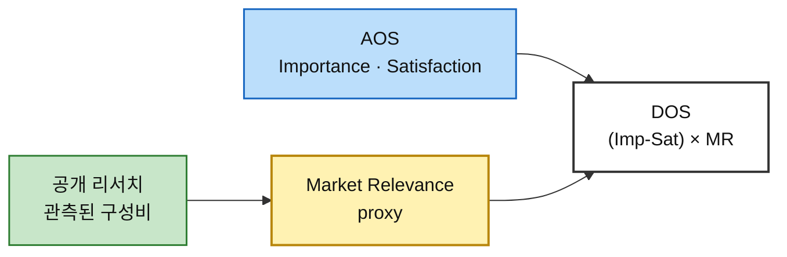
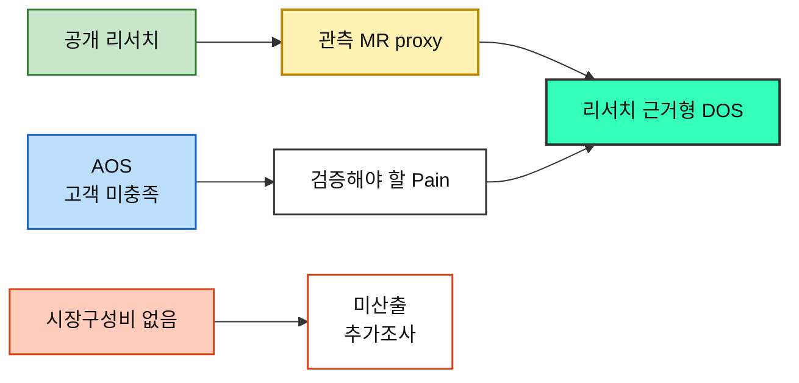

# 시장 가중형 기회점수(DOS) 분석 ③ — 예술품 재분배 플랫폼

> [분석 방법론 §4](./분석-방법론.md) · 입력 [AOS 분석 ③](./분석-03-예술품-재분배-플랫폼.md) · [평가 대상 36개](./평가대상-03-대표-페인포인트.md) · 모수 근거 [챕터 04 TAM-SAM-SOM](../04-tam-sam-som/분석-03-예술품-재분배-플랫폼.md)

> 📊 **산출 원칙.** **DOS = (Importance − Satisfaction) × Market Relevance** 를 사용하되, 이번 버전은 **공개된 관측자료에서 실제 구성비를 계산할 수 있는 항목만 수치화**했다. 공개자료가 선행사례의 존재만 보여주고 시장 구성비를 제공하지 않으면 `미산출`로 남겼다.
>
> ⚠️ **이 문서의 DOS는 ‘실측 시장점유율 DOS’가 아니라 `리서치 근거형 proxy DOS`다.** DataArts·DC Art Bank·국립현대미술관 나눔미술은행처럼 실제 관측된 프로그램·재원 구조를 proxy로 사용한다. 서로 다른 프로그램의 분모가 다르므로 숫자를 절대 시장점유율로 읽으면 안 된다.

---

## 0. Market Relevance 정의

### 모수를 SAM으로 잡고 SOM을 병기하는 이유

| 모수 | 판정 | 사유 |
|---|:---:|---|
| **TAM** — 미국 예술·문화·인문 연간 기부금 **273.1억 달러** | ❌ Pain별 MR 직접 계산에는 사용하지 않음 | Giving USA 2026에서 확인되는 예술·문화·인문 분야 전체 수혜액이다. Persona별 공급·수요·Funding 비중으로 분해되지 않는다 |
| **SAM** — 챕터 04의 **712.5만 달러/년** | ✅ **확장성 기준** | `285개 기관 × 연 1건 × $25,000/건`의 상향식 모델이다. 다만 285개 기관은 Art Bridges 네트워크 proxy이고 $25,000은 SRS 예시값이므로 절대 시장규모도 가정 포함 값이다 |
| **SOM** — 챕터 04의 기본 **37.5만 달러/년** | ✅ **초기 실행 기준** | 초기 단계에서는 실제 유사 프로그램의 ‘누가 공급하고 누가 받고 누가 돈을 대는가’에 가까운 관측 proxy를 사용할 수 있다 |

### 시장 좌표가 아니라 관측 구성비로 환산한다

04의 `공급 여력 × 예술품 필요도` 좌표는 **세그먼트 우선순위**이지 시장점유율이 아니다. 따라서 이번 DOS에서는 `대형 미술관 x=0.89 → MR 0.89`처럼 사용하지 않는다.

이번에 수치화한 것은 세 종류다.

1. **Funding 구성비** — SMU DataArts 2024 예술·문화 비영리조직의 실제 기부재원 평균
2. **초기 작가 공급 proxy** — DC Art Bank FY2025~FY2026의 개인 작가 vs 조직 취득지원금 실제 배분
3. **초기 수요기관 proxy** — 국립현대미술관 2023 나눔미술은행 실제 선정 10개 기관의 유형 구성

### MR 부여 규칙 세 가지

| # | 규칙 | 이유 |
|---|---|---|
| **1** | **관측된 구성비가 있을 때만 숫자를 준다** | 선행사례가 ‘존재한다’는 사실과 그 세그먼트가 ‘몇 %다’라는 사실은 다르다 |
| **2** | **서로 다른 시장 면의 합계를 하나의 100%로 합치지 않는다** | 한 프로젝트는 동시에 `작가 공급 + 학교 수요 + 개인기부`일 수 있다. 공급·수요·Funding은 서로 겹치는 3면 시장이다 |
| **3** | **proxy의 분모를 반드시 표기한다** | DC Art Bank 98.0%는 ‘전체 예술품 공급시장 98%’가 아니라 해당 2개 연도 Art Bank 취득지원금 중 개인 작가 몫이다. MMCA 50%도 전체 수요시장 50%가 아니라 2023 선정 10개소 중 문화기반·전시기관 5개소라는 뜻이다 |

### 자금원 구성비 — 층마다 다르다

**A. Funding — DataArts 2024 실제 관측값**

SMU DataArts `National Trends 2025`는 미국 예술·문화 조직 6,513개를 포함하는 데이터셋을 사용하며, 2024년 unrestricted contributed revenue의 평균 금액을 재원별로 공개한다.

| 재원 | 전체 예술·문화 조직 평균 | 전체 5개 재원 내 비중 | 소규모 조직(<$250k) 평균 | 소규모 5개 재원 내 비중 |
|---|---:|:---:|---:|:---:|
| Trustee | $94,914 | 8.2% | $7,700 | 6.5% |
| **Individual** | **$227,322** | **19.6%** | **$23,207** | **19.5%** |
| **Corporate** | **$41,665** | **3.6%** | **$8,495** | **7.2%** |
| Foundation | $563,173 | 48.5% | $50,890 | 42.9% |
| Government | $233,689 | 20.1% | $28,451 | 24.0% |

> **적용.** 정민준은 Individual, 최은영은 Corporate에 대응시킨다. 전체 예술조직 비중은 **SAM Funding proxy**, 연간 예산 $250,000 미만 소규모 조직 비중은 초기 조직에 더 가까운 **SOM Funding proxy**로 사용한다.
>
> ⚠️ DataArts의 숫자는 **이 플랫폼 전용 기부금 구성비가 아니다.** 미국 비영리 예술·문화 조직의 unrestricted contributions 평균을 이용한 sector proxy다.

**B. 초기 공급 — DC Art Bank FY2025~FY2026**

DC Commission on the Arts and Humanities의 Art Bank Program은 지역 작가·갤러리·비영리 예술조직으로부터 작품을 취득해 공공기관에 대여한다. 공개된 수상액 합계는 다음과 같다.

| 구분 | FY2025 | FY2026 | 2개년 합 | 2개년 비중 |
|---|---:|---:|---:|:---:|
| **개인 작가** | $373,667 | $373,530 | **$747,197** | **98.0%** |
| 조직 | $10,400 | $4,675 | **$15,075** | 2.0% |

> **적용.** 이 관측값은 `독립 작가 김서윤`, `신진 작가 임하늘`의 **SOM 공급 proxy**로만 사용한다.
>
> ⚠️ **98.0%를 전체 예술품 재분배 공급시장의 작가 비중으로 해석하지 않는다.** DC Art Bank 자체가 지역 작가 작품 취득을 핵심으로 설계된 프로그램이므로, ‘작가 중심 초기 공급 시나리오가 실제로 존재한다’는 근거다.

**C. 초기 수요 — 국립현대미술관 2023 나눔미술은행**

2023년 나눔미술은행은 실제 10개 기관을 선정했다. 공개 명단을 기능별로 다시 묶으면 `문화기반·전시기관 5`, `학교·특수교육 1`, `복지·사회서비스 4`다.

| 수요 유형 | 실제 선정기관 수 | 10개 중 비중 | Persona 매핑 |
|---|:---:|:---:|---|
| **문화기반·전시기관** | 5 | **50%** | 오수진 |
| **학교·특수교육** | 1 | **10%** | 이지현 |
| **복지·사회서비스** | 4 | **40%** | 김도현의 **광의 proxy** |

> ⚠️ 김도현은 ‘문화취약지역 NGO’이고, MMCA의 4개 기관은 노인복지·아동복지·아동보호 등이다. 따라서 **40%는 NGO의 정확한 시장비중이 아니라 문화취약 수요를 수행하는 복지·사회서비스/비영리 채널의 proxy**다.
>
> 2024년 나눔미술은행은 12개 기관으로 확대됐고 지원 대상도 장애인·노인복지시설, 학교밖청소년센터, 특수학교, 전국문화기반시설·문화재단으로 명시되어 있어 2023의 수요 유형 자체는 다음 해에도 이어졌다.

### 인물별 Market Relevance

| 인물 | SAM MR | SOM MR | 근거 상태 |
|---|:---:|:---:|---|
| 독립 작가 김서윤 | 미산출 | **0.980** | DC Art Bank 2개년 개인작가 지원금 비중 — **초기 공급 proxy** |
| 신진 작가 임하늘 | 미산출 | **0.980** | 동일 |
| 문화취약지역 학교 담당 이지현 | 미산출 | **0.100** | MMCA 2023 선정기관 구성 |
| 지역 문화시설 담당 오수진 | 미산출 | **0.500** | MMCA 2023 선정기관 구성 |
| 문화취약지역 NGO 담당 김도현 | 미산출 | **0.400** | MMCA 2023 복지·사회서비스 구성의 **광의 proxy** |
| 개인 기부자 정민준 | **0.196** | **0.195** | DataArts 전체 / 소규모 조직 |
| 기업 CSR·ESG 담당 최은영 | **0.036** | **0.072** | DataArts 전체 / 소규모 조직 |
| 미술관 컬렉션 담당 박소연 | 미산출 | 미산출 | Art Bridges 등 기관 대여 선행사례는 확인되나 시장 구성비 없음 |
| 미술대학 작품관리 담당 한유진 | 미산출 | 미산출 | 대학 연계 사례는 있으나 공급 구성비 없음 |
| 갤러리 작품관리 담당 윤태호 | 미산출 | 미산출 | DC Art Bank의 ‘조직’ 범주를 상업 갤러리와 동일시할 수 없음 |
| 작품 보유기관 담당 서재원 | 미산출 | 미산출 | 포괄 기관 Persona에 대응하는 관측 시장비중 없음 |
| 최종 향유 학생 박하린 | *제외* | *제외* | 성과 판정 Persona |

> 📌 **미산출은 0이 아니다.** 현재 공개자료로 시장구성비를 방어할 수 없다는 뜻이다.

---

## 1. DOS Table — SAM 기준 (확장성)

SAM에서는 **시장 전반의 재원 구성비를 직접 관측할 수 있는 Funding 6개만 정량화**한다. 나머지 공급·수요 Persona는 SAM과 동일한 분모의 시장구성비 자료가 없어 미산출로 둔다.

| 순위 | ID | 인물 | Pain Point (요약) | Imp−Sat | MR | **DOS** | 판정 |
|:---:|---|---|---|:---:|:---:|:---:|---|
| — | **P02** | 독립 작가 김서윤 | 수요가 있는지, 언제 연결될지 보이지 않는다 | 4 | 미산출 | 미산출 | 동일 분모의 시장구성비 근거 없음 |
| — | **P14** | 신진 작가 임하늘 | 대기 기한을 모르면 폐기로 전환할 수 있다 | 4 | 미산출 | 미산출 | 동일 분모의 시장구성비 근거 없음 |
| — | **P23** | 문화취약지역 NGO 담당 김도현 | 작품 매칭과 비용조성이 따로 놀면 프로젝트가 멈춘다 | 4 | 미산출 | 미산출 | 동일 분모의 시장구성비 근거 없음 |
| — | **P04** | 미술관 컬렉션 담당 박소연 | 권리·책임이 하나라도 불명확하면 진행이 멈춘다 | 3 | 미산출 | 미산출 | 동일 분모의 시장구성비 근거 없음 |
| — | **P07** | 미술대학 작품관리 담당 한유진 | 학생별 동의 수집이 반복 업무가 된다 | 3 | 미산출 | 미산출 | 동일 분모의 시장구성비 근거 없음 |
| — | **P13** | 신진 작가 임하늘 | 보관 문제가 곧 창작 공간 문제로 번진다 | 3 | 미산출 | 미산출 | 동일 분모의 시장구성비 근거 없음 |
| — | **P16** | 문화취약지역 학교 담당 이지현 | 공간 적합성과 관리조건을 판단하기 어렵다 | 3 | 미산출 | 미산출 | 동일 분모의 시장구성비 근거 없음 |
| — | **P19** | 지역 문화시설 담당 오수진 | 공간이 있어도 작품 확보 루트가 제한적이다 | 3 | 미산출 | 미산출 | 동일 분모의 시장구성비 근거 없음 |
| — | **P22** | 문화취약지역 NGO 담당 김도현 | 수요가 있어도 공급망이 없다 | 3 | 미산출 | 미산출 | 동일 분모의 시장구성비 근거 없음 |
| — | **P24** | 문화취약지역 NGO 담당 김도현 | 현장 상황 변화가 최종 배송을 막을 수 있다 | 3 | 미산출 | 미산출 | 동일 분모의 시장구성비 근거 없음 |
| 1 | **P25** | 개인 기부자 정민준 | 총 모금액만 보이고 비용 구성이 없으면 신뢰하기 어렵다 | 3 | 0.196 | **0.588** | DataArts 관측자료 기반 proxy |
| 1 | **P26** | 개인 기부자 정민준 | 실물 이동은 시간이 걸리는데 중간 신호가 없으면 관계가 끊긴다 | 3 | 0.196 | **0.588** | DataArts 관측자료 기반 proxy |
| 1 | **P27** | 개인 기부자 정민준 | 전체 성과만 보이면 내 기부와 결과가 연결되지 않는다 | 3 | 0.196 | **0.588** | DataArts 관측자료 기반 proxy |
| — | **P01** | 독립 작가 김서윤 | 재분배 후 활용처가 불명확하면 작품을 내놓기 어렵다 | 2 | 미산출 | 미산출 | 동일 분모의 시장구성비 근거 없음 |
| — | **P03** | 독립 작가 김서윤 | 이전 뒤 정보가 끊기면 재분배의 의미를 체감하지 못한다 | 2 | 미산출 | 미산출 | 동일 분모의 시장구성비 근거 없음 |
| — | **P05** | 미술관 컬렉션 담당 박소연 | 수요기관의 관리 역량을 확인하기 어렵다 | 2 | 미산출 | 미산출 | 동일 분모의 시장구성비 근거 없음 |
| — | **P08** | 미술대학 작품관리 담당 한유진 | 대량 등록이 불가능하면 사용 자체가 어렵다 | 2 | 미산출 | 미산출 | 동일 분모의 시장구성비 근거 없음 |
| — | **P11** | 갤러리 작품관리 담당 윤태호 | 설치 맥락이 불명확하면 작가 동의를 받기 어렵다 | 2 | 미산출 | 미산출 | 동일 분모의 시장구성비 근거 없음 |
| — | **P06** | 미술관 컬렉션 담당 박소연 | 훼손·분실 시 책임과 보험 범위가 불명확할 수 있다 | 2 | 미산출 | 미산출 | 동일 분모의 시장구성비 근거 없음 |
| — | **P10** | 갤러리 작품관리 담당 윤태호 | 권리관계가 복잡하면 바로 중단된다 | 2 | 미산출 | 미산출 | 동일 분모의 시장구성비 근거 없음 |
| — | **P17** | 문화취약지역 학교 담당 이지현 | 수령·설치 역할이 불명확하면 마지막에 지연된다 | 2 | 미산출 | 미산출 | 동일 분모의 시장구성비 근거 없음 |
| 4 | **P29** | 기업 CSR·ESG 담당 최은영 | 리스크·정산·성과 근거가 부족하면 내부 승인을 받기 어렵다 | 2 | 0.036 | **0.072** | DataArts 관측자료 기반 proxy |
| 4 | **P30** | 기업 CSR·ESG 담당 최은영 | 성과 단위가 정리되지 않으면 내부 보고에 쓰기 어렵다 | 2 | 0.036 | **0.072** | DataArts 관측자료 기반 proxy |
| — | **P32** | 작품 보유기관 담당 서재원 | 권리와 책임이 불명확하면 여기서 여정이 끝난다 | 2 | 미산출 | 미산출 | 동일 분모의 시장구성비 근거 없음 |
| — | **P09** | 미술대학 작품관리 담당 한유진 | 학교·학생·수령기관 사이 책임이 분산된다 | 1 | 미산출 | 미산출 | 동일 분모의 시장구성비 근거 없음 |
| — | **P15** | 신진 작가 임하늘 | 포장·픽업 노동이 추가되면 마지막에 포기할 수 있다 | 1 | 미산출 | 미산출 | 동일 분모의 시장구성비 근거 없음 |
| — | **P18** | 문화취약지역 학교 담당 이지현 | 작품만 걸어두면 교육적 활용이 제한될 수 있다 | 1 | 미산출 | 미산출 | 동일 분모의 시장구성비 근거 없음 |
| — | **P20** | 지역 문화시설 담당 오수진 | 관리 난이도가 보이지 않으면 신청하기 어렵다 | 1 | 미산출 | 미산출 | 동일 분모의 시장구성비 근거 없음 |
| 6 | **P28** | 기업 CSR·ESG 담당 최은영 | 한 번에 검토할 실사 자료가 없으면 부서별 재요청이 생긴다 | 1 | 0.036 | **0.036** | DataArts 관측자료 기반 proxy |
| — | **P12** | 갤러리 작품관리 담당 윤태호 | 승인 주체가 둘 이상이면 의사결정이 느려진다 | 0 | 미산출 | 미산출 | 동일 분모의 시장구성비 근거 없음 |
| — | **P21** | 지역 문화시설 담당 오수진 | 시설 운영 일정과 배송 일정이 충돌할 수 있다 | 0 | 미산출 | 미산출 | 동일 분모의 시장구성비 근거 없음 |
| — | **P33** | 작품 보유기관 담당 서재원 | 부서별 요구자료가 다르면 검토비용이 커진다 | 0 | 미산출 | 미산출 | 동일 분모의 시장구성비 근거 없음 |
| — | **P31** | 작품 보유기관 담당 서재원 | 참여 조건이 복잡하면 검토 자체를 미룬다 | -1 | 미산출 | 미산출 | 동일 분모의 시장구성비 근거 없음 |

> 📌 **SAM에서 숫자가 있는 6개만 보면** 정민준 P25·P26·P27이 각각 약 **0.588**, 최은영 P29·P30이 각각 약 **0.072**, P28이 약 **0.036**이다. 이것은 ‘개인기부 Pain이 시장 전체에서 가장 중요하다’는 뜻이 아니라 **현재 동일한 Funding 분모로 비교 가능한 구간 안에서의 결과**다.

---

## 2. DOS Table — SOM 기준 (1년차 실행)

SOM은 초기 실행에 가까운 실제 선행프로그램의 관측 구성을 proxy로 사용한다. **21개 Pain에 숫자가 있고 12개는 미산출**, 최종 향유 3개는 제외한다.

| 순위 | ID | 인물 | Pain Point (요약) | Imp−Sat | MR | **DOS** | proxy 근거 |
|:---:|---|---|---|:---:|:---:|:---:|---|
| 1 | **P02** | 독립 작가 김서윤 | 수요가 있는지, 언제 연결될지 보이지 않는다 | 4 | 0.980 | **3.921** | DC Art Bank FY2025~26 개인 작가 취득지원금 비중 |
| 1 | **P14** | 신진 작가 임하늘 | 대기 기한을 모르면 폐기로 전환할 수 있다 | 4 | 0.980 | **3.921** | DC Art Bank FY2025~26 개인 작가 취득지원금 비중 |
| 6 | **P23** | 문화취약지역 NGO 담당 김도현 | 작품 매칭과 비용조성이 따로 놀면 프로젝트가 멈춘다 | 4 | 0.400 | **1.600** | MMCA 2023 나눔미술은행 복지·사회서비스 4/10 — NGO의 광의 proxy |
| — | **P04** | 미술관 컬렉션 담당 박소연 | 권리·책임이 하나라도 불명확하면 진행이 멈춘다 | 3 | 미산출 | 미산출 | 직접 대응 가능한 구성비 자료 없음 |
| — | **P07** | 미술대학 작품관리 담당 한유진 | 학생별 동의 수집이 반복 업무가 된다 | 3 | 미산출 | 미산출 | 직접 대응 가능한 구성비 자료 없음 |
| 3 | **P13** | 신진 작가 임하늘 | 보관 문제가 곧 창작 공간 문제로 번진다 | 3 | 0.980 | **2.941** | DC Art Bank FY2025~26 개인 작가 취득지원금 비중 |
| 15 | **P16** | 문화취약지역 학교 담당 이지현 | 공간 적합성과 관리조건을 판단하기 어렵다 | 3 | 0.100 | **0.300** | MMCA 2023 나눔미술은행 학교·특수교육 1/10 |
| 7 | **P19** | 지역 문화시설 담당 오수진 | 공간이 있어도 작품 확보 루트가 제한적이다 | 3 | 0.500 | **1.500** | MMCA 2023 나눔미술은행 문화기반·전시기관 5/10 |
| 8 | **P22** | 문화취약지역 NGO 담당 김도현 | 수요가 있어도 공급망이 없다 | 3 | 0.400 | **1.200** | MMCA 2023 나눔미술은행 복지·사회서비스 4/10 — NGO의 광의 proxy |
| 8 | **P24** | 문화취약지역 NGO 담당 김도현 | 현장 상황 변화가 최종 배송을 막을 수 있다 | 3 | 0.400 | **1.200** | MMCA 2023 나눔미술은행 복지·사회서비스 4/10 — NGO의 광의 proxy |
| 11 | **P25** | 개인 기부자 정민준 | 총 모금액만 보이고 비용 구성이 없으면 신뢰하기 어렵다 | 3 | 0.195 | **0.586** | DataArts 2024 소규모 예술·문화 조직(<$250k) 기부재원 구성비 |
| 11 | **P26** | 개인 기부자 정민준 | 실물 이동은 시간이 걸리는데 중간 신호가 없으면 관계가 끊긴다 | 3 | 0.195 | **0.586** | DataArts 2024 소규모 예술·문화 조직(<$250k) 기부재원 구성비 |
| 11 | **P27** | 개인 기부자 정민준 | 전체 성과만 보이면 내 기부와 결과가 연결되지 않는다 | 3 | 0.195 | **0.586** | DataArts 2024 소규모 예술·문화 조직(<$250k) 기부재원 구성비 |
| 4 | **P01** | 독립 작가 김서윤 | 재분배 후 활용처가 불명확하면 작품을 내놓기 어렵다 | 2 | 0.980 | **1.960** | DC Art Bank FY2025~26 개인 작가 취득지원금 비중 |
| 4 | **P03** | 독립 작가 김서윤 | 이전 뒤 정보가 끊기면 재분배의 의미를 체감하지 못한다 | 2 | 0.980 | **1.960** | DC Art Bank FY2025~26 개인 작가 취득지원금 비중 |
| — | **P05** | 미술관 컬렉션 담당 박소연 | 수요기관의 관리 역량을 확인하기 어렵다 | 2 | 미산출 | 미산출 | 직접 대응 가능한 구성비 자료 없음 |
| — | **P08** | 미술대학 작품관리 담당 한유진 | 대량 등록이 불가능하면 사용 자체가 어렵다 | 2 | 미산출 | 미산출 | 직접 대응 가능한 구성비 자료 없음 |
| — | **P11** | 갤러리 작품관리 담당 윤태호 | 설치 맥락이 불명확하면 작가 동의를 받기 어렵다 | 2 | 미산출 | 미산출 | 직접 대응 가능한 구성비 자료 없음 |
| — | **P06** | 미술관 컬렉션 담당 박소연 | 훼손·분실 시 책임과 보험 범위가 불명확할 수 있다 | 2 | 미산출 | 미산출 | 직접 대응 가능한 구성비 자료 없음 |
| — | **P10** | 갤러리 작품관리 담당 윤태호 | 권리관계가 복잡하면 바로 중단된다 | 2 | 미산출 | 미산출 | 직접 대응 가능한 구성비 자료 없음 |
| 16 | **P17** | 문화취약지역 학교 담당 이지현 | 수령·설치 역할이 불명확하면 마지막에 지연된다 | 2 | 0.100 | **0.200** | MMCA 2023 나눔미술은행 학교·특수교육 1/10 |
| 17 | **P29** | 기업 CSR·ESG 담당 최은영 | 리스크·정산·성과 근거가 부족하면 내부 승인을 받기 어렵다 | 2 | 0.072 | **0.143** | DataArts 2024 소규모 예술·문화 조직(<$250k) 기부재원 구성비 |
| 17 | **P30** | 기업 CSR·ESG 담당 최은영 | 성과 단위가 정리되지 않으면 내부 보고에 쓰기 어렵다 | 2 | 0.072 | **0.143** | DataArts 2024 소규모 예술·문화 조직(<$250k) 기부재원 구성비 |
| — | **P32** | 작품 보유기관 담당 서재원 | 권리와 책임이 불명확하면 여기서 여정이 끝난다 | 2 | 미산출 | 미산출 | 직접 대응 가능한 구성비 자료 없음 |
| — | **P09** | 미술대학 작품관리 담당 한유진 | 학교·학생·수령기관 사이 책임이 분산된다 | 1 | 미산출 | 미산출 | 직접 대응 가능한 구성비 자료 없음 |
| 10 | **P15** | 신진 작가 임하늘 | 포장·픽업 노동이 추가되면 마지막에 포기할 수 있다 | 1 | 0.980 | **0.980** | DC Art Bank FY2025~26 개인 작가 취득지원금 비중 |
| 19 | **P18** | 문화취약지역 학교 담당 이지현 | 작품만 걸어두면 교육적 활용이 제한될 수 있다 | 1 | 0.100 | **0.100** | MMCA 2023 나눔미술은행 학교·특수교육 1/10 |
| 14 | **P20** | 지역 문화시설 담당 오수진 | 관리 난이도가 보이지 않으면 신청하기 어렵다 | 1 | 0.500 | **0.500** | MMCA 2023 나눔미술은행 문화기반·전시기관 5/10 |
| 20 | **P28** | 기업 CSR·ESG 담당 최은영 | 한 번에 검토할 실사 자료가 없으면 부서별 재요청이 생긴다 | 1 | 0.072 | **0.072** | DataArts 2024 소규모 예술·문화 조직(<$250k) 기부재원 구성비 |
| — | **P12** | 갤러리 작품관리 담당 윤태호 | 승인 주체가 둘 이상이면 의사결정이 느려진다 | 0 | 미산출 | 미산출 | 직접 대응 가능한 구성비 자료 없음 |
| 21 | **P21** | 지역 문화시설 담당 오수진 | 시설 운영 일정과 배송 일정이 충돌할 수 있다 | 0 | 0.500 | **0.000** | MMCA 2023 나눔미술은행 문화기반·전시기관 5/10 |
| — | **P33** | 작품 보유기관 담당 서재원 | 부서별 요구자료가 다르면 검토비용이 커진다 | 0 | 미산출 | 미산출 | 직접 대응 가능한 구성비 자료 없음 |
| — | **P31** | 작품 보유기관 담당 서재원 | 참여 조건이 복잡하면 검토 자체를 미룬다 | -1 | 미산출 | 미산출 | 직접 대응 가능한 구성비 자료 없음 |

> ⚠️ **이 표는 하나의 통일된 시장점유율 표가 아니다.** 작가 공급은 DC Art Bank, 수요는 MMCA 나눔미술은행, Funding은 DataArts라는 서로 다른 관측 분모를 사용한 **초기 시나리오 proxy**다. 따라서 점수의 절대 크기보다 `각 시장 면 안에서 어떤 Pain이 강한가`와 AOS와의 교집합을 본다.

---

## 3. 두 순위 대조

### 상위 10 나란히 보기

SOM proxy 상위 10을 놓고, SAM에서도 같은 분모로 계산 가능한 항목만 SAM 값을 병기했다.

| SOM 순위 | Pain | 인물 | SAM DOS | **SOM proxy DOS** | 근거 |
|:---:|---|---|:---:|:---:|---|
| 1 | **P02** 수요가 있는지, 언제 연결될지 보이지 않는다 | 독립 작가 김서윤 | 미산출 | **3.921** | DC Art Bank FY2025~26 개인 작가 취득지원금 비중 |
| 2 | **P14** 대기 기한을 모르면 폐기로 전환할 수 있다 | 신진 작가 임하늘 | 미산출 | **3.921** | DC Art Bank FY2025~26 개인 작가 취득지원금 비중 |
| 3 | **P13** 보관 문제가 곧 창작 공간 문제로 번진다 | 신진 작가 임하늘 | 미산출 | **2.941** | DC Art Bank FY2025~26 개인 작가 취득지원금 비중 |
| 4 | **P01** 재분배 후 활용처가 불명확하면 작품을 내놓기 어렵다 | 독립 작가 김서윤 | 미산출 | **1.960** | DC Art Bank FY2025~26 개인 작가 취득지원금 비중 |
| 5 | **P03** 이전 뒤 정보가 끊기면 재분배의 의미를 체감하지 못한다 | 독립 작가 김서윤 | 미산출 | **1.960** | DC Art Bank FY2025~26 개인 작가 취득지원금 비중 |
| 6 | **P23** 작품 매칭과 비용조성이 따로 놀면 프로젝트가 멈춘다 | 문화취약지역 NGO 담당 김도현 | 미산출 | **1.600** | MMCA 2023 나눔미술은행 복지·사회서비스 4/10 — NGO의 광의 proxy |
| 7 | **P19** 공간이 있어도 작품 확보 루트가 제한적이다 | 지역 문화시설 담당 오수진 | 미산출 | **1.500** | MMCA 2023 나눔미술은행 문화기반·전시기관 5/10 |
| 8 | **P22** 수요가 있어도 공급망이 없다 | 문화취약지역 NGO 담당 김도현 | 미산출 | **1.200** | MMCA 2023 나눔미술은행 복지·사회서비스 4/10 — NGO의 광의 proxy |
| 9 | **P24** 현장 상황 변화가 최종 배송을 막을 수 있다 | 문화취약지역 NGO 담당 김도현 | 미산출 | **1.200** | MMCA 2023 나눔미술은행 복지·사회서비스 4/10 — NGO의 광의 proxy |
| 10 | **P15** 포장·픽업 노동이 추가되면 마지막에 포기할 수 있다 | 신진 작가 임하늘 | 미산출 | **0.980** | DC Art Bank FY2025~26 개인 작가 취득지원금 비중 |

> 📌 P02·P14의 높은 값은 **DC Art Bank라는 작가 중심 공급모델에서의 결과**다. ‘미국 예술품 재분배 시장의 98%가 작가’라는 뜻이 아니다.
>
> 📌 P23·P19 등 수요형 순위는 **MMCA 2023 한 프로그램 10개소의 구성**에 민감하다. 표본이 작으므로 방향성 검증용이다.

### 이동 폭이 큰 항목

SAM과 SOM을 **같은 Funding 분모**로 비교할 수 있는 것은 P25~P30 6개다.

| ID | SAM DOS | SOM DOS | Funding 유형 |
|---|:---:|:---:|---|
| **P25** 총 모금액만 보이고 비용 구성이 없으면 신뢰하기 어렵다 | 0.588 (1위) | 0.586 (11위) | 개인 |
| **P26** 실물 이동은 시간이 걸리는데 중간 신호가 없으면 관계가 끊긴다 | 0.588 (1위) | 0.586 (11위) | 개인 |
| **P27** 전체 성과만 보이면 내 기부와 결과가 연결되지 않는다 | 0.588 (1위) | 0.586 (11위) | 개인 |
| **P28** 한 번에 검토할 실사 자료가 없으면 부서별 재요청이 생긴다 | 0.036 (6위) | 0.072 (20위) | 기업 |
| **P29** 리스크·정산·성과 근거가 부족하면 내부 승인을 받기 어렵다 | 0.072 (4위) | 0.143 (17위) | 기업 |
| **P30** 성과 단위가 정리되지 않으면 내부 보고에 쓰기 어렵다 | 0.072 (4위) | 0.143 (17위) | 기업 |

> **정민준 개인기부 MR은 19.6% → 19.5%로 거의 그대로**인 반면, **최은영 기업 MR은 3.6% → 7.2%로 상승**한다. DataArts 관측에서는 소규모 예술조직에서 corporate contributions의 상대 비중이 전체 평균보다 높다.
>
> ⚠️ 이것도 ‘신생 예술품 재분배 플랫폼에서 기업 후원이 반드시 두 배 중요해진다’는 뜻은 아니다. **소규모 예술조직의 관측구성을 초기 플랫폼의 proxy로 쓴 결과**다.

---

## 4. AOS와 무엇이 달라졌나

AOS는 고객의 미충족을 보고, DOS는 그 미충족에 **관측 가능한 시장 관련성**을 추가한다. 이번 리서치에서는 특히 `미산출`을 허용하는 것이 핵심 차이다.

| ID | AOS | SAM DOS | SOM proxy DOS | 해석 |
|---|:---:|:---:|:---:|---|
| **P02** 수요가 있는지, 언제 연결될지 보이지 않는다 | 4.0 | 미산출 | 3.921 | AOS 공동 1위. DC Art Bank의 작가 중심 초기 취득 구조를 proxy로 쓰면 SOM에서 매우 높지만, 일반 시장비중으로 해석하면 안 됨 |
| **P14** 대기 기한을 모르면 폐기로 전환할 수 있다 | 4.0 | 미산출 | 3.921 | AOS 공동 1위. P02와 동일한 작가 공급 proxy가 적용됨 |
| **P23** 작품 매칭과 비용조성이 따로 놀면 프로젝트가 멈춘다 | 4.0 | 미산출 | 1.600 | AOS 공동 1위. MMCA 2023의 복지·사회서비스 수요 4/10을 NGO의 광의 proxy로 적용 |
| **P19** 공간이 있어도 작품 확보 루트가 제한적이다 | 3.0 | 미산출 | 1.500 | AOS 3.0. MMCA 2023에서 문화기반·전시기관이 5/10으로 관측되어 SOM proxy가 높게 나옴 |
| **P25** 총 모금액만 보이고 비용 구성이 없으면 신뢰하기 어렵다 | 3.0 | 0.588 | 0.586 | DataArts 전체/소규모 조직 모두 개인기부 비중이 약 19.5%로 관측되어 SAM·SOM 모두 수치화 가능 |
| **P29** 리스크·정산·성과 근거가 부족하면 내부 승인을 받기 어렵다 | 2.0 | 0.072 | 0.143 | 기업기부 비중은 전체 예술조직보다 소규모 조직에서 더 높게 관측되어 SOM proxy가 상승 |
| **P04** 권리·책임이 하나라도 불명확하면 진행이 멈춘다 | 3.0 | 미산출 | 미산출 | Art Bridges로 기관 대여·물류 수요는 확인되지만 박물관 공급의 '시장 구성비'는 확인되지 않아 DOS 미산출 |
| **P32** 권리와 책임이 불명확하면 여기서 여정이 끝난다 | 2.0 | 미산출 | 미산출 | 기관 참여 Gate라는 중요성은 유지되나 시장 구성비가 없어 DOS 미산출 |
| **P34** 예술작품을 일상적으로 접할 기회가 제한적이다 | 3.0 | 제외 | 제외 | 최종 향유자. 시장 행위자가 아니라 성과 판정 트랙으로 제외 |

> 📌 **P04·P32가 미산출인 것은 시장성이 낮아서가 아니다.** Art Bridges Partner Loan Network는 저장된 작품을 다른 박물관·커뮤니티로 순환시키고, 대여계약·보험·포장·운송 등 직접 물류를 관리·지원하는 실제 선행사례다. 다만 공개자료가 ‘박물관 공급이 전체 재분배 시장의 몇 %인가’를 제공하지 않으므로 MR 숫자로 바꾸지 않았다.
>
> 📌 따라서 **AOS 상위 + DOS 미산출**은 ‘후순위’가 아니라 **시장 구성비를 추가 조사해야 하는 검증 공백**이다.

---

## 5. 음수·0 항목의 해석

### 음수 0개 — 정량화 구간에서는 없음

현재 **리서치 근거가 있어 DOS를 실제 계산한 구간에서는 음수 DOS가 없다.**

AOS의 P31은 `Importance 3 − Satisfaction 4 = -1`이므로 MR까지 있다면 음수가 될 수 있다. 그러나 작품 보유기관 Persona에 대응하는 방어 가능한 시장구성비를 찾지 못했으므로 **음수를 임의 계산하지 않았다.**

> 📌 이것은 P31을 삭제했다는 뜻이 아니다. AOS에서는 ‘현재 대체 방식이 Goal을 상대적으로 잘 충족한다’는 신호로 그대로 남는다.

### 0인 항목 — 0·미산출·제외를 분리한다

| 유형 | ID/범위 | 이유 | 처리 |
|---|---|---|---|
| **정량 DOS = 0** | P21 | Imp−Sat = 0이고 SOM MR은 관측 proxy가 있으므로 0 | 위생 요건으로 해석 |
| **AOS Gap 음수이나 DOS 미산출** | P31 | Imp−Sat = -1이지만 기관 공급시장 구성비가 없어 DOS를 계산하지 않음 | 음수 DOS를 임의로 만들지 않음 |
| **SAM MR 미산출** | Funding 6개 외 27개 | 동일한 시장 분모에서 쓸 수 있는 세그먼트 구성비가 없음 | 미산출은 0이 아님 |
| **SOM MR 미산출** | P04~P12 중 기관·대학·갤러리, P31~P33 | Art Bridges 등 선행사례는 존재하지만 시장구성비를 주지 않음 | 정성 근거로만 유지 |
| **DOS 제외 — 수혜형** | P34 · P35 · P36 | 직접 공급·수요신청·Funding 의사결정자가 아님 | 문화예술 접근성·향유 성과 트랙 |

> ⚠️ **가장 중요한 구분은 `미산출 ≠ 0`이다.** 숫자가 없다는 이유로 시장가중을 0으로 넣으면, 데이터가 부족한 Persona가 자동으로 후순위가 되는 왜곡이 생긴다.

---

## 6. 인물 단위 합계

아래 합계는 **현재 숫자가 있는 proxy 범위에서만** 계산한 것이다. 서로 다른 proxy 분모를 사용하므로 전체 Persona의 ‘진짜 시장순위’라고 부르지 않는다.

| 인물 | SAM 합 | SOM proxy 합 | 주요 근거 |
|---|:---:|:---:|---|
| 독립 작가 김서윤 | 미산출 | 7.842 | DC Art Bank FY2025~26 개인 작가 취득지원금 비중 |
| 신진 작가 임하늘 | 미산출 | 7.842 | DC Art Bank FY2025~26 개인 작가 취득지원금 비중 |
| 문화취약지역 NGO 담당 김도현 | 미산출 | 4.000 | MMCA 2023 나눔미술은행 복지·사회서비스 4/10 — NGO의 광의 proxy |
| 지역 문화시설 담당 오수진 | 미산출 | 2.000 | MMCA 2023 나눔미술은행 문화기반·전시기관 5/10 |
| 개인 기부자 정민준 | 1.763 | 1.759 | DataArts 2024 소규모 예술·문화 조직(<$250k) 기부재원 구성비 |
| 문화취약지역 학교 담당 이지현 | 미산출 | 0.600 | MMCA 2023 나눔미술은행 학교·특수교육 1/10 |
| 기업 CSR·ESG 담당 최은영 | 0.179 | 0.358 | DataArts 2024 소규모 예술·문화 조직(<$250k) 기부재원 구성비 |

> 📌 현재 SOM proxy에서는 작가 2명이 크게 나오지만, 이는 DC Art Bank가 애초에 **지역 작가 작품 취득 중심 프로그램**이라는 프로그램 설계의 영향을 크게 받는다.
>
> 📌 김도현·오수진·이지현의 상대값 역시 MMCA 2023의 실제 10개소 구성에 기반하므로, 최소한 한 번의 실제 프로그램 관측은 있지만 표본 규모가 작다.
>
> 📌 정민준·최은영은 가장 넓은 표본인 DataArts의 sector-level 재원자료를 사용하므로, **Funding MR이 이번 DOS에서 상대적으로 가장 방어력이 높은 수치**다.

---

## 7. 근거 등급

| 구성 요소 | 근거 등급 | 실제 근거 / 한계 |
|---|---|---|
| **DOS 계산식** | **방법론** | `DOS = (Importance − Satisfaction) × Market Relevance` |
| **TAM 273.1억 달러** | **공식 집계** | Giving USA 2026의 2025 Arts, Culture & Humanities 기부액 |
| **SAM 712.5만 달러** | **가정 포함 선행분석** | 285기관 × 1프로젝트 × $25,000. 285는 Art Bridges proxy, $25,000은 SRS 예시 |
| **AOS Importance·Satisfaction** | **가설** | 인터뷰·설문 전 점수 |
| **Funding SAM MR** | **관측자료 기반 proxy — 상대적으로 강함** | DataArts 2024 전체 예술·문화 조직 평균 기부재원 구성 |
| **Funding SOM MR** | **관측자료 기반 proxy** | DataArts 2024 연 예산 $250k 미만 소규모 조직 구성 |
| **작가 SOM MR 0.980** | **선행프로그램 proxy — 편향 큼** | DC Art Bank FY2025~26 실제 award-dollar 배분. 작가 중심 프로그램이므로 전체 공급시장으로 일반화 불가 |
| **수요 SOM MR 0.10/0.50/0.40** | **선행프로그램 proxy — 표본 작음** | MMCA 2023 실제 선정 10개소를 기능별로 재분류 |
| **김도현 0.40** | **광의 proxy** | 정확한 NGO 비중이 아니라 복지·사회서비스/비영리 채널 4/10을 대응시킴 |
| **박소연·한유진·윤태호·서재원 MR** | **미확인** | 선행사례는 존재하지만 동일 분모의 시장구성비를 찾지 못함 |
| **Art Bridges 기관 순환 가능성** | **공식 선행사례 확인** | Partner Loan Network가 저장작품 대여, 보험·포장·배송 등 물류를 지원. 그러나 시장비중 자료는 없음 |

**공식 리서치 출처**
- [Giving USA 2026 — 2025 charitable giving](https://givingusa.org/giving-usa-charitable-giving-rose-to-617-20-billion-in-2025-surpassing-the-600-billion-mark-for-the-first-time/)
- [SMU DataArts — National Trends 2025](https://www.culturaldata.org/national-trends/national-trends-2025/)
- [SMU DataArts — Data Tables](https://www.culturaldata.org/national-trends/national-trends-2025/data-tables/)
- [DC Arts — FY2025 Art Bank Grantees](https://dcarts.dc.gov/page/fy-2025-grantees-art-bank-program-abp)
- [DC Arts — FY2026 Art Bank Grantees](https://dcarts.dc.gov/public-art/fy-2026-grantees-art-bank-program-abp)
- [MMCA — 2023 나눔미술은행](https://www.mmca.go.kr/pr/pressDetail.do?bdCId=202303200008739)
- [MMCA — 2024 나눔미술은행](https://www.mmca.go.kr/pr/newsDetail.do?bdCId=202405310009367)
- [Art Bridges — Partner Loan Network](https://artbridgesfoundation.org/partner-loan-network)

> ⚠️ **이번 버전의 핵심은 숫자를 많이 만드는 것이 아니라, 숫자가 방어 가능한 곳과 그렇지 않은 곳을 분리하는 것이다.** 실제 파일럿 데이터를 확보하면 proxy를 순차적으로 교체해야 한다.

---

## 8. 결론 — 두 개의 목록으로 읽는다

| 질문 | 현재 근거로 답할 수 있는 것 |
|---|---|
| **Funding에서 무엇이 강한가** | DataArts 기준 개인기부 관련 P25·P26·P27은 SAM/SOM 모두 비교 가능하다. 기업 P29·P30은 소규모 조직 proxy에서 상대값이 커진다 |
| **초기 공급에서 무엇을 먼저 볼 수 있나** | DC Art Bank와 같은 **작가 중심 초기 공급 시나리오**에서는 P02·P14의 매칭·대기 문제가 매우 강하다. 단, 전체 공급시장의 보편적 순위는 아니다 |
| **초기 수요에서 무엇이 보이나** | MMCA 실제 사업에서는 문화기반·전시기관과 복지·사회서비스 기관이 함께 주요 수령채널이었다. P19·P23·P22·P24가 해당 시나리오에서 강하게 남는다 |
| **아직 DOS를 확정하면 안 되는 것은** | 박소연·한유진·윤태호·서재원 관련 기관 공급 MR. 선행사례는 있지만 시장 구성비가 없어 수치화하지 않았다 |
| **성과 트랙은** | P34·P35·P36. 최종 향유는 DOS가 아니라 작품 접점·이해·활용 성과로 본다 |

### 다음 단계

| 순위 | 필요한 추가 데이터 | 교체할 proxy |
|:---:|---|---|
| **1** | 실제 파일럿의 **공급원별 프로젝트 비중** — 작가·미술관·갤러리·대학·기관 | DC Art Bank 공급 proxy |
| **2** | 실제 파일럿의 **수령기관 유형별 프로젝트 비중** — 학교·복지·문화시설·NGO | MMCA 10개소 proxy |
| **3** | 플랫폼 실제 **Funding source mix** — 개인·기업·재단·공공 | DataArts sector proxy |
| **4** | 세그먼트별 신청→승인→매칭→완료 전환율 | SOM의 초기 획득 가능성 |
| **5** | 최소 1개 파일럿 종료 후 **MR 재계산 → DOS 재정렬** | 현재 리서치 근거형 proxy DOS 전체 |

> **현재 제출 가능한 해석:** 이 파일은 ‘사실로 확인된 시장점유율 DOS’가 아니라 **공식·공공 리서치에서 관측 가능한 구성비만 사용한 `research-backed proxy DOS`**다. 수치 근거가 없는 Persona를 0으로 처리하거나 임의 비율로 채우지 않았다는 점이 가장 중요한 품질 기준이다.
