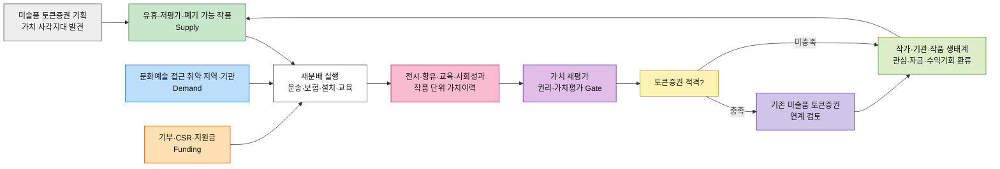

# 시장 가중형 기회점수(DOS) 분석 ③ — 예술품 재분배 플랫폼

> [분석 방법론 §4](./분석-방법론.md) · 입력 [AOS 분석 ③](./분석-03-예술품-재분배-플랫폼.md) · [평가 대상 36개](./평가대상-03-대표-페인포인트.md) · 모수 근거 [챕터 04 TAM-SAM-SOM](../04-tam-sam-som/분석-03-예술품-재분배-플랫폼.md)

> 📊 **산출.** **DOS = (Importance − Satisfaction) × Market Relevance** 를 SAM 기준과 SOM 기준으로 계산한다. 이번 파일은 강사 문서처럼 **Persona별 MR → 33개 직접시장 Pain의 SAM/SOM 통합순위**를 만드는 버전이다.
>
> 🎯 **본론 고정.** 시장 파급력은 단순한 “작품을 옮기는 시장”에만 주지 않는다. `폐기 가능 작품을 순환 → 문화취약지역의 향유·창의교육 → 작품 단위 활용·사회성과 이력 → 가치 재평가 가능성 검증 → 권리·가치평가·증권 요건을 충족한 작품의 토큰증권 연계 검토 → 작가·기관·작품 생태계로 가치·수익기회 환류`라는 전체 가치사슬에서 각 Persona의 Pain이 얼마나 넓게 작동하는지를 본다.
>
> ⚠️ **MR은 실측 시장점유율이 아니라 작업가중치다.** 현재 재분배 작품 중 몇 %가 가치상승하거나 토큰증권 적격이 되는지 관측값이 없으므로 `토큰증권 전환율`을 임의로 곱하지 않는다. 토큰증권은 본론에서 제거하지 않되 **후속 Gate**로 남긴다.

---

## 0. Market Relevance 정의

### 모수를 SAM으로 잡고 SOM을 병기하는 이유

| 모수 | 판정 | 사유 |
|---|:---:|---|
| **TAM** — 미국 예술·문화·인문 연간 기부금 **273.1억 달러** | ❌ Pain별 MR 직접 계산에는 사용하지 않음 | Giving USA 2026의 2025년 Arts, Culture & Humanities 전체 기부액이다. 작품 공급자·수요기관·기부자·후속 가치화 Persona별 비중으로 분해되지 않는다 |
| **SAM** — 챕터 04 **712.5만 달러/년** | ✅ **확장성 기준** | 서비스가 커졌을 때 작품 공급·문화취약 수요·Funding·권리/가치이력 체계를 어느 정도 넓게 커버해야 하는지 보는 기준 |
| **SOM** — 보수 12.5만 · 기본 37.5만 · 낙관 100만 달러/년 | ✅ **초기 실행 기준** | 3년 기본 시나리오의 전체 포착액을 참고하되, 초기에는 어떤 Persona를 실제로 열기 쉬운지가 다르므로 Persona별 실행 MR을 별도로 둔다 |

> 📌 **TAM의 273.1억 달러는 ‘예술품 재분배 산업 규모’가 아니다.** 미국 Arts, Culture & Humanities 기부시장이라는 Funding 측 상위 앵커다. Giving USA는 2025년 이 분야 기부를 $27.31B로 추정한다.  
> 근거: [Giving USA 2026](https://givingusa.org/giving-usa-charitable-giving-rose-to-617-20-billion-in-2025-surpassing-the-600-billion-mark-for-the-first-time/)
>
> 📌 **SAM/SOM 달러는 플랫폼이 실행할 재분배 프로젝트의 자금 규모를 잡는 모수**이고, MR은 그 시장에서 각 Persona의 Pain이 얼마나 넓게 영향을 주는지 비교하는 별도 상대값이다.

### 달러만으로는 Pain별 MR이 나오지 않는다

챕터 04의 달러 수치만으로는 `독립 작가`, `미술관`, `학교`, `NGO`, `개인 기부`, `기업 CSR`, `후속 가치화 권리 Gate`의 상대 영향력이 자동으로 나오지 않는다. 그래서 본 파일은 강사 문서와 같이 **Persona 단위 MR**을 명시적으로 둔다.



**핵심은 ‘토큰증권이 마지막에 있으니 재분배와 무관하다’가 아니다.** 재분배를 통해 만들어진 새 활용·향유·교육·사회성과 이력이 **가치 재평가를 검토할 데이터 후보**가 되고, 그 뒤에 권리·가치평가·증권성·공시 등 금융 Gate가 붙는 구조다.

### MR 부여 규칙 세 가지

| # | 규칙 | 이유 |
|---|---|---|
| **1** | **MR은 Pain별이 아니라 Persona별로 부여한다** | 같은 Persona의 세 Pain에 시장값을 다르게 주면 고객 미충족과 시장 파급력을 섞게 된다. Pain의 차이는 Imp−Sat에서, 시장 접점의 차이는 MR에서 반영한다 |
| **2** | **MR 합은 1일 필요가 없다** | 한 재분배 프로젝트에는 공급·수요·Funding이 동시에 필요하고 권리·가치이력 Gate도 겹친다. MR은 예산 배분표가 아니라 “이 Persona의 Pain이 실행 가능한 가치순환에 얼마나 넓게 닿는가”의 상대 작업가중치다 |
| **3** | **토큰증권 연계는 별도 전환율을 곱하지 않는다** | “재분배 작품 중 토큰증권 적격률” 실측값이 없다. 대신 P03·P05·P09·P10·P12·P21·P24·P27·P30·P32·P33의 Pain 정의에 가치이력·권리·후속 수익·토큰증권 Gate를 반영하고, 실제 적격률은 후속 파일럿에서 교체한다 |

> ⚠️ `MR 1.00 = 시장점유율 100%`가 아니다. 이번 문서에서 1.00은 **현재 작업모델 안에서 상대적으로 가장 넓은 시장접점**을 뜻한다.

### SOM 포착률 — 층마다 다른 시장을 새로 만들지 않는다

챕터 04의 기본 SOM **37.5만 달러**는 SAM **712.5만 달러**의 약 **5.26%**다. 이 숫자는 **전체 시장에서 3년 내 얼마를 포착할 것인가**를 뜻한다.

```text
기본 SOM 포착률 = 375,000 / 7,125,000 ≈ 5.26%
```

하지만 `SOM MR = SAM MR × 5.26%`로 일괄 축소하지 않는다. 그렇게 하면 Persona별 초기 접근성 차이가 사라지고 SAM/SOM 순위가 기계적으로 동일해진다.

이번에는 **같은 가치순환 시장** 안에서 다음 차이를 작업가정으로 둔다.

| 시장 접점 | SAM 해석 | SOM 해석 |
|---|---|---|
| 문화취약 학교·NGO 수요 | 사회적 미션의 핵심 수요라 확장 시 매우 넓음 | 초기에도 중요하지만 현장수용·운영조건 때문에 일부 낮춤 |
| 미술관·기관 공급 | 작품·권리·기록 측면에서 확장시장 파급력이 큼 | 초기에는 자산처리·법무·보험·내부승인 마찰이 커 낮춤 |
| 독립·신진 작가 공급 | 기관군보다 확장시장 영향은 보수적으로 둠 | 초기 작품 확보는 상대적으로 빠를 수 있어 높임 |
| 개인 Funding | 전체 확장 조달원 중 하나 | 소액·프로젝트형 초기 Funding에서 접근성을 높게 둠 |
| 기업 CSR·ESG | 확장 시 큰 자금·성과 파급력 | 초기에는 실사·결재·성과증빙 마찰로 낮춤 |
| 가치이력·후속 가치화 | 재분배 규모가 커질수록 표준화 영향이 커짐 | 초기에는 작가·기부 결과 확인에서 빠르게 검증 가능하나 기관 상업화 Gate는 느림 |

> 📌 이 구분은 **실제 시장구성비가 아니라 단계별 작업가설**이다. 실제 파일럿에서 `등록→승인→매칭→설치→성과기록→가치평가 후보→토큰증권 적격검토` 전환율을 수집하면 교체한다.

### 인물별 Market Relevance

| 인물 | 시장 역할 | **SAM MR** | **SOM MR** |
|---|---|:---:|:---:|
| 독립 작가 김서윤 | 독립 작가 공급 · 가치이력 | **0.45** | **0.80** |
| 미술관 컬렉션 담당 박소연 | 기관 공급 · 권리/기록 Gate | **0.85** | **0.35** |
| 미술대학 작품관리 담당 한유진 | 교육작품 공급 · 동의/대량관리 | **0.60** | **0.70** |
| 갤러리 작품관리 담당 윤태호 | 갤러리 공급 · 작가권리 Gate | **0.60** | **0.45** |
| 신진 작가 임하늘 | 긴급 개인 공급 · 폐기회피 | **0.45** | **0.80** |
| 문화취약지역 학교 담당 이지현 | 문화취약 학교 수요 · 창의교육 | **1.00** | **0.85** |
| 지역 문화시설 담당 오수진 | 지역 문화시설 수요 · 지역활용 | **0.40** | **0.60** |
| 문화취약지역 NGO 담당 김도현 | 문화취약 NGO 수요 · Funding 동시실행 | **1.00** | **0.65** |
| 개인 기부자 정민준 | 개인 Funding · 결과/가치이력 | **0.55** | **0.85** |
| 기업 CSR·ESG 담당 최은영 | 기업 CSR·ESG Funding · 사회성과 | **0.70** | **0.45** |
| 작품 보유기관 담당 서재원 | 기관 공급 Gate · 권리/회계 | **0.85** | **0.25** |
| 최종 향유 학생 박하린 | 최종 수혜 · 문화접근/창의교육 Outcome | *산출 제외* | *산출 제외* |

MR 설정의 해석은 다음과 같다.

- **김도현·이지현**: 문화접근성 확대라는 사회적 목적의 핵심 수요라 SAM을 높게 둔다.
- **박소연·서재원**: 기관 보유작품·권리 Gate가 확장 시 중요하지만 초기에는 내부 승인 때문에 SOM을 낮춘다.
- **김서윤·임하늘**: 초기 공급에서 독립·신진 작가 작품이 빠르게 열릴 가능성을 가설로 둔다. DC Art Bank가 실제로 지역 작가 작품을 유상 취득해 공공기관에 대여하는 선행모델은 **방향 근거**지만 MR 숫자 자체의 근거는 아니다.
- **정민준**: 초기 이전비용 Funding의 접근성을 높게 둔다.
- **최은영**: 기업 CSR은 확장성은 크지만 초기 실사·결재가 느리다고 둔다.
- **박하린**: 최종 수혜자이며 문화접근·창의교육 Outcome을 평가하므로 DOS 계산에서는 제외한다.

> 📌 **작가·기관의 경제적 이익은 핵심 사업가설이지만 기부금과 동일시하지 않는다.** DC Art Bank는 작품을 유상 취득하고 공공기관에 대여하며, Art Bridges는 대여기관 준비비와 작품 준비/물류비를 지원한다. 이를 통해 `순환 + 공급자/기관 경제지원`의 선행형태는 확인되지만, 우리 플랫폼의 작가·기관 수익은 작품 매입·대여/라이선스·준비지원·플랫폼 수수료·후속 토큰증권 구조 등으로 별도 설계해야 한다.  
> 근거: [DC Art Bank FY2026](https://dcarts.dc.gov/public-art/fy-2026-grantees-art-bank-program-abp) · [Art Bridges Partner Loan Network](https://artbridgesfoundation.org/partner-loan-network)

---

## 1. DOS Table — SAM 기준 (확장성)

**DOS = (Importance − Satisfaction) × SAM MR** · 최종 수혜형 P34~P36 제외 **33개 내림차순**

| 순위 | ID | 인물 | Pain Point (요약) | Imp−Sat | MR | **DOS** |
|:---:|---|---|---|:---:|:---:|:---:|
| 1 | **P23** | 문화취약지역 NGO 담당 김도현 | 작품 매칭·비용조성 분리 | 4 | 1.00 | **4.00** |
| 2 | **P16** | 문화취약지역 학교 담당 이지현 | 학교 공간·관리조건 판단 | 3 | 1.00 | **3.00** |
| 2 | **P18** | 문화취약지역 학교 담당 이지현 | 실제 작품의 창의교육 연결 부족 | 3 | 1.00 | **3.00** |
| 2 | **P22** | 문화취약지역 NGO 담당 김도현 | 문화취약지역 공급망 부재 | 3 | 1.00 | **3.00** |
| 2 | **P24** | 문화취약지역 NGO 담당 김도현 | 현장 향유·가치이력 기록 단절 | 3 | 1.00 | **3.00** |
| 6 | **P04** | 미술관 컬렉션 담당 박소연 | 재분배·후속활용 권리 불명확 | 3 | 0.85 | **2.55** |
| 6 | **P33** | 작품 보유기관 담당 서재원 | 후속 수익 회계·배분 기준 없음 | 3 | 0.85 | **2.55** |
| 8 | **P27** | 개인 기부자 정민준 | 기부→문화성과→작품 가치이력 연결 부족 | 4 | 0.55 | **2.20** |
| 9 | **P30** | 기업 CSR·ESG 담당 최은영 | CSR 성과·작품 가치이력 분리 | 3 | 0.70 | **2.10** |
| 10 | **P17** | 문화취약지역 학교 담당 이지현 | 수령·설치 역할 불명확 | 2 | 1.00 | **2.00** |
| 11 | **P02** | 독립 작가 김서윤 | 매칭 시점 불명확 | 4 | 0.45 | **1.80** |
| 11 | **P03** | 독립 작가 김서윤 | 활용·향유 데이터가 가치이력으로 안 남음 | 4 | 0.45 | **1.80** |
| 11 | **P07** | 미술대학 작품관리 담당 한유진 | 학생 동의 반복 | 3 | 0.60 | **1.80** |
| 11 | **P14** | 신진 작가 임하늘 | 폐기 전 매칭기한 불명확 | 4 | 0.45 | **1.80** |
| 15 | **P05** | 미술관 컬렉션 담당 박소연 | 상태·출처·권리 이력 비표준 | 2 | 0.85 | **1.70** |
| 15 | **P06** | 미술관 컬렉션 담당 박소연 | 운송·보험 책임 불명확 | 2 | 0.85 | **1.70** |
| 15 | **P32** | 작품 보유기관 담당 서재원 | 기관 권리·책임·상업활용 경계 불명확 | 2 | 0.85 | **1.70** |
| 18 | **P25** | 개인 기부자 정민준 | 기부 비용구성 불투명 | 3 | 0.55 | **1.65** |
| 18 | **P26** | 개인 기부자 정민준 | 이동 중간 신호 부족 | 3 | 0.55 | **1.65** |
| 20 | **P29** | 기업 CSR·ESG 담당 최은영 | 기업 승인용 정산·성과근거 부족 | 2 | 0.70 | **1.40** |
| 21 | **P13** | 신진 작가 임하늘 | 보관→창작공간 압박 | 3 | 0.45 | **1.35** |
| 22 | **P08** | 미술대학 작품관리 담당 한유진 | 대량 권리·상태 등록 어려움 | 2 | 0.60 | **1.20** |
| 22 | **P09** | 미술대학 작품관리 담당 한유진 | 학생 작품 후속수익 권리 불명확 | 2 | 0.60 | **1.20** |
| 22 | **P10** | 갤러리 작품관리 담당 윤태호 | 갤러리 재분배·토큰화 권한 불명확 | 2 | 0.60 | **1.20** |
| 22 | **P11** | 갤러리 작품관리 담당 윤태호 | 설치 맥락·가치 훼손 우려 | 2 | 0.60 | **1.20** |
| 22 | **P12** | 갤러리 작품관리 담당 윤태호 | 작가·갤러리 후속수익 배분 없음 | 2 | 0.60 | **1.20** |
| 22 | **P19** | 지역 문화시설 담당 오수진 | 지속 작품 공급망 부족 | 3 | 0.40 | **1.20** |
| 28 | **P01** | 독립 작가 김서윤 | 재분배 후 가치이력 부족 | 2 | 0.45 | **0.90** |
| 28 | **P15** | 신진 작가 임하늘 | 포장·픽업 부담 대비 가치기회 불명확 | 2 | 0.45 | **0.90** |
| 30 | **P21** | 지역 문화시설 담당 오수진 | 지역성과·작품 활용이력 미기록 | 2 | 0.40 | **0.80** |
| 31 | **P28** | 기업 CSR·ESG 담당 최은영 | 기업 실사자료 분산 | 1 | 0.70 | **0.70** |
| 32 | **P20** | 지역 문화시설 담당 오수진 | 관리 난이도 판단 어려움 | 1 | 0.40 | **0.40** |
| 33 | **P31** | 작품 보유기관 담당 서재원 | 복잡한 참여조건 때문에 기존보관 선택 | -1 | 0.85 | **-0.85** |

**SAM 기준 핵심 해석**

- **P23 4.00** — 작품 수요와 이전비용 Funding을 따로 해결하면 확장 자체가 막힌다.
- **P16·P18·P22·P24 3.00** — 문화취약지역에 작품이 실제로 도달하고, 안전하게 향유·교육되고, 그 결과가 기록되는 수요측 전체 흐름이 상위다.
- **P04·P33 2.55** — 기관 공급이 커질수록 재분배·후속 상업활용 권리와 수익의 회계·배분 규칙이 중요해진다. 이는 **토큰증권과 재분배를 상호작용시키려면 피할 수 없는 Gate**다.
- **P27 2.20 · P30 2.10** — 개인·기업 Funding이 단순 기부 영수증을 넘어 `문화성과 + 작품 가치이력`을 봐야 선순환 논리를 설명할 수 있다.

---

## 2. DOS Table — SOM 기준 (3년 기본 시나리오)

**DOS = (Importance − Satisfaction) × SOM MR** · 33개 내림차순

| 순위 | ID | 인물 | Pain Point (요약) | Imp−Sat | MR | **DOS** |
|:---:|---|---|---|:---:|:---:|:---:|
| 1 | **P27** | 개인 기부자 정민준 | 기부→문화성과→작품 가치이력 연결 부족 | 4 | 0.85 | **3.40** |
| 2 | **P02** | 독립 작가 김서윤 | 매칭 시점 불명확 | 4 | 0.80 | **3.20** |
| 2 | **P03** | 독립 작가 김서윤 | 활용·향유 데이터가 가치이력으로 안 남음 | 4 | 0.80 | **3.20** |
| 2 | **P14** | 신진 작가 임하늘 | 폐기 전 매칭기한 불명확 | 4 | 0.80 | **3.20** |
| 5 | **P23** | 문화취약지역 NGO 담당 김도현 | 작품 매칭·비용조성 분리 | 4 | 0.65 | **2.60** |
| 6 | **P16** | 문화취약지역 학교 담당 이지현 | 학교 공간·관리조건 판단 | 3 | 0.85 | **2.55** |
| 6 | **P18** | 문화취약지역 학교 담당 이지현 | 실제 작품의 창의교육 연결 부족 | 3 | 0.85 | **2.55** |
| 6 | **P25** | 개인 기부자 정민준 | 기부 비용구성 불투명 | 3 | 0.85 | **2.55** |
| 6 | **P26** | 개인 기부자 정민준 | 이동 중간 신호 부족 | 3 | 0.85 | **2.55** |
| 10 | **P13** | 신진 작가 임하늘 | 보관→창작공간 압박 | 3 | 0.80 | **2.40** |
| 11 | **P07** | 미술대학 작품관리 담당 한유진 | 학생 동의 반복 | 3 | 0.70 | **2.10** |
| 12 | **P22** | 문화취약지역 NGO 담당 김도현 | 문화취약지역 공급망 부재 | 3 | 0.65 | **1.95** |
| 12 | **P24** | 문화취약지역 NGO 담당 김도현 | 현장 향유·가치이력 기록 단절 | 3 | 0.65 | **1.95** |
| 14 | **P19** | 지역 문화시설 담당 오수진 | 지속 작품 공급망 부족 | 3 | 0.60 | **1.80** |
| 15 | **P17** | 문화취약지역 학교 담당 이지현 | 수령·설치 역할 불명확 | 2 | 0.85 | **1.70** |
| 16 | **P01** | 독립 작가 김서윤 | 재분배 후 가치이력 부족 | 2 | 0.80 | **1.60** |
| 16 | **P15** | 신진 작가 임하늘 | 포장·픽업 부담 대비 가치기회 불명확 | 2 | 0.80 | **1.60** |
| 18 | **P08** | 미술대학 작품관리 담당 한유진 | 대량 권리·상태 등록 어려움 | 2 | 0.70 | **1.40** |
| 18 | **P09** | 미술대학 작품관리 담당 한유진 | 학생 작품 후속수익 권리 불명확 | 2 | 0.70 | **1.40** |
| 20 | **P30** | 기업 CSR·ESG 담당 최은영 | CSR 성과·작품 가치이력 분리 | 3 | 0.45 | **1.35** |
| 21 | **P21** | 지역 문화시설 담당 오수진 | 지역성과·작품 활용이력 미기록 | 2 | 0.60 | **1.20** |
| 22 | **P04** | 미술관 컬렉션 담당 박소연 | 재분배·후속활용 권리 불명확 | 3 | 0.35 | **1.05** |
| 23 | **P10** | 갤러리 작품관리 담당 윤태호 | 갤러리 재분배·토큰화 권한 불명확 | 2 | 0.45 | **0.90** |
| 23 | **P11** | 갤러리 작품관리 담당 윤태호 | 설치 맥락·가치 훼손 우려 | 2 | 0.45 | **0.90** |
| 23 | **P12** | 갤러리 작품관리 담당 윤태호 | 작가·갤러리 후속수익 배분 없음 | 2 | 0.45 | **0.90** |
| 23 | **P29** | 기업 CSR·ESG 담당 최은영 | 기업 승인용 정산·성과근거 부족 | 2 | 0.45 | **0.90** |
| 27 | **P33** | 작품 보유기관 담당 서재원 | 후속 수익 회계·배분 기준 없음 | 3 | 0.25 | **0.75** |
| 28 | **P05** | 미술관 컬렉션 담당 박소연 | 상태·출처·권리 이력 비표준 | 2 | 0.35 | **0.70** |
| 28 | **P06** | 미술관 컬렉션 담당 박소연 | 운송·보험 책임 불명확 | 2 | 0.35 | **0.70** |
| 30 | **P20** | 지역 문화시설 담당 오수진 | 관리 난이도 판단 어려움 | 1 | 0.60 | **0.60** |
| 31 | **P32** | 작품 보유기관 담당 서재원 | 기관 권리·책임·상업활용 경계 불명확 | 2 | 0.25 | **0.50** |
| 32 | **P28** | 기업 CSR·ESG 담당 최은영 | 기업 실사자료 분산 | 1 | 0.45 | **0.45** |
| 33 | **P31** | 작품 보유기관 담당 서재원 | 복잡한 참여조건 때문에 기존보관 선택 | -1 | 0.25 | **-0.25** |

**SOM 기준 핵심 해석**

- **P27 3.40**이 1위다. 초기에는 개인 기부자가 “내 돈이 어떤 작품을 움직여 어떤 아이·기관의 경험과 작품의 새 이력을 만들었는지” 확인하는 구조가 Funding과 가치이력을 동시에 검증한다.
- **P02·P03·P14 3.20**은 작가 공급의 핵심이다. `폐기 전 매칭 → 재분배 → 작품 단위 활용이력`을 짧은 파일럿에서 검증할 수 있다.
- **P23 2.60**은 작품과 이전비용을 한 흐름으로 묶는 실행조건이다.
- **P16·P18 2.55**는 “작품 배송”이 아니라 실제 학교의 안전한 수령과 창의교육 경험까지 초기 MVP에 포함해야 한다는 신호다.
- **P25·P26 2.55**는 기부비용 투명성과 이동 상태 신호가 초기 Funding 신뢰에 중요하다는 가설이다.

---

## 3. 두 순위 대조

### 상위 10 나란히 보기

| 순위 | **SAM 기준 (확장성)** | DOS | **SOM 기준 (3년 기본)** | DOS |
|:---:|---|:---:|---|:---:|
| 1 | P23 작품 매칭·비용조성 분리 | 4.00 | P27 기부→문화성과→작품 가치이력 연결 부족 | 3.40 |
| 2 | P16 학교 공간·관리조건 판단 | 3.00 | P02 매칭 시점 불명확 | 3.20 |
| 3 | P18 실제 작품의 창의교육 연결 부족 | 3.00 | P03 활용·향유 데이터가 가치이력으로 안 남음 | 3.20 |
| 4 | P22 문화취약지역 공급망 부재 | 3.00 | P14 폐기 전 매칭기한 불명확 | 3.20 |
| 5 | P24 현장 향유·가치이력 기록 단절 | 3.00 | P23 작품 매칭·비용조성 분리 | 2.60 |
| 6 | P04 재분배·후속활용 권리 불명확 | 2.55 | P16 학교 공간·관리조건 판단 | 2.55 |
| 7 | P33 후속 수익 회계·배분 기준 없음 | 2.55 | P18 실제 작품의 창의교육 연결 부족 | 2.55 |
| 8 | P27 기부→문화성과→작품 가치이력 연결 부족 | 2.20 | P25 기부 비용구성 불투명 | 2.55 |
| 9 | P30 CSR 성과·작품 가치이력 분리 | 2.10 | P26 이동 중간 신호 부족 | 2.55 |
| 10 | P17 수령·설치 역할 불명확 | 2.00 | P13 보관→창작공간 압박 | 2.40 |

**확장성과 초기 실행의 공통축은 세 가지다.**

1. **재분배 실행** — P23, P16 등 작품·수요·Funding·설치가 함께 열려야 한다.
2. **가치이력** — P03·P24·P27·P30처럼 재분배 결과를 작품/기부/기관 성과에 연결해야 한다.
3. **가치화 Gate** — P04·P33 등 권리·회계·수익배분이 확장 시 중요해진다.

### 이동 폭이 큰 항목

| ID | 항목 | SAM 순위 | SOM 순위 | 이동 | 해석 |
|---|---|:---:|:---:|:---:|---|
| **P33** | 후속 수익 회계·배분 기준 없음 | 6 | 27 | **↓21** | 기관 자산의 권리·회계 Gate 때문에 초기 포착성을 낮게 둔 가정 |
| **P04** | 재분배·후속활용 권리 불명확 | 6 | 22 | **↓16** | 확장성은 크지만 초기에는 기관 권리·승인·보험 마찰이 커 포착성이 낮다고 본 가정 |
| **P32** | 기관 권리·책임·상업활용 경계 불명확 | 15 | 31 | **↓16** | 기관 자산의 권리·회계 Gate 때문에 초기 포착성을 낮게 둔 가정 |
| **P05** | 상태·출처·권리 이력 비표준 | 15 | 28 | **↓13** | 확장성은 크지만 초기에는 기관 권리·승인·보험 마찰이 커 포착성이 낮다고 본 가정 |
| **P06** | 운송·보험 책임 불명확 | 15 | 28 | **↓13** | 확장성은 크지만 초기에는 기관 권리·승인·보험 마찰이 커 포착성이 낮다고 본 가정 |
| **P01** | 재분배 후 가치이력 부족 | 28 | 16 | **↑12** | 초기에는 개인 작가 작품 확보·실행이 기관 공급보다 빠르다고 본 작업가정 |
| **P15** | 포장·픽업 부담 대비 가치기회 불명확 | 28 | 16 | **↑12** | 폐기·보관 압력이 큰 개인 작가를 초기 공급군으로 높게 본 작업가정 |
| **P25** | 기부 비용구성 불투명 | 18 | 6 | **↑12** | 초기 이전비용 조달에서 개인 후원의 접근성이 높다고 본 가정 |
| **P26** | 이동 중간 신호 부족 | 18 | 6 | **↑12** | 초기 이전비용 조달에서 개인 후원의 접근성이 높다고 본 가정 |
| **P13** | 보관→창작공간 압박 | 21 | 10 | **↑11** | 폐기·보관 압력이 큰 개인 작가를 초기 공급군으로 높게 본 작업가정 |
| **P30** | CSR 성과·작품 가치이력 분리 | 9 | 20 | **↓11** | 기업은 확장 자금으로 중요하지만 초기 실사·품의가 느리다고 본 가정 |
| **P22** | 문화취약지역 공급망 부재 | 2 | 12 | **↓10** | 문화취약 수요는 확장시장 핵심이나 초기 현장 실행 난이도를 반영 |

> 📌 **순위 이동은 실제 시장이 확정적으로 이렇다는 뜻이 아니다.** SAM/SOM MR 작업가중치를 바꾸면 움직이는 항목을 찾아 “어떤 가정부터 파일럿에서 검증해야 하는가”를 드러내는 민감도 신호다.
>
> 📌 특히 **P03은 초기 SOM에서 상승하고 P33은 확장 SAM에서 상승**한다. 이것은 `먼저 작품 단위 가치이력을 만들고 → 나중에 기관·후속 수익/증권화 회계 Gate를 확장한다`는 단계적 검증 순서와 맞는다. 토큰증권을 버리는 것이 아니라 **선행 데이터와 제도 Gate를 순서대로 밟는 것**이다.

---

## 4. AOS와 무엇이 달라졌나

AOS의 공동 1위는 **P02·P03·P14·P23·P27 (4.0)** 이었다. AOS는 “각 Persona에게 얼마나 아프고 현재 얼마나 덜 해결되었는가”를 본다.

DOS는 여기에 Persona MR을 붙이므로 순서가 달라진다.

| 항목 | AOS에서 | SAM DOS에서 | SOM DOS에서 | 변화의 의미 |
|---|---:|---:|---:|---|
| **P03 가치이력** | 4.0 공동 1위 | 1.80 | **3.20** | 초기 작가 파일럿에서는 핵심이지만 확장시장에서는 기관·수요 Gate와 경쟁 |
| **P23 작품+Funding 동시실행** | 4.0 공동 1위 | **4.00 1위** | **2.60 5위** | 3면 시장의 구조적 병목 |
| **P27 기부→문화성과→가치이력** | 4.0 공동 1위 | 2.20 | **3.40 1위** | 초기 개인 Funding과 가치이력을 동시에 검증 |
| **P04 기관 권리 Gate** | 3.0 | **2.55** | 1.05 | 확장 시 기관 작품이 커지면 중요해지는 Gate |
| **P33 후속 수익 회계·배분** | 3.0 | **2.55** | 0.75 | 작가·기관 경제적 이익 및 토큰증권 연계를 확장하려면 필요 |

> 📌 이번 재산출에서 **토큰증권 관련 요소가 사라지지 않았다.** 오히려 `P03 가치이력`, `P04/P10/P32 권리`, `P09/P12/P33 후속 수익`, `P27/P30 성과-가치이력`처럼 **재분배가 토큰증권 생태계와 만나기 전에 해결해야 할 구체적인 문제**로 분해됐다.
>
> 📌 그러나 “토큰화 가능성이 있으니 점수를 더 준다”는 보너스는 없다. 그것은 Importance와 MR을 중복 증폭시키는 임의 조정이기 때문이다.

---

## 5. 음수·0 항목의 해석

### 음수 1개 — 과잉 충족 신호

**P31**은 `Importance 3 − Satisfaction 4 = −1`이다.

| ID | Pain | SAM MR | SAM DOS | SOM MR | SOM DOS |
|---|---|:---:|:---:|:---:|:---:|
| **P31** | 재분배·후속 가치화 참여조건이 복잡하면 기관은 기존 보관을 선택 | 0.85 | **−0.85** | 0.25 | **−0.25** |

음수의 뜻은 **“기관 작품을 다루지 말라”가 아니다.** 현재 기관 입장에서는 `그냥 보관한다`는 대안이 위험회피 Goal을 잘 충족해, 복잡한 신규 참여 절차를 개선하는 것만으로는 강한 기회가 아니라는 뜻이다.

반대로 같은 서재원의 **P32 권리 Gate**, **P33 회계·수익배분**은 양수다. 따라서 기관 시장에서 필요한 것은 단순 온보딩 편의보다 **권리·책임·후속 수익 규칙의 명확성**이다.

### 0·미산출 항목 — 세 가지를 구분한다

이번 **작업가중치형 33개 직접시장 DOS에는 0과 미산출이 없다.** 모든 직접 Persona에 MR을 가설로 부여했기 때문이다.

그러나 세 상태를 개념적으로 구분한다.

| 상태 | 의미 | 이번 파일 |
|---|---|---|
| `DOS = 0` | `Imp−Sat = 0` 또는 MR=0 | 없음 |
| `미산출` | MR 근거를 숫자로 두지 못함 | 없음 — 대신 모든 MR을 **작업가정**으로 명시 |
| `산출 제외` | 직접시장 의사결정 Persona가 아님 | **P34·P35·P36 박하린** |

> ⚠️ **작업가중치가 있다는 것이 실제 근거가 있다는 뜻은 아니다.** 이 파일은 강사형 통합순위를 위한 가설모델이고, 별도 `리서치 근거형 DOS`에서는 관측값이 없는 Persona를 `미산출`로 남긴다. 두 파일의 목적을 섞지 않는다.

---

## 6. 인물 단위 합계

| 인물 | Pain 3개 합 (SAM) | Pain 3개 합 (SOM) |
|---|:---:|:---:|
| 문화취약지역 NGO 담당 김도현 | **10.00** (1위) | **6.50** (5위) |
| 문화취약지역 학교 담당 이지현 | **8.00** (2위) | **6.80** (4위) |
| 미술관 컬렉션 담당 박소연 | **5.95** (3위) | **2.45** (10위) |
| 개인 기부자 정민준 | **5.50** (4위) | **8.50** (1위) |
| 독립 작가 김서윤 | **4.50** (5위) | **8.00** (2위) |
| 기업 CSR·ESG 담당 최은영 | **4.20** (6위) | **2.70** (8위) |
| 미술대학 작품관리 담당 한유진 | **4.20** (6위) | **4.90** (6위) |
| 신진 작가 임하늘 | **4.05** (8위) | **7.20** (3위) |
| 갤러리 작품관리 담당 윤태호 | **3.60** (9위) | **2.70** (8위) |
| 작품 보유기관 담당 서재원 | **3.40** (10위) | **1.00** (11위) |
| 지역 문화시설 담당 오수진 | **2.40** (11위) | **3.60** (7위) |

**인물 합계에서 본론이 더 선명해진다.**

- **SAM**은 문화취약 수요 `김도현·이지현`, 기관 공급 `박소연`, Funding `정민준`이 상위다. 확장하려면 사회적 수요와 기관 권리·공급, Funding이 동시에 필요하다.
- **SOM**은 `정민준 → 김서윤 → 임하늘` 순이다. 초기에는 **개인 Funding + 작가 공급**을 통해 짧은 가치순환을 먼저 검증하는 시나리오가 강하다.
- 하지만 최종 수혜자 박하린의 P34~P36은 합계에서 빠져 있다. **아동의 실제 문화접근·창의교육 성과가 없으면 사업의 사회적 Win-Win은 검증되지 않는다.**

---

## 7. 근거 등급

| 구성 요소 | 등급 | 비고 |
|---|---|---|
| DOS 수식·Persona 단위 MR 구조 | **방법론 적용** | `DOS=(Imp−Sat)×MR`, 같은 Persona의 3 Pain에 같은 MR |
| Importance·Satisfaction | **가설** | 인터뷰·설문 없음 |
| SAM/SOM Persona MR | **작업가정** | 한 개의 통합 33개 순위를 만들기 위한 상대 가중치. 실측 점유율 아님 |
| TAM 2025 Arts/Culture/Humanities $27.31B | **공개 통계** | Giving USA 2026. Funding 상위 앵커이지 재분배시장 자체 규모는 아님 |
| 공공/비영리 미술품 순환·물류 | **공개 관측** | MMCA 나눔미술은행, Art Bridges, DC Art Bank |
| 작가에게 경제적 대가를 주며 순환하는 모델 | **공개 관측** | DC Art Bank의 작품 유상 취득 |
| 문화예술교육의 창의성·비판적 사고 연결 | **공개 정책/연구 근거** | UNESCO Framework |
| 재분배 이력 → 경제적 가치 상승률 | **미측정** | 자동 인과 주장 금지 |
| 재분배 작품 → 토큰증권 적격률 | **미측정** | MR에 추가 multiplier 금지 |
| 미술품과 증권의 연결 가능성 | **공개 제도/사례** | 금융위가 미술품 전시·거래 공동사업 기반 투자계약증권 사례를 확인 |
| 토큰증권 제도 | **현재 법·제도 근거** | 토큰증권 제도화 법 2027-02-04 시행 예정, 세부 발행·기초자산·공시·유통 기준 설계 중 |

> ⚠️ **이 파일의 숫자는 ‘강사형 우선순위 모델’이지 실제 시장점유율표가 아니다.** 실제 리서치만으로 방어되는 숫자를 보고 싶을 때는 별도 리서치 근거형 DOS를 함께 본다.

---

## 8. 결론 — 두 개의 목록으로 읽는다

```mermaid
flowchart LR
    NOW["SOM 기준<br>초기 실행"]:::now
    S1["작가 폐기회피·매칭<br>P02 · P14"]:::a
    S2["작품 가치이력<br>P03"]:::a
    S3["개인 Funding 증명<br>P25 · P26 · P27"]:::a
    S4["문화접근·창의교육<br>P16 · P18"]:::a

    LATER["SAM 기준<br>확장"]:::later
    L1["작품+Funding 동시실행<br>P23"]:::b
    L2["문화취약 공급망·현장성과<br>P22 · P24"]:::b
    L3["기관 권리·후속수익 Gate<br>P04 · P33"]:::b

    TOKEN["가치 재평가·토큰증권 Gate<br>권리·가치평가·기초자산 적격성·공시"]:::token

    NOW --> S1 --> S2 --> S3 --> S4
    S4 -.->|"파일럿 이력 축적"| LATER
    LATER --> L1 --> L2 --> L3
    L3 -.->|"적격 작품만"| TOKEN
    TOKEN -.->|"관심·자금·수익기회 환류 가설"| NOW

    classDef now fill:#33BBFF,stroke:#333,stroke-width:2px,color:#111;
    classDef later fill:#33FFBB,stroke:#333,stroke-width:2px,color:#111;
    classDef a fill:#BBDEFB,stroke:#1565C0,color:#111;
    classDef b fill:#C8E6C9,stroke:#2E7D32,color:#111;
    classDef token fill:#E1BEE7,stroke:#6A1B9A,stroke-width:2px,color:#111;
```



| 질문 | 답 |
|---|---|
| **1년차/초기에 무엇부터 검증하나** | 작가의 폐기회피·매칭(P02·P14), 작품 가치이력(P03), 기부 투명성·진행·결과(P25~P27), 학교의 실제 향유·창의교육(P16·P18) |
| **확장하려면 무엇이 필요한가** | 작품과 Funding 동시실행(P23), 문화취약 공급망·현장성과(P22·P24), 기관 권리·후속수익 Gate(P04·P33) |
| **토큰증권은 어디에 있나** | 맨 끝에 버린 옵션이 아니라 **가치이력 이후의 핵심 검증 Gate**다. 작품별 이력→독립 가치평가→권리·기초자산 적격성→증권성·공시·투자자보호를 통과한 작품만 기존 토큰증권 서비스와 연계한다 |
| **작가·기관 수익은 어떻게 다루나** | 핵심 사업 목표이지만 기부금 배분과 동일시하지 않는다. 작품 취득·대여/라이선스·준비지원·플랫폼 수수료·후속 증권구조 등 실제 수익모델을 별도 검증한다 |
| **아동/문화취약지역의 Win-Win은 어떻게 확인하나** | P34~P36 Outcome과 P18·P24를 통해 실제 작품 접점, 이해, 수업·창작활동, 지역 활용 결과를 측정한다 |

### 다음 단계

| 순위 | 할 일 | 이유 |
|:---:|---|---|
| **1** | **SOM 상위로 작은 파일럿 실행** | `작가 공급 → 기부 → 학교/기관 설치 → 향유·교육 → 작품ID 가치이력`을 실제 한 프로젝트 안에서 측정 |
| **2** | **MR 실측 데이터 수집** | Persona별 등록·승인·매칭·완료 건수와 금액을 수집해 작업가중치를 교체 |
| **3** | **작품 가치이력 스키마 검증** | 전시·관람·수업·창작·지역활용 기록 중 실제 가치평가에 의미가 있는 데이터와 단순 홍보지표를 분리 |
| **4** | **작가·기관 수익모델 분리 설계** | 기부 목적자금과 작가/기관 보상, 대여/라이선스, 플랫폼 수익을 법률·회계상 구분 |
| **5** | **토큰증권 전환 Gate 검증** | 금융위 제도에 맞춰 권리·가치평가·기초자산 적격성·증권신고/공시·유통·투자자보호 조건 확인 |
| **6** | **리서치 근거형 DOS와 대조** | 작업가정 순위와 관측 proxy가 같은 방향을 가리키는지 비교하고 불일치 구간을 인터뷰/파일럿 1순위로 둔다 |

> **→ 이 DOS의 최종 목적은 ‘어떤 재분배 기능을 만들까’가 아니라, `어떤 병목을 먼저 풀어야 작품·아이·기부자·작가·기관의 가치가 실제로 순환하고 그 일부가 토큰증권 생태계까지 이어질 수 있는가`를 정하는 것이다.**
