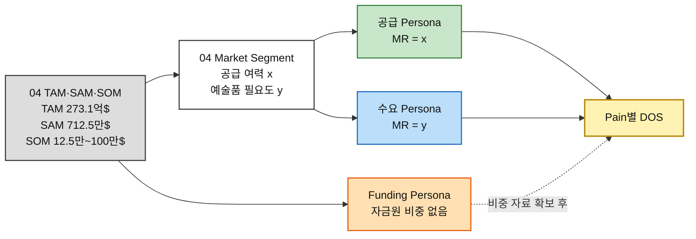
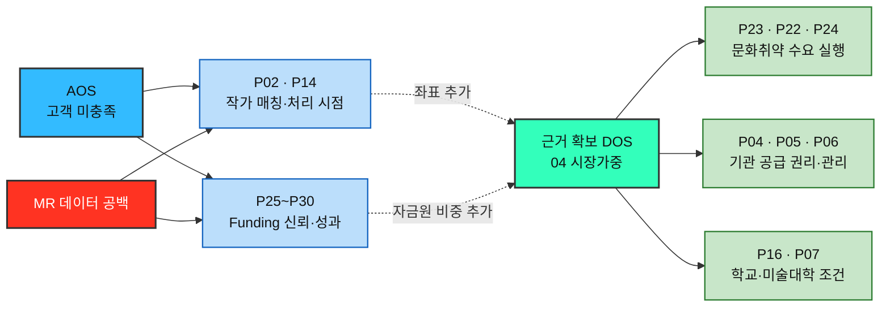

# 시장 가중형 기회점수(DOS) 분석 ③ — 예술품 재분배 플랫폼

> [분석 방법론 §4](./분석-방법론.md) · 입력 [AOS 분석 ③](./분석-03-예술품-재분배-플랫폼.md) · [평가 대상 36개](./평가대상-03-대표-페인포인트.md) · 모수 근거 [챕터 04 TAM-SAM-SOM](../04-tam-sam-som/분석-03-예술품-재분배-플랫폼.md)

> 📊 **산출.** **DOS = (Importance − Satisfaction) × Market Relevance** 를 **SAM 기준**과 **SOM 기준**으로 계산한다. 단, 이번에는 MR 숫자를 새로 만들지 않고 **챕터 04에 실제로 존재하는 TAM·SAM·SOM 수치와 Market Segment 좌표만 사용**한다.
>
> ⚠️ **Importance·Satisfaction은 AOS 분석의 값을 그대로 승계**하며 인터뷰 없는 가설 점수다. 또한 04에 Persona별 MR 근거가 없는 작가·Funding 항목은 **정량 DOS를 억지로 만들지 않고 미산출로 남긴다.** 근거 등급은 §7 참조.

---

## 0. Market Relevance 정의

### 모수를 SAM으로 잡고 SOM을 병기하는 이유

| 모수 | 판정 | 사유 |
|---|:---:|---|
| **TAM** — 미국 예술·문화·인문 연간 기부금 **273.1억 달러** | ❌ Pain별 MR 직접 계산에는 사용하지 않음 | 이 사업의 1차 시장 앵커는 맞지만 개인 작가·미술관·학교·NGO·개인기부·기업기부별 상대 비중이 분해되어 있지 않다. Pain별 MR로 바로 쓰면 모든 항목이 같은 시장값을 받는다 |
| **SAM** — **712.5만 달러/년** | ✅ **기본** | `285개 참여 가능 기관 × 연 1건 × $25,000/건`으로 서비스 가능한 범위를 상향식 계산했다. Market Segment의 공급여력·예술품 필요도 좌표도 같은 04 안에 있어 Pain과 시장 접점을 연결할 수 있다 |
| **SOM** — **12.5만~100만 달러**, 기본 **37.5만 달러** | ✅ **병기** | 기본 SOM은 SAM의 **5.3%**다. 다만 04에는 세그먼트별 SOM 포착률이 따로 없으므로, 현재 자료만으로는 SAM과 다른 Persona 순위를 만들 수 없다 |

### 달러만으로는 Pain별 MR이 나오지 않는다

04의 TAM·SAM·SOM은 **기부·이전비용의 달러 시장**이고, Market Segment는 **공급 여력 × 예술품 필요도**의 0~1 좌표다. 따라서 이번 DOS에서는 두 자료를 다음처럼 연결한다.



**공급자는 x축(공급 여력), 수요자는 y축(예술품 필요도)을 MR proxy로 사용한다.** 이 값은 시장점유율이 아니라 04에서 이미 만들어진 **세그먼트 우선순위 좌표**다. 따라서 DOS도 절대 시장가치가 아니라 **AOS에 04의 시장 우선순위를 결합한 상대 점수**로 읽는다.

### MR 부여 규칙 세 가지

| # | 규칙 | 이유 |
|---|---|---|
| **1** | **04에 실제 좌표가 있는 세그먼트만 정량화한다** | 이번 재산출의 핵심은 임의 MR 제거다. 작가·개인기부·기업기부처럼 04에 상대 비중/좌표가 없는 항목은 숫자를 만들지 않는다 |
| **2** | **공급 MR = x, 수요 MR = y** | 04 Market Segment의 축 정의를 그대로 사용한다. 공급자의 시장 접점은 공급 여력, 수요자의 시장 접점은 예술품 필요도다 |
| **3** | **복합·포괄 Persona는 보수값을 쓴다** | 문화취약지역 학교는 `농어촌 교육기관 y=0.77`과 `문화취약지역 y=0.88` 사이에서 **0.77**, 일반 작품 보유기관은 `기업 소장품 x=0.83`과 `대형 미술관 x=0.89` 사이에서 **0.83**을 사용한다. 범위의 낮은 값을 써서 과대평가를 피한다 |

### SOM 포착률 — 층마다 다른 시장을 새로 만들지 않는다

04의 SOM은 세그먼트별 구성비가 아니라 **전체 SAM에서 초기 3년 내 포착할 수 있는 규모**를 세 시나리오로 제시한다.

| SOM 시나리오 | 연간 조성 기부금 | SAM 대비 포착률 |
|---|---:|:---:|
| 보수적 | **$125,000** | **1.75%** |
| **기본** | **$375,000** | **5.26%** |
| 낙관적 | **$1,000,000** | **14.04%** |

이번 표의 SOM MR은 기본안으로 다음처럼 계산한다.

```text
SOM MR = SAM MR × (375,000 / 7,125,000)
       = SAM MR × 0.05263
```

> 📌 **그래서 SAM과 SOM의 순위는 동일하다.** 04가 Persona/세그먼트별 SOM 획득률을 따로 주지 않았기 때문이다. 강제로 다른 순위를 만들려면 `학교 10% · 미술관 3% · 갤러리 7%` 같은 새 숫자를 추가해야 하는데, 이번 문서에서는 그렇게 하지 않는다.

### 인물별 Market Relevance

| 인물 | 04의 연결 세그먼트 | **SAM MR** | **SOM MR(기본)** | 판정 |
|---|---|:---:|:---:|---|
| 미술관 컬렉션 담당 박소연 | 대형 미술관 — 공급 여력 x=0.89 | **0.89** | 0.0468 | 직접 |
| 미술대학 작품관리 담당 한유진 | 미술대학 — 공급 여력 x=0.73 | **0.73** | 0.0384 | 직접 |
| 갤러리 작품관리 담당 윤태호 | 상업 갤러리 — 공급 여력 x=0.79 | **0.79** | 0.0416 | 직접 |
| 문화취약지역 학교 담당 이지현 | 농어촌 교육기관 y=0.77 ↔ 문화취약지역 y=0.88 | **0.77** | 0.0405 | **보수값** |
| 지역 문화시설 담당 오수진 | 지역 문화센터 — 예술품 필요도 y=0.64 | **0.64** | 0.0337 | 직접 |
| 문화취약지역 NGO 담당 김도현 | 문화취약지역 — 예술품 필요도 y=0.88 | **0.88** | 0.0463 | 직접 |
| 작품 보유기관 담당 서재원 | 기업 소장품 x=0.83 ↔ 대형 미술관 x=0.89 | **0.83** | 0.0437 | **proxy 보수값** |
| 독립 작가 김서윤 | 3면 시장에는 작가·예술가가 있으나 2×2 좌표 없음 | **미산출** | **미산출** | 추가 자료 필요 |
| 신진 작가 임하늘 | 3면 시장에는 작가·예술가가 있으나 2×2 좌표 없음 | **미산출** | **미산출** | 추가 자료 필요 |
| 개인 기부자 정민준 | Funding 시장은 있으나 개인기부 비중 없음 | **미산출** | **미산출** | 자금원 구성비 필요 |
| 기업 CSR·ESG 담당 최은영 | Funding 시장은 있으나 기업기부 비중 없음 | **미산출** | **미산출** | 자금원 구성비 필요 |
| 최종 향유 학생 박하린 | 최종 수혜자 | *산출 제외* | *산출 제외* | 성과 판정 트랙 |

> 📌 **이 표가 이전 버전과 가장 크게 달라진 점이다.** `0.85, 0.70, 0.45` 같은 새 MR을 임의로 만들지 않았다. **04에 좌표가 없으면 미산출**, 좌표가 있으면 그 숫자를 그대로 사용한다.

---

## 1. DOS Table — SAM 기준 (확장성)

**DOS = (Importance − Satisfaction) × SAM MR** · 04에서 MR 근거를 확보한 **21개**만 내림차순

| 순위 | ID | 인물 | Pain Point (요약) | Imp−Sat | MR | **DOS** |
|:---:|---|---|---|:---:|:---:|:---:|
| 1 | **P23** | 문화취약지역 NGO 담당 김도현 | 작품 매칭과 비용조성이 따로 놀면 프로젝트가 멈춘다 | 4 | 0.88 | **3.52** |
| 2 | **P04** | 미술관 컬렉션 담당 박소연 | 권리·책임이 하나라도 불명확하면 진행이 멈춘다 | 3 | 0.89 | **2.67** |
| 3 | **P22** | 문화취약지역 NGO 담당 김도현 | 수요가 있어도 공급망이 없다 | 3 | 0.88 | **2.64** |
| 3 | **P24** | 문화취약지역 NGO 담당 김도현 | 현장 상황 변화가 최종 배송을 막을 수 있다 | 3 | 0.88 | **2.64** |
| 5 | **P16** | 문화취약지역 학교 담당 이지현 | 공간 적합성과 관리조건을 판단하기 어렵다 | 3 | 0.77 | **2.31** |
| 6 | **P07** | 미술대학 작품관리 담당 한유진 | 학생별 동의 수집이 반복 업무가 된다 | 3 | 0.73 | **2.19** |
| 7 | **P19** | 지역 문화시설 담당 오수진 | 공간이 있어도 작품 확보 루트가 제한적이다 | 3 | 0.64 | **1.92** |
| 8 | **P05** | 미술관 컬렉션 담당 박소연 | 수요기관의 관리 역량을 확인하기 어렵다 | 2 | 0.89 | **1.78** |
| 8 | **P06** | 미술관 컬렉션 담당 박소연 | 훼손·분실 시 책임과 보험 범위가 불명확할 수 있다 | 2 | 0.89 | **1.78** |
| 10 | **P32** | 작품 보유기관 담당 서재원 | 권리와 책임이 불명확하면 여기서 여정이 끝난다 | 2 | 0.83 | **1.66** |
| 11 | **P10** | 갤러리 작품관리 담당 윤태호 | 권리관계가 복잡하면 바로 중단된다 | 2 | 0.79 | **1.58** |
| 11 | **P11** | 갤러리 작품관리 담당 윤태호 | 설치 맥락이 불명확하면 작가 동의를 받기 어렵다 | 2 | 0.79 | **1.58** |
| 13 | **P17** | 문화취약지역 학교 담당 이지현 | 수령·설치 역할이 불명확하면 마지막에 지연된다 | 2 | 0.77 | **1.54** |
| 14 | **P08** | 미술대학 작품관리 담당 한유진 | 대량 등록이 불가능하면 사용 자체가 어렵다 | 2 | 0.73 | **1.46** |
| 15 | **P18** | 문화취약지역 학교 담당 이지현 | 작품만 걸어두면 교육적 활용이 제한될 수 있다 | 1 | 0.77 | **0.77** |
| 16 | **P09** | 미술대학 작품관리 담당 한유진 | 학교·학생·수령기관 사이 책임이 분산된다 | 1 | 0.73 | **0.73** |
| 17 | **P20** | 지역 문화시설 담당 오수진 | 관리 난이도가 보이지 않으면 신청하기 어렵다 | 1 | 0.64 | **0.64** |
| 18 | **P12** | 갤러리 작품관리 담당 윤태호 | 승인 주체가 둘 이상이면 의사결정이 느려진다 | 0 | 0.79 | **0.00** |
| 18 | **P21** | 지역 문화시설 담당 오수진 | 시설 운영 일정과 배송 일정이 충돌할 수 있다 | 0 | 0.64 | **0.00** |
| 18 | **P33** | 작품 보유기관 담당 서재원 | 부서별 요구자료가 다르면 검토비용이 커진다 | 0 | 0.83 | **0.00** |
| 21 | **P31** | 작품 보유기관 담당 서재원 | 참여 조건이 복잡하면 검토 자체를 미룬다 | -1 | 0.83 | **-0.83** |

**SAM 기준 DOS 총합 30.58** · 양수 17개 · 0 3개 · 음수 1개

> ⚠️ **총합은 시장 규모가 아니다.** x/y 좌표가 시장점유율이 아니라 세그먼트 우선순위 점수이므로, 이 합계는 같은 규칙 아래에서 상대 비교하는 내부 지표일 뿐이다.
>
> ⚠️ **AOS 상위인 P02·P14·P25~P30이 표에서 빠졌다고 중요하지 않은 것이 아니다.** 04에서 그 Persona의 MR을 계산할 숫자가 없어서 **시장가중 순위를 보류**한 것이다.

---

## 2. DOS Table — SOM 기준 (3년 기본 시나리오)

**DOS = (Importance − Satisfaction) × SOM MR** · `SOM MR = SAM MR × 5.263%`

| 순위 | ID | 인물 | Pain Point (요약) | Imp−Sat | MR | **DOS** |
|:---:|---|---|---|:---:|:---:|:---:|
| 1 | **P23** | 문화취약지역 NGO 담당 김도현 | 작품 매칭과 비용조성이 따로 놀면 프로젝트가 멈춘다 | 4 | 0.0463 | **0.185** |
| 2 | **P04** | 미술관 컬렉션 담당 박소연 | 권리·책임이 하나라도 불명확하면 진행이 멈춘다 | 3 | 0.0468 | **0.141** |
| 3 | **P22** | 문화취약지역 NGO 담당 김도현 | 수요가 있어도 공급망이 없다 | 3 | 0.0463 | **0.139** |
| 3 | **P24** | 문화취약지역 NGO 담당 김도현 | 현장 상황 변화가 최종 배송을 막을 수 있다 | 3 | 0.0463 | **0.139** |
| 5 | **P16** | 문화취약지역 학교 담당 이지현 | 공간 적합성과 관리조건을 판단하기 어렵다 | 3 | 0.0405 | **0.122** |
| 6 | **P07** | 미술대학 작품관리 담당 한유진 | 학생별 동의 수집이 반복 업무가 된다 | 3 | 0.0384 | **0.115** |
| 7 | **P19** | 지역 문화시설 담당 오수진 | 공간이 있어도 작품 확보 루트가 제한적이다 | 3 | 0.0337 | **0.101** |
| 8 | **P05** | 미술관 컬렉션 담당 박소연 | 수요기관의 관리 역량을 확인하기 어렵다 | 2 | 0.0468 | **0.094** |
| 8 | **P06** | 미술관 컬렉션 담당 박소연 | 훼손·분실 시 책임과 보험 범위가 불명확할 수 있다 | 2 | 0.0468 | **0.094** |
| 10 | **P32** | 작품 보유기관 담당 서재원 | 권리와 책임이 불명확하면 여기서 여정이 끝난다 | 2 | 0.0437 | **0.087** |
| 11 | **P10** | 갤러리 작품관리 담당 윤태호 | 권리관계가 복잡하면 바로 중단된다 | 2 | 0.0416 | **0.083** |
| 11 | **P11** | 갤러리 작품관리 담당 윤태호 | 설치 맥락이 불명확하면 작가 동의를 받기 어렵다 | 2 | 0.0416 | **0.083** |
| 13 | **P17** | 문화취약지역 학교 담당 이지현 | 수령·설치 역할이 불명확하면 마지막에 지연된다 | 2 | 0.0405 | **0.081** |
| 14 | **P08** | 미술대학 작품관리 담당 한유진 | 대량 등록이 불가능하면 사용 자체가 어렵다 | 2 | 0.0384 | **0.077** |
| 15 | **P18** | 문화취약지역 학교 담당 이지현 | 작품만 걸어두면 교육적 활용이 제한될 수 있다 | 1 | 0.0405 | **0.041** |
| 16 | **P09** | 미술대학 작품관리 담당 한유진 | 학교·학생·수령기관 사이 책임이 분산된다 | 1 | 0.0384 | **0.038** |
| 17 | **P20** | 지역 문화시설 담당 오수진 | 관리 난이도가 보이지 않으면 신청하기 어렵다 | 1 | 0.0337 | **0.034** |
| 18 | **P12** | 갤러리 작품관리 담당 윤태호 | 승인 주체가 둘 이상이면 의사결정이 느려진다 | 0 | 0.0416 | **0.000** |
| 18 | **P21** | 지역 문화시설 담당 오수진 | 시설 운영 일정과 배송 일정이 충돌할 수 있다 | 0 | 0.0337 | **0.000** |
| 18 | **P33** | 작품 보유기관 담당 서재원 | 부서별 요구자료가 다르면 검토비용이 커진다 | 0 | 0.0437 | **0.000** |
| 21 | **P31** | 작품 보유기관 담당 서재원 | 참여 조건이 복잡하면 검토 자체를 미룬다 | -1 | 0.0437 | **-0.044** |

**SOM 기준 DOS 총합 1.610**

> 📌 **순위는 SAM과 완전히 동일하다.** 04의 SOM이 모든 세그먼트에 동일한 전체 포착률 5.3%만 제공하기 때문이다. 현재 자료만으로 SOM에서 “초기에 학교가 더 쉽다 / 미술관이 더 어렵다” 같은 차등 숫자를 만들 근거는 없다.

---

## 3. 두 순위 대조

### 상위 10 나란히 보기

| 순위 | **SAM 기준 (확장성)** | DOS | **SOM 기준 (기본 시나리오)** | DOS |
|:---:|---|:---:|---|:---:|
| 1 | P23 작품 매칭과 비용조성이 따로 놀면 프로젝트가 멈춘다 | 3.52 | P23 작품 매칭과 비용조성이 따로 놀면 프로젝트가 멈춘다 | 0.185 |
| 2 | P04 권리·책임이 하나라도 불명확하면 진행이 멈춘다 | 2.67 | P04 권리·책임이 하나라도 불명확하면 진행이 멈춘다 | 0.141 |
| 3 | P22 수요가 있어도 공급망이 없다 | 2.64 | P22 수요가 있어도 공급망이 없다 | 0.139 |
| 4 | P24 현장 상황 변화가 최종 배송을 막을 수 있다 | 2.64 | P24 현장 상황 변화가 최종 배송을 막을 수 있다 | 0.139 |
| 5 | P16 공간 적합성과 관리조건을 판단하기 어렵다 | 2.31 | P16 공간 적합성과 관리조건을 판단하기 어렵다 | 0.122 |
| 6 | P07 학생별 동의 수집이 반복 업무가 된다 | 2.19 | P07 학생별 동의 수집이 반복 업무가 된다 | 0.115 |
| 7 | P19 공간이 있어도 작품 확보 루트가 제한적이다 | 1.92 | P19 공간이 있어도 작품 확보 루트가 제한적이다 | 0.101 |
| 8 | P05 수요기관의 관리 역량을 확인하기 어렵다 | 1.78 | P05 수요기관의 관리 역량을 확인하기 어렵다 | 0.094 |
| 9 | P06 훼손·분실 시 책임과 보험 범위가 불명확할 수 있다 | 1.78 | P06 훼손·분실 시 책임과 보험 범위가 불명확할 수 있다 | 0.094 |
| 10 | P32 권리와 책임이 불명확하면 여기서 여정이 끝난다 | 1.66 | P32 권리와 책임이 불명확하면 여기서 여정이 끝난다 | 0.087 |

### 이동 폭이 큰 항목

| 항목 | SAM 순위 | SOM 순위 | 해석 |
|---|:---:|:---:|---|
| **순위 이동 없음** | 동일 | 동일 | 04의 SOM은 세그먼트별 포착률을 따로 주지 않고 전체 기본안이 SAM의 5.3%라고만 제시한다. 동일 계수를 전 세그먼트에 곱했기 때문에 순위는 바뀌지 않는다. |

> 📌 이번에는 **순위가 안 움직이는 것이 결론**이다. 강사 식량 사례는 SAM과 SOM의 자금원 구성비가 달라 순위가 바뀌었지만, 예술품 04는 `SOM 전체 = SAM의 5.3%`만 있고 **세그먼트별 SOM 구성비가 없다.**
>
> 따라서 **초기 실행 순서를 DOS만으로 따로 만들고 싶다면** `세그먼트별 실제 획득률` 또는 `파일럿 참여율`을 추가 조사해야 한다. 그 전에는 AOS와 CJM의 실행 마찰을 함께 읽는 편이 더 정확하다.

---

## 4. AOS와 무엇이 달라졌나

DOS는 AOS의 미충족 강도에 **04의 세그먼트 우선순위**를 곱한다. 그래서 AOS가 비슷해도 최우선 수요·공급 거점에 닿는 Pain이 더 올라간다. 반대로 **MR 근거가 없는 Pain은 순위를 억지로 만들지 않는다.**

| ID | AOS | AOS 순위 | SAM DOS | SOM DOS | 무슨 일이 있었나 |
|---|:---:|:---:|:---:|:---:|---|
| **P23** 작품 매칭과 비용조성이 따로 놀면 프로젝트가 멈춘다 | 4.0 | 1위 | 3.52 (1위) | 0.185 (1위) | AOS 공동 1위이면서 04의 최우선 수요 세그먼트(문화취약지역 y=0.88)에 직접 연결되어 DOS도 1위 |
| **P04** 권리·책임이 하나라도 불명확하면 진행이 멈춘다 | 3.0 | 4위 | 2.67 (2위) | 0.141 (2위) | AOS 4위권이지만 대형 미술관 공급 여력 x=0.89가 적용되어 DOS 2위로 상승 |
| **P16** 공간 적합성과 관리조건을 판단하기 어렵다 | 3.0 | 4위 | 2.31 (5위) | 0.122 (5위) | 학교 수요가 04의 최우선 지원시장과 직접 연결되어 상위 유지 |
| **P07** 학생별 동의 수집이 반복 업무가 된다 | 3.0 | 4위 | 2.19 (6위) | 0.115 (6위) | 미술대학 공급 x=0.73이 반영되어 상위권 유지 |
| **P19** 공간이 있어도 작품 확보 루트가 제한적이다 | 3.0 | 4위 | 1.92 (7위) | 0.101 (7위) | Pain은 높지만 지역 문화센터 y=0.64라 최우선 수요보다 시장가중이 낮음 |
| **P32** 권리와 책임이 불명확하면 여기서 여정이 끝난다 | 2.0 | 20위 | 1.66 (10위) | 0.087 (10위) | AOS는 중간이지만 기관 공급 Gate라 Q4 공급 거점 proxy가 적용되어 DOS 상위 10권 |
| **P02** 수요가 있는지, 언제 연결될지 보이지 않는다 | 4.0 | 1위 | — | — | 04의 3면 시장에는 작가·예술가가 있으나 2×2 Market Segment 좌표가 없어 MR을 만들 수 없음 |
| **P14** 대기 기한을 모르면 폐기로 전환할 수 있다 | 4.0 | 1위 | — | — | 04의 3면 시장에는 작가·예술가가 있으나 2×2 Market Segment 좌표가 없어 MR을 만들 수 없음 |
| **P25** 총 모금액만 보이고 비용 구성이 없으면 신뢰하기 어렵다 | 3.0 | 4위 | — | — | 04의 TAM은 기부금 시장을 앵커로 쓰지만 개인/기업 Funding의 상대 비중을 제시하지 않아 MR 분해 불가 |
| **P34** 예술작품을 일상적으로 접할 기회가 제한적이다 | 3.0 | 4위 | — | — | 최종 향유자는 직접 시장 행위자가 아니므로 DOS 산출 제외 |

> 📌 **P23은 가장 견고하다.** AOS 공동 1위이고, 문화취약지역의 예술품 필요도 y=0.88이 직접 적용되어 SAM DOS도 1위다.
>
> 📌 **P04는 AOS보다 DOS에서 더 올라간다.** 대형 미술관이 04에서 공급 거점 시장(x=0.89)으로 잡혀 있기 때문이다.
>
> 📌 반대로 **P02·P14는 AOS 공동 1위지만 DOS 미산출**이다. 독립·신진 작가는 04의 3면 공급시장에는 존재하지만 2×2 좌표가 없다. **없는 숫자를 만들어서 순위를 매기지 않는 것이 이번 재산출의 핵심이다.**

---

## 5. 음수·0 항목의 해석

### 음수 1개 — 과잉 충족 신호

| ID | Imp | Sat | Imp−Sat | 의미 |
|---|:---:|:---:|:---:|---|
| **P31** 참여 조건이 복잡하면 검토 자체를 미룬다 | 3 | 4 | -1 | 기존 보관·내부 검토가 기관의 위험 회피 Goal을 이미 상당히 충족하는 신호. 참여 유도 자체보다 P32의 권리·책임 Gate를 먼저 봐야 한다. |

> 📌 **P31은 AOS에서도 낮았고 DOS에서는 음수가 된다.** 시장 접점은 작지 않지만(기관 공급 proxy 0.83), Persona 관점에서는 `참여 조건 검토`가 Importance 3 / Satisfaction 4다. **큰 시장에 닿는다고 해서 이미 충족된 문제를 다시 풀 필요는 없다.**

### 0·미산출 항목 — 세 가지를 구분한다

| 유형 | ID | 왜 0/미산출/제외인가 | 어떻게 다뤄야 하나 |
|---|---|---|---|
| **Imp−Sat = 0** | P12 · P21 · P33 | 시장 좌표는 있으나 미충족 격차가 0 | **위생 요건.** DOS 0이라고 기능 가치가 0인 것은 아님 |
| **MR 미산출 — 작가** | P02 · P14 · P13 · P01 · P03 · P15 | 04 시장 구조에는 작가가 있으나 2×2 세그먼트 좌표가 없음 | **AOS 유지 + MR 추가조사.** 임의 숫자를 넣지 않는다 |
| **MR 미산출 — Funding** | P25 · P26 · P27 · P29 · P30 · P28 | 04는 기부금 총시장·SAM·SOM은 제시하지만 개인/기업 Funding 비중을 분해하지 않음 | **AOS 유지 + 자금원 구성비 조사 후 DOS 계산** |
| **DOS 산출 제외 — 수혜형** | P34 · P36 · P35 | 최종 향유자는 공급·수요 신청·Funding 의사결정자가 아님 | **성과 판정 트랙.** 문화예술 접근성과 실제 향유 성과로 관리 |

> ⚠️ **0, 미산출, 제외는 전혀 다른 뜻이다.**
>
> - **0** — MR은 있지만 `Importance − Satisfaction = 0`
> - **미산출** — Pain은 유효하지만 04에 MR을 계산할 숫자가 없음
> - **제외** — DOS라는 자의 측정 대상이 아닌 최종 성과 Persona
>
> 특히 **Funding 6개(P25~P30)**는 TAM·SAM·SOM의 돈과 가장 직접적으로 연결되지만, 04가 개인·기업·재단별 구성비를 공개하지 않는다. 이 6개를 제대로 DOS에 넣으려면 **자금원별 비중**을 추가해야 한다.

---

## 6. 인물 단위 합계

| 인물 | Pain 3개 합 (SAM) | Pain 3개 합 (SOM) |
|---|:---:|:---:|
| 문화취약지역 NGO 담당 김도현 | **8.80** 1위 | **0.463** 1위 |
| 미술관 컬렉션 담당 박소연 | **6.23** 2위 | **0.329** 2위 |
| 문화취약지역 학교 담당 이지현 | **4.62** 3위 | **0.244** 3위 |
| 미술대학 작품관리 담당 한유진 | 4.38 4위 | 0.230 4위 |
| 갤러리 작품관리 담당 윤태호 | 3.16 5위 | 0.166 5위 |
| 지역 문화시설 담당 오수진 | 2.56 6위 | 0.135 6위 |
| 작품 보유기관 담당 서재원 | 0.83 7위 | 0.043 7위 |

> 📌 **김도현이 1위다.** P22·P23·P24 세 Pain이 모두 문화취약지역 y=0.88에 걸려 있고, 그중 P23은 미충족 격차도 4로 가장 크다.
>
> 📌 **박소연이 2위다.** 04에서 대형 미술관이 공급 여력 x=0.89의 공급 거점으로 잡혀 있어 권리·관리·보험 Pain이 시장가중 후 강하게 남는다.
>
> 📌 **이 합계 역시 7명만의 부분 순위다.** 김서윤·임하늘·정민준·최은영은 MR이 없어서 빠졌고, 박하린은 성과 트랙으로 제외했다. 따라서 “전체 Persona 순위”라고 부르면 안 된다.

---

## 7. 근거 등급

| 구성 요소 | 등급 | 비고 |
|---|---|---|
| DOS 계산식 | **(확인)** | `DOS = (Importance − Satisfaction) × Market Relevance` |
| TAM 273.1억 달러 | **(리서치 근거)** | Giving USA 2026을 사용한 04의 1차 자금시장 앵커 |
| 글로벌 미술시장 596억 달러 | **(리서치 근거)** | Art Basel & UBS. 배경 맥락 앵커이며 DOS 직접 MR에는 사용하지 않음 |
| SAM 712.5만 달러 | **(가정 포함 계산)** | `285개 기관 × 연 1건 × $25,000`. 285개는 Art Bridges proxy, $25,000은 SRS 목업 예시값 |
| SOM 12.5만~100만 달러 | **(시나리오 가정)** | 보수·기본·낙관 3안. 기본 37.5만 달러 = SAM의 5.3% |
| Market Segment x/y 좌표 | **(선행 분석값)** | 04의 2×2 매트릭스 값. 시장점유율이 아니라 세그먼트 우선순위 좌표 |
| **공급 MR=x / 수요 MR=y** | **(분석 규칙)** | 04 축 정의를 Pain 시장가중에 연결하기 위한 규칙. 새 숫자를 만들지는 않음 |
| 이지현 MR 0.77 | **(보수적 매핑)** | 농어촌 교육기관 0.77 ↔ 문화취약지역 0.88 중 낮은 값 |
| 서재원 MR 0.83 | **(proxy 보수적 매핑)** | 기업 소장품 0.83 ↔ 대형 미술관 0.89 중 낮은 값 |
| 작가·Funding MR | **미확인** | 04에 2×2 좌표 또는 자금원별 비중이 없어 산출하지 않음 |
| Importance · Satisfaction 36개 | **(가정)** | AOS 분석에서 승계. 인터뷰·설문 없음 |
| SOM 순위가 SAM과 동일 | **(계산 결과)** | 모든 정량 세그먼트에 동일한 5.263% 포착률을 적용했기 때문 |

> ⚠️ **이 DOS는 이전 버전보다 숫자가 적지만 근거는 더 강하다.** 36개 전부에 억지로 MR을 붙이는 대신, 04가 실제로 지원하는 범위만 계산했다.
>
> **현재 가장 큰 데이터 공백은 두 개다.** ① 작가·예술가 공급 세그먼트의 공급 여력 좌표, ② 개인·기업·재단 등 Funding 자금원별 SAM/SOM 구성비. 이 둘이 채워지면 나머지 12개 Pain도 같은 규칙으로 추가 계산할 수 있다.
>
> ⚠️ **SAM 자체에도 가정이 있다.** `$25,000/프로젝트`는 SRS 목업 예시값이고, 285개 기관 전원 연 1회 참여 역시 현실적 상한 proxy다. DOS가 정교해 보여도 입력시장 자체가 가정이라는 점을 잊으면 안 된다.

---

## 8. 결론 — 두 개의 목록으로 읽는다



| 질문 | 답 |
|---|---|
| **04 근거만으로 DOS가 가장 높은 것은** | **P23 작품 매칭과 비용조성이 따로 놀면 프로젝트가 멈춤**. 문화취약지역 y=0.88 × 미충족 격차 4 → **SAM DOS 3.52** |
| **확장 시장에서 함께 강한 것은** | **P04 기관 권리·책임(2.67), P22·P24 문화취약 수요 공급망/배송(각 2.64), P16 학교 공간·관리(2.31), P07 미술대학 동의(2.19)** |
| **AOS는 높은데 DOS를 아직 못 매기는 것은** | **P02·P14 작가 Pain**, **P25~P30 Funding Pain**. 중요도가 낮아서가 아니라 **04에 MR 숫자가 없어서 보류** |
| **SAM과 SOM 순위가 왜 같은가** | 04가 세그먼트별 SOM 획득률을 주지 않고 기본안 전체가 SAM의 5.3%라고만 제시하기 때문. 동일 비율을 곱하면 순위는 변하지 않는다 |
| **DOS로 재면 안 되는 것은** | **P34·P35·P36 최종 향유자**. 문화예술 접근성·향유 성과 트랙에서 별도로 본다 |

### 다음 단계

| 순위 | 할 일 | 이유 |
|:---:|---|---|
| **1** | **Funding 구성비 확보** — 개인·기업·재단이 SAM/SOM에서 차지하는 비중 | P25~P30 6개가 TAM·SAM·SOM의 자금시장과 직접 연결되지만 현재 MR을 계산할 수 없다 |
| **2** | **작가 공급 세그먼트 좌표 추가** — 독립·신진 작가의 공급 여력 | AOS 공동 1위 P02·P14를 DOS에 넣기 위한 필수 입력 |
| **3** | **세그먼트별 SOM 포착률 실측** | 현재는 모든 세그먼트에 5.3%를 동일 적용해 SAM/SOM 순위가 같다. 파일럿 참여율·전환율이 있어야 초기 실행 순서가 분리된다 |
| **4** | **기존 21개 DOS는 JTBD 우선순위의 보조자료로 사용** | P23·P04·P22·P24·P16·P07은 AOS와 04 시장근거가 동시에 있는 현재 가장 방어 가능한 검증 후보 |
