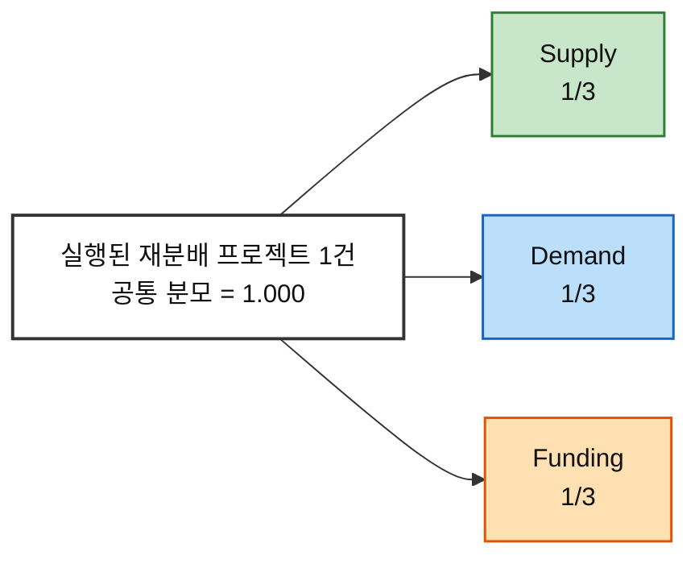

# 시장 가중형 기회점수(DOS) 분석 ③ — 예술품 재분배 플랫폼

> [분석 방법론 §4](./분석-방법론.md) · 입력 [AOS 분석 ③](./분석-03-예술품-재분배-플랫폼.md) · [평가 대상 36개](./평가대상-03-대표-페인포인트.md) · 모수 근거 [챕터 04 TAM-SAM-SOM](../04-tam-sam-som/분석-03-예술품-재분배-플랫폼.md)
>
> 📊 **이번 버전의 목적.** 이전 proxy DOS의 서로 다른 분모 문제를 해결하기 위해 **모든 직접 시장 Persona를 하나의 공통 분모인 ‘실행된 재분배 프로젝트 1건’으로 정규화**했다. 최종 향유자 P34~P36은 강사 예시와 동일하게 성과 판정 트랙으로 분리하므로 **정량 DOS 순위는 33개**다.
>
> ⚠️ **이 표는 실측 시장점유율이 아니라 ‘공통분모 정규화 모델’이다.** 공개자료와 04의 선행 세그먼트 값을 사용하되, 특히 `Supply 1/3 · Demand 1/3 · Funding 1/3`과 일부 세그먼트 분할은 **명시적 작업가정**이다. 따라서 1~33위는 비교 가능하지만 ‘실제 시장에서 정확히 이 순위’라고 단정하면 안 된다.

---

## 0. Market Relevance 정의

### 모수를 SAM으로 잡고 SOM을 병기하는 이유

| 모수 | 판정 | 사유 |
|---|:---:|---|
| **TAM** — 미국 예술·문화·인문 연간 기부금 273.1억 달러 | ❌ | 전체 자금 풀은 크지만 현재 12개 Persona의 프로젝트 참여 비중으로 직접 분해되지 않는다 |
| **SAM** — 04의 712.5만 달러/년 | ✅ **확장성** | 04가 정의한 서비스 가능 시장과 Market Segment의 상대 우선순위를 사용해 ‘커졌을 때 어떤 Pain이 많은 프로젝트에 닿는가’를 본다 |
| **SOM** — 기본 37.5만 달러/년 | ✅ **초기 실행** | 초기 공급·수요·Funding은 실제 유사 프로그램의 관측구성을 proxy로 사용해 ‘초기에 어떤 Pain이 실제 프로젝트를 막기 쉬운가’를 본다 |

### 작품 수가 아니라 ‘실행된 재분배 프로젝트 1건’으로 통일한다

이 플랫폼은 **Supply × Demand × Funding**의 3면이 동시에 있어야 프로젝트 1건이 완료된다. 따라서 세 면을 동일한 프로젝트 분모로 맞추기 위해 다음 구조를 사용한다.

```text
전체 프로젝트 관련성 = 1.000

Supply  = 1/3
Demand  = 1/3
Funding = 1/3
```



> **왜 1/3인가.** 이것은 시장 통계가 아니라 **구조적 정규화 규칙**이다. 실행 프로젝트 한 건에는 공급·수요·Funding 세 역할이 모두 필요하므로 어느 한 면의 원자료 단위가 크다는 이유만으로 전체 DOS를 지배하지 않게 동일 가중을 둔다.
>
> 이 한 줄 때문에 이제 `작가 MR 0.16`, `문화시설 MR 0.17`, `개인기부 MR 0.065`는 모두 **‘전체 프로젝트 1건’이라는 같은 스케일** 위에 놓인다.

### MR 부여 규칙 세 가지

| # | 규칙 | 적용 |
|---|---|---|
| **1** | **각 시장 면의 총량을 1/3로 고정** | Supply·Demand·Funding 각각 전체 프로젝트 관련성의 1/3 |
| **2** | **면 내부 구성은 선행분석/관측자료로 나눈다** | SAM: 04 Market Segment + DataArts. SOM: DC Art Bank + MMCA 나눔미술은행 + DataArts 소규모 조직 |
| **3** | **없는 관측값을 사실처럼 쓰지 않고 ‘모델 가정’으로 분리** | SAM의 작가 세그먼트 상한 1.00, SOM에서 DC Art Bank의 조직 2%를 기관형 Persona로 분할하는 부분은 작업가정 |

### 3면 구성비 — 층마다 다르다

**SAM — 확장성 모델**

- **Supply 1/3**: 04의 공급여력 상대점수 `대형 미술관 0.89 · 상업 갤러리 0.79 · 미술대학 0.73 · 기업 소장품 0.83`을 공급 측 내부에서 정규화했다. 04에 좌표가 없는 작가군은 **1.00 작업 상한**으로 두고 김서윤·임하늘이 절반씩 나눈다. 이 1.00은 시장점유율이 아니라 **모델값**이다.
- **Demand 1/3**: 04의 다섯 수요 세그먼트 `문화취약지역 0.88 · 농어촌교육 0.77 · 복지 0.70 · 지역문화센터 0.64 · 중소도시공공시설 0.59` 전체를 분모로 정규화한다. 현재 Persona가 없는 복지·공공시설 몫도 분모에 남겨 과대평가를 막는다.
- **Funding 1/3**: SMU DataArts 2024의 unrestricted contributed revenue 다섯 재원(Trustee·Individual·Corporate·Foundation·Government)의 평균액을 전체 분모로 사용한다. 정민준은 Individual, 최은영은 Corporate에 대응한다.

**SOM — 초기 실행 모델**

- **Supply 1/3**: DC Art Bank FY2025~FY2026 실제 award-dollar에서 개인 작가 $747,197, 조직 $15,075 → **개인 작가 98.0%, 조직 2.0%**. 작가 몫은 김서윤·임하늘이 절반씩, 조직 몫은 04 기관 공급여력 비례로 박소연·한유진·윤태호·서재원에게 분할한다.
- **Demand 1/3**: MMCA 2023 나눔미술은행 선정 10개소를 기능별로 `문화기반·전시 5 / 학교·특수교육 1 / 복지·사회서비스 4`로 재분류해 **50% / 10% / 40%**를 사용한다. 김도현의 40%는 정확한 NGO 점유율이 아니라 **복지·사회서비스/비영리의 광의 proxy**다.
- **Funding 1/3**: DataArts 2024에서 연 예산 $250k 미만 소규모 예술조직의 재원 구성을 사용한다.

### 인물별 Market Relevance

| 인물 | **SAM MR** | **SOM MR** | 주요 근거 |
|---|:---:|:---:|---|
| 독립 작가 김서윤 | **0.039** | **0.163** | SAM 작가군 모델 / SOM DC Art Bank 개인작가 |
| 신진 작가 임하늘 | **0.039** | **0.163** | 동일 |
| 미술관 컬렉션 담당 박소연 | **0.070** | **0.002** | 04 공급여력 / SOM 조직 2%의 모델 분할 |
| 미술대학 작품관리 담당 한유진 | **0.057** | **0.001** | 04 공급여력 / SOM 조직 2%의 모델 분할 |
| 갤러리 작품관리 담당 윤태호 | **0.062** | **0.002** | 04 공급여력 / SOM 조직 2%의 모델 분할 |
| 작품 보유기관 담당 서재원 | **0.065** | **0.002** | 기업소장품 proxy / SOM 조직 2%의 모델 분할 |
| 문화취약지역 학교 담당 이지현 | **0.072** | **0.033** | 04 농어촌교육 / MMCA 학교·특수교육 |
| 지역 문화시설 담당 오수진 | **0.060** | **0.167** | 04 지역문화센터 / MMCA 문화기반·전시 |
| 문화취약지역 NGO 담당 김도현 | **0.082** | **0.133** | 04 문화취약지역 / MMCA 복지·사회서비스 광의 proxy |
| 개인 기부자 정민준 | **0.065** | **0.065** | DataArts 전체 / 소규모 조직 Individual |
| 기업 CSR·ESG 담당 최은영 | **0.012** | **0.024** | DataArts 전체 / 소규모 조직 Corporate |
| 최종 향유 학생 박하린 | *산출 제외* | *산출 제외* | 성과 판정 Persona |

---

## 1. DOS Table — SAM 기준 (확장성)

**DOS = (Importance − Satisfaction) × 공통분모 SAM MR** · 직접 시장 Pain **33개** 내림차순

| 순위 | ID | 인물 | Pain Point (요약) | Imp−Sat | MR | **DOS** |
|:---:|---|---|---|:---:|:---:|:---:|
| 1 | **P23** | 문화취약지역 NGO 담당 김도현 | 작품 매칭과 비용조성이 따로 놀면 프로젝트가 멈춘다 | 4 | 0.082 | **0.328** |
| 2 | **P22** | 문화취약지역 NGO 담당 김도현 | 수요가 있어도 공급망이 없다 | 3 | 0.082 | **0.246** |
| 2 | **P24** | 문화취약지역 NGO 담당 김도현 | 현장 상황 변화가 최종 배송을 막을 수 있다 | 3 | 0.082 | **0.246** |
| 4 | **P16** | 문화취약지역 학교 담당 이지현 | 공간 적합성과 관리조건을 판단하기 어렵다 | 3 | 0.072 | **0.215** |
| 5 | **P04** | 미술관 컬렉션 담당 박소연 | 권리·책임이 하나라도 불명확하면 진행이 멈춘다 | 3 | 0.070 | **0.210** |
| 6 | **P25** | 개인 기부자 정민준 | 총 모금액만 보이고 비용 구성이 없으면 신뢰하기 어렵다 | 3 | 0.065 | **0.196** |
| 6 | **P26** | 개인 기부자 정민준 | 실물 이동은 시간이 걸리는데 중간 신호가 없으면 관계가 끊긴다 | 3 | 0.065 | **0.196** |
| 6 | **P27** | 개인 기부자 정민준 | 전체 성과만 보이면 내 기부와 결과가 연결되지 않는다 | 3 | 0.065 | **0.196** |
| 9 | **P19** | 지역 문화시설 담당 오수진 | 공간이 있어도 작품 확보 루트가 제한적이다 | 3 | 0.060 | **0.179** |
| 10 | **P07** | 미술대학 작품관리 담당 한유진 | 학생별 동의 수집이 반복 업무가 된다 | 3 | 0.057 | **0.172** |
| 11 | **P02** | 독립 작가 김서윤 | 수요가 있는지, 언제 연결될지 보이지 않는다 | 4 | 0.039 | **0.157** |
| 11 | **P14** | 신진 작가 임하늘 | 대기 기한을 모르면 폐기로 전환할 수 있다 | 4 | 0.039 | **0.157** |
| 13 | **P17** | 문화취약지역 학교 담당 이지현 | 수령·설치 역할이 불명확하면 마지막에 지연된다 | 2 | 0.072 | **0.143** |
| 14 | **P05** | 미술관 컬렉션 담당 박소연 | 수요기관의 관리 역량을 확인하기 어렵다 | 2 | 0.070 | **0.140** |
| 14 | **P06** | 미술관 컬렉션 담당 박소연 | 훼손·분실 시 책임과 보험 범위가 불명확할 수 있다 | 2 | 0.070 | **0.140** |
| 16 | **P32** | 작품 보유기관 담당 서재원 | 권리와 책임이 불명확하면 여기서 여정이 끝난다 | 2 | 0.065 | **0.131** |
| 17 | **P10** | 갤러리 작품관리 담당 윤태호 | 권리관계가 복잡하면 바로 중단된다 | 2 | 0.062 | **0.124** |
| 17 | **P11** | 갤러리 작품관리 담당 윤태호 | 설치 맥락이 불명확하면 작가 동의를 받기 어렵다 | 2 | 0.062 | **0.124** |
| 19 | **P13** | 신진 작가 임하늘 | 보관 문제가 곧 창작 공간 문제로 번진다 | 3 | 0.039 | **0.118** |
| 20 | **P08** | 미술대학 작품관리 담당 한유진 | 대량 등록이 불가능하면 사용 자체가 어렵다 | 2 | 0.057 | **0.115** |
| 21 | **P01** | 독립 작가 김서윤 | 재분배 후 활용처가 불명확하면 작품을 내놓기 어렵다 | 2 | 0.039 | **0.079** |
| 21 | **P03** | 독립 작가 김서윤 | 이전 뒤 정보가 끊기면 재분배의 의미를 체감하지 못한다 | 2 | 0.039 | **0.079** |
| 23 | **P18** | 문화취약지역 학교 담당 이지현 | 작품만 걸어두면 교육적 활용이 제한될 수 있다 | 1 | 0.072 | **0.072** |
| 24 | **P20** | 지역 문화시설 담당 오수진 | 관리 난이도가 보이지 않으면 신청하기 어렵다 | 1 | 0.060 | **0.060** |
| 25 | **P09** | 미술대학 작품관리 담당 한유진 | 학교·학생·수령기관 사이 책임이 분산된다 | 1 | 0.057 | **0.057** |
| 26 | **P15** | 신진 작가 임하늘 | 포장·픽업 노동이 추가되면 마지막에 포기할 수 있다 | 1 | 0.039 | **0.039** |
| 27 | **P29** | 기업 CSR·ESG 담당 최은영 | 리스크·정산·성과 근거가 부족하면 내부 승인을 받기 어렵다 | 2 | 0.012 | **0.024** |
| 27 | **P30** | 기업 CSR·ESG 담당 최은영 | 성과 단위가 정리되지 않으면 내부 보고에 쓰기 어렵다 | 2 | 0.012 | **0.024** |
| 29 | **P28** | 기업 CSR·ESG 담당 최은영 | 한 번에 검토할 실사 자료가 없으면 부서별 재요청이 생긴다 | 1 | 0.012 | **0.012** |
| 30 | **P12** | 갤러리 작품관리 담당 윤태호 | 승인 주체가 둘 이상이면 의사결정이 느려진다 | 0 | 0.062 | **0.000** |
| 30 | **P21** | 지역 문화시설 담당 오수진 | 시설 운영 일정과 배송 일정이 충돌할 수 있다 | 0 | 0.060 | **0.000** |
| 30 | **P33** | 작품 보유기관 담당 서재원 | 부서별 요구자료가 다르면 검토비용이 커진다 | 0 | 0.065 | **0.000** |
| 33 | **P31** | 작품 보유기관 담당 서재원 | 참여 조건이 복잡하면 검토 자체를 미룬다 | -1 | 0.065 | **-0.065** |

> 📌 이번 버전에서는 **33개 모두 같은 프로젝트 분모 위에 있기 때문에 순위표로 읽을 수 있다.** 다만 MR이 실측 시장점유율이 아니라 ‘공통분모 정규화 모델’이라는 한계는 그대로다.

---

## 2. DOS Table — SOM 기준 (1년차 실행)

**DOS = (Importance − Satisfaction) × 공통분모 SOM MR** · 직접 시장 Pain **33개** 내림차순

| 순위 | ID | 인물 | Pain Point (요약) | Imp−Sat | MR | **DOS** |
|:---:|---|---|---|:---:|:---:|:---:|
| 1 | **P02** | 독립 작가 김서윤 | 수요가 있는지, 언제 연결될지 보이지 않는다 | 4 | 0.163 | **0.653** |
| 1 | **P14** | 신진 작가 임하늘 | 대기 기한을 모르면 폐기로 전환할 수 있다 | 4 | 0.163 | **0.653** |
| 3 | **P23** | 문화취약지역 NGO 담당 김도현 | 작품 매칭과 비용조성이 따로 놀면 프로젝트가 멈춘다 | 4 | 0.133 | **0.533** |
| 4 | **P19** | 지역 문화시설 담당 오수진 | 공간이 있어도 작품 확보 루트가 제한적이다 | 3 | 0.167 | **0.500** |
| 5 | **P13** | 신진 작가 임하늘 | 보관 문제가 곧 창작 공간 문제로 번진다 | 3 | 0.163 | **0.490** |
| 6 | **P22** | 문화취약지역 NGO 담당 김도현 | 수요가 있어도 공급망이 없다 | 3 | 0.133 | **0.400** |
| 6 | **P24** | 문화취약지역 NGO 담당 김도현 | 현장 상황 변화가 최종 배송을 막을 수 있다 | 3 | 0.133 | **0.400** |
| 8 | **P01** | 독립 작가 김서윤 | 재분배 후 활용처가 불명확하면 작품을 내놓기 어렵다 | 2 | 0.163 | **0.327** |
| 8 | **P03** | 독립 작가 김서윤 | 이전 뒤 정보가 끊기면 재분배의 의미를 체감하지 못한다 | 2 | 0.163 | **0.327** |
| 10 | **P25** | 개인 기부자 정민준 | 총 모금액만 보이고 비용 구성이 없으면 신뢰하기 어렵다 | 3 | 0.065 | **0.195** |
| 10 | **P26** | 개인 기부자 정민준 | 실물 이동은 시간이 걸리는데 중간 신호가 없으면 관계가 끊긴다 | 3 | 0.065 | **0.195** |
| 10 | **P27** | 개인 기부자 정민준 | 전체 성과만 보이면 내 기부와 결과가 연결되지 않는다 | 3 | 0.065 | **0.195** |
| 13 | **P20** | 지역 문화시설 담당 오수진 | 관리 난이도가 보이지 않으면 신청하기 어렵다 | 1 | 0.167 | **0.167** |
| 14 | **P15** | 신진 작가 임하늘 | 포장·픽업 노동이 추가되면 마지막에 포기할 수 있다 | 1 | 0.163 | **0.163** |
| 15 | **P16** | 문화취약지역 학교 담당 이지현 | 공간 적합성과 관리조건을 판단하기 어렵다 | 3 | 0.033 | **0.100** |
| 16 | **P17** | 문화취약지역 학교 담당 이지현 | 수령·설치 역할이 불명확하면 마지막에 지연된다 | 2 | 0.033 | **0.067** |
| 17 | **P29** | 기업 CSR·ESG 담당 최은영 | 리스크·정산·성과 근거가 부족하면 내부 승인을 받기 어렵다 | 2 | 0.024 | **0.048** |
| 17 | **P30** | 기업 CSR·ESG 담당 최은영 | 성과 단위가 정리되지 않으면 내부 보고에 쓰기 어렵다 | 2 | 0.024 | **0.048** |
| 19 | **P18** | 문화취약지역 학교 담당 이지현 | 작품만 걸어두면 교육적 활용이 제한될 수 있다 | 1 | 0.033 | **0.033** |
| 20 | **P28** | 기업 CSR·ESG 담당 최은영 | 한 번에 검토할 실사 자료가 없으면 부서별 재요청이 생긴다 | 1 | 0.024 | **0.024** |
| 21 | **P04** | 미술관 컬렉션 담당 박소연 | 권리·책임이 하나라도 불명확하면 진행이 멈춘다 | 3 | 0.002 | **0.005** |
| 22 | **P07** | 미술대학 작품관리 담당 한유진 | 학생별 동의 수집이 반복 업무가 된다 | 3 | 0.001 | **0.004** |
| 23 | **P05** | 미술관 컬렉션 담당 박소연 | 수요기관의 관리 역량을 확인하기 어렵다 | 2 | 0.002 | **0.004** |
| 23 | **P06** | 미술관 컬렉션 담당 박소연 | 훼손·분실 시 책임과 보험 범위가 불명확할 수 있다 | 2 | 0.002 | **0.004** |
| 25 | **P32** | 작품 보유기관 담당 서재원 | 권리와 책임이 불명확하면 여기서 여정이 끝난다 | 2 | 0.002 | **0.003** |
| 26 | **P10** | 갤러리 작품관리 담당 윤태호 | 권리관계가 복잡하면 바로 중단된다 | 2 | 0.002 | **0.003** |
| 26 | **P11** | 갤러리 작품관리 담당 윤태호 | 설치 맥락이 불명확하면 작가 동의를 받기 어렵다 | 2 | 0.002 | **0.003** |
| 28 | **P08** | 미술대학 작품관리 담당 한유진 | 대량 등록이 불가능하면 사용 자체가 어렵다 | 2 | 0.001 | **0.003** |
| 29 | **P09** | 미술대학 작품관리 담당 한유진 | 학교·학생·수령기관 사이 책임이 분산된다 | 1 | 0.001 | **0.001** |
| 30 | **P12** | 갤러리 작품관리 담당 윤태호 | 승인 주체가 둘 이상이면 의사결정이 느려진다 | 0 | 0.002 | **0.000** |
| 30 | **P21** | 지역 문화시설 담당 오수진 | 시설 운영 일정과 배송 일정이 충돌할 수 있다 | 0 | 0.167 | **0.000** |
| 30 | **P33** | 작품 보유기관 담당 서재원 | 부서별 요구자료가 다르면 검토비용이 커진다 | 0 | 0.002 | **0.000** |
| 33 | **P31** | 작품 보유기관 담당 서재원 | 참여 조건이 복잡하면 검토 자체를 미룬다 | -1 | 0.002 | **-0.002** |

> 📌 SOM은 실제 초기 프로그램의 관측구성을 더 강하게 반영한다. 그래서 DC Art Bank의 작가 중심 공급과 MMCA의 문화·복지 수령구조가 순위에 직접 영향을 준다.

---

## 3. 두 순위 대조

### 상위 10 나란히 보기

| 순위 | **SAM 기준** | DOS | **SOM 기준** | DOS |
|:---:|---|:---:|---|:---:|
| 1 | P23 작품 매칭과 비용조성이 따로 놀면 프로젝트가 멈춘다 | 0.328 | P02 수요가 있는지, 언제 연결될지 보이지 않는다 | 0.653 |
| 2 | P22 수요가 있어도 공급망이 없다 | 0.246 | P14 대기 기한을 모르면 폐기로 전환할 수 있다 | 0.653 |
| 3 | P24 현장 상황 변화가 최종 배송을 막을 수 있다 | 0.246 | P23 작품 매칭과 비용조성이 따로 놀면 프로젝트가 멈춘다 | 0.533 |
| 4 | P16 공간 적합성과 관리조건을 판단하기 어렵다 | 0.215 | P19 공간이 있어도 작품 확보 루트가 제한적이다 | 0.500 |
| 5 | P04 권리·책임이 하나라도 불명확하면 진행이 멈춘다 | 0.210 | P13 보관 문제가 곧 창작 공간 문제로 번진다 | 0.490 |
| 6 | P25 총 모금액만 보이고 비용 구성이 없으면 신뢰하기 어렵다 | 0.196 | P22 수요가 있어도 공급망이 없다 | 0.400 |
| 7 | P26 실물 이동은 시간이 걸리는데 중간 신호가 없으면 관계가 끊긴다 | 0.196 | P24 현장 상황 변화가 최종 배송을 막을 수 있다 | 0.400 |
| 8 | P27 전체 성과만 보이면 내 기부와 결과가 연결되지 않는다 | 0.196 | P01 재분배 후 활용처가 불명확하면 작품을 내놓기 어렵다 | 0.327 |
| 9 | P19 공간이 있어도 작품 확보 루트가 제한적이다 | 0.179 | P03 이전 뒤 정보가 끊기면 재분배의 의미를 체감하지 못한다 | 0.327 |
| 10 | P07 학생별 동의 수집이 반복 업무가 된다 | 0.172 | P25 총 모금액만 보이고 비용 구성이 없으면 신뢰하기 어렵다 | 0.195 |

> 📌 SAM과 SOM 모두 상위 8위 안에 드는 항목은 **P22 · P23 · P24**이다. 공통분모와 실행시나리오를 바꿔도 상대적으로 견고한 후보로 볼 수 있다.

### 이동 폭이 큰 항목

| 항목 | SAM 순위 | SOM 순위 | SOM에서 이동 |
|---|:---:|:---:|:---:|
| **P04** 권리·책임이 하나라도 불명확하면 진행이 멈춘다 | 5 | 21 | ↓ 16 |
| **P13** 보관 문제가 곧 창작 공간 문제로 번진다 | 19 | 5 | ↑ 14 |
| **P01** 재분배 후 활용처가 불명확하면 작품을 내놓기 어렵다 | 21 | 8 | ↑ 13 |
| **P03** 이전 뒤 정보가 끊기면 재분배의 의미를 체감하지 못한다 | 21 | 8 | ↑ 13 |
| **P07** 학생별 동의 수집이 반복 업무가 된다 | 10 | 22 | ↓ 12 |
| **P15** 포장·픽업 노동이 추가되면 마지막에 포기할 수 있다 | 26 | 14 | ↑ 12 |
| **P16** 공간 적합성과 관리조건을 판단하기 어렵다 | 4 | 15 | ↓ 11 |
| **P20** 관리 난이도가 보이지 않으면 신청하기 어렵다 | 24 | 13 | ↑ 11 |
| **P02** 수요가 있는지, 언제 연결될지 보이지 않는다 | 11 | 1 | ↑ 10 |
| **P14** 대기 기한을 모르면 폐기로 전환할 수 있다 | 11 | 1 | ↑ 10 |

> **해석 핵심:** SAM은 시장 확장성 때문에 문화취약 수요·기관 공급·Funding이 상대적으로 올라오고, SOM은 DC Art Bank/나눔미술은행이라는 실제 초기 프로그램 구조 때문에 작가 공급과 문화시설·복지수요가 강하게 올라온다.

---

## 4. AOS와 무엇이 달라졌나

| ID | AOS | SAM DOS | SOM DOS |
|---|:---:|:---:|:---:|
| **P23** 작품 매칭과 비용조성이 따로 놀면 프로젝트가 멈춘다 | 4.0 | 0.328 (1위) | 0.533 (3위) |
| **P02** 수요가 있는지, 언제 연결될지 보이지 않는다 | 4.0 | 0.157 (11위) | 0.653 (1위) |
| **P14** 대기 기한을 모르면 폐기로 전환할 수 있다 | 4.0 | 0.157 (11위) | 0.653 (1위) |
| **P04** 권리·책임이 하나라도 불명확하면 진행이 멈춘다 | 3.0 | 0.210 (5위) | 0.005 (21위) |
| **P19** 공간이 있어도 작품 확보 루트가 제한적이다 | 3.0 | 0.179 (9위) | 0.500 (4위) |
| **P25** 총 모금액만 보이고 비용 구성이 없으면 신뢰하기 어렵다 | 3.0 | 0.196 (6위) | 0.195 (10위) |
| **P29** 리스크·정산·성과 근거가 부족하면 내부 승인을 받기 어렵다 | 2.0 | 0.024 (27위) | 0.048 (17위) |
| **P32** 권리와 책임이 불명확하면 여기서 여정이 끝난다 | 2.0 | 0.131 (16위) | 0.003 (25위) |
| **P34** 예술작품을 일상적으로 접할 기회가 제한적이다 | 3.0 | 제외 | 제외 |

> 📌 **P23**은 AOS 공동 1위이면서 SAM·SOM 모두 상위권이라 가장 안정적이다.
>
> 📌 **P02·P14**는 AOS 공동 1위이고 SOM에서 크게 상승한다. 그러나 이는 초기 공급을 DC Art Bank형 작가 중심 시나리오로 잡은 결과이므로 ‘전체 시장에서도 작가가 절대 1위’라는 의미는 아니다.
>
> 📌 **P04·P32**는 SAM에서는 기관 공급의 확장성 때문에 상대적으로 올라오지만 SOM에서는 크게 내려간다. 이는 초기 실행에서 기관 공급을 DC Art Bank의 조직 비중에 연결한 모델 결과다.

---

## 5. 음수·0 항목의 해석

### 음수 1개 — 과잉 충족 신호

| ID | Imp | Sat | Imp−Sat | SAM DOS | SOM DOS |
|---|:---:|:---:|:---:|:---:|:---:|
| **P31** 참여 조건이 복잡하면 검토 자체를 미룬다 | 3 | 4 | -1 | -0.065 | -0.002 |

> P31은 공통 MR이 있어도 `Importance − Satisfaction = -1`이라 음수가 된다. **시장 범위가 있다고 이미 상대적으로 충족된 문제를 우선 개발해야 하는 것은 아니다.**

### 0인 3개 — 미충족 격차 0

| ID | 인물 | SAM MR | SOM MR | 해석 |
|---|---|:---:|:---:|---|
| **P12** 승인 주체가 둘 이상이면 의사결정이 느려진다 | 갤러리 작품관리 담당 윤태호 | 0.062 | 0.002 | 미충족 격차가 0이므로 DOS=0 |
| **P21** 시설 운영 일정과 배송 일정이 충돌할 수 있다 | 지역 문화시설 담당 오수진 | 0.060 | 0.167 | 미충족 격차가 0이므로 DOS=0 |
| **P33** 부서별 요구자료가 다르면 검토비용이 커진다 | 작품 보유기관 담당 서재원 | 0.065 | 0.002 | 미충족 격차가 0이므로 DOS=0 |

> 0은 MR 부재가 아니라 **Importance와 Satisfaction이 같아 미충족 격차가 0**이라는 뜻이다.

---

## 6. 인물 단위 합계

| 인물 | Pain 3개 합 — SAM | Pain 3개 합 — SOM |
|---|:---:|:---:|
| 문화취약지역 NGO 담당 김도현 | 0.819 (1위) | 1.333 (1위) |
| 개인 기부자 정민준 | 0.588 (2위) | 0.586 (5위) |
| 미술관 컬렉션 담당 박소연 | 0.490 (3위) | 0.013 (8위) |
| 문화취약지역 학교 담당 이지현 | 0.430 (4위) | 0.200 (6위) |
| 미술대학 작품관리 담당 한유진 | 0.344 (5위) | 0.009 (9위) |
| 독립 작가 김서윤 | 0.314 (6위) | 1.307 (2위) |
| 신진 작가 임하늘 | 0.314 (6위) | 1.307 (2위) |
| 갤러리 작품관리 담당 윤태호 | 0.248 (8위) | 0.006 (10위) |
| 지역 문화시설 담당 오수진 | 0.238 (9위) | 0.667 (4위) |
| 작품 보유기관 담당 서재원 | 0.065 (10위) | 0.002 (11위) |
| 기업 CSR·ESG 담당 최은영 | 0.060 (11위) | 0.119 (7위) |

> 인물 합계도 같은 공통분모 위에서 계산되므로 이전 proxy 버전보다 서로 비교하기 쉬워졌다. 다만 Persona별 Pain이 정확히 3개씩 선별된 가설 목록이라는 점과 MR 모델가정은 그대로 남는다.

---

## 7. 근거 등급

| 구성 요소 | 등급 | 비고 |
|---|---|---|
| DOS 계산식 | **방법론** | `DOS = (Importance − Satisfaction) × MR` |
| TAM 273.1억 달러 | **공식 집계 기반** | Giving USA 2026 |
| SAM 712.5만 달러 | **가정 포함 선행분석** | 285기관 × 연1건 × $25,000 |
| Importance·Satisfaction | **가설** | 인터뷰·설문 전 AOS 값 |
| **공통 분모 = 프로젝트 1건** | **분석 규칙** | 3면 시장의 서로 다른 단위를 비교하기 위한 공통 단위 |
| **Supply/Demand/Funding = 각 1/3** | **작업가정** | 통계값 아님. 세 면 모두 없으면 프로젝트가 성립하지 않는다는 구조를 동일 가중으로 정규화 |
| SAM Supply 내부비중 | **선행분석 + 가정** | 04 공급여력 상대값 사용. 작가군 1.00은 모델 상한 |
| SAM Demand 내부비중 | **선행분석 기반** | 04의 5개 수요 y값 전체를 정규화 |
| SAM Funding 내부비중 | **관측자료 기반 proxy** | SMU DataArts 2024 전체 예술·문화 조직 |
| SOM Supply 내부비중 | **관측자료 + 가정** | DC Art Bank 2개년 artist/org 실제 비중 + 조직 몫의 기관형 분할은 모델 |
| SOM Demand 내부비중 | **관측자료 기반 proxy** | MMCA 2023 나눔미술은행 10개소 |
| SOM Funding 내부비중 | **관측자료 기반 proxy** | DataArts 2024 소규모 조직 |
| 33개 통합 순위 | **모델 결과** | 공통분모 덕분에 상호비교 가능하지만 실제 시장점유율 순위는 아님 |
| 수혜형 P34~P36 | **산출 제외** | 직접 시장 Persona가 아니라 Outcome 트랙 |

**리서치 원문**
- SMU DataArts, *National Trends 2025* / Data Tables
- DC Commission on the Arts and Humanities, FY2025·FY2026 Art Bank Program
- 국립현대미술관, 2023·2024 나눔미술은행
- Art Bridges Foundation, Partner Loan Network
- 챕터 04 TAM-SAM-SOM & Market Segment

> ⚠️ **이 모델에서 가장 먼저 검증할 가정은 `1/3·1/3·1/3`과 SAM 작가군 1.00이다.** 실제 파일럿 데이터가 생기면 `프로젝트 공급원 비중 · 수령기관 비중 · Funding source 비중`으로 교체해야 한다.
>
> ⚠️ 따라서 이 파일은 **“강사님처럼 하나의 순위표를 만들기 위한, 근거와 가정을 분리한 공통분모 DOS 모델”**이지 실측 완료본은 아니다.

---

## 8. 결론 — 두 개의 목록으로 읽는다

| 구분 | 상위 기회가 말하는 것 |
|---|---|
| **SAM — 확장성** | 문화취약지역에서 공급망·비용조성·배송을 동시에 성립시키는 문제, 학교 공간·관리 적합성, 기관 공급 권리·책임, 개인 Funding 신뢰 |
| **SOM — 초기 실행** | 작가 작품의 매칭시점·대기기한·보관 압박, 문화시설/복지수요의 작품 확보, 개인 Funding의 비용·성과 투명성 |
| **두 층 공통** | **P23 작품 매칭과 비용조성을 하나의 실행 프로젝트로 묶는 문제**가 가장 안정적으로 남는다 |

### 다음 단계

1. **이 파일을 ‘공통분모 모델’로 사용하고 기존 research-backed proxy 파일과 구분한다.**
2. 실제 파일럿 10~30건이 생기면 `Supply source / Demand recipient / Funding source`를 프로젝트별로 기록한다.
3. 각 면의 실측 구성비로 1/3 내부비중을 교체한다.
4. 1/3 자체도 실제 병목/비용기여도에 따라 민감도 분석한다.
5. 실측 MR이 들어오면 **33개 DOS를 다시 정렬**하고 그때를 ‘검증 DOS’로 승격한다.
