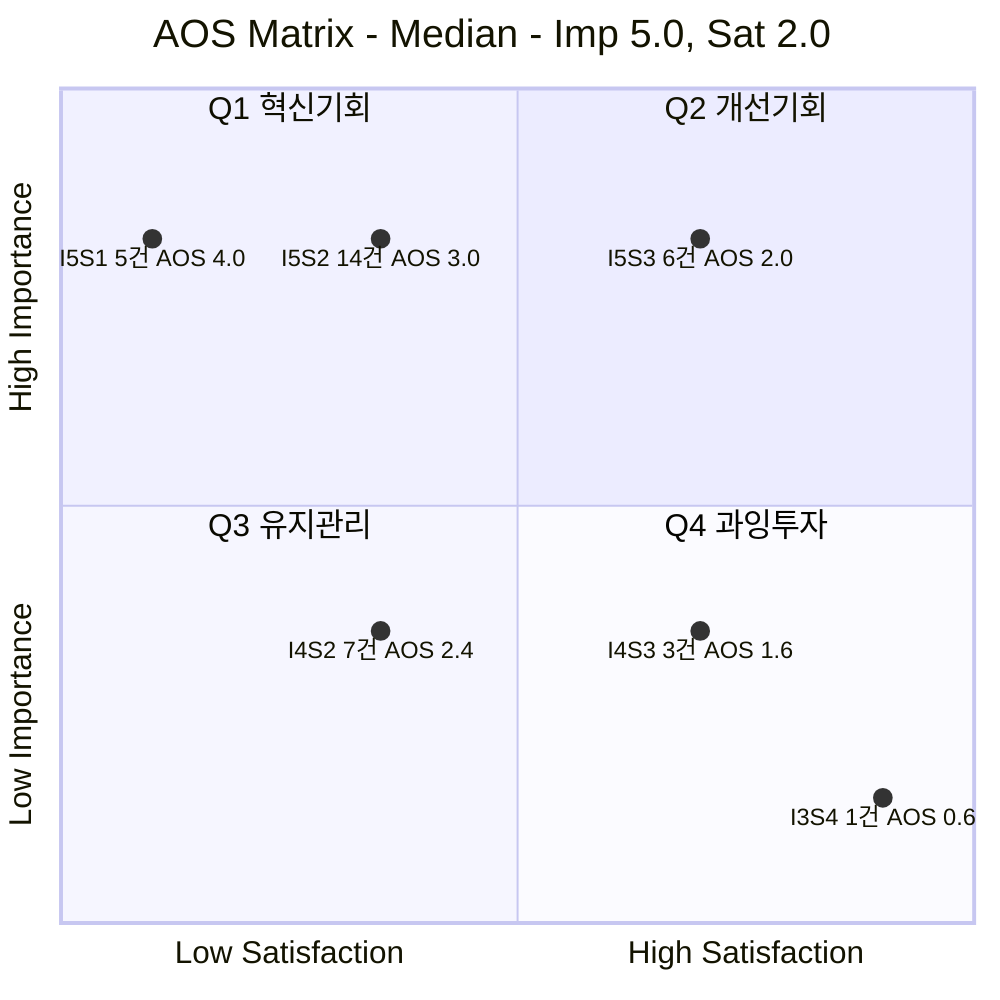

# 시장기회 분석 ③ — 예술품 재분배 플랫폼

> [분석 방법론](./분석-방법론.md) · 입력 [평가 대상 ③ 대표 Pain Point 36개](./평가대상-03-대표-페인포인트.md) · 상위 [챕터 05 고객 여정지도](../05-persona-journey/분석-03-예술품-재분배-플랫폼-고객여정지도.md)

> 📊 **산출.** 대표 Pain Point 36개에 Importance·Satisfaction을 매기고 **AOS = Importance × (1 − Satisfaction/5)** 로 계산해 내림차순 정렬하고 사분면에 배치했다.
>
> 🎯 **본론 고정.** 이 AOS는 단순한 작품 대여·배송 서비스가 아니라 `미술품 토큰증권 기획 → 가치가 충분히 발견되지 못한 유휴·폐기 가능 작품 → 재분배·기부 → 문화예술 접근·창의적 교육 → 작품별 활용·사회성과 이력 → 가치 재평가 가능성 검증 → 적격 작품의 토큰증권 연계 검토 → 작가·기관·작품 생태계로 가치·수익기회 환류`라는 전체 선순환에서 **어디가 가장 아픈지** 평가한다.
>
> ⚠️ **채점값은 전부 추정이다.** 인터뷰·설문이 없다. 공개 리서치는 ‘이런 운영·교육·금융 구조가 실제 존재하는가’를 확인하는 근거로만 쓰고, Importance·Satisfaction을 관측값처럼 만들지 않는다. `재분배 = 가격상승 = 토큰화`로 채점하지 않는다.

---

## 0. 채점 규칙

### 두 지표의 앵커

| 점수 | **Importance** — 그 사람의 Goal 달성에 이 Pain 해소가 얼마나 중요한가 | **Satisfaction** — 지금 쓰는 **대체 솔루션**이 그 Goal을 얼마나 달성시켜 주는가 |
|:---:|---|---|
| **5** | 막히면 여정 또는 본론의 가치사슬이 사실상 종료된다 | 대체 솔루션이 충분히 해결하고 있다 |
| **4** | 크게 지연·왜곡되고 상당수가 이탈한다 | 대체로 해결되며 약간 아쉬운 정도다 |
| **3** | 불편하지만 우회할 수 있다 | 절반쯤 해결된다 |
| **2** | 있으면 좋은 수준이다 | 거의 해결되지 않는다 |
| **1** | 거의 영향이 없다 | 전혀 해결되지 않는다 |

> 📌 **Satisfaction의 대상은 우리 서비스가 아니다.** 현재 실제 대체안인 장기보관·판매/기증·작가/갤러리 네트워크·기관 법무/자산관리·컬렉션관리시스템·전문 미술품 운송/보험·기존 미술은행·예술교육 프로그램·기부/CSR 보고체계가 해당 Goal을 얼마나 충족하는지를 본다.
>
> 📌 **토큰증권이 본론이라고 해서 모든 토큰증권 관련 Pain에 5점을 주지 않는다.** Importance는 사업자의 희망이 아니라 각 Persona의 Goal이 막히는 정도다. 다만 P03·P09·P10·P12·P21·P24·P27·P30·P32·P33처럼 `재분배 이후 가치이력·권리·수익·후속 가치화`가 실제 Goal에 포함되는 Pain은 전체 가치순환을 반영해 평가한다.
>
> 📌 공개 근거상 미술품 전시·거래 공동사업 기반 **투자계약증권 발행 사례**는 이미 존재하지만, 토큰증권은 자본시장법상 증권의 **발행 형식**이고 제도화 법 시행은 2027-02-04 예정이다. 따라서 후속 토큰증권 연결은 자동 결과가 아니라 별도 Gate다.  
> 근거: [금융위원회 2026-01-15](https://www.fsc.go.kr/no010101/86064) · [2026-02-13](https://www.fsc.go.kr/no010101/86295) · [2026-03-04](https://www.fsc.go.kr/no010101/86371)

### 사분면 기준선 — 중앙값 기반

이번 분석은 평균이 아니라 **이번 36개 실제 점수의 중앙값**으로 사분면 축을 자른다. AOS의 `★` 기회 경계도 AOS 중앙값을 사용한다.

| 항목 | 계산 | **기준선** |
|---|---|:---:|
| **Importance 기준선** | 36개 Importance 중앙값 | **5.0** |
| **Satisfaction 기준선** | 36개 Satisfaction 중앙값 | **2.0** |
| **AOS 기회 경계** | 36개 AOS 중앙값 | **3.0** |

**경계 처리** — Importance는 중앙값 **이상**이 상단, Satisfaction은 중앙값 **이하**가 좌측이다.

| 축 | 상단 / 좌측 | 하단 / 우측 |
|---|---|---|
| Importance (기준 5.0) | **5점** (25개) | 4점·3점 (11개) |
| Satisfaction (기준 2.0) | **1점·2점** (26개) | 3점·4점 (10개) |

> ⚠️ 이번 표본에서는 Importance 중앙값이 5점이므로 **4점도 상대적 Low Importance**에 들어간다. 이는 중요하지 않다는 뜻이 아니라 현재 선정한 36개 핵심 Pain 안에서 중앙값보다 낮다는 뜻이다.
>
> ⚠️ AOS 중앙값이 이전 파일의 2.4에서 **3.0으로 올라갔다.** 이유는 본론을 복원하면서 `가치이력·향유·후속 가치화·수익권리`처럼 사업의 연결고리를 끊는 Pain을 새로 반영해 5점 Importance 항목이 늘었기 때문이다. 이 변화는 계산 오류가 아니라 **평가 대상 정의가 바로잡힌 결과**다.

### 기준을 바꾸면 결과가 얼마나 달라지는가

| 기준 | 값 | Q1 혁신기회 | Q2 개선기회 | Q3 유지관리 | Q4 과잉투자 |
|---|---|:---:|:---:|:---:|:---:|
| A. 고정 3.0 | Imp 3.0 · Sat 3.0 | **35** | 1 | 0 | 0 |
| B. 평균 기반 *(비교만)* | Imp 4.67 · Sat 2.17 | **19** | 6 | 7 | 4 |
| **적용 — 중앙값** | **Imp 5.0 · Sat 2.0** | **19** | 6 | 7 | 4 |

- **고정 3.0**은 이번 후보군 대부분을 Q1에 넣어 우선순위 분별력이 없다.
- **평균 기반**과 **중앙값 기반**은 우연히 같은 개수를 만들지만, 본 분석은 극단값 영향이 적고 재현하기 쉬운 중앙값 기준을 적용한다.
- 기준선을 바꿔도 **AOS 값 자체는 바뀌지 않는다.** 바뀌는 것은 사분면 소속이다.

---

## 1. ② Importance Table

| ID | 인물 | 막히는 Goal (요약) | **Imp** | 판정 근거 |
|---|---|---|:---:|---|
| P01 | 독립 작가 김서윤 | 내 작품이 **어디서 어떻게 쓰이고 어떤 이력이 새로 생기는지 확인**하는 것 | **4** | 작품을 내놓을 동기와 반복 참여에 크게 영향을 주지만 당장 폐기·보관으로 우회할 수는 있다. |
| P02 | 독립 작가 김서윤 | 작품이 **언제 어떤 수요처와 연결될지 파악**하는 것 | **5** | 매칭 시점을 모르면 장기보관·폐기로 돌아가 작품 순환 여정이 종료될 수 있다. |
| P03 | 독립 작가 김서윤 | 재분배 이후의 **전시·활용·향유 데이터를 작품 단위 이력으로 확보**하는 것 | **5** | 이력이 남지 않으면 본 사업의 핵심인 ‘재분배→가치 재발견→후속 가치평가’ 연결이 끊긴다. |
| P04 | 미술관 컬렉션 담당 박소연 | 재분배·기록 활용·향후 가치화까지 포함한 **권한과 책임 범위를 확정**하는 것 | **5** | 권한이 확인되지 않으면 기관 자산의 외부 이전과 후속 활용을 승인할 수 없다. |
| P05 | 미술관 컬렉션 담당 박소연 | 작품의 **상태·provenance·권리·전시 정보를 일관된 형태로 보존**하는 것 | **5** | 상태·출처·권리 데이터가 없으면 기관 관리뿐 아니라 향후 가치평가의 신뢰성이 무너진다. |
| P06 | 미술관 컬렉션 담당 박소연 | 사고가 나도 책임이 흔들리지 않도록 **운송·보험 책임 주체를 확정**하는 것 | **5** | 실물 작품 손실 위험을 통제하지 못하면 기관은 실제 이전을 승인하기 어렵다. |
| P07 | 미술대학 작품관리 담당 한유진 | 학생 작품의 재분배와 데이터 활용에 필요한 **동의 범위를 누락 없이 확보**하는 것 | **5** | 학생 작품은 동의 범위를 넘겨 재분배·데이터 활용·상업화를 진행할 수 없다. |
| P08 | 미술대학 작품관리 담당 한유진 | 여러 작품의 **권리·상태·메타데이터를 일괄 등록·관리**하는 것 | **4** | 대량 운영 효율을 크게 좌우하지만 수기·파일 기반으로 우회는 가능하다. |
| P09 | 미술대학 작품관리 담당 한유진 | 후속 판매·라이선스·토큰증권 검토 시 **학생 권리와 수익 귀속 원칙을 미리 확인**하는 것 | **4** | 미래 수익이 발생할 때의 분쟁을 막는 데 중요하지만 재분배 자체는 별도 동의로 먼저 실행할 수 있다. |
| P10 | 갤러리 작품관리 담당 윤태호 | 갤러리가 **재분배와 후속 가치화 검토를 어디까지 결정할 수 있는지 확인**하는 것 | **5** | 계약 권한 밖의 재분배나 후속 증권화 검토는 진행할 수 없어 여정이 종료된다. |
| P11 | 갤러리 작품관리 담당 윤태호 | 작가가 수용할 수 있도록 **수요처·공간·활용 맥락을 사전에 확인**하는 것 | **4** | 작가 동의와 가치 맥락에 중요하지만 개별 설명·협의로 우회할 수 있다. |
| P12 | 갤러리 작품관리 담당 윤태호 | 향후 판매·라이선스·토큰증권 연계 시 **권리·수익 배분 원칙을 합의**하는 것 | **4** | 후속 수익화 시 핵심 규칙이지만 초기 재분배는 수익화와 분리해 먼저 실행할 수 있다. |
| P13 | 신진 작가 임하늘 | 작품을 폐기하지 않으면서 **다음 작업을 위한 공간을 확보**하는 것 | **5** | 보관공간 부족은 다음 창작 자체를 막아 순환 필요성이 매우 높다. |
| P14 | 신진 작가 임하늘 | 폐기 전에 **매칭 가능 시점과 처리 기한을 확인**하는 것 | **5** | 시간 제한을 넘기면 폐기로 전환되어 작품이 순환·가치재발견 기회를 잃는다. |
| P15 | 신진 작가 임하늘 | 추가 노동을 감수할 만큼 **지원 범위와 후속 활용·가치 이점을 확인**하는 것 | **4** | 실제 인계를 좌우하지만 전문 운송이나 지원으로 우회할 수 있다. |
| P16 | 문화취약지역 학교 담당 이지현 | 학교 공간과 학생에게 맞는 작품을 **안전하게 선택**하는 것 | **5** | 공간에 맞지 않거나 안전하지 않으면 학생에게 실제 작품을 제공할 수 없다. |
| P17 | 문화취약지역 학교 담당 이지현 | 배송 전 **수령·설치 담당과 일정을 확정**하는 것 | **5** | 수령·설치가 정해지지 않으면 매칭된 작품도 실제 향유로 이어지지 않는다. |
| P18 | 문화취약지역 학교 담당 이지현 | 작품을 **수업·토론·창작 활동과 연결해 능동적 교육 경험을 만드는 것** | **5** | 사회적 가치의 핵심인 창의적 학습 경험을 만들려면 단순 설치를 넘어 교육활용이 필요하다. |
| P19 | 지역 문화시설 담당 오수진 | 기획 때마다 새로 찾지 않아도 되는 **지속적인 작품 공급망을 확보**하는 것 | **5** | 작품 공급이 없으면 지역 문화시설의 전시·향유 목표가 성립하지 않는다. |
| P20 | 지역 문화시설 담당 오수진 | 시설이 감당 가능한 작품인지 **관리조건을 사전에 판단**하는 것 | **4** | 운영 부담을 크게 좌우하지만 담당자 문의·개별 검토로 우회할 수 있다. |
| P21 | 지역 문화시설 담당 오수진 | 관람자·프로그램·활용 결과를 **기관 성과와 작품 이력에 동시에 기록**하는 것 | **4** | 성과와 작품 가치이력을 연결하는 핵심 데이터지만 프로그램 자체는 기록 없이도 운영될 수 있다. |
| P22 | 문화취약지역 NGO 담당 김도현 | 지역 밖에서 지속적으로 **재분배 가능한 작품을 확보할 경로를 만드는 것** | **5** | 공급망이 없으면 문화취약지역의 수요가 실제 프로젝트로 전환되지 않는다. |
| P23 | 문화취약지역 NGO 담당 김도현 | 작품과 **이전비용 재원을 동시에 확보**하는 것 | **5** | 작품과 이전비용 중 하나라도 없으면 재분배가 실행되지 않는 3면 시장의 최대 병목이다. |
| P24 | 문화취약지역 NGO 담당 김도현 | 설치 이후 **향유·교육·지역활용 결과를 끝까지 수집**하는 것 | **5** | 사업의 사회성과와 가치이력을 완성하는 핵심 단계여서 후속 기부·재평가에 중요하다. |
| P25 | 개인 기부자 정민준 | 기부 전에 **돈이 어떤 재분배 비용에 쓰이는지 확인**하는 것 | **5** | 기부금 사용처를 신뢰하지 못하면 Funding 전환 자체가 멈출 수 있다. |
| P26 | 개인 기부자 정민준 | 기부 후에도 작품 이동이 **실제로 진행 중인지 계속 확인**하는 것 | **5** | 기부 후 신뢰 유지와 재참여를 좌우해 중요하다. |
| P27 | 개인 기부자 정민준 | 내 기부가 만든 **문화접근성 결과와 작품의 가치이력을 함께 확인**하는 것 | **5** | 기부가 사회가치와 작품 가치재발견을 어떻게 만들었는지 보여주는 본 사업의 핵심 결과다. |
| P28 | 기업 CSR·ESG 담당 최은영 | 작품 권리·수령기관·비용·운영 리스크를 담은 **실사 패키지를 한 번에 확보**하는 것 | **4** | 기업 검토 효율에 중요하지만 부서별 자료요청으로 우회 가능하다. |
| P29 | 기업 CSR·ESG 담당 최은영 | 필요 근거를 갖춰 **결재선을 통과하고 CSR 예산을 집행**하는 것 | **5** | 내부 승인을 통과하지 못하면 기업 Funding이 실제 집행되지 않는다. |
| P30 | 기업 CSR·ESG 담당 최은영 | 지원 작품·기관·아동의 성과와 **작품별 활용 이력을 함께 보고**하는 것 | **5** | CSR 성과와 작품 가치이력을 함께 증명해야 사업의 반복·확장 논리를 만들 수 있다. |
| P31 | 작품 보유기관 담당 서재원 | 우리 기관이 **어디까지 참여 가능한지 빠르게 판정**하는 것 | **3** | 복잡하면 검토를 미루지만 기관은 기존 보관으로 위험을 회피할 수 있다. |
| P32 | 작품 보유기관 담당 서재원 | 재분배와 후속 가치화의 **권리·책임 경계를 확정**하는 것 | **5** | 기관 자산의 권리·책임·상업화 범위가 불명확하면 참여가 중단된다. |
| P33 | 작품 보유기관 담당 서재원 | 발생 가능한 수익의 **회계·세무·배분 처리 원칙을 사전에 확인**하는 것 | **5** | 수익이 발생할 수 있는 구조를 만들려면 회계·세무·배분 규칙이 필수다. |
| P34 | 최종 향유 학생 박하린 | 학교·생활공간에서 **실제 작품을 반복적으로 접하는 것** | **5** | 문화접근성이라는 사업의 사회적 문제를 직접 나타내는 핵심 성과다. |
| P35 | 최종 향유 학생 박하린 | 작품이 무엇인지 **쉽게 이해하고 관심을 갖는 것** | **4** | 작품을 이해하는 데 중요하지만 설명 없이도 일부 관람 경험은 가능하다. |
| P36 | 최종 향유 학생 박하린 | 작품을 계기로 **생각하고 표현하고 창작하는 능동적 경험을 하는 것** | **5** | 사용자가 말한 ‘창의성 교육’이 실제로 발생하는지 판정하는 핵심 결과다. |

> 📌 **5점이 늘어난 이유를 사업자가 토큰증권을 좋아해서라고 해석하면 안 된다.** P03은 가치이력이 남지 않으면 재분배→재평가 연결이 끊기고, P18은 작품이 교육과 연결되지 않으면 사회적 Win-Win이 약해지며, P27은 기부자가 만든 사회성과와 작품의 새 이력을 보지 못하면 Funding과 가치이력 두 고리가 동시에 끊긴다. 각각 Persona Goal 기준으로 5점을 준 것이다.
>
> 📌 UNESCO의 문화예술교육 프레임워크·실행 가이드는 예술교육을 창의성·비판적 사고·문화적 이해와 연결한다. 따라서 “가난한 아이들에게 작품을 보내면 자동으로 창의성이 생긴다”가 아니라 **작품 접점 + 설명 + 수업·토론·창작 활동**이 실제로 일어났는지를 P18·P34~P36으로 검증한다.  
> 근거: [UNESCO 2024 Framework](https://www.unesco.org/en/articles/unesco-member-states-adopt-global-framework-strengthen-culture-and-arts-education?hub=86510) · [2025 Implementation Guidance](https://www.unesco.org/en/articles/implementation-guidance-unesco-framework-culture-and-arts-education)

---

## 2. ③ Satisfaction Table

| ID | 현재 쓰는 대체 솔루션 | **Sat** | 판정 근거 |
|---|---|:---:|---|
| P01 | 작가 SNS·포트폴리오, 수령처 사진을 개별 요청, 기증 확인서 | **2** | 현재도 새 활용을 확인할 수는 있지만 작품 단위의 지속적인 활용·가치 이력으로 연결되지는 않아 부분 충족 |
| P02 | 개별 전시처 문의, 갤러리·지인 네트워크, 장기 보관 | **1** | 수요와 대기시간을 한 번에 보여주는 경로가 거의 없어 폐기·보관으로 돌아가기 쉬움 |
| P03 | SNS 게시물, 전시 이력 수기 관리, 수령기관의 사진·후기 | **1** | 자료가 흩어져 있고 작품 단위로 검증·누적되지 않아 가치 재평가 근거로 쓰기 어려움 |
| P04 | 기관 내부 법무·소장품 관리규정, 개별 계약서 | **2** | 기본 권리 검토는 가능하지만 재분배·데이터 활용·후속 상업화까지 한 번에 다루는 표준은 부족 |
| P05 | 컬렉션관리시스템, condition report, provenance·전시기록 | **3** | 기관은 상당한 기록체계를 갖지만 외부 재분배 결과와 후속 가치화 데이터까지 통합하는 수준은 제한적 |
| P06 | 전문 미술품 운송사, 보험사, 개별 보험계약 | **3** | 전문 대안이 존재해 상당 부분 해결되지만 계약마다 책임범위 확인이 필요 |
| P07 | 학생별 동의서, 이메일·메신저, 학교 내부 서식 | **2** | 동의 수집 자체는 가능하나 재분배·데이터 활용·후속 가치화 범위를 작품별로 반복 확인해야 함 |
| P08 | 스프레드시트·공유폴더, 학교 자산관리표 | **2** | 대량 관리 우회는 가능하지만 권리·상태·메타데이터를 구조화해 일괄 등록하기 어려움 |
| P09 | 학생 동의서, 별도 계약서·법률 검토 | **2** | 후속 수익이 실제 발생하는 경우 개별 합의는 가능하지만 사전 표준이 거의 없음 |
| P10 | 작가-갤러리 위탁·전속계약, 개별 법률 검토 | **3** | 기존 계약이 판매·전시 권한은 다루지만 재분배와 후속 토큰증권 검토까지 명확한 경우는 제한적 |
| P11 | 작가에게 수요처 사진·설치계획을 개별 전달 | **2** | 개별 확인으로 우회 가능하지만 정보가 늦거나 불완전하면 동의가 지연됨 |
| P12 | 위탁계약 수정, 수익배분 특약, 변호사 검토 | **2** | 계약으로 해결 가능하지만 재분배→재평가→토큰증권의 연속 흐름을 위한 표준이 부족 |
| P13 | 작업실·창고 추가 임차, 작품 할인판매, 폐기 | **2** | 공간은 일부 해결할 수 있으나 비용이 들거나 작품의 쓰임을 포기해야 함 |
| P14 | 지인·갤러리 문의 후 일정 기간 기다림, 폐기일 임의 결정 | **1** | 매칭 가능 시점을 예측할 공통 신호가 거의 없어 만족도가 매우 낮음 |
| P15 | 자가 포장·운송, 전문 운송 유료 이용, 판매·기증 | **2** | 인계는 가능하지만 비용·노동 대비 지원과 후속 가치 기회가 명확하지 않음 |
| P16 | 교사·시설담당자의 개별 판단, 작가·기관 문의 | **2** | 작품 규격과 관리조건을 확인할 수는 있으나 학교 환경 적합성을 일관되게 비교하기 어려움 |
| P17 | 학교 행정실·시설담당·운송사 간 전화·이메일 조율 | **3** | 역할 조율 대안이 있어 일부 해결되지만 마지막 단계 지연이 잦을 수 있음 |
| P18 | 미술관 견학, 교사 자체 수업자료, 온라인 이미지·영상 | **2** | 예술교육 대안은 존재하지만 실제 작품을 일상 공간에서 지속 활용하는 경험은 제한적 |
| P19 | 지역 작가 섭외, 기획전 대관, 미술은행·기관별 공모 탐색 | **2** | 작품을 확보할 경로는 있으나 지속 공급망으로 통합돼 있지 않음 |
| P20 | 담당자 문의, 자체 시설기준, 작품별 수기 검토 | **3** | 관리 가능성 판단은 가능하지만 신청 전 비교·필터링이 번거로움 |
| P21 | 관람객 수 집계, 프로그램 만족도 설문, SNS·사진 기록 | **2** | 기관 성과는 일부 남지만 작품 단위 활용 이력과 연결되는 데이터 구조가 부족 |
| P22 | 개별 미술관·작가·재단에 요청, 일회성 기증사업 | **2** | 일회성 확보는 가능하지만 문화취약지역이 지속적으로 접근할 통합 공급망은 부족 |
| P23 | 작품 제공처와 별도로 후원·운송비를 따로 모색 | **1** | 각 요소는 따로 찾을 수 있으나 작품과 비용이 동시에 맞지 않으면 프로젝트가 멈춤 |
| P24 | 현장 사진·수기 결과보고, 기부자 보고서 | **2** | 성과 기록은 가능하지만 지역 향유 결과와 작품 가치이력을 동일 작품 ID로 끝까지 잇기 어려움 |
| P25 | 기존 기부 플랫폼의 모금액·일괄 사용내역 공지 | **2** | 기본 정보는 제공되지만 작품 이동·보험·설치·프로그램별 비용을 세분해 보기 어려움 |
| P26 | 문자·이메일 뉴스레터, 캠페인 공지 | **2** | 진행 알림은 가능하지만 개별 작품의 실물 이동 상태를 지속적으로 보여주지는 못함 |
| P27 | 기부 후기·결과보고서, 수령기관 사진 | **1** | 사회공헌 결과는 보더라도 내 기부-특정 작품-아동/기관 경험-새 활용이력을 한 번에 연결하기 어려움 |
| P28 | 부서별 이메일 요청, 파일 공유, 법무·재무 개별 검토 | **3** | 실사 자체는 가능하나 자료가 분산돼 반복 요청이 발생 |
| P29 | 기존 CSR 심사·정산·성과보고 프로세스 | **3** | 기업의 통제 절차는 성숙해 있지만 작품 재분배 특화 데이터가 없어 추가 검토가 필요 |
| P30 | CSR 연차보고서, ESG 지표, 수혜자 수·지원금액 집계 | **2** | 사회성과는 보고할 수 있으나 작품별 순환·활용·가치이력까지 함께 정리되는 경우는 제한적 |
| P31 | 기존 보관 유지, 내부 자산검토 후 보류 | **4** | 아무것도 하지 않는 대안이 위험 회피 Goal을 잘 충족해 플랫폼 참여 필요성이 낮아질 수 있음 |
| P32 | 내부 법무·자산관리, 개별 계약, 보험 검토 | **3** | 기본 위험은 다룰 수 있으나 후속 상업화·토큰증권 권리까지 통합 판단하려면 추가 검토 필요 |
| P33 | 회계팀·세무자문·법무 검토, 수익 발생 시 사후 처리 | **2** | 개별 처리 가능하지만 지원금·대여료·판매·증권화 수익이 섞일 경우 사전 기준이 부족 |
| P34 | 학교 행사·견학, 온라인 이미지, 지역축제 | **2** | 접점은 만들 수 있지만 실제 작품을 일상에서 반복적으로 접하는 기회는 제한적 |
| P35 | 교사 설명, 작품 캡션, 인터넷 검색 | **3** | 기본 이해를 돕는 방법은 있으나 학생 눈높이에 맞는 맥락이 항상 제공되지는 않음 |
| P36 | 교사 자체 미술활동, 방과후·온라인 콘텐츠 | **2** | 창작활동은 가능하지만 실제 재분배 작품을 소재로 지속적인 능동 경험을 만드는 프로그램은 제한적 |

> 📌 **낮은 Satisfaction은 ‘경쟁사가 없다’는 뜻이 아니다.** 기존 미술은행·대여 프로그램, 전문 운송·보험, 컬렉션관리, 예술교육, 기부/CSR 도구는 각각 특정 구간을 해결한다. 문제는 사용자 본론의 전체 연쇄 — `재분배 실행 → 향유/교육 → 작품 단위 가치이력 → 후속 가치평가·토큰증권 Gate` — 를 한 흐름으로 이어주는 대체안이 약하다는 가설이다.
>
> 📌 실제로 국립현대미술관 나눔미술은행은 문화소외지역 등에 작품을 무상 대여하고 운송료·보험료·감상자료를 지원한다. Art Bridges도 대여기관의 준비비와 작품별 준비비, 크레이팅·배송·설치·보험을 지원한다. 따라서 **재분배·물류는 실재하는 운영구조**이고, 우리 차별화 가설은 그 뒤의 가치이력·Funding·후속 가치화까지 연결하는 데 있다.  
> 근거: [MMCA 2023 나눔미술은행](https://www.mmca.go.kr/pr/pressDetail.do?bdCId=202303200008739) · [Art Bridges Partner Loan Network](https://artbridgesfoundation.org/partner-loan-network)

---

## 3. ④ AOS Table — 내림차순

**AOS = Importance × (1 − Satisfaction/5)** · `★`는 이번 36개 AOS 중앙값 **3.0 이상**이다.

| 순위 | ID | 인물 | Pain Point (요약) | Imp | Sat | **AOS** | 사분면 |
|:---:|---|---|---|:---:|:---:|:---:|---|
| 1 | **P02** | 독립 작가 김서윤 | 매칭 시점 불명확 | 5 | 1 | **4.0** ★ | Q1 혁신기회 |
| 1 | **P03** | 독립 작가 김서윤 | 활용·향유 데이터가 가치이력으로 안 남음 | 5 | 1 | **4.0** ★ | Q1 혁신기회 |
| 1 | **P14** | 신진 작가 임하늘 | 폐기 전 매칭기한 불명확 | 5 | 1 | **4.0** ★ | Q1 혁신기회 |
| 1 | **P23** | 문화취약지역 NGO 담당 김도현 | 작품 매칭·비용조성 분리 | 5 | 1 | **4.0** ★ | Q1 혁신기회 |
| 1 | **P27** | 개인 기부자 정민준 | 기부→문화성과→작품 가치이력 연결 부족 | 5 | 1 | **4.0** ★ | Q1 혁신기회 |
| 6 | **P04** | 미술관 컬렉션 담당 박소연 | 재분배·후속활용 권리 불명확 | 5 | 2 | **3.0** ★ | Q1 혁신기회 |
| 6 | **P07** | 미술대학 작품관리 담당 한유진 | 학생 동의 반복 | 5 | 2 | **3.0** ★ | Q1 혁신기회 |
| 6 | **P13** | 신진 작가 임하늘 | 보관→창작공간 압박 | 5 | 2 | **3.0** ★ | Q1 혁신기회 |
| 6 | **P16** | 문화취약지역 학교 담당 이지현 | 학교 공간·관리조건 판단 | 5 | 2 | **3.0** ★ | Q1 혁신기회 |
| 6 | **P18** | 문화취약지역 학교 담당 이지현 | 실제 작품의 창의교육 연결 부족 | 5 | 2 | **3.0** ★ | Q1 혁신기회 |
| 6 | **P19** | 지역 문화시설 담당 오수진 | 지속 작품 공급망 부족 | 5 | 2 | **3.0** ★ | Q1 혁신기회 |
| 6 | **P22** | 문화취약지역 NGO 담당 김도현 | 문화취약지역 공급망 부재 | 5 | 2 | **3.0** ★ | Q1 혁신기회 |
| 6 | **P24** | 문화취약지역 NGO 담당 김도현 | 현장 향유·가치이력 기록 단절 | 5 | 2 | **3.0** ★ | Q1 혁신기회 |
| 6 | **P25** | 개인 기부자 정민준 | 기부 비용구성 불투명 | 5 | 2 | **3.0** ★ | Q1 혁신기회 |
| 6 | **P26** | 개인 기부자 정민준 | 이동 중간 신호 부족 | 5 | 2 | **3.0** ★ | Q1 혁신기회 |
| 6 | **P30** | 기업 CSR·ESG 담당 최은영 | CSR 성과·작품 가치이력 분리 | 5 | 2 | **3.0** ★ | Q1 혁신기회 |
| 6 | **P33** | 작품 보유기관 담당 서재원 | 후속 수익 회계·배분 기준 없음 | 5 | 2 | **3.0** ★ | Q1 혁신기회 |
| 6 | **P34** | 최종 향유 학생 박하린 | 실제 작품 접점 부족 | 5 | 2 | **3.0** ★ | Q1 혁신기회 |
| 6 | **P36** | 최종 향유 학생 박하린 | 수동 관람→창의활동 연결 부족 | 5 | 2 | **3.0** ★ | Q1 혁신기회 |
| 20 | **P01** | 독립 작가 김서윤 | 재분배 후 가치이력 부족 | 4 | 2 | **2.4** | Q3 유지관리 |
| 20 | **P08** | 미술대학 작품관리 담당 한유진 | 대량 권리·상태 등록 어려움 | 4 | 2 | **2.4** | Q3 유지관리 |
| 20 | **P09** | 미술대학 작품관리 담당 한유진 | 학생 작품 후속수익 권리 불명확 | 4 | 2 | **2.4** | Q3 유지관리 |
| 20 | **P11** | 갤러리 작품관리 담당 윤태호 | 설치 맥락·가치 훼손 우려 | 4 | 2 | **2.4** | Q3 유지관리 |
| 20 | **P12** | 갤러리 작품관리 담당 윤태호 | 작가·갤러리 후속수익 배분 없음 | 4 | 2 | **2.4** | Q3 유지관리 |
| 20 | **P15** | 신진 작가 임하늘 | 포장·픽업 부담 대비 가치기회 불명확 | 4 | 2 | **2.4** | Q3 유지관리 |
| 20 | **P21** | 지역 문화시설 담당 오수진 | 지역성과·작품 활용이력 미기록 | 4 | 2 | **2.4** | Q3 유지관리 |
| 27 | **P05** | 미술관 컬렉션 담당 박소연 | 상태·출처·권리 이력 비표준 | 5 | 3 | **2.0** | Q2 개선기회 |
| 27 | **P06** | 미술관 컬렉션 담당 박소연 | 운송·보험 책임 불명확 | 5 | 3 | **2.0** | Q2 개선기회 |
| 27 | **P10** | 갤러리 작품관리 담당 윤태호 | 갤러리 재분배·토큰화 권한 불명확 | 5 | 3 | **2.0** | Q2 개선기회 |
| 27 | **P17** | 문화취약지역 학교 담당 이지현 | 수령·설치 역할 불명확 | 5 | 3 | **2.0** | Q2 개선기회 |
| 27 | **P29** | 기업 CSR·ESG 담당 최은영 | 기업 승인용 정산·성과근거 부족 | 5 | 3 | **2.0** | Q2 개선기회 |
| 27 | **P32** | 작품 보유기관 담당 서재원 | 기관 권리·책임·상업활용 경계 불명확 | 5 | 3 | **2.0** | Q2 개선기회 |
| 33 | **P20** | 지역 문화시설 담당 오수진 | 관리 난이도 판단 어려움 | 4 | 3 | **1.6** | Q4 과잉투자 |
| 33 | **P28** | 기업 CSR·ESG 담당 최은영 | 기업 실사자료 분산 | 4 | 3 | **1.6** | Q4 과잉투자 |
| 33 | **P35** | 최종 향유 학생 박하린 | 쉬운 설명·맥락 부족 | 4 | 3 | **1.6** | Q4 과잉투자 |
| 36 | **P31** | 작품 보유기관 담당 서재원 | 복잡한 참여조건 때문에 기존보관 선택 | 3 | 4 | **0.6** | Q4 과잉투자 |

**분포** — AOS 4.0: **5개** · 3.0: **14개** · 2.4: **7개** · 2.0: **6개** · 1.6: **3개** · 0.6: **1개**

> 📌 **최상위 5개가 본론의 네 고리를 동시에 보여준다.** `P02/P14 = 폐기 전에 순환`, `P23 = 작품과 기부 재원의 동시 실행`, `P03 = 작품 가치이력`, `P27 = 기부 성과와 가치이력 연결`이다. 토큰증권을 별도 부록으로 밀지 않고도, 재분배 과정 안에서 후속 가치화에 필요한 데이터가 자연스럽게 상위로 올라온다.

---

## 4. ⑤ Matrix — 사분면 배치

| 사분면 | 조건 | 개수 | 항목 |
|---|---|:---:|---|
| 🔥 **Q1 혁신기회** | Imp ≥ 5.0 · Sat ≤ 2.0 | **19** | P02 · P03 · P04 · P07 · P13 · P14 · P16 · P18 · P19 · P22 · P23 · P24 · P25 · P26 · P27 · P30 · P33 · P34 · P36 |
| 💎 **Q2 개선기회** | Imp ≥ 5.0 · Sat > 2.0 | **6** | P05 · P06 · P10 · P17 · P29 · P32 |
| ⚫ **Q3 유지관리** | Imp < 5.0 · Sat ≤ 2.0 | **7** | P01 · P08 · P09 · P11 · P12 · P15 · P21 |
| ⚠️ **Q4 과잉투자** | Imp < 5.0 · Sat > 2.0 | **4** | P20 · P28 · P31 · P35 |
| ★ **AOS 기회 영역** | AOS ≥ 3.0 | **19** | Q1과 동일한 19개 |

### 셀 매트릭스 (행 = Importance, 열 = Satisfaction)

| Imp \ Sat | **1** | **2** | ┃ | **3** | **4** |
|---:|---|---|:---:|---|---|
| **5** | P02 · P03 · P14 · P23 · P27 | P04 · P07 · P13 · P16 · P18 · P19 · P22 · P24 · P25 · P26 · P30 · P33 · P34 · P36 | ┃ | P05 · P06 · P10 · P17 · P29 · P32 | — |
| **4** | — | P01 · P08 · P09 · P11 · P12 · P15 · P21 | ┃ | P20 · P28 · P35 | — |
| **3** | — | — | ┃ | — | P31 |

> 🖊️ *이번 데이터에는 Importance 1·2점과 Satisfaction 5점이 없다. 경계는 Imp=5, Sat=2이며, 같은 셀에 여러 Pain이 겹친다.*

### 버블 매트릭스

> 🖊️ *점은 개별 Pain 하나가 아니라 **동일 Imp·Sat 좌표에 있는 항목 묶음**이다. 정확한 AOS는 §3 표를 기준으로 읽는다.*

---

## 5. 해석

### 5-1. 최상위 5개 — 대체 솔루션이 아예 없는 자리

| ID | 핵심 Pain | Imp | Sat | AOS | 왜 본론에 중요한가 |
|---|---|:---:|:---:|:---:|---|
| **P02** | 매칭 시점 불명확 | 5 | 1 | **4.0** | 가치가 발견되기 전에 작품이 다시 장기보관·폐기로 빠지는 첫 단절 |
| **P03** | 활용·향유 데이터가 작품 가치이력으로 남지 않음 | 5 | 1 | **4.0** | 재분배와 가치 재평가·토큰증권 검토를 잇는 데이터가 사라짐 |
| **P14** | 폐기 전 매칭기한 불명확 | 5 | 1 | **4.0** | 시간 압박이 큰 작품은 가치 재발견 기회 자체를 잃음 |
| **P23** | 작품 매칭과 이전비용 Funding이 분리 | 5 | 1 | **4.0** | 작품·수요가 있어도 운송·보험·설치 재원이 없으면 재분배가 실행되지 않음 |
| **P27** | 기부→문화성과→작품 가치이력 연결 부족 | 5 | 1 | **4.0** | 기부자 성과와 작품의 새 가치 데이터가 한 번에 끊김 |

**P02·P14는 ‘폐기 전에 시간을 확보하는 문제’**다. 작품이 가치가 낮아서 폐기되는 것만이 아니라, 수요가 있는지와 얼마나 기다려야 하는지가 보이지 않아 순환 기회를 놓친다는 가설이다.

**P23은 사용자 본론의 기부 구조를 직접 건드린다.** 작품만 매칭해도 운송·보험·설치비가 없으면 움직이지 못한다. Art Bridges와 MMCA가 실제로 물류·보험·설치/전시 지원을 묶어 운영하는 것은 이 실행조건이 현실에 존재한다는 근거다.

**P03·P27은 이전 버전에서 약했던 핵심이다.** 작품이 실제로 새 공간에서 쓰이고 아이·지역이 향유했다는 사실이 **작품 단위의 검증 가능한 이력**으로 남아야, 사회적 성과와 후속 가치평가 가능성을 함께 검토할 수 있다. 다만 이력 자체가 가격상승을 증명하지는 않는다.

### 5-2. Q2 6개 — 잘해도 이기지 못하는 영역

Q2는 **P05 · P06 · P10 · P17 · P29 · P32**다.

- P05·P06은 기존 컬렉션관리·condition report·전문 운송·보험이라는 강한 대체안이 있다.
- P10·P32는 법률·계약 검토를 통해 해결할 수 있으므로 “플랫폼 기능 하나”로 이기기 어렵다.
- P17은 학교/시설/운송사의 역할 조율이라는 운영문제라 기존 행정으로 일부 해결된다.
- P29는 기업 CSR의 내부 승인·정산 문서 영역으로, 제품 UX만으로 해결되지 않는다.

> 📌 **Q2를 버리면 안 된다.** 특히 P10·P32는 토큰증권 연계 Gate의 권리조건이다. AOS가 낮은 이유는 중요하지 않아서가 아니라 **현재 전문 대체안이 어느 정도 존재하기 때문**이다. MVP에서는 법률·운송·보험 파트너와의 연동/표준화로 처리하는 쪽이 맞다.

### 5-3. Q3 7개 — 이름을 그대로 믿으면 안 되는 칸

Q3은 **P01 · P08 · P09 · P11 · P12 · P15 · P21**이다.

이번 기준에서 Importance 4점은 중앙값 5점보다 낮아 Q3에 들어간다. 그러나 이 중 **P09·P12는 후속 수익·토큰증권 연계에서 권리분쟁을 막는 조건**, P21은 작품의 지역활용·관람반응을 가치이력으로 남기는 조건이다.

따라서 Q3의 정확한 해석은 “유지관리”보다 **‘중앙값 아래지만 본론 연결에 필요한 구조조건’**에 가깝다. 개발 우선순위는 Q1보다 뒤지만 설계에서 삭제하면 안 된다.

### 5-4. 작품 보유기관 담당 서재원 — AOS가 낮게 나온 항목이 있는 이유

서재원의 P31은 `Imp 3 · Sat 4 · AOS 0.6`으로 전체 최하위다.

이것은 기관 보유작품이 중요하지 않다는 뜻이 아니다. **“참여조건이 복잡하면 그냥 기존 보관을 유지한다”는 현재 대안이 기관의 위험회피 Goal을 꽤 잘 충족하기 때문**이다. 반대로 같은 인물의 P32는 권리·책임 Gate로 AOS 2.0, P33은 후속 수익의 회계·배분 원칙으로 AOS 3.0이다.

> 📌 이 결과는 사용자 본론의 `기관도 수익을 창출` 가설을 더 엄격하게 만든다. 기관이 참여하려면 단순히 “수익이 날 수 있다”가 아니라 **권리·회계·배분 원칙이 명확해야 한다.** DC Art Bank처럼 작품 공급자에게 실제 취득대금을 지급하면서 공공공간에 작품을 순환시키는 선행사례는 존재하지만, 우리 서비스의 수익배분 규칙은 별도로 설계해야 한다.  
> 근거: [DC Art Bank FY2026](https://dcarts.dc.gov/public-art/fy-2026-grantees-art-bank-program-abp)

### 5-5. 수혜형 3개는 목록에서 분리한다

박하린의 **P34·P35·P36**은 AOS에는 포함한다. 이 세 Pain은 “작품이 도착했는가”가 아니라 **실제 접근·이해·창의활동이 일어났는가**를 판정하기 때문이다.

| ID | Pain | AOS | 이후 처리 |
|---|---|:---:|---|
| **P34** | 실제 작품 접점 부족 | **3.0** | 문화접근성 Outcome |
| **P35** | 쉬운 설명·맥락 부족 | 1.6 | 이해/해설 Outcome |
| **P36** | 수동관람→창의활동 연결 부족 | **3.0** | 창의교육 Outcome |

그러나 이 학생은 직접 작품을 공급·신청·Funding하거나 토큰증권 투자 결정을 하는 Persona가 아니므로 **DOS에서는 P34~P36을 성과 판정 트랙으로 분리**한다.

### 5-6. 기능 단위로 환원 — AOS 2.0 이상 32개

AOS **2.0 이상 32개**를 “32개 기능”으로 만들지 않고 다음 역량으로 다시 묶는다.

| 기능 계열 | AOS≥2.0 항목 수 | ID | AOS 합 |
|---|:---:|---|:---:|
| **작품-수요처 매칭·폐기 회피** | 7 | P01 · P02 · P13 · P14 · P19 · P22 · P23 | **23.4** |
| **권리·가치평가·토큰증권 전환조건** | 9 | P04 · P05 · P07 · P09 · P10 · P11 · P12 · P32 · P33 | **22.2** |
| **물류·설치·운영** | 6 | P06 · P08 · P15 · P16 · P17 · P29 | **13.8** |
| **가치이력·성과증명** | 5 | P03 · P21 · P24 · P27 · P30 | **16.4** |
| **Funding 투명성·진행** | 2 | P25 · P26 | **6.0** |
| **문화접근·창의교육** | 3 | P18 · P34 · P36 | **9.0** |

> 📌 여기서 사용자 본론과 가장 직접적으로 연결되는 것은 **① 권리·가치평가·토큰증권 전환조건, ② 가치이력·성과증명, ③ 문화접근·창의교육**이다. 반면 매칭·물류·Funding은 이 가치순환을 실제로 작동시키는 실행 기반이다.
>
> 📌 **토큰증권 전환은 별도 기능 수 하나로 세지 않는다.** 금융위원회가 기초자산 적격 요건·증권신고서 공시·유통·투자자보호 세부제도를 설계 중이므로, `가치이력 → 가치평가 → 권리/기초자산 적격성 → 증권 발행 검토`의 Gate로 설계한다.  
> 근거: [금융위원회 2026-05-15](https://www.fsc.go.kr/no010101/86906)

---

## 6. 근거 등급

| 구성 요소 | 등급 | 근거 / 처리 |
|---|---|---|
| 36개 Persona·Pain 구조 | **기존 분석 + 본론 재정렬** | 기존 12명×3개 틀을 유지하되 재분배→가치이력→후속 가치화 Goal을 복원 |
| Importance·Satisfaction | **가설** | 인터뷰·설문 없음. 대체 솔루션 기준 추정 |
| AOS 계산·중앙값 | **확인** | 입력 점수로 산술 계산 |
| 예술품 공공 순환·물류지원의 실재 | **공개 관측** | MMCA 나눔미술은행, Art Bridges, DC Art Bank |
| 문화예술교육의 창의성·비판적 사고 연결 | **공개 연구/정책 근거** | UNESCO 2024 Framework 및 2025 실행 가이드 |
| 예술·문화 기부시장 존재 | **공개 통계** | Giving USA 2026: 2025 Arts, Culture & Humanities 기부 $27.31B |
| 작가·기관 수익 가능성 | **선행사례 + 사업가설** | DC Art Bank의 유상 작품취득, Art Bridges의 참여/준비비 지원은 관측. 우리 플랫폼의 수익배분은 미설계 |
| 재분배 이력 → 가격상승 | **미검증** | 자동 인과 주장 금지. 별도 가치평가 필요 |
| 적격 작품 → 토큰증권 연계 | **핵심 사업가설 + 제도 Gate** | 미술품 공동사업 투자계약증권 사례는 존재. 토큰증권 제도화 법은 2027-02-04 시행 예정 |

> ⚠️ **AOS는 문제 우선순위 가설이지 시장규모가 아니다.** 시장 파급력은 다음 DOS에서 별도로 붙인다.

---

## 7. 다음 단계

### 7-1. 이 챕터에서 바로 이어지는 작업

1. 36개 중 수혜형 P34~P36을 제외한 **33개 직접시장 Pain**에 Persona 단위 Market Relevance를 붙인다.
2. `DOS = (Importance − Satisfaction) × MR`을 SAM/SOM 두 층으로 계산한다.
3. AOS 상위이지만 시장 범위가 작은 문제와, AOS는 낮아도 시장파급력이 큰 문제를 분리한다.
4. MR에는 **‘토큰증권 전환율’을 임의로 곱하지 않는다.** 현재 재분배 작품 중 몇 %가 토큰증권 적격이 되는지 관측값이 없기 때문이다.

### 7-2. 챕터 07 JTBD 로 넘기는 것

인터뷰에서는 단순히 “작품을 내놓겠습니까/기부하겠습니까”만 묻지 않는다.

- 공급자: **어떤 조건이면 폐기·보관 대신 재분배를 선택하는가**
- 공급자/기관: **재분배 후 어떤 이력·수익 가능성이 보여야 반복 참여하는가**
- 수요기관: **작품을 받은 뒤 어떤 교육·지역성과가 생겨야 계속 신청하는가**
- 기부자/기업: **어떤 증거가 있어야 ‘내 돈이 작품과 아이 모두에게 새 가치를 만들었다’고 느끼는가**
- 후속 가치화: **어떤 권리·가치평가·수익구조라면 토큰증권 검토를 수용/거부하는가**

### 7-3. 이 챕터 밖으로 넘기는 것

AOS로 답할 수 없는 것은 별도 검증한다.

- 실제 작품 가치평가 모델과 가격 형성
- 재분배 이력이 가치평가에 미치는 실제 효과
- 작품 소유권·저작권·대여/라이선스·수익배분 구조
- 기부금/CSR/지원금과 작가·기관 경제적 보상의 법적·회계적 분리
- 토큰증권 기초자산 적격성·증권성·발행/공시·유통·투자자보호
- 플랫폼 수수료·대여료·취득·라이선스·토큰증권 등 수익모델별 단위경제성

### 7-4. 커리큘럼 상의 다음 챕터

**AOS → DOS → AOS×DOS 혼합 매트릭스 → JTBD** 순으로 이어간다.

이때 최종 질문은 “재분배 플랫폼의 기능 우선순위가 무엇인가?”에서 끝나지 않는다.

> **“어떤 Pain을 해결해야 폐기 가능 작품이 실제로 순환되고, 아이·지역의 문화경험이 생기며, 그 결과가 작품의 새 가치이력으로 남고, 적격 작품이 다시 미술품 토큰증권 생태계와 연결되는가?”**

이 질문을 챕터 07까지 유지한다.
