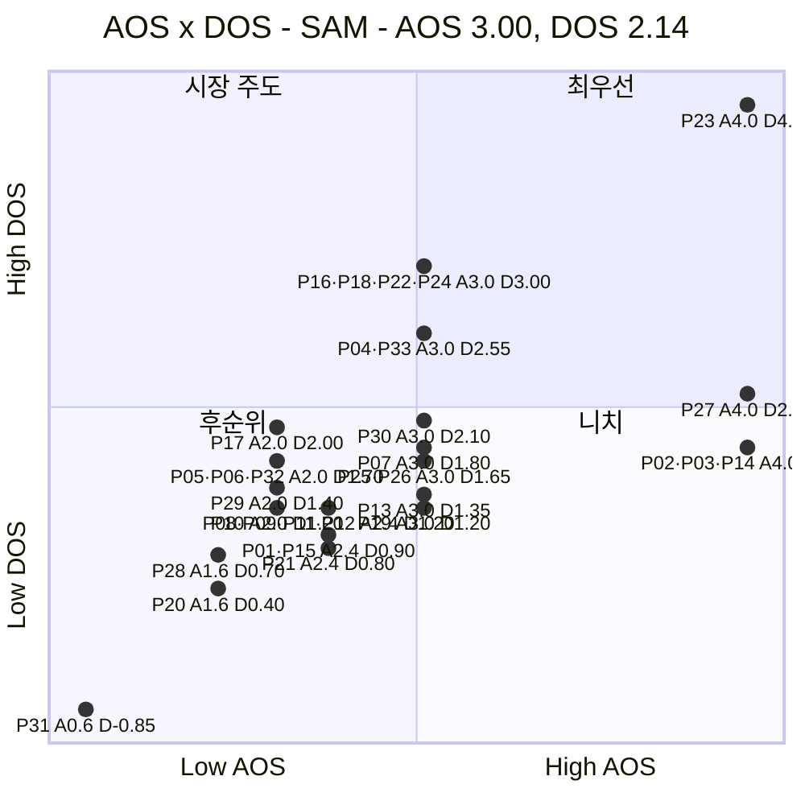
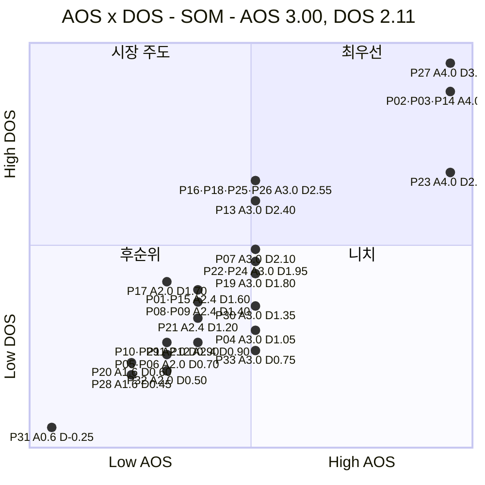

# AOS × DOS 혼합 매트릭스 ③ — 예술품 재분배 플랫폼

> 입력 [AOS 분석 ③](./분석-03-예술품-재분배-플랫폼.md) · [DOS 분석 ③](./분석-03-예술품-재분배-플랫폼-DOS.md) · [분석 방법론](./분석-방법론.md)

> 📊 **산출.** 두 점수를 한 평면에 놓는다. **X축 = AOS**(고객이 얼마나 아픈가), **Y축 = DOS**(그 아픔이 이번 작업가중치 기준의 가치순환 시장에 얼마나 넓게 닿는가). DOS가 SAM/SOM 두 층이므로 매트릭스도 **SAM 기준·SOM 기준 두 장**이다.
>
> 🎯 **본론 고정.** 이 평면은 `재분배 자체`의 기능우선순위만 찾지 않는다. **폐기 가능 작품의 순환 → 문화접근·창의교육 → 작품 활용·사회성과 가치이력 → 가치 재평가 가능성 → 적격 작품 토큰증권 연계 → 작가·기관·작품 생태계 환류**라는 전체 선순환에서 `고객에게 아픈 문제`와 `시장에 넓게 닿는 문제`가 겹치는 곳을 찾는다.
>
> ⚠️ **리서치 적용 방식.** 좌표의 Y값은 `DOS(3)`의 Persona별 SAM/SOM **작업가중치 MR**을 그대로 승계한다. DataArts·DC Art Bank·MMCA·Art Bridges·UNESCO·금융위 자료는 시장과 제도·운영구조가 실제 존재하는지 검증하지만, 서로 분모가 다른 관측값을 이 좌표에 섞지 않는다.

---

## 0. 축 정의와 기준선

### 왜 이 배치인가

| 축 | 지표 | 재는 것 | 출처 |
|---|---|---|---|
| **X (가로)** | **AOS** = Imp × (1 − Sat/5) | **고객 미충족 강도** — 그 Persona Goal이 얼마나 아픈가 | AOS 분석 §3 |
| **Y (세로)** | **DOS** = (Imp − Sat) × MR | **시장 파급력** — 그 Pain이 이번 가치순환 시장의 어느 Persona 면에 얼마나 넓게 닿는가 | DOS(3) §1·§2 |

두 지표는 Importance·Satisfaction을 공유하지만 DOS만 MR을 가진다.

- **오른쪽 위**: 고객도 아프고 시장 영향도 넓다 → 바로 검증할 핵심
- **오른쪽 아래**: 고객에게 매우 절실하지만 현재 MR 가정에서는 범위가 제한적 → 니치/단계적 과제
- **왼쪽 위**: 고객 체감은 상대적으로 낮지만 구조적으로 넓게 걸친다 → 시장주도/인프라 과제
- **왼쪽 아래**: 둘 다 상대적으로 낮다 → 후순위, 단 권리·보험·위생요건은 삭제하지 않음

> 📌 **토큰증권은 Y축에 별도 보너스로 넣지 않는다.** `재분배 작품 중 토큰증권 적격률` 관측값이 없기 때문이다. 대신 가치이력(P03·P21·P24·P27·P30), 권리/수익 Gate(P04·P09·P10·P12·P32·P33)가 AOS와 DOS 양쪽에 실제 Pain으로 들어간다.
>
> 📌 금융위는 미술품 전시·거래 공동사업 기반 투자계약증권 발행사례가 존재한다고 밝히고, 토큰증권을 자본시장법상 증권의 형식으로 설명한다. 따라서 `미술품↔증권` 연결 자체는 현실에 존재하지만, **우리 재분배 작품의 토큰증권 적격 여부는 별도 검증**한다.  
> 근거: [금융위원회 2026-02-13](https://www.fsc.go.kr/no010101/86295) · [2026-03-04](https://www.fsc.go.kr/no010101/86371)

### 기준선

| 축 | 기준값 | 산출 |
|---|:---:|---|
| **AOS** | **3.00** | 36개 AOS 중앙값을 그대로 승계 |
| **DOS (SAM)** | **2.14** | 직접시장 33개 기준 평균 1.691 + 0.5σ(0.905) |
| **DOS (SOM)** | **2.11** | 직접시장 33개 기준 평균 1.647 + 0.5σ(0.929) |

> 🖊️ *AOS는 36개 기준이고 DOS는 최종 수혜형 P34~P36을 제외한 33개 기준이다. AOS 33개 중앙값도 3.0으로 동일하다.*
>
> ⚠️ **P34·P35·P36은 이 평면에 없다.** DOS가 산출되지 않기 때문이다. 그러나 사용자 본론의 “예술을 접하지 못한 아이들에게 창의성 교육”은 이 세 Outcome과 P18을 통해 반드시 따로 측정한다. UNESCO는 문화·예술교육을 창의성·비판적 사고·문화적 이해와 연결한다.  
> 근거: [UNESCO Framework](https://www.unesco.org/en/articles/unesco-member-states-adopt-global-framework-strengthen-culture-and-arts-education?hub=86510)

### 사분면의 의미

| 사분면 | 조건 | 이름 | 뜻 |
|---|---|---|---|
| **우상단** | AOS ↑ · DOS ↑ | 🔥 **최우선** | 고객 미충족도 크고 가치순환 시장 영향도 넓다 |
| **좌상단** | AOS ↓ · DOS ↑ | 💰 **시장 주도** | 체감 Pain은 상대적으로 낮지만 넓은 구조에 걸친다 |
| **우하단** | AOS ↑ · DOS ↓ | 🎯 **니치** | 절실하지만 현재 MR 기준 시장범위가 상대적으로 제한적이다 |
| **좌하단** | AOS ↓ · DOS ↓ | ⬜ **후순위** | 둘 다 상대적으로 낮다. 단, 위생요건·권리 Gate를 분리해서 읽는다 |

---

## 1. 혼합 매트릭스 — SAM 기준 (확장성)

| 사분면 | 개수 | 항목 |
|---|:---:|---|
| 🔥 최우선 | **8** | **P04** 재분배·후속활용 권리 불명확 · **P16** 학교 공간·관리조건 판단 · **P18** 실제 작품의 창의교육 연결 부족 · **P22** 문화취약지역 공급망 부재 · **P23** 작품 매칭·비용조성 분리 · **P24** 현장 향유·가치이력 기록 단절 · **P27** 기부→문화성과→작품 가치이력 연결 부족 · **P33** 후속 수익 회계·배분 기준 없음 |
| 💰 시장 주도 | **0** | — |
| 🎯 니치 | **9** | **P02** 매칭 시점 불명확 · **P03** 활용·향유 데이터가 가치이력으로 안 남음 · **P07** 학생 동의 반복 · **P13** 보관→창작공간 압박 · **P14** 폐기 전 매칭기한 불명확 · **P19** 지속 작품 공급망 부족 · **P25** 기부 비용구성 불투명 · **P26** 이동 중간 신호 부족 · **P30** CSR 성과·작품 가치이력 분리 |
| ⬜ 후순위 | **16** | P01 · P05 · P06 · P08 · P09 · P10 · P11 · P12 · P15 · P17 · P20 · P21 · P28 · P29 · P31 · P32 |

**SAM 우상단 8개의 구조**

- **P23**: 작품 매칭과 Funding을 동시에 열어야 한다.
- **P16·P18·P22·P24**: 문화취약지역에 작품을 보내는 것에서 끝나지 않고 **안전한 설치·창의교육·현장성과/가치이력**까지 연결한다.
- **P04·P33**: 기관 작품의 권리와 향후 수익 회계·배분을 명확히 해야 `재분배↔토큰증권` 확장고리가 성립한다.
- **P27**: 개인 기부가 아이/기관의 경험과 작품의 새 가치이력으로 동시에 연결되어야 한다.

> 📌 **SAM에서 P04·P33이 우상단에 들어온 것이 이전 방향과 가장 큰 차이**다. 토큰증권을 후속 옵션으로 밀어내지 않고, 확장시장에서 필요한 **권리·후속수익 Gate**를 본론에 복원한 결과다.
>
> 📌 정부미술은행은 작품 가치심사와 가격평가를 별도로 두고 있으므로, P03/P24/P27 등 가치이력을 모으더라도 `이력=가격`으로 해석하지 않는다. 가치이력은 **재평가 입력 데이터 후보**다.  
> 근거: [정부미술은행 2024 작품 구입 공모](https://www.artbank.go.kr/home/purchase/pcDetail.do?loc=g32&puId=240423000000422&typeCd=01)

---

## 2. 혼합 매트릭스 — SOM 기준 (1년차)

| 사분면 | 개수 | 항목 |
|---|:---:|---|
| 🔥 최우선 | **10** | **P02** 매칭 시점 불명확 · **P03** 활용·향유 데이터가 가치이력으로 안 남음 · **P13** 보관→창작공간 압박 · **P14** 폐기 전 매칭기한 불명확 · **P16** 학교 공간·관리조건 판단 · **P18** 실제 작품의 창의교육 연결 부족 · **P23** 작품 매칭·비용조성 분리 · **P25** 기부 비용구성 불투명 · **P26** 이동 중간 신호 부족 · **P27** 기부→문화성과→작품 가치이력 연결 부족 |
| 💰 시장 주도 | **0** | — |
| 🎯 니치 | **7** | **P04** 재분배·후속활용 권리 불명확 · **P07** 학생 동의 반복 · **P19** 지속 작품 공급망 부족 · **P22** 문화취약지역 공급망 부재 · **P24** 현장 향유·가치이력 기록 단절 · **P30** CSR 성과·작품 가치이력 분리 · **P33** 후속 수익 회계·배분 기준 없음 |
| ⬜ 후순위 | **16** | P01 · P05 · P06 · P08 · P09 · P10 · P11 · P12 · P15 · P17 · P20 · P21 · P28 · P29 · P31 · P32 |

**SOM 우상단 10개의 구조**

- **P02·P14**: 폐기 전에 작가 작품을 실제 순환시키는 시간문제
- **P03**: 재분배 후 작품 단위 가치이력
- **P13**: 보관압박과 창작공간
- **P23**: 작품과 이전비용 Funding 동시 실행
- **P16·P18**: 학교의 안전한 수령 + 실제 창의교육
- **P25·P26·P27**: 비용 투명성 + 이동상태 + 기부→문화성과→작품 가치이력

> 📌 초기 SOM은 사용자 본론을 **작은 폐쇄루프**로 검증하기 좋다. `작가 1명/작품군 → 기부자 → 학교/기관 → 설치·수업/창작 → 작품ID 결과이력 → 가치평가 후보 등록`까지 한 프로젝트에서 연결하는 것이 핵심이다.
>
> 📌 MMCA 나눔미술은행은 실제 문화소외지역·복지/교육시설에 작품을 무상대여하고 운송·보험·감상자료를 지원하며, Art Bridges도 크레이팅·배송·설치·보험을 지원한다. 따라서 “작품을 보내고 향유를 돕는 실행구조”는 현실에 있고, 우리 서비스가 새로 검증해야 하는 부분은 **Funding·가치이력·후속 가치화와의 통합**이다.  
> 근거: [MMCA 2023](https://www.mmca.go.kr/pr/pressDetail.do?bdCId=202303200008739) · [Art Bridges](https://artbridgesfoundation.org/partner-loan-network)

---

## 3. 두 매트릭스 대조

### 어느 칸에서 어느 칸으로 움직였나

| ID | 항목 | SAM | SOM | 왜 움직였나 |
|---|---|---|---|---|
| **P02** | 매칭 시점 불명확 | 🎯 니치 | **🔥 최우선** | 개인 작가의 초기 SOM MR이 높아져 폐기 전 매칭 문제가 최우선으로 상승 |
| **P03** | 활용·향유 데이터가 가치이력으로 안 남음 | 🎯 니치 | **🔥 최우선** | 초기 작가 MR이 높고 AOS 4.0이라 가치이력 문제가 최우선으로 상승 |
| **P04** | 재분배·후속활용 권리 불명확 | 🔥 최우선 | **🎯 니치** | 기관 공급은 확장 MR이 높지만 초기 승인·권리 마찰 때문에 SOM MR이 낮아짐 |
| **P13** | 보관→창작공간 압박 | 🎯 니치 | **🔥 최우선** | 신진작가 초기 공급 MR이 높아져 창작공간 압박이 최우선으로 상승 |
| **P14** | 폐기 전 매칭기한 불명확 | 🎯 니치 | **🔥 최우선** | 폐기 전 시간압박 + 높은 초기 작가 MR로 최우선 상승 |
| **P22** | 문화취약지역 공급망 부재 | 🔥 최우선 | **🎯 니치** | 문화취약 수요는 SAM 핵심이지만 초기 NGO 실행 MR을 낮춰 니치로 이동 |
| **P24** | 현장 향유·가치이력 기록 단절 | 🔥 최우선 | **🎯 니치** | 현장성과·가치이력은 확장 필수지만 초기 NGO MR 가정 때문에 니치 |
| **P25** | 기부 비용구성 불투명 | 🎯 니치 | **🔥 최우선** | 개인 Funding 초기 MR이 높아 비용투명성이 최우선으로 상승 |
| **P26** | 이동 중간 신호 부족 | 🎯 니치 | **🔥 최우선** | 개인 Funding 초기 MR이 높아 이동상태 신호가 최우선으로 상승 |
| **P33** | 후속 수익 회계·배분 기준 없음 | 🔥 최우선 | **🎯 니치** | 기관 후속수익 Gate는 확장에 중요하지만 초기 기관 MR이 낮아 니치로 이동 |

**이동의 핵심은 ‘초기 작가·개인 Funding’과 ‘확장 기관 Gate’의 교대다.**

- SOM에서는 P02·P03·P13·P14와 P25·P26이 올라온다.
- SAM에서는 P04·P22·P24·P33이 상대적으로 올라온다.
- **P27은 SAM/SOM 모두 🔥 최우선**이다. `기부 → 문화성과 → 작품 가치이력`이라는 연결은 초기와 확장 양쪽에서 살아남는다.
- **P16·P18·P23도 두 층 모두 🔥 최우선**이다. 즉 작품을 실제 문화취약지역에 안전하게 전달하고, 교육적 활용을 만들며, Funding과 함께 실행하는 구조가 모수 변경에도 유지된다.

따라서 두 매트릭스 모두 최우선에 남는 교집합은 **P16 · P18 · P23 · P27**이다.

| ID | 핵심 기능 | 사용자 본론과의 연결 |
|---|---|---|
| **P16** | 공간·관리 적합성 | 작품이 아이/지역에 실제 도착할 수 있게 함 |
| **P18** | 수업·토론·창작 연계 | “예술향유 못한 아이들의 창의성 교육”을 실제 Outcome으로 만듦 |
| **P23** | 작품+이전비용 Funding 동시매칭 | 재분배가 계획이 아니라 실제 이동으로 이어지게 함 |
| **P27** | 기부→문화성과→작품 가치이력 | 사회적 Win-Win과 작품 가치 재발견 데이터를 하나로 연결 |

### 우하단(니치)에 고정된 셋

두 매트릭스 모두 🎯 니치에 남는 것은 **P07 · P19 · P30**이다.

| ID | 항목 | SAM DOS | SOM DOS | 본론에서의 위치 |
|---|---|:---:|:---:|---|
| **P07** | 학생 동의 반복 | 1.80 | 2.10 | 학생 작품의 재분배·데이터 활용 동의. 토큰증권 전환 전에 필요한 권리 기반 |
| **P19** | 지속 작품 공급망 부족 | 1.20 | 1.80 | 지역 문화시설의 지속 공급망. 문화접근성 확장에는 필요하지만 현재 MR에선 우상단 미도달 |
| **P30** | CSR 성과·작품 가치이력 분리 | 2.10 | 1.35 | 기업 CSR 성과와 작품 가치이력의 통합보고. 확장성과 초기 모두 중요하나 DOS 경계 아래 |

> 📌 **니치 = 버릴 기능이 아니다.** P07은 향후 가치화·토큰증권 전환 전 권리 기반, P30은 기업 Funding과 작품 가치이력의 연결이다. 다만 현재 AOS/DOS 경계 조합에서는 SAM/SOM 모두 우상단에 들지 않았으므로 **MVP 핵심루프 다음**으로 둔다.
>
> 📌 반대로 P03은 SOM에서 🔥로 올라오므로 **초기에는 작품 가치이력 수집을 미루면 안 된다.** 이후 기관 확장 때 P04·P33 같은 권리·수익 Gate를 붙이는 순서가 논리적이다.

---

## 4. 사분면별 행동 지침

| 사분면 | 무엇을 하나 | 이번 사업에서의 의미 |
|---|---|---|
| 🔥 **최우선** | **MVP/파일럿 범위로 검증한다** | 작품 공급·Funding·문화접근·창의교육·가치이력 중 실제 선순환을 만드는 핵심 병목 |
| 💰 **시장 주도** | **표준·파트너십·영업/정책 과제로 푼다** | 이번 계산에는 0개지만, 이후 실측 MR이 바뀌면 기관/규제 인프라가 이 칸으로 올 수 있음 |
| 🎯 **니치** | **로드맵 뒤로 미루되 삭제하지 않는다** | 고객에게 아프지만 현재 MR 가정에서는 범위가 작음. 권리·가치이력·기업보고처럼 후속 확장에 필요할 수 있음 |
| ⬜ **후순위** | **위생요건·법적 Gate와 진짜 후순위를 분리** | 보험·법무·권리처럼 점수가 낮아도 “없으면 거래 불가”인 항목은 최소요건으로 유지 |

> ⚠️ **특히 토큰증권 관련 권리·가치평가·공시를 ‘후순위니까 안 한다’고 읽으면 안 된다.** 토큰증권은 별도 규제상품이므로 MVP 재분배 기능 우선순위와 **발행 적격성 Gate**를 구분해야 한다. 금융위는 토큰증권이 자본시장법상 증권이라고 명시하며 기초자산 적격 요건·공시·장외유통 등 세부제도를 설계 중이다.  
> 근거: [금융위원회 2026-03-04](https://www.fsc.go.kr/no010101/86371) · [2026-05-15](https://www.fsc.go.kr/no010101/86906)

---

## 5. 근거 등급

| 구성 요소 | 등급 | 비고 |
|---|---|---|
| 축 배치·사분면 정의 | **방법론 적용** | AOS와 DOS 정의에서 직접 도출 |
| AOS 기준 3.00 | **계산 확인** | 36개 AOS 중앙값 |
| DOS 경계 SAM 2.14 / SOM 2.11 | **계산 확인** | 33개 작업가중치 DOS 분포의 평균+0.5σ |
| Importance·Satisfaction | **가설** | 인터뷰·설문 없음 |
| SAM/SOM MR | **작업가정** | 강사형 통합순위를 위한 Persona 상대가중치. 시장점유율 아님 |
| 작품순환·물류·문화취약지역 지원 | **실제 선행사례** | MMCA, Art Bridges, DC Art Bank |
| 공급자 경제적 대가+작품 공공순환 | **실제 선행사례** | DC Art Bank 작품 취득 후 공공기관 대여 |
| 문화예술교육의 창의성 연결 | **공개 정책/연구 근거** | UNESCO |
| 작품 가치평가 | **별도 평가 필요** | 정부미술은행도 가치심사와 가격평가를 분리 |
| 토큰증권·미술품 증권 사례 | **현재 제도/사례 근거** | 금융위 |
| 재분배→가치상승률·토큰증권 적격률 | **미검증** | 매트릭스에 별도 multiplier로 넣지 않음 |

> ⚠️ **이 혼합 매트릭스는 가설점수(AOS)와 가설 MR 기반 DOS를 다시 조합한 3차 산출물**이다. 점의 소수점 위치보다 `SAM/SOM 양쪽에서 같은 사분면에 남는가`, `어떤 가정을 바꾸면 칸이 이동하는가`를 읽는다.

---

## 6. 다음 단계

| 순위 | 할 일 | 이유 |
|:---:|---|---|
| **1** | 🔥 **공통 최우선 P16·P18·P23·P27을 파일럿 코어로 검증** | 작품 도착·창의교육·Funding·가치이력이 초기/확장 양쪽에서 모두 살아남음 |
| **2** | **SOM에서 올라온 P02·P03·P13·P14·P25·P26을 초기 루프에 결합** | 폐기회피 작가 공급과 개인 Funding의 실제 재분배 성공률을 높이고 가치이력을 확보 |
| **3** | **SAM에서 강한 P04·P22·P24·P33을 확장 Gate로 설계** | 기관 권리·문화취약 공급망·현장성과·후속 수익 회계가 확장 시 필요 |
| **4** | **박하린 P34~P36 Outcome을 별도 측정** | 작품 배송량이 아니라 실제 문화접근·이해·창의활동이 발생했는지 검증 |
| **5** | **가치 재평가 전후 비교 실험** | 작품 이력이 실제 평가에 의미가 있는지 독립 평가로 검증. 가격상승을 선가정하지 않음 |
| **6** | **토큰증권 Gate 별도 검증** | 권리·기초자산 적격성·증권신고/공시·유통·투자자보호 요건을 충족한 작품만 연계 |
| **7** | **작가·기관 수익모델 분리 검증** | 기부 목적자금과 취득·대여/라이선스·준비지원·플랫폼수수료·후속 증권수익을 회계/법률상 분리 |

**→ 이 매트릭스의 MVP 결론은 `재분배 기능만 만든다`가 아니다. `작품이 실제로 취약지역에 도달하고 → 창의적 향유가 생기고 → 기부 결과와 작품 가치이력이 남는 작은 루프`를 먼저 완성한 뒤, 확장에서 기관 권리·수익 Gate와 토큰증권 연계를 붙이는 것이다.**
