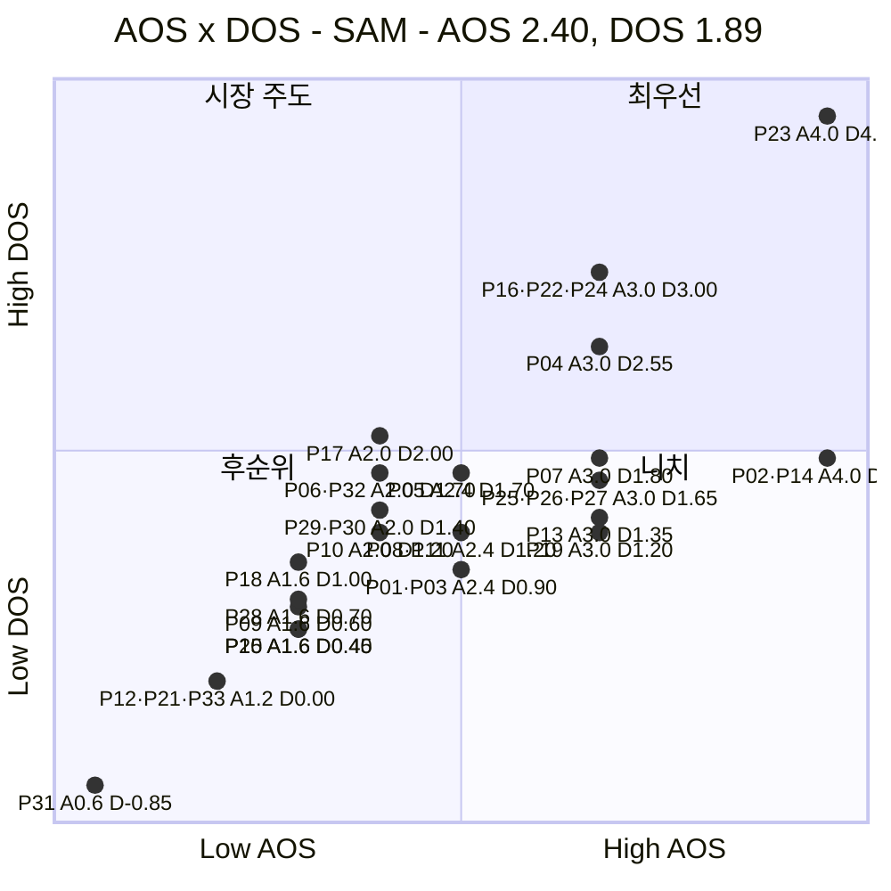
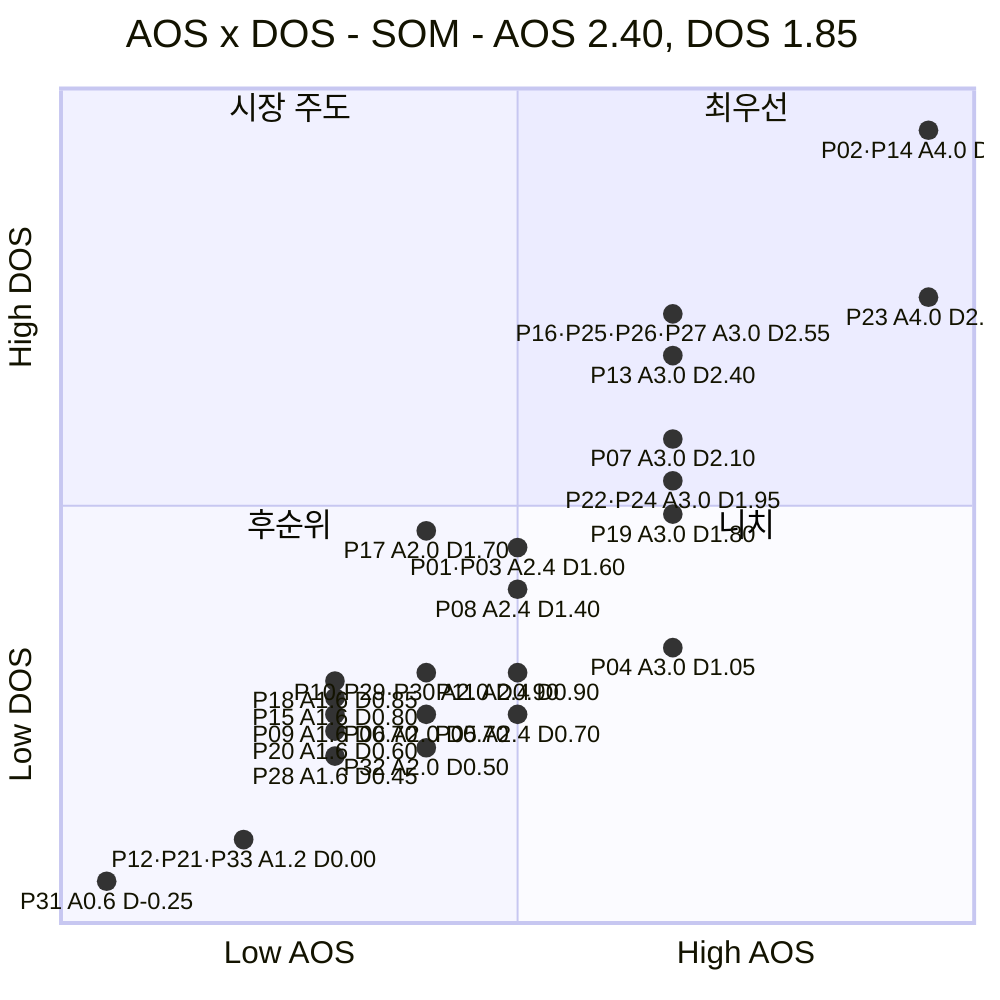

# AOS × DOS 혼합 매트릭스 ③ — 예술품 재분배 플랫폼

> 입력 [AOS 분석 ③](./분석-03-예술품-재분배-플랫폼.md) · [DOS 분석 ③](./분석-03-예술품-재분배-플랫폼-DOS.md) · [분석 방법론](./분석-방법론.md)

> 📊 **산출.** 두 점수를 한 평면에 놓는다. **X축 = AOS**(고객이 얼마나 아픈가), **Y축 = DOS**(그 아픔이 실행 가능한 재분배 시장에 얼마나 넓게 닿는가). DOS가 두 버전이므로 매트릭스도 **SAM 기준·SOM 기준 두 장**이다.
>
> ⚠️ **리서치 적용 방식.** 혼합 매트릭스의 좌표는 1번 DOS의 Persona별 SAM/SOM MR을 승계한다. Giving USA·DataArts·Art Bridges·DC Art Bank·국립현대미술관 자료는 **시장과 선행 운영구조가 실제 존재하는지 검증하는 근거**로 사용하며, 관측자료와 다른 분모를 가진 값을 MR에 그대로 섞지 않는다.

---

## 0. 축 정의와 기준선

### 왜 이 배치인가

| 축 | 지표 | 재는 것 | 출처 |
|---|---|---|---|
| **X (가로)** | **AOS** = Imp × (1 − Sat/5) | **고객 미충족의 강도** — 그 Persona에게 얼마나 중요한가 | AOS 분석 §3 |
| **Y (세로)** | **DOS** = (Imp − Sat) × MR | **시장 파급력** — 그 Pain이 실행 가능한 재분배 시장에 얼마나 넓게 닿는가 | DOS 분석 §1·§2 |

두 지표는 Importance·Satisfaction을 공유하지만 **Market Relevance의 유무**가 다르다. 따라서 가로에서 오른쪽인데 세로에서 아래인 항목은 *“고객에게는 절실하지만 현재 MR 가정에서는 시장 확장성이 상대적으로 작은 문제”*이고, 왼쪽인데 위인 항목은 *“체감 Pain보다 시장 접점이 넓은 구조적 문제”*다.

예술품 재분배 플랫폼은 단일 구매시장이 아니라 **작품 공급 × 수요기관 × 이전비용 Funding**이 함께 있어야 실행되는 3면 구조다. 실제 선행사례도 이를 뒷받침한다. Art Bridges는 대여계약·보험·포장·운송·설치까지 지원하고, 국립현대미술관 나눔미술은행도 선정기관에 운송료·보험료·전시 지원을 제공한다. 즉 **‘작품만 있으면 되는 시장’이 아니라 실행조건이 결합된 시장**이라는 방향은 실제 사례와 맞는다.

### 기준선

| 축 | 기준값 | 산출 |
|---|:---:|---|
| **AOS** | **2.40** | 기존 AOS 분석의 중앙값 기회 경계를 그대로 승계 |
| **DOS (SAM)** | **1.89** | 33개 기준 평균 1.395 + 0.5σ(0.983) |
| **DOS (SOM)** | **1.85** | 33개 기준 평균 1.376 + 0.5σ(0.951) |

> 🖊️ *AOS 경계는 36개 기준 중앙값 2.40이며, 수혜형 3개를 제외한 33개로 다시 계산해도 중앙값은 **2.40**으로 동일하다. DOS는 수혜형을 제외한 33개 분포에서 별도로 경계를 계산했다.*

> ⚠️ **수혜형 3개(P34·P35·P36)는 이 평면에 없다.** DOS가 산출되지 않기 때문이며, 작품 접점·이해·활용이라는 **성과 판정 트랙**으로 별도 관리한다.

### 사분면의 의미

| 사분면 | 조건 | 이름 | 뜻 |
|---|---|---|---|
| **우상단** | AOS ↑ · DOS ↑ | 🔥 **최우선** | 고객 미충족도 크고 현재 MR 기준 시장 파급력도 크다 |
| **좌상단** | AOS ↓ · DOS ↑ | 💰 **시장 주도** | 체감 Pain은 상대적으로 낮지만 많은 재분배 건에 걸치는 구조적 문제다 |
| **우하단** | AOS ↑ · DOS ↓ | 🎯 **니치** | 절실하지만 현재 MR 기준 시장 범위가 상대적으로 제한적이다 |
| **좌하단** | AOS ↓ · DOS ↓ | ⬜ **후순위** | 두 지표 모두 상대적으로 낮다. 단, 위생 요건·간접 조건을 분리해서 읽어야 한다 |

---

## 1. 혼합 매트릭스 — SAM 기준 (확장성)

| 사분면 | 개수 | 항목 |
|---|:---:|---|
| 🔥 **최우선** | **5** | **P23** 매칭·비용조성 분리 · **P04** 권리·책임 불명확 · **P16** 공간·관리조건 판단 · **P22** 공급망 부재 · **P24** 현장변화·최종배송 |
| 💰 **시장 주도** | **1** | **P17** 수령·설치 역할 |
| 🎯 **니치** | **13** | **P02** 매칭 시점 불명확 · **P14** 대기기한 불명확 · **P07** 학생별 동의 반복 · **P13** 보관→창작공간 압박 · **P19** 작품 확보 루트 · **P25** 비용 구성 투명성 · **P26** 이동 중간 신호 · **P27** 기부-결과 연결 · **P01** 활용처 불명확 · **P03** 이전 후 정보 단절 · **P05** 수요기관 관리역량 · **P08** 대량등록 불가 · **P11** 설치 맥락 불명확 |
| ⬜ **후순위** | **14** | **P06** 책임·보험 범위 · **P10** 복잡한 권리관계 · **P29** 승인용 리스크·정산 근거 · **P30** 성과단위 보고 · **P32** 권리·책임 Gate · **P09** 책임 주체 분산 · **P15** 포장·픽업 노동 · **P18** 교육적 활용 제한 · **P20** 관리 난이도 · **P28** 실사자료 재요청 · **P12** 다중 승인 지연 · **P21** 배송 일정 충돌 · **P33** 부서별 요구자료 · **P31** 참여조건 복잡 |

> 📌 **SAM 우상단은 ‘확장했을 때 반드시 풀어야 하는 실행조건’이 강하다.** P23 매칭·비용조성, P22 공급망, P24 최종 배송, P16 공간·관리조건, P04 권리·책임이 여기에 들어간다. Art Bridges가 실제로 계약·보험·포장·운송·설치를 통합 지원하는 것은 이런 실행조건이 현실 운영에서 분리될 수 없다는 점을 뒷받침한다.

---

## 2. 혼합 매트릭스 — SOM 기준 (1년차)

| 사분면 | 개수 | 항목 |
|---|:---:|---|
| 🔥 **최우선** | **11** | **P02** 매칭 시점 불명확 · **P14** 대기기한 불명확 · **P23** 매칭·비용조성 분리 · **P07** 학생별 동의 반복 · **P13** 보관→창작공간 압박 · **P16** 공간·관리조건 판단 · **P22** 공급망 부재 · **P24** 현장변화·최종배송 · **P25** 비용 구성 투명성 · **P26** 이동 중간 신호 · **P27** 기부-결과 연결 |
| 💰 **시장 주도** | **0** | — |
| 🎯 **니치** | **7** | **P04** 권리·책임 불명확 · **P19** 작품 확보 루트 · **P01** 활용처 불명확 · **P03** 이전 후 정보 단절 · **P05** 수요기관 관리역량 · **P08** 대량등록 불가 · **P11** 설치 맥락 불명확 |
| ⬜ **후순위** | **15** | **P06** 책임·보험 범위 · **P10** 복잡한 권리관계 · **P17** 수령·설치 역할 · **P29** 승인용 리스크·정산 근거 · **P30** 성과단위 보고 · **P32** 권리·책임 Gate · **P09** 책임 주체 분산 · **P15** 포장·픽업 노동 · **P18** 교육적 활용 제한 · **P20** 관리 난이도 · **P28** 실사자료 재요청 · **P12** 다중 승인 지연 · **P21** 배송 일정 충돌 · **P33** 부서별 요구자료 · **P31** 참여조건 복잡 |

> 📌 **SOM에서는 작가 매칭·대기(P02·P14), 개인 Funding의 투명성·진행·결과 연결(P25·P26·P27)이 우상단으로 올라온다.** DC Art Bank는 지역 작가 작품을 취득해 공공기관에 대여하는 작가 중심 공급모델이 실제 존재함을 보여주고, Giving USA와 DataArts는 예술·문화 영역의 기부재원이 실제로 큰 자금축임을 확인한다. 다만 이 자료들은 **SOM MR 0.80·0.85를 직접 측정한 통계는 아니다.**

---

## 3. 두 매트릭스 대조

### 어느 칸에서 어느 칸으로 움직였나

| ID | 항목 | SAM | SOM | 왜 움직였나 |
|---|---|---|---|---|
| **P02·P14** | 작가 매칭·대기 | 🎯 니치 | 🔥 최우선 | 작가 공급 MR이 SAM 0.45 → SOM 0.80으로 커진 작업가정의 영향. DC Art Bank가 작가 중심 취득모델의 실재를 보여주지만 0.80 자체는 실측 시장점유율이 아니다. |
| **P25·P26·P27** | 개인 Funding | 🎯 니치 | 🔥 최우선 | 개인 Funding MR이 SAM 0.55 → SOM 0.85로 커진다. Giving USA·DataArts는 예술 기부 재원이 실재함을 지지하지만 0.55/0.85는 작업가중치다. |
| **P07·P13** | 대학·신진 공급 | 🎯 니치 | 🔥 최우선 | 초기에는 대학·개인 작가 공급을 상대적으로 열기 쉬운 채널로 본 SOM 가정 때문에 상승한다. |
| **P04** | 권리·책임 | 🔥 최우선 | 🎯 니치 | 미술관 공급 MR이 SAM 0.85 → SOM 0.35로 낮아진다. Art Bridges는 계약·보험·포장·운송이 실제 핵심 운영요건임을 확인하지만 초기 진입비중은 별도 검증이 필요하다. |
| **P17** | 수령·설치 역할 | 💰 시장 주도 | ⬜ 후순위 | 학교 수요 MR이 SAM 1.00 → SOM 0.85로 낮아져 DOS가 기준선 아래로 이동한다. MMCA는 운송·보험·전시지원이 실제 수령 조건임을 보여준다. |

**네 개는 두 매트릭스 모두 🔥 최우선에 남는다.**

| ID | 항목 | 기능 계열 |
|---|---|---|
| **P23** | 매칭·비용조성 분리 | 매칭·Funding 동시 실행 |
| **P16** | 공간·관리조건 판단 | 수요처 적합성·관리조건 |
| **P22** | 공급망 부재 | 공급망 확보 |
| **P24** | 현장변화·최종배송 | 배송·현장 실행 |

> 📌 **네 항목이 모두 ‘작품을 실제로 이동시키는 실행 사슬’에 몰려 있다.** 공급망(P22) → 작품·비용 동시 매칭(P23) → 수요처 공간·관리 적합성(P16) → 현장 배송 완료(P24)다. AOS와 DOS, SAM과 SOM을 겹쳐도 **단순 검색보다 ‘재분배가 실제로 성립하도록 만드는 실행 구조’가 핵심**이라는 결론이 남는다.

### 우하단(니치)에 고정된 여섯

**P19(작품 확보 루트) · P01(활용처 불명확) · P03(이전 후 정보 단절) · P05(수요기관 관리역량) · P08(대량등록 불가) · P11(설치 맥락 불명확)**은 두 매트릭스 모두 🎯 니치다.

> 📌 이 여섯은 중요하지 않은 문제가 아니다. AOS는 모두 **2.4 이상**이라 고객 미충족은 분명하지만, 현재 DOS의 MR 작업가정에서는 우상단 기준을 넘지 못한다. 특히 **P01·P03은 공급자에게 재분배 이후의 쓰임을 보여주는 핵심 경험**, **P05는 수령기관 신뢰**, **P19는 작품 확보 채널**이므로 MVP 이후 확장 또는 운영 설계에서 계속 추적해야 한다.

---

## 4. 사분면별 행동 지침

| 사분면 | 무엇을 하나 | 이유 |
|---|---|---|
| 🔥 **최우선** | **MVP·JTBD 검증의 1순위로 잡는다.** 특히 SAM·SOM 공통 4개를 먼저 검증 | 고객 미충족과 시장 파급력이 동시에 높고 두 층에서도 흔들리지 않는다 |
| 💰 **시장 주도** | **운영 표준·파트너 조건으로 푼다.** 제품 기능만으로 환원하지 않는다 | SAM의 P17처럼 체감 Pain보다 많은 프로젝트의 실행조건에 걸릴 수 있다 |
| 🎯 **니치** | **로드맵 뒤로 미루되 버리지 않는다** | 공급자 경험·수령기관 신뢰·사후 이력처럼 특정 Persona에게는 매우 중요하다 |
| ⬜ **후순위** | **세 갈래로 분리한다** | ① `Imp−Sat=0` 위생 요건(P12·P21·P33) ② 음수 P31은 과잉 충족 신호 ③ 나머지는 현 단계 상대 후순위 |

> ⚠️ **후순위 칸을 그대로 ‘안 만들 기능’ 목록으로 읽으면 안 된다.** 이 매트릭스는 Pain/Goal의 검증 우선순위이지 기능 백로그가 아니다. 법률·보험·권리 같은 Gate는 낮은 점수라도 서비스 성립을 위한 최소요건이 될 수 있다.

---

## 5. 근거 등급

| 구성 요소 | 등급 | 비고 |
|---|---|---|
| 축 배치와 사분면 정의 | **(확인)** | AOS·DOS 정의에서 직접 도출 |
| DOS 경계 1.89 · 1.85 | **(확인)** | 33개 DOS 분포에서 `평균 + 0.5σ`로 계산 |
| AOS 경계 2.40 | **(확인)** | 기존 AOS 분석의 중앙값 경계를 그대로 승계. 수혜형 제외 33개 중앙값도 2.40 |
| Importance · Satisfaction | **(가설)** | 인터뷰·설문 전 AOS 값 |
| Persona별 SAM/SOM MR | **(작업가정)** | 04 Market Segment 상대 우선순위 + CJM 초기 실행마찰을 0~1로 정규화. 실측 시장점유율 아님 |
| Giving USA 2026 | **(공식 리서치)** | 2025 미국 Arts, Culture & Humanities 기부액 **$27.31B**. 04 TAM의 자금시장 앵커 |
| SMU DataArts National Trends 2025 | **(공식 리서치)** | 6,500+ 예술·문화 조직. 2024 unrestricted contributions: Individual $227,322, Corporate $41,665, Foundation $563,173, Government $233,689 평균 |
| Art Bridges Partner Loan Network | **(공식 선행사례)** | 수장고 작품 순환, loan agreement·insurance·crating·packing·shipping·installation을 운영 지원 |
| MMCA 2023 나눔미술은행 | **(공식 선행사례)** | 최종 10개 기관, 약 200점 지원 예정. 작품운송료·보험료·전시해설·감상자료 지원 |
| DC Art Bank FY2025~26 | **(공식 선행사례)** | 지역 작가·갤러리·비영리의 작품을 취득해 공공기관에 대여. FY2026 개인작가 $373,530, 조직 $4,675 |
| 사분면 배치 결과 | **(가설형 파생결과)** | AOS 가설값 + DOS MR 작업가정의 결합 결과. 좌표보다 칸과 교집합을 중심으로 읽음 |

> ⚠️ **이 매트릭스는 두 개의 파생 지표를 다시 조합한 3차 산출물이다.** AOS의 Importance·Satisfaction 가설 위에 DOS의 MR 작업가정이 얹히고, 그 둘을 다시 두 축으로 배치했다. 따라서 **점의 소수점 위치보다 사분면·SAM/SOM 이동·두 매트릭스 교집합을 중심으로 읽는다.**

**실제 리서치 출처**
- Giving USA 2026: https://givingusa.org/giving-usa-charitable-giving-rose-to-617-20-billion-in-2025-surpassing-the-600-billion-mark-for-the-first-time/
- SMU DataArts, National Trends 2025: https://www.culturaldata.org/national-trends/national-trends-2025/
- SMU DataArts, Data Tables: https://www.culturaldata.org/national-trends/national-trends-2025/data-tables/
- Art Bridges, Partner Loan Network: https://artbridgesfoundation.org/partner-loan-network
- DC Arts, FY2025 Art Bank Program: https://dcarts.dc.gov/page/fy-2025-grantees-art-bank-program-abp
- DC Arts, FY2026 Art Bank Program: https://dcarts.dc.gov/public-art/fy-2026-grantees-art-bank-program-abp
- 국립현대미술관, 2023 나눔미술은행: https://www.mmca.go.kr/pr/pressDetail.do?bdCId=202303200008739

---

## 6. 다음 단계

| 순위 | 할 일 | 이유 |
|:---:|---|---|
| **1** | 🔥 **SAM·SOM 공통 최우선 4개(P16·P22·P23·P24)를 JTBD·MVP 검증의 1순위로 둔다** | 두 층과 두 축을 바꿔도 우상단에 남는다 |
| **2** | **실제 프로젝트 데이터로 MR을 교체한다** | 현재 Y축의 정확한 숫자는 작업가정이다. 공급원·수령기관·Funding source별 실제 비중을 파일럿에서 기록해야 한다 |
| **3** | **Art Bridges·MMCA 사례를 기준으로 권리·보험·포장·운송·설치 체크리스트를 검증한다** | P04·P16·P17·P24가 실제 운영에서 어떤 Gate인지 확인하기 위해서다 |
| **4** | **개인/기업 Funding 구성비를 DataArts·국내 문화예술 후원 통계와 대조한다** | P25~P30의 SAM/SOM 이동이 Funding MR 가정에 민감하다 |

**→ 챕터 07 JTBD** 로 넘긴다. 인터뷰 1순위는 두 매트릭스 공통 🔥 최우선 Pain을 보유한 **문화취약지역 NGO 담당 김도현(P22·P23·P24)**과 **문화취약지역 학교 담당 이지현(P16)**이다. 동시에 공급 측 Gate인 **미술관 컬렉션 담당 박소연(P04)**은 SAM 확장 검증 대상으로 별도 유지한다.
