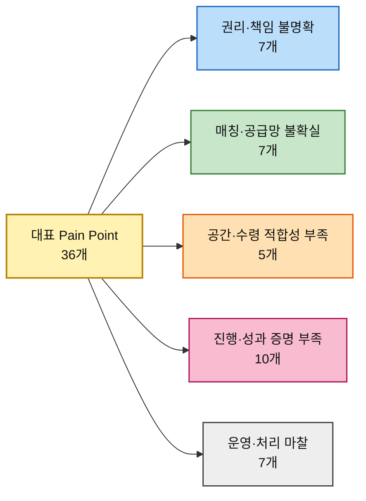

# 평가 대상 ③ — 대표 Pain Point 36개와 그 Goal

> [분석 방법론 §2](./분석-방법론.md) · 출처 [챕터 05 고객 여정지도 ③](../05-persona-journey/분석-03-예술품-재분배-플랫폼-고객여정지도.md) · [페르소나 스펙트럼 ③](../05-persona-journey/분석-03-예술품-재분배-플랫폼-페르소나-스펙트럼.md)

> 🎯 **이 문서의 용도.** 방법론 §2가 요구하는 **AOS 채점 대상**을 확정한다. 고객 여정지도의 Pain Point에서 **페르소나 12명 × 3개 = 36개**를 대표로 추리고, 각 Pain이 **어떤 Goal을 막고 있는지**를 함께 적었다. **Importance·Satisfaction 채점은 아직 하지 않았다** — 이 문서는 채점표의 왼쪽 열이다.

---

## 1. 선정 규칙과 Goal 열의 의미

방법론 §2가 열어둔 두 질문에 먼저 답하고 추렸다.

| 방법론의 질문 | 이 분석의 답 |
|---|---|
| *"문제정의·Segment 단계의 Pain List를 쓰면 어떻게 될까?"* | **쓰지 않았다.** 챕터 04의 TAM-SAM-SOM·Market Segment는 *시장 범위와 참여 구조*를 정하는 입력값이다. AOS는 그다음 단계에서 **실제 Persona가 여정 중 겪는 Pain/Goal**을 평가해야 하므로, 시장 수준의 조건을 그대로 채점 대상으로 가져오지 않는다 |
| *"스펙트럼 4가지 중 누구의 Pain List를 써야 할까?"* | **넷 다 쓴다.** Core·Adjacent·Extreme·Non-user는 서로 다른 실패 지점을 드러낸다. 공급자는 권리·매칭, 수요기관은 공간·수령, Funding은 신뢰·성과, Non-user는 참여 장벽·최종 향유를 보여준다. 한 유형만 남기면 기회 구조가 한쪽으로 왜곡된다 |

그 위에서 인물마다 세 개씩 골랐다.

| # | 규칙 | 이유 |
|---|---|---|
| **1** | 그 인물의 **최대 병목 단계**에서 반드시 하나 | 여정지도에서 이미 확인한 최대 병목을 빠뜨리면 그 Persona를 대표하는 Pain 집합이 아니게 된다 |
| **2** | **서로 다른 단계**에서 뽑는다 | 한 단계의 불편을 세 번 세지 않고, 진입 → 의사결정 → 실행/결과처럼 여정의 서로 다른 실패 지점을 남긴다 |
| **3** | **이탈·실행 실패로 직결**되는 것 우선 | 단순한 불편보다 작품 등록·이전·수령·후원·향유가 실제로 중단되거나 가치 전달이 실패하는 Pain을 우선한다 |

> 📌 **선정의 목적은 36개를 '좋은 문제 목록'으로 만드는 것이 아니다.** 이후 Importance·Satisfaction을 같은 기준으로 비교할 수 있도록, 각 Persona의 여정에서 **서로 다른 성격의 대표 Pain 3개**를 남기는 것이 목적이다. 따라서 비슷한 문장을 중복해서 뽑기보다 `의사결정 차단 · 실행 차단 · 결과 단절`이 함께 보이도록 선택했다.

### Goal을 두 층으로 적은 이유

방법론 §2의 평가 단위는 *"각 페르소나의 주요 Pain·Goal"* 이다. **Pain만으로는 Importance와 Satisfaction을 매길 수 없다.** 무엇에 대한 중요도이고 무엇에 대한 충족도인지가 정해져야 점수가 의미를 갖는다.

| 층 | 무엇인가 | 어디에 쓰는가 |
|---|---|---|
| **페르소나 Goal** | 그 사람이 이 서비스와의 관계 전체에서 이루려는 최종 결과 | Importance를 해석할 때 **왜 이 Pain이 중요한지** 판단하는 상위 기준 |
| **막히는 Goal** *(Pain별)* | 특정 Journey 단계에서 실제로 달성하려다 막힌 구체적 목표 | **Satisfaction의 직접 채점 대상.** *"지금 쓰는 대체 솔루션으로 이 구체적 Goal이 얼마나 달성되는가"* 를 묻는다 |

---

## 2. 골격 A · 작품 공급·진입형 — 18개

### 독립 작가 김서윤 「팔리지 않아도 쓰임은 끝나지 않았다」

> 🎯 **페르소나 Goal** — 작품을 새로운 공간과 관람자에게 연결해 **작품의 쓰임을 이어가는 것**

| ID | 여정 단계 | Pain Point | 막히는 Goal | 선정 사유 |
|---|---|---|---|---|
| **P01** | ③ 재분배 판단 | 재분배 후 활용처가 불명확하면 작품을 내놓기 어렵다 | 내놓기 전에 작품이 **어떤 공간에서 어떤 목적으로 쓰일지 확인**하는 것 | 공급 전환 여부를 결정하는 핵심 판단 지점 |
| **P02** | ⑤ 매칭 대기 | 수요가 있는지, 언제 연결될지 보이지 않는다 | 작품이 **언제 어떤 수요처와 연결될지 파악**하는 것 | **최대 병목** |
| **P03** | ⑦ 활용 확인 | 이전 뒤 정보가 끊기면 재분배의 의미를 체감하지 못한다 | 작품이 실제로 **설치·전시·활용되었는지 확인**하는 것 | 반복 참여 근거가 사라지는 지점 |

### 미술관 컬렉션 담당 박소연 「전시되지 않는 작품의 다음 공간」

> 🎯 **페르소나 Goal** — 재분배 가능한 작품을 필요한 기관에 연결해 **소장품의 새로운 활용 가능성을 만드는 것**

| ID | 여정 단계 | Pain Point | 막히는 Goal | 선정 사유 |
|---|---|---|---|---|
| **P04** | ② 권리·상태 검문 | 권리·책임이 하나라도 불명확하면 진행이 멈춘다 | 이 작품을 외부로 이전할 **권한과 책임 범위를 명확히 확인**하는 것 | **최대 병목** |
| **P05** | ⑤ 매칭 대기 | 수요기관의 관리 역량을 확인하기 어렵다 | 수요기관이 작품을 **안전하게 설치·관리할 수 있는지 검증**하는 것 | 기관이 작품을 외부로 보내기 전에 반드시 확인해야 하는 수요처 검증 |
| **P06** | ⑥ 이전·배송 | 훼손·분실 시 책임과 보험 범위가 불명확할 수 있다 | 사고가 나도 책임이 흔들리지 않도록 **운송·보험 책임 주체를 확정**하는 것 | 권리 확인을 통과한 뒤에도 실제 이전을 멈출 수 있는 실행 리스크 |

### 미술대학 작품관리 담당 한유진 「졸업작품의 다음 쓰임이 필요하다」

> 🎯 **페르소나 Goal** — 재분배 가능한 교육 작품에 **새로운 활용처를 만드는 것**

| ID | 여정 단계 | Pain Point | 막히는 Goal | 선정 사유 |
|---|---|---|---|---|
| **P07** | ② 권리·상태 검문 | 학생별 동의 수집이 반복 업무가 된다 | 학생 작품의 재분배 동의를 **누락 없이 한 번에 확보**하는 것 | **최대 병목 축의 대표 Pain** |
| **P08** | ④ 등록·승인 | 대량 등록이 불가능하면 사용 자체가 어렵다 | 여러 작품을 **한 번에 등록·분류·관리**하는 것 | 다수 작품을 플랫폼 공급으로 전환할 수 있는지 좌우하는 운영 조건 |
| **P09** | ⑥ 이전·배송 | 학교·학생·수령기관 사이 책임이 분산된다 | 작품 인계 과정에서 **누가 어디까지 책임지는지 명확히 하는 것** | 작품 인계 직전에 책임 주체가 갈라지는 실행 공백 |

### 갤러리 작품관리 담당 윤태호 「미판매 작품을 마음대로 보낼 수는 없다」

> 🎯 **페르소나 Goal** — 권리 조건이 충족되는 작품에 **새로운 전시·활용 기회를 만드는 것**

| ID | 여정 단계 | Pain Point | 막히는 Goal | 선정 사유 |
|---|---|---|---|---|
| **P10** | ② 권리·상태 검문 | 권리관계가 복잡하면 바로 중단된다 | 갤러리가 이 작품의 재분배를 **결정할 권한이 있는지 확인**하는 것 | **최대 병목** |
| **P11** | ③ 재분배 판단 | 설치 맥락이 불명확하면 작가 동의를 받기 어렵다 | 작가가 수용할 수 있도록 **수요처·공간·활용 맥락을 확인**하는 것 | 작가 승인 여부를 가르는 맥락 정보 |
| **P12** | ⑤ 매칭 대기 | 승인 주체가 둘 이상이면 의사결정이 느려진다 | 작가와 갤러리의 **공동 승인을 지연 없이 완료**하는 것 | 매칭 이후 실제 이전까지의 승인 리드타임을 늘리는 지점 |

### 신진 작가 임하늘 「작업실이 작품으로 꽉 찼다」

> 🎯 **페르소나 Goal** — 폐기하기 전에 작품을 필요로 하는 **새로운 공간을 찾는 것**

| ID | 여정 단계 | Pain Point | 막히는 Goal | 선정 사유 |
|---|---|---|---|---|
| **P13** | ⓪ 유휴·보관 지속 | 보관 문제가 곧 창작 공간 문제로 번진다 | 작품을 폐기하지 않으면서 **다음 작업을 위한 공간을 확보**하는 것 | 시간 압박 이전에 이미 존재하는 구조적 보관 한계 |
| **P14** | ⑤ 매칭 대기 | 대기 기한을 모르면 폐기로 전환할 수 있다 | 폐기 결정을 내리기 전에 **매칭 가능 시점과 처리 기한을 확인**하는 것 | **최대 병목** |
| **P15** | ⑥ 이전·배송 | 포장·픽업 노동이 추가되면 마지막에 포기할 수 있다 | 추가 노동 때문에 포기하지 않고 **작품 인계를 실제로 완료**하는 것 | 매칭이 성립한 뒤에도 실제 이전을 무산시킬 수 있는 마지막 마찰 |

---

### 작품 보유기관 담당 서재원 「작품은 있어도 바로 내놓을 수 없다」

> 🎯 **페르소나 Goal** — 작품의 **재분배 가능 조건과 책임 범위를 명확하게 확인하는 것**

| ID | 여정 단계 | Pain Point | 막히는 Goal | 선정 사유 |
|---|---|---|---|---|
| **P31** | ① 재분배 가능성 확인 | 참여 조건이 복잡하면 검토 자체를 미룬다 | 우리 기관이 **참여 가능한지 빠르게 판정**하는 것 | 잠재 공급자가 검토 자체를 시작하지 않게 만드는 진입 마찰 |
| **P32** | ② 권리·책임 검문 | 권리와 책임이 불명확하면 여기서 여정이 끝난다 | 소유권·저작권·동의·보험·책임을 확인해 **참여 가능 여부를 확정**하는 것 | **최대 병목** |
| **P33** | ③ 내부 검토 | 부서별 요구자료가 다르면 검토비용이 커진다 | 여러 부서가 요구하는 자료를 **한 번에 정리해 내부 검토를 끝내는 것** | 권리 검토 이후에도 내부 승인 비용을 누적시키는 구조 |

---

## 3. 골격 B · 수요기관형 — 9개

### 문화취약지역 학교 담당 이지현 「학교에서 실제 작품을 보여주고 싶다」

> 🎯 **페르소나 Goal** — 학생들이 학교 안에서 지속적으로 **실제 작품을 보고 경험하게 하는 것**

| ID | 여정 단계 | Pain Point | 막히는 Goal | 선정 사유 |
|---|---|---|---|---|
| **P16** | ③ 공간·관리 검문 | 공간 적합성과 관리조건을 판단하기 어렵다 | 학교 공간과 학생에게 맞는 작품을 **안전하게 선택**하는 것 | **최대 병목 축의 대표 Pain** |
| **P17** | ⑥ 수령 준비 | 수령·설치 역할이 불명확하면 마지막에 지연된다 | 배송 전 **수령·설치 담당과 일정을 확정**하는 것 | **최대 병목 축의 대표 Pain** |
| **P18** | ⑦ 설치·향유 | 작품만 걸어두면 교육적 활용이 제한될 수 있다 | 작품을 수업·활동과 연결해 **실제 교육적 향유를 만드는 것** | 작품 수령이 실제 문화예술 경험으로 전환되는 가치 전달 지점 |

### 지역 문화시설 담당 오수진 「공간은 있는데 보여줄 작품이 부족하다」

> 🎯 **페르소나 Goal** — 재분배 작품을 활용해 주민들이 가까운 곳에서 **예술작품을 경험하게 하는 것**

| ID | 여정 단계 | Pain Point | 막히는 Goal | 선정 사유 |
|---|---|---|---|---|
| **P19** | ⓪ 문화자원 부족 | 공간이 있어도 작품 확보 루트가 제한적이다 | 기획 때마다 새로 찾지 않아도 되는 **지속적인 작품 공급 경로를 확보**하는 것 | 공간은 있지만 콘텐츠를 채울 지속 공급원이 부족한 구조적 문제 |
| **P20** | ③ 공간·관리 검문 | 관리 난이도가 보이지 않으면 신청하기 어렵다 | 시설이 실제로 감당할 수 있는 작품인지 **관리조건을 사전에 판단**하는 것 | **최대 병목** |
| **P21** | ⑥ 수령 준비 | 시설 운영 일정과 배송 일정이 충돌할 수 있다 | 전시·시설 운영 일정과 **배송·설치 일정을 맞추는 것** | 매칭 성공이 실제 설치로 이어지지 못하게 하는 일정 마찰 |

### 문화취약지역 NGO 담당 김도현 「외부 지원 없이는 작품을 확보하기 어렵다」

> 🎯 **페르소나 Goal** — 외부의 유휴 작품과 기부금을 연결해 지역 주민에게 **지속 가능한 문화자원을 제공하는 것**

| ID | 여정 단계 | Pain Point | 막히는 Goal | 선정 사유 |
|---|---|---|---|---|
| **P22** | ⓪ 문화자원 부족 | 수요가 있어도 공급망이 없다 | 지역 밖에서 지속적으로 **작품을 확보할 공급 경로를 만드는 것** | 수요가 있어도 프로젝트를 시작할 공급 기반이 없는 구조 |
| **P23** | ⑤ 매칭 | 작품 매칭과 비용조성이 따로 놀면 프로젝트가 멈춘다 | 작품과 운송·보험·설치비를 **동시에 확보**하는 것 | **최대 병목 축의 대표 Pain** |
| **P24** | ⑥ 수령 준비 | 현장 상황 변화가 최종 배송을 막을 수 있다 | 현장 조건이 바뀌어도 **수령·설치를 끝까지 완료**하는 것 | **최대 병목 축의 대표 Pain** |

---

## 4. 골격 C · Funding형 — 6개

### 개인 기부자 정민준 「내 3만원이 어떤 작품을 움직였나」

> 🎯 **페르소나 Goal** — 자신의 기부금이 어떤 작품을 어느 지역으로 이동시키고 **어떤 문화 경험을 만들었는지 확인하는 것**

| ID | 여정 단계 | Pain Point | 막히는 Goal | 선정 사유 |
|---|---|---|---|---|
| **P25** | ② 비용·신뢰 검문 | 총 모금액만 보이고 비용 구성이 없으면 신뢰하기 어렵다 | 내기 전에 **기부금이 어떤 비용에 쓰이는지 확인**하는 것 | **최대 병목 축의 대표 Pain** |
| **P26** | ⑤ 진행 대기 | 실물 이동은 시간이 걸리는데 중간 신호가 없으면 관계가 끊긴다 | 기부 후에도 **작품 이동이 실제로 진행 중인지 계속 확인**하는 것 | **최대 병목 축의 대표 Pain** |
| **P27** | ⑥ 결과 증명 | 전체 성과만 보이면 내 기부와 결과가 연결되지 않는다 | 내 기부가 **어떤 작품·기관·지역의 결과를 만들었는지 확인**하는 것 | 이 Persona의 Goal 자체 |

### 기업 CSR·ESG 담당 최은영 「사회공헌 결과를 숫자로 보여줘야 한다」

> 🎯 **페르소나 Goal** — 작품 재분배와 문화예술 접근성 개선을 연결하고 **지원 작품 수·지역·기관의 성과를 확보하는 것**

| ID | 여정 단계 | Pain Point | 막히는 Goal | 선정 사유 |
|---|---|---|---|---|
| **P28** | ② 비용·신뢰 검문 | 한 번에 검토할 실사 자료가 없으면 부서별 재요청이 생긴다 | 법무·재무·사업 부서가 볼 **실사 자료를 한 번에 확보**하는 것 | 내부 승인 전에 반복적인 자료 재요청을 발생시키는 검토 비용 |
| **P29** | ④ 기부·내부 승인 | 리스크·정산·성과 근거가 부족하면 내부 승인을 받기 어렵다 | 필요한 근거를 갖춰 **결재선을 통과하고 예산을 집행**하는 것 | **최대 병목** |
| **P30** | ⑥ 결과 증명 | 성과 단위가 정리되지 않으면 내부 보고에 쓰기 어렵다 | 지원 작품·기관·지역을 **보고 가능한 확정 수치로 확보**하는 것 | 집행 결과가 조직 내부의 공식 성과로 전환되는 지점 |

---

## 5. 골격 D · 수혜형 — 3개

### 최종 향유 학생 박하린 「플랫폼은 모르지만 작품은 경험한다」

> 🎯 **페르소나 Goal** — 학교나 생활공간에서 자연스럽게 **실제 작품을 보고 경험하는 것**

| ID | 여정 단계 | Pain Point | 막히는 Goal | 선정 사유 |
|---|---|---|---|---|
| **P34** | ⓪ 예술 접점 부족 | 예술작품을 일상적으로 접할 기회가 제한적이다 | 학교·생활공간에서 **실제 작품을 반복적으로 접하는 것** | 플랫폼 실행이 실제 문화예술 접근성 개선으로 이어졌는지 판단하는 출발점 |
| **P35** | ① 작품 발견 | 작품이 있어도 설명·맥락이 없으면 그냥 지나칠 수 있다 | 작품이 무엇인지 **쉽게 이해하고 관심을 갖는 것** | 물리적 설치와 실제 관심·이해 사이를 가르는 지점 |
| **P36** | ③ 향유·활용 | 활동과 연결되지 않으면 경험이 수동적 관람으로 끝난다 | 작품을 수업·대화·프로그램과 연결해 **능동적으로 향유하는 것** | 여정지도가 지목한 **최대 가치 전달 지점** |

---

## 6. Goal 열 해설 — 36개의 목표를 세로로 읽으면

**막히는 Goal 열을 위에서 아래로 읽으면 반복되는 동사가 선명하다.** 확인하다 · 판단하다 · 연결하다 · 확보하다 · 완료하다 · 증명하다. 이 서비스에서 고객이 하는 일은 단순히 작품을 *보내거나 받는 것*이 아니다. **재분배가 가능한지 판단하고 → 실행 조건을 맞추고 → 실제 이동과 활용이 일어났음을 확인하는 것**이 반복된다.

이 패턴은 서비스의 성격을 바꿔 읽게 한다. 공급자는 *“내놓아도 되는가”*, 수요기관은 *“우리 공간이 받을 수 있는가”*, Funding Persona는 *“이 비용을 믿고 집행해도 되는가”*, 기관 담당자는 *“내부 책임을 감수해도 되는가”*를 판단한다. 즉 플랫폼의 핵심 역할은 작품 목록을 많이 보여주는 데 있지 않고, **각 참여자가 다음 행동을 결정할 수 있도록 불확실성을 줄여 주는 것**에 가깝다.

**페르소나 Goal과 막히는 Goal의 층위가 다른 점도 중요하다.** 상위 Goal은 결과 지향이다 — *“작품의 쓰임을 이어간다”, “학생이 실제 작품을 경험한다”, “지원 작품 수·지역·기관의 성과를 확보한다”*. 반면 Pain별 Goal은 대부분 그 결과에 가기 전 필요한 **의사결정 조건**이다 — *“권한 확인”, “관리 가능성 검증”, “매칭 시점 파악”, “비용 구성 확인”, “내부 승인 통과”*. **원하는 것은 순환·향유·성과이고, 실제 Journey에서 반복하는 일은 실패 가능성을 줄이는 것**이다. 따라서 서비스가 각 단계에서 제공해야 할 것은 감성적 설득보다 **판단 가능한 근거와 다음 단계의 확실성**이다.

**공급자와 수요자는 같은 ‘매칭’을 서로 다르게 본다.** 김서윤·임하늘에게 매칭은 *“언제 작품을 비울 수 있는가”*의 문제이고, 박소연·윤태호에게는 *“보내도 되는 수요처인가”*의 문제다. 이지현·오수진·김도현에게는 *“우리 공간이 실제로 받을 수 있는가”*의 문제다. 따라서 `매칭 성공 = 작품과 기관을 연결함`으로만 정의하면 부족하다. **권리 조건 + 공간 적합성 + 비용 + 일정까지 통과해야 ‘실행 가능한 매칭’**이다.

**Funding Persona의 Goal은 작품 이동 이후까지 이어진다.** 정민준은 기부 시점보다 *“내 돈이 어떤 작품의 이동과 향유를 만들었는가”*를 확인하려 하고, 최은영은 그 결과를 *“내부 보고 가능한 수치”*로 바꾸려 한다. 따라서 Funding UX를 결제 단계로만 보면 핵심이 잘린다. **비용 근거 → 진행 신호 → 설치·활용 결과**가 하나의 Goal 사슬이다.

**작품 보유기관 담당 서재원의 Goal은 방향을 조심해서 읽어야 한다.** P31~P33에서 이 사람의 최우선 목표는 재분배 참여 자체가 아니라 **기관이 책임질 수 있는 범위 안에서 안전하게 결정하는 것**이다. 조건이 불명확하면 기존 보관을 유지하는 것도 이 Persona에게는 합리적인 선택이다. 따라서 Importance를 *“우리 사업에 이 공급자가 얼마나 필요한가”*로 읽으면 안 된다. **그 사람에게 그 Goal이 얼마나 중요한가**를 기준으로 채점해야 한다.

**최종 향유자 박하린의 3개만 Goal의 층위가 다르다.** P34·P35·P36은 플랫폼 전환 행동이 아니라 **문화예술 접근성과 실제 향유 결과**를 측정한다. 이 세 Pain은 AOS 표에 함께 올릴 수 있지만, 높은 점수가 나왔다고 해서 곧바로 유료 기능 우선순위로 해석하면 안 된다. **사업 기회가 아니라 서비스가 사회적 목적을 실제로 달성했는지 보는 성과 기준**으로 분리해서 읽어야 한다.

**Goal이 겹치는 곳이 기능 후보이자 데이터 구조의 후보가 된다.** `확인·판단` 계열(P04·P05·P06·P10·P16·P20·P25·P28·P29·P31·P32)은 **권리·조건·비용·책임을 판단하는 정보 구조**로, `연결·확보` 계열(P01·P02·P13·P14·P19·P22·P23)은 **공급-수요-Funding을 실행 가능하게 묶는 매칭 구조**로, `결과 확인·증명` 계열(P03·P26·P27·P30·P34·P35·P36)은 **수령·설치·향유·활용 기록**으로 수렴한다. 이후 AOS 상위권을 묶을 때 이 축을 사용하면 36개 Pain을 그대로 기능 36개로 번역하는 오류를 피할 수 있다.

---

## 7. 성격별 분류 — 36개를 가로지르는 다섯 갈래

| 성격 | 개수 | 해당 ID | 공통 처방 |
|---|:---:|---|---|
| **권리·책임 불명확** — 작품을 내놓거나 받을 법적·운영상 조건이 확정되지 않는다 | **7** | P04 · P06 · P07 · P09 · P10 · P11 · P32 | 권리 상태 · 표준 동의 · 보험 · 인계·책임 범위 |
| **매칭·공급망 불확실** — 작품·수요는 있어도 누구와 언제 연결될지 예측하기 어렵다 | **7** | P01 · P02 · P13 · P14 · P19 · P22 · P23 | 공급·수요 풀 · 매칭 조건 · 예상 시점 · Funding 동시 연결 |
| **공간·수령 적합성 부족** — 연결된 작품을 실제 공간에서 안전하게 받을 수 있는지 판단하기 어렵다 | **5** | P05 · P16 · P17 · P20 · P24 | 작품-공간 조건 · 설치·관리 체크 · 수령 가능 상태 |
| **진행·성과 증명 부족** — 비용 집행부터 설치·향유까지 결과가 한 흐름으로 연결되지 않는다 | **10** | P03 · P25 · P26 · P27 · P28 · P29 · P30 · P34 · P35 · P36 | 비용 근거 · 상태 타임라인 · 수령·설치·향유·활용 기록 |
| **운영·처리 마찰** — 반복 입력·승인·일정·활용 준비가 실행비용을 키운다 | **7** | P08 · P12 · P15 · P18 · P21 · P31 · P33 | 일괄 처리 · 공동 승인 · 픽업·일정 조율 · 활용 지원 |

> 📌 **가장 많은 것은 `진행·성과 증명 부족` 10개지만, 이것을 곧바로 “리포트 기능이 1순위”라고 읽으면 안 된다.** 이 갈래가 큰 이유는 공급자·기부자·기업·최종 향유자가 서로 다른 이유로 **같은 실행 기록**을 필요로 하기 때문이다. 실제 공통 자산 후보는 `어떤 작품이 → 어떤 조건으로 → 어디에 이동해 → 언제 수령·설치되고 → 어떻게 활용되었는가`를 잇는 기록 구조다.
>
> 📌 **다섯 갈래는 기능 메뉴가 아니라 검증 축이다.** AOS 채점 후 같은 갈래의 Pain이 반복해서 상위에 남을 때 비로소 하나의 기능·운영 역량으로 묶는다. 지금 단계에서 36개 Pain을 36개 기능 요구사항으로 번역하지 않는다.

---

## 8. 채점 전에 확정할 것

| # | 확정 사항 | 지금 상태 |
|---|---|---|
| **1** | **사분면 경계 기준값** | **확정. 중앙값 기준을 사용한다.** Importance 중앙값을 Y축, Satisfaction 중앙값을 X축 기준으로 사용하고 AOS 역시 전체 AOS 중앙값을 기회 경계로 사용한다. 산출물에는 실제 중앙값을 반드시 표시한다 |
| **2** | **Satisfaction의 기준 대상** | 방법론 §2대로 **우리 서비스가 아니라 지금 그 사람이 쓰는 대체 솔루션**이 `막히는 Goal`을 얼마나 달성시키는지를 매긴다. 같은 Pain이라도 Persona가 쓰는 대체 방식이 다르면 Satisfaction도 달라질 수 있다 |
| **3** | **Importance의 관점** | 원칙은 **'그 사람의 Goal 달성에 얼마나 중요한가'**다. 우리 사업에 필요한 공급·후원·성과라는 이유로 점수를 올리지 않는다. 특히 서재원은 위험 회피, 박하린은 최종 성과라는 다른 층위가 있으므로 §6 해석을 함께 본다 |
| **4** | **채점자와 근거** | **인터뷰·설문이 없다.** 36개 전부 가설 등급이다. 따라서 Importance와 Satisfaction 각각에 판정 근거를 남기고, 경쟁·대체재 조사나 사용자 인터뷰가 들어오면 해당 행만 다시 채점할 수 있게 만든다 |

> ⚠️ **이 36개는 관찰된 Pain이 아니라 기존 Persona와 고객 여정 구조에서 추론한 Pain이다.** 출처인 여정지도에서도 행동·생각·Pain의 세부 문장은 인터뷰 전 가설이며, `막히는 Goal` 열은 그 Pain에서 한 번 더 추론한 것이므로 **한 단계 더 얇다.** **AOS 순위는 "무엇을 먼저 검증할지"의 순서이지 "무엇을 먼저 만들지"의 순서가 아니다.**
>
> ⚠️ **전체 CJM Pain Point → 대표 36개로 줄이면서 제외한 항목이 있다.** 중복도가 높거나 다른 단계·Persona에서 같은 구조가 더 선명하게 잡힌 Pain을 제외했다. **제외된 Pain이 무의미하다는 뜻은 아니며**, AOS 상위권의 근거가 약하거나 특정 Persona가 빠진다면 고객 여정지도로 돌아가 보충해야 한다.

---

## 9. 다음 단계

1. §8의 4개 원칙을 **36개 전 행에 동일하게 적용**한다.
2. 각 Pain에 Importance·Satisfaction을 매기고 **AOS = Importance × (1 − Satisfaction/5)** 로 계산한다. Satisfaction은 `Pain 자체`가 아니라 **그 Pain이 막는 Goal을 현재 대체 솔루션이 얼마나 달성시키는지**를 기준으로 매긴다.
3. AOS를 **내림차순 정렬**하고, Importance·Satisfaction의 **중앙값 기준 사분면**에 배치한다 (방법론 §1).
4. `AOS 상위`와 `Q1`을 기계적으로 같은 것으로 보지 않는다. 경계선 때문에 사분면과 AOS 순위가 어긋나는 항목은 **AOS 값 + 실제 Pain 맥락**을 함께 읽는다.
5. 상위권을 §6의 **Goal 계열과 §7의 다섯 성격**으로 다시 묶어 개별 Pain을 기능·운영 역량 단위로 환원한다.
6. 최종적으로 Q1과 AOS 상위 항목을 **챕터 07 JTBD 인터뷰 대상**으로 넘기되, 박하린의 수혜형 Pain은 사업기회와 분리해 **성과 검증 질문**으로 넘긴다.
