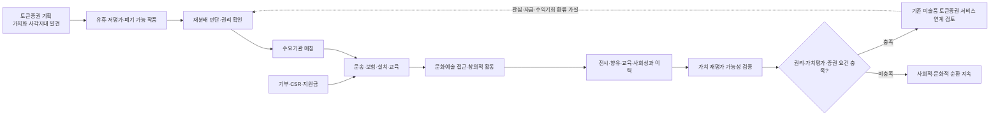
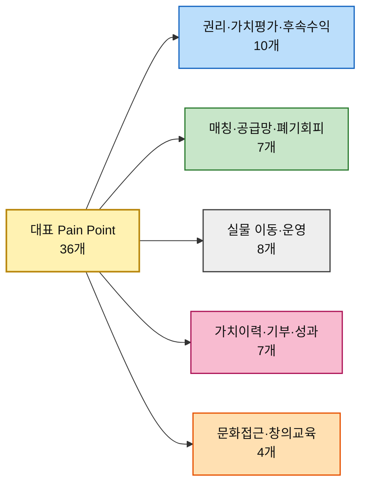

# 평가 대상 ③ — 대표 Pain Point 36개와 그 Goal

> [분석 방법론 §2](./분석-방법론.md) · 출처 [챕터 05 고객 여정지도 ③](../05-persona-journey/분석-03-예술품-재분배-플랫폼-고객여정지도.md) · [페르소나 스펙트럼 ③](../05-persona-journey/분석-03-예술품-재분배-플랫폼-페르소나-스펙트럼.md)

> 🎯 **이 문서의 용도.** 방법론 §2가 요구하는 **AOS 채점 대상**을 확정한다. 페르소나 12명 × 3개 = **36개**를 유지하되, 이번 재작성에서는 단순 재분배 실행만이 아니라 **재분배 → 활용·성과 이력 → 가치 재평가 → 적격 작품의 토큰증권 연계**라는 전체 가치순환에서 실제로 끊기는 Goal을 대표 Pain으로 잡았다. Importance·Satisfaction 채점은 다음 산출물에서 한다.

> 🎯 **사업 본론 고정.** 이 분석의 출발점은 **미술품 토큰증권 서비스 기획**이다. 기존 거래·전시·투자 구조에서 가치가 충분히 발견되지 못해 유휴·장기보관·폐기 가능 상태에 놓인 작품을 단순 폐기하지 않고, 문화예술 접근성이 낮은 지역·학교·복지·문화시설·NGO에 재분배한다. 개인·기업·재단의 기부·CSR·지원금은 운송·보험·설치·교육활동 등 재분배 실행을 돕고, 그 과정에서 **전시·활용·향유·교육·사회성과 이력**을 작품 단위로 축적한다. 이 이력은 작품 가격 상승을 보장하는 것이 아니라 **가치 재평가 가능성을 검증하는 데이터**이며, 권리·가치평가·증권성·공시 등 요건을 충족한 일부 작품만 향후 기존 미술품 토큰증권 서비스와 연계한다.
>
> 🔁 **핵심 선순환 가설.** `토큰증권 기획 → 가치 사각지대 작품 발견 → 재분배·기부 → 문화접근성·창의적 교육 → 활용·성과 이력 → 가치 재평가 검토 → 적격 작품의 토큰증권 연계 → 관심·자금·수익기회가 작가·기관·작품 순환으로 환류`.
>
> ⚠️ **경계.** `기부`와 `투자`는 같은 돈이 아니다. 기부금은 사회적 재분배 목적의 자금이고, 토큰증권 투자는 자본시장법상 증권에 관한 별도 금융거래다. 또한 “무가치한 작품”은 **객관적으로 가치가 0인 작품**이 아니라, 현재 시장에서 거래·전시·활용 가치가 충분히 발견되지 못한 작품이라는 사업 문제정의로 사용한다.

---

## 1. 선정 규칙과 Goal 열의 의미

방법론 §2가 열어둔 두 질문에 먼저 답하고 추렸다.

| 방법론의 질문 | 이 분석의 답 |
|---|---|
| *"문제정의·Segment 단계의 Pain List를 쓰면 어떻게 될까?"* | **그대로 쓰지 않는다.** TAM-SAM-SOM·Market Segment는 시장 범위와 참여구조를 정하는 입력이고, AOS는 Persona가 Journey 중 실제로 막히는 Goal을 평가한다. 다만 이번에는 상위 사업가설인 `재분배 → 가치이력 → 가치 재평가 → 토큰증권 연계`가 Journey에서 끊기는 지점을 빠뜨리지 않는다 |
| *"스펙트럼 4가지 중 누구의 Pain List를 써야 할까?"* | **Core·Adjacent·Extreme·Non-user를 모두 쓴다.** 공급자는 작품과 권리·가치이력, 수요기관은 설치·교육·성과, Funding은 기부 신뢰·결과, Non-user는 기관 참여장벽과 최종 향유를 보여준다 |

그 위에서 인물마다 세 개씩 골랐다.

| # | 규칙 | 이유 |
|---|---|---|
| **1** | 그 인물의 **최대 병목 단계**에서 반드시 하나 | 실제 순환이 중단되는 지점을 빠뜨리지 않기 위해 |
| **2** | **서로 다른 단계**에서 뽑는다 | 진입 → 실행 → 결과/가치이력처럼 Journey의 다른 실패지점을 남기기 위해 |
| **3** | 단순 불편보다 **순환·가치전달·후속 연계 실패**로 직결되는 것을 우선 | 작품이 이동만 하고 가치·교육·성과 이력이 남지 않으면 사용자 본론의 선순환이 완성되지 않기 때문 |

> 📌 **토큰증권이라는 단어가 많이 등장한다고 점수를 높이지 않는다.** 토큰증권은 사업의 최상위 연결축이지만 AOS는 Persona의 Goal을 기준으로 채점한다. 다만 향후 증권화와 충돌할 권리·가치정보·수익귀속 문제를 현재 Journey에서 미리 드러내는 것은 필요하다.

### Goal을 두 층으로 적은 이유

방법론 §2의 평가 단위는 *"각 페르소나의 주요 Pain·Goal"* 이다. **Pain만으로 Importance와 Satisfaction을 매길 수 없다.** 무엇에 대한 중요도이고 무엇에 대한 충족도인지가 정해져야 점수가 의미를 갖는다.

| 층 | 무엇인가 | 어디에 쓰는가 |
|---|---|---|
| **페르소나 Goal** | 그 사람이 전체 가치순환에서 이루려는 최종 결과 | Importance를 해석할 때 **왜 이 Pain이 중요한지** 판단하는 상위 기준 |
| **막히는 Goal** *(Pain별)* | 특정 Journey 단계에서 실제로 달성하려다 막힌 구체적 목표 | **Satisfaction의 직접 채점 대상.** 현재 대체 솔루션으로 이 Goal이 얼마나 달성되는지 묻는다 |

---

## 2. 골격 A · 작품 공급·진입형 — 18개

### 독립 작가 김서윤 「팔리지 않아도 쓰임은 끝나지 않았다」

> 🎯 **페르소나 Goal** — 작품을 폐기·장기보관에 머물게 하지 않고 새로운 공간·관람자와 연결해 **활용 이력과 가치 재발견의 근거를 쌓는 것**

| ID | 여정 단계 | Pain Point | 막히는 Goal | 선정 사유 |
|---|---|---|---|---|
| **P01** | ③ 가치순환 판단 | 재분배가 단순 기증으로 끝나고 새 활용·가치 이력이 남지 않으면 참여 유인이 약하다 | 내 작품이 **어디서 어떻게 쓰이고 어떤 이력이 새로 생기는지 확인**하는 것 | 재분배를 가치순환으로 받아들일지 결정하는 핵심 판단 |
| **P02** | ⑤ 매칭 대기 | 수요처와 연결되는 시점이 보이지 않으면 장기보관·폐기 선택으로 돌아갈 수 있다 | 작품이 **언제 어떤 수요처와 연결될지 파악**하는 것 | **최대 병목** — 폐기 전환과 직접 연결 |
| **P03** | ⑦ 가치이력 확인 | 설치·전시·향유·교육 결과가 작품 이력으로 축적되지 않으면 향후 가치 재평가 근거로 쓰기 어렵다 | 재분배 이후의 **전시·활용·향유 데이터를 작품 단위 이력으로 확보**하는 것 | 재분배와 향후 가치평가·토큰증권 검토를 잇는 핵심 데이터 지점 |

### 미술관 컬렉션 담당 박소연 「전시되지 않는 작품의 다음 공간」

> 🎯 **페르소나 Goal** — 재분배 가능한 소장품을 안전하게 순환시키면서 **권리·상태·활용 이력을 보존해 향후 재평가 가능성까지 열어두는 것**

| ID | 여정 단계 | Pain Point | 막히는 Goal | 선정 사유 |
|---|---|---|---|---|
| **P04** | ② 권리·상태 검문 | 외부 재분배와 향후 상업적 활용의 권리 범위가 불명확하면 기관 승인이 멈춘다 | 재분배·기록 활용·향후 가치화까지 포함한 **권한과 책임 범위를 확정**하는 것 | **최대 병목** — 기관 자산은 권리 범위를 넘을 수 없음 |
| **P05** | ④ 등록·기록 | 작품 상태·출처·소유·전시 이력이 표준화되지 않으면 재평가와 다음 유통에 활용하기 어렵다 | 작품의 **상태·provenance·권리·전시 정보를 일관된 형태로 보존**하는 것 | 가치평가와 후속 유통에 필요한 기초 데이터 |
| **P06** | ⑥ 이전·배송 | 훼손·분실 시 책임과 보험 범위가 불명확하면 실제 이전 승인이 중단될 수 있다 | 사고가 나도 책임이 흔들리지 않도록 **운송·보험 책임 주체를 확정**하는 것 | 실물자산 이동의 필수 위생요건 |

### 미술대학 작품관리 담당 한유진 「졸업작품의 다음 쓰임이 필요하다」

> 🎯 **페르소나 Goal** — 졸업·교육 작품을 폐기·방치 대신 사회에 순환시키고 **학생 동의와 가치 이력을 함께 남기는 것**

| ID | 여정 단계 | Pain Point | 막히는 Goal | 선정 사유 |
|---|---|---|---|---|
| **P07** | ② 권리·상태 검문 | 학생 작품의 재분배·이력 활용·후속 가치화 동의를 작품별로 반복 수집해야 한다 | 학생 작품의 재분배와 데이터 활용에 필요한 **동의 범위를 누락 없이 확보**하는 것 | **최대 병목 축** — 학생 소유·저작권을 임의 처리할 수 없음 |
| **P08** | ④ 등록·승인 | 대량 작품을 권리·상태·가치이력 항목까지 한 번에 등록하지 못하면 운영이 어렵다 | 여러 작품의 **권리·상태·메타데이터를 일괄 등록·관리**하는 것 | 다수 작품을 실제 공급으로 전환하는 운영 조건 |
| **P09** | ⑦ 후속 가치화 | 향후 작품에서 수익이 발생할 때 학생·학교·수령기관의 권리 귀속이 불명확하다 | 후속 판매·라이선스·토큰증권 검토 시 **학생 권리와 수익 귀속 원칙을 미리 확인**하는 것 | 현재 재분배와 미래 가치화를 연결할 때 생기는 권리 공백 |

### 갤러리 작품관리 담당 윤태호 「미판매 작품을 마음대로 보낼 수는 없다」

> 🎯 **페르소나 Goal** — 미판매 작품의 권리와 작가 의사를 지키면서 **새 전시·활용 이력과 후속 가치화 기회**를 만드는 것

| ID | 여정 단계 | Pain Point | 막히는 Goal | 선정 사유 |
|---|---|---|---|---|
| **P10** | ② 권리·상태 검문 | 작가·갤러리 계약에 재분배와 향후 토큰증권 검토 권한이 명확하지 않으면 중단된다 | 갤러리가 **재분배와 후속 가치화 검토를 어디까지 결정할 수 있는지 확인**하는 것 | **최대 병목** — 계약 권한 밖의 처분·증권화는 진행할 수 없음 |
| **P11** | ③ 재분배 판단 | 설치 공간·맥락·활용 방식이 불명확하면 작가가 가치 훼손을 우려해 동의하기 어렵다 | 작가가 수용할 수 있도록 **수요처·공간·활용 맥락을 사전에 확인**하는 것 | 새 활용 이력이 오히려 작품·작가 가치에 부정적이지 않게 하는 조건 |
| **P12** | ⑦ 후속 가치화 | 재분배 후 가치가 재평가되더라도 작가·갤러리 간 후속 수익 배분 기준이 없으면 갈등이 생긴다 | 향후 판매·라이선스·토큰증권 연계 시 **권리·수익 배분 원칙을 합의**하는 것 | 재분배의 성공이 경제적 가치로 이어질 때 필요한 사전 규칙 |

### 신진 작가 임하늘 「작업실이 작품으로 꽉 찼다」

> 🎯 **페르소나 Goal** — 폐기 전에 작품을 필요한 공간으로 보내 **창작공간을 확보하고 작품의 다음 가치 기회를 남기는 것**

| ID | 여정 단계 | Pain Point | 막히는 Goal | 선정 사유 |
|---|---|---|---|---|
| **P13** | ⓪ 유휴·보관 지속 | 보관 문제가 곧 다음 창작을 막는 공간 문제로 번진다 | 작품을 폐기하지 않으면서 **다음 작업을 위한 공간을 확보**하는 것 | 유휴 작품 순환이 필요한 가장 직접적인 압박 |
| **P14** | ⑤ 매칭 대기 | 매칭 기한을 모르면 재분배를 기다리지 못하고 폐기로 전환할 수 있다 | 폐기 전에 **매칭 가능 시점과 처리 기한을 확인**하는 것 | **최대 병목** — 시간 초과 시 작품이 순환 기회 자체를 잃음 |
| **P15** | ⑥ 이전·참여 | 포장·픽업 부담은 큰데 재분배 이후의 지원·가치 기회가 보이지 않으면 마지막에 포기할 수 있다 | 추가 노동을 감수할 만큼 **지원 범위와 후속 활용·가치 이점을 확인**하는 것 | 작가의 실제 인계를 좌우하는 최종 참여 유인 |

### 작품 보유기관 담당 서재원 「작품은 있어도 바로 내놓을 수 없다」

> 🎯 **페르소나 Goal** — 기관 자산을 무리 없이 순환시키면서 **재분배·후속 가치화·수익 발생 시의 권리와 회계 책임을 통제하는 것**

| ID | 여정 단계 | Pain Point | 막히는 Goal | 선정 사유 |
|---|---|---|---|---|
| **P31** | ① 재분배 가능성 확인 | 재분배·후속 가치화 참여 조건이 복잡하면 기관은 기존 보관을 택하고 검토를 미룬다 | 우리 기관이 **어디까지 참여 가능한지 빠르게 판정**하는 것 | 강한 대체안인 보관 유지가 존재하는 진입 마찰 |
| **P32** | ② 권리·책임 검문 | 소유권·저작권·보험과 향후 상업적 활용 권한이 불명확하면 여정이 끝난다 | 재분배와 후속 가치화의 **권리·책임 경계를 확정**하는 것 | **최대 병목** — 기관 자산의 처분·활용 권한을 넘을 수 없음 |
| **P33** | ⑦ 회계·수익 처리 | 재분배 후 대여료·지원금·후속 판매·토큰증권 수익이 생길 때 회계·배분 기준이 없으면 기관이 참여하기 어렵다 | 발생 가능한 수익의 **회계·세무·배분 처리 원칙을 사전에 확인**하는 것 | 사용자 본론의 ‘기관도 수익을 창출’ 가설을 실제 운영규칙으로 검증해야 하는 지점 |

---

## 3. 골격 B · 수요기관형 — 9개

### 문화취약지역 학교 담당 이지현 「학교에서 실제 작품을 보여주고 싶다」

> 🎯 **페르소나 Goal** — 학생들이 학교 안에서 실제 작품을 접하고 수업·활동으로 연결해 **문화예술 접근성과 창의적 학습 경험을 만드는 것**

| ID | 여정 단계 | Pain Point | 막히는 Goal | 선정 사유 |
|---|---|---|---|---|
| **P16** | ③ 공간·관리 검문 | 공간 적합성과 관리조건을 판단하기 어렵다면 학생에게 안전하게 작품을 보여주기 어렵다 | 학교 공간과 학생에게 맞는 작품을 **안전하게 선택**하는 것 | **최대 병목 축** — 설치 불가 시 문화접근성 목표도 종료 |
| **P17** | ⑥ 수령 준비 | 수령·설치 역할과 일정이 불명확하면 작품이 매칭돼도 학교에 도착하지 못한다 | 배송 전 **수령·설치 담당과 일정을 확정**하는 것 | 물리적 작품 경험을 만드는 필수 실행조건 |
| **P18** | ⑦ 교육·향유 | 작품만 걸어두고 수업·활동과 연결하지 못하면 창의적 학습 효과를 만들기 어렵다 | 작품을 **수업·토론·창작 활동과 연결해 능동적 교육 경험을 만드는 것** | 사업의 사회적 가치가 단순 설치를 넘어 교육으로 이어지는지 판정 |

### 지역 문화시설 담당 오수진 「공간은 있는데 보여줄 작품이 부족하다」

> 🎯 **페르소나 Goal** — 재분배 작품을 지속적으로 확보하고 주민의 향유 결과를 기록해 **지역 문화성과와 작품 활용 이력을 함께 만드는 것**

| ID | 여정 단계 | Pain Point | 막히는 Goal | 선정 사유 |
|---|---|---|---|---|
| **P19** | ⓪ 문화자원 부족 | 공간은 있어도 반복적으로 확보할 작품 공급 경로가 부족하다 | 기획 때마다 새로 찾지 않아도 되는 **지속적인 작품 공급망을 확보**하는 것 | 지역 문화시설의 구조적 콘텐츠 부족 |
| **P20** | ③ 공간·관리 검문 | 작품별 관리 난이도와 조건이 보이지 않으면 신청을 결정하기 어렵다 | 시설이 감당 가능한 작품인지 **관리조건을 사전에 판단**하는 것 | 작품 수령 후 사고·운영부담을 줄이는 조건 |
| **P21** | ⑦ 성과·가치이력 | 관람·프로그램·반응 데이터가 남지 않으면 지역 문화성과도, 작품의 새 활용 이력도 증명하기 어렵다 | 관람자·프로그램·활용 결과를 **기관 성과와 작품 이력에 동시에 기록**하는 것 | 수요기관의 사회성과를 작품 가치 재발견 데이터로 환류하는 지점 |

### 문화취약지역 NGO 담당 김도현 「외부 지원 없이는 작품을 확보하기 어렵다」

> 🎯 **페르소나 Goal** — 외부의 유휴 작품과 기부 재원을 한 프로젝트로 묶어 **문화 접근성 개선과 작품의 새로운 활용을 동시에 완성하는 것**

| ID | 여정 단계 | Pain Point | 막히는 Goal | 선정 사유 |
|---|---|---|---|---|
| **P22** | ⓪ 문화자원 부족 | 문화 수요가 있어도 외부 유휴 작품에 접근할 공급망이 없다 | 지역 밖에서 지속적으로 **재분배 가능한 작품을 확보할 경로를 만드는 것** | 문화취약지역에서 프로젝트를 시작하기 위한 선행조건 |
| **P23** | ⑤ 매칭·비용조성 | 작품 매칭과 운송·보험·설치 기부금 조성이 따로 진행되면 프로젝트가 멈춘다 | 작품과 **이전비용 재원을 동시에 확보**하는 것 | **최대 병목** — 3면 시장을 한 번에 묶어야 실행 가능 |
| **P24** | ⑦ 현장성과 기록 | 작품은 도착해도 현장 프로그램·향유 결과가 기록되지 않으면 사회성과와 작품 가치이력이 함께 끊긴다 | 설치 이후 **향유·교육·지역활용 결과를 끝까지 수집**하는 것 | 기부 성과와 작품의 새 가치 근거를 동시에 완성하는 마지막 단계 |

---

## 4. 골격 C · Funding형 — 6개

### 개인 기부자 정민준 「내 3만원이 어떤 작품을 움직였나」

> 🎯 **페르소나 Goal** — 기부금이 작품 이동과 문화 경험을 만들고 **그 결과가 작품의 새 활용·가치 이력으로 남는 과정까지 확인하는 것**

| ID | 여정 단계 | Pain Point | 막히는 Goal | 선정 사유 |
|---|---|---|---|---|
| **P25** | ② 비용·신뢰 검문 | 총 모금액만 보이고 운송·보험·설치·프로그램 비용 구성이 없으면 기부를 신뢰하기 어렵다 | 기부 전에 **돈이 어떤 재분배 비용에 쓰이는지 확인**하는 것 | **최대 병목 축** — 투자금이 아닌 기부금의 사용처 투명성 |
| **P26** | ⑤ 진행 대기 | 실물 이동은 오래 걸리는데 중간 진행 신호가 없으면 기부 후 관계가 끊긴다 | 기부 후에도 작품 이동이 **실제로 진행 중인지 계속 확인**하는 것 | 결과 전까지 신뢰를 유지하는 과정 데이터 |
| **P27** | ⑦ 결과·가치 확인 | 내 기부가 어떤 아이·기관의 경험과 어떤 작품의 새 활용 이력을 만들었는지 연결되지 않으면 성과를 체감하기 어렵다 | 내 기부가 만든 **문화접근성 결과와 작품의 가치이력을 함께 확인**하는 것 | 기부→사회가치→작품 가치재발견의 연결을 보여주는 핵심 결과 |

### 기업 CSR·ESG 담당 최은영 「사회공헌 결과를 숫자로 보여줘야 한다」

> 🎯 **페르소나 Goal** — 지원금으로 문화접근성을 높이고 **사회공헌 성과와 작품 순환·가치이력 데이터를 함께 증명하는 것**

| ID | 여정 단계 | Pain Point | 막히는 Goal | 선정 사유 |
|---|---|---|---|---|
| **P28** | ② 비용·신뢰 검문 | 법무·재무·CSR이 한 번에 검토할 실사 자료가 없으면 부서별 재요청이 반복된다 | 작품 권리·수령기관·비용·운영 리스크를 담은 **실사 패키지를 한 번에 확보**하는 것 | 기업 참여의 내부 검토 비용 |
| **P29** | ④ 기부·내부 승인 | 기부금 정산·리스크·문화성과의 근거가 부족하면 내부 승인을 받기 어렵다 | 필요 근거를 갖춰 **결재선을 통과하고 CSR 예산을 집행**하는 것 | 기업 Funding 실행의 필수 승인조건 |
| **P30** | ⑦ 결과 증명 | 사회공헌 성과와 작품 순환·가치이력 지표가 분리되어 있으면 사업의 확장 가치를 설명하기 어렵다 | 지원 작품·기관·아동의 성과와 **작품별 활용 이력을 함께 보고**하는 것 | CSR 성과와 향후 가치화 데이터가 만나는 결과 레이어 |

> ⚠️ **Funding Persona의 기부금은 토큰증권 투자금과 분리한다.** P25~P30은 `기부/CSR 자금의 신뢰·집행·성과`를 평가한다. 향후 토큰증권 투자자의 투자판단·수익권·공시는 별도 금융 Journey로 검증해야 한다.

---

## 5. 골격 D · 수혜형 — 3개

### 최종 향유 학생 박하린 「플랫폼은 모르지만 작품은 경험한다」

> 🎯 **페르소나 Goal** — 학교나 생활공간에서 실제 작품을 접하고 이해·활동으로 연결해 **창의적이고 능동적인 문화 경험을 얻는 것**

| ID | 여정 단계 | Pain Point | 막히는 Goal | 선정 사유 |
|---|---|---|---|---|
| **P34** | ⓪ 예술 접점 부족 | 문화예술 접근성이 낮은 지역에서는 실제 작품을 일상적으로 접할 기회가 제한적이다 | 학교·생활공간에서 **실제 작품을 반복적으로 접하는 것** | 플랫폼의 문화접근성 성과를 판정하는 출발점 |
| **P35** | ① 작품 발견 | 작품이 있어도 쉬운 설명과 맥락이 없으면 관심 없이 지나칠 수 있다 | 작품이 무엇인지 **쉽게 이해하고 관심을 갖는 것** | 물리적 설치와 실제 문화경험 사이를 가르는 지점 |
| **P36** | ③ 향유·창작 | 작품이 수업·대화·창작 활동과 연결되지 않으면 수동적 관람으로 끝난다 | 작품을 계기로 **생각하고 표현하고 창작하는 능동적 경험을 하는 것** | 문화예술 접근성 확대가 창의적 교육 경험으로 이어졌는지 판정 |

> 📌 UNESCO의 2024 문화예술교육 글로벌 프레임워크는 문화·예술교육을 창의성·비판적 사고·문화적 이해와 연결한다. 따라서 P18·P34~P36은 단순한 “작품 배송 완료”가 아니라 **실제 교육·향유 결과**를 확인하기 위한 성과 트랙으로 둔다.  
> 출처: [UNESCO, Framework for Culture and Arts Education](https://www.unesco.org/en/articles/unesco-member-states-adopt-global-framework-strengthen-culture-and-arts-education?hub=86510)

---

## 6. Goal 열 해설 — 36개의 목표를 세로로 읽으면

**이번 재작성에서 반복되는 동사는 `발견하다 · 연결하다 · 이동하다 · 경험하다 · 기록하다 · 재평가하다 · 조건을 확인하다`다.** 단순히 작품을 보내고 받는 서비스가 아니라, 현재 가치가 충분히 발견되지 못한 작품을 **다시 사회 안에서 쓰이게 하고 그 새 쓰임을 검증 가능한 데이터로 남기는 서비스**로 읽힌다.

**공급자의 Goal이 이전 버전보다 한 단계 길어졌다.** 김서윤·박소연·한유진·윤태호·임하늘·서재원에게 중요한 것은 작품을 “치우는 것”만이 아니다. `P03·P05·P09·P12·P33`처럼 **재분배 후 남는 이력, 향후 수익·권리 귀속, 후속 가치화 조건**이 추가된다. 사용자가 말한 “작가와 기관도 수익을 만들어 더 좋은 사업을 할 수 있다”는 가설을 검증하려면 바로 이 구간이 필요하다.

**수요기관의 Goal은 사회적 가치의 실제 발생 여부를 확인한다.** P18·P21·P24는 작품이 도착한 뒤 `교육·관람·지역활용`이 실제로 생겼는지 묻는다. 국립현대미술관의 나눔미술은행도 문화소외지역·복지·교육시설 등에 작품을 대여하고 운송·감상자료 등을 지원한다는 점에서, **작품 제공 + 향유 지원**이 실제 운영모델로 존재한다.  
출처: [MMCA 2023 나눔미술은행](https://www.mmca.go.kr/pr/pressDetail.do?bdCId=202303200008739) · [MMCA 2024 확대 운영](https://www.mmca.go.kr/pr/newsDetail.do?bdCId=202405310009367)

**가치이력은 ‘가격상승 증명’이 아니다.** 정부미술은행의 작품 구입 절차에서도 작품정보·전시실적·가치심사·가격평가가 별도 단계로 존재한다. 따라서 본 서비스가 축적하는 전시·활용·향유 이력은 **추가 평가자료 후보**이지 자동 가격상승 공식이 아니다.  
출처: [정부미술은행 2024 작품 구입 공모](https://www.artbank.go.kr/home/purchase/pcDetail.do?loc=g32&puId=240423000000422&typeCd=01)

**토큰증권 연계는 사업 본론이지만 자동 변환이 아니다.** 금융위원회는 토큰증권을 자본시장법상 증권의 새로운 발행 형식으로 설명하고 있고, 미술품 전시·거래 공동사업 기반 투자계약증권 발행사례도 존재한다고 밝히고 있다. 다만 토큰증권 제도화 법은 2027-02-04 시행 예정이며, 기초자산 적격성·공시·투자자보호 등은 별도 금융 규율의 대상이다. 따라서 이 문서에서는 **“재분배 이력 → 적격성 검토 → 토큰증권 연계 가능성”**까지만 Goal 사슬에 넣는다.  
출처: [금융위원회 2026-01-15](https://www.fsc.go.kr/no010101/86064) · [2026-02-13](https://www.fsc.go.kr/no010101/86295) · [2026-03-04](https://www.fsc.go.kr/no010101/86371)

---

## 7. 성격별 분류 — 36개를 가로지르는 다섯 갈래

| 성격 | 개수 | 해당 ID | 공통 처방 |
|---|:---:|---|---|
| **권리·가치평가·후속 수익 조건** — 재분배와 향후 가치화의 권리·데이터·수익귀속이 불명확하다 | **10** | P04 · P05 · P07 · P09 · P10 · P11 · P12 · P31 · P32 · P33 | 권리상태 · 동의범위 · provenance · 표준계약 · 수익·회계 원칙 · 토큰증권 전환 Gate |
| **매칭·공급망·폐기 회피** — 작품과 수요·Funding이 제때 만나지 않으면 다시 보관·폐기로 돌아간다 | **7** | P01 · P02 · P13 · P14 · P19 · P22 · P23 | 공급·수요 풀 · 처리기한 · 실행 가능한 매칭 · Funding 동시 연결 |
| **실물 이동·운영 실행** — 실제 작품을 안전하게 등록·운송·설치·승인하기 어렵다 | **8** | P06 · P08 · P15 · P16 · P17 · P20 · P28 · P29 | 조건 필터 · 일괄등록 · 보험 · 픽업 · 수령·설치 · 기업 실사 |
| **가치이력·기부·성과 증명** — 재분배의 과정과 결과가 작품·기부·기관 성과로 함께 연결되지 않는다 | **7** | P03 · P21 · P24 · P25 · P26 · P27 · P30 | 비용·상태 타임라인 · 작품ID 기반 활용·향유·성과 원장 |
| **문화접근·창의적 교육** — 작품이 도착해도 실제 접근·이해·창작활동이 일어나지 않을 수 있다 | **4** | P18 · P34 · P35 · P36 | 쉬운 해설 · 교사용 자료 · 수업·창작 프로그램 · 참여·향유 측정 |

> 📌 이번에는 **`권리·가치평가·후속 수익 조건`과 `가치이력·기부·성과 증명`이 본론의 연결축**이다. 재분배만 보면 부차적으로 보일 수 있지만, 토큰증권과 상호작용하는 가치순환을 만들려면 이 둘이 없으면 안 된다.
>
> 📌 다섯 갈래는 기능 메뉴가 아니라 **검증 축**이다. 36개 Pain을 36개 기능으로 번역하지 않고 AOS·DOS에서 반복 상위로 남는 갈래를 MVP 역량으로 묶는다.

---

## 8. 채점 전에 확정할 것

| # | 확정 사항 | 지금 상태 |
|---|---|---|
| **1** | **사분면 경계 기준값** | **중앙값 기준**을 사용한다. Importance·Satisfaction·AOS 각각 이번 36개 실제 분포의 중앙값을 산출물에 명시한다 |
| **2** | **Satisfaction의 기준 대상** | **우리 서비스가 아니라 현재 대체 솔루션**이 `막히는 Goal`을 얼마나 달성하는지를 매긴다 |
| **3** | **Importance의 관점** | `우리 사업에 토큰증권이 중요하니까`가 아니라 **그 Persona의 Goal 달성에 얼마나 중요한가**를 매긴다. 단, Goal 자체는 이번에 확정한 전체 가치순환을 반영한다 |
| **4** | **토큰증권·수익 가설의 처리** | 재분배가 가격상승·토큰화·수익을 자동 보장한다고 채점하지 않는다. `가치이력 생성 → 가치평가 → 권리/증권요건 → 연계`를 **검증가설과 Gate**로 둔다 |

> ⚠️ **이 36개는 인터뷰·설문으로 관찰된 Pain이 아니다.** 기존 Persona/Journey와 사용자 본론, 공개 선행사례를 결합한 **가설 목록**이다. AOS 순위는 “무엇을 먼저 검증할지”의 순서이지 “무엇을 바로 개발할지”의 확정 순서가 아니다.
>
> ⚠️ **작가·기관의 수익 창출은 사업가설이다.** 실제 선행사례에는 DC Art Bank의 작가 작품 유상 취득과 Art Bridges의 대여기관 준비지원비·작품당 지원이 존재하지만, 이 플랫폼에서 기부금을 작가·기관의 이익으로 직접 배분할 수 있다는 뜻은 아니다. 수익원은 `작품 매입/대여·라이선스·준비지원·플랫폼 수수료·후속 토큰증권 구조` 등으로 별도 설계·법률검토가 필요하다.  
> 출처: [DC Art Bank FY2026](https://dcarts.dc.gov/public-art/fy-2026-grantees-art-bank-program-abp) · [Art Bridges Partner Loan Network](https://artbridgesfoundation.org/partner-loan-network)

---

## 9. 다음 단계

1. §8의 4개 원칙을 **36개 전 행에 동일하게 적용**한다.
2. 각 Pain에 Importance·Satisfaction을 매기고 **AOS = Importance × (1 − Satisfaction/5)** 로 계산한다.
3. AOS를 내림차순 정렬하고 Importance·Satisfaction의 **중앙값 기준 사분면**에 배치한다.
4. 상위권을 §7의 다섯 갈래로 다시 묶어 `매칭`, `권리·가치평가`, `가치이력`, `Funding`, `문화접근·창의교육` 중 어느 역량이 반복되는지 확인한다.
5. AOS 다음에는 DOS에서 **시장 파급력**을 붙인다. 단, `토큰증권 전환율`은 현재 관측값이 없으므로 MR에 임의로 곱하지 않는다.
6. 박하린 P34~P36은 직접 매출·공급 Persona가 아니므로 DOS에서는 별도 성과 트랙으로 유지한다.
7. 후속 JTBD에서는 **“작품을 왜 내놓는가/왜 기부하는가/왜 받는가”**뿐 아니라 **“재분배 후 어떤 가치와 수익 가능성이 생겨야 다시 참여하는가”**를 인터뷰한다.
