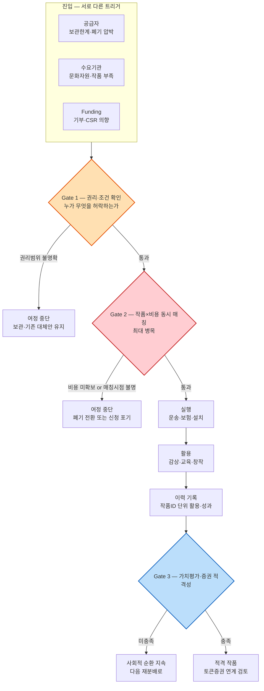
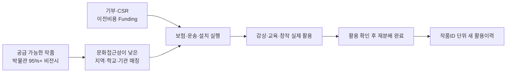
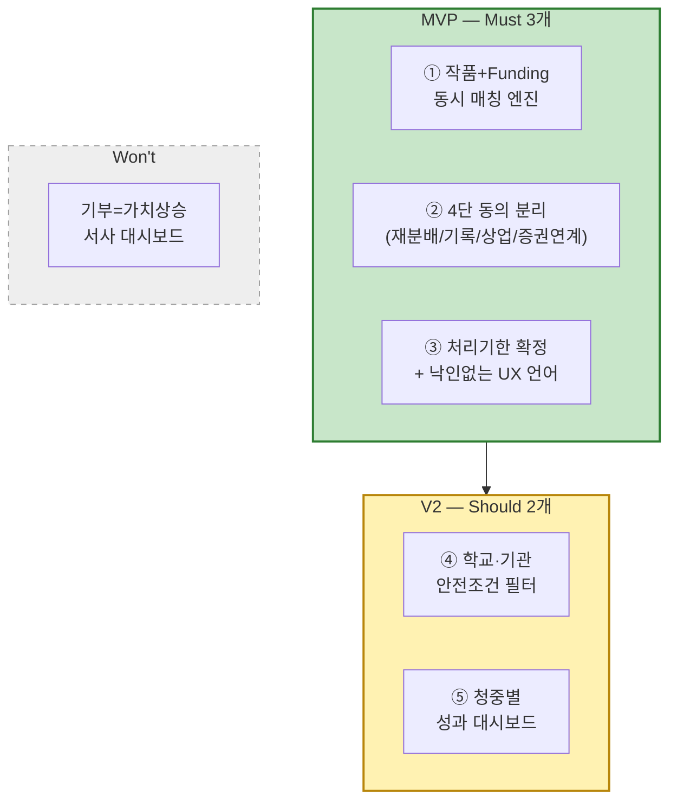

# Value Proposition ③ — 예술품 재분배 × 미술품 토큰증권 가치순환 플랫폼

> 입력 「[TAM-SAM-SOM & Market Segment](../04-tam-sam-som/분석-03-예술품-재분배-플랫폼.md)」 · 「[페르소나 스펙트럼](../05-persona-journey/분석-03-예술품-재분배-플랫폼-페르소나-스펙트럼.md) · [고객 여정지도](../05-persona-journey/분석-03-예술품-재분배-플랫폼-고객여정지도.md)」 · 「[대표 Pain Point 36개](../06-opportunity-score/평가대상-03-대표-페인포인트.md) · [AOS](../06-opportunity-score/분석-03-예술품-재분배-플랫폼.md) · [DOS](../06-opportunity-score/분석-03-예술품-재분배-플랫폼-DOS.md) · [혼합매트릭스](../06-opportunity-score/분석-03-예술품-재분배-플랫폼-혼합매트릭스.md)」 · 「[JTBD 모의 결과보고서](../07-jtbd/모의결과보고서-03-예술품-재분배-플랫폼.md)」 · 「[경쟁 지형과 가치 선언](../08-competitor-branding/경쟁사-가치선언-3-예술품-재분배-플랫폼.md) · [차별적 가치목표 제안](../08-competitor-branding/가치목표-제안-3-예술품-재분배-플랫폼.md)」
>
> 📌 **방법론 메모.** 이 문서는 [09 - PRD 작성하기](https://wildmental.notion.site/09-PRD-Product-Requirement-Document-3b7d03212bd480adb9f6f0a51c974b05) 방법론이 정의하는 **Value Proposition Sheet(VPS)** — 페르소나·CJM Pain/Needs → JTBD Goal/Job → Desired Outcome → Value Proposition → Competitor/Substitute → Differential Value → Proof — 7개 항목을 챕터 04~08 산출물로 채운 것이다. VPS를 다시 PRD(1.개요·문제정의~9.부록)로 확장하는 것은 이 문서의 범위 밖이며, §8 Job-Feature Map은 그 확장 이전 단계에서 우선순위를 먼저 굳히기 위한 보너스 산출물이다.
>
> **사업 정의.** 이 사업은 단순 미술품 기부 서비스가 아니다. **미술품 토큰증권을 기획하다가 가치가 충분히 발견되지 못한·미활용·보관한계 작품의 순환 문제를 발견한 것**이 출발점이다([챕터 04 사후 기록](../04-tam-sam-som/분석-03-예술품-재분배-플랫폼.md#-사후-기록--이-사업의-출발점은-미술품-토큰증권-기획이다) 참조). 작품을 문화예술 접근성이 낮은 지역에 재분배하고, 기부·CSR로 이전비용을 조성하며, 전시·향유·교육·창작 이력을 작품 단위로 축적한다. 그 이력이 가치평가에 실제로 의미가 있는지 검증한 뒤 권리·가치평가·증권 요건을 충족한 작품만 토큰증권 연계 가능성을 검토한다. 재분배와 토큰증권은 분리된 두 사업이 아니라 서로를 다시 활성화하는 가치순환의 두 축이다.

---

# 1. 페르소나 및 CJM 기반 고객별 핵심 문제 (Pain·Needs)

## 1-1. 여정의 공통 구조 — 어디서 막히는가

12개 페르소나의 여정 골격(A 공급자형·B 수요기관형·C Funding형·D 비활성형)을 겹쳐 보면, 서로 다른 입구에서 출발해도 **같은 세 개의 관문**을 통과해야 순환이 완성된다.

| 관문 | 무엇을 확인하는가 | 실패하면 | 대표 Pain |
|---|---|---|---|
| **Gate 1 — 권리·조건** | 재분배·기록활용·상업활용 동의가 목적별로 분리되어 있는가 | 기관·작가·학교 모두 보수적 대체안(기존 보관, 개별 계약)으로 회귀 | P04·P07·P10·P16·P32 |
| **Gate 2 — 작품×비용 동시 매칭** (최대 병목) | 작품과 이전비용(운송·보험·설치)이 같은 시점에 확보되는가 | 신청 자체가 발생하지 않거나, 작가는 폐기로 전환 | P02·P14·P23·P25 |
| **Gate 3 — 가치평가·증권 적격성** | 활용이력이 실제 가치평가에 의미 있는 추가정보인가 | 이력은 사회성과 데이터로 남고 토큰증권 연결은 보류 (❌ 부정적 결과가 아니라 정직한 미충족 상태) | — ([방향 C](../08-competitor-branding/가치목표-제안-3-예술품-재분배-플랫폼.md#3-방향-c--가치이력에서-토큰증권까지)의 핵심 미검증 가설 |

## 1-2. 인물별 핵심 Pain·Needs

| 인물 | 스펙트럼 | 최대 병목 관문 | 핵심 Pain | Need |
|---|:---:|:---:|---|---|
| 독립 작가 김서윤 | Core | Gate 2 | **P02** 매칭 시점 불명확 | 작품이 언제 어떤 수요처와 연결될지 파악 |
| 신진 작가 임하늘 | Extreme | Gate 2 | **P14** 처리 기한 불명확 | 폐기 전 매칭 가능 시점·처리 기한 확인 |
| 미술관 컬렉션 박소연 | Core | Gate 1 | **P04** 목적별 권리 범위 불명확 | 재분배·기록·상업활용의 권한 범위를 목적별로 분리 확정 |
| 미술대학 한유진 | Adjacent | Gate 1 | **P07** 학생 동의 반복 수집 | 재분배·데이터활용에 필요한 동의 범위를 누락 없이 확보 |
| 갤러리 윤태호 | Adjacent | Gate 1 | **P10** 계약 권한 범위 불명확 | 재분배·후속 가치화 검토를 어디까지 결정할 수 있는지 확인 |
| 기관자산담당 서재원 | Non-user | Gate 1 | **P32** 권리·책임 경계 불명확 | 재분배와 후속 가치화의 권리·책임 경계 확정 |
| 학교 담당 이지현 | Core | Gate 1 | **P16** 관리조건 선필터 부재 | 학교 공간·학생에게 맞는 작품을 안전하게 선택 |
| 지역문화시설 오수진 | Adjacent | 구조적 (⓪) | **P19** 지속 공급망 부재 | 매번 새로 찾지 않아도 되는 지속적 작품 공급망 확보 |
| NGO 김도현 | Core | Gate 2 | **P23** 작품+비용 분리 확보 | 작품과 이전비용 재원을 동시에 확보 |
| 개인 기부자 정민준 | Core | Gate 2 | **P25** 비용 구성 불투명 | 기부 전 돈이 어떤 재분배 비용에 쓰이는지 확인 |
| 기업 CSR 최은영 | Core | Gate 1 | **P28·P29** 실사 패키지 부재 | 법무·재무·CSR이 한 번에 검토 가능한 실사 패키지 확보 |
| 학생 박하린 | Non-user(수혜) | 구조적 (⓪) | **P34** 예술 접점 부족 | 학교·생활공간에서 실제 작품을 반복적으로 접하는 것 |

> 🔍 **JTBD 예행연습(챕터 07)이 추가한 13번째 표본.** 위 12명 어디에도 없던 표본 — **재분배 참여를 포기한 독립 작가(R8)** — 이 새로 드러낸 Need는 "낙인 없는 참여"다. *"'재분배 우선 작품'이 제 작품 등급표처럼 느껴졌어요"* — 공급자의 진짜 장벽은 "폐기"가 아니라 **"가치 없는 작품으로 분류되는 것"**일 수 있다는, 기존 36개 Pain에 없던 발견이다. §3에서 Outcome O15로 다룬다.

## 1-3. 36개 Pain을 관통하는 Need

[챕터 06 §7](../06-opportunity-score/평가대상-03-대표-페인포인트.md#7-성격별-분류--36개를-가로지르는-다섯-갈래)이 분류한 다섯 갈래(권리·가치평가·후속수익 10개 · 매칭·공급망·폐기회피 7개 · 실물이동·운영 8개 · 가치이력·기부·성과 7개 · 문화접근·창의교육 4개)를 한 문장으로 압축하면:

> **"작품 하나(작품ID)를 중심으로, 권리·매칭·실행·활용·이력·재평가가 지금은 여러 기관·여러 서류·여러 시스템에 흩어져 있어 아무도 전체를 보지 못한다."**

김서윤·박소연·한유진·윤태호·임하늘·서재원(공급) 모두 "치우는 것"이 아니라 **재분배 이후 남는 이력과 후속 권리·수익 귀속**을 물었고, 이지현·오수진·김도현(수요)은 **작품 도착 이후 실제 교육·향유가 일어났는지**를 물었으며, 정민준·최은영(Funding)은 **내 돈이 어디에 쓰였고 무엇을 만들었는지**를 물었다. 세 그룹의 질문은 표현은 다르지만 전부 **"이 작품ID에 무슨 일이 일어났는지 하나로 이어서 볼 수 있는가"**로 수렴한다.

---

# 2. JTBD 관점 — 고객 상황별 Goal·Job

> 출처: [JTBD 모의 결과보고서 §1](../07-jtbd/모의결과보고서-03-예술품-재분배-플랫폼.md#1-jtbd-요약-카드). 실제 인터뷰가 아닌 모의 응답 기반 예행연습이므로 아래 Job Statement는 **(가정)**이다.

| # | 인물 | Situation | Job Statement |
|:---:|---|---|---|
| **J1** | 신진 작가 임하늘 | 작업실 정리 중, 새 작품을 놓을 자리가 없어진 순간 | 작품을 폐기하지 않으면서 다음 작업을 위한 공간을 확보 |
| **J2** | 학교 담당 이지현 | 외부 문화체험 프로그램을 알아봤다가 이동 거리·안전 문제로 영상 수업으로 대체한 직후 | 학생들에게 실제 작품을 안전하게 보여줌 |
| **J3** | NGO 담당 김도현 | 좋은 물품 제안을 받았지만 화물 운송비를 자체 부담해야 해서 수량을 줄였던 직후 | 작품과 이전비용 재원을 동시에 확보해 프로그램을 실행 |
| **J4** | 개인 기부자 정민준 | SNS에서 사연을 보고 소액 크라우드펀딩에 참여한 직후, 결과 후기를 확인하는 순간 | 내 기부가 만든 아이·지역의 문화 경험을 확인(작품의 경제적 가치와는 별개) |
| **J5** | 미술관 박소연 | 작품 이미지 사용권과 대여 권한이 별개로 처리되어 전시 홍보가 지연됐던 경험 직후 | 재분배·기록활용·상업활용의 권한 범위를 목적별로 명확히 확인 |
| **J6** | 기업 CSR 최은영 | 연말 CSR 성과보고서 작성 기간 | 지원 근거를 갖춰 내부 결재를 통과하고 이사회 보고에 쓸 수치를 확보 |
| **J7** | 갤러리 윤태호 | 미판매 작품의 외부 전시·대여를 검토하는 시점 | 작가 권리를 지키면서 미판매 작품에 새 전시·활용 기회를 만듦 |
| **J8** | 참여 포기 작가 (R8) | 과거 무료 기증 후 "전에 그냥 줬다면서요"라는 말을 들은 경험 이후, 새로운 무료 전시 제안을 받는 순간 | 작품에 새 쓰임을 주면서도 "가치 없는 작품"으로 낙인찍히지 않음 |

---

# 3. 고객이 원하는 Outcome

> **AOS = Imp × (1 − Sat/5)** · **DOS = (Imp − Sat) × MR** · 출처 [JTBD 모의 결과보고서 §2](../07-jtbd/모의결과보고서-03-예술품-재분배-플랫폼.md#2-outcome-목록표) — DOS(SAM) 내림차순. **측정 표현(📏)이 붙은 항목은 16개 중 0개다**(§7-4에서 이 공백 자체를 기록한다).

| # | Outcome | 인물 | Imp | Sat | AOS | DOS(SAM) | 비고 |
|:---:|---|---|:---:|:---:|:---:|:---:|---|
| O05 | 작품+이전비용을 **동시에** 확보한 프로젝트만 실행 | 김도현 | 5 | 1 | 4.0 | **4.00** | — |
| O03 | 학교 공간·안전에 맞는 작품만 **사전 필터링**되어 신청 | 이지현 | 5 | 2 | 3.0 | **3.00** | — |
| O06 | 현장 성과 기록이 후원 보고·작품 이력에 **단일 입력**으로 재사용 | 김도현 | 5 | 2 | 3.0 | **3.00** | — |
| O09 | 재분배·기록활용·상업활용 동의를 **목적별로 분리** | 박소연 | 5 | 2 | 3.0 | **2.55** | — |
| O07 | 내 기부가 만든 **아이·지역의 문화 경험**을 확인 | 정민준 | 5 | 1 | 4.0 | **2.20** | — |
| O04 | **선택형 교육활동**으로 창의적 경험 제공 | 이지현 | 4 | 2 | 2.4 | **2.00** | ↓ 전면연계보다 강도 완화 |
| O10 | 작품 상태·출처·권리 이력의 **보존·관리 목적** 표준화 | 박소연 | 5 | 3 | 2.0 | **1.70** | — |
| O14 | 후속 수익배분 원칙을 **참여 시점에** 사전 제시 | 윤태호 | 5 | 2 | 3.0 | **1.80** | ↑ 재채점으로 상향 |
| O01 | 폐기 전 **확정 가능한 처리 기한**을 안다 | 임하늘 | 5 | 1 | 4.0 | **1.80** | — |
| O02 | 활용 이력은 남기되 **가격상승 증명으로 오인되지 않음** | 임하늘 | 5 | 1 | 4.0 | **1.80** | — |
| **O15** | **낙인 없이** 재분배에 참여(순환 가능 작품으로 프레이밍) | R8(신규) | 5 | 1 | 4.0 | **1.80** | 🆕 JTBD가 새로 발견 |
| O11 | 내부 결재용 **실사 패키지**를 한 번에 확보 | 최은영 | 5 | 3 | 2.0 | **1.40** | — |
| O13 | 재분배·토큰화 **권한 범위**를 사전 확인 | 윤태호 | 5 | 3 | 2.0 | **1.20** | — |
| O12b | 작품 가치이력을 CSR 메시지와 **분리한 별도 데이터**로 제공 | 최은영 | 3 | 2 | 1.8 | **0.70** | 🆕 |
| O12a | 지원 작품·기관의 사회성과를 CSR 보고서에 담기 | 최은영 | 5 | 4 | 1.0 | **0.70** | ↓ 기존 CSR 지표로 상당 부분 대체 가능 |
| **O08** | 내 기부가 **작품 가치상승에 기여**했다는 서사를 확인 | 정민준 | 2 | 3 | 0.8 | **−0.55** | ⛔ **반증됨 — 만들지 않을 기능** (§7-4) |

> 📌 **O08은 의도적으로 목록에 남긴다.** DOS가 음수라는 것은 "중요도보다 이미 충족도가 높다"는 뜻이 아니라, 이 Outcome을 제품으로 만들면 **오히려 신뢰가 깎인다**는 신호다([JTBD 보고서 §3-1](../07-jtbd/모의결과보고서-03-예술품-재분배-플랫폼.md#3-1-무너지거나-약해진-것) 참조). §7-4에서 이 반증 과정을 그대로 기록한다.

---

# 4. 기존 대안 (Competitor/Substitute)

## 4-1. 경쟁 축별 8개 서비스

> 출처: [경쟁 지형과 가치 선언 §1](../08-competitor-branding/경쟁사-가치선언-3-예술품-재분배-플랫폼.md#1-경쟁사-브리핑). 규모 수치는 정의가 기관마다 달라 횡비교용으로 쓰지 않는다.

| # | 서비스 | 경쟁 축 | 핵심 비즈니스 모델 | 우리에게 남기는 공백 |
|:---:|---|---|---|---|
| 1 | 국립현대미술관 미술은행·나눔미술은행 | ① 순환·접근 | 공공예산으로 작품 구입·대여, 문화접근 지원사업 별도 운영 | 교육·향유·사회성과까지 작품ID 단위로 후속 가치평가와 연결하는 규격 없음 |
| 2 | 오픈갤러리 | ① 순환 · ③ 환류 | 90일 단위 렌탈·회수·교체, 아트테크 소유자측 렌탈·재판매 수익 | 상업 지불자 전제 — 학교·복지·NGO에는 같은 결제자가 없음 |
| 3 | Art Bridges Foundation | ① 순환 · ② 비용 | 대여계약·보험·크레이팅·운송·설치 비용을 재단이 부담 | 적격 박물관이 핵심 고객 — 미술관 인프라 없는 수요처는 미대상 |
| 4 | FRAC | ① 순환·접근 | 국가-지역 파트너십으로 작품 구입·지역 순환(1982~) | 공공재원·공공컬렉션 중심 — 시민·기업 Funding 미결합 |
| 5 | 한국문화예술위원회 예술나무 | ② 후원·CSR | 조건부 기부·기업 파트너십·크라우드펀딩 | 작품 한 점의 물리적 이동·활용·이력을 객체로 관리하지 않음 |
| 6 | 열매컴퍼니·아트앤가이드 | ④ 가치평가·증권화 | 미술품 공동사업 권리를 투자계약증권으로 구조화 | 이미 투자대상으로 선별된 작품 전제 — 재분배 통한 가치발견 모델 아님 |
| 7 | TESSA | ④ 조각투자·자산운영 | 블루칩 미술품 소액 분할 참여 + 전시 운영 | 이미 인지도 높은 블루칩 작품 전제 |
| 8 | Verisart | ④ 이력·진품성 | 블록체인 기반 창작자·소유자·변경이력 인증서 | 재분배·교육·Funding·권리를 포함한 순환 데이터는 다루지 않음 |

## 4-2. 인물별 현재 대안(Substitute)

> 출처: [JTBD 모의 결과보고서](../07-jtbd/모의결과보고서-03-예술품-재분배-플랫폼.md) 각 인물의 Current Solutions.

| 인물 | 현재 쓰는 대안 | 대안의 한계 |
|---|---|---|
| 임하늘(작가) | 친구 작업실 임시 위탁, 중고거래 앱 | 중고거래는 정서적 거부로 미사용, 위탁은 임시방편 |
| 이지현(학교) | 교육청·문화재단 공문, 미술관 교육 프로그램, 온라인 이미지 자료 | 사진 자료는 실물 경험을 대체 못함 |
| 김도현(NGO) | 강사 초빙, 체험 키트 구매 | 비용은 명확하나 실제 작품 경험이 아님 |
| 정민준(개인 기부자) | 기존 크라우드펀딩 후기·결과 사진 | 특정 작품·아이 경험까지 연결되지 않음 |
| 박소연(미술관) | 컬렉션관리시스템, condition report, 개별 계약서 | 목적별 권리 분리가 아니라 건별 개별 문서 |
| 최은영(기업 CSR) | 기존 CSR 심사·정산·성과보고 프로세스 | 부서별 실사 요청 반복, 토큰증권 이슈와 미분리 |
| 윤태호(갤러리) | 작가-갤러리 위탁·전속계약, 개별 법률 검토 | 배분 원칙이 사후 협의 — 참여 시점 합의 없음 |

---

# 5. 우리 솔루션의 핵심 제안 (Value Proposition)

> 출처: [차별적 가치목표 제안 §5](../08-competitor-branding/가치목표-제안-3-예술품-재분배-플랫폼.md#5-선언문--통합-1--청중별-3).

> # **"쓰임이 끊긴 작품에게 다음 쓰임을 만들고, 그 쓰임이 누구에게 무엇이 되었는지 작품별로 남깁니다.**
> # **그 과정에서 별도 후속 수익이 생기면 사전 약정에 따라 작가·기관에도 환류하고, 원천증빙이 확인된 이력·권리정보를 갖춘 뒤 해당 작품을 기반으로 한 공동사업·계약상 권리구조가 별도 가치평가·법률·공시·증권 요건을 충족할 수 있는 경우에만 토큰증권 연계를 검토합니다."**

## 이 문장이 성립하는 이유

| 문장 조각 | 근거 | 등급 |
|---|---|---|
| "쓰임이 끊긴 작품에게 다음 쓰임을 만들고" | 미술은행·FRAC·Art Bridges가 작품 순환·문화접근을 실제 운영 — 사회적 명분은 검증됨 | (확인) |
| "그 쓰임이 누구에게 무엇이 되었는지 작품별로 남깁니다" | 기존 8개 경쟁사 중 재분배·Funding·활용이력을 작품ID 하나로 닫는 통합 모델은 조사 범위에서 확인 못함([경쟁분석 §4-2](../08-competitor-branding/경쟁사-가치선언-3-예술품-재분배-플랫폼.md#4-2-비어-있는-세-자리) 빈 자리 ①) | (추정 · 공백) |
| "별도 후속 수익이 생기면 사전 약정에 따라 환류" | 오픈갤러리의 소유자측 렌탈·재판매 수익 선례가 있으나 작가 수익의 직접 근거는 아님 — 그래서 "생기면"이라는 조건문으로 쓴다 | (확인 선례) + (가정) |
| "가격상승이라고 부르지 않고 검증된 이력만" | Management Science 연구(184만+건)는 전통적 provenance·전시이력과 경매가·매각확률의 통계적 연관을 보이나, 문화취약지역 교육·사회활용 이력의 효과는 별도 미검증 | (확인) + (핵심 미검증 가설) |
| "요건을 충족하는 경우에만 토큰증권 연계 검토" | 금융위원회는 토큰증권을 증권의 발행·관리 '형식'으로 규정, 제도화 법 시행은 2027-02-04 예정 | (확인) |

---

# 6. 우리가 제공하는 차별적 가치

## 6-1. 세 방향

> 출처: [차별적 가치목표 제안 §1~§3](../08-competitor-branding/가치목표-제안-3-예술품-재분배-플랫폼.md).

| 방향 | 선언문 | 청중 | 지금 실행 가능한가 |
|:---:|---|---|:---:|
| **A. 창작생태계 환류** | "작품이 다시 쓰여 별도 경제수익이 생기면, 사전 약정한 몫을 작가·기관에도 환류합니다. 기부금과 후속 수익은 구분해 추적합니다." | 신진·독립 작가 · 작품 보유기관 · 갤러리 | ⚠️ 수익원 미검증 — 문화취약지역에서 누가 지불할지 미정 |
| **B. 실제 향유까지 완결** | "작품을 보냈다고 완료로 세지 않습니다. 실제 설치·감상·교육·창작에 쓰인 건만 완료로 기록합니다." | 학교·도서관·복지·NGO + 개인·기업 후원자 | ◐ 부분 가능 — 공공·해외 선행모델은 있으나 국내 실제 공급자·수요기관 인터뷰 필요 |
| **C. 가치이력 → 토큰증권 Gate** | "재분배를 가치상승이라고 부르지 않습니다. 검증 가능한 이력을 쌓고, 요건을 통과한 작품만 토큰증권 연계 검토로 넘깁니다." | 작가·기관 자산담당 · 가치평가 전문가 · 증권 발행·유통 파트너 | ⏳ 데이터는 지금부터, 금융연계는 조건부(2027 제도 시행 + 적격성 별도 검토) |

## 6-2. 약점을 뒤집은 것

| 방향 | 우리 약점 | 뒤집힌 가치 |
|:---:|---|---|
| A | 기부 프로젝트에서 작가·기관 수익을 말하면 공익성과 충돌 가능 | **기부와 후속수익을 분리**해 공익성·경제환류를 동시에 지킨다 |
| B | 미술은행·FRAC·Art Bridges가 이미 지역순환 수행 — "작품을 보낸다"는 신규성 낮음 | **배송이 아니라 실제 활용까지 완료로 센다**는 운영 기준으로 차별화 |
| C | "재분배하면 가치가 오른다"는 가장 중요한 연결이 미검증 | 가격상승을 약속하지 않고 **검증 가능한 데이터·Gate 자체를 가치**로 만든다 |

---

# 7. Proof

## 7-1. 다섯 경로가 같은 결론으로 수렴한다

| 경로 | 발견 | 수렴점 |
|---|---|---|
| ① TAM-SAM-SOM (챕터 04) | SAM 712.5만 달러가 TAM(273.1억 달러)의 0.026% — "아직 시장이 만들어지지 않았다" | 니치 시장이지만 **비어 있는 통합 카테고리** |
| ② 경쟁 조사 AOS 재판정 (챕터 08 §4-3) | P02·P14(매칭 불확실)는 조사 후에도 견고, P23(작품+비용 동시성)은 Art Bridges·나눔미술은행의 부분 대체재로 Sat 1→2 하향 | **매칭·비용 동시성이 가장 오래 살아남는 공백** |
| ③ 경쟁 조사 '비어 있는 세 자리' (챕터 08 §4-2) | 작품ID 단위 폐쇄루프, 사회·교육 활용이력의 가치평가 유효성, 기부·투자 분리 Win-Win — 8개 핵심 경쟁사 어디도 통합 못함 | **개별 기능은 전부 선점, 통합 구조만 공백** |
| ④ JTBD 모의 인터뷰 (챕터 07) | O05(작품+Funding 동시확보)가 재채점 후에도 DOS 1위 유지, O08(가치상승 서사)은 음수로 반증 | **동시성 매칭이 최우선, 가치상승 서사는 위험** |
| ⑤ 외부 실측(§7-2) | Art Bridges·나눔미술은행 모두 "비용 지원"을 필수 요소로 이미 설계 | **동시성·비용 조성이 업계에서도 핵심 설계축** |

> 🎯 **다섯 경로 모두 "작품+비용 동시 매칭"(Gate 2)을 최우선 공백으로 지목한다.** 이것이 §8 MVP 범위 결정의 근거다.

## 7-2. 시급성 근거 — 외부 실측

> 출처: [차별적 가치목표 제안 §2](../08-competitor-branding/가치목표-제안-3-예술품-재분배-플랫폼.md#2-방향-b--실제-향유까지-완결하는-재분배).

| 지표 | 확인된 값 | 출처 |
|---|---|---|
| 2025년 한국 문화예술행사 직접 관람률 | **60.2%**(전년 63.0%에서 감소) | [문체부 2025 조사](https://www.mcst.go.kr/site/s_notice/press/pressView.jsp?pMenuCD=0302000000&pSeq=22169) |
| 2025년 미술 분야 직접 관람률 | **7.7%**, 전년 대비 **+2.1%p** | 위와 동일 |
| 2025년 문화예술교육 경험률 | **8.6%**, 전년 대비 **+2.2%p** | 위와 동일 |
| Art Bridges 네트워크 | 400+ 박물관 파트너 · 1,800+ 지원 프로젝트 (자기보고) | [Art Bridges](https://artbridgesfoundation.org/) |
| 박물관 소장품 비전시 비율 | **95% 이상**이 상시 비전시(수장고 보관) | ICCROM-UNESCO, UK Heritage Fund ([챕터 04](../04-tam-sam-som/분석-03-예술품-재분배-플랫폼.md#1단계--tam-total-addressable-market)) |

> **자금 공백이 핵심이다.** Art Bridges는 박물관이 작품을 순환시키지 못하는 이유로 재정 제약·공간·인력을 명시하고, 대여계약·보험·운송·설치 비용을 직접 부담한다. "작품이 있다"와 "작품을 보낼 수 있다"는 다른 문제라는 것이 이 시장의 실측된 전제다.

## 7-3. 대안과의 차별성 비교

> 출처: [경쟁 지형과 가치 선언 §4-1](../08-competitor-branding/경쟁사-가치선언-3-예술품-재분배-플랫폼.md#4-1-선언-지형--어떤-가치가-이미-점유됐는가).

| 우리가 단독 차별점으로 말하면 위험한 것 | 이미 점유한 곳 | 실제 차별점 |
|---|---|---|
| "작품을 문화소외지역에 보낸다" | 미술은행·나눔미술은행 · FRAC · Art Bridges | 배송이 아니라 **닫힌 실행 + 후속 가치연결** |
| "운송·보험·설치비까지 지원한다" | Art Bridges · 나눔미술은행 | Funding의 주체·대상범위·추적단위·후속결과 구분 |
| "작품 순환에서 후속 수익이 생긴다" | 오픈갤러리(소유자측 렌탈·재판매) | 문화취약지역용 **작가·기관 배분 계약 구조**를 별도 설계 |
| "블록체인으로 작품 이력을 남긴다" | Verisart | 재분배·교육·Funding·권리를 포함한 **순환 데이터의 내용** |

## 7-4. 반증된 것도 기록한다

| 반증된 주장 | 무엇이 밝혀졌나 | 지금의 처리 |
|---|---|---|
| "내 기부가 작품 가치상승에 기여했다는 서사를 보여주면 만족도가 오른다"(O08) | JTBD 모의 응답에서 DOS **−0.55** — 정민준(기부자)은 *"그걸 기부 성과라고 하면 이상해요"*라며 오히려 신뢰가 깎인다고 반응 | ⛔ **만들지 않을 기능으로 분류**([JTBD §3-1](../07-jtbd/모의결과보고서-03-예술품-재분배-플랫폼.md#3-1-무너지거나-약해진-것)) |
| "미술은행은 이동 이력을 남기지 않는다" | 공식 서식에 인수증·상태확인서·설치결과보고서가 이미 존재함을 확인 | 정정 — 공백은 "이력 부재"가 아니라 "교육·향유 이력의 가치평가 연결 부재" |
| "재분배 → 가격상승 → 토큰화는 자동으로 이어진다" | Management Science 연구의 provenance-가격 연관은 **전통적 전시이력**에 대한 것이며, 문화취약지역 교육·사회활용 이력의 효과는 검증된 바 없음 | 방향 C를 "핵심 미검증 가설"로 명시 유지, Gate 없이 약속하지 않음 |
| "TESSA는 미술품에서 이탈·실패했다"(초안 단정) | 공식 사이트는 2026년 현재도 조각투자 플랫폼을 표방 — 현재 사실과 불일치 | 삭제, "유동성·규제전환은 별도 검증 필요"라는 경고로만 유지 |
| "지역 단위로 작품을 다년간 순환시키는 모델은 없다"(초안 단정) | FRAC이 1982년부터 그 모델을 운영 중 | 정정 — "예술문화 마을"은 장기 Outcome으로만 남기고 단독 차별점에서 제외 |

> 📌 **측정 표현 공백도 정직하게 남긴다.** §3의 16개 Outcome 중 시간·금액 등 구체 수치가 붙은 것은 **0개**다([JTBD §5](../07-jtbd/모의결과보고서-03-예술품-재분배-플랫폼.md#5-근거-등급)). 모의 응답이 관계·신뢰·경계 문제에 집중되고 수치를 만들어내지 않았기 때문이며, 실제 인터뷰에서 반드시 받아내야 할 항목으로 다음 단계에 넘긴다.

---

# 8. Job-Feature Map

## 8-1. 기능 명세

> 출처: [JTBD §3-4 기능 단위 재환원](../07-jtbd/모의결과보고서-03-예술품-재분배-플랫폼.md#3-4-기능-단위-재환원).

| 기능 | 대응 Outcome | DOS(SAM) 합 | MoSCoW | 중요도 | 난이도 | MVP 여부 | 우선순위 |
|---|---|:---:|:---:|:---:|:---:|:---:|:---:|
| ① 작품+Funding 동시 매칭 엔진 | O05·O06 | **7.00** | **Must** | 최상 | 상 (3면 시장 동시 결합) | ✅ | 1 |
| ② 권리·동의의 목적별 분리 (재분배/기록/상업활용/증권연계 4단 동의) | O09·O13·O14 | **5.55** | **Must** | 상 | 중 (법무 검토 필요) | ✅ | 2 |
| ③ 폐기회피 + 낙인 없는 프레이밍(처리기한 확정 + UX 언어) | O01·O02·O15 | **5.40** | **Must** | 상 | 하 (주로 UX·정책) | ✅ | 3 |
| ④ 학교·기관 수요 안전조건 필터 | O03·O04 | **5.00** | **Should** | 중상 | 중 | ◐ 축소版 | 4 |
| ⑤ 성과·이력의 메시지 분리(청중별 대시보드) | O10·O11·O12a·O12b | **4.80** | **Should** | 중 | 중 | ◐ 축소版 | 5 |
| ~~기부=가치상승 서사 대시보드~~ | ~~O08~~ | ~~−0.55~~ | **Won't** | — | — | ❌ | — |

## 8-2. MVP 범위와 근거

| 근거 | 왜 MVP에 들어가는가 |
|---|---|
| §7-1의 다섯 경로 전부가 "①작품+Funding 동시 매칭"을 최우선 공백으로 지목 | 이 기능 없이는 Gate 2(최대 병목)를 통과하는 사례 자체가 생기지 않는다 |
| ②는 박소연·윤태호·서재원 등 공급 측 페르소나 전원의 Gate 1 진입조건 | 권리 분리 없이는 애초에 공급이 열리지 않는다 — A/C 방향의 전제조건이기도 하다 |
| ③은 DOS(SAM) 5.40으로 3위이자, JTBD가 새로 발견한 O15(낙인) 리스크를 직접 해소 | 임하늘·R8 모두 "폐기 압박"보다 "낙인"이 더 오래가는 이탈 원인이라고 진술 |
| ④·⑤는 DOS 5.0 이하로 순위는 있으나 각각 법무·대시보드 설계에 시간이 더 필요 | MVP 검증(①②③) 이후 붙여도 순환 자체는 성립한다 |
| O08(기부=가치상승 서사)은 DOS 음수로 반증 | 만들면 오히려 신뢰가 깎이므로 로드맵에서 제외(Won't) |

## 8-3. 구현 순서

| 단계 | 내용 | 선행 조건 |
|:---:|---|---|
| **1** | 작품ID 스키마 설계 — 권리·상태·이력을 하나의 객체로 고정 | §7-4의 반증 사례 반영 (미술은행 수준의 인수증·상태확인서 항목 참조) |
| **2** | 4단 동의 계약 템플릿 (법무 검토) | 박소연·윤태호·서재원 실제 인터뷰로 권리 범위 재확인 |
| **3** | 작품+Funding 동시 매칭 로직 MVP | 1·2 완료, 파일럿 공급기관·수요기관 각 1곳 확보 |
| **4** | 처리기한 확정 로직 + 공급자 대상 UX 언어("순환 가능 작품") 확정 | R8 표본을 8명 이상으로 확대 인터뷰 후 확정 |
| **5** | 학교·기관 안전조건 필터, 청중별 대시보드(사회성과/CSR/가치이력 분리) | 3의 파일럿에서 나온 실제 활용 데이터 |
| **6** | 가치평가·증권 적격성 Gate 설계 (외부 전문가 검토) | 활용이력 최소 1사이클 축적 후, 가치평가 전문가·증권 실무자 인터뷰 |

---

# 9. 근거 등급 및 다음 단계

## 근거 등급

| 구성 요소 | 등급 | 비고 |
|---|---|---|
| §1 여정 공통구조·Pain·Needs | (확인 Pain 목록) + (가정 여정 단계 정의) | 챕터 05·06 페르소나·Pain은 실제 인터뷰 전 작업가정 |
| §2 JTBD Goal·Job, §3 Outcome, §7-4 반증 사례 | **(가정·모의)** | JTBD는 모의 응답 기반 예행연습 — 실제 인터뷰 0건 |
| §4 경쟁사 현황, §7-2·7-3 외부 실측 | **(확인)** | 공공기관·금융당국·기업 공식자료, 학술연구 우선 |
| §5·§6 Value Proposition, 세 방향 선언문 | **(추정)** | 공식 슬로건이 아니라 실제 활동에서 역산한 분석 문장 |
| §7-1 다섯 경로 수렴 | **(추정)** | 서로 다른 챕터의 독립적 발견이 같은 결론으로 모인 것 — 인과관계 증명은 아님 |
| §8 Job-Feature Map 전체 | **(가정)** | DOS 순위 기반 우선순위 제안. 실제 개발 착수 순서를 확정하지 않음 |
| 방향 C(가치이력→토큰증권)의 핵심 가설 | **(핵심 미검증 가설)** | 사회·교육 활용이력이 경제적 가치평가에 의미가 있는지는 이 프로젝트가 실제 인터뷰·전문가 검증으로 가장 먼저 확인해야 할 고리 |

## 다음 단계

| 순위 | 할 일 | 왜 |
|:---:|---|---|
| 1 | **실제 인터뷰 실행** (8개 페르소나, 기존 문항지 재사용) | §2~§3의 Goal·Outcome이 전부 모의 응답 기반 — 검증이 필요 |
| 2 | **측정 표현 확보** | 16개 Outcome 전부에 시간·금액·건수가 비어 있다 — "처리 기한이 며칠이면 되나요" 같은 구체 수치를 인터뷰에서 받아야 §8의 SLO/SLI 설계가 가능해진다 |
| 3 | **O15(낙인 리스크) 표본 확대** | 신규 발견이 가장 생산적이었다 — 참여 포기 작가 표본을 8명 이상으로 확대 |
| 4 | **방향 C 핵심가설 전문가 검증** | 미술품 가치평가 전문가·투자계약증권/토큰증권 실무자에게 "교육·사회적 활용이력이 실제 기초자산 심사에 참고되는가"를 직접 확인 |
| 5 | **MVP 3개 기능(①②③)부터 파일럿 설계** | §8-3 구현순서 1~3단계 착수, 공급·수요 기관 각 1곳 확보 |

> **이 문서 이후의 확장.** VPS를 형식적인 PRD(개요·목표·사용자스토리/AC·기능요구·비기능·인터페이스·범위/리스크·실험롤아웃·부록)로 전환하는 것은 실제 인터뷰(순위 1)와 MVP 파일럿(순위 5)이 최소 1사이클 돈 뒤, §8의 우선순위가 실측 데이터로 재확인된 다음이 적절하다 — 지금 PRD를 먼저 쓰면 §9의 미검증 가설 위에 상세 사양을 쌓는 것이 되어 이 방법론의 확인/추정/가정 원칙과 어긋난다.
