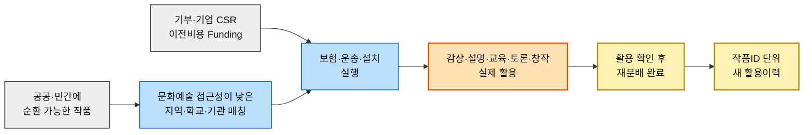
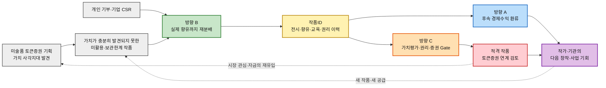

# 차별적 가치목표 제안 ③ — 예술품 재분배 × 미술품 토큰증권 가치순환 플랫폼

> 입력 「경쟁 지형과 가치 선언 분석 ③」 · 「시장기회 분석(AOS·DOS·혼합매트릭스)」 · 「JTBD 모의 인터뷰·문항지」 · 「페르소나·고객 여정지도」 · 기획자가 제시한 핵심 가치방향
>
> 🎯 **이 문서는 경쟁사 분석 §4-4를 대체한다.** 세 방향은 사용자가 처음부터 강조한 본론 — **① 작가·기관과 문화예술 접근 취약지역이 함께 이익을 얻는 Win-Win, ② 가치가 충분히 발견되지 못한 작품의 재분배가 새로운 이력을 만들고 기존 미술품 토큰증권과 다시 연결되는 가치순환** — 을 경쟁지형과 실제 근거에 맞게 조정한 결과다.
>
> 🔎 **리서치 기준일 2026-08-13.** 외부 사실은 공공기관·금융당국·기업 공식자료와 학술연구를 우선했다. 기존 초안에서 과도한 성공·실패 단정, 출처가 약한 수치, 아직 검증되지 않은 제품기능 추정은 제외하고 확인 가능한 사실과 명시된 가설만 남겼다.
>
> 📌 **세 가지 확정 원칙** — ① 선언은 **공개 약속형**으로 쓴다. ② 구조는 **통합 1 + 청중별 3**으로 간다. ③ 토큰증권은 부가 옵션으로 밀어내지 않되, `재분배=가격상승=토큰화`로 단정하지 않는다. **데이터·권리 설계에는 처음부터 포함하고 실제 금융연계는 작품뿐 아니라 이를 기반으로 한 공동사업·계약상 권리·가치평가·공시 등 적격성 Gate를 통과한 경우만 검토**한다. 이하 편의상 이를 **‘적격 작품’**이라고 줄여 쓴다.

---

## 0. 제시된 세 가지를 어떻게 조정했는가

사용자가 제시한 문장에는 실제로 세 가치가 섞여 있었다. 네 번째로 제시한 `미술품 생산 → 미유통 → 재분배 → 교육 → 데이터·이력 → 자산화/토큰화 가능성 검토`는 **별도의 네 번째 가치가 아니라 세 가치를 잇는 전체 순환경로**로 처리한다.

| 제시안 | 경쟁 지형 대조 | 조정 | 결과 |
|---|---|---|---|
| **① 작가·기관도 수익을 얻어 더 좋은 활동을 하고, 작품에는 두 번째 기회를 준다** | 오픈갤러리는 **작품 소유자 측** 상업 렌탈·재판매 수익을 만들고, 미술은행·FRAC은 작품 매입으로 작가를 지원한다. 따라서 `작품 순환·유통에서 경제적 가치가 생긴다` 자체는 독점 가치가 아님 | **문화취약지역의 공익 Funding과 작가·기관의 후속 경제수익을 구분해 추적하고, 실제 배분은 사전 계약으로 정하는 환류구조**로 해상도를 낮춘다 | **방향 A — 창작생태계로 돌아오는 수익** |
| **② 문화예술을 접하기 어려운 지역·아이들에게 실제 작품을 보내 창의적 경험을 만든다** | 미술은행·FRAC·Art Bridges가 지역 순환·문화접근을 이미 수행한다. `지역에 보낸다`만으로는 차별화 불가 | ‘배송’이 아니라 **설치·감상·교육·창작까지 실제 활용이 확인되어야 완료**라는 자기구속으로 바꾼다. `예술문화 마을`은 장기 Outcome으로만 둔다 | **방향 B — 실제 향유까지 완결하는 재분배** |
| **③ 재분배가 작품에 새 가치를 만들고 기존 토큰증권과 상호작용한다** | Verisart는 디지털 이력, 열매·TESSA는 미술품 금융을 이미 수행. 학술연구는 전통적 provenance·전시이력이 가격과 연관될 수 있음을 보여주지만 **사회·교육 활용이력의 효과는 미검증** | `가치가 오른다`를 삭제하고 **검증 가능한 활용이력 → 가치평가 유효성 검증 → 권리·증권 Gate → 적격 작품 토큰증권 연계 검토**로 정교화 | **방향 C — 가치이력에서 토큰증권까지** |

> 📌 **세 조정은 사용자 아이디어를 약화한 것이 아니라, 사실로 말할 수 있는 범위와 아직 검증해야 할 가설을 분리한 것이다.** A는 `수익의 출처`, B는 `재분배의 완료조건`, C는 `토큰증권으로 넘어가는 검증조건`을 문장 안에 넣는다.
>
> 🔁 **전체 순환의 시작점은 여전히 미술품 토큰증권 기획이다.** 토큰증권을 기획하면서 `시장가치가 충분히 발견되지 못한 작품은 어떻게 다시 순환할 수 있는가`라는 문제가 발견됐고, 재분배로 만들어진 이력·수요·권리정보를 다시 가치평가와 토큰증권 생태계에 연결하는 것이 이 사업의 정체성이다.

---

## 1. 방향 A — 창작생태계로 돌아오는 수익

### 선언문 *(공개 약속형)*

> **“작품이 다시 쓰여 별도 경제수익이 생기면, 사전 약정한 몫을 작가·기관에도 환류합니다. 기부금과 후속 수익은 구분해 추적합니다.”**

**공개 약속형인 이유.** 지금 당장 반복 수익이 발생한다고 주장하지 않는다. 대신 **기부·CSR로 조성된 공익 목적 자금과, 대여·라이선스·상업활용·금융사업 등에서 발생할 후속 수익을 내부 계정·계약에서 구분해 추적하겠다**는 자기구속을 선언한다. 이는 예술나무가 정한 법적 의무를 그대로 가져온다는 뜻이 아니라 사용자 서비스의 **거버넌스 설계 원칙**이다. 실제 후속 수익원이 생기지 않으면 작가·기관에 배분할 금액도 0이다.

### 근거 → 결론 추적

| 근거 | 출처 · 등급 | 이 근거가 떠받치는 문장 |
|---|---|---|
| 오픈갤러리 아트테크는 작품을 매입해 재위탁한 **소유자**에게 제3자 렌탈 수익과 재판매 수익을 지급한다고 설명하며, 자사 페이지 기준 누적 렌탈 **92,381점**을 제시한다 | [오픈갤러리](https://www.opengallery.co.kr/arttech/) · **(확인·자기보고)** | *“작품이 다시 쓰여 별도 경제수익이 생기면”* — 작품 순환이 소유자 측 상업수익으로 이어질 수 있다는 선행근거. **작가 수익의 직접 근거는 아님** |
| FRAC은 살아있는 작가의 작품을 구입하고 창작지원·지역순환을 공공정책으로 수행한다 | [프랑스 문화부](https://www.culture.gouv.fr/thematiques/arts-plastiques/les-arts-plastiques-en-france/les-fonds-regionaux-d-art-contemporain) · **(확인)** | 작가를 지원하면서 동시에 작품을 지역에 순환시키는 두 목적은 양립 가능 |
| 미술은행 운영원칙은 작품 구입·대여를 통해 미술시장 활성화와 문화향유권 신장을 함께 추구한다 | [미술은행 운영규정](https://www.artbank.go.kr/home/intro/regulation.do?loc=h13) · **(확인)** | `작가/시장`과 `향유자`의 가치가 한 제도 안에서 공존할 수 있다는 근거 |
| 예술나무는 특정 사업·단체 지원을 조건으로 하는 기부, 기업 파트너십, 크라우드펀딩과 결과 확인·성과 공유 구조를 운영한다 | [예술나무 후원가이드](https://www.arko.or.kr/supp/content/4088) · [기업 파트너십](https://www.arko.or.kr/supp/content/5462) · **(확인)** | **프로젝트 목적이 지정된 문화예술 Funding이 현실적으로 운영 가능**하다는 근거. `기부와 후속 상업·금융수익을 별도 추적`하는 것은 이 자료가 강제하는 법규가 아니라 **우리의 거버넌스 설계 원칙** |
| 기존 AOS의 P03·P27은 작품 이력과 후속 가치연결을 상위 기회로 두고 있으나 실제 인터뷰 전 가정이다 | 「시장기회 분석」 · **(가정)** | 작가·기관 환류를 핵심 방향으로 유지하되 **지금 수익이 검증됐다고 쓰지 않는 이유** |
| JTBD 모의응답에는 `기부금에서 작가 몫을 떼면 이상해 보일 수 있다`는 반응이 있었으나 실제 발언은 아니다 | 「JTBD 모의」 · **(가정·모의)** | 공익 Funding과 작가 수익을 분리하는 **검증가설**을 강화하지만 외부 사실로 인용하지 않음 |

> 📌 **차별화의 위치는 ‘작가에게 돈을 준다’가 아니다.** FRAC·미술은행은 작품 매입을 통해 작가를 지원하고, 오픈갤러리는 작품 **소유자 측** 렌탈·재판매 수익의 선례를 보여준다. 사용자의 차별점은 **문화예술 접근성이 낮은 곳으로 작품을 보내는 공익 프로젝트와 그 뒤에 생기는 별도 경제수요를 구분하면서, 사전 약정한 권리·배분기준에 따라 작가·기관에도 후속 기회를 환류시키는 구조를 새로 검증하는 것**이다.

### 이 선언을 지키기 위한 최소 요건

1. **Funding과 후속 수익을 구분해 추적한다** — 기부·CSR로 받은 공익 목적 자금과 대여·라이선스·상업활용·금융사업 수입을 내부 계정·계약에서 구분한다. 구체적인 회계·세무 처리는 실제 법인형태와 계약구조에 맞춰 전문가 검토를 거친다.
2. **작가·기관의 후속 권리와 배분기준을 사전에 계약한다** — 소유권, 저작권, 재대여, 상업활용, 매각·금융화에 대한 동의를 구분한다.
3. **수익원이 생기기 전 ‘수익을 보장한다’고 말하지 않는다** — 초기에는 `수익 기회`와 `환류 원칙`만 선언한다.
4. **작품별 정산근거를 남긴다** — 어떤 쓰임에서 어떤 수익이 발생했고 누구에게 얼마가 배분됐는지 작품ID와 연결한다.

### 청중

**신진·독립 작가 · 작품 보유기관 · 갤러리·컬렉션 담당자.** 이들에게 가장 중요한 메시지는 `좋은 일을 위해 작품을 포기하라`가 아니라 **“공익적 재분배와 향후 경제적 권리를 구분해 관리하고, 후속 수익이 생기면 사전 약정한 배분기준에 따라 정산한다”**는 것이다.

---

## 2. 방향 B — 실제 향유까지 완결하는 재분배

### 선언문 *(공개 약속형)*

> **“우리는 작품을 보냈다고 재분배 완료로 세지 않습니다. 문화예술 접근성이 낮은 지역에서 작품이 실제 설치되고, 감상·교육·창작에 쓰인 것이 확인된 건만 완료로 기록합니다.”**

**공개 약속형인 이유.** 지역 전체를 ‘예술마을로 만들겠다’, 작품을 보면 ‘아이의 창의성이 자동으로 높아진다’고 결과를 보장하지 않는다. 우리가 통제할 수 있는 것은 **작품이 실제 공간에 도착하고 안전하게 설치되며, 설명·감상·수업·토론·창작 같은 활용 접점이 발생했는지를 확인하는 것**까지다. 장기적인 지역문화 활성화와 창의성 증가는 측정해야 할 Outcome이다.

### 근거 → 결론 추적 *(전부 외부 실측)*

#### ① 규모 — 얼마나 많은가

| 지표 | 확인된 값·사실 | 출처 |
|---|---|---|
| 2025년 한국 문화예술행사 직접 관람률 | **60.2%** | [문화체육관광부 — 2025 국민문화예술 및 여가활동 조사결과](https://www.mcst.go.kr/site/s_notice/press/pressView.jsp?pMenuCD=0302000000&pSeq=22169) |
| 2025년 미술 분야 직접 관람률 | **7.7%**, 전년 대비 **+2.1%p** | [문화체육관광부 2025 조사](https://www.mcst.go.kr/site/s_notice/press/pressView.jsp?pMenuCD=0302000000&pSeq=22169) |
| 2025년 **문화예술교육 경험률** | **8.6%**, 전년 대비 **+2.2%p** | [문화체육관광부 2025 조사](https://www.mcst.go.kr/site/s_notice/press/pressView.jsp?pMenuCD=0302000000&pSeq=22169) |
| Art Bridges 현재 네트워크 | **400+ 박물관 파트너**, **1,800+ 지원 프로젝트**, **31M+ people impacted**(기관 자기보고) | [Art Bridges 공식](https://artbridgesfoundation.org/) |
| FRAC의 구조 | **1982년부터** 국가-지역 파트너십으로 작품의 지역순환·교육·대중접근 수행 | [프랑스 문화부 FRAC](https://www.culture.gouv.fr/thematiques/arts-plastiques/les-arts-plastiques-en-france/les-fonds-regionaux-d-art-contemporain) |

> 🖊️ **수치 해석 주의.** 한국의 `미술 7.7%`는 ‘가난한 아이들’이나 특정 취약지역만의 수치가 아니라 전체 조사대상의 미술 직접관람률이다. 따라서 이것만으로 문화취약지역 아동의 미술 접근성을 숫자로 단정하지 않는다. 이 수치는 **전체 조사대상에서 미술 직접관람률이 7.7%였다는 시장 맥락**으로만 사용한다.

#### ② 추세 — 어떻게 변하고 있는가

| 지표 | 변화 | 의미 |
|---|---|---|
| 전체 문화예술 직접관람률 | 2024년 **63.0% → 2025년 60.2%** | 현장 관람 전체는 감소 |
| 미술 직접관람률 | 2025년 전년 대비 **+2.1%p** | 전체 감소 속에서도 미술 현장관람은 증가 |
| 문화예술행사 참여율 | 2025년 **5.8%**, 전년 대비 **+1.1%p** | 단순 관람 외 직접 참여가 증가 |
| **문화예술교육 경험률** | 2025년 **8.6%**, 전년 대비 **+2.2%p** | 문화예술교육 **경험률이 전년보다 증가**. 이를 곧바로 본 서비스 수요 증가로 해석하지 않음 |

> 📌 **사용자 사업에 중요한 것은 ‘작품 수량’보다 활용방식이다.** 단순 설치로 끝내지 않고 감상자료·토론·창작 같은 실제 참여를 붙이면 `창의적 활동 기회 제공`은 기록할 수 있다. 다만 **창의성 자체가 향상됐는지는 별도 측정도구와 전후 비교가 있어야 Outcome으로 주장할 수 있다.**

#### ③ 자금 공백 — 작품은 있어도 왜 못 움직이는가 *(우리 사업의 존재 이유와 직결)*

| 확인된 사실 | 사업적 의미 | 출처 |
|---|---|---|
| Art Bridges는 박물관이 작품을 순환시키지 못하는 이유로 **재정 제약·공간·인력**을 명시하고, 대여계약·보험·크레이팅·포장·운송·설치·철거 비용을 직접 부담 | ‘작품이 있다’와 ‘작품을 보낼 수 있다’는 다른 문제. **이전비용 Funding이 제품의 핵심 구성요소** | [Partner Loan Network](https://artbridgesfoundation.org/partner-loan-network) |
| 국립현대미술관 미술은행은 대여절차에 보험증권, 운송·설치, 관리, 상태확인, 설치결과보고를 포함 | 한국에서도 작품 이동은 단순 택배가 아니라 **보험·설치·관리 프로세스**를 필요로 함 | [미술은행 대여안내](https://www.artbank.go.kr/home/lending/lendingManualList.do) |
| 예술나무는 특정사업 조건부기부와 기업 맞춤형 문화예술 파트너십을 운영 | 문화예술 프로젝트에 **기부·CSR 재원을 붙이는 제도적 채널 자체는 이미 가능** | [예술나무](https://www.arko.or.kr/supp/content/4088) |

#### ④ 국내 — 이미 있는 두 인프라를 왜 다시 연결해야 하나

| 국내 인프라 | 이미 하는 것 | 사용자 사업에서 아직 필요한 연결 |
|---|---|---|
| **미술은행·나눔미술은행** | 작품 확보·대여와 보험·운송·설치·관리 **절차**를 운영. 일반 미술은행은 설치·철거 시 운송료·인건비를 임차기관이 부담하는 것이 원칙이고, **나눔미술은행은 선정기관에 대여료·감상자료·운송비를 지원** | 공공 소장품 중심이 아닌 **가치가 충분히 발견되지 못한 다양한 작품의 민간 공급**, 시민·기업 Funding, 작품ID별 교육·향유 결과 |
| **예술나무** | 문화예술 후원, 조건부 기부, 기업 CSR, 크라우드펀딩 | 후원금이 **어떤 실물 작품의 이동·설치·활용을 만들었는지** 작품 단위로 추적 |
| **대상 수요기관 *(서비스 가정)*** | 문화·교육 공간과 이용자를 가진 학교·도서관·복지·지역기관 등을 수요처로 상정 | 작품 안전성·보험·설치·회수와 교육자료를 자체 해결하지 않아도 되는 운영 패키지 |

> 🎯 **B의 차별점은 ‘한국에 문화소외지역 미술지원이 없다’가 아니다.** 이미 있다. 차별점은 **분산되어 있는 작품 공급·Funding·물류·교육활용·결과기록을 민간 플랫폼에서 한 프로젝트로 닫고, 그 결과를 다시 작품 가치이력으로 돌려주는 것**이다.

### 이 근거가 결론에 직결되는 방식

> **‘작품을 보낸다’와 ‘문화예술을 향유하게 한다’ 사이에 운영 단계가 있다.** 보험·설치·관리와 교육활용이 닫혀야 사용자가 말하는 Win-Win의 수요측 가치가 발생한다. 그리고 이 실행기록이 다음 C 방향의 입력 데이터가 된다.

### 이 선언을 지키기 위한 최소 요건

1. **대상선정 기준을 ‘가난함’이 아니라 문화예술 접근조건으로 정의한다** — 지역·기관의 기존 접근성, 공간, 대상, 프로그램 필요도 등을 명시한다.
2. **작품과 Funding이 동시에 확보된 건만 실행 승인한다** — 작품만 매칭하고 운송·보험·설치비는 수요기관에 떠넘기지 않는다.
3. **안전·권리·설치 요건을 사전에 확인한다** — 작품 크기·상태·보험·환경·촬영·교육활용 권한을 체크한다.
4. **‘전달’과 ‘활용’을 분리해 기록한다** — 설치사진만으로 끝내지 않고 감상·교육·창작 여부를 최소 필드로 남긴다.
5. **성과를 과장하지 않는다** — `창의성이 향상됐다`는 측정이 있을 때만 Outcome으로 쓰고, 그 전에는 `창의적 활동 기회를 제공했다`고 표현한다.

### 청중

**문화예술 접근성이 낮은 지역의 학교·도서관·복지·문화기관·NGO + 개인 후원자·기업 CSR 담당자.** 수요기관에는 **“작품만 주는 것이 아니라 비용·설치·활용까지 함께 닫는다”**, 후원자에게는 **“당신의 후원이 실제 작품 경험으로 완료됐는지를 보여준다”**가 핵심이다.

---

## 3. 방향 C — 가치이력에서 토큰증권까지

### 선언문 *(공개 약속형)*

> **“우리는 재분배를 ‘가격 상승’이라고 부르지 않습니다. 작품별 활용·권리 이력을 원천증빙과 함께 축적하고, 해당 작품을 기반으로 한 공동사업·계약상 권리구조가 별도 가치평가·법률·공시·증권 요건을 충족할 수 있는 경우에만 미술품 토큰증권 연계를 검토합니다.”**

**공개 약속형인 이유.** 사용자 사업의 가장 중요한 금융 연결축을 숨기지 않되, 아직 검증되지 않은 `재분배→가격상승`을 약속하지 않는다. **1호 프로젝트부터 필요한 데이터를 남기고, 실제 토큰증권 연계는 작품 자체뿐 아니라 이를 기반으로 한 공동사업·권리구조까지 별도 전문가 검토와 법적 요건을 충족한 경우에만 검토**하겠다는 자기구속이다.

### 근거 → 결론 추적

| 근거 | 출처 · 등급 | 이 근거가 떠받치는 문장 |
|---|---|---|
| Verisart는 작품의 창작자·발행자·메타데이터·**현재 소유자 키**·변경 이력을 블록체인 타임라인으로 관리하고 23만+ 인증서를 자사 발표한다. 다만 공식 도움말은 **Unverified Record가 진품성이나 소유권을 부여하지 않는다고 명시**한다 | [Verisart](https://help.verisart.com/en/articles/4568835-what-does-certificate-status-mean) · [About](https://verisart.com/about) · **(확인·자기보고)** | *“원천증빙과 함께 축적”* — 기록기술은 실현 가능하지만 블록체인 기록 자체를 진품성·법적 소유권의 자동 증명으로 보면 안 됨 |
| Management Science 연구는 **1,812,807건의 미술거래**를 분석해 provenance의 pedigree·전시이력·문헌·인증 정보와 경매 매각확률·가격·수익률의 통계적 관계를 보고 | [Li, Ma & Renneboog](https://pubsonline.informs.org/doi/10.1287/mnsc.2022.4633) · **(확인)** | 전통적 provenance·전시이력이 **시장가치 판단의 참고정보가 될 수 있음**을 뒷받침. 단 사회·교육 활용이력이나 공식 감정가치로 자동 일반화 금지 |
| 같은 연구는 전시이력과 가격의 관계에 **endogeneity** 문제가 있을 수 있음을 별도 분석 | 동일 논문 · **(확인)** | *“재분배를 가격 상승이라고 부르지 않습니다”* — 인과 단정을 피해야 하는 이유 |
| 금융감독원은 2023-12-15 열매컴퍼니 투자계약증권 신고서 효력발생을 사업재편 이후 최초 사례로 확인 | [금융감독원](https://dart.fss.or.kr/dsaa003/selectBodoMain.ax?seqno=25953) · **(확인)** | 미술품의 전시·관리·매각 공동사업에서 발생하는 계약상 권리가 법적 요건을 갖춰 투자계약증권으로 발행될 수 있다는 국내 실증 |
| 금융위원회는 토큰증권을 증권의 ‘형식’으로 규정하며 제도화 법은 **2027-02-04 시행 예정**이다. 금융위 **2026-05-15** 자료는 기초자산 적격요건·증권신고서 공시·유통시장 구조를 논의하고 7월 발표를 목표로 한다고 밝혔다. **2026-08-13 이번 재확인 범위에서는 그 후속 세부기준의 공식 발표를 별도로 확인하지 못했다** | [금융위 2026-01](https://www.fsc.go.kr/po010106/86064) · [2026-05](https://www.fsc.go.kr/no010101/86906) · **(확인)** | *“시행시점의 요건을 다시 확인한다”* — 실제 연계 시점의 하위법규·가이드라인을 재확인해야 하는 이유 |
| 기존 AOS P03·P27이 가치이력을 상위기회로 두는 것은 실제 인터뷰 전 작업가정 | 「시장기회 분석」 · **(가정)** | C를 핵심 사업가설로 유지하되 **검증 완료로 표현하지 않는 이유** |

> 📌 **이 방향의 핵심 정정.** 전시이력이 기존 미술시장에서 가치판단 정보로 쓰인다는 근거는 있다. 그러나 사용자 서비스가 새롭게 만들려는 **`문화취약지역 재분배·교육·사회성과 이력`이 경제적 가치평가에 추가 프리미엄을 만든다는 근거는 아직 없다.** 따라서 C의 제품은 ‘가격 상승 엔진’이 아니라 먼저 **검증 가능한 가치이력 데이터셋과 적격성 Gate**다.

### 이 선언을 지키기 위한 최소 요건

1. **작품ID를 1호 프로젝트부터 고정한다** — 작품 기본정보·상태·**소유·보유권리의 근거**·보관위치·권리주체와 모든 순환사건을 한 ID에 연결한다.
2. **동의를 최소 3단으로 분리한다** — `재분배 동의 ≠ 상업적 활용 동의 ≠ 증권화/토큰증권 연계 동의`를 별도 필드와 계약으로 관리한다.
3. **활용이력의 원천증빙을 남긴다** — 수령기관, 설치일, 위치, 교육·감상·창작 방식, 사진·확인주체, Funding 항목을 기록한다.
4. **가치평가 모델과 사회성과 지표를 구분한다** — 관람인원·교육횟수를 곧바로 가격으로 환산하지 않는다.
5. **외부 전문가 Gate를 둔다** — 감정·가치평가, 법률·권리, 증권성·공시, 기초자산 적격성을 각각 확인한 뒤 금융연계를 검토한다.
6. **토큰증권은 형식임을 유지한다** — ‘토큰으로 쪼개면 가치가 생긴다’는 설명을 금지하고, 먼저 경제적 권리와 수익구조가 존재해야 한다.

### 청중

**작가·소장기관의 자산·권리 담당자 · 미술품 가치평가 전문가 · 투자계약증권/토큰증권 발행·유통 파트너 · 향후 적격 투자자.** 기부자·학교에 금융상품 메시지를 앞세우는 것이 아니라, **사업 전체 전략에서는 C를 핵심 축으로 유지하되 청중별 메시지를 분리**한다.

---

## 4. 세 방향의 관계

### 하나의 배관, 세 개의 출구

**B가 사회적 쓰임을 만들고, 그 쓰임의 기록이 A의 후속 경제환류와 C의 가치평가·토큰증권 검토에 동시에 입력된다.** A와 C에서 생긴 가치·관심·자금은 작가·기관의 다음 활동과 새로운 작품 공급으로 돌아간다. 따라서 토큰증권은 ‘마지막에 붙이는 옵션’이 아니라 **처음 문제를 발견하게 한 출발점이자 가치순환이 다시 돌아오는 금융 연결축**이다. 다만 실제 금융연계는 해당 작품과 이를 기반으로 한 공동사업·권리구조가 C의 Gate를 통과한 경우에만 검토한다.

### 지금 각 방향이 서 있는 자리

| 방향 | 지금 선언 가능한가 | 지금 실행 가능한가 | 근거 등급 |
|---|:---:|:---:|---|
| **B** 실제 향유까지 재분배 | ✅ **가능** — 완료조건을 스스로 제한하는 약속 | ◐ **부분 가능** — 공공·해외 선행모델은 있으나 실제 공급자·수요기관·기부자의 국내 인터뷰 필요 | **(확인) + (가정)** |
| **A** 창작생태계 수익 환류 | ✅ **가능** — 기부와 수익 분리 원칙 선언 | ⚠️ **수익원 미검증** — 상업렌탈 선례는 있으나 문화취약지역에서 누가 지불할지 미정 | **(확인) + (가정)** |
| **C** 가치이력→토큰증권 | ✅ **가능** — 가격상승 비단정·Gate 원칙 선언 | ⏳ **데이터는 지금부터, 금융연계는 조건부** — 2027 제도 시행 및 작품·공동사업·권리구조 적격성 별도 검토 | **(확인) + 핵심가설 미검증** |

> 📌 **실행 순서와 사업 정체성을 혼동하지 않는다.** 초기에 B가 먼저 눈에 보이고 C는 데이터 인프라로 작동할 수 있다. 그렇다고 `재분배 사업을 하다가 나중에 토큰증권을 붙인다`가 아니다. **C에 필요한 작품ID·권리동의·증빙을 첫 프로젝트부터 설계해야 나중에 검증 자체가 가능**하다.

### 세 방향이 각각 뒤집는 약점

| 방향 | 우리 약점 | 뒤집힌 가치목표 |
|---|---|---|
| **A** | 기부 프로젝트에서 작가·기관 수익을 말하면 공익성과 충돌할 수 있음 | **기부와 후속수익을 분리**해 공익성과 경제환류를 동시에 지킨다 |
| **B** | 미술은행·FRAC·Art Bridges가 이미 지역순환을 수행해 `작품을 보낸다`는 신규성이 낮음 | **배송이 아니라 실제 활용까지 완료로 센다**는 운영 기준으로 차별화 |
| **C** | `재분배하면 가치가 오른다`는 가장 중요한 연결이 아직 미검증 | 가격상승을 약속하지 않고 **검증 가능한 데이터와 Gate 자체를 가치**로 만든다 |

> 📌 **세 약점 모두 ‘좋은 의도만으로는 경제·법·운영이 닫히지 않는다’는 한 사실에서 나온다.** A는 돈의 성격을 분리하고, B는 실행의 완료조건을 분명히 하며, C는 가치상승과 증권화를 검증조건으로 바꾼다.

---

## 5. 선언문 — 통합 1 + 청중별 3

### 통합 선언문

> # **“쓰임이 끊긴 작품에게 다음 쓰임을 만들고, 그 쓰임이 누구에게 무엇이 되었는지 작품별로 남깁니다.**
> # **그 과정에서 별도 후속 수익이 생기면 사전 약정에 따라 작가·기관에도 환류하고, 원천증빙이 확인된 이력·권리정보를 갖춘 뒤 해당 작품을 기반으로 한 공동사업·계약상 권리구조가 별도 가치평가·법률·공시·증권 요건을 충족할 수 있는 경우에만 토큰증권 연계를 검토합니다.”**

**해설.** 첫 절은 B의 `재분배·문화향유`, 두 번째는 C의 `작품ID 가치이력`, 세 번째는 A의 `작가·기관 환류`, 마지막은 다시 C의 `미술품 토큰증권 연계`다. 사용자가 처음 생각한 **“폐기보다 한 번 더 쓰임을 주고, 아이에게는 예술경험을, 작가·기관에는 다음 기회를, 작품에는 다시 평가받을 가능성을 만든 뒤 토큰증권 생태계와 상호작용한다”**는 구조를 사실적으로 표현한다.

> ⚠️ **의도적으로 쓰지 않은 표현**: `무가치한 작품`, `가난한 아이`, `재분배하면 가치가 오른다`, `결국 토큰화된다`. 이 표현들은 각각 작품·사람에 낙인을 만들거나, 아직 검증되지 않은 가격상승·증권 적격성을 사실처럼 만들 수 있다. 공식 문서에서는 **“가치가 충분히 발견되지 못한 작품”, “문화예술 접근성이 낮은 지역의 아동·청소년”, “가치 재평가 가능성 검증”, “적격 작품의 토큰증권 연계 검토”**로 쓴다.

### 청중별 메시지

| 청중 | 방향 | 메시지 | 왜 이 청중에게 이 말인가 |
|---|:---:|---|---|
| **작가·작품 보유기관·갤러리** | **A** | **“좋은 일을 위해 경제적 권리를 포기하라고 하지 않습니다. 기부는 기부대로, 후속 수익은 별도로 기록해 당신의 몫을 남깁니다.”** | 작품을 내놓을 이유와 후속 권리 불안을 동시에 해결해야 공급이 열린다 |
| **학교·도서관·복지·지역기관 + 개인·기업 후원자** | **B** | **“작품을 보낸 순간이 아니라, 실제 공간에 걸리고 아이·주민이 감상·교육·창작에 쓴 순간을 완료로 보여드립니다.”** | 수요자는 관리 가능한 실제 경험이 필요하고, 후원자는 자신의 돈이 만든 구체적 결과가 필요하다 |
| **가치평가·증권 파트너·자산관리 담당** | **C** | **“가격이 올랐다고 주장하지 않습니다. 작품별 순환·활용·권리 이력을 먼저 증빙하고, 그 작품을 기반으로 한 공동사업·권리구조가 요건을 충족할 수 있는 경우에만 토큰증권 연계를 검토합니다.”** | 금융연계의 핵심은 기술 홍보가 아니라 기초자산의 실재성·권리·가치평가·투자자보호이기 때문이다 |

> 📌 **세 메시지는 청중마다 다르지만 하나의 사업을 말한다.** B에서 실제 쓰임을 만들고, A에서 창작생태계에 경제적 기회를 돌리며, C에서 작품의 새 이력이 금융적 가치평가에 의미가 있는지를 검증한다. **사회가치와 금융가치를 한 문장으로 섞지 않고, 한 데이터 구조 안에서 연결**하는 것이 핵심이다.

---

## 6. 위험과 근거 등급

### 남은 단 하나의 전제

**세 방향을 하나의 차별적 가치순환으로 묶는 가장 핵심적인 미검증 전제는 하나다.** 공급자 동의·수요기관 실행역량·Funding·후속 지불자 같은 운영조건도 별도로 검증해야 하지만, 세 방향 사이의 경제적 연결성을 좌우하는 중심 가설은 다음이다.

> **“재분배를 통해 새로 생긴 활용·향유·교육 이력이 실제 후속 수요 — 재대여, 매입, 라이선스, 가치평가 또는 적격 증권화 — 에 의미 있는 추가정보가 되는가?”**

B만 보면 지역 문화향유 사업은 선행모델이 있어 실행 가능성이 있다. A만 보면 상업 렌탈에서 순환수익 선례가 있다. C만 보면 provenance 기록과 미술품 증권화 각각의 선례가 있다. 그러나 **사용자 사업의 독창성은 이 셋을 연결하는 인과고리**다. 이 전제가 부정되면 재분배의 사회적 가치는 남지만 `재분배 ↔ 가치발견 ↔ 토큰증권`의 경제적 순환은 약해진다.

| 방향 | 핵심 종속조건 | 미검증 시 |
|---|---|---|
| **B** | 실제 작품 공급자 동의 + 수요기관 설치·활용 역량 + 이전비용 Funding | 사회적 재분배 자체가 실행되지 않음 |
| **A** | 후속 대여·라이선스·CSR·상업활용 등 **기부와 분리된 지불자** | 작가·기관 환류는 ‘기회’ 수준에 머묾 |
| **C** | 활용이력의 가치평가 유효성 + 작품·공동사업·계약상 권리·증권 적격성 | 이력은 사회성과·provenance 데이터로 남고 토큰증권 연결은 보류 |

> **다음 검증에서 가장 먼저 추가해야 할 사람** — 실제 작가·기관 공급자와 수요기관뿐 아니라 **미술품 가치평가 전문가·투자계약증권/토큰증권 실무자**에게 `어떤 이력을 실제 기초자산 심사·가치평가에 보는가`, `교육·사회적 활용이력은 참고대상이 되는가`를 직접 확인해야 한다. 모의 JTBD만으로 이 전제를 올릴 수 없다.

### 근거 등급

| 구성 요소 | 등급 | 비고 |
|---|---|---|
| 미술은행·FRAC·Art Bridges의 작품순환·문화접근 모델 | **(확인)** | 공공기관·재단 공식자료. `지역 순환 자체가 가능하다`는 근거 |
| Art Bridges의 보험·운송·설치비 결합 + 나눔미술은행의 선정기관 운송비 지원 | **(확인)** | P23의 기존 Sat 1 가정을 깨는 **부분 대체재**. 대상·공급범위가 달라 공개대체재 기준 Sat 2로 보수적 재판정 |
| 예술나무의 조건부 기부·기업 CSR | **(확인)** | 문화예술 Funding 자체는 이미 존재 |
| 오픈갤러리의 렌탈·재판매 수익구조 | **(확인·자기보고)** | 순환에서 수익이 날 수 있다는 상업 선례. 문화취약지역 BM으로 일반화 금지 |
| Verisart의 provenance·변경이력 기록 | **(확인·자기보고)** | 기술적 기록 가능성의 선례 |
| provenance·전시이력과 매각·가격의 관계 | **(확인)** | Management Science 연구. **사회·교육 활용이력 효과로 일반화 금지** |
| 미술품 투자계약증권 국내 사례 | **(확인)** | 금융감독원 열매컴퍼니 신고서 효력발생 사례 |
| 토큰증권 제도화·2027-02-04 시행예정 | **(확인)** | 금융위원회 공식자료. 2026-05-15 자료는 세부 기초자산·공시·유통 제도의 7월 발표 목표를 밝혔음. **2026-08-13 이번 재확인 범위에서는 후속 세부기준 공식 발표를 별도로 확인하지 못했으므로** 실제 적용 전 최신 하위법규·가이드라인 재확인 필요 |
| 기존 AOS·DOS 점수·페르소나 | **(가정)** | 실제 인터뷰 전 작업가정. 경쟁조사로 일부 Satisfaction 재판정 필요 |
| JTBD 모의응답 | **(가정·모의)** | 생성 응답. 실제 고객근거가 아님 |
| 방향 A의 실제 후속 수익원 | **(가정)** | 지불자·단가·배분률 미검증 |
| 방향 C의 `사회·교육 이력→경제가치` 연결 | **(핵심 미검증 가설)** | 이 프로젝트가 실제 인터뷰·전문가 검증으로 가장 먼저 확인해야 할 고리 |
| 선언문 A·B·C 및 통합 선언 | **(추정)** | 확인된 경쟁지형과 아직 검증되지 않은 사업가설을 구분해 만든 전략 문장 |

> ⚠️ **따라서 지금 말할 수 있는 가장 강한 결론은** `재분배가 작품가격을 높인다`가 아니다. **“재분배는 새로운 쓰임과 검증 가능한 이력을 만들 수 있고, 기존 미술시장에서 provenance·전시이력이 가치판단 정보로 사용된다는 근거가 있으므로, 이 새로운 이력이 가치평가에도 의미가 있는지 검증할 사업적 이유가 충분하다”**까지다. 그 검증 이후에도 해당 작품을 기반으로 한 공동사업·계약상 권리구조가 법적·공시·증권 요건을 충족할 수 있는지 확인한 경우에만 토큰증권 연계를 검토한다.

---

## Sources

- [국립현대미술관 미술은행 — 대여안내](https://www.artbank.go.kr/home/lending/lendingManualList.do)
- [국립현대미술관 미술은행 — FAQ(일반 대여 운송·설치비 부담 원칙)](https://www.artbank.go.kr/home/contents.do?loc=h62)
- [국립현대미술관 — 2024 나눔미술은행 사업 안내(선정기관 운송비 등 지원)](https://www.mmca.go.kr/pr/newsDetail.do?bdCId=202405310009367)
- [국립현대미술관 미술은행 — 운영규정](https://www.artbank.go.kr/home/intro/regulation.do?loc=h13)
- [국립현대미술관 미술은행 — 새소식/나눔미술은행](https://www.artbank.go.kr/home/notice/newsList.do)
- [오픈갤러리 — FAQ](https://www.opengallery.co.kr/faq/)
- [오픈갤러리 — 아트테크](https://www.opengallery.co.kr/arttech/)
- [Art Bridges — Partner Loan Network](https://artbridgesfoundation.org/partner-loan-network)
- [Art Bridges — 공식 Impact](https://artbridgesfoundation.org/)
- [Art Bridges — Community Engagement / Evaluation](https://artbridgesfoundation.org/community-engagement)
- [France Ministère de la Culture — FRAC](https://www.culture.gouv.fr/thematiques/arts-plastiques/les-arts-plastiques-en-france/les-fonds-regionaux-d-art-contemporain)
- [France Ministère de la Culture — 1982 Création des FRAC](https://www.culture.gouv.fr/nous-connaitre/decouvrir-le-ministere/histoire-du-ministere/ministere-de-la-culture-60-ans-d-action-en-500-dates/1982-09-03-Creation-des-FRAC)
- [한국문화예술위원회 예술나무 — 후원가이드](https://www.arko.or.kr/supp/content/4088)
- [한국문화예술위원회 예술나무 — 기업 파트너십](https://www.arko.or.kr/supp/content/5462)
- [문화체육관광부 — 2025 국민문화예술 및 여가활동 조사결과](https://www.mcst.go.kr/site/s_notice/press/pressView.jsp?pMenuCD=0302000000&pSeq=22169)
- [금융감독원 — 2023.12.15부터 투자계약증권 투자가 가능해집니다](https://dart.fss.or.kr/dsaa003/selectBodoMain.ax?seqno=25953)
- [열매컴퍼니 공식](https://www.yeolmaecompany.com/)
- [아트앤가이드](https://artnguide.co.kr/)
- [TESSA 공식](https://tessa.art/)
- [Verisart — About](https://verisart.com/about)
- [Verisart — Certificate status & history](https://help.verisart.com/en/articles/4568835-what-does-certificate-status-mean)
- [Li, Ma & Renneboog — “In Art We Trust”, Management Science 70(1):98-127](https://pubsonline.informs.org/doi/10.1287/mnsc.2022.4633)
- [금융위원회 — 토큰증권 도입 및 투자계약증권 유통 법 개정안 통과, 2026.01.15](https://www.fsc.go.kr/po010106/86064)
- [금융위원회 — 토큰증권 협의체 Kick-off, 2026.03.04](https://www.fsc.go.kr/no010101/86371)
- [금융위원회 — 토큰증권 협의체 제2차회의, 2026.05.15](https://www.fsc.go.kr/no010101/86906)
