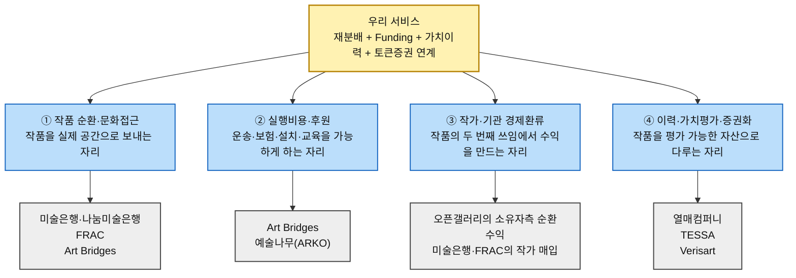
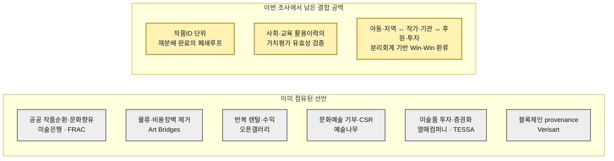

# 경쟁 지형과 가치 선언 분석 ③ — 예술품 재분배 × 미술품 토큰증권 가치순환 플랫폼

> 입력 「TAM-SAM-SOM & Market Segment Map」 · 「페르소나·페르소나 스펙트럼·고객 여정지도」 · 「시장기회 분석(AOS·DOS·혼합매트릭스)」 · 「JTBD 모의 인터뷰·문항지」 · 기존 경쟁사·가치목표 분석 초안
>
> 🔎 **리서치 기준일 2026-08-13.** 경쟁사·제도·공공사업 관련 서술은 가능한 한 기관 공식 페이지, 금융당국·감독당국 자료, 학술 논문을 우선해 재확인했다. 기존 초안에서 출처가 약하거나 현재 상태와 충돌하는 수치·단정은 제외했다.
>
> ⚠️ **근거 등급을 섞지 않는다.** §1~§2의 확인 가능한 규모·모델·활동은 **(확인)**, §3의 가치 선언문은 공식 슬로건이 아니라 활동에서 역산한 **(추정)**이다. 기존 AOS·DOS는 실제 인터뷰가 없는 작업가정이므로 **(가정)**, JTBD 인용은 생성된 모의응답이므로 **(가정·모의)**다.
>
> 📌 **사업의 중심축.** 이 사업은 단순 미술품 기부 서비스가 아니다. **미술품 토큰증권을 기획하다가 가치가 충분히 발견되지 못한·미활용·보관한계 작품의 순환 문제를 발견한 것**이 출발점이다. 작품을 문화예술 접근성이 낮은 지역에 재분배하고, 기부·CSR로 이전비용을 조성하며, 전시·향유·교육·창작 이력을 작품 단위로 축적한다. 그 이력이 가치평가에 실제로 의미가 있는지 검증한 뒤 **권리·가치평가·증권 요건을 충족한 작품만 토큰증권 연계 가능성을 검토**한다. 재분배와 토큰증권은 분리된 두 사업이 아니라 서로를 다시 활성화하는 가치순환의 두 축이다.

---

## 0. 경쟁의 정의 — 우리는 무엇과 경쟁하는가

기존 초안은 시장을 `공급-수요-자금-토큰화`로 나눴지만, 경쟁사를 다시 확인하면 한 단계 더 세분화할 필요가 있다. 고객이 실제로 대체할 수 있는 것은 **네 종류의 이미 존재하는 해결 방식**이다.

| 경쟁 축 | 우리가 하려는 일 | 이미 그 자리를 부분 점유한 서비스 |
|---|---|---|
| **① 작품 순환·문화접근** | 가치가 충분히 발견되지 못한 작품을 문화예술 접근성이 낮은 지역·학교·기관에 재분배 | 국립현대미술관 미술은행·나눔미술은행 · FRAC · Art Bridges |
| **② 실행비용·후원** | 기부·CSR로 운송·보험·설치·교육 등 프로젝트 비용 조성 | Art Bridges · 한국문화예술위원회 예술나무 |
| **③ 작가·기관 경제환류** | 작품의 두 번째 쓰임에서 생긴 후속 수익·사업기회를 창작 생태계로 환류 | 오픈갤러리(작품 소유자 측 상업 렌탈·재판매 수익) · 미술은행·FRAC(작가 작품 매입) |
| **④ 이력·가치평가·증권화** | 작품ID 단위 이력을 쌓고 가치평가·권리 검토 후 적격 작품을 토큰증권 생태계와 연계 | 열매컴퍼니 · TESSA · Verisart |

> 🚨 **여기서 경쟁전략의 기준이 바뀐다.** `작품을 지역에 보낸다`, `기부를 받는다`, `작가에게 수익을 준다`, `블록체인에 이력을 남긴다`, `미술품을 증권화한다`는 문장만으로는 이미 차별화가 되지 않는다. 차별점은 **이 네 구간을 한 작품ID 위에서 연결하고, 사회적 활용이력을 향후 가치평가의 ‘추가 근거 후보’로 검증하면서도 기부와 투자자금을 분리하는 구조**에 있어야 한다.

---

## 1. 경쟁사 브리핑

> 규모 수치는 기관마다 정의가 달라 횡비교용 순위로 사용하지 않는다. 회사가 직접 공개한 성과 수치는 **자사 발표**임을 전제로 읽고, 금융·제도 관련 사실은 금융위원회·금융감독원 자료를 우선한다.

| # | 서비스 | 경쟁 축 | 비즈니스 규모·현재성 | 핵심 비즈니스 모델 | 사업 전략의 특징 | 출처 |
|:---:|---|---|---|---|---|---|
| **1** | **국립현대미술관 미술은행·나눔미술은행** | ① 순환·접근 | 2026년 미술은행 작품구입 공모 결과와 2026 나눔미술은행 사업 수요조사가 공식 공지되어 있으며, 대여·보험·운송·설치·반납 절차를 상시 안내 | 작품을 구입해 기관에 대여하고, 나눔미술은행은 문화예술 접근 확대 목적의 무상 지원 프로그램을 별도로 운영 | **공공예산으로 작품의 구입과 순환을 제도화.** 대여약정·보험·운송·설치·상태확인·설치결과보고 등 운영 표준이 이미 존재 | [미술은행 대여안내](https://www.artbank.go.kr/home/lending/lendingManualList.do) · [운영규정](https://www.artbank.go.kr/home/intro/regulation.do?loc=h13) · [새소식](https://www.artbank.go.kr/home/notice/newsList.do) |
| **2** | **오픈갤러리** | ① 순환 · ③ 환류 | 자사 페이지 기준 누적 렌탈 **92,381점**, 보유작 약 **7.4만 점**, 월 5천~6천 점 거래를 제시 | 원화를 90일 단위로 렌탈하고 회수·교체. 별도 아트테크에서는 소유작 렌탈·재판매 수익 구조 운영 | **미판매·보유 작품을 반복 사용되는 상업 자산으로 전환.** 운송·회수까지 플랫폼이 맡아 ‘순환에서 돈이 생길 수 있음’을 상업영역에서 실증 | [FAQ](https://www.opengallery.co.kr/faq/) · [아트테크](https://www.opengallery.co.kr/arttech/) |
| **3** | **Art Bridges Foundation** | ① 순환 · ② 비용 | 공식 사이트 현재 표기 기준 **400+ 박물관 파트너**, **1,800+ 지원 프로젝트**, **31M+ people impacted**(기관 자기보고) | 소장품을 2~5점 그룹으로 묶어 장기 대여하고, 대여계약·보험·크레이팅·포장·운송·설치·철거 비용을 재단이 부담 | 문제를 ‘작품 부족’보다 **금융·물류·인력 장벽**으로 정의. Learning & Engagement funding과 평가 지원까지 결합 | [공식 Impact](https://artbridgesfoundation.org/) · [Partner Loan Network](https://artbridgesfoundation.org/partner-loan-network) · [Community Engagement](https://artbridgesfoundation.org/community-engagement) |
| **4** | **FRAC (Fonds régionaux d’art contemporain)** | ① 순환·접근 · ③ 창작지원 | 프랑스 문화부가 1982년부터 국가-지역 파트너십으로 운영. 문화부 공식 자료는 **23개 FRAC**, 3.5만 점 이상·6천 명 작가의 컬렉션과 지역 내 작품 확산·교육·창작지원 임무를 명시 | 살아있는 작가의 작품을 구입·소장하고, 미술관에 한정하지 않은 다양한 기관·지역으로 컬렉션을 순환 | **‘지역’을 단위로 한 장기적 작품 순환과 문화분권의 장기 운영 선행사례.** 따라서 ‘지역 순환 자체’는 우리의 독점적 차별점이 아님 | [프랑스 문화부 FRAC](https://www.culture.gouv.fr/thematiques/arts-plastiques/les-arts-plastiques-en-france/les-fonds-regionaux-d-art-contemporain) · [FRAC 설립사](https://www.culture.gouv.fr/nous-connaitre/decouvrir-le-ministere/histoire-du-ministere/ministere-de-la-culture-60-ans-d-action-en-500-dates/1982-09-03-Creation-des-FRAC) |
| **5** | **한국문화예술위원회 예술나무(Artistree)** | ② 후원·CSR | 정기·일시후원, 조건부 기부, 기업 파트너십, 개인 특별기부, 크라우드펀딩을 현재 운영 | 예술분야 전문성과 네트워크를 이용해 후원자·기업 니즈에 맞는 문화예술 사업을 기획·운영하고 성과를 공유 | **‘문화예술에 돈을 모으는 인프라’는 이미 존재.** 우리의 차별점은 모금 자체가 아니라 특정 작품의 이동·활용과 Funding을 닫힌 고리로 연결하는 것 | [후원가이드](https://www.arko.or.kr/supp/content/4088) · [기업 파트너십](https://www.arko.or.kr/supp/content/5462) |
| **6** | **열매컴퍼니·아트앤가이드** | ④ 가치평가·증권화 | 금융감독원은 **2023-12-15** 열매컴퍼니 투자계약증권 신고서 효력 발생을 ‘사업재편 이후 최초 사례’로 확인. 회사는 현재 STO 인프라 기업을 표방 | 미술품의 전시·관리·매각 공동사업에서 발생하는 계약상 권리를 투자계약증권으로 구조화하고, 가치평가·권리관리·발행운영 역량을 축적 | **미술품 관련 공동사업의 경제적 권리를 제도권 투자계약증권으로 구조화하는 역량**을 선점. 다만 이는 ‘이미 투자 대상으로 선별된 작품’을 전제로 한 금융화이지 재분배를 통한 가치발견 모델은 아님 | [금융감독원 2023-12-15](https://dart.fss.or.kr/dsaa003/selectBodoMain.ax?seqno=25953) · [열매컴퍼니 공식](https://www.yeolmaecompany.com/) · [아트앤가이드](https://artnguide.co.kr/) |
| **7** | **TESSA** | ④ 조각투자·자산운영 | 2026년 현재 공식 사이트가 **‘미술품 조각투자 플랫폼’**을 표방하고, 미술품 매입·매각·전시기획과 투자계약증권 기반의 제도권 금융상품화를 설명 | 블루칩 미술품을 중심으로 소액·분할 참여 경험과 전시 운영을 제공하며, 회사는 조각투자사업을 투자계약증권 발행 형태로 고도화하고 있다고 설명 | 기존 초안의 ‘미술품에서 완전히 이탈·실패’ 단정은 현재 공식 소개와 맞지 않아 삭제. 사용자 사업에는 **유동성·규제전환·투자대상 선별을 별도 검증해야 한다는 경고**로만 활용 | [TESSA 공식](https://tessa.art/) |
| **8** | **Verisart** | ④ 이력·진품성 | 공식 사이트 기준 **65,000 creators & collectors**, **230,000 blockchain certificates**(자사 발표) | 실물·디지털 작품의 창작자·발행자·작품 메타데이터·**현재 소유자 키**·변경 이력을 블록체인 인증서에 기록 | **‘블록체인에 작품 이력을 남긴다’는 것 자체도 이미 차별점이 아님.** 단, Verisart도 *Unverified Record*는 진품성이나 소유권을 부여하지 않는다고 명시한다. 우리의 데이터 차별성은 재분배·교육·사회적 활용·Funding·권리 동의를 한 작품ID에 결합하는 데 있어야 함 | [About](https://verisart.com/about) · [Certificate status](https://help.verisart.com/en/articles/4568835-what-does-certificate-status-mean) |

> 🖊️ **용어 정정.** 열매컴퍼니의 미술품 **투자계약증권**과 2027년 시행 예정인 **토큰증권**을 같은 말로 쓰지 않는다. 금융위원회는 토큰증권을 분산원장으로 발행·관리하는 **증권의 ‘형식’**으로 규정한다. 투자계약증권은 증권의 내용·유형이고, 향후 토큰증권 형식으로 발행될 수 있는 관계다. 이 문서에서 편의상 쓰는 **‘적격 작품’**은 작품 그 자체가 증권이라는 뜻이 아니라, **해당 작품을 기반으로 한 공동사업·계약상 권리·가치평가·공시 등 필요한 요건을 충족할 수 있는 구조**를 줄여 부르는 표현이다.

---

## 2. 기업별 핵심 가치와 주요 사업활동

### 2-1. 국립현대미술관 미술은행·나눔미술은행 — 공공예산으로 작품을 순환시킨다

**핵심 가치: 공공 순환(public circulation)과 문화향유권.**

미술은행 운영규정은 작품 구입·대여·전시를 통해 **미술문화 발전, 국내 미술시장 활성화, 국민의 문화향유권 신장**에 기여하는 것을 운영원칙으로 둔다. 대여는 상담→신청→약정→보험→운송·설치→관리→반납까지 표준화되어 있고, 설치공간 지침·상태확인서·설치결과보고서도 존재한다.

- **이미 해결한 것**: 작품 관리·보험·이동·설치의 제도적 표준, 기관 단위 작품 순환, 공공 목적의 문화향유 확대.
- **나눔미술은행의 의미**: 일반 유상대여와 달리 문화예술 접근 확대 목적의 지원사업을 별도 운영한다는 점에서 사용자 사업의 ‘문화접근 취약지역’ 방향과 직접 겹친다. 2024년 공식 안내에서는 선정기관에 **대여료·감상자료·운송비**를 지원했다. 반면 일반 미술은행 대여는 설치·철거에 드는 운송료·인건비를 **임차기관 부담 원칙**으로 두므로 두 제도를 섞어 표현하면 안 된다.
- **우리에게 남기는 경고**: 따라서 `작품을 문화소외지역에 보낸다`만으로는 신규성이 없다. 민간 플랫폼이 필요하다면 **누가 어떤 비용을 어떻게 조성하고, 실제 활용을 어떻게 검증하며, 그 결과를 작가·기관의 후속 가치와 어떻게 연결하는지**가 달라야 한다.
- **데이터 측면의 정정**: 기존 초안의 ‘미술은행은 이동 이력을 남기지 않는다’는 표현은 부정확하다. 공식 서식에 인수증·상태확인서·설치결과보고서가 존재한다. 우리가 겨냥해야 할 공백은 **기초 관리이력의 부재가 아니라, 교육·향유·사회성과까지 작품ID 수준에서 후속 가치평가와 연결하는 규격의 부재**다.

### 2-2. 오픈갤러리 — 작품의 ‘두 번째 쓰임’을 상업적으로 회전시킨다

**핵심 가치: 반복 사용이 만드는 접근성과 현금흐름.**

오픈갤러리는 90일 단위 렌탈, 직접 회수, 구매 전환을 운영한다. 아트테크 영역에서는 소유작이 제3자에게 렌탈되면 렌탈 수익을, 재판매되면 판매 수익을 제공한다고 설명하며, 자사 페이지 기준 누적 렌탈 92,381점을 제시한다.

- **이미 해결한 것**: ‘안 팔린 작품도 다시 걸릴 수 있다’, ‘소유권을 즉시 이전하지 않아도 반복 순환에서 수익이 생길 수 있다’는 상업적 가능성.
- **후속 경제수익 설계에 주는 근거**: 오픈갤러리는 작품 순환이 렌탈·재판매 수익으로 이어질 수 있다는 상업 선례다. 다만 공식 아트테크 설명에서 수익을 지급받는 주체는 **작품을 매입해 재위탁한 소유자**다. 따라서 이를 `재분배 참여 작가가 렌탈수익을 받는다`는 직접 근거로 쓰면 안 되며, 사용자 사업의 작가·기관 배분은 별도 계약·BM으로 검증해야 한다.
- **남는 공백**: 오픈갤러리는 **지불 의사가 있는 상업 고객**을 전제로 한다. 문화예술 접근성이 낮은 학교·복지·지역기관에서는 같은 결제자가 존재하지 않을 수 있다. 사용자 사업은 이 지불자를 기부·CSR·후속 대여·상업활용 등으로 재설계해야 한다.
- **주의**: 오픈갤러리가 제시하는 예상수익률은 회사의 서비스 마케팅 수치이므로, 사용자 사업의 수익성 근거로 그대로 전용하지 않는다.

### 2-3. Art Bridges Foundation — 작품보다 먼저 비용 장벽을 없앤다

**핵심 가치: access by removing logistical and financial barriers.**

Partner Loan Network는 소장품을 2~5점 단위로 묶어 다른 박물관에 장기 대여하고, **대여계약·보험·크레이팅·포장·운송·설치·철거의 직접비를 부담**한다. 대여기관에는 작품 준비비를 지원하고 차용기관에는 대여를 100% 무료로 제공한다. Learning & Engagement funding을 통해 관련 프로그램·지역 참여도 지원한다.

- **P23에 대한 부분 반증**: 기존 AOS의 `작품과 이전비용을 동시에 확보할 대체재가 거의 없다`는 가정은 글로벌 박물관 영역에서는 그대로 유지하기 어렵다. Art Bridges가 박물관 영역에서 바로 그 두 요소를 한 프로그램으로 묶기 때문이다.
- **교육·향유 측면**: 단순 운송뿐 아니라 프로그램·커뮤니티 참여 Funding과 평가 지원까지 제공하므로 `작품을 보낸 뒤 활용은 아무도 보지 않는다`는 기존 초안도 과도한 단정이다.
- **우리에게 남는 공백**: Art Bridges의 핵심 고객은 적격 박물관·문화기관이다. 사용자가 상정한 학교·NGO·복지시설처럼 **미술관 인프라가 없는 수요처**를 기본 고객으로 삼는 구조와, 시민·기업의 기부를 작품 단위로 매칭하는 구조는 다르다.
- **차별화 방향**: ‘비용을 없앤다’가 아니라 **`누가 비용을 채웠고 → 어떤 작품이 이동했고 → 어떤 교육·향유가 발생했으며 → 그 기록이 작품과 작가에게 무엇으로 돌아왔는가`까지 하나로 닫는 것**이 필요하다.

### 2-4. FRAC — ‘지역 단위 작품 순환’은 이미 1982년부터 존재한다

**핵심 가치: 문화분권과 컬렉션의 이동성.**

프랑스 문화부는 FRAC을 1982년 국가-지역 파트너십으로 만들었고, 살아있는 작가의 작품을 구입해 컬렉션을 형성하고 **박물관에 한정하지 않은 다양한 기관으로 작품을 확산**하며 대중의 동시대미술 접근을 높이는 것을 임무로 설명한다.

- **기존 초안의 중요한 정정**: `지역을 단위로 작품을 다년간 순환시키는 모델이 없다`는 주장은 사실이 아니다. FRAC은 이 방향의 장기 선행사례다.
- **따라서 ‘예술문화 마을’의 위치**: 지역 전체에 작품 경험이 반복 축적되어 문화적 분위기가 형성되는 것은 **장기 Outcome**으로 둘 수 있지만, 우리만의 기능이나 지금 약속 가능한 제품으로 표현하면 안 된다.
- **작가 지원**: FRAC은 살아있는 작가 작품의 구입과 창작지원 역할도 가진다. ‘작가에게 돈이 돌아간다’ 역시 공공 영역에서 전례가 없는 가치가 아니다.
- **남는 공백**: 이번 조사에서 확인한 FRAC의 구조는 공공재원과 공공컬렉션 순환이다. 사용자 사업의 **시민·기업 Funding + 작품ID 단위 활용이력 + 향후 가치평가/토큰증권 연계**까지 이어지는 구조와는 다르다.

### 2-5. 한국문화예술위원회 예술나무 — 문화예술 기부 자체는 이미 인프라가 있다

**핵심 가치: 후원자의 의도를 실제 문화예술 사업으로 구조화.**

예술나무는 정기·일시 후원 외에도 **특정 사업을 조건으로 하는 기부, 기업 파트너십, 개인 특별기부, 크라우드펀딩**을 운영한다. 기업 파트너십은 기업 니즈 파악→맞춤 사업 기획→협약→운영→성과공유의 절차를 공식적으로 제시한다.

- **이미 해결한 것**: `문화예술을 위해 개인·기업의 돈을 모은다`는 기능과 CSR 연결.
- **P27에 대한 부분 반증**: 예술나무의 크라우드펀딩은 후원자가 예술 프로젝트를 선택해 후원하고 결과물을 확인할 수 있는 구조를 제공한다. 따라서 `문화예술 기부 후 결과 확인 수단이 전혀 없다`고 쓰면 틀린다.
- **남는 공백**: 예술나무는 **작품 한 점의 물리적 이동·보험·설치·교육활용·권리동의·후속 가치이력**을 하나의 객체로 관리하는 서비스가 아니다. 사용자 사업의 Funding 차별성은 ‘기부기능’이 아니라 **작품 단위 실행과 결과의 연결**이다.
- **전략적 함의**: 예술나무 같은 기존 문화예술 후원 인프라는 경쟁자이면서 동시에 초기 모금·후원 채널의 협력 후보가 될 수 있다. 모든 인프라를 직접 만들 필요는 없다.

### 2-6. 열매컴퍼니·아트앤가이드 — ‘미술품을 증권으로 구조화’하는 제도권 경로가 열렸다

**핵심 가치: 실물자산의 투자 가능 구조화.**

금융감독원은 2023년 12월 열매컴퍼니의 투자계약증권 신고서 효력 발생을 조각투자 사업재편 이후 최초 사례로 확인했다. 열매컴퍼니는 현재 스스로를 국내 1호 투자계약증권 발행사이자 STO 인프라 기업으로 설명하며 미술품을 넘어 실물자산 구조화를 확대하고 있다.

- **이미 해결한 것**: 미술품 공동사업을 자본시장법상 투자계약증권으로 설계하고 공시·투자자보호 요건을 통과하는 경로.
- **중요한 구분**: 이것은 곧바로 `토큰증권 발행`과 동일하지 않다. 금융위원회는 토큰증권을 증권의 **발행·관리 형식**으로 정의한다.
- **우리 사업과의 차이**: 열매컴퍼니는 기본적으로 **투자대상 작품과 공동사업·권리구조를 먼저 선별한 뒤 금융구조를 설계하는 사업**이다. 사용자 사업은 시장에서 가치가 충분히 발견되지 못한 작품을 먼저 사회적으로 순환시키고, 그 데이터가 가치평가에 어떤 추가정보를 주는지부터 검증하려 한다.
- **경고**: `재분배 → 토큰화`를 자동 경로로 써서는 안 된다. 가치평가, 권리, 수익구조, 공시, 기초자산 적격성 등 별도 Gate가 필요하다.

### 2-7. TESSA — 접근성을 낮춘 조각투자와 전시 활용을 함께 보여준다

**핵심 가치: art collecting의 접근성 확대.**

TESSA 공식 사이트는 2026년 현재 자신을 `미술품 조각투자 플랫폼`으로 소개하고, 미술품 매입·매각·전시기획을 운영하며 자사 조각투자사업을 투자계약증권 발행 형태로 제도권 금융상품화하고 있다고 설명한다. 이는 **회사 자체 설명**이므로, 실제 개별 발행·공모 실적은 금융당국 공시로 별도 확인해야 한다.

- **기존 초안에서 제외한 단정**: `제도권 전환 실패`, `미술품에서 이탈`, `토큰화 축 축소`를 현재 사실처럼 쓰지 않는다. 공식 사이트의 현재 운영과 충돌하고, 투자계약증권 발행 여부 하나만으로 회사 전체의 성공·실패를 판정할 수 없다.
- **배울 점**: 미술품 참여 문턱을 낮추면서 매입·매각·전시기획 같은 자산 운영을 함께 묶을 수 있다는 구조.
- **사용자 사업과의 차이**: 주로 시장에서 이미 인지도가 높은 블루칩 작품을 전제로 한다. 사용자는 **가치가 아직 충분히 발견되지 않은 작품의 순환→이력→평가 가능성**을 다룬다.
- **경고**: TESSA 사례를 사용자 사업에 적용할 때는 조각화 기술만 보지 말고 **투자대상 선정, 유동성, 권리, 처분 가능성**을 별도 검증항목으로 둬야 한다.

### 2-8. Verisart — 작품의 디지털 이력·진품성 기록은 이미 상품이다

**핵심 가치: verifiable provenance.**

Verisart는 작품별 블록체인 인증서를 만들고 창작자·발행자·작품 메타데이터·현재 소유자 키·변경이력을 타임스탬프로 축적한다. 인증서는 정적 PDF가 아니라 정보가 추가될수록 갱신되고, 변경 이벤트를 이력으로 보여준다. 다만 공식 도움말은 **Unverified Record가 진품성이나 소유권을 부여하지 않는다고 명시**하므로, 블록체인 기록 자체를 법적 소유권이나 진품성의 자동 증명으로 해석하면 안 된다.

- **이미 해결한 것**: `작품ID`, `변경이력`, `블록체인 타임스탬프`, `진품성 관련 상태`, `현재 소유자 키` 같은 provenance 메타데이터.
- **우리에게 주는 경고**: `블록체인으로 작품 이력을 남긴다`를 차별가치로 내세우면 안 된다.
- **남는 공백**: Verisart의 표준 이력은 진품성 관련 상태·발행·현재 소유자 키·변경 중심이다. 사용자 사업이 만들려는 것은 **재분배 장소, 수령기관, Funding, 설치, 교육·창작 활용, 관람·향유 결과, 권리동의**가 함께 묶인 ‘순환 이력’이다.
- **가치평가 연결의 정확한 표현**: 학술연구는 전통적인 provenance와 전시이력이 경매 매각확률·가격과 유의하게 연관될 수 있음을 보여주지만, **문화취약지역에서의 교육·사회적 활용 이력이 같은 효과를 낸다는 연구는 아니다.** 이 부분은 반드시 별도 검증 대상이다.

---

## 3. 가치 선언문 도출

> 아래 문장은 각 기관의 공식 슬로건을 옮긴 것이 아니다. §1·§2의 실제 사업활동을 한두 문장으로 압축해 역산한 **분석용 가치 선언문 (추정)**이다.

### 3-1. 국립현대미술관 미술은행·나눔미술은행

> **“공공이 작품을 확보하고 순환시켜, 더 많은 사람이 생활 속에서 미술을 만나게 한다.”**

**해설.** 미술은행의 구입·대여·전시와 나눔미술은행의 문화접근 지원이 모두 `공공이 시장의 배분 공백을 메운다`는 명제로 수렴한다. 따라서 사용자가 말하는 ‘작품을 문화예술 접근성이 낮은 지역에 보낸다’는 사회적 명분은 이미 공공영역에서 검증된 가치다. 우리가 차별화해야 할 것은 **민간 Funding, 작품 단위 활용결과, 후속 경제환류와 가치평가 연결**이다.

### 3-2. 오픈갤러리

> **“작품의 소유권이 바뀌지 않아도, 반복해서 걸리고 쓰이면 새로운 수요와 현금흐름이 생긴다.”**

**해설.** 90일 렌탈·회수·재렌탈 구조는 ‘판매되지 않은 작품 = 쓰임이 없는 작품’이라는 등식을 깨뜨린다. 사용자 사업의 `두 번째 기회`는 이 논리와 같은 방향이다. 다만 오픈갤러리는 **상업 고객이 지불자**이고, 사용자는 문화취약지역에서 지불자를 기부·CSR·후속수익으로 다시 설계해야 한다.

### 3-3. Art Bridges Foundation

> **“작품이 움직이지 못하는 원인이 비용과 운영장벽이라면, 그 장벽을 먼저 없애야 예술 접근이 열린다.”**

**해설.** 보험·크레이팅·운송·설치·철거를 재단이 부담하고, 프로그램 Funding까지 제공하는 설계가 이 선언을 뒷받침한다. 따라서 사용자 서비스가 단순 매칭만 제공하면 차별성이 약하다. **작품과 실행비용이 동시에 닫혀야 재분배가 완료된다**는 원칙이 필요하다.

### 3-4. FRAC

> **“동시대미술은 중심 미술관에 머무는 컬렉션이 아니라, 지역 전체를 계속 이동하는 공공 경험이어야 한다.”**

**해설.** FRAC은 ‘지역 순환’과 ‘문화분권’을 1982년부터 제도화했다. 사용자의 ‘지역 예술문화 마을’ 구상은 장기 Outcome으로는 정합하지만, `지역에 반복 공급한다`만으로는 차별점이 될 수 없다. 차별점은 **재원구조·대상 문턱·작품ID 데이터·후속 가치순환**에서 나와야 한다.

### 3-5. 한국문화예술위원회 예술나무

> **“후원자의 의도를 문화예술 전문기획과 연결해 실제 사업과 성과로 만든다.”**

**해설.** 조건부 기부·기업 파트너십·크라우드펀딩이 이미 존재하므로 `문화예술 기부` 자체는 비어 있는 시장이 아니다. 사용자 사업은 **기부금을 ‘어느 작품을 어느 공간으로 움직였는가’와 연결하고, 그 뒤의 교육·향유 이력까지 작품 단위로 묶는 해상도**에서 달라져야 한다.

### 3-6. 열매컴퍼니·아트앤가이드

> **“미술품의 경제적 가치를 투자자가 참여할 수 있는 증권 구조로 바꾼다.”**

**해설.** 열매컴퍼니의 차별성은 블록체인보다 **투자 대상으로 삼을 작품과 공동사업 구조를 선별하고, 가치·권리·공시를 제도권 투자계약증권으로 구조화하는 능력**에 있다. 사용자가 이 회사를 넘어서는 지점은 증권화 기술이 아니라, **증권화 이전에 가치가 충분히 발견되지 않은 작품의 새로운 사회적 쓰임과 데이터를 만든다는 앞단**이다.

### 3-7. TESSA

> **“고가 미술품의 참여 문턱을 낮추고, 분할 참여와 전시 경험을 투자 참여로 연결한다.”**

**해설.** 최소 투자단위를 낮추는 것은 미술품 금융의 접근성을 넓히지만, 그것만으로 기초자산 가치나 유동성이 생기지는 않는다. 사용자 사업은 투자 접근성보다 앞선 **작품의 쓰임·수요·권리·가치근거 생성 단계**를 다뤄야 한다.

### 3-8. Verisart

> **“작품의 창작자·발행자·현재 소유자 키·변경 이력은 종이가 아니라 검증 가능한 디지털 기록으로 남길 수 있다.”**

**해설.** Verisart가 증명한 것은 `이력의 디지털화`다. 따라서 사용자 사업은 기록 기술이 아니라 **무엇을 기록하는지**로 차별화해야 한다. `재분배→Funding→설치→교육·향유→권리→후속 가치검토`라는 순환사건을 한 작품ID에 묶는 것이 핵심이다.

---

## 4. 종합 분석

### 4-1. 선언 지형 — 어떤 가치가 이미 점유됐는가

**여덟 경쟁·인접 서비스를 나란히 놓으면, 사용자 사업의 개별 요소 대부분은 이미 누군가가 하고 있다.**

| 우리가 단독 차별점으로 말하면 위험한 것 | 이미 점유한 곳 | 그래서 |
|---|---|---|
| *“작품을 문화소외지역에 보낸다”* | 미술은행·나눔미술은행 · FRAC · Art Bridges | **사회적 명분은 검증됐지만 독점적 가치는 아니다.** ‘어떻게 닫힌 실행으로 만들고 다음 가치로 연결하는가’가 필요 |
| *“운송·보험·설치비까지 지원한다”* | Art Bridges · 나눔미술은행(선정기관 일부 비용지원) | 비용지원 선행모델은 존재한다. 다만 **일반 미술은행 대여는 운송·설치비를 임차기관이 부담하는 것이 원칙**이다. Funding의 주체·대상범위·추적 단위·후속 결과를 구분해야 함 |
| *“작품 순환에서 후속 수익이 생긴다”* | 오픈갤러리 | 작품 **소유자 측** 렌탈·재판매 수익의 상업 선례는 존재. 이를 작가 수익으로 일반화할 수 없으며, 문화취약지역에서는 **작가·기관 배분을 위한 별도 지불자·계약 구조**가 필요 |
| *“문화예술 기부·CSR을 받는다”* | 예술나무 | 모금 기능만으로는 차별화 안 됨. **기부건↔작품↔수령기관↔활용결과** 연결이 필요 |
| *“미술품 투자 접근성을 낮추거나 증권화한다”* | 열매컴퍼니(투자계약증권) · TESSA(조각투자 인접경쟁) | 제도권 투자계약증권 사례와 미술품 조각투자 인접사업이 이미 존재한다. **사용자 사업은 금융화 ‘앞단의 가치발견’과 적격성 검증**에 강점이 있어야 함 |
| *“블록체인으로 작품 이력을 남긴다”* | Verisart | 기술 자체는 선점됨. **교육·향유·Funding·권리를 포함한 순환 데이터의 내용**이 차별점 |

### 4-2. 비어 있는 세 자리

> 아래의 ‘비어 있음’은 전 세계에 절대 존재하지 않는다는 뜻이 아니라, **이번 8개 핵심 경쟁·인접 서비스와 2026-08-13 공개자료 조사 범위에서 동일한 통합구조를 확인하지 못했다**는 의미다.

| # | 빈 자리 | 왜 아직 비어 있는가 | 사용자 사업의 어디와 맞물리나 |
|---|---|---|---|
| **①** | **작품ID 단위 ‘재분배 완료’ 폐쇄루프** | 기존 사업자는 대여·모금·인증·증권화를 각각 잘하지만, `보유자 동의 → Funding → 운송·보험 → 설치 → 실제 감상·교육·창작 → 결과 회신`을 한 작품ID로 닫는 사업은 이번 조사에서 확인하지 못함 | **P23** 작품+비용 동시성 · **P24** 현장 활용기록 · 사용자 핵심 1의 아이·지역 Win-Win |
| **②** | **사회·교육 활용이력을 ‘가치평가용 추가 데이터’로 검증하는 다리** | 학술연구는 provenance·전시이력이 가격·매각확률과 연관됨을 보여주지만, **문화취약지역의 교육·사회적 활용이 경제가치에 미치는 효과는 별개로 검증되지 않음** | **P03** 작품 가치이력 · **P27** 기부→문화성과→작품이력 · 사용자 핵심 2의 토큰증권 연결 |
| **③** | **기부와 투자·상업수익을 섞지 않는 Win-Win 경제환류** | 공공순환은 작가 작품 매입, 오픈갤러리 아트테크는 작품 소유자 측 렌탈·재판매 수익, 기부플랫폼은 공익 Funding, 조각투자는 투자자 수익을 각각 제공한다. 그러나 **아이·지역의 공익성과 작가·기관의 후속 경제수익을 별도 재원·계약으로 동시에 설계한 통합 모델은 이번 조사에서 확인하지 못함** | 사용자 핵심 1의 **작가·기관 수익기회 + 아동 창의교육**, 그리고 장기적 생태계 환류 |

> 🎯 **셋 중 전략적으로 가장 독창적이지만 가장 미검증인 자리는 ②다.** `활용이력이 경제적 가치평가에 의미가 있는가`가 YES로 확인되면 재분배와 토큰증권을 잇는 사용자 사업만의 다리가 생긴다. 반대로 NO라면 ②는 ‘사회성과·provenance 기록’ 기능으로 남고 토큰증권 연결 논리는 축소해야 한다.

### 4-3. AOS 분석의 미결 과제에 대한 응답

기존 AOS에서 **Satisfaction 1점이면서 AOS 4.0으로 공동 최상위였던 5개**를 실제 경쟁·대체서비스 조사로 다시 본다. AOS 공식은 기존과 동일하게 `Importance × (1 - Satisfaction/5)`를 사용한다. 아래 재판정은 **공개 대체재 기준의 분석가 추정**이며 실제 사용자 만족도 인터뷰를 대신하지 않는다.

| ID | 항목 | 기존 판정 | 경쟁사 조사 결과 | 공개 대체재 기준 재판정 | 재산출 AOS |
|---|---|:---:|---|:---:|:---:|
| **P02** | 작품 매칭 시점 불명확 | Sat **1** | 오픈갤러리·Art Bridges는 자기 네트워크에서 등록·대여를 운영하지만 **보관한계 작품에 대해 언제 수요처가 확정되는지 보장하는 공통 신호는 확인 못함** | **Sat 1 유지** | **4.0** |
| **P03** | 재분배 후 전시·활용·향유가 작품 가치이력으로 안 남음 | Sat **1** | 미술은행은 인수·상태·설치결과를 기록하고, Verisart는 provenance 변경이력을 기록하며, Art Bridges는 프로그램 평가도 지원. 다만 **사회·교육 활용→후속 가치평가 연결은 이번 조사 범위에서 확인하지 못함** | **Sat 2 ↑** | **3.0** |
| **P14** | 폐기·보관한계 전 매칭기한 불명확 | Sat **1** | 조사 서비스들은 대여·매칭 체계는 있으나 **처분 압박이 있는 작품의 확정 기한을 해결하는 직접 대체재는 확인 못함** | **Sat 1 유지** | **4.0** |
| **P23** | 작품 매칭과 이전비용 Funding이 분리 | Sat **1** | Art Bridges는 박물관 네트워크에서 작품 대여와 보험·포장·운송·설치 비용을 **한 프로그램에서 묶어 제공**한다. 국내 나눔미술은행도 선정기관에 대여료·감상자료·운송비를 지원하지만, 일반 미술은행은 운송·설치비를 임차기관이 부담하는 것이 원칙이다. 대상·공급범위도 사용자 서비스와 다름 | **Sat 2 ↑** | **3.0** |
| **P27** | 기부→문화성과→작품 가치이력 연결 부족 | Sat **1** | 예술나무는 프로젝트 후원·성과확인을, Verisart는 작품 이력을 각각 제공. 그러나 **기부건→특정 작품→지역/아이 경험→가치이력**까지 한 번에 연결하지는 않음 | **Sat 2 ↑** | **3.0** |

> 🚨 **P23은 더 이상 Sat 1의 ‘대체재 없음’으로 둘 수는 없지만, 완전히 해결된 문제도 아니다.** Art Bridges는 박물관 영역에서 작품과 직접비용을 강하게 묶고, 나눔미술은행도 선정기관에 운송비 등을 지원한다. 그러나 일반 미술은행의 비용부담 원칙, 수요처 범위, 작품 공급원, 시민·기업 Funding 구조가 사용자 서비스와 다르므로 **부분 대체재로 보고 Sat 2로 보수적으로 재판정**했다. 따라서 사용자 서비스의 P23 차별점은 **학교·복지·NGO까지 낮춘 참여문턱 + 시민·기업 Funding + 작품ID 결과기록**이어야 한다.
>
> 📌 **반대로 P02·P14는 경쟁조사 후에도 가장 견고하게 남는다.** 가치가 충분히 발견되지 못한 작품이 `언제까지 기다리면 되는가`를 알 수 없다는 공급자의 시간 문제는 조사한 대체서비스에서 직접 해결되지 않았다. 다만 이 역시 실제 작가·기관 인터뷰로 검증해야 한다.

### 4-4. 우리 가치 선언문 — 초안과 그 위험

> ➡️ **이 절은 후속 문서 「차별적 가치목표 제안 ③」에서 최종 조정한다.** 여기서는 경쟁지형에서 살아남은 공백과 사용자가 제시한 핵심관점을 대조하기 전의 1차 후보만 남긴다.

| 후보 | 선언문 초안 | 경쟁 공백 근거 | 지금 위험 |
|:---:|---|---|---|
| **A. 창작생태계 환류** | **“작품이 다시 쓰여 별도 경제수익이 생기면, 사전 약정한 몫을 작가·기관에도 환류합니다. 기부금과 후속 수익은 구분해 추적합니다.”** | 오픈갤러리는 **작품 소유자 측** 상업 렌탈·재판매 수익의 선례를 보여주지만 문화취약지역 모델도, 작가 배분의 직접 근거도 아님. 공공순환·기부·투자 역시 수익주체가 서로 다름 | **후속 수익원이 아직 미검증.** 기부금을 작가수익으로 자동 전환한다고 오해되지 않도록 지불자·계약·배분기준을 별도 설계해야 함 |
| **B. 실제 문화향유 완결** | **“작품을 보냈다고 완료로 세지 않습니다. 문화예술 접근성이 낮은 지역에서 설치되고 감상·교육·창작에 실제 쓰인 건만 완료로 기록합니다.”** | 공공순환은 존재하지만 작품·비용·활용결과를 민간 Funding과 한 작품ID로 닫는 구조가 공백 | **현장 기록 부담.** 수령기관의 추가 행정이 커지면 참여가 끊길 수 있음 |
| **C. 가치이력→토큰증권 Gate** | **“재분배를 가치상승이라고 부르지 않습니다. 검증 가능한 이력을 쌓고, 가치평가·권리·증권 요건을 통과한 작품만 토큰증권 연계 검토로 넘깁니다.”** | provenance·증권화는 각각 존재하지만 **사회적 활용이력의 가치평가 유효성 검증과 연결**은 이번 조사에서 확인하지 못함 | **가장 핵심이면서 가장 미검증.** 사회·교육 이력이 경제가치에 의미가 없을 수 있음 |

> 📌 **권고는 B를 사회적 실행의 앞면, A를 생태계 지속성, C를 사업 정체성의 금융 연결축으로 함께 두는 것이다.** C를 ‘나중 옵션’으로 빼면 사용자 사업의 출발점이 사라진다. 다만 고객에게 `재분배하면 가격이 오른다`고 말하는 것도 근거를 넘어선다. **데이터 설계에서는 처음부터 C를 포함하고, 실제 증권화는 적격성 Gate를 통과한 작품에만 적용**하는 구조가 맞다.

### 4-5. 이 조사가 남긴 경고 세 가지

**① 개별 기능은 거의 모두 선점되어 있다 — 통합한다고 자동으로 차별화되는 것도 아니다.**  
미술은행·FRAC은 공공순환, Art Bridges는 비용 제거, 오픈갤러리는 작품 소유자 측 순환수익, 예술나무는 문화기부, 열매·TESSA는 미술품 금융, Verisart는 디지털 이력을 이미 수행한다. 사용자는 이들을 각각 이기기보다 **필요한 구간에서는 파트너로 쓰고 ‘한 작품의 전체 생애사건을 연결하는 데이터·거래 구조’에 집중**해야 한다.

**② ‘작가와 기관도 수익을 얻는다’는 핵심 포인트는 수익원까지 정의해야 가치선언이 된다.**  
재분배에 들어온 기부금을 곧바로 작가수익으로 돌린다는 뜻으로 쓰면 안 된다. 작가·기관 환류는 **후속 대여료, 상업적 활용료, 라이선스, 별도 CSR 계약, 적격 작품의 금융사업 수익 등 별도 수익원** 중 무엇으로 만들지 검증해야 한다. 아직은 **사업가설**이다.

**③ ‘투자계약증권 = 토큰증권 = 작품가치 상승’으로 연결하면 사실관계가 무너진다.**  
금융위원회는 토큰증권을 증권의 **형식**으로 규정하며, 제도화 법 시행은 **2027-02-04 예정**이다. 금융위의 **2026-05-15** 회의자료는 기초자산 적격요건·증권신고서 공시·유통시장 구조 등 세부제도를 논의하고 7월 발표를 목표로 한다고 밝혔다. **2026-08-13 이번 재확인 범위에서 그 후속 세부기준의 공식 발표를 별도로 확인하지 못했으므로**, 실제 적용 시에는 시행시점의 최신 하위법규·가이드라인을 반드시 다시 확인해야 한다. 또한 Management Science 연구가 보여주는 것은 기존 provenance·전시이력과 경매가격의 통계적 관계이지, **문화취약지역 재분배 이력이 가격을 올린다는 인과 증명**이 아니다. 따라서 사용자 사업은 `가치이력 생성 → 가치평가 유효성 검증 → 권리·수익구조 → 증권 적격성 → 토큰증권 형식 검토` 순서를 지켜야 한다.

---

## 5. 근거 등급

| 구성 요소 | 등급 | 비고 |
|---|---|---|
| §1~§2 공공기관·기업의 현재 서비스 구조 | **(확인)** | 미술은행·프랑스 문화부·Art Bridges·ARKO·FSC/FSS·각 기업 공식 페이지 우선 |
| 오픈갤러리·Art Bridges·Verisart의 누적 수치 | **(확인·자기보고)** | 공식 사이트 수치이나 독립감사 성과수치로 간주하지 않음 |
| §3 경쟁사 가치 선언문 8종 | **(추정)** | 공식 슬로건이 아니라 실제 활동에서 역산한 분석 문장 |
| §4-2 ‘비어 있는 세 자리’ | **(추정)** | 이번 8개 핵심 경쟁·인접 서비스와 공개자료 조사 범위의 공백. 전 세계 부재 증명 아님 |
| §4-3 AOS Satisfaction 재판정 | **(추정)** | 공개 대체재의 기능을 기준으로 재평가. 실제 고객 만족도 조사는 아님 |
| 기존 AOS·DOS·페르소나 | **(가정)** | 실제 인터뷰 전 작업가정 |
| JTBD 참가자 발언 | **(가정·모의)** | 생성된 모의응답. 실제 사람의 발언이 아님 |
| provenance·전시이력과 경매 매각확률·가격·수익률의 관계 | **(확인)** | Management Science 연구(1,812,807건 거래 데이터). 단 `교육·사회적 활용이력`으로 일반화 금지 |
| 토큰증권 제도화·시행예정일 | **(확인)** | 금융위원회 2026-01/03 및 2026-05-15 공식자료로 2027-02-04 시행 예정 확인. 5월 자료는 7월 중 하위법규·가이드라인 발표 목표를 밝혔으나, **2026-08-13 이번 재확인 범위에서는 후속 세부기준 공식 발표를 별도로 확인하지 못함**. 실제 적용 전 최신 자료 재확인 필요 |
| 우리 가치선언 초안 | **(가정)** | 다음 문서에서 경쟁지형·사용자 방향·최소 실행요건을 결합해 조정 |

> ⚠️ **조사 범위의 한계.** 한국·미국·프랑스 및 영문 공개자료 중심이다. 지역별 소규모 사회적기업, 비공개 B2B 미술물류·CSR 프로젝트, 박물관 내부 컬렉션 순환 프로그램 전수조사는 아니다. 따라서 `동일 서비스가 없다`가 아니라 **“이번 핵심 경쟁군에서 통합 모델을 확인하지 못했다”**로 표현한다.

---

## Sources

- [국립현대미술관 미술은행 — 대여안내](https://www.artbank.go.kr/home/lending/lendingManualList.do)
- [국립현대미술관 미술은행 — FAQ(일반 대여 운송·설치비 부담 원칙)](https://www.artbank.go.kr/home/contents.do?loc=h62)
- [국립현대미술관 — 2024 나눔미술은행 사업 안내(선정기관 운송비 등 지원)](https://www.mmca.go.kr/pr/newsDetail.do?bdCId=202405310009367)
- [국립현대미술관 미술은행 — 운영규정](https://www.artbank.go.kr/home/intro/regulation.do?loc=h13)
- [국립현대미술관 미술은행 — 새소식/2026 나눔미술은행 수요조사](https://www.artbank.go.kr/home/notice/newsList.do)
- [오픈갤러리 — FAQ](https://www.opengallery.co.kr/faq/)
- [오픈갤러리 — 아트테크](https://www.opengallery.co.kr/arttech/)
- [Art Bridges — Partner Loan Network](https://artbridgesfoundation.org/partner-loan-network)
- [Art Bridges — 공식 Impact](https://artbridgesfoundation.org/)
- [Art Bridges — Community Engagement / Evaluation](https://artbridgesfoundation.org/community-engagement)
- [France Ministère de la Culture — FRAC](https://www.culture.gouv.fr/thematiques/arts-plastiques/les-arts-plastiques-en-france/les-fonds-regionaux-d-art-contemporain)
- [France Ministère de la Culture — 1982 Création des FRAC](https://www.culture.gouv.fr/nous-connaitre/decouvrir-le-ministere/histoire-du-ministere/ministere-de-la-culture-60-ans-d-action-en-500-dates/1982-09-03-Creation-des-FRAC)
- [한국문화예술위원회 예술나무 — 후원가이드](https://www.arko.or.kr/supp/content/4088)
- [한국문화예술위원회 예술나무 — 기업 파트너십](https://www.arko.or.kr/supp/content/5462)
- [금융감독원 — 2023.12.15부터 투자계약증권 투자가 가능해집니다](https://dart.fss.or.kr/dsaa003/selectBodoMain.ax?seqno=25953)
- [열매컴퍼니 공식](https://www.yeolmaecompany.com/)
- [아트앤가이드](https://artnguide.co.kr/)
- [TESSA 공식](https://tessa.art/)
- [Verisart — About](https://verisart.com/about)
- [Verisart — Certificate status & history](https://help.verisart.com/en/articles/4568835-what-does-certificate-status-mean)
- [금융위원회 — 토큰증권 도입 및 투자계약증권 유통 법 개정안 통과, 2026.01.15](https://www.fsc.go.kr/po010106/86064)
- [금융위원회 — 토큰증권 협의체 Kick-off, 2026.03.04](https://www.fsc.go.kr/no010101/86371)
- [금융위원회 — 토큰증권 협의체 제2차회의, 2026.05.15](https://www.fsc.go.kr/no010101/86906)
- [Li, Ma & Renneboog — “In Art We Trust”, Management Science 70(1):98-127](https://pubsonline.informs.org/doi/10.1287/mnsc.2022.4633)
- [문화체육관광부 — 2025 국민문화예술 및 여가활동 조사결과](https://www.mcst.go.kr/site/s_notice/press/pressView.jsp?pMenuCD=0302000000&pSeq=22169)
