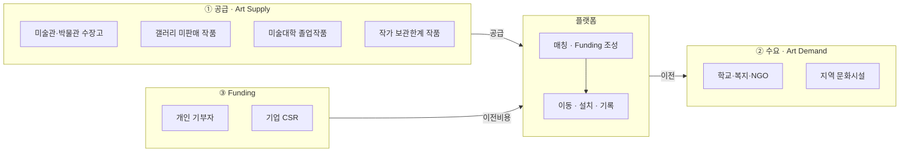
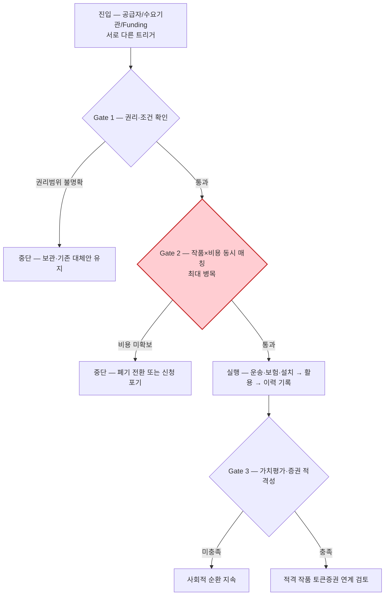
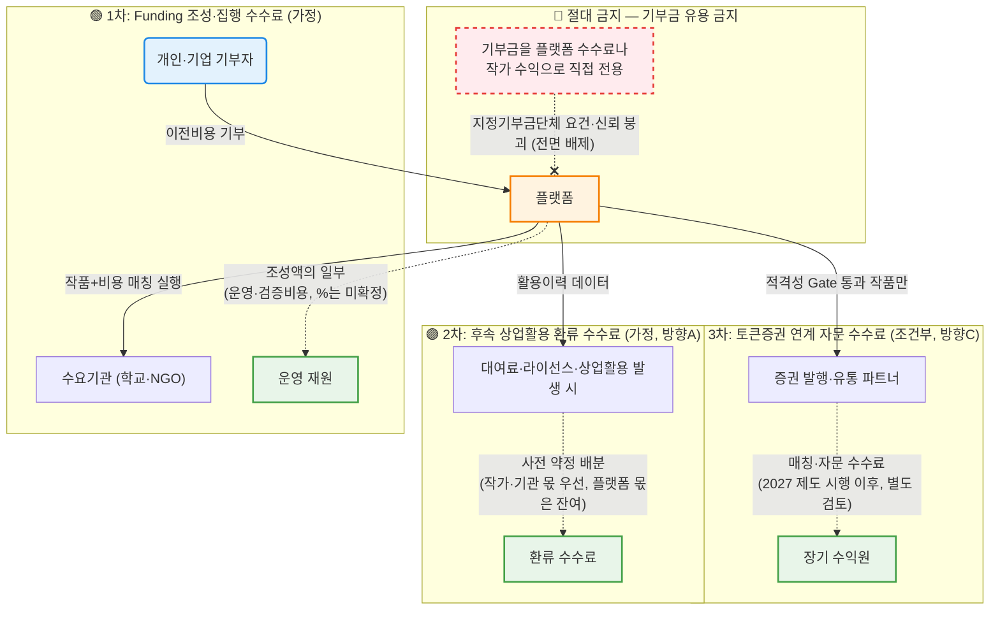

# 💡 Value Proposition Sheet — 예술품 재분배 × 미술품 토큰증권 가치순환 플랫폼 (Rooted V2.0)

> **문서 버전:** V2.0 (Rooted — 자기완결형)
> **통합 원본:** `01-porters-five-forces/`~`08-competitor-branding/` 챕터 01~08 전체(단, 01~03은 별도 사업인 핀테크 마이데이터/토큰증권 실습이므로 이 문서에는 통합하지 않는다 — §0 참조)
> **작성 대상:** 미술품 토큰증권을 기획하다가 가치가 충분히 발견되지 못한 작품의 순환 문제를 발견한 예비 창업팀
> **작성 목적:** 비즈니스 리서치(TAM-SAM-SOM, 페르소나 스펙트럼, CJM, AOS-DOS, JTBD, 경쟁 지형·가치 선언)를 이 문서 안에 직접 포함(rooting)하여, *왜 이 시장인지, 누구에게, 어떤 본질적 가치를, 어떤 차별성으로 제공하는지*를 정의하고 MVP 개발 계획까지 **단일 문서로 관리**한다. 방법론 출처: [강사 08-2 지침 — VPS를 통합본으로 고도화](https://wildmental.notion.site/08-2-VPS-3bad03212bd480ddb391fed7e1d866ac), 형식 출처: [PRD-From-VPS-Sample](https://github.com/wild-mental/PRD-From-VPS-Sample/blob/main/04_VPS-final/06_value-proposition-sheet_260410(fin).md)

---

**🎯 엘리베이터 피치:** "가치가 충분히 발견되지 못해 보관 한계에 몰린 예술품에게 다음 쓰임을 만들고, 그 쓰임의 이력을 미술품 토큰증권 생태계와 다시 연결하는 3면 순환 플랫폼"

**📣 포지셔닝 선언:** 우리는 "재분배하면 가격이 오른다"고 말하지 않는 유일한 플랫폼이다. 작품+이전비용을 **동시에** 매칭하고, 검증 가능한 활용 이력만 쌓으며, 가치평가·법률·증권 요건을 충족한 작품만 토큰증권 연계를 검토한다.

---

## 📌 목차

| # | 섹션 | 내용 요약 |
|---|------|----------|
| 0 | [이 문서의 범위 — 왜 01~03이 아니라 04~08인가](#0-이-문서의-범위--왜-01~03이-아니라-04~08인가) | 우리 저장소가 두 개의 서로 다른 사업 실습을 담고 있다는 것 |
| Ⅰ | [Pain–Solution–Outcome 핵심 흐름도](#ⅰ-painsolutionoutcome-핵심-흐름도) | 고객 문제 → 솔루션 → 성과의 직관적 흐름 |
| Ⅱ | [타겟 & 문제 분석](#ⅱ-타겟--문제-분석) | 시장 환경, 12개 페르소나, CJM 공통 병목 |
| Ⅲ | [AOS–DOS 결합 매트릭스](#ⅲ-aosdos-결합-매트릭스) | 36개 Pain의 시장기회 산출과 사분면 |
| Ⅳ | [JTBD 요약 카드](#ⅳ-jtbd-요약-카드) | 8개 모의 인터뷰 Job·Outcome 압축 |
| Ⅴ | [Value Proposition Sheet 핵심표](#ⅴ-value-proposition-sheet-핵심-가치-제안) | Pain–Job–Outcome–경쟁–VP–차별가치–Proof 총괄 |
| Ⅵ | [수익 구조 설계](#ⅵ-수익-구조-설계) | Funding 중개 · 후속 환류 · 토큰증권 연계 수수료 (가설) |
| Ⅶ | [전략적 제언](#ⅶ-전략적-제언) | 3가지 핵심 조언 |
| Ⅷ | [MVP 제품 비전 및 포지셔닝](#ⅷ-mvp-제품-비전-및-포지셔닝) | 북극성 지표, Must-Have 스펙 |
| Ⅸ | [Job-Feature Map & MVP 기능 명세](#ⅸ-job-feature-map--mvp-기능-명세) | 우선순위, 난이도, 리스크 대응 |
| Ⅹ | [MVP 성공 측정 기준 & Next Steps](#ⅹ-mvp-성공-측정-기준--next-steps) | KPI 목표, 검증 우선순위 |

---

## 0. 이 문서의 범위 — 왜 01~03이 아니라 04~08인가

우리 저장소는 **두 개의 독립된 실습 사업**을 담고 있다.

| 챕터 | 사업 | 이 문서와의 관계 |
|---|---|---|
| [01-porters-five-forces](../01-porters-five-forces/) · [02-value-chain](../02-value-chain/) · [03-ksf](../03-ksf/) | 핀테크 마이데이터 vs 토큰증권 (별도 실습) | **통합하지 않음** — 다른 사업 |
| [04-tam-sam-som](../04-tam-sam-som/) · [05-persona-journey](../05-persona-journey/) · [06-opportunity-score](../06-opportunity-score/) · [07-jtbd](../07-jtbd/) · [08-competitor-branding](../08-competitor-branding/) | 예술품 재분배 × 미술품 토큰증권 가치순환 플랫폼 | **이 문서의 원본** |

이 사업은 미술품 토큰증권을 기획하다가 **가치가 충분히 발견되지 못한·미활용·보관한계 작품을 어떻게 순환시킬 것인가**라는 문제를 발견하면서 시작됐다([챕터 04 사후 기록](../04-tam-sam-som/분석-03-예술품-재분배-플랫폼.md#-사후-기록--이-사업의-출발점은-미술품-토큰증권-기획이다)). 아래 Ⅱ~Ⅳ는 챕터 04~08의 산출물을 요약·발췌해 이 문서 안에 직접 담되(rooting), 세부 산출 근거는 각 챕터 원본에 남겨 이중 관리를 피한다.

---

## Ⅰ. Pain–Solution–Outcome 핵심 흐름도

```mermaid
flowchart LR
    classDef pain fill:#FFEBEE,stroke:#EF5350,stroke-width:2px;
    classDef solution fill:#E8F5E9,stroke:#66BB6A,stroke-width:2px;
    classDef outcome fill:#E3F2FD,stroke:#42A5F5,stroke-width:2px;

    subgraph Pain ["🔥 Pain — 12개 페르소나가 공통으로 겪는 것"]
        direction TB
        P1("작품+이전비용이 따로 움직여 실행 자체가 멈춘다"):::pain
        P2("권리·동의가 목적별로 나뉘지 않아 기관 승인이 막힌다"):::pain
        P3("'유휴·저평가·폐기'라는 언어가 공급자에게 낙인이 된다"):::pain
    end

    subgraph Solution ["💡 Solution — 우리 플랫폼의 핵심 제안"]
        direction TB
        S1("작품×Funding 동시 매칭 엔진"):::solution
        S2("재분배/기록/상업활용/증권연계 4단 동의 분리"):::solution
        S3("처리기한 확정 + '순환 가능 작품' 프레이밍"):::solution
    end

    subgraph Outcome ["🎯 Outcome — 고객이 체감하는 최종 성과"]
        direction TB
        O1("NGO·학교는 승인된 프로젝트만 신청, 중도좌초 0"):::outcome
        O2("공급기관은 목적별 결재선을 그대로 유지하며 참여"):::outcome
        O3("작가는 낙인 없이, 폐기 전 확정된 기한 안에 참여"):::outcome
    end

    Pain ==> Solution ==> Outcome
```

---

## Ⅱ. 타겟 & 문제 분석

### 🏭 1. 시장 환경 — 왜 이 시장인가?

#### 1-1. 시장 구조 — 3면 시장과 TAM-SAM-SOM

> **출처:** [챕터 04 분석-방법론](../04-tam-sam-som/분석-방법론.md), [분석-03](../04-tam-sam-som/분석-03-예술품-재분배-플랫폼.md)

이 사업은 ① 예술품 **공급 시장**, ② 예술품 **수요 시장**, ③ 이전비용을 대는 **기부(자금) 시장**이 동시에 존재해야 거래가 성립하는 **3면 시장**이다.

| 단계 | 수치 | 표기 | 근거 |
|---|---|:---:|---|
| **TAM** | 273.1억 달러 (미국 예술·문화 연간 기부금, 2025) / 596억 달러 (글로벌 미술시장 거래액, 맥락) | (확인) | Giving USA 2026 · Art Basel & UBS 2026 |
| **SAM** | 약 712.5만 달러/년 = 285개 참여 가능 기관(확인) × 1건(가정) × $25,000/건(가정) | (추정) | Art Bridges Foundation Partner Loan Network 참여기관 수를 proxy로 사용 |
| **SOM** | 12.5만~100만 달러/년 (3년 목표, 보수적/기본/낙관 시나리오) | (가정) | 한국 정부미술은행(연 약 130만 달러) 벤치마크 대비 5.3~29% |
| 박물관 소장품 비전시 비율 | **95% 이상**이 상시 비전시 | (확인) | ICCROM-UNESCO, UK Heritage Fund |

> ⚠️ **TAM과 SAM은 같은 측정 대상이 아니다.** TAM은 하향식(미국 전체 기부금 총량), SAM은 상향식(참여 의향 기관 합산)으로 별도 산정했다 — Giving USA가 목적별 비중을 공개하지 않아 하향식 필터링이 불가능했기 때문이다. 이 사실을 숨기지 않는다([챕터 04 수치검증 메모](../04-tam-sam-som/분석-03-예술품-재분배-플랫폼.md#수치-검증-메모) 참조).

#### 1-2. 경쟁 지형 — 8개 서비스, 3개의 빈 자리

> **출처:** [챕터 08 경쟁 지형과 가치 선언](../08-competitor-branding/경쟁사-가치선언-3-예술품-재분배-플랫폼.md)

| # | 서비스 | 경쟁 축 | 핵심 모델 | 우리에게 남긴 공백 |
|:---:|---|---|---|---|
| 1 | 국립현대미술관 미술은행·나눔미술은행 | 순환·접근 | 공공예산 작품 구입·대여 + 문화접근 지원사업 | 교육·향유·성과를 작품ID 단위 가치평가와 연결하는 규격 없음 |
| 2 | 오픈갤러리 | 순환·환류 | 90일 렌탈·회수, 소유자측 렌탈·재판매 수익 | 상업 지불자 전제 — 학교·복지·NGO에는 같은 결제자가 없음 |
| 3 | Art Bridges Foundation | 순환·비용 | 대여+보험·크레이팅·운송·설치 비용 재단 부담 | 적격 박물관이 핵심 고객, 미술관 인프라 없는 수요처는 미대상 |
| 4 | FRAC (프랑스, 1982~) | 순환·접근 | 국가-지역 파트너십 작품 구입·순환 | 공공재원 중심 — 시민·기업 Funding 미결합 |
| 5 | 한국문화예술위원회 예술나무 | 후원·CSR | 조건부 기부·기업 파트너십·크라우드펀딩 | 작품 한 점의 물리적 이동·활용을 객체로 관리하지 않음 |
| 6 | 열매컴퍼니·아트앤가이드 | 가치평가·증권화 | 미술품 공동사업 권리의 투자계약증권화 | 이미 투자대상으로 선별된 작품 전제 — 재분배 통한 가치발견 아님 |
| 7 | TESSA | 조각투자·자산운영 | 블루칩 미술품 소액 분할 참여 | 이미 인지도 높은 블루칩 작품 전제 |
| 8 | Verisart | 이력·진품성 | 블록체인 창작자·소유자·변경이력 인증서 | 재분배·교육·Funding·권리를 포함한 순환 데이터는 미다룸 |

**비어 있는 세 자리** (8개 핵심 경쟁·인접 서비스 조사 범위에서 확인 못한 통합구조):

| # | 빈 자리 | 우리 사업과의 접점 |
|---|---|---|
| ① | 작품ID 단위 '재분배 완료' 폐쇄루프 | Gate 2(작품+비용 동시성) |
| ② | 사회·교육 활용이력을 가치평가용 데이터로 검증하는 다리 | 방향 C(가치이력→토큰증권 Gate) — **가장 독창적이지만 가장 미검증** |
| ③ | 기부와 투자·상업수익을 섞지 않는 Win-Win 경제환류 | 방향 A(창작생태계 환류) |

### 🎯 2. 타겟 — 12개 페르소나 스펙트럼

> **출처:** [챕터 05 페르소나 스펙트럼](../05-persona-journey/분석-03-예술품-재분배-플랫폼-페르소나-스펙트럼-.md), [챕터 06 대표 페인포인트](../06-opportunity-score/평가대상-03-대표-페인포인트.md)

| 유형 | 페르소나 | 역할 | 최대 병목 |
|---|---|---|---|
| 🔵 핵심(Core) | 독립 작가 김서윤 | 공급 — 미판매 작품 | Gate 2 (매칭 시점) |
| 🔵 핵심(Core) | 미술관 컬렉션 박소연 | 공급 — 기관 소장품 | Gate 1 (목적별 권리) |
| 🔵 핵심(Core) | 학교 문화예술 담당 이지현 | 수요 — 문화취약지역 학교 | Gate 1 (안전·관리조건) |
| 🔵 핵심(Core) | 개인 기부자 정민준 | Funding — 이전비용 | Gate 2 (비용 투명성) |
| 🔵 핵심(Core) | 기업 CSR 최은영 | Funding — 이전비용 | Gate 1 (실사 패키지) |
| 🟢 확장(Adjacent) | 미술대학 한유진 | 공급 — 졸업작품 | Gate 1 (학생 동의) |
| 🟢 확장(Adjacent) | 갤러리 윤태호 | 공급 — 미판매 위탁작품 | Gate 1 (계약 권한) |
| 🟢 확장(Adjacent) | 지역문화시설 오수진 | 수요 — 공공시설 | 구조적(⓪) — 지속 공급망 부재 |
| 🔴 극단(Extreme) | 신진 작가 임하늘 | 공급 — 보관한계 | Gate 2 (처리 기한) |
| 🔴 극단(Extreme) | NGO 담당 김도현 | 수요 — 문화취약지역 | Gate 2 (작품+비용 동시성) |
| ⬜ 비활성(Non-user, 제약형) | 기관자산담당 서재원 | 잠재 공급 | Gate 1 (권리·책임 경계) |
| ⬜ 비활성(Non-user, 비접근형) | 학생 박하린 | 최종 향유자(성과 판정 기준) | 구조적 — 예술 접점 부족 |

> 🔍 **JTBD 예행연습이 13번째 표본을 새로 발견했다.** [재분배 참여를 포기한 독립 작가(R8)](../07-jtbd/모의결과보고서-03-예술품-재분배-플랫폼.md#1-8-재분배-참여를-포기한-독립-작가r8-신규-모집--가설-없음) — 12명 어디에도 없던 인물. *"'재분배 우선 작품'이 제 작품 등급표처럼 느껴졌어요"*. 공급자의 진짜 장벽은 "폐기"가 아니라 **"가치 없는 작품으로 분류되는 낙인"**일 수 있다는 발견은 §Ⅳ·§Ⅴ에서 핵심 Outcome(O15)으로 다룬다.

### 📉 3. 문제의 깊이 — 12명이 공유하는 세 개의 관문

> **출처:** [챕터 06 성격별 분류](../06-opportunity-score/평가대상-03-대표-페인포인트.md#7-성격별-분류--36개를-가로지르는-다섯-갈래) (36개 Pain을 5갈래로 분류)

| 갈래 | 개수 | 공통 처방 |
|---|:---:|---|
| 권리·가치평가·후속수익 조건 | 10 | 권리상태·동의범위·provenance·표준계약·수익원칙·토큰증권 Gate |
| 매칭·공급망·폐기회피 | 7 | 공급·수요 풀·처리기한·Funding 동시연결 |
| 실물 이동·운영 실행 | 8 | 조건 필터·일괄등록·보험·픽업·수령·설치 |
| 가치이력·기부·성과 증명 | 7 | 작품ID 기반 활용·향유·성과 원장 |
| 문화접근·창의적 교육 | 4 | 쉬운 해설·교사자료·수업·창작 프로그램 |

36개를 관통하면 **"작품 하나(작품ID)를 중심으로 권리·매칭·실행·활용·이력·재평가가 여러 기관·여러 서류에 흩어져 있어 아무도 전체를 보지 못한다"**는 한 문장으로 수렴한다. 이를 세 개의 관문으로 정리한다.

---

## Ⅲ. AOS–DOS 결합 매트릭스

> **출처:** [챕터 06 AOS 분석](../06-opportunity-score/분석-03-예술품-재분배-플랫폼.md) · [DOS 분석](../06-opportunity-score/분석-03-예술품-재분배-플랫폼-DOS.md) · [혼합매트릭스](../06-opportunity-score/분석-03-예술품-재분배-플랫폼-혼합매트릭스.md)

**공식:** `AOS = Importance × (1 − Satisfaction/5)` · `DOS = (Importance − Satisfaction) × Market Relevance(MR)`

### 1. 사분면 기준선

| 축 | 기준값 | 산출 |
|---|:---:|---|
| AOS | 3.00 | 36개 AOS 중앙값 |
| DOS(SAM) | 2.14 | 직접시장 33개 평균(1.691) + 0.5σ(0.905) |
| DOS(SOM) | 2.11 | 직접시장 33개 평균(1.647) + 0.5σ(0.929) |

### 2. SAM/SOM 두 매트릭스 모두에서 🔥최우선에 남는 교집합

| ID | 핵심 기능 | 사업 연결 |
|---|---|---|
| **P16** | 학교 공간·관리 적합성 | 작품이 아이·지역에 실제 도착하게 함 |
| **P18** | 수업·토론·창작 연계 | "창의적 교육"을 실제 Outcome으로 만듦 |
| **P23** | 작품+이전비용 동시 매칭 | 재분배가 계획이 아니라 실제 이동이 되게 함 |
| **P27** | 기부→문화성과→작품 가치이력 | 사회적 Win-Win과 가치 재발견 데이터를 연결 |

### 3. SAM 기준 사분면 분포

| 사분면 | 개수 | 대표 항목 |
|---|:---:|---|
| 🔥 최우선 (AOS↑DOS↑) | 8 | P04·P16·P18·P22·P23·P24·P27·P33 |
| 💰 시장 주도 (AOS↓DOS↑) | 0 | — |
| 🎯 니치 (AOS↑DOS↓) | 9 | P02·P03·P07·P13·P14·P19·P25·P26·P30 |
| ⬜ 후순위 | 16 | P01·P05·P06·P08·P09·P10·P11·P12·P15·P17·P20·P21·P28·P29·P31·P32 |

### 4. 우하단(니치) 고정 3개 — 버리는 것이 아니라 미루는 것

| ID | 항목 | 본론에서의 위치 |
|---|---|---|
| P07 | 학생 동의 반복 | 토큰증권 전환 전 필요한 권리 기반 |
| P19 | 지속 작품 공급망 부족 | 문화접근성 확장의 인프라 과제 |
| P30 | CSR 성과·가치이력 분리 | 기업 Funding과 가치이력의 연결고리 |

> ⚠️ **토큰증권 관련 권리·가치평가·공시를 '후순위니까 안 한다'고 읽으면 안 된다.** MVP 재분배 기능의 우선순위와 **발행 적격성 Gate**는 구분한다.

---

## Ⅳ. JTBD 요약 카드

> **출처:** [챕터 07 JTBD 모의 결과보고서](../07-jtbd/모의결과보고서-03-예술품-재분배-플랫폼.md) — 8명 모의 인터뷰(R1~R8), 실제 인터뷰 아님(가정 위의 가정)

| # | 인물 | 통합 Job | 핵심 증거(모의) |
|:---:|---|---|---|
| R1 | 신진 작가 임하늘 | 폐기하지 않으면서 다음 작업 공간을 확보 | *"안 팔렸다는 것과 가치가 없다는 건 다른 얘기예요"* |
| R2 | 학교 담당 이지현 | 학생에게 실제 작품을 안전하게 보여줌 | *"작품 구하는 것보다 관리가 더 무서워요"* |
| R3 | NGO 담당 김도현 | 작품과 이전비용을 동시에 확보해 실행 | *"운송·설치가 무료여야 진짜 무료죠"* |
| R4 | 개인 기부자 정민준 | 아이·지역의 문화 경험을 확인(경제가치는 별개) | *"그걸 기부 성과라고 하면 이상해요"* |
| R5 | 미술관 박소연 | 목적별 권한 범위를 명확히 확인 | *"빌려주는 것과 수익사업은 결재선이 완전히 달라요"* |
| R6 | 기업 CSR 최은영 | 결재를 통과할 실사 패키지 확보 | *"토큰화 얘기는 CSR 보고서에는 빼야 할 것 같아요"* |
| R7 | 갤러리 윤태호 | 작가 권리를 지키며 새 전시·활용 기회 | *"나중에 돈 생긴 다음에 협의하면 싸웁니다"* |
| **R8** | 참여 포기 작가(신규) | 낙인 없이 새 쓰임을 주는 것 | *"'재분배 우선 작품'이 제 작품 등급표처럼 느껴졌어요"* |

### JTBD가 새로 발견한 것 — 재채점이 바꾼 순위

| 변화 | Outcome | 무슨 일이 |
|---|---|---|
| ⛔ **반증** | O08 기부=가치상승 서사 | AOS 4.0→0.8, DOS **−0.55**. 기부자는 "투자상품에 이용당한 느낌"을 우려 |
| 🆕 **신규 최상위권** | O15 낙인 없는 참여 | R8에서 발견. AOS 4.0, DOS 1.80 — 기존 36개 Pain 어디에도 없던 항목 |
| ↑ **상향** | O14 후속 수익배분 원칙 사전제시 | *"나중에 돈 생긴 다음에 협의하면 싸웁니다"*로 참여 시점 합의 필수성 확인 |
| ↓ **하향** | O12a CSR 성과 보고 | 기존 CSR 연차보고·ESG 지표가 상당 부분 이미 대체 |

### 관통하는 세 가지 통찰

1. **사회적 가치와 경제적 가치는 데이터에서는 연결되지만, 고객에게 보여주는 메시지에서는 분리해야 한다.**
2. **"가치이력"은 필요하지만, 가치상승을 자동으로 주장하는 순간 신뢰가 깨진다.**
3. **공급자의 숨은 장벽은 "폐기"보다 "낙인"일 수 있다.**

---

## Ⅴ. Value Proposition Sheet (핵심 가치 제안)

| 항목 | 내용 요약 | 상세 서술 |
|---|---|---|
| **고객별 핵심 문제 (Pain)** | ① 작품+비용 분리로 실행 자체가 멈춤 ② 목적별 권리 미분리로 승인이 막힘 ③ '유휴·폐기' 언어가 공급자에게 낙인이 됨 | **김도현(NGO):** 좋은 작품 제안을 받아도 운송비 자비부담으로 수량을 줄임 · **박소연(미술관):** 대여와 상업활용의 결재선이 완전히 다름 · **임하늘/R8(작가):** 폐기 압박보다 "안 팔린 작품으로 분류되는 것"이 더 큰 이탈 원인 |
| **JTBD 고객 상황별 목표 (Job)** | ① 작품+Funding 동시 확보 후 실행 ② 목적별 권한 범위를 사전 확정 ③ 낙인 없이 참여하며 처리기한을 앎 | **NGO/학교 Job:** "운송·보험·설치가 100% 확정된 상태에서만 신청" · **공급기관 Job:** "재분배 동의≠상업활용 동의≠증권연계 동의를 분리 확정" · **작가 Job:** "'순환 가능 작품'으로 참여하되 폐기 전 확정 기한을 안다" |
| **Outcome (측정 가능 결과치)** | ① 중도좌초 0건 ② 승인 지연 없이 목적별 결재 완료 ③ 낙인 없는 참여율 상승 | O05(DOS 4.00) 작품+비용 동시확보 프로젝트만 실행 · O09(DOS 2.55) 4단 동의 분리 · O15(DOS 1.80, 🆕) 낙인 없는 참여. **측정 표현(시간·금액)이 붙은 Outcome은 16개 중 0개 — 실제 인터뷰에서 반드시 확보해야 할 항목** |
| **기존 대안 (Competitors/Substitute)** | ① 미술은행·FRAC·Art Bridges(순환) ② 오픈갤러리(상업 순환수익) ③ 예술나무(문화 Funding) ④ 열매·TESSA(금융화) ⑤ Verisart(이력) | 8개 경쟁사 모두 **개별 기능은 이미 수행** — 작품ID 단위로 매칭+Funding+권리+이력+가치평가를 하나로 닫는 통합 모델은 조사 범위에서 확인 못함(§Ⅱ-1.2 참조) |
| **핵심 제안 (Value Proposition)** | **"쓰임이 끊긴 작품에게 다음 쓰임을 만들고, 그 쓰임이 누구에게 무엇이 되었는지 작품별로 남깁니다. 별도 후속 수익이 생기면 사전 약정에 따라 작가·기관에도 환류하고, 요건을 충족하는 경우에만 토큰증권 연계를 검토합니다."** | 배송이 아니라 실제 활용까지 완료로 세고(방향B), 기부와 후속수익을 분리 추적하며(방향A), 가격상승을 약속하지 않고 검증 가능한 이력과 Gate만 쌓는다(방향C) |
| **차별적 가치 (Unfair Advantage)** | ① 작품ID 단위 폐쇄루프(Gate1→2→3) ② 청중별로 완전히 분리된 메시지(기부자/CSR/작가/증권파트너) | 8개 경쟁사 조사에서 확인하지 못한 통합구조(§Ⅱ-1.2 '비어 있는 세 자리') + JTBD가 실증한 "메시지 분리 실패 시 신뢰 붕괴"(O08 음수, 관통통찰 ①) |
| **Proof (근거 데이터)** | ① 다섯 경로 수렴 ② 외부 실측 ③ 반증 기록 | TAM-SAM-SOM·경쟁 AOS재판정·비어있는세자리·JTBD·외부통계 5개 경로 모두 "Gate 2(동시매칭)"를 최우선 공백으로 지목(§Ⅹ 참조). 문체부 2025: 미술 직접관람률 7.7%(+2.1%p), 문화예술교육 경험률 8.6%(+2.2%p) |

### MVP 1순위 집중 기능 (Gate별 최우선)

1. **작품×Funding 동시 매칭 엔진** (O05 DOS 4.00, 다섯 경로 전부 지목)
2. **4단 동의 분리** (O09·O13·O14 DOS 합 5.55, 공급 측 Gate1 전제조건)
3. **처리기한 확정 + 낙인 없는 프레이밍** (O01·O02·O15 DOS 합 5.40, JTBD 신규 발견)

---

## Ⅵ. 수익 구조 설계

> ⚠️ **이 섹션 전체는 (가정)이다.** 우리 리서치(챕터 04~08) 어디에도 실측 수수료율·전환율 데이터는 없다. 챕터 06·08이 반복 경고하는 원칙 — **"기부금과 후속 상업수익은 반드시 분리 추적한다"** — 을 그대로 재무 설계에 적용한다.

| 수익원 | 성격 | 근거 | 지금의 위치 |
|---|---|---|---|
| ① Funding 조성·집행 수수료 | 가장 먼저 검증 가능 | 예술나무·크라우드펀딩 플랫폼이 조건부 기부·기업 파트너십을 이미 운영([챕터 08](../08-competitor-branding/경쟁사-가치선언-3-예술품-재분배-플랫폼.md#2-5-한국문화예술위원회-예술나무--문화예술-기부-자체는-이미-인프라가-있다))한다는 선례는 있으나, **정확한 수수료율은 우리 리서치에 없다** | (가정) — MVP 파일럿에서 실측 필요 |
| ② 후속 상업활용 환류 수수료 | 방향 A의 실행 수단 | 오픈갤러리의 소유자측 렌탈·재판매 수익 선례([챕터 08 §2-2](../08-competitor-branding/경쟁사-가치선언-3-예술품-재분배-플랫폼.md#2-2-오픈갤러리--작품의-두-번째-쓰임을-상업적으로-회전시킨다))는 있으나 **작가 수익의 직접 근거는 아님** | (가정) — 후속 지불자 자체가 미검증(§Ⅴ 차별가치 참조) |
| ③ 토큰증권 연계 자문 수수료 | 방향 C의 실행 수단, 장기 | 열매컴퍼니의 투자계약증권 사례는 실재하나 **재분배 활용이력의 가치평가 효과는 미검증 핵심 가설** | (조건부·가정) — 2027-02-04 제도 시행 이후, 적격성 Gate 통과 건에 한함 |

> 📌 **①이 유일하게 지금 검증 가능한 수익원이다.** ②③은 각각 방향 A·C의 핵심 미검증 가설(§Ⅴ)이 먼저 참이어야 성립한다. MVP 단계에서 ②③을 수익 계획에 넣지 않는다 — 넣는 순간 "재분배하면 돈이 된다"는, JTBD가 이미 반증한 서사(O08)를 재무모델에 그대로 이식하는 것이 된다.

---

## Ⅶ. 전략적 제언

### 1. Gate 2(작품×비용 동시 매칭)가 사업의 유일한 생존조건입니다

TAM-SAM-SOM·경쟁 AOS재판정·비어있는세자리·JTBD·외부실측 — **다섯 개의 독립된 리서치 경로가 전부** 이 지점을 최우선 공백으로 지목했다(§Ⅹ 참조). 이 기능 없이는 Gate 1을 통과한 공급도, Funding 의향이 있는 기부자도 실제 사례로 이어지지 않는다.

> **근거:** [챕터 09 v1.0 §7-1 다섯 경로 수렴](./value-proposition-03-art-redistribution-platform-v1.0.md#7-1-다섯-경로가-같은-결론으로-수렴한다), O05 DOS(SAM) 4.00(전체 1위)

### 2. "가치상승"을 팔지 마십시오 — 검증 가능한 이력만 파십시오

O08("내 기부가 작품 가치상승에 기여했다는 서사")은 JTBD 재채점에서 DOS **−0.55**로 반증됐다. 정민준(기부자)은 *"그걸 기부 성과라고 하면 이상해요"*라고 반응했고, 미술은행·Verisart 등 실재 선행사례를 조사해도 사회·교육 활용이력이 경제가치를 만든다는 근거는 없다(§Ⅱ-1.2). 방향 C는 사업의 핵심 정체성이지만, **파는 것은 "가격 상승"이 아니라 "검증 가능한 이력과 Gate"** 여야 한다.

### 3. 낙인 없는 언어가 곧 공급 확보 전략입니다

R8(참여 포기 작가)의 발견 — *"'재분배 우선 작품'이 제 작품 등급표처럼 느껴졌어요"* — 은 기존 36개 Pain 어디에도 없던 신규 리스크였다. 내부 문제정의("가치가 충분히 발견되지 못한 작품")는 유지하되, **공급자를 향한 UX·마케팅 언어에서는 '유휴·저평가·폐기'를 절대 노출하지 않고 '순환 가능 작품·새로운 전시처를 찾는 작품'으로만 프레이밍**해야 한다.

> **근거:** [JTBD §1-8](../07-jtbd/모의결과보고서-03-예술품-재분배-플랫폼.md#1-8-재분배-참여를-포기한-독립-작가r8-신규-모집--가설-없음), O15 DOS(SAM) 1.80 🆕

---

## Ⅷ. MVP 제품 비전 및 포지셔닝

### 제품 비전

- **한 줄 정의:** *"가치가 충분히 발견되지 못해 보관 한계에 몰린 예술품에게 다음 쓰임을 만들고, 그 쓰임의 이력을 미술품 토큰증권 생태계와 다시 연결하는 3면 순환 플랫폼"*
- **포지셔닝:** "재분배하면 가격이 오른다"고 말하지 않는 유일한 플랫폼. 작품+비용을 **동시에** 매칭하고, 요건을 충족한 작품만 토큰증권 연계를 검토하는 **정직한 가치순환자**.

### 타겟 오디언스 및 북극성 지표

- **Primary 타겟(코어 매칭 루프):** NGO 김도현·학교 이지현(수요) + 신진 작가 임하늘·R8(공급, 낙인 민감) + 개인 기부자 정민준(Funding)
- **Secondary 타겟(확장 Gate):** 미술관 박소연·기관자산 서재원(권리 Gate) + 기업 CSR 최은영(실사 패키지)
- **후순위(로드맵 유지, 배제 아님):** 미술대학 한유진·갤러리 윤태호·지역문화시설 오수진(§Ⅲ 니치 3종과 연결)
- **북극성 지표(North Star Metric):** **"작품 등록 → 매칭 확정(작품+Funding 동시확보) → 설치·활용 확인까지의 완결 건수(Closed-Loop Count)"** — 배송 건수가 아니라 **활용 확인까지 닫힌 건수**를 센다(방향 B 원칙)

### MVP 핵심 개발 스펙 요약 (Must-Have)

| Feature | 해결 Pain | 핵심 기능 |
|---|---|---|
| 🟡 **작품×Funding 동시 매칭 엔진** | Gate 2 (O05·O06, DOS 7.00) | 작품 등록과 이전비용 조성이 같은 프로젝트 단위로 묶여야만 실행 승인 |
| 🟢 **4단 동의 분리 시스템** | Gate 1 (O09·O13·O14, DOS 5.55) | 재분배/기록활용/상업활용/증권연계 동의를 별도 필드·별도 결재로 분리 |
| 🔵 **낙인 없는 공급자 UX** | 폐기회피+프레이밍 (O01·O02·O15, DOS 5.40) | 처리기한 확정 표시 + "순환 가능 작품" 언어, '유휴·폐기' 노출 금지 |

### MVP 개발 범위에서 제외 (Out of Scope)

1. **가치상승 서사 대시보드** — O08 DOS 음수로 반증, 로드맵 자체에서 제외(Won't)
2. **토큰증권 발행·유통 기능** — 2027-02-04 제도 시행 전, 별도 규제상품이므로 MVP 범위 밖
3. **학교·기관 안전조건 필터, 청중별 성과 대시보드 고도화** — DOS 5.0 이하로 MVP 다음 단계(Should)

---

## Ⅸ. Job-Feature Map & MVP 기능 명세

### 1. Job-MVP Feature Map

| 기능명 | 핵심 Job 연관성 | 중요도(1~5) | 난이도(1~5) | 우선순위 | MVP |
|---|---|:---:|:---:|:---:|:---:|
| **F1. 작품×Funding 동시 매칭 엔진** | 김도현/이지현 Job — 작품+비용을 동시에 확보해야 신청 성립 | 5 | 4 | **High** | ✔ |
| **F2. 4단 동의 분리 시스템** | 박소연/윤태호/서재원 Job — 목적별 권한을 사전 확정 | 5 | 3 | **High** | ✔ |
| **F3. 낙인 없는 처리기한 UX** | 임하늘/R8 Job — 폐기 전 확정 기한 + 순환 가능 작품 프레이밍 | 4 | 2 | **High** | ✔ |
| **F4. 학교·기관 안전조건 필터** | 이지현 Job — 공간·관리조건 사전 확인 | 4 | 3 | Mid | ◐ 축소版 |
| **F5. 청중별 성과 대시보드(분리형)** | 최은영/정민준 Job — 사회성과와 가치이력을 메시지에서 분리 | 3 | 3 | Mid | ◐ 축소版 |
| **F6. 가치상승 서사 대시보드** | ~~정민준~~ — DOS 음수로 반증 | 1 | 2 | Low | ✖ |
| **F7. 토큰증권 발행 연동** | 방향 C 장기 — 2027 제도 시행 전 | 2 | 5 | Low | ✖ (Phase 3) |

### 2. 페르소나-기능 매핑 종합표

| 기능 | 김도현 | 이지현 | 임하늘/R8 | 박소연 | 윤태호/서재원 | 최은영 | 정민준 | Phase |
|---|:---:|:---:|:---:|:---:|:---:|:---:|:---:|:---:|
| 작품×Funding 동시 매칭 | ★★★★★ | ★★★★ | ★★★ | ★ | ★ | ★ | ★★★ | **1** |
| 4단 동의 분리 | ★★ | ★ | ★★ | ★★★★★ | ★★★★★ | ★★★ | ★ | **1** |
| 낙인 없는 처리기한 UX | ★ | ★ | ★★★★★ | ★ | ★★ | ★ | ★ | **1** |
| 학교·기관 안전조건 필터 | ★★★ | ★★★★★ | ★ | ★★ | ★ | ★ | ★ | 2 |
| 청중별 성과 대시보드 | ★★★ | ★★ | ★ | ★★ | ★ | ★★★★★ | ★★★★ | 2 |
| 가치이력·provenance 표준화 | ★★ | ★ | ★★★ | ★★★★★ | ★★★ | ★ | ★★ | 2+ |
| 토큰증권 적격성 Gate | ★ | — | ★★ | ★★★★ | ★★★ | ★ | ★ | 3 |

### 3. 리스크 및 대응 전략

#### 🔴 F1 리스크: Funding 조성 실패로 매칭이 "반쪽"이 됨

- **현실 상황:** 개인 기부·기업 CSR의 실제 지불 의사는 챕터 04~08 전체에서 미검증(가장 큰 공백).
- **대응:** MVP 파일럿에서 실제 이전비용 1건(운송·보험·설치)을 시민 Funding으로 완결시키는 것을 첫 검증 목표로 삼는다. 실패 시 사업 전체를 재검토해야 하는 **1순위 검증 항목**이다.

#### 🔴 F2 리스크: 4단 동의 분리가 법무 검토 없이는 실효성이 없음

- **현실 상황:** 박소연·서재원 모두 "재분배 동의≠상업활용 동의≠증권연계 동의"를 요구하지만, 실제 계약 템플릿은 존재하지 않는다.
- **대응:** 미술은행의 기존 대여계약·상태확인서 서식([챕터 08 §2-1](../08-competitor-branding/경쟁사-가치선언-3-예술품-재분배-플랫폼.md#2-1-국립현대미술관-미술은행나눔미술은행--공공예산으로-작품을-순환시킨다))을 참고해 법무 검토를 거친 표준 동의서를 MVP 착수 전 확정한다.

#### 🔴 F3 리스크: '낙인 없는 프레이밍'이 표본 1(R8)의 과잉해석일 수 있음

- **현실 상황:** JTBD는 모의 응답(가정 위의 가정)이며, R8 표본은 1명이다.
- **대응:** 참여 포기 작가 표본을 8명 이상으로 확대 인터뷰([JTBD §6](../07-jtbd/모의결과보고서-03-예술품-재분배-플랫폼.md#6-다음-단계) 순위 4)한 뒤 UX 언어를 확정한다. 그 전까지는 가설 딱지를 유지한다.

#### 🔴 F7 리스크(Phase 3 사전 경고): 토큰증권 규제 변경

- **현실 상황:** 금융위원회는 토큰증권 제도화 법을 2027-02-04 시행 예정이라 밝혔으나, 기초자산 적격요건·공시·유통시장 세부기준은 2026-08-13 재확인 시점까지 공식 발표를 확인하지 못했다.
- **대응:** 토큰증권 연계 기능은 Phase 3 이후, 시행 시점의 최신 하위법규를 재확인한 뒤 별도 검토한다.

---

## Ⅹ. MVP 성공 측정 기준 & Next Steps

### 성공 측정 기준 (MVP 검증 KPI)

| 구분 | KPI | MVP 1차 목표 |
|---|---|---|
| **매칭 완결률** | 작품 등록 → 매칭 확정(작품+Funding 동시확보) 비율 | 파일럿 프로젝트 첫 3건 완결 |
| **폐쇄루프 완료율** | 완결 프로젝트 중 설치·활용 확인까지 닫힌 비율 | ≥ 80% |
| **Funding 실측 전환** | 이전비용 목표액 대비 실제 조성액 | 파일럿 1건에서 100% 조성 검증 |
| **동의 처리 리드타임** | 4단 동의 제출 → 확정까지 소요일 | ≤ 14일(법무 검토 포함) |
| **낙인 인식 지표** | 공급자 대상 UX 언어("순환 가능 작품") 수용도 | 참여 포기 작가 재인터뷰 표본 8명 중 긍정 응답 비율 측정 |

### 다섯 경로가 모두 지목한 것 — 왜 Gate 2가 1순위인가

| 경로 | 발견 |
|---|---|
| ① TAM-SAM-SOM | SAM이 TAM의 0.026% — "아직 시장이 만들어지지 않은" 니치, 통합 카테고리 자체가 공백 |
| ② 경쟁 AOS 재판정 | P23(작품+비용 동시성)은 Art Bridges·나눔미술은행의 부분 대체재 존재로 Sat 1→2 하향되었으나, P02·P14(매칭 시점)는 조사 후에도 견고 |
| ③ 비어 있는 세 자리 | 8개 경쟁사 중 "작품ID 폐쇄루프"를 통합한 곳 없음 |
| ④ JTBD 모의 인터뷰 | O05(작품+Funding 동시확보)가 재채점 후에도 DOS 1위 유지 |
| ⑤ 외부 실측 | Art Bridges·나눔미술은행 모두 "비용 지원"을 필수 설계요소로 이미 채택 |

### 추후 검증 우선순위

**🔴 즉시 검증 필요 (MVP 착수 전)**

| # | 검증 항목 | 방법 | 소요 |
|---|---|---|---|
| V1 | 실제 인터뷰 실행 (8개 페르소나) | 기존 [문항지](../07-jtbd/인터뷰-문항지-03-예술품-재분배-플랫폼.md) 재사용 | 2~3주 |
| V2 | 개인·기업 Funding 실제 지불 의사 | 파일럿 프로젝트 1건 실제 모금 시도 | 4주 |
| V3 | 4단 동의 표준 계약서 법무 검토 | 미술은행 서식 참고 + 변호사 자문 | 2주 |
| V4 | 낙인 리스크 표본 확대(R8) | 참여 포기 작가 8명 이상 인터뷰 | 2~3주 |

**🟡 MVP 출시 후 검증 (3개월 내)**

| # | 검증 항목 | 성공 기준 |
|---|---|---|
| V5 | 파일럿 3건의 완결 여부 | 폐쇄루프 완료율 ≥ 80% |
| V6 | 방향 C 핵심가설(활용이력→가치평가) | 가치평가 전문가 최소 3인 인터뷰 |
| V7 | 측정 표현 확보 | Outcome 16개 전항목에 시간·금액 수치 채움 |

**🟢 6~12개월 차 검증**

| # | 검증 항목 | 성공 기준 |
|---|---|---|
| V8 | 후속 상업활용 환류(방향A) 실제 지불자 | 유료 계약 ≥ 1건 |
| V9 | 토큰증권 연계 적격 작품 존재 여부 | Gate 통과 작품 ≥ 1점 |

### Next Steps

- [ ] **기획팀:** F1~F3 중심 핵심 화면 와이어프레임 도출
- [ ] **법무팀:** 4단 동의 표준계약서 + 기부금 지정단체 요건 검토
- [ ] **사업팀:** 파일럿 1건(작가 1명 → 기부자 → 학교/NGO 1곳)의 실제 Funding 조성 시도
- [ ] **리서치팀:** V1·V4 인터뷰 착수, 측정 표현(시간·금액) 확보

---

## 📚 참조 문서 (Reference)

| # | 파일 | 유형 | 주요 기여 섹션 |
|---|---|---|---|
| 1 | [챕터 04 분석-방법론](../04-tam-sam-som/분석-방법론.md) · [분석-03](../04-tam-sam-som/분석-03-예술품-재분배-플랫폼.md) | TAM-SAM-SOM, Market Segment | Ⅱ-1.1 |
| 2 | [챕터 05 페르소나 스펙트럼](../05-persona-journey/분석-03-예술품-재분배-플랫폼-페르소나-스펙트럼-.md) · [고객여정지도](../05-persona-journey/분석-03-예술품-재분배-플랫폼-고객여정지도.md) | 페르소나·CJM | Ⅱ-2, Ⅱ-3 |
| 3 | [챕터 06 평가대상](../06-opportunity-score/평가대상-03-대표-페인포인트.md) · [AOS](../06-opportunity-score/분석-03-예술품-재분배-플랫폼.md) · [DOS](../06-opportunity-score/분석-03-예술품-재분배-플랫폼-DOS.md) · [혼합매트릭스](../06-opportunity-score/분석-03-예술품-재분배-플랫폼-혼합매트릭스.md) | AOS-DOS 통합 분석 | Ⅲ 전체 |
| 4 | [챕터 07 JTBD 모의결과보고서](../07-jtbd/모의결과보고서-03-예술품-재분배-플랫폼.md) | JTBD 인터뷰 | Ⅳ 전체, Ⅴ Proof |
| 5 | [챕터 08 경쟁 지형과 가치 선언](../08-competitor-branding/경쟁사-가치선언-3-예술품-재분배-플랫폼.md) · [차별적 가치목표 제안](../08-competitor-branding/가치목표-제안-3-예술품-재분배-플랫폼.md) | 경쟁 분석, Value Proposition | Ⅱ-1.2, Ⅴ, Ⅶ |
| 6 | [챕터 09 v1.0 (초안)](./value-proposition-03-art-redistribution-platform-v1.0.md) | 이전 VPS 초안(참조형) | 전체 구조의 1차 버전 |
