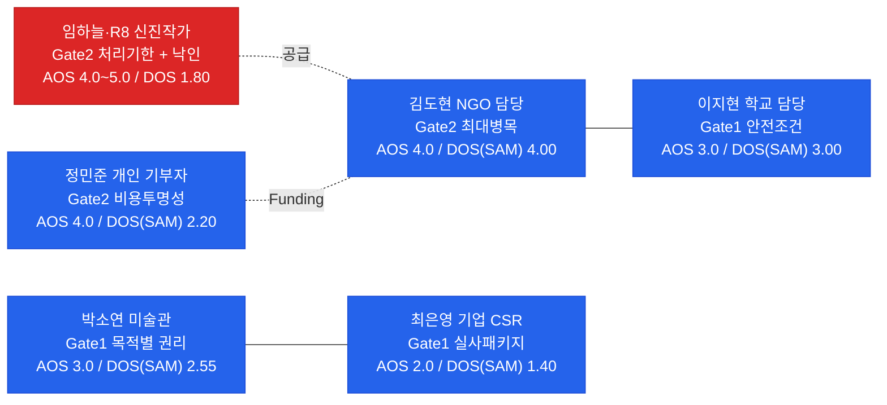
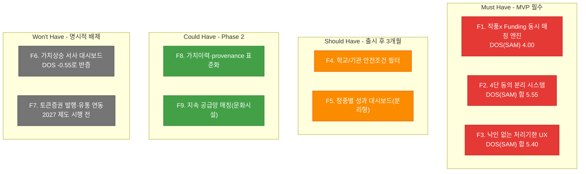
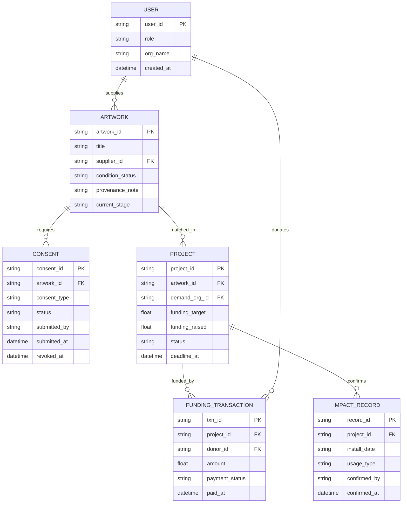
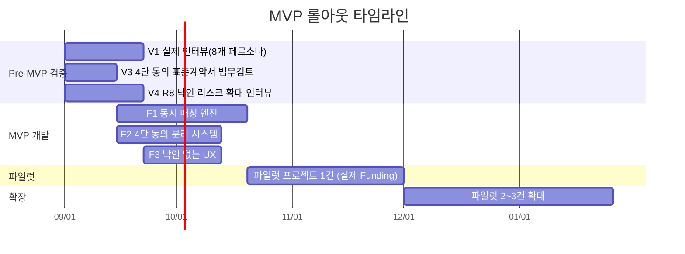

# 예술품 재분배 × 미술품 토큰증권 가치순환 플랫폼 PRD v0.1

- **Owner 팀:** Product & Engineering
- **최종 업데이트:** 2026-08-14
- **기반 문서:** [VPS Rooted V2.0](../09-value-proposition/value-proposition-sheet-03-art-redistribution-platform-v2.0-rooted.md)
- **방법론 출처:** [강사 09 - PRD 작성하기](https://wildmental.notion.site/09-PRD-Product-Requirement-Document-3b7d03212bd480adb9f6f0a51c974b05), 형식 출처: [PRD-From-VPS-Sample/03_PRD-Drafts/PRD_v0.1.md](https://github.com/wild-mental/PRD-From-VPS-Sample/blob/main/03_PRD-Drafts/PRD_v0.1.md)

---

## 1. 개요·목표

### 1-1. 문제 정의 (Pain 지표 포함)

이 사업은 미술품 토큰증권을 기획하다가 **가치가 충분히 발견되지 못한·미활용·보관한계 작품**의 순환 문제를 발견하며 시작됐다. 3면 시장(공급·수요·Funding) 구조상, 작품과 이전비용이 분리되어 움직이면 재분배 자체가 성립하지 않는다.

| Pain ID | Pain 내용 | 실패 지표(현 상태) | 출처 |
|---|---|---|---|
| **GATE2** | 작품 매칭과 이전비용(Funding) 확보가 분리되어 실행이 중단됨 (김도현, 임하늘) | DOS(SAM) 최고점 **4.00** — 다섯 개 독립 리서치 경로가 전부 최우선 공백으로 지목 | VPS §Ⅲ, §Ⅹ |
| **GATE1** | 재분배·기록활용·상업활용·증권연계 동의가 분리되지 않아 기관 승인이 중단됨 (박소연, 서재원, 윤태호) | AOS 3.0, DOS(SAM) 2.55(O09) | VPS §Ⅴ |
| **STIGMA** | '유휴·저평가·폐기' 언어가 공급자에게 낙인으로 작동, 참여 자체를 포기시킴 (R8) | DOS(SAM) 1.80(O15), 기존 36개 Pain에 없던 **신규 발견** | VPS §Ⅳ, §Ⅶ |
| **O08(제외)** | "내 기부=작품 가치상승" 서사 | DOS **−0.55**로 반증됨 — 이 PRD의 기능 범위에서 명시적으로 제외 | VPS §Ⅳ |

### 1-2. 목표 (Desired Outcome 수치화)

> **한 줄 비전:** *"가치가 충분히 발견되지 못해 보관 한계에 몰린 예술품에게 다음 쓰임을 만들고, 그 쓰임의 이력을 미술품 토큰증권 생태계와 다시 연결하는 3면 순환 플랫폼"*

| Desired Outcome | 현재(Baseline) | 목표(Target) | 측정 시점 | Baseline 실측 방법 |
|---|---|---|---|---|
| 작품 등록 → 매칭 확정까지 소요일 | 미실측(신규 서비스) | **≤ 21일** | 파일럿 프로젝트 첫 3건 | 파일럿 1건차 리드타임 직접 측정 후 확정 |
| Funding 목표액 대비 실제 조성률 | 미실측 | **100%**(파일럿 1건) | 파일럿 착수 후 4주 | 실제 모금 시도 결과 |
| 4단 동의 처리 리드타임 | 미실측(표준계약서 부재) | **≤ 14일**(법무 검토 포함) | 표준계약서 확정 후 첫 승인 건 | 법무 검토 완료 시점부터 실측 |
| 낙인 인식 지표(공급자 UX 언어 수용도) | 미실측(R8 표본 1명) | **≥ 70% 긍정**(5점 척도 ≥4점) | R8 확대 인터뷰(8명) 후 | 참여 포기 작가 재인터뷰 사전 설문 |
| 폐쇄루프 완료율(설치·활용 확인까지 닫힌 비율) | 0%(신규 서비스) | **≥ 80%**(파일럿 3건 기준) | MVP 파일럿 종료 시 | 프로젝트별 완결 여부 직접 카운트 |

### 1-3. 성공 지표

#### North Star KPI

| KPI | 정의 | 기준선 | 목표값 | 측정 주기 |
|---|---|---|---|---|
| **Closed-Loop Count** | 작품 등록 → 매칭 확정(작품+Funding 동시확보) → 설치·활용 확인까지 완결된 프로젝트 수 | 0건(신규 서비스) | **파일럿 3건 완결** | 프로젝트 단위 |

> ⚠️ 배송 건수가 아니라 **활용 확인까지 닫힌 건수**를 센다 — VPS 방향 B("배송이 아니라 실제 활용까지 완료로 센다") 원칙을 KPI 정의에 그대로 반영한 것.

#### 보조 KPI

| 카테고리 | KPI | 기준선 | 목표값 | 측정 주기 | 측정 경로 |
|---|---|---|---|---|---|
| **공급 확보** | 작품 등록 건수(공급자 유형별) | 0건 | **파일럿 기간 내 3점 이상** | 주간 | 등록 폼 제출 이벤트 로그 |
| **매칭 성사** | 등록 작품 중 Funding 동시확보로 매칭 성사된 비율 | 0%(출시 후 4주간 기준선 수립) | **≥ 50%** | 월간 | 매칭엔진 상태 전이 로그(등록→매칭중→매칭완료) |
| **Funding 조성** | 프로젝트당 이전비용 목표액 대비 실제 조성액 비율 | 0%(신규 서비스) | **≥ 90%** | 프로젝트별 | 결제/기부 PG 정산 데이터 |
| **동의 처리** | 4단 동의 제출→확정 리드타임 | 미실측 | **≤ 14일** | 건별 | 워크플로우 상태 타임스탬프 |
| **완결·활용 확인** | 설치·활용 확인 제출률 (수요기관) | 0% | **≥ 80%** | 프로젝트별 | 수요기관 활용확인 폼 제출 이벤트 |
| **재참여** | 1차 재분배 완료 후 공급자 재등록률 | 0%(신규 서비스) | **≥ 20%**(6개월 내) | 반기 | 공급자 계정 재등록 로그 |

---

## 2. 사용자와 페르소나

### 2-1. 핵심 페르소나 요약

### 2-2. 페르소나별 여정 Pain / Needs 링크

| 페르소나 | Gate 단계 | 핵심 Needs | AOS | DOS(SAM) |
|---|---|---|:---:|:---:|
| **김도현(NGO)** | Gate 2 (최대 병목) | 작품과 이전비용 재원을 동시에 확보 | 5.0 | 4.00 |
| **이지현(학교)** | Gate 1 | 학교 공간·학생 안전에 맞는 작품만 사전 필터링 | 5.0 | 3.00 |
| **박소연(미술관)** | Gate 1 | 재분배·기록·상업활용 동의를 목적별로 분리 | 5.0 | 2.55 |
| **정민준(개인 기부자)** | Gate 2 | 기부 전 비용 사용처 확인, 가치상승 서사는 원치 않음(O08 반증) | 5.0 | 2.20 |
| **윤태호(갤러리)** | Gate 1 | 후속 수익배분 원칙을 참여 시점에 사전 제시 | 5.0 | 1.80 |
| **임하늘(신진작가)** | Gate 2 | 폐기 전 확정 가능한 처리 기한 | 5.0 | 1.80 |
| **R8(참여 포기 작가, 신규)** | Gate 2 + 낙인 | 낙인 없이 재분배에 참여(순환 가능 작품 프레이밍) | 5.0 | 1.80 🆕 |
| **최은영(기업 CSR)** | Gate 1 | 내부 결재용 실사 패키지를 한 번에 확보 | 5.0 | 1.40 |

> **후순위(Phase 2 이후, 배제 아님):** 한유진(미술대학, DOS 니치) · 오수진(지역문화시설, 구조적 공급망 문제) · 서재원(기관자산, Gate1 니치) — VPS §Ⅲ의 "니치 3종"과 대응.
> **표본 확대 필요:** R8은 JTBD 모의 응답 표본 1명 기반 신규 발견이므로, MVP 착수 전 8명 이상으로 확대 인터뷰가 §7-3 리스크 R3의 선행조건이다.

---

## 3. 사용자 스토리와 수용 기준 (AC, Acceptance Criteria)

### Story 1: 작품×Funding 동시 매칭 (NGO/학교 — Gate 2 핵심 엔진)

> **As a** 문화취약지역 NGO 담당(김도현) 또는 학교 문화예술 담당(이지현),
> **I want** 작품 매칭과 이전비용(운송·보험·설치) Funding 조성 현황을 하나의 프로젝트 화면에서 동시에 확인하고 싶다,
> **So that** 비용 미확보로 인한 중도좌초 없이, 100% 확정된 프로젝트만 신청·실행할 수 있다.

| AC | Given | When | Then | 측정 임계치 |
|---|---|---|---|---|
| **AC1 — 동시 매칭 조건** | 수요기관이 작품 매칭을 요청한 상태 | 이전비용 Funding 목표액이 아직 100% 조성되지 않았으면 | 프로젝트 상태가 "매칭 대기"로 유지되고 "실행 승인" 버튼이 비활성화된다 | Funding 100% 미만 시 실행 승인 노출률 **0%** |
| **AC2 — 동시 확보 시 자동 실행 전환** | 작품 매칭과 Funding 목표액 100% 조성이 모두 완료된 상태 | 시스템이 두 조건을 동시에 감지하면 | 프로젝트 상태가 자동으로 "실행 확정"으로 전환되고 관련 당사자(공급자·수요기관·기부자) 전원에게 알림이 발송된다 | 상태 전환 지연 **≤ 5분**, 알림 발송 성공률 **≥ 99%** |
| **AC3 — 프로젝트 비용 투명 공개** | 기부자가 특정 프로젝트 페이지에 진입한 상태 | 페이지가 로드되면 | 운송·보험·설치·플랫폼 운영비 각 항목의 목표액과 현재 조성액이 항목별로 표시된다 | 항목별 조성 현황 표시 정확도 **100%**, 갱신 주기 **≤ 1시간** |
| **AC4 — Funding 미달 시 프로젝트 자동 보류** _(Sad Path)_ | 프로젝트 등록 후 **60일**(SOM 파일럿 규모·물류 준비기간 고려, §7-2 R1 대응) 내 Funding 목표액이 미달된 상태 | 기한이 도래하면 | 프로젝트가 "보류" 상태로 전환되고, 공급자·기부자 전원에게 사유와 함께 알림이 발송되며 기부금은 **에스크로 계정에서 전액 미집행 상태로 보관**되다가 환불 또는 타 프로젝트 이전 선택지가 제공된다 | 보류 전환 정확도 **100%**, 기부자 환불/이전 처리 **≤ 7일**, 미집행 자금의 임의 사용 **= 0건** |
| **AC5 — 작품 매칭 실패 시 Funding 보호** _(Sad Path)_ | Funding은 목표액을 달성했으나 작품 측 사정(작가 동의 철회 등)으로 매칭이 취소된 상태 | 공급 측 취소가 발생하면 | 조성된 기부금은 자동 집행되지 않고, 기부자에게 대체 프로젝트 안내 또는 환불 선택권이 즉시 제공된다 | 자동 집행 오류율 **= 0%**, 안내 발송 **≤ 24시간** |

### Story 2: 4단 동의 분리 등록 (공급기관 — Gate 1)

> **As a** 미술관 컬렉션 담당(박소연) 또는 갤러리 작품관리 담당(윤태호),
> **I want** 재분배 동의·기록(이미지) 활용 동의·상업활용 동의·증권연계 동의를 각각 별도 필드와 별도 결재로 제출하고 싶다,
> **So that** "재분배 승인"이 "상업화·증권화 승인"으로 자동 확대 해석되지 않고, 내부 결재선을 그대로 유지하며 참여할 수 있다.

| AC | Given | When | Then | 측정 임계치 |
|---|---|---|---|---|
| **AC1 — 4단 동의 독립 제출** | 공급기관 담당자가 작품 등록 화면에 진입한 상태 | 동의 섹션이 렌더링되면 | 재분배/기록활용/상업활용/증권연계 4개 동의 항목이 각각 독립된 체크박스와 서명란으로 표시되며, 하나의 동의가 다른 동의를 자동으로 체크하지 않는다 | 동의 항목 간 교차 자동체크 발생률 **= 0%** |
| **AC2 — 목적별 결재선 분리** | 상업활용 동의만 별도 결재가 필요한 기관 정책이 설정된 상태 | 담당자가 재분배 동의만 제출하면 | 상업활용·증권연계 동의는 "미제출" 상태로 남고, 재분배 승인만으로 작품이 매칭 후보로 노출된다 | 미제출 항목의 오노출률 **= 0%** |
| **AC3 — 동의 범위 열람 이력** | 동의가 제출된 이후 | 담당자가 "동의 이력 확인"을 조회하면 | 각 동의 항목의 제출 시각·제출자·범위(재분배/기록/상업/증권)가 감사 로그로 표시된다 | 로그 조회 응답 **≤ 2초** |
| **AC4 — 동의 철회 처리** _(Sad Path)_ | 작품이 아직 매칭 확정 전 상태에서 공급기관이 특정 동의(예: 상업활용)를 철회하는 상태 | 철회를 제출하면 | 해당 동의에 의존하던 후속 기능(상업활용 매칭 후보 노출 등)만 즉시 비활성화되고, 재분배 동의 등 다른 동의는 영향받지 않는다 | 철회 반영 시간 **≤ 1시간**, 무관 동의 오영향률 **= 0%** |
| **AC5 — 매칭 확정 후 동의 철회 요청** _(Sad Path)_ | 작품이 이미 매칭 확정되어 이동 중인 상태에서 동의 철회 요청이 들어온 상태 | 철회 요청이 제출되면 | 즉시 자동 처리되지 않고, "운영팀 검토 필요" 상태로 전환되어 담당자에게 24시간 내 연락하도록 안내한다 | 자동 즉시철회 오류율 **= 0%**, 안내 발송 **≤ 1시간** |

### Story 3: 낙인 없는 공급자 등록 (작가 — Gate 2 + 낙인 리스크)

> **As a** 보관 한계에 몰린 신진 작가(임하늘) 또는 과거 무료 기증 경험이 있는 작가(R8),
> **I want** 작품을 "유휴·저평가·폐기 대상"이 아니라 "순환 가능 작품"으로 등록하고, 폐기 전 확정된 매칭 기한을 확인하고 싶다,
> **So that** 낙인 없이 참여하면서도 무기한 대기를 피할 수 있다.

| AC | Given | When | Then | 측정 임계치 |
|---|---|---|---|---|
| **AC1 — 낙인 배제 UX 언어** | 작가가 작품 등록 화면 전체를 탐색하는 상태 | 어떤 화면 텍스트든 렌더링되면 | "유휴", "저평가", "폐기 대상", "안 팔린 작품" 등의 표현이 공급자 대상 화면에 **0건** 노출되고, 대신 "순환 가능 작품", "새로운 전시처를 찾는 작품"으로 표기된다 | 금지어 노출 건수 **= 0건/페이지** (QA 체크리스트 매 릴리스 검수) |
| **AC2 — 처리기한 확정 표시** | 작가가 작품을 등록한 상태 | 등록이 완료되면 | 매칭 시도 기한(예: 등록 후 30일)이 명시적으로 표시되고, 기한 도래 전 알림이 발송된다 | 기한 표시 누락률 **= 0%**, 알림 발송 **≤ 기한 3일 전** |
| **AC3 — 활용 이력의 프레이밍** | 작품이 재분배되어 설치·활용된 이후 | 작가가 활용 이력을 확인하면 | 이력은 "새로운 쓰임의 기록"으로 표시되며, 가격·가치상승과 연결되는 어떤 문구도 노출되지 않는다(O08 반증 반영) | 가치상승 연관 문구 노출 **= 0건** |
| **AC4 — 기한 내 미매칭 시 처리** _(Sad Path)_ | 확정된 처리 기한이 도래했으나 매칭이 성사되지 않은 상태 | 기한이 만료되면 | 작가에게 "기한 연장" 또는 "등록 철회" 중 선택하도록 안내하며, 자동으로 폐기 관련 문구를 노출하지 않는다 | 자동 부정적 문구 노출 **= 0건**, 안내 발송 **≤ 1시간** |
| **AC5 — 낙인 인식 피드백 수집** _(Sad Path 대응)_ | 작가가 등록 과정에서 특정 문구에 불편함을 신고하는 상태 | "표현 신고" 버튼을 제출하면 | 접수 확인과 함께 UX 라이팅팀에 즉시 전달되고, 신고 누적 건수가 주간 리포트에 집계된다 | 접수 응답 **≤ 3초**, 주간 리포트 반영률 **100%** |

### Story 4: 개인 기부자의 투명한 Funding 참여 (정민준)

> **As a** 개인 기부자(정민준),
> **I want** 내 기부금이 어떤 작품의 어떤 이전비용 항목(운송/보험/설치)에 쓰였고, 어떤 지역·기관에서 어떤 문화 경험을 만들었는지 확인하고 싶다,
> **So that** 기부와 "작품 가치상승"이 뒤섞이지 않은 상태로, 내 기부의 사회적 결과를 신뢰하고 확인할 수 있다.

| AC | Given | When | Then | 측정 임계치 |
|---|---|---|---|---|
| **AC1 — 결과 확인 알림** | 기부자가 후원한 프로젝트가 설치·활용 확인까지 완료된 상태 | 수요기관이 활용확인을 제출하면 | 기부자에게 "당신의 기부가 만든 문화 경험" 요약(사진·수령기관·활용 방식)이 이메일/앱 알림으로 발송된다 | 발송 지연 **≤ 24시간** |
| **AC2 — 가치상승 서사 배제** | 기부자가 결과 확인 페이지에 진입한 상태 | 페이지가 로드되면 | 문화 경험·수령기관 정보만 표시되고, 작품 가격·가치상승과 관련된 어떠한 지표도 노출되지 않는다(O08 반증 반영) | 가치상승 관련 지표 노출 **= 0건/페이지** |
| **AC3 — 결제 정보 최소 수집** | 기부자가 결제를 진행하는 상태 | 결제 폼이 렌더링되면 | PG(결제대행) 위탁 방식으로 처리되어, 플랫폼은 카드번호 등 민감 결제정보를 직접 저장하지 않는다 | 민감정보 직접 저장 건수 **= 0건** |
| **AC4 — 결제 실패 시 안내** _(Sad Path)_ | 기부자가 결제를 시도했으나 PG사 오류로 실패한 상태 | 실패 응답을 받으면 | 실패 사유(잔액부족/카드오류 등 PG 표준 코드 기반)를 안내하고, 재시도 또는 타 결제수단 선택지를 제공한다 | 실패 안내 노출 **≤ 3초** |
| **AC5 — 프로젝트 취소 시 환불** _(Sad Path)_ | 기부자가 후원한 프로젝트가 Funding 미달(Story1 AC4)로 취소된 상태 | 취소가 확정되면 | 기부자에게 환불 또는 타 프로젝트 이전 선택 UI가 자동 노출되고, 선택에 따라 처리된다 | 선택 UI 노출 **≤ 1시간**, 환불 처리 완료 **≤ 7영업일** |

---

## 4. 기능 요구사항 (Functional)

### 4-1. MoSCoW 우선순위 매핑

### 4-2. Must-Have 기능 상세 및 대안 대비 가치

| Feature | 구현 핵심 | 기존 대안과의 비교(차별 가치) | 근거 |
|---|---|---|---|
| **F1. 동시 매칭 엔진** | 작품 등록·Funding 조성 상태를 단일 프로젝트 단위로 결합, 100% 동시확보 시에만 실행 승인 | Art Bridges·나눔미술은행은 부분 대체재(운송비 지원)이나 학교·복지·NGO까지 낮춘 참여문턱 + 시민·기업 Funding + 작품ID 결과기록의 통합은 8개 경쟁사 조사에서 미확인 | VPS §Ⅱ-1.2, §Ⅲ (O05 DOS 4.00) |
| **F2. 4단 동의 분리** | 재분배/기록/상업활용/증권연계 동의를 독립 필드·결재로 관리 | 미술은행은 인수증·상태확인서는 갖췄으나 목적별 동의 분리 규격은 없음 | VPS §Ⅴ (O09·O13·O14 DOS 합 5.55) |
| **F3. 낙인 없는 UX** | 금지어 필터링(QA 체크리스트) + 처리기한 확정 표시 + 활용이력의 중립적 프레이밍 | 경쟁사 8곳 어디도 "공급자 낙인" 문제를 다루지 않음 — R8 JTBD가 발견한 신규 공백 | VPS §Ⅳ, §Ⅶ (O01·O02·O15 DOS 합 5.40) |

---

## 5. 비기능 요구사항 (NFR)

### 5-1. 성능

| 항목 | 기준 | 비고 |
|---|---|---|
| 프로젝트 매칭 상태 갱신 | **p95 ≤ 5분** (Funding 100% 달성→실행확정 자동전환) | Story1 AC2 |
| 동의 이력 조회 응답 | **p95 ≤ 2초** | Story2 AC3 |
| 활용확인 알림 발송 | **≤ 24시간** | Story1 AC1, Story4 AC1 |
| 전체 페이지 LCP | **≤ 2,500ms** | 모바일 웹 기준 |
| **동시 접속 부하 기준** | **동시 접속 50명(피크시 150명)** | 초기 파일럿 규모(공급자·수요기관·기부자 합산 예상 사용자 수 기반 추정) |
| **부하 테스트 주기** | **출시 전 1회 + 파일럿 확대 시 1회** | 동시 접속 50/150명 시나리오 각 15분 실행. p95/에러율 기록 |

### 5-2. 신뢰성

| 항목 | 기준 |
|---|---|
| 월간 서비스 가용성 | **≥ 99.0%** |
| Funding 자동 집행 오류율 | **= 0%** (Story1 AC5 — 매칭 실패 시 기부금 자동 집행 금지) |
| 동의 교차 자동체크 오류율 | **= 0%** (Story2 AC1) |
| 데이터 백업 주기 | **일 1회** (RPO ≤ 24h) |

### 5-3. 보안/개인정보/법적 준수/비용

| 항목 | 기준 | 측정 경로 |
|---|---|---|
| 결제·기부 정보 수집 | **PG 위탁 처리 원칙** — 카드번호 등 민감정보 직접 저장 금지 | Story4 AC3, 코드 리뷰 체크리스트 |
| 기부금 세무 처리 | 지정기부금단체 요건 검토 완료 후 영수증 발급 기능 활성화 | 법무 검토 완료 확인서 |
| 작품 이미지·개인정보 | 최소 수집 원칙 — 작품 메타데이터·동의 정보·연락처만 | - |
| HTTPS | **전 구간 TLS 1.2+** | SSL Labs A등급 확인(출시 전 + 분기 1회) |
| 토큰증권 관련 표현 | F6·F7(Won't) 관련 문구는 공급자·기부자 대상 화면에 **노출 금지** (VPS §Ⅶ-2 원칙) | QA "금지 표현" 체크리스트 |
| MVP 월 인프라 비용 | **≤ 150만 원** (파일럿 규모 원칙) | 클라우드 비용 대시보드 월간 리포트 (태그: `project=art-redistribution-mvp`). 초과 시 운영 채널 자동 알림 |

### 5-4. 모니터링 항목

| 구분 | 항목 | 알림 기준 |
|---|---|---|
| **로그** | 매칭 상태 전이, 결제/기부 성공·실패, 동의 제출·철회 | 5xx 에러율 > 1% 시 알림 |
| **대시보드** | Closed-Loop Count, Funding 조성률, 동의 처리 리드타임 | 주간 리뷰 |
| **알림** | Funding 미달 기한 임박, 동의 철회(매칭 확정 후), 낙인 표현 신고 | 즉시 알림(운영 담당자) |

---

## 6. 데이터/인터페이스 개요

### 6-1. 핵심 엔터티

### 6-2. 외부/내부 API 개요

| API | 유형 | 입력 | 출력 | 제약 사항 |
|---|---|---|---|---|
| **PG(결제대행) API** | 외부(REST) | 결제수단, 금액, 프로젝트ID | 결제 성공/실패, 거래ID | 민감정보는 PG 위탁 처리(§5-3) |
| **전자서명 API** | 외부(REST) | 동의서 유형, 서명자 정보 | 서명 완료 인증서 | 4단 동의 각각 독립 서명 필요(Story2 AC1) |
| **물류/운송 파트너 API** _(연동 검토)_ | 외부(REST) | 작품 규격, 출발/도착지 | 견적, 운송 상태 | MVP는 수동 협의로 대체 가능, Phase 2 자동화 |
| **매칭 엔진 내부 API** | 내부(REST) | artwork_id, project_id | 매칭 상태(대기/확정/보류) | 응답 ≤ 2초, 상태 전이 ≤ 5분(§5-1) |
| **동의 관리 내부 API** | 내부(REST) | artwork_id, consent_type | CONSENT 배열 | 캐시 없음 — 항상 최신 상태 조회(감사 요건) |

---

## 7. 범위(In/Out), 리스크/가정/의존성

### 7-1. 범위

| In Scope (MVP) | Out of Scope (명시적 배제) |
|---|---|
| F1. 작품×Funding 동시 매칭 엔진 | F6. 가치상승 서사 대시보드(반증됨) |
| F2. 4단 동의 분리 시스템 | F7. 토큰증권 발행·유통 연동(2027 제도 시행 전) |
| F3. 낙인 없는 처리기한 UX | 자동 물류 견적 API 연동(수동 협의로 대체) |
| PG 위탁 결제·기부 | 개인화 추천, 커뮤니티/리뷰 게시판 |
| 파일럿 규모(공급자·수요기관·기부자 각 소수) | 국제(해외) 재분배·통관 처리 |

### 7-2. 리스크

> **스코어 해석:** ≥15 Critical, 8~14 High, 4~7 Medium, ≤3 Low

| # | 리스크 | 확률(1~5) | 영향(1~5) | 점수 | 대응 전략 |
|---|---|:---:|:---:|:---:|---|
| **R1** | **Funding 미달** — 개인·기업의 실제 지불 의사가 챕터 04~08 전체에서 미검증 | **4** | **5** | **20** (Critical) | ①**에스크로 원칙** — 목표액 100% 미만이면 어떤 금액도 집행하지 않는다(AC1). ②파일럿 1건에서 실제 모금 시도로 최우선 검증(§8 H1). ③60일 내 미달 시 프로젝트 보류·환불(AC4), 사업모델 재검토 트리거 |
| **R2** | **동의 표준계약서 부재** — 4단 동의 분리가 법무 검토 없이는 실효성 없음 | **3** | **5** | **15** (Critical) | 미술은행 기존 서식 참고 + 법무 자문 선행, MVP 착수 전 확정 |
| **R3** | **낙인 UX 가설 과잉해석** — R8 표본 1명 기반 | **3** | **3** | **9** (High) | 참여 포기 작가 8명 이상 확대 인터뷰 후 UX 언어 확정(§8 H4) |
| **R4** | **작품 손상·보험 사고** — 실물 이동 중 훼손 시 책임 소재 불명확 | **2** | **4** | **8** (High) | 표준 보험 파트너십 + 상태확인서(인수/설치) 의무화 |
| **R5** | **기부금 세무·법적 요건 미비** — 지정기부금단체 요건 미충족 시 영수증 발급 불가 | **2** | **4** | **8** (High) | 법무 검토 완료 전 기부금 영수증 발급 기능 비활성화 |
| **R6** | **토큰증권 규제 변경** — 기초자산 적격요건 등 세부기준 미확정(2026-08-13 기준) | **2** | **3** | **6** (Medium) | F7은 Won't로 명시 배제, 시행 시점 재검토 |

### 7-3. 가정 및 의존성

| # | 가정/의존성 | 검증 방안 | 시한 |
|---|---|---|---|
| **A1** | 개인·기업 기부자가 "작품+비용 동시 매칭" UX에서 실제로 결제까지 완료한다 | 파일럿 1건 실제 모금(§8 H1) | MVP 착수 후 4주 |
| **A2** | 공급기관이 4단 분리 동의를 번거로움 없이 완료한다 | 동의 처리 리드타임 실측(§1-2) | 표준계약서 확정 후 |
| **A3** | "순환 가능 작품" 프레이밍이 실제로 R8류 이탈 작가의 참여 장벽을 낮춘다 | R8 확대 인터뷰(§8 H4) | MVP 착수 전 |
| **D1** | PG(결제대행)사가 기부금 정산과 환불(Story1 AC4/5)을 표준 API로 지원 | PG사 계약 조건 확인 | MVP 착수 전 |
| **D2** | 미술 손상 보험 파트너십 체결 | 보험사 협의 | MVP 착수 전 |

---

## 8. 실험/롤아웃/측정

### 8-1. 롤아웃 계획

### 8-2. 실험 가설/측정/성공 기준

| # | 실험 가설 | 실험 설계 | 측정 KPI | 성공 기준 |
|---|---|---|---|---|
| **H1** | 개인·기업 기부자가 "작품+비용 동시 매칭" 구조에서 실제 결제까지 완료한다 | 파일럿 1건 실제 모금 시도 (목표액 100% 도달 여부 관찰). ⚠️ **n=1 파일럿은 통계적 일반화가 불가능한 탐색적 검증**이다 — 성공해도 "재현되는가"는 파일럿 2~3건(§8-1)에서 재확인한다 | Funding 조성률, 결제 완료 건수 | 조성률 **100%**, 미달 시 R1 재검토 트리거 |
| **H2** | 4단 동의 분리가 공급기관의 결재 마찰을 줄인다 | 표준계약서 확정 후 첫 승인 건 리드타임 측정 | 동의 처리 리드타임 | **≤ 14일** |
| **H3** | "순환 가능 작품" 프레이밍이 참여 포기 작가의 재참여 의향을 높인다 | R8 확대 인터뷰(n=8) 사전/사후 설문. ⚠️ **n=8은 방향성 확인용 정성 지표**이며 통계적 유의성 검정에는 표본이 부족하다 — 긍정적이면 Public 단계에서 n≥30으로 정량 재검증한다 | 표현 수용도(5점 척도) | **≥ 4.0/5**, 긍정 응답 **≥ 70%**(방향성 지표) |
| **H4** | 폐쇄루프(설치·활용 확인)가 실제로 완결된다 | 파일럿 3건 추적 | Closed-Loop Count, 완결률 | **완결률 ≥ 80%** |

### 8-3. 베타 채널 설계

| 단계 | 대상 | 규모 | 목적 |
|---|---|---|---|
| **Alpha**(내부) | 팀 구성원 + 협력 NGO 1곳 | 소수 | 크리티컬 버그, 매칭 흐름 검증 |
| **Pilot 1** | 작가 1명 → 기부자 다수 → 학교/NGO 1곳 | 1 프로젝트 | H1·H2·H4 정면 검증 |
| **Pilot 2~3** | 확대 공급기관·수요기관 | 2~3 프로젝트 | Closed-Loop Count 목표 달성 확인 |

---

## 9. 근거 (Proof)

### 9-1. 다섯 경로 수렴 (VPS §Ⅹ 인용)

| 경로 | 발견 | 연결 Feature |
|---|---|---|
| TAM-SAM-SOM | SAM이 TAM의 0.026% — 통합 카테고리 자체가 공백 | F1 |
| 경쟁 AOS 재판정 | P02·P14(매칭 시점)는 조사 후에도 견고 | F1 |
| 비어 있는 세 자리 | 8개 경쟁사 중 작품ID 폐쇄루프 통합 없음 | F1, F2 |
| JTBD 모의 인터뷰 | O05 DOS 1위 유지, O15 신규 발견 | F1, F3 |
| 외부 실측 | Art Bridges·나눔미술은행 모두 비용지원을 필수 설계요소로 채택 | F1 |

### 9-2. AOS-DOS 매트릭스 (VPS §Ⅲ 인용)

| Pain ID | AOS | DOS(SAM) | 연결 Feature |
|---|:---:|:---:|---|
| O05(김도현, 작품+비용 동시확보) | 4.0 | **4.00** | F1 |
| O09(박소연, 목적별 동의분리) | 3.0 | **2.55** | F2 |
| O15(R8, 낙인 없는 참여) 🆕 | 4.0 | **1.80** | F3 |
| O08(정민준, 가치상승 서사) | 0.8 | **−0.55** ⛔반증 | F6(Won't) |

### 9-3. JTBD 인터뷰 (VPS §Ⅳ 인용)

> **통계적 한계:** 이 인터뷰는 모의 응답(가정 위의 가정)이며 실제 인터뷰 0건이다. §8 V1(실제 인터뷰 8개 페르소나)에서 재현 여부를 확인하기 전까지 이 PRD의 모든 정량 목표는 **검증 대상 가설**로 취급한다.

| 인사이트 | 대표 인용구(모의) | 연결 Feature |
|---|---|---|
| 작품+비용 동시성이 최우선 | *"운송·설치가 무료여야 진짜 무료죠"*(김도현) | F1 |
| 낙인이 폐기보다 큰 장벽일 수 있음 | *"'재분배 우선 작품'이 제 작품 등급표처럼 느껴졌어요"*(R8) | F3 |
| 가치상승 서사는 신뢰를 깎음 | *"그걸 기부 성과라고 하면 이상해요"*(정민준) | F6(Won't) 근거 |

### 9-4. 추정 데이터 실측 전환 로드맵

| 추정 항목 | 현재 값 | 실측 전환 방법 | 실험 연결 | 시한 |
|---|---|---|---|---|
| Funding 실제 지불 의사 | 미검증(가정) | 파일럿 1건 실제 모금 | **H1** | MVP 착수 후 4주 |
| 동의 처리 리드타임 | 미실측 | 표준계약서 확정 후 첫 건 실측 | **H2** | 표준계약서 확정 후 |
| 낙인 인식 지표 | R8 표본 1명 | 8명 확대 인터뷰 | **H3** | MVP 착수 전 |
| 방향 C 핵심가설(활용이력→가치평가) | 핵심 미검증 가설 | 가치평가 전문가 최소 3인 인터뷰 | VPS §Ⅹ V6 | MVP 출시 후 6개월 |

---

> **다음 단계 (Next Actions):**
> 1. **법무팀:** 4단 동의 표준계약서 + 기부금 지정단체 요건 검토 (§7-2 R2·R5)
> 2. **사업팀:** 파일럿 1건(작가 1명 → 기부자 → 학교/NGO 1곳)의 실제 Funding 조성 착수 (§8 H1)
> 3. **리서치팀:** V1(실제 인터뷰) + R8 확대 인터뷰(§8 H3) 착수
> 4. **기획팀:** F1~F3 핵심 화면 와이어프레임 도출
