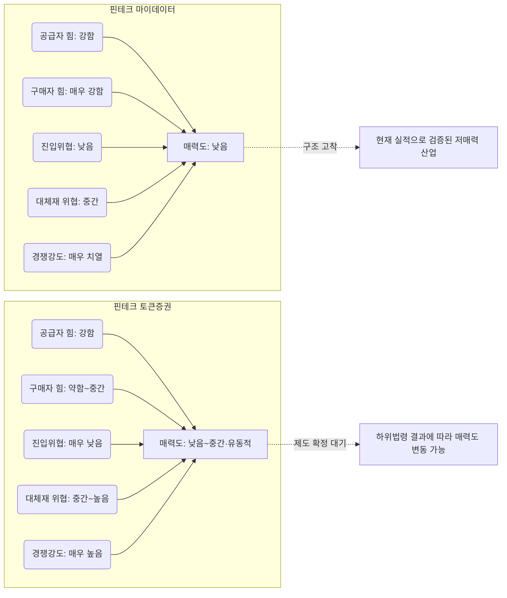

# 비교 분석: 핀테크 마이데이터 vs 핀테크 토큰증권
## 포터의 다섯 가지 힘 기준 산업 매력도 비교

> **비교 대상**: [분석1_핀테크_마이데이터_5가지힘_분석.md](분석1_핀테크_마이데이터_5가지힘_분석.md) · [분석2_핀테크_토큰증권_5가지힘_분석.md](분석2_핀테크_토큰증권_5가지힘_분석.md)
> **기준일**: 2026-08-06

---

## 1. 힘의 강도 비교표

| 힘 | 마이데이터 | 토큰증권(STO) | 어느 쪽이 더 유리한가 |
|---|---|---|---|
| 공급자의 힘 | 강함 (공급자=경쟁자, 전방통합) | 강함 (5% 직접보유 요건, 정부가 초대형 공급자화) | 대등 — 성격은 다르지만 둘 다 신규 사업자에게 불리 |
| 구매자의 힘 | **매우 강함** (전환비용 0, 무료 일변도) | **약함~중간** (개인 분산·소액, 규제로 수요 자체 제한) | **토큰증권 우위** |
| 신규 진입자의 위협 | 낮음 (트래픽 선점, 실질 봉쇄) | **매우 낮음** (인가 자체가 NXT·KDX 2곳으로 마감) | **토큰증권 우위** (진입장벽이 더 견고) |
| 대체재의 위협 | 중간 (은행 채널·AI 로보어드바이저) | 중간~높음 (비증권형 조각투자·가상자산) | 마이데이터 소폭 우위 |
| 산업 내 경쟁 강도 | **매우 치열** (철수 러시, 3년 누적손실 3,241억) | 매우 높음 (인프라 과잉이나 아직 대규모 철수는 없음) | **토큰증권 소폭 우위** |
| **현재 수익성 검증 여부** | 검증됨 — **구조적 적자로 검증** (뮤직카우식 성공사례 없음, 대부분 적자) | 미검증 — 아직 발행 실적 자체가 적어 판단 불가 | 토큰증권은 "나쁨이 확정되지 않은" 상태 |

---

## 2. 핵심 차이: "무엇이 산업을 짓누르는가"가 다르다

### 마이데이터 — 구매자가 산업을 무너뜨리는 구조
마이데이터의 근본 문제는 **구매자(소비자)가 지불할 의사가 없다**는 데 있다. 전환비용이 사실상 0에 가깝고(1인당 평균 3.5개 앱 동시 사용), 서비스 차별화가 어렵다 보니 소비자는 최고의 무료 서비스만 골라 쓴다. 여기에 공급자(은행)마저 전방통합으로 직접 경쟁자가 되면서, **가치사슬의 양 끝(공급자·구매자)이 동시에 사업자를 압박하는 협공 구조**다. 이미 3년간 3,241억원의 누적 손실로 이 구조가 실증되었다.

### 토큰증권 — 진입장벽이 산업을 지키는 구조 (단, 아직 열매가 없다)
토큰증권은 반대로 **진입장벽이 이례적으로 견고**하다는 것이 특징이다. 장외거래소 인가가 NXT·KDX 2곳으로 사실상 마감되고, 발행인 계좌관리기관 등록 요건(자본금 10억+8개 요건)이 스타트업 단독 진입을 막으며, 카사·펀블 같은 기존 혁신금융 트랙 사업자들은 오히려 폐업하는 중이다. 즉 **"이미 자리 잡은 소수(대형 증권사 8곳 + 거래소 2곳)"에게는 경쟁이 구조적으로 제한된 과점 시장**이 만들어지고 있다. 다만 이는 아직 상품(기초자산) 부족과 하위법령 미확정으로 인해 **수익으로 실현되지 않은 잠재력**일 뿐이다.

### 시간축의 차이가 결정적이다
- 마이데이터는 **제도가 이미 정착된 성숙 산업**이라 5가지 힘의 결과가 실적(3년 누적 손실)으로 이미 드러나 있다. 지금 진입해도 이 구조를 뒤집을 변수가 보이지 않는다.
- 토큰증권은 **제도가 만들어지는 중인 초기 산업**이라 5가지 힘이 "누구에게 유리하게 고정될지"가 아직 결정되지 않았다. 2027-02-04 시행과 하위법령 확정이 실제 수익성을 가를 분수령이다.

---

## 3. 산업 매력도 최종 비교

| 항목 | 마이데이터 | 토큰증권(STO) |
|---|---|---|
| 현재 시점 매력도 | 낮음 (실증된 구조적 적자) | 낮음~중간 (미검증, 인프라 과잉) |
| 향후 3년 매력도 전망 | 낮음 유지 가능성 높음 (구조 개선 신호 없음) | **상승 가능성** (하위법령 확정 + 과점 구조 정착 시) |
| 신규 진입 난이도 | 형식적으로 쉬우나 실질적으로 매우 어려움(슈퍼앱과 경쟁) | 형식·실질 모두 매우 어려움(라이선스 자체가 안 나옴) |
| "지금 들어간다면" 리스크 | 이미 슈퍼앱 3파전(토스·카카오·네이버)에 후발 진입 | 인가 자체를 못 받을 가능성이 높음 — 소싱·자문형 틈새만 가능 |
| 승자에게 돌아가는 몫 | 제한적 (무료 서비스 구조상 승자도 저마진) | 잠재적으로 큼 (진입장벽이 향후 마진을 보호) |

---

## 4. 전략적 시사점

1. **직접 사업자로 진입하는 옵션이라면 토큰증권 쪽이 장기적으로 더 매력적**이다. 마이데이터는 이미 승자(토스·카카오페이)가 굳어졌고 그 승자조차 저마진 구조에 갇혀 있는 반면, 토큰증권은 아직 승자가 완전히 정해지지 않았고 일단 자리를 잡으면(대형 증권사 8곳+거래소 2곳 중 하나와의 제휴/틈새 진입) 진입장벽이 보호막이 되어줄 잠재력이 있다.
2. **다만 토큰증권은 "언제 좋아지는가"에 강하게 베팅하는 것**이다 — 하위법령이 계속 지연되고 있고(7월→8월 재연기), 비금전신탁수익증권의 신탁 근거 입법도 국회 계류 중이라 카사·펀블처럼 제도 공백으로 먼저 무너질 리스크가 상존한다.
3. **직접 라이선스 사업자가 아니라 "공급자/파트너"로 포지셔닝하는 전략**이라면 두 산업 모두 유사한 결론에 도달한다 — 마이데이터에서는 은행·카드사에 데이터/AI 분석을 파는 B2B, 토큰증권에서는 증권사에 기초자산·AI 밸류에이션을 공급하는 옵션 C·D 경로([K콘텐츠IP토큰증권_사업기획서_초안.md](https://github.com/ahalenin12-art/business_research/blob/main/K콘텐츠IP토큰증권_사업기획서_초안.md) 참조)가 진입장벽 없이 두 산업의 병목(구매자 무료화, 상품 부족)을 우회하는 공통 해법이다.
4. **두 산업을 하나의 관점으로 묶으면**: 한국 핀테크의 최근 라이선스 기반 산업들은 "라이선스는 상대적으로 쉽게 내주되, 실제 사업 성패는 데이터/자본/트래픽 우위를 가진 소수가 결정한다"는 패턴을 공유한다. 마이데이터가 그 패턴의 결말(구조적 적자)을 보여주는 선행 사례라면, 토큰증권은 아직 그 결말이 쓰이는 중인 산업이다.

---

## 5. 구조도

